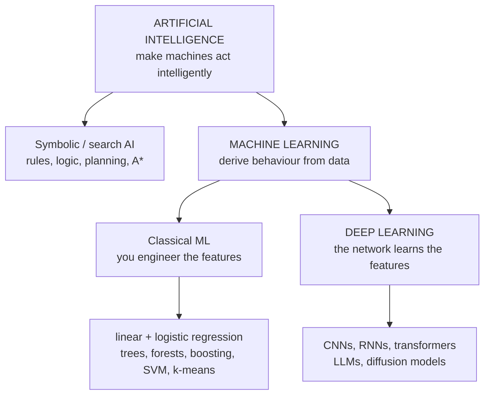
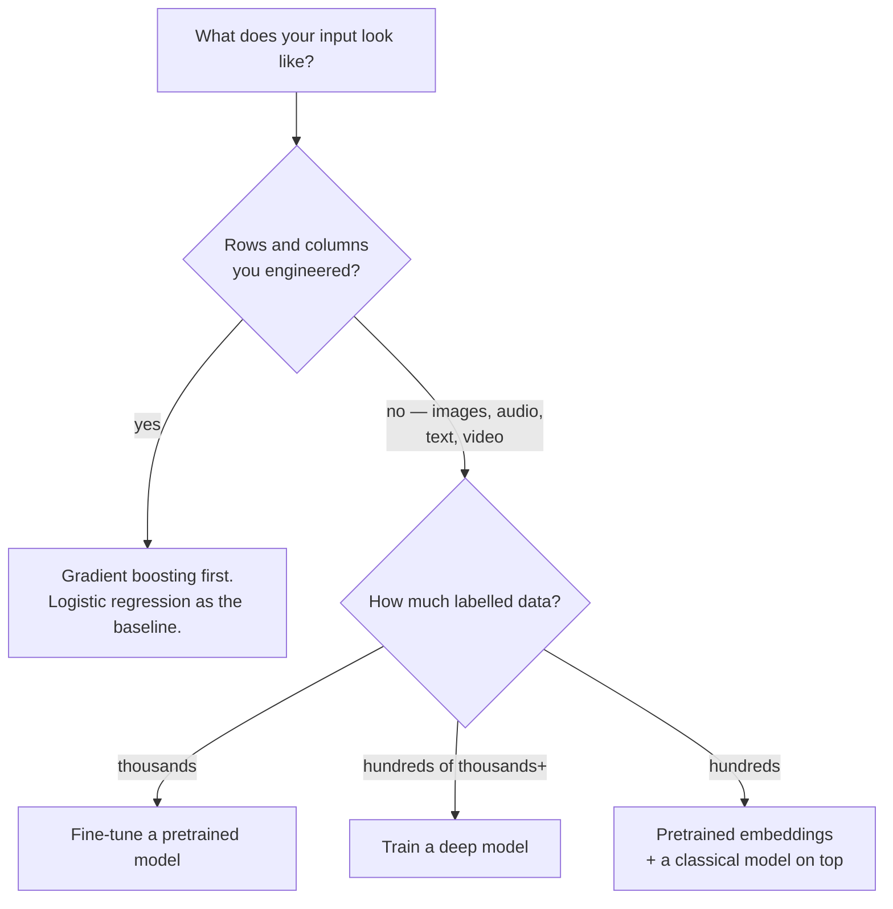

import DataCampExercise from "../../../../components/DataCampExercise.astro";
import Figure from "../../../../components/Figure.astro";
import Quiz from "../../../../components/Quiz.astro";

## What you'll learn

- the containment relationship, with real examples in every ring
- that most historical AI contained **no machine learning at all**
- a measured contest: neural net vs gradient boosting on pixels and on columns
- the data-hunger crossover, measured: logistic **0.8056** vs neural net **0.7630** at n=40
- a decision rule for when deep learning is the right call — and when it is fashion

## The nesting

The three terms are not synonyms and they are not rivals. They are nested sets.

**Artificial intelligence** is the widest: any technique that makes a machine do something we would
call intelligent. It is a goal, not a method.

**Machine learning** is one method for reaching that goal: derive the behaviour from data rather
than writing it.

**Deep learning** is one family of machine-learning models: neural networks with many layers that
learn their own feature representations.

<Figure
  src="/images/ml/phase-01-foundation/artificial-intelligence-vs-machine-learning-vs-deep-learning/nested-fields"
  alt="Three nested ellipses. The outer one is labelled artificial intelligence with examples like chess engines and expert systems; the middle is machine learning with linear regression and random forests; the innermost is deep learning with CNNs and transformers."
  title="Every deep learning system is machine learning; most AI never was"
  caption="The examples matter more than the rings. Chess engines and A* pathfinding sit in the outer band: unambiguously AI, containing no learning whatsoever. Linear regression sits in the middle band: learning, no depth. Only the inner band is deep learning."
/>



### AI without machine learning

This category is much larger than people expect, and it dominated the field for its first forty
years.

| System | Why it is AI | Why it is not ML |
| --- | --- | --- |
| Deep Blue (beat Kasparov, 1997) | Plays chess at superhuman level | Search plus a hand-written evaluation function |
| A* route-finding in a map app | Solves a hard planning problem | A graph algorithm; it learns nothing |
| A medical expert system | Encodes specialist reasoning | Rules elicited from doctors and typed in |
| A constraint solver for timetabling | Handles a combinatorial problem people cannot | Pure search over constraints |

None of these improve with experience. Point Mitchell's definition at them and they fail it
immediately: there is no E.

### Machine learning without deep learning

Most machine learning in production is not deep learning. Fraud detection, credit scoring, demand
forecasting, churn prediction, recommendation ranking — overwhelmingly gradient boosting and
logistic regression on structured columns.

The distinguishing feature is **who engineers the features**. In classical ML, you do: you decide
that `transactions_per_hour` and `distance_from_home` are the right columns. In deep learning, the
network is handed something close to raw input and constructs its own intermediate representations.

## Where deep learning actually wins

The received wisdom is "deep learning wins on unstructured data, classical ML wins on tables". That
is broadly right and worth testing, because the popular version overstates it badly.

Four models, two datasets — 1,797 handwritten digit images (raw pixels) and 1,500 rows of 20
engineered columns:

| Model | Raw pixels (digits) | 20 tabular columns |
| --- | --- | --- |
| Logistic regression | 0.9204 | 0.8620 |
| Random forest | 0.9366 | 0.9093 |
| Gradient boosting | 0.9349 | **0.9173** |
| Neural net (128, 64) | **0.9377** | 0.9040 |

<Figure
  src="/images/ml/phase-01-foundation/artificial-intelligence-vs-machine-learning-vs-deep-learning/where-deep-learning-wins"
  alt="A grouped bar chart of four models on two datasets. On pixels all four cluster between 0.92 and 0.938; on tabular columns gradient boosting leads at 0.917 with the neural net at 0.904."
  title="At this scale there is no deep-learning advantage at all"
  caption="On pixels the neural net edges ahead at 0.9377 — but random forest is at 0.9366 and gradient boosting at 0.9349, a spread of 0.0028 that is well inside cross-validation noise. On tabular columns gradient boosting wins outright and the neural net comes third."
/>

Read that carefully, because it does not say what the slogan says.

On the **tabular** data the slogan holds: gradient boosting wins at 0.9173, the neural net trails at
0.9040. That is the well-documented result, and it is why Kaggle tabular competitions are won by
boosting.

On the **pixels** the neural net technically wins — by 0.0011 over a random forest. That is not a
win, it is a tie. Deep learning's genuine advantage on images requires convolutional architectures
and far more than 1,797 images. **At this scale, on this data, there is no deep-learning advantage
to be had**, and any page that shows you one at this scale is showing you noise.

## The data-hunger crossover

The more useful measurement is what happens as data grows. Same digits dataset, same two models,
increasing training-set size:

| Training examples | Logistic regression | Neural net (128, 64) |
| --- | --- | --- |
| 40 | **0.8056** | 0.7630 |
| 80 | **0.8648** | 0.8537 |
| 160 | **0.9259** | 0.8981 |
| 320 | **0.9444** | 0.9407 |
| 640 | 0.9537 | **0.9704** |
| 1,000 | 0.9611 | **0.9685** |
| 1,257 | 0.9722 | **0.9778** |

<Figure
  src="/images/ml/phase-01-foundation/artificial-intelligence-vs-machine-learning-vs-deep-learning/data-hunger"
  alt="Two rising curves on a logarithmic x-axis. The blue logistic-regression curve is above the amber neural-net curve until about 640 examples, after which they swap."
  title="The simpler model wins when data is scarce"
  caption="Logistic regression leads at every size up to 320 examples, by as much as 0.0426 at n=40. The curves cross at around 640, after which the neural net stays marginally ahead — 0.9778 against 0.9722 at full size. Both improve; the ordering flips."
/>

At 40 examples the linear model beats the neural net by **0.0426**. The crossover is around 640.
And even at full size the neural net's lead is 0.0056 — real, but small enough that on this problem
you would ship the logistic model for its size, speed and interpretability.

This is the durable form of the "deep learning needs data" claim. Not "neural nets are bad on small
data" as an insult, but a measured crossover point that depends on your dataset and that you can
find yourself in ten lines.

## See it move

The sketch plots the two measured columns from the table above on a log axis and sweeps a budget
cursor across them. Move the mouse to place the cursor yourself; the panel reports which model is
ahead at that training-set size and by how much.

```p5 title="Which model wins at your data budget" desc="The seven measured accuracies for logistic regression and the neural net, plotted against training-set size on a log axis. A cursor sweeps across; the readout names the leader and the gap at that size. The lead changes hands once, near 640 examples." height="340"
// The seven measured points from the table above -- no curve fitting, just the data.
const N = [40, 80, 160, 320, 640, 1000, 1257];
const LOGREG = [0.8056, 0.8648, 0.9259, 0.9444, 0.9537, 0.9611, 0.9722];
const NET = [0.7630, 0.8537, 0.8981, 0.9407, 0.9704, 0.9685, 0.9778];
let cursor = 0.15;
let dir = 1;
let held = false;

function setup() {
  createCanvas(620, 340);
  textFont("monospace");
}
function xOf(n) {
  const lo = Math.log(N[0]), hi = Math.log(N[N.length - 1]);
  return 62 + ((Math.log(n) - lo) / (hi - lo)) * (width - 130);
}
function yOf(acc) {
  return 250 - ((acc - 0.74) / (1.0 - 0.74)) * 190;
}
function at(u) {
  // u in 0..1 across the log axis; linear interpolation between measured points
  const lo = Math.log(N[0]), hi = Math.log(N[N.length - 1]);
  const n = Math.exp(lo + u * (hi - lo));
  let i = 0;
  while (i < N.length - 2 && N[i + 1] < n) i++;
  const t = (Math.log(n) - Math.log(N[i])) / (Math.log(N[i + 1]) - Math.log(N[i]));
  return {
    n: n,
    a: LOGREG[i] + t * (LOGREG[i + 1] - LOGREG[i]),
    b: NET[i] + t * (NET[i + 1] - NET[i]),
  };
}
function series(vals, col) {
  stroke(col[0], col[1], col[2]);
  strokeWeight(2.5);
  noFill();
  beginShape();
  for (let i = 0; i < N.length; i++) vertex(xOf(N[i]), yOf(vals[i]));
  endShape();
  noStroke();
  fill(col[0], col[1], col[2]);
  for (let i = 0; i < N.length; i++) ellipse(xOf(N[i]), yOf(vals[i]), 7, 7);
}
function draw() {
  background(13, 17, 23);

  // axes and gridlines
  stroke(40, 46, 54);
  strokeWeight(1);
  for (let a = 0.75; a < 1.001; a += 0.05) {
    line(62, yOf(a), width - 68, yOf(a));
    noStroke();
    fill(110);
    textSize(10);
    textAlign(RIGHT, CENTER);
    text(a.toFixed(2), 56, yOf(a));
    stroke(40, 46, 54);
  }
  for (const n of N) {
    noStroke();
    fill(110);
    textSize(10);
    textAlign(CENTER, TOP);
    text(n, xOf(n), 258);
    stroke(40, 46, 54);
  }
  noStroke();
  fill(130);
  textSize(10);
  textAlign(CENTER, TOP);
  text("training examples (log scale)", width / 2, 276);

  series(LOGREG, [75, 139, 190]);
  series(NET, [255, 176, 67]);

  const p = at(cursor);
  const cx = xOf(p.n);
  stroke(150);
  strokeWeight(1);
  line(cx, 46, cx, 250);
  noStroke();
  fill(75, 139, 190);
  ellipse(cx, yOf(p.a), 11, 11);
  fill(255, 176, 67);
  ellipse(cx, yOf(p.b), 11, 11);

  const gap = p.a - p.b;
  const leader = gap > 0 ? "logistic regression" : "neural net";
  fill(gap > 0 ? color(75, 139, 190) : color(255, 176, 67));
  textSize(13);
  textAlign(LEFT, TOP);
  text("n = " + Math.round(p.n) + "  ->  " + leader + " leads by " + Math.abs(gap).toFixed(4), 62, 14);
  fill(150);
  textSize(11);
  text("logistic " + p.a.toFixed(4) + "   net " + p.b.toFixed(4), 62, 32);
  textAlign(RIGHT, TOP);
  fill(110);
  text(held ? "release to resume sweep" : "hover to steer", width - 68, 14);

  if (held) {
    cursor = constrain((mouseX - 62) / (width - 130), 0, 1);
  } else {
    cursor += 0.0025 * dir;
    if (cursor > 1 || cursor < 0) dir *= -1;
    cursor = constrain(cursor, 0, 1);
  }
}
// mouseMoved already clears `held` the moment the pointer leaves the band, so
// there is no separate mouseOut handler — the p5 runtime here re-binds only the
// hooks it knows about, and mouseOut is not one of them.
function mouseMoved() { held = mouseX > 62 && mouseX < width - 68 && mouseY < 300; }
```

Watch the vertical gap, not the height of the curves. On the left it is wide and blue-side up; it
narrows through 320, closes near 640, and then stays open by a hair on the amber side. A model
comparison run at a single dataset size only ever samples one slice of this picture — which is why
"neural nets beat linear models" and the reverse are both quotable from the same experiment.

## Choosing between them



| Signal | Use classical ML | Use deep learning |
| --- | --- | --- |
| Data is a table of engineered columns | ✅ | ❌ |
| Data is raw pixels, audio, or text | ❌ | ✅ |
| Under a few thousand labelled rows | ✅ | ❌ (0.7630 at n=40 above) |
| You need to explain a single prediction | ✅ | ⚠️ Hard |
| You have GPUs and time | Either | ✅ |
| Latency budget is single-digit milliseconds on CPU | ✅ | ⚠️ Depends |
| The relationship is a smooth function of a few variables | ✅ | Overkill |

There is one modern exception worth naming: **pretrained models change the arithmetic on small
data.** You may only have 300 labelled images, but a network trained on millions has already learned
the features. Fine-tuning it, or using it purely as a feature extractor and putting logistic
regression on top, routinely beats anything classical — because the effective E is not your 300
images, it is the millions the network already saw.

## In code

The tabular result, reproducible:

```python title="tabular_contest.py" showLineNumbers{1}
from sklearn.datasets import make_classification
from sklearn.ensemble import HistGradientBoostingClassifier, RandomForestClassifier
from sklearn.linear_model import LogisticRegression
from sklearn.model_selection import cross_val_score
from sklearn.neural_network import MLPClassifier
from sklearn.pipeline import make_pipeline
from sklearn.preprocessing import StandardScaler

X, y = make_classification(n_samples=1500, n_features=20, n_informative=8,
                           n_redundant=4, class_sep=1.1, random_state=3)

models = {
    "logistic":       make_pipeline(StandardScaler(), LogisticRegression(max_iter=2000)),
    "random forest":  RandomForestClassifier(n_estimators=200, random_state=0),
    "grad boosting":  HistGradientBoostingClassifier(random_state=0),
    "neural net":     make_pipeline(StandardScaler(),
                                    MLPClassifier((128, 64), max_iter=900, random_state=0)),
}
for name, m in models.items():
    print(f"{name:15s} {cross_val_score(m, X, y, cv=5).mean():.4f}")

# logistic        0.8620
# random forest   0.9093
# grad boosting   0.9173     <- wins
# neural net      0.9040
```

Finding your own crossover point:

```python title="find_the_crossover.py" showLineNumbers{1}
from sklearn.datasets import load_digits
from sklearn.linear_model import LogisticRegression
from sklearn.model_selection import train_test_split
from sklearn.neural_network import MLPClassifier
from sklearn.pipeline import make_pipeline
from sklearn.preprocessing import StandardScaler

X, y = load_digits(return_X_y=True)
X_tr, X_te, y_tr, y_te = train_test_split(X, y, test_size=0.3,
                                          random_state=0, stratify=y)

for n in (40, 160, 640, len(X_tr)):
    lr = make_pipeline(StandardScaler(), LogisticRegression(max_iter=3000))
    nn = make_pipeline(StandardScaler(),
                       MLPClassifier((128, 64), max_iter=1200, random_state=0))
    lr.fit(X_tr[:n], y_tr[:n])
    nn.fit(X_tr[:n], y_tr[:n])
    print(f"n={n:5d}  logistic {lr.score(X_te, y_te):.4f}"
          f"   neural net {nn.score(X_te, y_te):.4f}")
```

Run that on your own data before deciding what you need. It takes a minute and it settles the
argument.

## Pitfalls

**Using the three terms interchangeably.** "We're doing AI" tells a stakeholder nothing. "We fit a
gradient-boosted tree on 40 engineered columns" tells them everything.

**Assuming deep learning is strictly better.** Measured above: gradient boosting beat the neural net
on the tabular data (0.9173 vs 0.9040), and logistic regression beat it at every size below 640
examples.

**Reading a 0.0011 difference as a win.** On the pixel data the top three models spanned 0.0028.
Compare against fold-to-fold variance before declaring anything.

**Reaching for deep learning on 300 rows.** Either use a classical model, or use a *pretrained*
network so the effective experience is millions of examples rather than your 300.

**Calling every rule engine "AI" in marketing and then being unable to explain it internally.** The
nesting diagram is genuinely useful for keeping the conversation honest.

**Forgetting that classical ML also needs feature work.** Deep learning trades feature engineering
for data volume and compute. It is a trade, not a removal.

## Recap

- **AI ⊃ ML ⊃ deep learning.** Chess engines and A* are AI with no learning at all.
- The distinguishing question is *who engineers the features*: you, or the network.
- On 20 tabular columns, **gradient boosting won (0.9173) and the neural net came third (0.9040)**.
- On 1,797 digit images, the top three models spanned **0.0028** — a tie, not a deep-learning win.
- Logistic regression beat the neural net at every training size up to 320, by **0.0426** at n=40.
  The curves crossed around 640.
- Pretrained models change the arithmetic: your effective E is what the network already saw.

<Quiz
  questions={[
    {
      q: "Deep Blue beat Garry Kasparov at chess. Which categories does it belong to?",
      options: [
        "AI, ML and deep learning",
        "AI only — it used search plus a hand-written evaluation function and never learned from experience",
        "ML but not deep learning",
        "None of them",
      ],
      answer: 1,
      explain: "It is unambiguously artificial intelligence and contains no machine learning. Apply Mitchell's definition and it fails at the first letter: there is no E, and its performance does not improve with experience.",
    },
    {
      q: "Gradient boosting scored 0.9173 and the neural net 0.9040 on the tabular data. What should you conclude?",
      options: [
        "Neural nets are always worse",
        "On engineered tabular columns at this scale, boosting is the better default — which matches how tabular competitions are actually won",
        "The neural net needed more layers",
        "The difference is noise",
      ],
      answer: 1,
      explain: "A 0.0133 gap on 1,500 rows is a real result and consistent with the wider literature on tabular data. It is not a universal law about neural networks — it is a statement about this data type at this scale.",
    },
    {
      q: "On the digit images the top three models spanned 0.0028. What is the honest interpretation?",
      options: [
        "The neural net won",
        "It is a tie — that spread is inside cross-validation noise, and 1,797 small images is nowhere near the scale where deep learning separates",
        "The random forest won",
        "The dataset is broken",
      ],
      answer: 1,
      explain: "Declaring a winner on a 0.0028 margin is exactly the mistake this page warns about. Deep learning's real advantage on images needs convolutional architectures and orders of magnitude more data.",
    },
    {
      q: "You have 300 labelled photographs and need an image classifier. What is the best approach?",
      options: [
        "Train a deep CNN from scratch",
        "Use a pretrained network as a feature extractor and fit a classical model on its embeddings",
        "Use logistic regression on the raw pixels",
        "Collect 100,000 more photographs first",
      ],
      answer: 1,
      explain: "300 images is far below where training from scratch works — recall 0.7630 at n=40 in the measured table. A pretrained network has already learned the visual features, so your effective experience is the millions of images it saw, not your 300.",
    },
    {
      q: "What is the clearest single distinction between classical ML and deep learning?",
      options: [
        "Deep learning is more accurate",
        "Who engineers the features: you specify them for classical ML; the network learns its own for deep learning",
        "Deep learning uses GPUs",
        "Classical ML cannot handle images",
      ],
      answer: 1,
      explain: "Accuracy and hardware are consequences, not definitions. The structural difference is representation learning — deep networks build their own intermediate features from near-raw input, which is what makes them so effective on unstructured data and so data-hungry.",
    },
  ]}
/>

## 🧪 Try It Yourself

### Exercise 1 – Sort the systems

<DataCampExercise
  lang="python"
  hint={`A system is ML only if its behaviour is derived from data; deep learning additionally means a multi-layer network.`}
  code={`# Task: Exercise 1 - Sort the systems
SYSTEMS = {
    "A* route finding":            ("AI", False, False),
    "Deep Blue chess engine":      ("AI", False, False),
    "Spam filter (naive Bayes)":   ("AI", True, False),
    "Random forest credit score":  ("AI", True, False),
    "ResNet image classifier":     ("AI", True, True),
    "GPT-style language model":    ("AI", True, True),
}

for name, (_, is_ml, is_dl) in SYSTEMS.items():
    tag = "deep learning" if is_dl else ("machine learning" if is_ml else "AI only")
    print(f"{name:30s} {tag}")

ml_count = sum(1 for _, m, _ in SYSTEMS.values() if m)
print(f"\\nAI systems that are NOT ML: {len(SYSTEMS) - ___}")   # replace ___ with ml_count

# -- Expected Output -------------------------------------------
# A* route finding               AI only
# Deep Blue chess engine         AI only
# Spam filter (naive Bayes)      machine learning
# Random forest credit score     machine learning
# ResNet image classifier        deep learning
# GPT-style language model       deep learning
#
# AI systems that are NOT ML: 2
# --------------------------------------------------------------`}
  solution={`SYSTEMS = {
    "A* route finding":            ("AI", False, False),
    "Deep Blue chess engine":      ("AI", False, False),
    "Spam filter (naive Bayes)":   ("AI", True, False),
    "Random forest credit score":  ("AI", True, False),
    "ResNet image classifier":     ("AI", True, True),
    "GPT-style language model":    ("AI", True, True),
}
for name, (_, is_ml, is_dl) in SYSTEMS.items():
    tag = "deep learning" if is_dl else ("machine learning" if is_ml else "AI only")
    print(f"{name:30s} {tag}")
ml_count = sum(1 for _, m, _ in SYSTEMS.values() if m)
print(f"\\nAI systems that are NOT ML: {len(SYSTEMS) - ml_count}")`}
  sct={`test_output_contains("AI systems that are NOT ML: 2")
success_msg("Two of six are AI with no learning in them. For most of the field's history that fraction was far higher.")`}
  height={300}
/>

### Exercise 2 – Boosting versus a neural net on columns

<DataCampExercise
  lang="python"
  hint={`Neural networks need scaled inputs, so wrap the MLP in a pipeline with StandardScaler.`}
  code={`# Task: Exercise 2 - Boosting versus a neural net on columns
from sklearn.datasets import make_classification
from sklearn.ensemble import HistGradientBoostingClassifier
from sklearn.model_selection import cross_val_score
from sklearn.neural_network import MLPClassifier
from sklearn.pipeline import make_pipeline
from sklearn.preprocessing import StandardScaler

X, y = make_classification(n_samples=1500, n_features=20, n_informative=8,
                           n_redundant=4, class_sep=1.1, random_state=3)

boost = HistGradientBoostingClassifier(random_state=0)
net = make_pipeline(StandardScaler(),
                    MLPClassifier((128, 64), max_iter=900, random_state=___))
                    # replace ___ with 0

print(f"gradient boosting {cross_val_score(boost, X, y, cv=5).mean():.4f}")
print(f"neural net        {cross_val_score(net, X, y, cv=5).mean():.4f}")

# -- Expected Output -------------------------------------------
# gradient boosting 0.9173
# neural net        0.9040
# --------------------------------------------------------------`}
  solution={`from sklearn.datasets import make_classification
from sklearn.ensemble import HistGradientBoostingClassifier
from sklearn.model_selection import cross_val_score
from sklearn.neural_network import MLPClassifier
from sklearn.pipeline import make_pipeline
from sklearn.preprocessing import StandardScaler

X, y = make_classification(n_samples=1500, n_features=20, n_informative=8,
                           n_redundant=4, class_sep=1.1, random_state=3)
boost = HistGradientBoostingClassifier(random_state=0)
net = make_pipeline(StandardScaler(),
                    MLPClassifier((128, 64), max_iter=900, random_state=0))
print(f"gradient boosting {cross_val_score(boost, X, y, cv=5).mean():.4f}")
print(f"neural net        {cross_val_score(net, X, y, cv=5).mean():.4f}")`}
  sct={`test_output_contains("gradient boosting 0.9173")
success_msg("On engineered columns the tree ensemble wins. This is why tabular competitions are won by boosting.")`}
  height={250}
/>

### Exercise 3 – Find the crossover yourself

<DataCampExercise
  lang="python"
  hint={`Fit both models on the first n rows and score both on the same held-out set.`}
  code={`# Task: Exercise 3 - Find the crossover yourself
from sklearn.datasets import load_digits
from sklearn.linear_model import LogisticRegression
from sklearn.model_selection import train_test_split
from sklearn.neural_network import MLPClassifier
from sklearn.pipeline import make_pipeline
from sklearn.preprocessing import StandardScaler

X, y = load_digits(return_X_y=True)
X_tr, X_te, y_tr, y_te = train_test_split(X, y, test_size=0.3,
                                          random_state=0, stratify=y)

for n in (40, 160, 640, len(X_tr)):
    lr = make_pipeline(StandardScaler(), LogisticRegression(max_iter=3000))
    nn = make_pipeline(StandardScaler(),
                       MLPClassifier((128, 64), max_iter=1200, random_state=0))
    lr.fit(X_tr[:n], y_tr[:n])
    nn.fit(X_tr[:n], y_tr[:___])              # replace ___ with n
    print(f"n={n:5d}  logistic {lr.score(X_te, y_te):.4f}"
          f"   neural net {nn.score(X_te, y_te):.4f}")

# -- Expected Output -------------------------------------------
# n=   40  logistic 0.8056   neural net 0.7630
# n=  160  logistic 0.9259   neural net 0.8981
# n=  640  logistic 0.9537   neural net 0.9704
# n= 1257  logistic 0.9722   neural net 0.9778
# --------------------------------------------------------------`}
  solution={`from sklearn.datasets import load_digits
from sklearn.linear_model import LogisticRegression
from sklearn.model_selection import train_test_split
from sklearn.neural_network import MLPClassifier
from sklearn.pipeline import make_pipeline
from sklearn.preprocessing import StandardScaler

X, y = load_digits(return_X_y=True)
X_tr, X_te, y_tr, y_te = train_test_split(X, y, test_size=0.3,
                                          random_state=0, stratify=y)
for n in (40, 160, 640, len(X_tr)):
    lr = make_pipeline(StandardScaler(), LogisticRegression(max_iter=3000))
    nn = make_pipeline(StandardScaler(),
                       MLPClassifier((128, 64), max_iter=1200, random_state=0))
    lr.fit(X_tr[:n], y_tr[:n])
    nn.fit(X_tr[:n], y_tr[:n])
    print(f"n={n:5d}  logistic {lr.score(X_te, y_te):.4f}"
          f"   neural net {nn.score(X_te, y_te):.4f}")`}
  sct={`test_output_contains("n=   40  logistic 0.8056")
success_msg("The simpler model leads until about 640 examples, then loses. That crossover is a property of YOUR data.")`}
  height={280}
/>

### Exercise 4 – Is that margin real?

<DataCampExercise
  lang="python"
  hint={`cross_val_score returns one score per fold; compare the gap against the fold standard deviations.`}
  code={`# Task: Exercise 4 - Is that margin real?
from sklearn.datasets import load_digits
from sklearn.ensemble import RandomForestClassifier
from sklearn.model_selection import cross_val_score
from sklearn.neural_network import MLPClassifier
from sklearn.pipeline import make_pipeline
from sklearn.preprocessing import StandardScaler

X, y = load_digits(return_X_y=True)

forest = RandomForestClassifier(n_estimators=200, random_state=0)
net = make_pipeline(StandardScaler(),
                    MLPClassifier((128, 64), max_iter=900, random_state=0))

f_scores = cross_val_score(forest, X, y, cv=5)
n_scores = cross_val_score(net, X, y, cv=5)

print(f"forest     {f_scores.mean():.4f}  +/- {f_scores.___():.4f}")   # replace ___ with std
print(f"neural net {n_scores.mean():.4f}  +/- {n_scores.std():.4f}")
print(f"gap        {abs(n_scores.mean() - f_scores.mean()):.4f}")

# -- Expected Output -------------------------------------------
# forest     0.9366  +/- 0.0226
# neural net 0.9377  +/- 0.0170
# gap        0.0011
# --------------------------------------------------------------`}
  solution={`from sklearn.datasets import load_digits
from sklearn.ensemble import RandomForestClassifier
from sklearn.model_selection import cross_val_score
from sklearn.neural_network import MLPClassifier
from sklearn.pipeline import make_pipeline
from sklearn.preprocessing import StandardScaler

X, y = load_digits(return_X_y=True)
forest = RandomForestClassifier(n_estimators=200, random_state=0)
net = make_pipeline(StandardScaler(),
                    MLPClassifier((128, 64), max_iter=900, random_state=0))
f_scores = cross_val_score(forest, X, y, cv=5)
n_scores = cross_val_score(net, X, y, cv=5)
print(f"forest     {f_scores.mean():.4f}  +/- {f_scores.std():.4f}")
print(f"neural net {n_scores.mean():.4f}  +/- {n_scores.std():.4f}")
print(f"gap        {abs(n_scores.mean() - f_scores.mean()):.4f}")`}
  sct={`test_output_contains("gap        0.0011")
success_msg("A 0.0011 gap against fold standard deviations of 0.0226 and 0.0170 — twenty times larger. That is a tie.")`}
  height={270}
/>

### Exercise 5 – Why pretraining is different from re-representing

<DataCampExercise
  lang="python"
  hint={`PCA is fitted on the same data, so it can compress but cannot add information from anywhere else.`}
  code={`# Task: Exercise 5 - Why pretraining is different from re-representing
from sklearn.datasets import load_digits
from sklearn.decomposition import PCA
from sklearn.linear_model import LogisticRegression
from sklearn.model_selection import cross_val_score
from sklearn.pipeline import make_pipeline
from sklearn.preprocessing import StandardScaler

X, y = load_digits(return_X_y=True)

raw = make_pipeline(StandardScaler(), LogisticRegression(max_iter=3000))
compressed = make_pipeline(
    StandardScaler(),
    PCA(n_components=30, random_state=0),      # learned from THIS data only
    LogisticRegression(max_iter=___),          # replace ___ with 3000
)

r = cross_val_score(raw, X, y, cv=5).mean()
c = cross_val_score(compressed, X, y, cv=5).mean()
print(f"raw 64 pixels     {r:.4f}")
print(f"30 PCA components {c:.4f}")
print(f"cost of halving the dimensions: {r - c:.4f}")

# -- Expected Output -------------------------------------------
# raw 64 pixels     0.9204
# 30 PCA components 0.9065
# cost of halving the dimensions: 0.0139
# --------------------------------------------------------------`}
  solution={`from sklearn.datasets import load_digits
from sklearn.decomposition import PCA
from sklearn.linear_model import LogisticRegression
from sklearn.model_selection import cross_val_score
from sklearn.pipeline import make_pipeline
from sklearn.preprocessing import StandardScaler

X, y = load_digits(return_X_y=True)
raw = make_pipeline(StandardScaler(), LogisticRegression(max_iter=3000))
compressed = make_pipeline(
    StandardScaler(),
    PCA(n_components=30, random_state=0),
    LogisticRegression(max_iter=3000),
)
r = cross_val_score(raw, X, y, cv=5).mean()
c = cross_val_score(compressed, X, y, cv=5).mean()
print(f"raw 64 pixels     {r:.4f}")
print(f"30 PCA components {c:.4f}")
print(f"cost of halving the dimensions: {r - c:.4f}")`}
  sct={`test_output_contains("cost of halving the dimensions: 0.0139")
success_msg("Re-representing the SAME data cost 0.0139. A pretrained network is different in kind: its features come from millions of images you never had.")`}
  height={280}
/>

### Exercise 6 – Report the crossover as a decision, not a winner

<DataCampExercise
  lang="python"
  hint={`The gap is logistic minus net. The crossover is the first size where the net's score is strictly larger.`}
  code={`# Task: Exercise 6 - Report the crossover as a decision, not a winner
n_train = [40, 80, 160, 320, 640, 1000, 1257]
logreg = [0.8056, 0.8648, 0.9259, 0.9444, 0.9537, 0.9611, 0.9722]
net = [0.7630, 0.8537, 0.8981, 0.9407, 0.9704, 0.9685, 0.9778]

crossover = None
for n, a, b in zip(n_train, logreg, net):
    leader = "logistic" if a > b else "net"
    if crossover is None and b > a:
        crossover = n
    print(f"n={n:5d}  logistic {a:.4f}  net {b:.4f}  gap {a - b:+.4f}  ->  {leader}")
print(f"the net overtakes at n = {crossover}")
print(f"largest logistic lead: {___(a - b for a, b in zip(logreg, net)):+.4f} at n={n_train[0]}")
# replace ___ with max
print(f"final net lead:        {net[-1] - logreg[-1]:+.4f}")

# -- Expected Output -------------------------------------------
# n=   40  logistic 0.8056  net 0.7630  gap +0.0426  ->  logistic
# n=   80  logistic 0.8648  net 0.8537  gap +0.0111  ->  logistic
# n=  160  logistic 0.9259  net 0.8981  gap +0.0278  ->  logistic
# n=  320  logistic 0.9444  net 0.9407  gap +0.0037  ->  logistic
# n=  640  logistic 0.9537  net 0.9704  gap -0.0167  ->  net
# n= 1000  logistic 0.9611  net 0.9685  gap -0.0074  ->  net
# n= 1257  logistic 0.9722  net 0.9778  gap -0.0056  ->  net
# the net overtakes at n = 640
# largest logistic lead: +0.0426 at n=40
# final net lead:        +0.0056
# --------------------------------------------------------------`}
  solution={`n_train = [40, 80, 160, 320, 640, 1000, 1257]
logreg = [0.8056, 0.8648, 0.9259, 0.9444, 0.9537, 0.9611, 0.9722]
net = [0.7630, 0.8537, 0.8981, 0.9407, 0.9704, 0.9685, 0.9778]

crossover = None
for n, a, b in zip(n_train, logreg, net):
    leader = "logistic" if a > b else "net"
    if crossover is None and b > a:
        crossover = n
    print(f"n={n:5d}  logistic {a:.4f}  net {b:.4f}  gap {a - b:+.4f}  ->  {leader}")
print(f"the net overtakes at n = {crossover}")
print(f"largest logistic lead: {max(a - b for a, b in zip(logreg, net)):+.4f} at n={n_train[0]}")
print(f"final net lead:        {net[-1] - logreg[-1]:+.4f}")`}
  sct={`test_output_contains("overtakes at n = 640")
success_msg("The net wins at the end by 0.0056 — real, and small enough that size, latency and interpretability decide the shipping question.")`}
  height={320}
/>

## Next

[Types of Machine Learning](/machine-learning/phase-01---the-ml-foundation/types-of-machine-learning-supervised-unsupervised-reinforcement/)
— the three learning paradigms on one dataset, plus the measurement where a batch model decays from
0.98 to 0.51 while an online one holds at 0.97.
