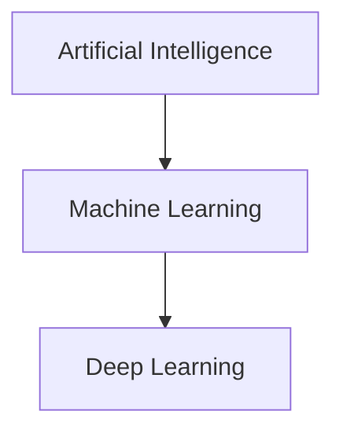

## Simple definitions

- **AI (Artificial Intelligence)**: building systems that appear “intelligent” (reasoning, planning, perception, language).
- **ML (Machine Learning)**: a subset of AI where systems learn from data.
- **Deep Learning (DL)**: a subset of ML using neural networks with many layers.

## What belongs where?

### AI without ML

- rule-based expert systems
- search/planning (A* search, game engines)

### ML without deep learning

- linear regression
- logistic regression
- decision trees, random forests
- gradient boosting

### Deep learning

- image recognition (CNNs)
- large language models (Transformers)
- speech recognition

## Matching real tasks to techniques

The book walks through a long list of real-world ML applications and the
techniques typically used for each. A few highlights:

| Task | Typical technique |
|------|--------------------|
| Classify products on a production line | Image classification (CNN) |
| Detect tumors in brain scans | Semantic segmentation (CNN) |
| Classify news articles, flag offensive comments | NLP / text classification (RNN, Transformer) |
| Forecast next year's revenue | Regression (Linear/Polynomial Regression, Random Forest) |
| React to voice commands | Speech recognition (RNN, CNN, Transformer) |
| Detect credit card fraud | Anomaly detection |
| Segment clients for marketing | Clustering |
| Visualize a high-dimensional dataset | Dimensionality reduction |
| Recommend a product | Recommender system (often neural net based) |
| Build a game-playing bot | Reinforcement Learning |

Notice how "classic ML" (regression, clustering, anomaly detection) and "deep
learning" (CNNs, RNNs, Transformers) both show up — the right tool depends on
the task and the data, not on which family sounds more advanced.

:::tip[From the book]
AlphaGo, the program that beat the world Go champion in 2017, is a
Reinforcement Learning system: it learned its winning policy by analyzing
millions of games and then playing against itself. During the actual match
against the champion, learning was turned off — it was purely applying what
it had already learned.
:::

## When should you use deep learning?

Deep learning is powerful when:

- you have **lots of data**
- the relationship is highly complex (vision, audio, text)
- you can afford compute and training time

But in many business problems, classical ML is:

- faster to train
- easier to explain
- easier to debug

## Key takeaway

AI is the umbrella goal.

ML is a major method for AI.

Deep learning is one ML family that dominates many unstructured data tasks.

import DataCampExercise from "../../../../components/DataCampExercise.astro";

## 🧪 Try It Yourself

### Exercise 1 – Match Task to Technique

<DataCampExercise
  lang="python"
  hint={`Fill in the string "Clustering" — segmenting customers with no labels is unsupervised clustering.`}
  code={`# Task: Exercise 1 – Task to Technique Mapping
task_to_technique = {
    "classify products on a line": "Image classification",
    "detect credit card fraud": "Anomaly detection",
    "segment clients for marketing": ___,   # replace ___ with "Clustering"
}
print(task_to_technique["segment clients for marketing"])

# ── Expected Output ───────────────────────────────────────────
# Clustering
# ──────────────────────────────────────────────────────────────`}
  solution={`task_to_technique = {
    "classify products on a line": "Image classification",
    "detect credit card fraud": "Anomaly detection",
    "segment clients for marketing": "Clustering",
}
print(task_to_technique["segment clients for marketing"])`}
  sct={`test_output_contains("Clustering")
success_msg("Right technique for the right kind of task!")`}
  height={148}
/>

### Exercise 2 – Classic ML Without Deep Learning

<DataCampExercise
  lang="python"
  hint={`\`RandomForestClassifier\` is a classic ML algorithm — no neural network needed.`}
  code={`# Task: Exercise 2 – Train a Classic ML Model
from sklearn.ensemble import ___   # replace ___ with RandomForestClassifier
from sklearn.datasets import load_iris

X, y = load_iris(return_X_y=True)
model = ___(n_estimators=50, random_state=42)   # replace ___ with RandomForestClassifier
model.fit(X, y)
print("accuracy:", round(model.score(X, y), 2))

# ── Expected Output ───────────────────────────────────────────
# accuracy: 1.0
# ──────────────────────────────────────────────────────────────`}
  solution={`from sklearn.ensemble import RandomForestClassifier
from sklearn.datasets import load_iris

X, y = load_iris(return_X_y=True)
model = RandomForestClassifier(n_estimators=50, random_state=42)
model.fit(X, y)
print("accuracy:", round(model.score(X, y), 2))`}
  sct={`test_output_contains("accuracy:")
success_msg("Random Forests: powerful ML, zero neural networks!")`}
  height={158}
/>

### Exercise 3 – Dimensionality Reduction for Visualization

<DataCampExercise
  lang="python"
  hint={`Use \`PCA(n_components=2)\` then \`fit_transform(X)\`.`}
  code={`# Task: Exercise 3 – Reduce Dimensions for Visualization
from sklearn.decomposition import PCA
from sklearn.datasets import load_iris

X, _ = load_iris(return_X_y=True)   # 4 features per flower

pca = PCA(n_components=___)   # replace ___ with 2
X_2d = pca.fit_transform(X)
print("Reduced shape:", X_2d.shape)

# ── Expected Output ───────────────────────────────────────────
# Reduced shape: (150, 2)
# ──────────────────────────────────────────────────────────────`}
  solution={`from sklearn.decomposition import PCA
from sklearn.datasets import load_iris

X, _ = load_iris(return_X_y=True)
pca = PCA(n_components=2)
X_2d = pca.fit_transform(X)
print("Reduced shape:", X_2d.shape)`}
  sct={`test_output_contains("Reduced shape: (150, 2)")
success_msg("4 features compressed to 2 for easy plotting!")`}
  height={158}
/>
