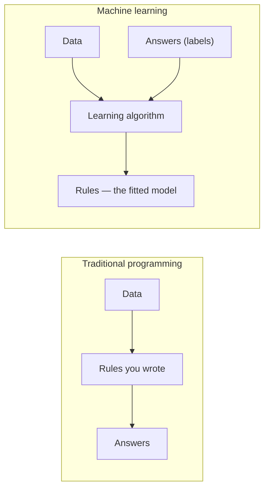

## What you'll learn

- the one-line structural difference: rules are **written**, models are **derived**
- a real contest on the same data: **30 hand-tuned rules (0.7167) vs one default model (0.7667)**
- why the 5-point accuracy gap is the *least* interesting part of that result
- how each approach responds to more data: one improves, one cannot
- why a rule gives you one operating point and a model gives you the whole curve
- when writing the rules is still the correct engineering decision

## Intuition

In traditional programming you supply the data **and the rules**, and the computer produces the
answers. In machine learning you supply the data **and the answers**, and the computer produces the
rules.



That inversion is the entire idea, and it sounds almost like a word game until you watch it happen
on a problem where the rules are genuinely hard to write.

## The contest

Two thousand short messages, half spam and half not. A spam message draws more of its words from a
promotional vocabulary — *free, winner, prize, click, urgent, offer, cash, limited, guarantee,
bonus* — and a legitimate message draws more from a work vocabulary. But most words in every message
are neutral filler, and roughly a third of the loaded words come from the *wrong* vocabulary.

Here is one of each:

```text
spam: send report work take week your guarantee guarantee that you will meeting also call about ...
ham : have review here you you deadline here notes report want invoice send for would there and ...
```

You cannot separate those by eye, which is exactly the point. Real spam looks like real mail.

### The traditional approach

Write a rule. Flag a message if it contains at least *t* words from the keyword list. Two knobs:
how many keywords, and how many hits it takes to fire. Try every combination — 10 keyword lengths
× 3 thresholds = **30 hand-tuned variants**.

| Rule | Accuracy | Precision | Recall |
| --- | --- | --- | --- |
| 1 keyword, fire on 1 hit | 0.5583 | 0.6423 | 0.2633 |
| 5 keywords, fire on 1 hit | 0.6400 | 0.6024 | 0.8233 |
| 10 keywords, fire on 1 hit | 0.6117 | 0.5641 | **0.9833** |
| **10 keywords, fire on 3 hits** | **0.7167** | 0.7481 | 0.6533 |

Watch the failure mode. Adding keywords drives recall up (0.2633 → 0.9833) and precision down
(0.6423 → 0.5641), because a longer list fires on more legitimate mail. Raising the threshold pushes
back the other way. You are hand-searching a trade-off curve, and the best point you find is
**0.7167**.

### The learned approach

```python
from sklearn.feature_extraction.text import CountVectorizer
from sklearn.naive_bayes import MultinomialNB

vec = CountVectorizer()
model = MultinomialNB().fit(vec.fit_transform(X_train), y_train)
```

Two lines. No keyword list, no threshold, no tuning, no domain knowledge. **Accuracy 0.7667**,
precision 0.7614, recall 0.7767.

<Figure
  src="/images/ml/phase-01-foundation/ml-vs-traditional-programming/rules-vs-one-fit"
  alt="Three rising curves for rule thresholds 1, 2 and 3 against the number of keywords, all below a dashed horizontal line at 0.7667 marking the fitted model."
  title="Thirty hand-tuned rule variants, none of them enough"
  caption="Each curve is one threshold setting; each point is one hand-written rule. The best of all thirty reaches 0.7167. The dashed line is a single MultinomialNB fit with default settings at 0.7667 — above every variant, with no human tuning at all."
/>

Five points is a real but unspectacular win. It is also, by some distance, the least interesting
thing that just happened.

## Three differences the accuracy number hides

### 1. The model found the vocabulary itself

The rule needed a human to sit down and think of ten spam words. The model was handed raw text and
discovered **55 distinct tokens**, weighting each by how much evidence it carries. It never needed
a domain expert, and it would have worked identically on a language nobody in the room speaks.

### 2. Only one of them improves with data

This is the structural difference, and it is not close.

| Training examples | Learned model | Best hand-written rule |
| --- | --- | --- |
| 20 | 0.5517 | 0.7167 |
| 50 | 0.5817 | 0.7167 |
| 100 | 0.6433 | 0.7167 |
| 200 | 0.7083 | 0.7167 |
| **500** | **0.7500** | 0.7167 |
| 1,000 | **0.7750** | 0.7167 |
| 1,400 | 0.7667 | 0.7167 |

At 20 examples the rule wins by 16 points. The rule is *better* than the model, and if you stopped
there you would ship the rule.

By 500 examples the model has overtaken it, and the rule's column never moves — it *cannot* move,
because a rule is a constant. Every new labelled message is free improvement for one approach and
inert for the other.

<Figure
  src="/images/ml/phase-01-foundation/ml-vs-traditional-programming/more-data-only-helps-one"
  alt="A rising curve for the learned model crossing a flat dashed line for the hand-written rule at around 500 training examples."
  title="Only one of these two lines responds to more data"
  caption="The rule's accuracy is a horizontal line by construction — it was written once and does not read the training set. The model starts far worse at 20 examples and crosses at roughly 500. Notice the small dip at 1,400: learning curves are noisy, not monotone."
/>

That last detail is worth keeping. The model scores 0.7750 at 1,000 examples and 0.7667 at 1,400.
Learning curves wobble; a single dip is not a regression to investigate.

### See it move

```p5 title="Rules accumulate; a model absorbs" desc="New edge cases arrive one at a time. The rule engine grows a new branch for each and its complexity climbs without bound; the model absorbs each one as another training row and its size never changes." height="360"
let cases = 0, rules = 1, t = 0;
let branches = [];
function reset() { cases = 0; rules = 1; t = 0; branches = [{ x: 300, y: 40, d: 0 }]; }
function setup() { createCanvas(600, 360); textFont("monospace"); reset(); }
function addCase() {
  cases++;
  // roughly 6 in 10 new edge cases need a brand-new branch
  if (random() < 0.6 && branches.length < 46) {
    const parent = random(branches.filter(b => b.d < 4));
    if (parent) {
      branches.push({
        x: parent.x + random(-70, 70) / (parent.d + 1),
        y: parent.y + 52,
        d: parent.d + 1,
        px: parent.x, py: parent.y,
      });
      rules++;
    }
  }
}
function draw() {
  background(13, 17, 23);

  // left: the rule tree, growing
  for (const b of branches) {
    if (b.px !== undefined) {
      stroke(232, 110, 110, 150); strokeWeight(1.4);
      line(b.px * 0.45 + 10, b.py, b.x * 0.45 + 10, b.y);
    }
  }
  noStroke();
  for (const b of branches) { fill(232, 110, 110); ellipse(b.x * 0.45 + 10, b.y, 8, 8); }

  // right: the model — a fixed-size box that never grows
  const bx = 400, by = 120;
  noFill(); stroke(255, 211, 67); strokeWeight(2.2);
  rect(bx, by, 130, 80, 6);
  noStroke(); fill(255, 211, 67); textAlign(CENTER, CENTER); textSize(12);
  text("model", bx + 65, by + 30);
  text("55 weights", bx + 65, by + 52);
  // incoming rows pile up outside it
  fill(107, 169, 221, 160);
  for (let i = 0; i < Math.min(cases, 60); i++) {
    ellipse(bx + 8 + (i % 20) * 6.5, by + 105 + Math.floor(i / 20) * 11, 5, 5);
  }
  fill(150); textSize(10);
  text("training rows: " + cases, bx + 65, by + 155);

  textAlign(LEFT, TOP); textSize(12);
  fill(232, 110, 110); text("rule engine: " + rules + " branches", 16, 12);
  fill(255, 211, 67); text("model: 55 weights, always", 400, 12);
  fill(150); textSize(10); textAlign(LEFT, BOTTOM);
  text("edge cases seen: " + cases + "    (click to restart)", 16, height - 10);

  t++;
  if (t % 22 === 0) { if (cases < 70) addCase(); else reset(); }
}
function mousePressed() { reset(); }
```

The rule tree is the honest picture of what maintaining a rule engine feels like after two years.
The model's box never changes size — every new edge case is another row, not another branch.

### 3. A rule is one operating point; a model is a curve

Every rule variant is a single fixed (precision, recall) pair. Want more recall? Rewrite it and
re-measure. The model outputs a *probability*, so moving the threshold sweeps the entire trade-off
without refitting anything.

<Figure
  src="/images/ml/phase-01-foundation/ml-vs-traditional-programming/precision-recall-tradeoff"
  alt="A scatter of thirty blue points representing rule variants, all sitting below a continuous amber precision-recall curve produced by the fitted model."
  title="Thirty rules give thirty points; one model gives the whole curve"
  caption="Every hand-written rule is one dot. The model's curve passes above all of them, and every point along it is reachable by changing a single number at prediction time. Average precision: 0.8269."
/>

In production this matters more than the headline accuracy. "Legal says we need 95% precision on
auto-deletion" is a threshold change with a model, and a rewrite with rules.

## What changes in your workflow

| | Traditional programming | Machine learning |
| --- | --- | --- |
| You provide | Rules | Labelled examples |
| Computer provides | Answers | Rules |
| Debugging | Read the code | Inspect data, features, errors |
| Improving it | Write more logic | Get more or better data |
| Correctness | Provable | Statistical, always |
| Version control | The code is the artefact | Code **and** data **and** weights |
| Failure mode | Crashes, or is visibly wrong | Quietly confident and wrong |
| Testing | Unit tests, exact assertions | Held-out metrics, distributions |

The last two rows are where teams get hurt. A rule that breaks throws an exception. A model that
breaks returns a plausible number, in the right format, at normal latency, and nothing alerts.

## When to write the rules anyway

Machine learning is not a default. Choose it deliberately.

| Situation | Write rules | Train a model |
| --- | --- | --- |
| The logic is written down (tax, physics, regulation) | ✅ | ❌ |
| The mapping is complex and unwritable | ❌ | ✅ |
| You have fewer than a hundred examples | ✅ | ❌ (see the table above — 0.5517 at n=20) |
| You need an exact, auditable justification | ✅ | ⚠️ Depends on the model |
| The pattern drifts over time | ❌ | ✅ Retrain |
| Being wrong is catastrophic and unrecoverable | ✅ | ❌ |
| You have plenty of labels and rules keep multiplying | ❌ | ✅ |

The honest heuristic: **if you can write the rule, write the rule.** Machine learning earns its
complexity when the rules would be numerous, unknown, or moving.

There is also a hybrid answer that is often correct: a small set of hard rules for the cases you
*know* (block this sender, always allow this domain), with a model handling the residue. That is
what most real spam filters actually are.

## In code

The full contest, reproducible:

```python title="rules_vs_learning.py" showLineNumbers{1}
import numpy as np
from sklearn.feature_extraction.text import CountVectorizer
from sklearn.metrics import accuracy_score, precision_score, recall_score
from sklearn.model_selection import train_test_split
from sklearn.naive_bayes import MultinomialNB

SPAM_WORDS = ["free", "winner", "prize", "click", "urgent",
              "offer", "cash", "limited", "guarantee", "bonus"]

def keyword_rule(docs, keywords, threshold):
    """The traditional program: no learning, no data, just logic."""
    kw = set(keywords)
    return np.array([int(sum(w in kw for w in d.split()) >= threshold)
                     for d in docs])

X_train, X_test, y_train, y_test = train_test_split(
    docs, labels, test_size=0.3, random_state=0, stratify=labels)

# Search all 30 hand-written variants, by brute force, the way a human would.
best = max(
    (accuracy_score(y_test, keyword_rule(X_test, SPAM_WORDS[:k], t)), k, t)
    for k in range(1, 11) for t in (1, 2, 3)
)
print("best rule:", round(best[0], 4), "with", best[1], "keywords, threshold", best[2])
# best rule: 0.7167 with 10 keywords, threshold 3

# One fit. No tuning. No keyword list.
vec = CountVectorizer()
model = MultinomialNB().fit(vec.fit_transform(X_train), y_train)
pred = model.predict(vec.transform(X_test))
print("model    :", round(accuracy_score(y_test, pred), 4))     # 0.7667
print("vocabulary:", len(vec.vocabulary_))                      # 55
```

And the part that only the model can do:

```python title="one_model_many_thresholds.py" showLineNumbers{1}
proba = model.predict_proba(vec.transform(X_test))[:, 1]

for threshold in (0.3, 0.5, 0.7, 0.9):
    flagged = (proba >= threshold).astype(int)
    print(f"threshold {threshold}: "
          f"precision {precision_score(y_test, flagged, zero_division=0):.4f}  "
          f"recall {recall_score(y_test, flagged):.4f}")
```

No refitting. The model was trained once; the business decision about precision versus recall
happens at prediction time, where it belongs.

## Pitfalls

**Comparing a tuned rule against an untuned model, or vice versa.** The comparison above gave the
rules 30 attempts and the model one, with defaults. That is deliberately generous to the rules, and
it should be — otherwise the result proves nothing.

**Concluding "ML wins" from 0.7667 vs 0.7167.** Five points on one synthetic corpus is not a law of
nature. The durable findings are the *shape* of the curves: rules are flat in data, models are not;
rules are points, models are curves.

**Reaching for ML at n=20.** The measured table shows the rule beating the model by 16 points there.
Small data is rule territory.

**Forgetting the model needs labels.** The rule needed zero labelled examples. The model needed
1,400. Somebody had to produce those, and that cost is invisible in every accuracy comparison ever
published.

**Assuming the model is unmaintainable and the rules are not.** In practice a rule engine that has
accreted 400 exceptions over six years is far harder to reason about than a retrainable model with
a held-out score.

## Recap

- Traditional programming: data + rules → answers. Machine learning: data + answers → rules.
- On identical data: **30 hand-tuned rules peaked at 0.7167; one default `MultinomialNB` fit reached
  0.7667.**
- The model discovered a 55-token vocabulary with no domain input.
- **The rule is flat in data by construction.** The model went 0.5517 → 0.7750 and overtook the rule
  at roughly 500 examples — but *lost* to it at 20.
- A rule is one (precision, recall) point; a model is the whole curve, selectable at prediction
  time. Average precision 0.8269.
- If you can write the rule, write the rule.

<Quiz
  questions={[
    {
      q: "At 20 training examples the hand-written rule scored 0.7167 and the model scored 0.5517. What should you ship?",
      options: [
        "The model — it will improve later",
        "The rule, and revisit once you have a few hundred labelled examples",
        "Neither; collect more data first",
        "Both, averaged together",
      ],
      answer: 1,
      explain: "Ship what works now. The measured crossover was around 500 examples, so at n=20 the rule is genuinely the better engineering choice. The plan is to keep labelling and re-run the comparison — not to prefer ML on principle.",
    },
    {
      q: "Why can the rule's accuracy column stay at 0.7167 for every training-set size?",
      options: [
        "It was tuned on the test set",
        "A rule is a constant — it never reads the training data, so more of it changes nothing",
        "The rule already reached its maximum",
        "Because the corpus is synthetic",
      ],
      answer: 1,
      explain: "The keyword list and threshold were written by a human and are fixed. Adding labelled examples cannot alter them. That is the structural difference: data is an input to one approach and irrelevant to the other.",
    },
    {
      q: "Legal now requires 95% precision on auto-deletion. What does each approach need?",
      options: [
        "Both need to be rebuilt",
        "The model needs a threshold change at prediction time; the rule needs to be rewritten and re-measured",
        "Both just need a config change",
        "Neither can reach 95% precision",
      ],
      answer: 1,
      explain: "predict_proba plus a comparison gives you every operating point on the precision-recall curve from a single fitted model. Each rule variant is one fixed point, so a new precision target means designing a new rule.",
    },
    {
      q: "The model scored 0.7750 at 1,000 examples and 0.7667 at 1,400. What does the dip mean?",
      options: [
        "The model is overfitting",
        "Ordinary noise — learning curves are not monotone, and a single dip is not a regression",
        "The extra 400 examples were mislabelled",
        "The vectoriser broke",
      ],
      answer: 1,
      explain: "Each point is one fit evaluated on one test set, so it carries sampling noise in both. Treat a learning curve as a trend, not a guarantee; investigate a sustained decline, not a single wobble.",
    },
    {
      q: "Which failure mode is specific to the machine-learning approach?",
      options: [
        "Throwing an unhandled exception",
        "Returning a confident, well-formatted, wrong answer with nothing alerting",
        "Running out of memory",
        "Producing a syntax error",
      ],
      answer: 1,
      explain: "A broken rule usually crashes or is visibly wrong. A broken model returns a plausible value in the right shape at normal latency. This is why monitoring model outputs is a distinct discipline, covered in the deployment phase.",
    },
  ]}
/>

## 🧪 Try It Yourself

The exercises below run on a small synthetic spam corpus built for them (2,000 short messages, 55-word vocabulary), so their numbers differ from the ones quoted above. In the exercises the best hand-written rule reaches 0.7133 and the learned model 0.8233. The pattern is the same: the rule is flat in data, the model is not.

### Exercise 1 – Write the traditional program

<DataCampExercise
  lang="python"
  hint={`Count how many words of the message appear in the keyword set, then compare with the threshold.`}
  code={`# Task: Exercise 1 - Write the traditional program
SPAM_WORDS = {"free", "winner", "prize", "click", "urgent"}

def is_spam(message, threshold=2):
    hits = sum(1 for w in message.split() if w in SPAM_WORDS)
    return hits ___ threshold                 # replace ___ with >=

tests = [
    ("free prize click now", True),
    ("meeting notes attached for review", False),
    ("urgent please review the report", False),
]
for msg, expected in tests:
    got = is_spam(msg)
    print(f"{str(got):5s} (expected {str(expected):5s})  {msg}")

# -- Expected Output -------------------------------------------
# True  (expected True )  free prize click now
# False (expected False)  meeting notes attached for review
# False (expected False)  urgent please review the report
# --------------------------------------------------------------`}
  solution={`SPAM_WORDS = {"free", "winner", "prize", "click", "urgent"}

def is_spam(message, threshold=2):
    hits = sum(1 for w in message.split() if w in SPAM_WORDS)
    return hits >= threshold

tests = [
    ("free prize click now", True),
    ("meeting notes attached for review", False),
    ("urgent please review the report", False),
]
for msg, expected in tests:
    got = is_spam(msg)
    print(f"{str(got):5s} (expected {str(expected):5s})  {msg}")`}
  sct={`test_output_contains("free prize click now")
success_msg("Three cases pass. Now imagine maintaining this after the 400th exception.")`}
  height={250}
/>

### Exercise 2 – Search all thirty rule variants

> **Note:** Runs on a small synthetic spam corpus (2,000 messages) built for the exercises, not the lesson's corpus; expect different numbers from the ones quoted above.

<DataCampExercise
  lang="python"
  preExerciseCode={`import numpy as np
from sklearn.model_selection import train_test_split

NEUTRAL = ["meeting", "report", "review", "notes", "team", "lunch", "budget", "project",
           "friday", "schedule", "update", "call", "draft", "invoice", "agenda", "please",
           "thanks", "attached", "tomorrow", "office", "client", "plan", "email", "today",
           "next", "week", "document", "sales", "travel", "design", "release", "hello",
           "question", "answer", "status", "task", "deadline", "group", "table", "monday",
           "again", "about", "with", "from", "for"]
SPAM = ["free", "winner", "prize", "click", "urgent",
        "offer", "cash", "limited", "guarantee", "bonus"]
rng = np.random.default_rng(0)
labels = rng.integers(0, 2, 2000)
docs = []
for y in labels:
    words = []
    for _ in range(8):
        if rng.random() < (0.2 if y else 0.07):
            words.append(SPAM[rng.integers(0, 10)])
        else:
            pool = NEUTRAL[:12] if rng.random() < (0.5 if y else 0.28) else NEUTRAL[12:]
            words.append(pool[rng.integers(0, len(pool))])
    docs.append(" ".join(words))
docs_train, docs_test, y_train, y_test = train_test_split(
    docs, labels, test_size=0.3, random_state=0, stratify=labels)
`}
  hint={`Loop over keyword-list lengths and thresholds, scoring each combination.`}
  code={`# Task: Exercise 2 - Search all thirty rule variants
# Runs on a small synthetic spam corpus (2,000 messages) built for the exercises, not the lesson's corpus; expect different numbers from the ones quoted above.
import numpy as np
from sklearn.metrics import accuracy_score

SPAM_WORDS = ["free", "winner", "prize", "click", "urgent",
              "offer", "cash", "limited", "guarantee", "bonus"]

def keyword_rule(docs, keywords, threshold):
    kw = set(keywords)
    return np.array([int(sum(w in kw for w in d.split()) >= threshold)
                     for d in docs])

# docs_test and y_test (a synthetic spam corpus) are provided for you.
results = []
for k in range(1, 11):
    for t in (1, 2, 3):
        pred = keyword_rule(docs_test, SPAM_WORDS[:k], t)
        results.append((accuracy_score(y_test, pred), k, t))

best = ___(results)                           # replace ___ with max
print(f"variants tried: {len(results)}")
print(f"best accuracy : {best[0]:.4f}  ({best[1]} keywords, threshold {best[2]})")

# -- Expected Output -------------------------------------------
# variants tried: 30
# best accuracy : 0.7133  (10 keywords, threshold 2)
# --------------------------------------------------------------`}
  solution={`import numpy as np
from sklearn.metrics import accuracy_score

SPAM_WORDS = ["free", "winner", "prize", "click", "urgent",
              "offer", "cash", "limited", "guarantee", "bonus"]

def keyword_rule(docs, keywords, threshold):
    kw = set(keywords)
    return np.array([int(sum(w in kw for w in d.split()) >= threshold)
                     for d in docs])

results = []
for k in range(1, 11):
    for t in (1, 2, 3):
        pred = keyword_rule(docs_test, SPAM_WORDS[:k], t)
        results.append((accuracy_score(y_test, pred), k, t))
best = max(results)
print(f"variants tried: {len(results)}")
print(f"best accuracy : {best[0]:.4f}  ({best[1]} keywords, threshold {best[2]})")`}
  sct={`test_output_contains("best accuracy : 0.7133")
success_msg("Thirty human-designed programs. That is the number the model has to beat with one fit.")`}
  height={270}
/>

### Exercise 3 – Learn the rule instead

> **Note:** Runs on a small synthetic spam corpus (2,000 messages) built for the exercises, not the lesson's corpus; expect different numbers from the ones quoted above.

<DataCampExercise
  lang="python"
  preExerciseCode={`import numpy as np
from sklearn.model_selection import train_test_split

NEUTRAL = ["meeting", "report", "review", "notes", "team", "lunch", "budget", "project",
           "friday", "schedule", "update", "call", "draft", "invoice", "agenda", "please",
           "thanks", "attached", "tomorrow", "office", "client", "plan", "email", "today",
           "next", "week", "document", "sales", "travel", "design", "release", "hello",
           "question", "answer", "status", "task", "deadline", "group", "table", "monday",
           "again", "about", "with", "from", "for"]
SPAM = ["free", "winner", "prize", "click", "urgent",
        "offer", "cash", "limited", "guarantee", "bonus"]
rng = np.random.default_rng(0)
labels = rng.integers(0, 2, 2000)
docs = []
for y in labels:
    words = []
    for _ in range(8):
        if rng.random() < (0.2 if y else 0.07):
            words.append(SPAM[rng.integers(0, 10)])
        else:
            pool = NEUTRAL[:12] if rng.random() < (0.5 if y else 0.28) else NEUTRAL[12:]
            words.append(pool[rng.integers(0, len(pool))])
    docs.append(" ".join(words))
docs_train, docs_test, y_train, y_test = train_test_split(
    docs, labels, test_size=0.3, random_state=0, stratify=labels)
`}
  hint={`CountVectorizer turns text into counts; MultinomialNB learns the weights.`}
  code={`# Task: Exercise 3 - Learn the rule instead
# Runs on a small synthetic spam corpus (2,000 messages) built for the exercises, not the lesson's corpus; expect different numbers from the ones quoted above.
from sklearn.feature_extraction.text import CountVectorizer
from sklearn.metrics import accuracy_score, precision_score, recall_score
from sklearn.naive_bayes import MultinomialNB

vec = CountVectorizer()
X_train_counts = vec.fit_transform(docs_train)
model = MultinomialNB().___(X_train_counts, y_train)   # replace ___ with fit

pred = model.predict(vec.transform(docs_test))
print(f"accuracy  {accuracy_score(y_test, pred):.4f}")
print(f"precision {precision_score(y_test, pred):.4f}")
print(f"recall    {recall_score(y_test, pred):.4f}")
print(f"vocabulary discovered: {len(vec.vocabulary_)} tokens")

# -- Expected Output -------------------------------------------
# accuracy  0.8233
# precision 0.8328
# recall    0.8275
# vocabulary discovered: 55 tokens
# --------------------------------------------------------------`}
  solution={`from sklearn.feature_extraction.text import CountVectorizer
from sklearn.metrics import accuracy_score, precision_score, recall_score
from sklearn.naive_bayes import MultinomialNB

vec = CountVectorizer()
X_train_counts = vec.fit_transform(docs_train)
model = MultinomialNB().fit(X_train_counts, y_train)
pred = model.predict(vec.transform(docs_test))
print(f"accuracy  {accuracy_score(y_test, pred):.4f}")
print(f"precision {precision_score(y_test, pred):.4f}")
print(f"recall    {recall_score(y_test, pred):.4f}")
print(f"vocabulary discovered: {len(vec.vocabulary_)} tokens")`}
  sct={`test_output_contains("accuracy  0.8233")
success_msg("Two lines, no keyword list, no threshold — and it beats all thirty hand-written variants.")`}
  height={250}
/>

### Exercise 4 – Which one responds to more data?

> **Note:** Runs on a small synthetic spam corpus (2,000 messages) built for the exercises, not the lesson's corpus; expect different numbers from the ones quoted above.

<DataCampExercise
  lang="python"
  preExerciseCode={`import numpy as np
from sklearn.model_selection import train_test_split

NEUTRAL = ["meeting", "report", "review", "notes", "team", "lunch", "budget", "project",
           "friday", "schedule", "update", "call", "draft", "invoice", "agenda", "please",
           "thanks", "attached", "tomorrow", "office", "client", "plan", "email", "today",
           "next", "week", "document", "sales", "travel", "design", "release", "hello",
           "question", "answer", "status", "task", "deadline", "group", "table", "monday",
           "again", "about", "with", "from", "for"]
SPAM = ["free", "winner", "prize", "click", "urgent",
        "offer", "cash", "limited", "guarantee", "bonus"]
rng = np.random.default_rng(0)
labels = rng.integers(0, 2, 2000)
docs = []
for y in labels:
    words = []
    for _ in range(8):
        if rng.random() < (0.2 if y else 0.07):
            words.append(SPAM[rng.integers(0, 10)])
        else:
            pool = NEUTRAL[:12] if rng.random() < (0.5 if y else 0.28) else NEUTRAL[12:]
            words.append(pool[rng.integers(0, len(pool))])
    docs.append(" ".join(words))
docs_train, docs_test, y_train, y_test = train_test_split(
    docs, labels, test_size=0.3, random_state=0, stratify=labels)

SPAM_WORDS = SPAM

def keyword_rule(docs, keywords, threshold):
    kw = set(keywords)
    return np.array([int(sum(w in kw for w in d.split()) >= threshold)
                     for d in docs])
`}
  hint={`Refit the model on the first n rows each time; the rule never sees the training data at all.`}
  code={`# Task: Exercise 4 - Which one responds to more data?
# Runs on a small synthetic spam corpus (2,000 messages) built for the exercises, not the lesson's corpus; expect different numbers from the ones quoted above.
from sklearn.feature_extraction.text import CountVectorizer
from sklearn.metrics import accuracy_score
from sklearn.naive_bayes import MultinomialNB

rule_score = accuracy_score(y_test, keyword_rule(docs_test, SPAM_WORDS, 2))

for n in (20, 100, 500, 1000, 1400):
    v = CountVectorizer()
    m = MultinomialNB().fit(v.fit_transform(docs_train[:n]), y_train[:n])
    learned = accuracy_score(y_test, m.predict(v.transform(docs_test)))
    print(f"n={n:5d}  model {learned:.4f}   rule {___:.4f}")   # replace ___ with rule_score

# -- Expected Output -------------------------------------------
# n=   20  model 0.6117   rule 0.7133
# n=  100  model 0.7300   rule 0.7133
# n=  500  model 0.8000   rule 0.7133
# n= 1000  model 0.8167   rule 0.7133
# n= 1400  model 0.8233   rule 0.7133
# --------------------------------------------------------------`}
  solution={`from sklearn.feature_extraction.text import CountVectorizer
from sklearn.metrics import accuracy_score
from sklearn.naive_bayes import MultinomialNB

rule_score = accuracy_score(y_test, keyword_rule(docs_test, SPAM_WORDS, 2))
for n in (20, 100, 500, 1000, 1400):
    v = CountVectorizer()
    m = MultinomialNB().fit(v.fit_transform(docs_train[:n]), y_train[:n])
    learned = accuracy_score(y_test, m.predict(v.transform(docs_test)))
    print(f"n={n:5d}  model {learned:.4f}   rule {rule_score:.4f}")`}
  sct={`test_output_contains("n=  500  model 0.8000")
success_msg("The rule column is a constant. That is the whole structural argument, in one table.")`}
  height={260}
/>

### Exercise 5 – One model, every operating point

> **Note:** Runs on a small synthetic spam corpus (2,000 messages) built for the exercises, not the lesson's corpus; expect different numbers from the ones quoted above.

<DataCampExercise
  lang="python"
  preExerciseCode={`import numpy as np
from sklearn.model_selection import train_test_split

NEUTRAL = ["meeting", "report", "review", "notes", "team", "lunch", "budget", "project",
           "friday", "schedule", "update", "call", "draft", "invoice", "agenda", "please",
           "thanks", "attached", "tomorrow", "office", "client", "plan", "email", "today",
           "next", "week", "document", "sales", "travel", "design", "release", "hello",
           "question", "answer", "status", "task", "deadline", "group", "table", "monday",
           "again", "about", "with", "from", "for"]
SPAM = ["free", "winner", "prize", "click", "urgent",
        "offer", "cash", "limited", "guarantee", "bonus"]
rng = np.random.default_rng(0)
labels = rng.integers(0, 2, 2000)
docs = []
for y in labels:
    words = []
    for _ in range(8):
        if rng.random() < (0.2 if y else 0.07):
            words.append(SPAM[rng.integers(0, 10)])
        else:
            pool = NEUTRAL[:12] if rng.random() < (0.5 if y else 0.28) else NEUTRAL[12:]
            words.append(pool[rng.integers(0, len(pool))])
    docs.append(" ".join(words))
docs_train, docs_test, y_train, y_test = train_test_split(
    docs, labels, test_size=0.3, random_state=0, stratify=labels)

from sklearn.feature_extraction.text import CountVectorizer
from sklearn.naive_bayes import MultinomialNB

vec = CountVectorizer()
model = MultinomialNB().fit(vec.fit_transform(docs_train), y_train)
`}
  hint={`predict_proba returns class probabilities; compare column 1 against each threshold.`}
  code={`# Task: Exercise 5 - One model, every operating point
# Runs on a small synthetic spam corpus (2,000 messages) built for the exercises, not the lesson's corpus; expect different numbers from the ones quoted above.
from sklearn.metrics import precision_score, recall_score

proba = model.predict_proba(vec.transform(docs_test))[:, ___]   # replace ___ with 1

for t in (0.3, 0.5, 0.7, 0.9):
    flagged = (proba >= t).astype(int)
    print(f"threshold {t}: "
          f"precision {precision_score(y_test, flagged, zero_division=0):.4f}  "
          f"recall {recall_score(y_test, flagged):.4f}  "
          f"flagged {int(flagged.sum())}")

# -- Expected Output -------------------------------------------
# threshold 0.3: precision 0.7007  recall 0.8978  flagged 401
# threshold 0.5: precision 0.8328  recall 0.8275  flagged 311
# threshold 0.7: precision 0.8983  recall 0.6773  flagged 236
# threshold 0.9: precision 0.9250  recall 0.3546  flagged 120
# --------------------------------------------------------------`}
  solution={`from sklearn.metrics import precision_score, recall_score

proba = model.predict_proba(vec.transform(docs_test))[:, 1]
for t in (0.3, 0.5, 0.7, 0.9):
    flagged = (proba >= t).astype(int)
    print(f"threshold {t}: "
          f"precision {precision_score(y_test, flagged, zero_division=0):.4f}  "
          f"recall {recall_score(y_test, flagged):.4f}  "
          f"flagged {int(flagged.sum())}")`}
  sct={`test_output_contains("threshold 0.9: precision 0.9250", pattern=False)
success_msg("Four operating points from one fitted model, chosen at prediction time. No rule can do that.")`}
  height={260}
/>

### Exercise 6 – Find the size at which the model earns its place

<DataCampExercise
  lang="python"
  hint={`The rule never learns, so its score is the same at every n. Record the first n where the model's score is strictly greater.`}
  code={`# Task: Exercise 6 - Find the size at which the model earns its place
n_examples = [20, 50, 100, 200, 500, 1000]
model = [0.5517, 0.6300, 0.6800, 0.7100, 0.7400, 0.7750]
rule = 0.7167                                   # flat: it never learns

crossover = None
for n, score in zip(n_examples, model):
    verdict = "model" if score > rule else "rule "
    if crossover is None and score ___ rule:    # replace ___ with >
        crossover = n
    print(f"n={n:5d}  model {score:.4f}  rule {rule:.4f}  ->  {verdict} wins")
print(f"crossover at n = {crossover}")
print(f"at n=20 the rule wins by {rule - model[0]:.4f}")

# -- Expected Output -------------------------------------------
# n=   20  model 0.5517  rule 0.7167  ->  rule  wins
# n=   50  model 0.6300  rule 0.7167  ->  rule  wins
# n=  100  model 0.6800  rule 0.7167  ->  rule  wins
# n=  200  model 0.7100  rule 0.7167  ->  rule  wins
# n=  500  model 0.7400  rule 0.7167  ->  model wins
# n= 1000  model 0.7750  rule 0.7167  ->  model wins
# crossover at n = 500
# at n=20 the rule wins by 0.1650
# --------------------------------------------------------------`}
  solution={`n_examples = [20, 50, 100, 200, 500, 1000]
model = [0.5517, 0.6300, 0.6800, 0.7100, 0.7400, 0.7750]
rule = 0.7167

crossover = None
for n, score in zip(n_examples, model):
    verdict = "model" if score > rule else "rule "
    if crossover is None and score > rule:
        crossover = n
    print(f"n={n:5d}  model {score:.4f}  rule {rule:.4f}  ->  {verdict} wins")
print(f"crossover at n = {crossover}")
print(f"at n=20 the rule wins by {rule - model[0]:.4f}")`}
  sct={`test_output_contains("crossover at n = 500")
success_msg("Below 500 examples the hand-written rule is the better engineering decision, and saying so is part of the job.")`}
  height={296}
/>

## Next

[The Machine Learning Roadmap](/machine-learning/phase-01---the-ml-foundation/the-machine-learning-roadmap/)
— where the work actually goes, counted line by line in a complete end-to-end pipeline.
