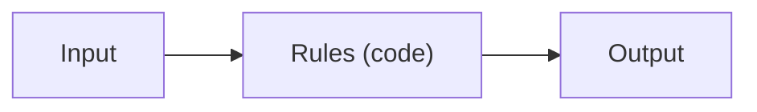
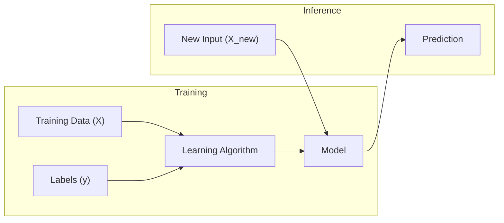

## Traditional programming

In traditional programming, you create **explicit rules**.

- Input data + your rules → output



Example: a tax calculator.

- You have a written policy.
- You implement the policy in code.

Here's how you'd write a spam filter the traditional way, straight from the
book's playbook:

1. Notice patterns — words like "4U," "credit card," "free," and "amazing"
   show up a lot in spam subject lines.
2. Write a detection rule for each pattern, and flag an email as spam if
   enough of them match.
3. Test the program, then repeat steps 1–2 until it's good enough to launch.

Since spam is a moving target, this list of rules keeps growing — and quickly
becomes long, tangled, and hard to maintain.

## Machine learning

In ML, the “rules” are learned from data.

- Input data + output labels → learning algorithm → model
- Later: input data + model → predicted output



## What changes in your workflow?

Traditional programming focus:

- getting the logic right
- writing tests for rule correctness

ML engineering focus:

- getting training data right
- choosing features
- preventing leakage and overfitting
- measuring with the right metrics

## A simple example

### Traditional approach (rule-based spam)

```python title="Rule-based spam (oversimplified)" showLineNumbers{1}
def is_spam(email_text: str) -> bool:
    keywords = ["free", "winner", "click here"]
    text = email_text.lower()
    return any(k in text for k in keywords)
```

### ML approach

You collect labeled examples:

- email text → spam / not spam

Then train a model on those examples — it automatically discovers which words
and phrases are the strongest predictors of spam, so the resulting program is
shorter, easier to maintain, and usually more accurate than hand-written rules.

```python title="Learning the rule from data instead of writing it" showLineNumbers{1}
from sklearn.feature_extraction.text import CountVectorizer
from sklearn.linear_model import LogisticRegression

emails = [
    "win a free prize now",
    "meeting moved to 3pm",
    "click here for a free gift card",
    "please review the attached report",
]
labels = [1, 0, 1, 0]  # 1 = spam, 0 = ham

vectorizer = CountVectorizer()
X = vectorizer.fit_transform(emails)

model = LogisticRegression()
model.fit(X, labels)

new_email = vectorizer.transform(["free meeting report"])
print("spam probability:", model.predict_proba(new_email)[0][1])
```

Notice nobody wrote `if "free" in text`. The model *found* that "free" and
"win" correlate with spam by looking at the data.

:::tip[From the book]
If spammers notice all emails containing "4U" get blocked, they'll switch to
"For U." A rule-based filter needs a human to write a new rule. An ML-based
filter just notices "For U" becoming frequent in spam flagged by users, and
starts blocking it automatically — no code change required.
:::

## Key takeaway

- Traditional programming is **rules-first**.
- ML is **data-first**.

If you don’t have good data (or enough), ML usually disappoints.

import DataCampExercise from "../../../../components/DataCampExercise.astro";

## 🧪 Try It Yourself

### Exercise 1 – The Rule-Based Approach

<DataCampExercise
  lang="python"
  hint={`Use Python's built-in \`any()\` to check if any keyword is in the text.`}
  code={`# Task: Exercise 1 – Rule-Based Spam Check
def is_spam(email_text: str) -> bool:
    keywords = ["free", "winner", "click here"]
    text = email_text.lower()
    return ___(k in text for k in keywords)   # replace ___ with any

print(is_spam("You are a WINNER, click here!"))
print(is_spam("Let's meet tomorrow at 10am"))

# ── Expected Output ───────────────────────────────────────────
# True
# False
# ──────────────────────────────────────────────────────────────`}
  solution={`def is_spam(email_text: str) -> bool:
    keywords = ["free", "winner", "click here"]
    text = email_text.lower()
    return any(k in text for k in keywords)

print(is_spam("You are a WINNER, click here!"))
print(is_spam("Let's meet tomorrow at 10am"))`}
  sct={`test_output_contains("True")
test_output_contains("False")
success_msg("That's the traditional, rules-first approach!")`}
  height={148}
/>

### Exercise 2 – Learning the Rule Instead

<DataCampExercise
  lang="python"
  hint={`Fit the vectorizer with \`fit_transform\`, then fit the model with \`fit\`.`}
  code={`# Task: Exercise 2 – Let the Model Learn From Data
from sklearn.feature_extraction.text import CountVectorizer
from sklearn.linear_model import LogisticRegression

emails = ["free prize now", "meeting at 3pm", "free gift card", "project report attached"]
labels = [1, 0, 1, 0]

vectorizer = CountVectorizer()
X = vectorizer.___(emails)   # replace ___ with fit_transform

model = LogisticRegression()
model.___(X, labels)         # replace ___ with fit
print("classes:", model.classes_)

# ── Expected Output ───────────────────────────────────────────
# classes: [0 1]
# ──────────────────────────────────────────────────────────────`}
  solution={`from sklearn.feature_extraction.text import CountVectorizer
from sklearn.linear_model import LogisticRegression

emails = ["free prize now", "meeting at 3pm", "free gift card", "project report attached"]
labels = [1, 0, 1, 0]

vectorizer = CountVectorizer()
X = vectorizer.fit_transform(emails)
model = LogisticRegression()
model.fit(X, labels)
print("classes:", model.classes_)`}
  sct={`test_output_contains("classes:")
success_msg("The model learned which words predict spam!")`}
  height={148}
/>

### Exercise 3 – Measuring Accuracy

<DataCampExercise
  lang="python"
  hint={`Use \`accuracy_score(y_true, y_pred)\` from \`sklearn.metrics\`.`}
  code={`# Task: Exercise 3 – Accuracy as a Performance Measure
from sklearn.metrics import ___   # replace ___ with accuracy_score

y_true = [1, 0, 1, 1, 0]
y_pred = [1, 0, 0, 1, 0]

acc = ___(y_true, y_pred)   # replace ___ with accuracy_score
print(f"Accuracy: {acc:.2f}")

# ── Expected Output ───────────────────────────────────────────
# Accuracy: 0.80
# ──────────────────────────────────────────────────────────────`}
  solution={`from sklearn.metrics import accuracy_score

y_true = [1, 0, 1, 1, 0]
y_pred = [1, 0, 0, 1, 0]

acc = accuracy_score(y_true, y_pred)
print(f"Accuracy: {acc:.2f}")`}
  sct={`test_output_contains("Accuracy: 0.80")
success_msg("That's the performance measure P from Mitchell's definition!")`}
  height={138}
/>
