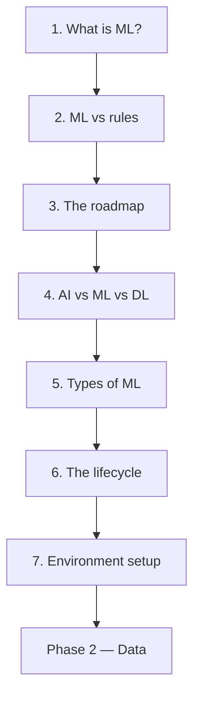

import Quiz from "../../../../components/Quiz.astro";

Most machine-learning courses start with an algorithm. This one starts with the question of whether
you should be here at all.

That is not throat-clearing. The most expensive mistakes in applied machine learning are made before
any model is fitted: training on features that cannot carry the signal, optimising a metric nobody
uses, or building a model where three lines of code would have been exactly correct. This phase is
seven pages of judgement, and every claim in it comes with a measurement you can rerun.

## What this phase covers

| # | Page | The question it answers | The measurement |
| --- | --- | --- | --- |
| 1 | [What is Machine Learning?](/machine-learning/phase-01---the-ml-foundation/what-is-machine-learning/) | What does "learn" mean, operationally? | P rises 0.4426 → 0.9722 as E grows |
| 2 | [ML vs Traditional Programming](/machine-learning/phase-01---the-ml-foundation/ml-vs-traditional-programming/) | When is a model better than a rule? | 30 rules 0.7167 vs one fit 0.7667 |
| 3 | [The ML Roadmap](/machine-learning/phase-01---the-ml-foundation/the-machine-learning-roadmap/) | Where does the work actually go? | 19 of 38 lines run before a model exists |
| 4 | [AI vs ML vs Deep Learning](/machine-learning/phase-01---the-ml-foundation/artificial-intelligence-vs-machine-learning-vs-deep-learning/) | What nests inside what? | Boosting 0.9173 beats the neural net's 0.9040 |
| 5 | [Types of Machine Learning](/machine-learning/phase-01---the-ml-foundation/types-of-machine-learning-supervised-unsupervised-reinforcement/) | Which paradigm does my problem need? | Batch decays to 0.5100; online holds 0.9705 |
| 6 | [The ML Lifecycle](/machine-learning/phase-01---the-ml-foundation/the-ml-lifecycle-from-data-to-deployment/) | What happens after the model works? | Algorithm 0.1142, label noise 0.1142 |
| 7 | [Setting up the Environment](/machine-learning/phase-01---the-ml-foundation/setting-up-the-ml-environment-scikit-learn-tensorflow-pytorch/) | How do I make this reproducible? | Unseeded splits move the score by 0.0556 |

## The four claims this phase defends

Everything here reduces to four statements, each backed by a number you can reproduce.

**1. The features set the ceiling; the algorithm decides how close you get.**
Three very different algorithms on pure noise scored 0.5067, 0.5117 and 0.5320 — all within 0.032 of
a coin flip. No model recovers a signal that is not in the columns.

**2. If you can write the rule, write the rule.**
On a spam corpus, 30 hand-tuned rule variants peaked at 0.7167 and one untuned model reached 0.7667.
A five-point win — and at 20 training examples the rule was *better* by 16 points. The durable
advantage is not accuracy, it is that only one of the two responds to more data.

**3. Data problems and model problems are comparable in size, and not interchangeable.**
Swapping between four algorithms moved accuracy by 0.1142. Flipping 15% of the labels cost exactly
0.1142. The best model on corrupted labels tied the *worst* model on clean ones.

**4. A deployed model decays silently.**
Under a drift of 3.2° per data chunk, a batch model went from 0.9800 to 0.5100 without a single
error, warning or exception. An online model on the same stream held 0.9705.

## What this phase deliberately does not do

- **No algorithm internals.** Gradient descent, tree splitting and kernels start in Phase 3.
- **No deep learning.** It has its own module. Phase 4 here only establishes where it sits and where
  it does not help.
- **No reinforcement learning beyond recognition.** RL needs an environment, not a dataset.
- **No mathematics beyond a squared error.** Phase 3 onwards is where the derivations live.

## Before you start

You need Python, and that is genuinely all.

- Comfortable with functions, loops, lists and dictionaries.
- Able to install packages and run a script.
- NumPy and pandas familiarity helps but is not required — every snippet here is explained.

No calculus, no linear algebra, no statistics beyond an average. Those arrive when they are needed
and not before.

## What you'll be able to do afterwards

1. Decide whether a problem should use machine learning at all, and defend the answer.
2. State a problem in T / E / P terms and identify its baseline before writing any model code.
3. Explain the difference between parameters and hyperparameters without hesitating.
4. Place any system correctly as AI, machine learning, or deep learning.
5. Choose between supervised, unsupervised and semi-supervised from the labels you have.
6. Diagnose underfitting against overfitting from two numbers.
7. Recognise data mismatch and know why regularisation will not fix it.
8. Set up a reproducible environment and explain why the versions are part of the model.

## How long it takes

| Activity | Time |
| --- | --- |
| Reading the seven pages | 3–4 hours |
| Running the code and the 35 exercises | 3–4 hours |
| The practice project below | 2–3 hours |
| **Total** | **8–11 hours** |

This is the shortest phase in the module, and skipping it is the most common way to waste the
longer ones.

## Practice project

**Write a one-page ML feasibility assessment.** Pick a real problem — from your job, a side project,
or something you have wondered about. Then answer, in writing:

**Part 1 — Should this be machine learning at all?**
Work the four criteria from page 1. Does a pattern exist? Can you write the rule instead? Do you
have data? Is approximately-right useful? A "no" on any of them is a finding, and it is worth more
than a model.

**Part 2 — State it precisely.**

| | Your answer |
| --- | --- |
| T — the task, as a sentence | |
| E — where the labelled examples come from, and what they cost | |
| P — the metric, and why that one | |
| Baseline — the dumbest defensible predictor, and its score | |
| Supervised / unsupervised / semi-supervised | |
| Regression or classification | |

**Part 3 — Where would it break?**
For each of these, one sentence: what happens, and how would you notice?

- The features do not carry the signal.
- 15% of the labels are wrong.
- The production distribution differs from your training data.
- The world drifts six months after launch.

**Part 4 — Set up the environment.**
Create the venv, pin the versions, write `check_env.py`, and make it exit non-zero on a problem.
Commit `requirements.in` and the lock file.

If Part 1 concludes that you should not use machine learning, **that is a successful outcome.**
Write down why, and pick a different problem for the rest of the module.

<Quiz
  questions={[
    {
      q: "Three different algorithms all score around 0.51 on your data. What is the diagnosis?",
      options: [
        "All three are misconfigured",
        "The features carry no signal — measured at 0.5067, 0.5117 and 0.5320 on pure noise",
        "You need a neural network",
        "The learning rate is wrong",
      ],
      answer: 1,
      explain: "When genuinely different algorithms agree on a near-chance score, the constraint is the data. That is claim 1 of this phase: the features set the ceiling and the algorithm only decides how close you get to it.",
    },
    {
      q: "You have 20 labelled examples and need a classifier next week. What does this phase suggest?",
      options: [
        "Train a neural network",
        "Write rules — the measured comparison had the rule beating the model by 16 points at n=20",
        "Use unsupervised learning",
        "Collect 10,000 more labels first",
      ],
      answer: 1,
      explain: "The learning curve on the spam corpus crossed at around 500 examples. Below that the hand-written rule genuinely won. Ship the rule, keep labelling, and re-run the comparison when you have enough data.",
    },
    {
      q: "Which of these failures produces no error, no warning and no alert?",
      options: [
        "A shape mismatch in the input",
        "A batch model slowly decaying as the data distribution drifts",
        "A missing dependency",
        "An unpicklable model",
      ],
      answer: 1,
      explain: "Measured in this phase: 0.9800 down to 0.5100 over 29 chunks of gentle drift, with perfectly well-formed predictions throughout. Every other failure on that list is loud. This one is why monitoring exists.",
    },
    {
      q: "In the reference pipeline, how much of the code runs before a model is chosen?",
      options: ["About 20%", "Exactly half — 19 of 38 lines", "About 80%", "About 95%"],
      answer: 1,
      explain: "19 of 38 code lines are load, split, impute, encode and scale. Choosing the algorithm is 2 lines. The widely-repeated 80% figure has no traceable source, so the page counts an actual pipeline instead.",
    },
    {
      q: "What is the single best reason to complete Phase 1 before Phase 3?",
      options: [
        "The algorithms build on it technically",
        "It is judgement, not technique — it decides whether the later phases are worth applying to your problem at all",
        "It is required by scikit-learn",
        "The exercises are easier",
      ],
      answer: 1,
      explain: "Technically you could jump straight to regression. But the most expensive mistakes happen before any model is fitted, and none of the later phases will catch them for you.",
    },
  ]}
/>

## Next

Start with
[What is Machine Learning?](/machine-learning/phase-01---the-ml-foundation/what-is-machine-learning/)
— Mitchell's definition turned into a curve you can reproduce, and a demonstration of the one thing
no algorithm can do.
