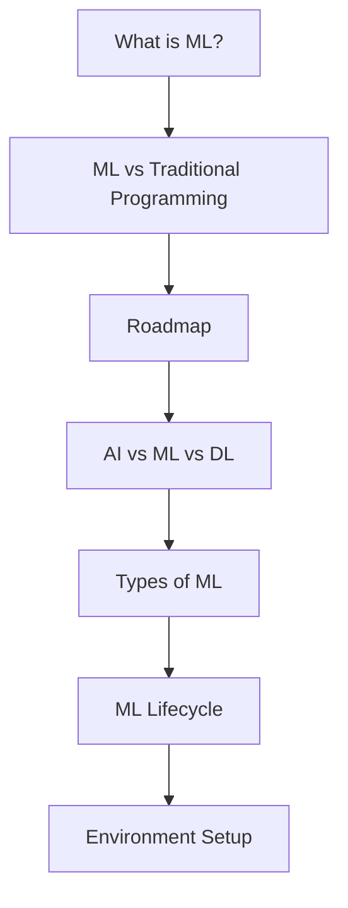

## Why Machine Learning, in one paragraph

When most people hear "Machine Learning" they picture a robot — a dependable
assistant or a menacing Terminator, depending on who you ask. But ML is not a
futuristic fantasy; it has quietly powered your inbox for decades. The **spam
filter** was one of the first ML applications to go mainstream, and it has
learned so well that you rarely need to flag junk mail anymore. This phase
builds the vocabulary and mental models you'll reuse for the rest of this
Machine Learning track — no heavy math required yet, just clear intuition.

## Goals of Phase 1

By the end of this phase, you should be able to:

- explain what *Machine Learning* is in plain English
- describe **ML vs traditional programming** with a diagram
- understand common ML categories: **supervised**, **unsupervised**, **reinforcement**
- name the steps of the **ML lifecycle**, from data to deployment
- set up a solid Python ML environment

## Recommended approach

Read in order and try the mini-checkpoints.

1. What is Machine Learning?
2. ML vs Traditional Programming
3. The Machine Learning Roadmap
4. AI vs ML vs Deep Learning
5. Types of Machine Learning
6. The ML Lifecycle: From Data to Deployment
7. Setting up the ML Environment

## Phase 1 map

:::tip[From the book]
Géron calls Chapter 1 of *Hands-On Machine Learning* "the only chapter without
much code" — and that's on purpose. Before you write a single line of
scikit-learn, make sure the vocabulary here (features, labels, training,
overfitting, generalization) is crystal clear. Every later phase leans on it.
:::
