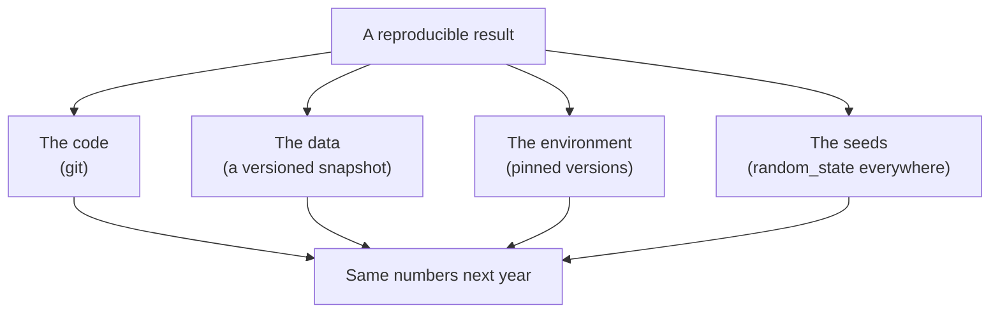
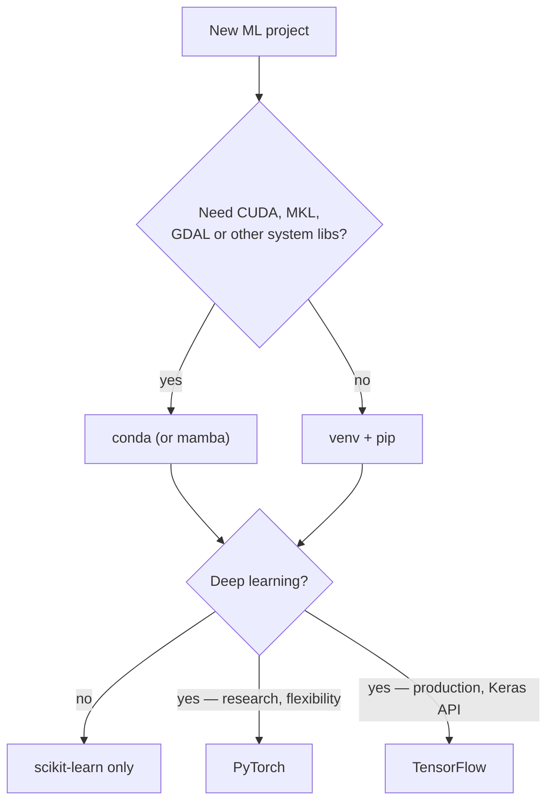

## What you'll learn

- why **the environment is part of the model**, not infrastructure around it
- venv against conda, and the one question that decides between them
- what to pin, what to leave loose, and the difference between a requirements file and a lock file
- a sanity-check script that **fails loudly** rather than failing at 3 a.m.
- how to record enough that a result can be reproduced a year from now

## Why this page exists

A trained model is not just a `.joblib` file. It is that file **plus** the exact library versions
that can deserialise it and reproduce its arithmetic.

Unpickle a scikit-learn model into a different minor version and you get, at best, an
`InconsistentVersionWarning` and slightly different predictions; at worst, an exception. Change
NumPy's BLAS backend and floating-point sums reassociate, so a k-means run converges to a different
local minimum. Neither of these announces itself.

So: **one isolated environment per project, versions pinned, and a script that verifies the
environment before you trust anything it produces.**



Miss any one of the four and the result is not reproducible. Most people track the first and are
surprised by the other three.

## venv or conda

One question decides it: **do you need non-Python dependencies?**

CUDA toolkits, MKL, GDAL, and some compiled scientific libraries are not Python packages, and pip
cannot install them properly. Conda can.

| | `venv` + pip | conda / mamba |
| --- | --- | --- |
| Ships with Python | ✅ | ❌ separate install |
| Installs non-Python deps | ❌ | ✅ |
| Speed | Fast | Slower to solve (use mamba) |
| Disk per environment | Small | Large |
| Standard in web/backend | ✅ | ❌ |
| Standard in scientific computing | ❌ | ✅ |
| Reproducible lock | `pip freeze` / `pip-compile` | `conda env export` |



For everything in this module, **`venv` + pip is sufficient.** Nothing here needs a GPU.

### venv

```bash
python -m venv .venv

# Windows (PowerShell)
.venv\Scripts\Activate.ps1
# macOS / Linux
source .venv/bin/activate

python -m pip install --upgrade pip
pip install -r requirements.txt
```

### conda

```bash
conda create -n ml python=3.11
conda activate ml
conda install -c conda-forge scikit-learn pandas matplotlib jupyterlab
```

Add `.venv/` to `.gitignore`. The environment is described by the requirements file, not committed
as files.

## The stack

Everything in this module runs on the first five:

| Package | What it is for | Needed for this module |
| --- | --- | --- |
| `numpy` | Arrays and the numeric foundation | ✅ |
| `pandas` | Tabular data | ✅ |
| `scikit-learn` | Models, preprocessing, evaluation | ✅ |
| `matplotlib` | Plotting | ✅ |
| `scipy` | Statistics, sparse matrices, linkage | ✅ |
| `joblib` | Saving fitted models | ✅ |
| `jupyterlab` | Notebooks for exploration | Recommended |
| `seaborn` | Statistical plots on top of matplotlib | Optional |
| `torch` | Deep learning — research-first | Deep learning module only |
| `tensorflow` | Deep learning — production-first, Keras API | Deep learning module only |

**Do not install PyTorch or TensorFlow yet.** They are large, they pull in GPU dependencies you do
not need, and nothing in this module uses them. Add them when you reach the deep learning content.

## Pinning: what and how

Three levels, and they are not interchangeable.

### Loose — `requirements.txt` for humans

```text title="requirements.in"
numpy
pandas
scikit-learn
matplotlib
scipy
joblib
jupyterlab
```

Fine for a tutorial. Useless for reproducibility: `pip install -r` next year installs whatever is
current.

### Pinned — direct dependencies

```text title="requirements.txt"
numpy==2.4.6
pandas==3.0.3
scikit-learn==1.9.0
matplotlib==3.11.0
scipy==1.17.1
joblib==1.5.3
```

Better. Still incomplete — it does not pin *transitive* dependencies, so a change deep in the tree
can still alter your results.

### Locked — everything, exactly

```bash
pip freeze > requirements.lock.txt        # simple, includes transitive deps
# or, better:
pip install pip-tools
pip-compile requirements.in -o requirements.txt   # resolved, hash-pinned, with comments
```

Use `requirements.in` (loose, human-edited) plus a generated lock file. Commit both. That way you
know *why* each package is there and exactly which version was used.

### Pin the Python version too

`.python-version` for pyenv, or the `python=3.11` in your conda command, or a line in the README.
scikit-learn drops Python versions on a schedule, and "it works on my machine" is very often "my
machine has 3.11 and CI has 3.9".

### See it move

The three levels differ only in what happens on a day you are not looking. The sketch runs a
release timeline: new versions of four packages land over time, and two machines install from the
same repository — one reading a loose `requirements.in`, one reading a lock file. Every install is a
fresh `pip install`, exactly as CI does it.

```p5 title="Loose install versus lock file, over time" desc="Package releases drop onto a timeline while two machines reinstall from the same repository. The loose machine picks up whatever is newest, so its resolved set drifts and eventually disagrees with the machine that installed months ago. The locked machine resolves identically every time." height="380"
const PKGS = ["numpy", "pandas", "scikit-learn", "scipy"];
const LOCK = ["2.4.6", "3.0.3", "1.9.0", "1.17.1"];
// (day, package index, new version) -- releases arrive on their own schedules
const RELEASES = [
  [14, 0, "2.4.7"], [26, 2, "1.9.1"], [38, 1, "3.0.4"], [52, 3, "1.17.2"],
  [61, 0, "2.5.0"], [74, 2, "1.10.0"], [88, 1, "3.1.0"], [96, 3, "1.18.0"],
  [110, 0, "2.5.1"], [124, 2, "1.10.1"],
];
let day = 0;
let latest = LOCK.slice();
let looseFirst = null;
let looseNow = LOCK.slice();
let drifted = 0;
let installs = 0;

function setup() {
  createCanvas(620, 380);
  textFont("monospace");
  looseFirst = LOCK.slice();
}
function draw() {
  background(13, 17, 23);

  // advance the clock and apply any release due today
  day += 0.45;
  for (const [d, idx, ver] of RELEASES) {
    if (day >= d && latest[idx] !== ver && versionRank(ver) > versionRank(latest[idx])) {
      latest[idx] = ver;
    }
  }
  // both machines reinstall every 20 simulated days
  if (Math.floor(day / 20) > installs - 1) {
    installs = Math.floor(day / 20) + 1;
    looseNow = latest.slice();
    drifted = 0;
    for (let i = 0; i < PKGS.length; i++) if (looseNow[i] !== looseFirst[i]) drifted++;
  }
  if (day > 140) { day = 0; latest = LOCK.slice(); looseNow = LOCK.slice(); installs = 0; drifted = 0; }

  // timeline
  const tx = (d) => 62 + (d / 140) * (width - 130);
  stroke(60, 68, 78);
  strokeWeight(2);
  line(62, 56, width - 68, 56);
  noStroke();
  for (const [d, idx] of RELEASES) {
    fill(day >= d ? color(150, 120, 200) : color(48, 54, 62));
    ellipse(tx(d), 56, 8, 8);
  }
  fill(255, 211, 67);
  ellipse(tx(day), 56, 12, 12);
  fill(140);
  textSize(11);
  textAlign(LEFT, BOTTOM);
  text("releases arriving -> day " + Math.floor(day), 62, 44);

  // two panels
  const rows = [
    ["loose  requirements.in", looseNow, color(232, 122, 122)],
    ["locked requirements.txt", LOCK, color(120, 200, 120)],
  ];
  for (let r = 0; r < 2; r++) {
    const [label, set, col] = rows[r];
    const top = 96 + r * 130;
    fill(col);
    textSize(12);
    textAlign(LEFT, TOP);
    text(label, 62, top);
    for (let i = 0; i < PKGS.length; i++) {
      const y = top + 24 + i * 22;
      fill(150);
      textSize(11);
      textAlign(LEFT, TOP);
      text(PKGS[i], 74, y);
      const changed = set[i] !== looseFirst[i];
      fill(r === 0 && changed ? color(232, 122, 122) : color(215));
      textAlign(RIGHT, TOP);
      text("==" + set[i], 300, y);
      if (r === 0 && changed) {
        fill(232, 122, 122);
        textAlign(LEFT, TOP);
        text("was " + looseFirst[i], 312, y);
      }
    }
  }

  // verdict
  fill(drifted > 0 ? color(232, 122, 122) : color(120, 200, 120));
  textSize(13);
  textAlign(LEFT, TOP);
  text(
    drifted > 0
      ? drifted + " of 4 packages differ from the first install"
      : "both machines agree",
    62,
    352
  );
  fill(110);
  textSize(11);
  textAlign(RIGHT, TOP);
  text("installs: " + installs, width - 68, 352);
}
function versionRank(v) {
  const p = v.split(".").map(Number);
  return p[0] * 1e6 + p[1] * 1e3 + p[2];
}
function mousePressed() { day = 0; latest = LOCK.slice(); looseNow = LOCK.slice(); installs = 0; drifted = 0; }
```

Nothing in the loose panel is a bug. Every version it picks is a legitimate release that its
maintainers tested. The failure is that **the set is chosen by the calendar rather than by you**, so
the environment that produced a saved model is no longer reconstructible — and the day it breaks is
never the day it drifted.

## The sanity check

Write this once, run it whenever an environment is new or something is behaving oddly. The point is
that it **fails loudly**.

```python title="check_env.py" showLineNumbers{1}
"""Verify the ML environment. Exit non-zero if anything is wrong."""
import importlib
import platform
import sys

REQUIRED = {
    "numpy": "2.0",
    "pandas": "2.0",
    "sklearn": "1.4",
    "matplotlib": "3.8",
    "scipy": "1.11",
    "joblib": "1.3",
}
OPTIONAL = ["seaborn", "torch", "tensorflow"]


def version_tuple(v):
    """'1.9.0' -> (1, 9, 0), ignoring any suffix like 'rc1'."""
    out = []
    for part in v.split("."):
        digits = "".join(c for c in part if c.isdigit())
        if not digits:
            break
        out.append(int(digits))
    return tuple(out)


def main():
    print(f"python {platform.python_version()}  ({sys.executable})")
    problems = []

    for name, minimum in REQUIRED.items():
        try:
            mod = importlib.import_module(name)
        except ImportError:
            problems.append(f"{name} is NOT INSTALLED (need >= {minimum})")
            print(f"  {name:12s} MISSING")
            continue
        found = getattr(mod, "__version__", "0")
        ok = version_tuple(found) >= version_tuple(minimum)
        print(f"  {name:12s} {found:10s} {'ok' if ok else f'TOO OLD (need >= {minimum})'}")
        if not ok:
            problems.append(f"{name} {found} < {minimum}")

    for name in OPTIONAL:
        try:
            mod = importlib.import_module(name)
            print(f"  {name:12s} {getattr(mod, '__version__', '?'):10s} (optional)")
        except ImportError:
            print(f"  {name:12s} {'-':10s} (optional, not installed)")

    # Does the stack actually run end to end?
    from sklearn.datasets import load_iris
    from sklearn.linear_model import LogisticRegression
    from sklearn.model_selection import cross_val_score

    X, y = load_iris(return_X_y=True)
    score = cross_val_score(LogisticRegression(max_iter=500), X, y, cv=5).mean()
    print(f"\nsmoke test: iris 5-fold accuracy {score:.4f}")
    if score < 0.9:
        problems.append(f"smoke test scored only {score:.4f}")

    if problems:
        print("\nPROBLEMS:")
        for p in problems:
            print(f"  - {p}")
        sys.exit(1)
    print("environment OK")


if __name__ == "__main__":
    main()
```

Run it:

```bash
python check_env.py
```

The `sys.exit(1)` matters. A checker that prints a warning and returns zero will be ignored by CI
and by you.

## Reproducibility beyond versions

Pinning is necessary and not sufficient. Four more habits:

**Seed everything.** Every scikit-learn estimator with randomness takes `random_state`. Set it. Set
it in `train_test_split` too. An unseeded split makes every number on the page unrepeatable.

```python
train_test_split(X, y, test_size=0.2, random_state=42)
RandomForestClassifier(n_estimators=200, random_state=42)
KMeans(n_clusters=4, n_init=10, random_state=42)
```

**Version the data, not just the code.** A hash of the input file, or a snapshot path with a date.
"I reran it and got different numbers" is usually a changed input.

**Record the environment with the artefact.** When you save a model, save the versions next to it:

```python title="save_with_provenance.py" showLineNumbers{1}
import json
import platform

import joblib
import sklearn

joblib.dump(model, "model.joblib")
with open("model.meta.json", "w") as fh:
    json.dump({
        "python": platform.python_version(),
        "sklearn": sklearn.__version__,
        "trained_at": "2026-08-03",     # pass the real timestamp in
        "data_snapshot": "orders_2026-07-31.parquet",
        "random_state": 42,
    }, fh, indent=2)
```

**Expect the version warning.** When you load a model saved by a different scikit-learn version you
will see `InconsistentVersionWarning`. Do not suppress it — it is telling you the predictions may
differ.

## CPU or GPU

Short version: **you do not need a GPU for this module.** Everything here runs on a laptop CPU in
seconds.

| Workload | CPU | GPU |
| --- | --- | --- |
| scikit-learn (all of it) | ✅ Fine | Not supported anyway |
| Gradient boosting on ≤ 1M rows | ✅ Fine | Marginal |
| Small neural nets | ✅ Fine | Faster |
| CNNs on real images | ⚠️ Slow | ✅ Necessary |
| Fine-tuning a language model | ❌ | ✅ Necessary |

scikit-learn has no GPU support and does not want any — it parallelises across CPU cores with
`n_jobs=-1`. Use that instead:

```python
cross_val_score(model, X, y, cv=5, n_jobs=-1)
GridSearchCV(pipe, grid, cv=5, n_jobs=-1)
RandomForestClassifier(n_estimators=500, n_jobs=-1)
```

When you do need a GPU, rent one rather than buying: Colab, Kaggle notebooks, or a cloud instance.

## Pitfalls

**Installing into the system Python.** Two projects will eventually need incompatible versions, and
on some Linux distributions you can break the OS package manager. Always create an environment.

**`pip freeze` on an environment you installed everything into.** You end up with 200 lines and no
idea which six you actually asked for. Keep a `requirements.in` of direct dependencies and generate
the lock from it.

**Not pinning the Python version.** The most common cause of a green local run and a red CI run.

**Installing PyTorch and TensorFlow "just in case".** Several gigabytes, GPU dependencies, and
occasionally conflicting NumPy requirements — for libraries this module never imports.

**Ignoring `InconsistentVersionWarning`.** It means the model was pickled under a different version.
The predictions may be fine. They may not be. Either way you no longer know.

**Forgetting seeds.** An unseeded `train_test_split` makes every metric you quote unrepeatable, and
the difference between two models becomes indistinguishable from the split noise.

**Committing the virtual environment.** `.venv/` in `.gitignore`, always.

## Recap

- The environment is **part of the model**, alongside code, data and seeds.
- `venv` + pip unless you need non-Python dependencies; then conda. This module needs only `venv`.
- Five packages carry everything here: numpy, pandas, scikit-learn, matplotlib, scipy.
- Keep a loose `requirements.in` and generate a pinned lock file from it. Pin Python too.
- Write a `check_env.py` that **exits non-zero** — a silent checker is not a checker.
- Seed everything, version the data, and store provenance next to the artefact.
- No GPU is needed for this module. Use `n_jobs=-1` instead.

<Quiz
  questions={[
    {
      q: "You unpickle a model saved under scikit-learn 1.4 into an environment running 1.9. What happens?",
      options: [
        "It always fails with an exception",
        "You get an InconsistentVersionWarning; it may load and predict slightly differently, or it may break",
        "It silently works identically",
        "scikit-learn migrates it automatically",
      ],
      answer: 1,
      explain: "The pickle format is not a stable interface across versions. Sometimes it loads and behaves the same, sometimes the internals moved and predictions shift, sometimes it raises. That uncertainty is exactly why the version belongs with the artefact.",
    },
    {
      q: "When is conda the right choice over venv?",
      options: [
        "Always, for machine learning",
        "When you need non-Python dependencies such as CUDA, MKL or GDAL that pip cannot install properly",
        "When the project is large",
        "When you are on Windows",
      ],
      answer: 1,
      explain: "That single question decides it. Everything in this module is pure Python plus wheels, so venv and pip are sufficient — and lighter, faster and more standard outside scientific computing.",
    },
    {
      q: "Why keep requirements.in separately from a generated lock file?",
      options: [
        "It is faster to install",
        "The .in file records WHICH packages you actually asked for; the lock records exactly what got installed, transitive dependencies included",
        "pip requires both",
        "It reduces disk usage",
      ],
      answer: 1,
      explain: "A bare pip freeze gives you 200 pinned lines with no indication which six you chose deliberately. Splitting intent from resolution means you can upgrade deliberately and still reproduce exactly.",
    },
    {
      q: "Your check_env.py prints a warning about an old package and returns exit code 0. What is wrong?",
      options: [
        "Nothing — the warning is enough",
        "A zero exit code means CI treats a broken environment as passing, so nobody sees the warning",
        "It should raise an exception instead",
        "It should upgrade the package automatically",
      ],
      answer: 1,
      explain: "Automation reads exit codes, not prose. A checker that always succeeds provides false assurance, which is worse than having no checker at all — you will trust results that were produced in a broken environment.",
    },
    {
      q: "Do you need a GPU to complete this module?",
      options: [
        "Yes, for the ensemble methods",
        "No — scikit-learn has no GPU support at all and parallelises across CPU cores with n_jobs=-1",
        "Yes, for cross-validation",
        "Only for the unsupervised phase",
      ],
      answer: 1,
      explain: "scikit-learn is CPU-only by design. Everything in this module runs in seconds on a laptop. Set n_jobs=-1 on cross_val_score, GridSearchCV and the forest estimators to use all your cores.",
    },
  ]}
/>

## 🧪 Try It Yourself

### Exercise 1 – Check the core libraries

<DataCampExercise
  lang="python"
  hint={`importlib.import_module takes the module name as a string; getattr reads __version__ safely.`}
  code={`# Task: Exercise 1 - Check the core libraries
import importlib
import platform

# Importing each package once makes sure the runtime has loaded it.
import numpy, pandas, sklearn, matplotlib, scipy, joblib  # noqa: F401

REQUIRED = ["numpy", "pandas", "sklearn", "matplotlib", "scipy", "joblib"]

print("python", platform.python_version())
missing = []
for name in REQUIRED:
    try:
        mod = importlib.___(name)             # replace ___ with import_module
        print(f"  {name:12s} {getattr(mod, '__version__', '?')}")
    except ImportError:
        missing.append(name)
        print(f"  {name:12s} MISSING")

print("missing:", len(missing))

# -- Expected Output -------------------------------------------
# python 3.13.2
#   numpy        2.2.5
#   pandas       2.3.3
#   sklearn      1.7.0
#   matplotlib   3.8.4
#   scipy        1.14.1
#   joblib       1.4.2
# missing: 0
# --------------------------------------------------------------`}
  solution={`import importlib
import platform

# Importing each package once makes sure the runtime has loaded it.
import numpy, pandas, sklearn, matplotlib, scipy, joblib  # noqa: F401

REQUIRED = ["numpy", "pandas", "sklearn", "matplotlib", "scipy", "joblib"]
print("python", platform.python_version())
missing = []
for name in REQUIRED:
    try:
        mod = importlib.import_module(name)
        print(f"  {name:12s} {getattr(mod, '__version__', '?')}")
    except ImportError:
        missing.append(name)
        print(f"  {name:12s} MISSING")
print("missing:", len(missing))`}
  sct={`test_output_contains("missing: 0")
success_msg("Your exact version numbers will differ — what matters is that nothing is MISSING.")`}
  height={280}
/>

### Exercise 2 – Compare versions properly

<DataCampExercise
  lang="python"
  hint={`Split on dots and compare tuples of ints — string comparison gets "1.10" wrong.`}
  code={`# Task: Exercise 2 - Compare versions properly
def version_tuple(v):
    out = []
    for part in v.split("."):
        digits = "".join(c for c in part if c.isdigit())
        if not digits:
            break
        out.append(int(digits))
    return ___(out)                           # replace ___ with tuple

cases = [("1.9.0", "1.4"), ("1.10.0", "1.9"), ("2.0.0rc1", "2.0"), ("1.3.2", "1.4")]
for found, minimum in cases:
    ok = version_tuple(found) >= version_tuple(minimum)
    print(f"{found:10s} >= {minimum:5s}  {ok}")

print("string comparison would say '1.10.0' >= '1.9' is",
      "1.10.0" >= "1.9")

# -- Expected Output -------------------------------------------
# 1.9.0      >= 1.4    True
# 1.10.0     >= 1.9    True
# 2.0.0rc1   >= 2.0    True
# 1.3.2      >= 1.4    False
# string comparison would say '1.10.0' >= '1.9' is False
# --------------------------------------------------------------`}
  solution={`def version_tuple(v):
    out = []
    for part in v.split("."):
        digits = "".join(c for c in part if c.isdigit())
        if not digits:
            break
        out.append(int(digits))
    return tuple(out)

cases = [("1.9.0", "1.4"), ("1.10.0", "1.9"), ("2.0.0rc1", "2.0"), ("1.3.2", "1.4")]
for found, minimum in cases:
    ok = version_tuple(found) >= version_tuple(minimum)
    print(f"{found:10s} >= {minimum:5s}  {ok}")
print("string comparison would say '1.10.0' >= '1.9' is",
      "1.10.0" >= "1.9")`}
  sct={`test_output_contains("string comparison would say '1.10.0' >= '1.9' is False")
success_msg("String comparison says 1.10 is older than 1.9. That bug is in a lot of real check scripts.")`}
  height={270}
/>

### Exercise 3 – Handle an optional dependency gracefully

<DataCampExercise
  lang="python"
  hint={`Wrap the import in try/except ImportError and carry on rather than crashing.`}
  code={`# Task: Exercise 3 - Handle an optional dependency gracefully
import importlib

def probe(name):
    try:
        mod = importlib.import_module(name)
        return getattr(mod, "__version__", "?")
    except ImportError:
        return ___                            # replace ___ with None

for name in ["sklearn", "torch", "tensorflow", "definitely_not_a_package"]:
    v = probe(name)
    status = f"{v}" if v else "not installed (fine — optional)"
    print(f"{name:26s} {status}")

# -- Expected Output (your installed set will differ) -----------
# sklearn                    1.9.0
# torch                      not installed (fine — optional)
# tensorflow                 2.21.0
# definitely_not_a_package   not installed (fine — optional)
# --------------------------------------------------------------`}
  solution={`import importlib

def probe(name):
    try:
        mod = importlib.import_module(name)
        return getattr(mod, "__version__", "?")
    except ImportError:
        return None

for name in ["sklearn", "torch", "tensorflow", "definitely_not_a_package"]:
    v = probe(name)
    status = f"{v}" if v else "not installed (fine — optional)"
    print(f"{name:26s} {status}")`}
  sct={`test_output_contains("definitely_not_a_package")
success_msg("Missing optional packages should never crash a checker. Missing REQUIRED ones should exit non-zero.")`}
  height={260}
/>

### Exercise 4 – Prove that seeds matter

<DataCampExercise
  lang="python"
  hint={`Call train_test_split several times without random_state and watch the score move.`}
  code={`# Task: Exercise 4 - Prove that seeds matter
import numpy as np
from sklearn.datasets import load_wine
from sklearn.linear_model import LogisticRegression
from sklearn.model_selection import train_test_split
from sklearn.pipeline import make_pipeline
from sklearn.preprocessing import StandardScaler

X, y = load_wine(return_X_y=True)

unseeded = []
for _ in range(5):
    a, b, ay, by = train_test_split(X, y, test_size=0.3)     # no random_state!
    m = make_pipeline(StandardScaler(), LogisticRegression(max_iter=3000)).fit(a, ay)
    unseeded.append(m.score(b, by))

seeded = []
for _ in range(5):
    a, b, ay, by = train_test_split(X, y, test_size=0.3, random_state=___)
    m = make_pipeline(StandardScaler(), LogisticRegression(max_iter=3000)).fit(a, ay)
    seeded.append(m.score(b, by))            # replace ___ with 42

print("unseeded spread", round(max(unseeded) - min(unseeded), 4))
print("seeded spread  ", round(max(seeded) - min(seeded), 4))

# -- Expected Output -------------------------------------------
# unseeded spread 0.0556      <- varies every run; that IS the point
# seeded spread   0.0
# --------------------------------------------------------------`}
  solution={`import numpy as np
from sklearn.datasets import load_wine
from sklearn.linear_model import LogisticRegression
from sklearn.model_selection import train_test_split
from sklearn.pipeline import make_pipeline
from sklearn.preprocessing import StandardScaler

X, y = load_wine(return_X_y=True)
unseeded = []
for _ in range(5):
    a, b, ay, by = train_test_split(X, y, test_size=0.3)
    m = make_pipeline(StandardScaler(), LogisticRegression(max_iter=3000)).fit(a, ay)
    unseeded.append(m.score(b, by))
seeded = []
for _ in range(5):
    a, b, ay, by = train_test_split(X, y, test_size=0.3, random_state=42)
    m = make_pipeline(StandardScaler(), LogisticRegression(max_iter=3000)).fit(a, ay)
    seeded.append(m.score(b, by))
print("unseeded spread", round(max(unseeded) - min(unseeded), 4))
print("seeded spread  ", round(max(seeded) - min(seeded), 4))`}
  sct={`test_output_contains("seeded spread   0.0")
success_msg("The unseeded spread is split noise. Any model comparison smaller than that is meaningless.")`}
  height={290}
/>

### Exercise 5 – Record provenance with the model

<DataCampExercise
  lang="python"
  hint={`Build a dict of everything you would need to reproduce the run, then serialise it.`}
  code={`# Task: Exercise 5 - Record provenance with the model
import json
import platform

import sklearn
from sklearn.datasets import load_iris
from sklearn.linear_model import LogisticRegression

X, y = load_iris(return_X_y=True)
SEED = 42
model = LogisticRegression(max_iter=500, random_state=SEED).fit(X, y)

meta = {
    "python": platform.python_version(),
    "sklearn": sklearn.__version__,
    "estimator": type(model).__name__,
    "random_state": SEED,
    "n_train_rows": len(X),
    "n_features": X.shape[1],
}
print(json.___(meta, indent=2))               # replace ___ with dumps

# -- Expected Output -------------------------------------------
# {
#   "python": "3.11.9",
#   "sklearn": "1.9.0",
#   "estimator": "LogisticRegression",
#   "random_state": 42,
#   "n_train_rows": 150,
#   "n_features": 4
# }
# --------------------------------------------------------------`}
  solution={`import json
import platform

import sklearn
from sklearn.datasets import load_iris
from sklearn.linear_model import LogisticRegression

X, y = load_iris(return_X_y=True)
SEED = 42
model = LogisticRegression(max_iter=500, random_state=SEED).fit(X, y)
meta = {
    "python": platform.python_version(),
    "sklearn": sklearn.__version__,
    "estimator": type(model).__name__,
    "random_state": SEED,
    "n_train_rows": len(X),
    "n_features": X.shape[1],
}
print(json.dumps(meta, indent=2))`}
  sct={`test_output_contains("LogisticRegression")
success_msg("Write this next to every model you save. Future you will not remember which sklearn version produced it.")`}
  height={290}
/>

### Exercise 6 – Audit an environment against its lock file

<DataCampExercise
  lang="python"
  hint={`dict.get(package) returns None when the package is absent, which is a different problem from a version mismatch.`}
  code={`# Task: Exercise 6 - Audit an environment against its lock file
locked = {"numpy": "2.4.6", "pandas": "3.0.3", "scikit-learn": "1.9.0",
          "scipy": "1.17.1", "joblib": "1.5.3"}
installed = {"numpy": "2.5.0", "pandas": "3.0.3", "scikit-learn": "1.10.0",
             "scipy": "1.17.1"}

problems = []
for package, want in sorted(locked.items()):
    have = installed.___(package)                 # replace ___ with get
    if have is None:
        problems.append(f"{package}: MISSING (locked at {want})")
    elif have != want:
        problems.append(f"{package}: {have} installed, {want} locked")

print(f"packages locked:    {len(locked)}")
print(f"packages installed: {len(installed)}")
for problem in problems:
    print(f"  {problem}")
print(f"reproducible: {not problems}")

# -- Expected Output -------------------------------------------
# packages locked:    5
# packages installed: 4
#   joblib: MISSING (locked at 1.5.3)
#   numpy: 2.5.0 installed, 2.4.6 locked
#   scikit-learn: 1.10.0 installed, 1.9.0 locked
# reproducible: False
# --------------------------------------------------------------`}
  solution={`locked = {"numpy": "2.4.6", "pandas": "3.0.3", "scikit-learn": "1.9.0",
          "scipy": "1.17.1", "joblib": "1.5.3"}
installed = {"numpy": "2.5.0", "pandas": "3.0.3", "scikit-learn": "1.10.0",
             "scipy": "1.17.1"}

problems = []
for package, want in sorted(locked.items()):
    have = installed.get(package)
    if have is None:
        problems.append(f"{package}: MISSING (locked at {want})")
    elif have != want:
        problems.append(f"{package}: {have} installed, {want} locked")

print(f"packages locked:    {len(locked)}")
print(f"packages installed: {len(installed)}")
for problem in problems:
    print(f"  {problem}")
print(f"reproducible: {not problems}")`}
  sct={`test_output_contains("reproducible: False")
success_msg("Three findings of two different kinds. A missing package fails loudly; a drifted version fails quietly, months later, in a number nobody can reproduce.")`}
  height={300}
/>

## Next

That completes Phase 1. Go back to the
[phase overview](/machine-learning/phase-01---the-ml-foundation/phase-1---the-ml-foundation/) for
the practice project, or start
[Phase 2 - Data Preprocessing & Feature Engineering](/machine-learning/phase-02---data-preprocessing--feature-engineering/phase-2---data-preprocessing--feature-engineering/),
where the 19 lines of data work in the reference pipeline get unpacked one at a time.
