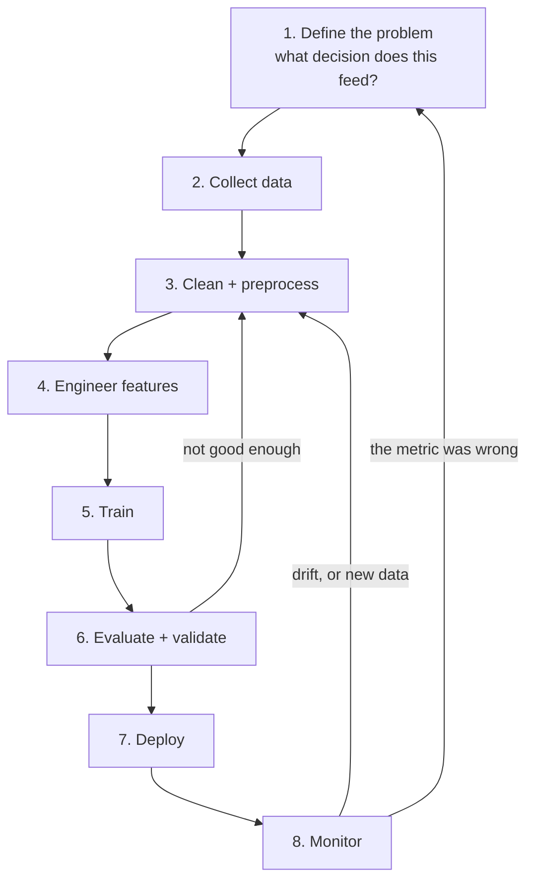

import DataCampExercise from "../../../../components/DataCampExercise.astro";
import Figure from "../../../../components/Figure.astro";
import Quiz from "../../../../components/Quiz.astro";

## What you'll learn

- the eight stages, and which of them are loops rather than steps
- bad data against bad algorithms, measured: **0.1142 either way**
- underfitting and overfitting as one number — the train/test gap
- why one held-out set is not enough, and what the **train-dev set** diagnoses
- the **No Free Lunch** theorem, demonstrated on four datasets where the winner keeps moving

## The lifecycle



Two of those arrows matter more than the boxes. **Evaluation loops back to data**, not to model
selection — that is where the measurement below points. And **monitoring loops back to problem
definition**, because the most common discovery in production is that you optimised the wrong thing.

| Stage | The question it answers | Gets it wrong by |
| --- | --- | --- |
| 1. Problem definition | What decision does the prediction feed, and what does each error cost? | Optimising a metric nobody uses |
| 2. Data collection | Is this sample representative of production? | Training on a population you will not serve |
| 3. Cleaning | What is missing, wrong, duplicated, leaking? | Silently destroying the signal |
| 4. Feature engineering | What representation makes the pattern learnable? | Leaving the ceiling low |
| 5. Training | Which model family, which hyperparameters? | Overthinking the smallest lever |
| 6. Evaluation | Will this hold up on data it has never seen? | Tuning on the test set |
| 7. Deployment | Can it run at the required latency and cost? | Shipping a 1 GB artefact to an edge device |
| 8. Monitoring | Is the world still the shape it was? | Silent decay |

## Bad data or bad algorithm?

Every practitioner eventually asks: is my model underperforming because the algorithm is wrong, or
because the data is bad? It is worth putting numbers on both.

Same 1,200-row dataset, four algorithms, three data conditions:

| Model | Clean, n=1200 | 15% of labels flipped | Clean but n=150 |
| --- | --- | --- | --- |
| Logistic regression | 0.7892 | 0.7075 | 0.7600 |
| **RBF SVM** | **0.9033** | 0.7892 | 0.8267 |
| Random forest | 0.8883 | 0.7783 | 0.8200 |
| Gradient boosting | 0.8992 | 0.7533 | 0.7467 |

Three quantities fall out:

- **Swapping the algorithm** on clean data: 0.7892 → 0.9033, a spread of **0.1142**.
- **Flipping 15% of the labels**, best model to best model: 0.9033 → 0.7892, a cost of **0.1142**.
- **Cutting the data 8×**, best model to best model: 0.9033 → 0.8267, a cost of **0.0767**.

<Figure
  src="/images/ml/phase-01-foundation/the-ml-lifecycle-from-data-to-deployment/data-beats-model"
  alt="A grouped bar chart of four algorithms under three data conditions. Green bars for clean data are highest, red bars for flipped labels lowest, amber bars for small data in between."
  title="Two levers, the same size"
  caption="The algorithm spread on clean data is 0.1142, from logistic regression at 0.7892 to the RBF SVM at 0.9033. Corrupting 15% of the labels costs the best model exactly the same 0.1142. Neither lever dominates — and only one of them is usually the one people reach for."
{...{}}
/>

The popular slogan is "data beats algorithms". The measurement says something more useful: **the two
levers are comparable in size, and you cannot substitute one for the other.** The best algorithm on
corrupted labels (0.7892) is no better than the *worst* algorithm on clean data (0.7892) — exactly
equal, which is a coincidence, but an instructive one.

The practical consequence: if your model is underperforming, look at the data first — not because
data always matters more, but because a data problem cannot be fixed by any algorithm, while an
algorithm problem takes ten minutes to test.

## Underfitting and overfitting

The two failure modes of stage 5, and one number distinguishes them: the **gap between training and
held-out performance.**

| Decision tree depth | Train | Held out | Gap |
| --- | --- | --- | --- |
| 1 | 0.8000 | 0.7190 | 0.0810 |
| 2 | 0.9000 | 0.8381 | 0.0619 |
| **4** | 0.9128 | **0.8667** | **0.0462** |
| 6 | 0.9513 | 0.8571 | 0.0941 |
| 10 | 0.9897 | 0.8381 | 0.1516 |
| 20 | 1.0000 | 0.8190 | 0.1810 |

<Figure
  src="/images/ml/phase-01-foundation/the-ml-lifecycle-from-data-to-deployment/overfitting-gap"
  alt="Two curves against tree depth. The blue training curve rises to 1.0 and stays there; the amber held-out curve peaks at depth 4 and then declines, with the widening gap shaded red."
  title="More capacity always helps the training set"
  caption="Training accuracy is monotone in depth and reaches a perfect 1.0000 — which is exactly why it tells you nothing. Held-out accuracy peaks at 0.8667 at depth 4 and falls to 0.8190 by depth 20. The shaded region is the overfitting."
/>

**Underfitting** is a low training score. The model is not flexible enough to capture the pattern
even on data it has seen. Depth 1 above: 0.8000 on training.

**Overfitting** is a large gap. The model captured noise specific to the training rows. Depth 20:
train 1.0000, held out 0.8190, gap 0.1810.

### See it move

```p5 title="Overfitting vs underfitting" desc="The grey points jitter with noise. The blue underfit line barely reacts, the gold good-fit curve ignores the noise entirely, and the pink overfit curve writhes as it chases every wiggle. Click to reshuffle the noise pattern." height="300"
let pts = [];
const PERIOD = 300;
function genPts() {
  pts = [];
  for (let i = 0; i < 18; i++) {
    const x = map(i, 0, 17, -2.6, 2.6);
    const trueY = 0.35 * x * x - 0.6;
    const amp = random(0.15, 0.4);
    const phase = random(TWO_PI);
    pts.push({ x: x, trueY: trueY, amp: amp, phase: phase, y: trueY });
  }
}
function setup() {
  createCanvas(600, 300);
  textFont("monospace");
  textAlign(LEFT, CENTER);
  genPts();
}
function px(x) { return 50 + (x + 3) / 6 * (width - 90); }
function py(y) { return (height - 55) - (y + 1.5) / 5.5 * (height - 90); }
function draw() {
  background(13, 17, 23);

  const t = (frameCount % PERIOD) / PERIOD;
  for (const p of pts) {
    p.y = p.trueY + p.amp * sin(TWO_PI * t + p.phase);
  }

  noStroke();
  for (const p of pts) {
    fill(180, 190, 200);
    ellipse(px(p.x), py(p.y), 7, 7);
  }

  // underfit: flat mean line — recomputed each frame, only bobs gently
  const meanY = pts.reduce((s, p) => s + p.y, 0) / pts.length;
  stroke(75, 139, 190);
  strokeWeight(2.5);
  line(px(-3), py(meanY), px(3), py(meanY));

  // good fit: the true quadratic — unmoved by noise
  stroke(255, 211, 67);
  strokeWeight(2.5);
  noFill();
  beginShape();
  for (let x = -3; x <= 3; x += 0.1) vertex(px(x), py(0.35 * x * x - 0.6));
  endShape();

  // overfit: wiggly curve chasing every noisy point
  stroke(230, 90, 130);
  strokeWeight(2);
  noFill();
  beginShape();
  for (const p of pts) curveVertex(px(p.x), py(p.y));
  endShape();

  noStroke();
  fill(75, 139, 190); text("underfit (barely reacts to noise)", 16, 20);
  fill(255, 211, 67); text("good fit (stable, ignores noise)", 16, 38);
  fill(230, 90, 130); text("overfit (chases every wiggle)", 16, 56);
}
function mousePressed() { genPts(); }
```

The pink curve is the point. It passes closer to every training point than the gold one does — its
training error is genuinely lower — and it is wrong about the underlying shape. Watch it thrash
while the gold curve, which describes the actual pattern, does not move at all.

Read the two numbers together and the diagnosis is immediate:

| Train | Held out | Diagnosis | Fix |
| --- | --- | --- | --- |
| Low | Low | Underfitting | More capacity, better features |
| **High** | **Low** | **Overfitting** | Regularise, simplify, more data |
| High | High | Working | Ship it |
| Low | High | Something is broken | Check for a leak or a bad split |

That last row is not a joke — it usually means the test set is easier than the training set, or the
two have been swapped.

## One held-out set is not enough

You split off a test set, tune your model, and report the test score. The problem: every tuning
decision you made was informed by that test score, so it is no longer held out. You have leaked, a
little, thirty times.

The standard fix is three splits: **train**, **validation** (tune here), and **test** (touch once).
[Phase 7](/machine-learning/phase-07---model-optimization--tuning/k-fold-cross-validation/) replaces
the validation set with cross-validation, which is better still.

### The train-dev set

There is a subtler failure the three-way split cannot diagnose. Suppose you train an image
classifier on web photos, but production is phone photos. Your validation and test sets are phone
photos — correctly, since that is what you will serve. Training score 0.98, validation score 0.83.

Is that overfitting, or is it that phone photos are simply different from web photos? **The split
cannot tell you**, and the two problems have opposite fixes: overfitting wants regularisation, data
mismatch wants different training data.

Andrew Ng's **train-dev set** resolves it. Hold out a slice of the *training distribution* — web
photos the model never trained on — and score that too:

<Figure
  src="/images/ml/phase-01-foundation/the-ml-lifecycle-from-data-to-deployment/train-dev-split"
  alt="Four labelled blocks in a row — train and train-dev drawn from web photos, dev and test drawn from phone photos — with three double-headed arrows underneath naming variance, data mismatch and dev-set overfitting."
  title="The train-dev set tells you WHICH problem you have"
  caption="Each gap has one meaning. Train to train-dev is variance, because both are the same distribution. Train-dev to dev is data mismatch, because only the distribution changed. Dev to test is having tuned too hard on the dev set."
/>

| Gap | Name | What to do |
| --- | --- | --- |
| Human error → train | **Bias** | Bigger model, better features, train longer |
| Train → train-dev | **Variance** | Regularise, get more training data |
| Train-dev → dev | **Data mismatch** | Get training data that looks like production |
| Dev → test | **Overfitting the dev set** | Stop tuning; get a fresh dev set |

This is worth internalising early. Most "the model does not work in production" reports are data
mismatch, and most teams respond by regularising, which does nothing.

## No Free Lunch

Wolpert's theorem says that averaged over *all possible* problems, every algorithm performs
identically. The practical version is weaker and far more useful: **there is no algorithm that wins
on every dataset**, so you must try several.

Four models, four datasets:

| Dataset | Logistic | Naive Bayes | 5-NN | Random forest |
| --- | --- | --- | --- | --- |
| Two moons | 0.8800 | 0.8783 | **0.9400** | 0.9333 |
| Wine | **0.9832** | 0.9663 | 0.9494 | 0.9722 |
| Breast cancer | **0.9807** | 0.9385 | 0.9649 | 0.9596 |
| Digits | 0.9204 | 0.8069 | **0.9444** | 0.9366 |

<Figure
  src="/images/ml/phase-01-foundation/the-ml-lifecycle-from-data-to-deployment/no-free-lunch"
  alt="A heatmap of four datasets by four models with accuracies printed in each cell and the row winner outlined in red. The outlined cell sits in a different column for different rows."
  title="Best model per row is boxed — the box never stays in one column"
  caption="5-NN wins on moons and digits; logistic regression wins on wine and breast cancer. Naive Bayes never wins and is worst on digits at 0.8069 — yet it is within 0.002 of logistic regression on moons. No column is safe to pick in advance."
/>

Note the practical implication for the lifecycle: stage 5 is not "choose the model", it is "try
four and measure". That costs minutes.

Note also what the theorem does *not* say. It does not say all algorithms are equally good on *your*
problem — they clearly are not, spanning 0.8069 to 0.9444 on digits. It says you cannot know which
without checking.

## Monitoring: the stage everyone skips

A deployed model has no idea the world has changed. The
[types page](/machine-learning/phase-01---the-ml-foundation/types-of-machine-learning-supervised-unsupervised-reinforcement/)
measured a batch model decaying from 0.9800 to 0.5100 under gentle drift, silently, with no error.

Three things worth monitoring, in increasing order of usefulness:

**Input distributions.** Cheap, immediate, no labels required. If the mean of a feature moves three
standard deviations, something upstream changed.

**Prediction distributions.** Also label-free. If your fraud model suddenly flags 8% of transactions
where it used to flag 2%, investigate before the metric arrives.

**Actual performance.** The only thing that really matters, and it requires labels, which usually
arrive late — sometimes months late, for churn or default prediction. Build the label-collection
pipeline on day one, not when the model starts failing.

## In code

The evaluation half of the lifecycle, done properly:

```python title="lifecycle_evaluation.py" showLineNumbers{1}
from sklearn.datasets import make_classification
from sklearn.dummy import DummyClassifier
from sklearn.ensemble import HistGradientBoostingClassifier, RandomForestClassifier
from sklearn.linear_model import LogisticRegression
from sklearn.model_selection import cross_val_score, train_test_split
from sklearn.pipeline import make_pipeline
from sklearn.preprocessing import StandardScaler
from sklearn.svm import SVC

X, y = make_classification(n_samples=1200, n_features=20, n_informative=8,
                           n_redundant=4, class_sep=0.9, random_state=5)

# 1. Split off a test set FIRST and do not touch it again until the end.
X_dev, X_test, y_dev, y_test = train_test_split(
    X, y, test_size=0.2, random_state=0, stratify=y)

# 2. Baseline, so every later number is interpretable.
print("baseline", round(cross_val_score(DummyClassifier(), X_dev, y_dev, cv=5).mean(), 4))

# 3. Try several families — No Free Lunch says you cannot skip this.
candidates = {
    "logistic":      make_pipeline(StandardScaler(), LogisticRegression(max_iter=2000)),
    "RBF SVM":       make_pipeline(StandardScaler(), SVC()),
    "random forest": RandomForestClassifier(n_estimators=200, random_state=0),
    "boosting":      HistGradientBoostingClassifier(random_state=0),
}
scores = {n: cross_val_score(m, X_dev, y_dev, cv=5).mean() for n, m in candidates.items()}
for n, s in sorted(scores.items(), key=lambda kv: -kv[1]):
    print(f"  {n:15s} {s:.4f}")

# 4. ONE final number, on the untouched test set.
best_name = max(scores, key=scores.get)
final = candidates[best_name].fit(X_dev, y_dev).score(X_test, y_test)
print(f"chose {best_name}, test accuracy {final:.4f}")
```

Diagnosing the failure mode:

```python title="diagnose.py" showLineNumbers{1}
from sklearn.datasets import make_moons
from sklearn.model_selection import train_test_split
from sklearn.tree import DecisionTreeClassifier

X, y = make_moons(n_samples=600, noise=0.32, random_state=0)
X_tr, X_te, y_tr, y_te = train_test_split(X, y, test_size=0.35,
                                          random_state=0, stratify=y)

for depth in (1, 4, 20):
    m = DecisionTreeClassifier(max_depth=depth, random_state=0).fit(X_tr, y_tr)
    train, test = m.score(X_tr, y_tr), m.score(X_te, y_te)
    gap = train - test
    if train < 0.85:
        verdict = "UNDERFIT — not enough capacity"
    elif gap > 0.10:
        verdict = "OVERFIT — memorising the training rows"
    else:
        verdict = "reasonable"
    print(f"depth {depth:2d}: train {train:.4f}  test {test:.4f}  gap {gap:.4f}  {verdict}")

# depth  1: train 0.8000  test 0.7190  gap 0.0810  UNDERFIT — not enough capacity
# depth  4: train 0.9128  test 0.8667  gap 0.0462  reasonable
# depth 20: train 1.0000  test 0.8190  gap 0.1810  OVERFIT — memorising the training rows
```

## Pitfalls

**Treating the lifecycle as linear.** It has two loops. Evaluation sends you back to the data far
more often than to the model.

**Tuning on the test set.** Thirty decisions informed by one number is thirty small leaks. Use a
validation set or cross-validation, and touch the test set once.

**Regularising when the real problem is data mismatch.** The train-dev set exists exactly to
distinguish these. Regularisation cannot fix training on web photos and serving phone photos.

**Picking an algorithm before measuring.** The winner moved between columns on all four datasets
above. Trying four families costs minutes.

**Judging on training accuracy.** It reached 1.0000 at depth 20 while held-out accuracy was at its
*worst*.

**Shipping without monitoring.** The measured decay is 0.9800 → 0.5100 with no alert. If you cannot
detect that, you will find out from a user.

**Defining the problem after building the model.** Stage 1 exists because it is the cheapest stage
to redo and the most expensive to get wrong.

## Recap

- Eight stages, two loops: evaluation returns to the **data**, monitoring returns to the
  **problem definition**.
- The two levers are the same size: **algorithm spread 0.1142, label-noise cost 0.1142**, and 8×
  less data cost 0.0767.
- Underfitting is a low train score; overfitting is a large train/test gap. At depth 20:
  1.0000 and 0.8190, gap **0.1810**.
- One held-out set is not enough. Train / validation / test, and touch the test set once.
- The **train-dev set** separates variance from data mismatch — two problems with opposite fixes.
- **No Free Lunch:** the best model moved between columns on all four datasets.
- Monitoring is stage 8 and gets skipped, which is why silent decay is the most common production
  failure.

<Quiz
  questions={[
    {
      q: "Your model scores 1.0000 on training data and 0.8190 on held-out data. What is the diagnosis?",
      options: [
        "Underfitting — it needs more capacity",
        "Overfitting — the 0.1810 gap means it memorised training-specific noise",
        "The test set is too small",
        "It is working correctly",
      ],
      answer: 1,
      explain: "A high train score with a much lower held-out score is the definition of overfitting. In the measured table this was the depth-20 tree, which had the best training score and the second-worst held-out score.",
    },
    {
      q: "Training accuracy 0.98, train-dev 0.96, dev 0.83. What is the problem?",
      options: [
        "Overfitting — regularise the model",
        "Data mismatch — the dev distribution differs from training, and only different data fixes it",
        "The model is underfitting",
        "The dev set is too small",
      ],
      answer: 1,
      explain: "Train to train-dev is only 0.02, so variance is small and the model is not overfitting. The 0.13 drop from train-dev to dev is pure distribution change. Regularising here would achieve nothing; you need training data that resembles production.",
    },
    {
      q: "Flipping 15% of the labels cost the best model 0.1142. The spread across four algorithms on clean data was also 0.1142. What follows?",
      options: [
        "Data always matters more than algorithms",
        "The two levers are comparable, and they are not interchangeable — no algorithm recovers corrupted labels",
        "Algorithms matter more than data",
        "Label noise is harmless",
      ],
      answer: 1,
      explain: "The best model on flipped labels scored 0.7892 — identical to the WORST model on clean labels. Trying every algorithm cannot buy back what the labels lost, which is why the data is worth checking first.",
    },
    {
      q: "5-NN won on moons and digits; logistic regression won on wine and breast cancer. What does No Free Lunch actually claim?",
      options: [
        "All algorithms perform equally on any given dataset",
        "No algorithm wins on every dataset, so you cannot pick one in advance without measuring",
        "Simple models are always better",
        "You should always use an ensemble",
      ],
      answer: 1,
      explain: "The algorithms clearly differ on each individual dataset — 0.8069 to 0.9444 on digits. The claim is about the absence of a universally best choice, which is why trying several families is a required step rather than an optional one.",
    },
    {
      q: "Which lifecycle stage most often gets skipped, and what does that cost?",
      options: [
        "Feature engineering — the model underperforms",
        "Monitoring — models decay silently, with no error and no alert",
        "Data collection — you have too little data",
        "Deployment — nothing ships",
      ],
      answer: 1,
      explain: "A skipped stage that fails loudly gets fixed. Monitoring is the one whose absence is invisible: the measured drift example fell from 0.9800 to 0.5100 while returning perfectly well-formed predictions the entire time.",
    },
  ]}
/>

## 🧪 Try It Yourself

### Exercise 1 – Split first, baseline first

<DataCampExercise
  lang="python"
  hint={`Hold out the test set before doing anything else, and score DummyClassifier on the rest.`}
  code={`# Task: Exercise 1 - Split first, baseline first
from sklearn.datasets import make_classification
from sklearn.dummy import DummyClassifier
from sklearn.model_selection import cross_val_score, train_test_split

X, y = make_classification(n_samples=1200, n_features=20, n_informative=8,
                           n_redundant=4, class_sep=0.9, random_state=5)

X_dev, X_test, y_dev, y_test = train_test_split(
    X, y, test_size=0.2, random_state=0, stratify=___)   # replace ___ with y

print("dev rows ", len(X_dev))
print("test rows", len(X_test))
print("baseline ", round(cross_val_score(DummyClassifier(), X_dev, y_dev, cv=5).mean(), 4))

# -- Expected Output -------------------------------------------
# dev rows  960
# test rows 240
# baseline  0.501
# --------------------------------------------------------------`}
  solution={`from sklearn.datasets import make_classification
from sklearn.dummy import DummyClassifier
from sklearn.model_selection import cross_val_score, train_test_split

X, y = make_classification(n_samples=1200, n_features=20, n_informative=8,
                           n_redundant=4, class_sep=0.9, random_state=5)
X_dev, X_test, y_dev, y_test = train_test_split(
    X, y, test_size=0.2, random_state=0, stratify=y)
print("dev rows ", len(X_dev))
print("test rows", len(X_test))
print("baseline ", round(cross_val_score(DummyClassifier(), X_dev, y_dev, cv=5).mean(), 4))`}
  sct={`test_output_contains("baseline  0.5")
success_msg("240 rows sealed away and a baseline of 0.5. Now everything you measure means something.")`}
  height={250}
/>

### Exercise 2 – Diagnose the failure mode

<DataCampExercise
  lang="python"
  hint={`A low training score means underfitting; a large train-minus-test gap means overfitting.`}
  code={`# Task: Exercise 2 - Diagnose the failure mode
from sklearn.datasets import make_moons
from sklearn.model_selection import train_test_split
from sklearn.tree import DecisionTreeClassifier

X, y = make_moons(n_samples=600, noise=0.32, random_state=0)
X_tr, X_te, y_tr, y_te = train_test_split(X, y, test_size=0.35,
                                          random_state=0, stratify=y)

for depth in (1, 4, 20):
    m = DecisionTreeClassifier(max_depth=depth, random_state=0).fit(X_tr, y_tr)
    train, test = m.score(X_tr, y_tr), m.score(X_te, y_te)
    gap = train ___ test                      # replace ___ with -
    verdict = ("UNDERFIT" if train < 0.85
               else "OVERFIT" if gap > 0.10 else "reasonable")
    print(f"depth {depth:2d}: train {train:.4f}  test {test:.4f}  gap {gap:.4f}  {verdict}")

# -- Expected Output -------------------------------------------
# depth  1: train 0.8000  test 0.7190  gap 0.0810  UNDERFIT
# depth  4: train 0.9128  test 0.8667  gap 0.0462  reasonable
# depth 20: train 1.0000  test 0.8190  gap 0.1810  OVERFIT
# --------------------------------------------------------------`}
  solution={`from sklearn.datasets import make_moons
from sklearn.model_selection import train_test_split
from sklearn.tree import DecisionTreeClassifier

X, y = make_moons(n_samples=600, noise=0.32, random_state=0)
X_tr, X_te, y_tr, y_te = train_test_split(X, y, test_size=0.35,
                                          random_state=0, stratify=y)
for depth in (1, 4, 20):
    m = DecisionTreeClassifier(max_depth=depth, random_state=0).fit(X_tr, y_tr)
    train, test = m.score(X_tr, y_tr), m.score(X_te, y_te)
    gap = train - test
    verdict = ("UNDERFIT" if train < 0.85
               else "OVERFIT" if gap > 0.10 else "reasonable")
    print(f"depth {depth:2d}: train {train:.4f}  test {test:.4f}  gap {gap:.4f}  {verdict}")`}
  sct={`test_output_contains("depth 20: train 1.0000")
success_msg("Two numbers, three diagnoses. This is the cheapest debugging tool in machine learning.")`}
  height={270}
/>

### Exercise 3 – Bad labels beat every algorithm

<DataCampExercise
  lang="python"
  hint={`np.where flips a label wherever the random draw falls below the noise rate.`}
  code={`# Task: Exercise 3 - Bad labels beat every algorithm
import numpy as np
from sklearn.datasets import make_classification
from sklearn.ensemble import RandomForestClassifier
from sklearn.linear_model import LogisticRegression
from sklearn.model_selection import cross_val_score
from sklearn.pipeline import make_pipeline
from sklearn.preprocessing import StandardScaler
from sklearn.svm import SVC

X, y = make_classification(n_samples=1200, n_features=20, n_informative=8,
                           n_redundant=4, class_sep=0.9, random_state=5)
rng = np.random.default_rng(0)
y_noisy = np.where(rng.random(len(y)) < 0.15, 1 - y, ___)   # replace ___ with y

models = [("logistic", make_pipeline(StandardScaler(), LogisticRegression(max_iter=2000))),
          ("RBF SVM ", make_pipeline(StandardScaler(), SVC())),
          ("forest  ", RandomForestClassifier(n_estimators=200, random_state=0))]

for name, m in models:
    print(f"{name} clean {cross_val_score(m, X, y, cv=5).mean():.4f}"
          f"   noisy {cross_val_score(m, X, y_noisy, cv=5).mean():.4f}")

# -- Expected Output -------------------------------------------
# logistic clean 0.7892   noisy 0.7075
# RBF SVM  clean 0.9033   noisy 0.7892
# forest   clean 0.8883   noisy 0.7783
# --------------------------------------------------------------`}
  solution={`import numpy as np
from sklearn.datasets import make_classification
from sklearn.ensemble import RandomForestClassifier
from sklearn.linear_model import LogisticRegression
from sklearn.model_selection import cross_val_score
from sklearn.pipeline import make_pipeline
from sklearn.preprocessing import StandardScaler
from sklearn.svm import SVC

X, y = make_classification(n_samples=1200, n_features=20, n_informative=8,
                           n_redundant=4, class_sep=0.9, random_state=5)
rng = np.random.default_rng(0)
y_noisy = np.where(rng.random(len(y)) < 0.15, 1 - y, y)
models = [("logistic", make_pipeline(StandardScaler(), LogisticRegression(max_iter=2000))),
          ("RBF SVM ", make_pipeline(StandardScaler(), SVC())),
          ("forest  ", RandomForestClassifier(n_estimators=200, random_state=0))]
for name, m in models:
    print(f"{name} clean {cross_val_score(m, X, y, cv=5).mean():.4f}"
          f"   noisy {cross_val_score(m, X, y_noisy, cv=5).mean():.4f}")`}
  sct={`test_output_contains("RBF SVM  clean 0.9033   noisy 0.7892")
success_msg("The BEST model on noisy labels (0.7892) exactly ties the WORST model on clean labels. No algorithm recovers a corrupted target.")`}
  height={280}
/>

### Exercise 4 – No Free Lunch, demonstrated

<DataCampExercise
  lang="python"
  hint={`Score every model on every dataset and record which column wins each row.`}
  code={`# Task: Exercise 4 - No Free Lunch, demonstrated
from sklearn.datasets import load_breast_cancer, load_digits, load_wine, make_moons
from sklearn.ensemble import RandomForestClassifier
from sklearn.linear_model import LogisticRegression
from sklearn.model_selection import cross_val_score
from sklearn.naive_bayes import GaussianNB
from sklearn.neighbors import KNeighborsClassifier
from sklearn.pipeline import make_pipeline
from sklearn.preprocessing import StandardScaler

datasets = [("moons", *make_moons(n_samples=600, noise=0.25, random_state=0)),
            ("wine", *load_wine(return_X_y=True)),
            ("digits", *load_digits(return_X_y=True))]
models = [("logistic", make_pipeline(StandardScaler(), LogisticRegression(max_iter=3000))),
          ("bayes   ", GaussianNB()),
          ("5-NN    ", make_pipeline(StandardScaler(), KNeighborsClassifier(5))),
          ("forest  ", RandomForestClassifier(n_estimators=200, random_state=0))]

for dname, X, y in datasets:
    row = [(n, cross_val_score(m, X, y, cv=5).mean()) for n, m in models]
    winner = ___(row, key=lambda t: t[1])     # replace ___ with max
    print(f"{dname:8s} " + "  ".join(f"{n}:{v:.4f}" for n, v in row)
          + f"   winner {winner[0].strip()}")

# -- Expected Output -------------------------------------------
# moons    logistic:0.8800  bayes   :0.8783  5-NN    :0.9400  forest  :0.9333   winner 5-NN
# wine     logistic:0.9832  bayes   :0.9663  5-NN    :0.9494  forest  :0.9722   winner logistic
# digits   logistic:0.9204  bayes   :0.8069  5-NN    :0.9444  forest  :0.9366   winner 5-NN
# --------------------------------------------------------------`}
  solution={`from sklearn.datasets import load_breast_cancer, load_digits, load_wine, make_moons
from sklearn.ensemble import RandomForestClassifier
from sklearn.linear_model import LogisticRegression
from sklearn.model_selection import cross_val_score
from sklearn.naive_bayes import GaussianNB
from sklearn.neighbors import KNeighborsClassifier
from sklearn.pipeline import make_pipeline
from sklearn.preprocessing import StandardScaler

datasets = [("moons", *make_moons(n_samples=600, noise=0.25, random_state=0)),
            ("wine", *load_wine(return_X_y=True)),
            ("digits", *load_digits(return_X_y=True))]
models = [("logistic", make_pipeline(StandardScaler(), LogisticRegression(max_iter=3000))),
          ("bayes   ", GaussianNB()),
          ("5-NN    ", make_pipeline(StandardScaler(), KNeighborsClassifier(5))),
          ("forest  ", RandomForestClassifier(n_estimators=200, random_state=0))]
for dname, X, y in datasets:
    row = [(n, cross_val_score(m, X, y, cv=5).mean()) for n, m in models]
    winner = max(row, key=lambda t: t[1])
    print(f"{dname:8s} " + "  ".join(f"{n}:{v:.4f}" for n, v in row)
          + f"   winner {winner[0].strip()}")`}
  sct={`test_output_contains("winner logistic")
success_msg("The winner changes with the dataset. That is why 'try four families' is a step, not an optimisation.")`}
  height={290}
/>

### Exercise 5 – Simulate the train-dev diagnosis

<DataCampExercise
  lang="python"
  hint={`Shift the mean of the phone-photo distribution so it differs from the web-photo training data.`}
  code={`# Task: Exercise 5 - Simulate the train-dev diagnosis
import numpy as np
from sklearn.linear_model import LogisticRegression
from sklearn.model_selection import train_test_split

rng = np.random.default_rng(0)

def sample(n, shift=0.0):
    X = rng.normal(shift, 1, (n, 8))
    y = (X @ np.ones(8) > shift * 8).astype(int)
    return X, y

X_web, y_web = sample(2000)                   # training distribution
X_phone, y_phone = sample(600, shift=___)     # replace ___ with 0.8

X_tr, X_traindev, y_tr, y_traindev = train_test_split(
    X_web, y_web, test_size=0.25, random_state=0)

m = LogisticRegression(max_iter=1000).fit(X_tr, y_tr)
train, traindev, dev = (m.score(X_tr, y_tr), m.score(X_traindev, y_traindev),
                        m.score(X_phone, y_phone))

print(f"train      {train:.4f}")
print(f"train-dev  {traindev:.4f}   variance gap      {train - traindev:.4f}")
print(f"dev        {dev:.4f}   data-mismatch gap {traindev - dev:.4f}")

# -- Expected Output -------------------------------------------
# train      0.9960
# train-dev  0.9940   variance gap      0.0020
# dev        0.5283   data-mismatch gap 0.4657
# --------------------------------------------------------------`}
  solution={`import numpy as np
from sklearn.linear_model import LogisticRegression
from sklearn.model_selection import train_test_split

rng = np.random.default_rng(0)

def sample(n, shift=0.0):
    X = rng.normal(shift, 1, (n, 8))
    y = (X @ np.ones(8) > shift * 8).astype(int)
    return X, y

X_web, y_web = sample(2000)
X_phone, y_phone = sample(600, shift=0.8)
X_tr, X_traindev, y_tr, y_traindev = train_test_split(
    X_web, y_web, test_size=0.25, random_state=0)
m = LogisticRegression(max_iter=1000).fit(X_tr, y_tr)
train, traindev, dev = (m.score(X_tr, y_tr), m.score(X_traindev, y_traindev),
                        m.score(X_phone, y_phone))
print(f"train      {train:.4f}")
print(f"train-dev  {traindev:.4f}   variance gap      {train - traindev:.4f}")
print(f"dev        {dev:.4f}   data-mismatch gap {traindev - dev:.4f}")`}
  sct={`test_output_contains("data-mismatch gap")
success_msg("Variance gap 0.0020, data-mismatch gap 0.4657 — 230x larger. Regularising here would be pure wasted effort.")`}
  height={290}
/>

### Exercise 6 – Price the act of choosing a model

<DataCampExercise
  lang="python"
  hint={`max() with a key picks by one column. Use key=lambda row: row[1] for validation and row[2] for test.`}
  code={`# Task: Exercise 6 - Price the act of choosing a model
# (name, validation accuracy, test accuracy) for four candidate depths
candidates = [
    ("depth 2", 0.8210, 0.8190),
    ("depth 5", 0.8590, 0.8410),
    ("depth 10", 0.8730, 0.8330),
    ("depth 20", 0.8650, 0.8190),
]

chosen = max(candidates, key=lambda row: row[___])      # replace ___ with 1
best_test = max(candidates, key=lambda row: row[2])
print(f"{'model':>9} {'validation':>11} {'test':>7}")
for name, val, test in candidates:
    print(f"{name:>9} {val:11.4f} {test:7.4f}")
print(f"selected on validation: {chosen[0]}  (val {chosen[1]:.4f})")
print(f"its test score:         {chosen[2]:.4f}")
print(f"selection optimism:     {chosen[1] - chosen[2]:+.4f}")
print(f"best test available:     {best_test[0]} at {best_test[2]:.4f}")
print(f"shortfall from picking on validation: {chosen[2] - best_test[2]:+.4f}")

# -- Expected Output -------------------------------------------
#     model  validation    test
#   depth 2      0.8210  0.8190
#   depth 5      0.8590  0.8410
#  depth 10      0.8730  0.8330
#  depth 20      0.8650  0.8190
# selected on validation: depth 10  (val 0.8730)
# its test score:         0.8330
# selection optimism:     +0.0400
# best test available:     depth 5 at 0.8410
# shortfall from picking on validation: -0.0080
# --------------------------------------------------------------`}
  solution={`candidates = [
    ("depth 2", 0.8210, 0.8190),
    ("depth 5", 0.8590, 0.8410),
    ("depth 10", 0.8730, 0.8330),
    ("depth 20", 0.8650, 0.8190),
]

chosen = max(candidates, key=lambda row: row[1])
best_test = max(candidates, key=lambda row: row[2])
print(f"{'model':>9} {'validation':>11} {'test':>7}")
for name, val, test in candidates:
    print(f"{name:>9} {val:11.4f} {test:7.4f}")
print(f"selected on validation: {chosen[0]}  (val {chosen[1]:.4f})")
print(f"its test score:         {chosen[2]:.4f}")
print(f"selection optimism:     {chosen[1] - chosen[2]:+.4f}")
print(f"best test available:     {best_test[0]} at {best_test[2]:.4f}")
print(f"shortfall from picking on validation: {chosen[2] - best_test[2]:+.4f}")`}
  sct={`test_output_contains("selection optimism:     +0.0400")
success_msg("Two costs, not one: the reported number is 0.0400 too high, and the model you shipped is 0.0080 worse than the best one you trained. Phase 11 measures how both grow with the number of candidates.")`}
  height={330}
/>

## Next

[Setting up the ML Environment](/machine-learning/phase-01---the-ml-foundation/setting-up-the-ml-environment-scikit-learn-tensorflow-pytorch/)
— the last practical step before Phase 2: a reproducible Python environment, pinned versions, and a
sanity-check script.
