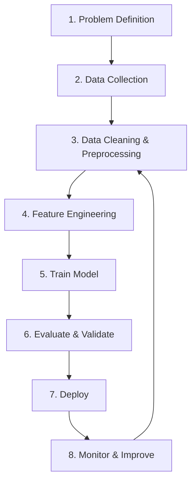

## Why “lifecycle” matters

ML isn’t just training a model.

A model that performs well in a notebook can fail in production because:

- the data distribution changes (drift)
- data quality issues appear
- latency constraints exist
- labels arrive late or are noisy

## The lifecycle stages



### 1) Problem definition

Decide:

- what is the target?
- what does success mean (metric + threshold)?
- what constraints exist (latency, cost, explainability)?

### 2) Data collection

Good data beats fancy models.

Typical sources:

- databases (SQL)
- CSV exports
- logs
- APIs

### 3) Cleaning & preprocessing

Examples:

- missing values
- outliers
- inconsistent categories
- duplicates

### 4) Feature engineering

Transform raw data into useful signals.

Example: from timestamps create:

- day-of-week
- hour-of-day

### 5) Training

Fit parameters of your chosen algorithm on training data.

### 6) Evaluation & validation

Use:

- validation sets and cross-validation
- metrics aligned with the business goal

Watch out for:

- data leakage
- overfitting

### 7) Deployment

Common forms:

- batch predictions (daily scoring job)
- real-time API
- embedded model (mobile/edge)

### 8) Monitoring

Monitor:

- input drift (feature distribution changes)
- prediction drift
- performance decay

## Key takeaway

ML work is iterative.

You’ll move back and forth between data, features, and training until the model is good enough—and then keep iterating after deployment.

## Main challenges: bad data

Since your only real levers are the algorithm and the data, most failures trace
back to one of these:

- **Insufficient training data** — even simple problems often need thousands
  of examples; complex ones (vision, speech) may need millions. Famously, a
  2001 Microsoft paper found that very different algorithms performed almost
  identically well once given enough data — sometimes *data* matters more
  than the algorithm.
- **Nonrepresentative training data** — if your sample is missing whole
  segments of the population, the model will not generalize to them. This is
  called **sampling bias** (the classic example: the 1936 *Literary Digest*
  poll predicted the wrong US president because it polled wealthier,
  telephone-owning households).
- **Poor-quality data** — errors, outliers, and noise make patterns harder to
  detect. Most data scientists spend a large share of their time just
  cleaning data.
- **Irrelevant features** — garbage in, garbage out. This is why **feature
  engineering** (selection, extraction, and creating new features) is so
  central to a project's success.

## Main challenges: bad algorithms (overfitting & underfitting)

- **Overfitting** — the model performs great on training data but fails to
  generalize, because it latched onto noise instead of the real pattern
  (like a high-degree polynomial that snakes through every training point).
  Fixes: simplify the model, gather more data, or reduce noise/outliers.
- **Underfitting** — the model is too simple to capture the underlying
  structure (like a straight line through a curved relationship), so it
  performs poorly even on the training data. Fixes: use a more powerful
  model, engineer better features, or relax any constraints on the model.

```p5 title="Overfitting vs underfitting" desc="Watch the gray points jitter with noise every few seconds. The blue underfit line barely reacts, the gold good-fit curve stays put (it ignores noise), and the pink overfit curve writhes as it chases every wiggle. Click to reshuffle the noise pattern." height="300"
let pts = [];
const PERIOD = 300;
function genPts() {
  pts = [];
  for (let i = 0; i < 18; i++) {
    const x = map(i, 0, 17, -2.6, 2.6);
    const trueY = 0.35 * x * x - 0.6;
    const amp = random(0.15, 0.4);
    const phase = random(TWO_PI);
    pts.push({ x: x, trueY: trueY, amp: amp, phase: phase, y: trueY });
  }
}
function setup() {
  createCanvas(600, 300);
  textFont("monospace");
  textAlign(LEFT, CENTER);
  genPts();
}
function px(x) { return 50 + (x + 3) / 6 * (width - 90); }
function py(y) { return (height - 55) - (y + 1.5) / 5.5 * (height - 90); }
function draw() {
  background(13, 17, 23);

  // drive each point's noise from a smooth, looping sine phase (no jump on restart)
  const t = (frameCount % PERIOD) / PERIOD;
  for (const p of pts) {
    p.y = p.trueY + p.amp * sin(TWO_PI * t + p.phase);
  }

  noStroke();
  for (const p of pts) {
    fill(180, 190, 200);
    ellipse(px(p.x), py(p.y), 7, 7);
  }

  // underfit: flat mean line (blue) - recomputed each frame, only bobs gently
  const meanY = pts.reduce((s, p) => s + p.y, 0) / pts.length;
  stroke(75, 139, 190);
  strokeWeight(2.5);
  line(px(-3), py(meanY), px(3), py(meanY));

  // good fit: the true quadratic (gold) - stays fixed, unmoved by noise
  stroke(255, 211, 67);
  strokeWeight(2.5);
  noFill();
  beginShape();
  for (let x = -3; x <= 3; x += 0.1) vertex(px(x), py(0.35 * x * x - 0.6));
  endShape();

  // overfit: wiggly curve chasing every noisy point (pink) - visibly writhes
  stroke(230, 90, 130);
  strokeWeight(2);
  noFill();
  beginShape();
  for (const p of pts) curveVertex(px(p.x), py(p.y));
  endShape();

  noStroke();
  fill(75, 139, 190); text("underfit (barely reacts to noise)", 16, 20);
  fill(255, 211, 67); text("good fit (stable, ignores noise)", 16, 38);
  fill(230, 90, 130); text("overfit (chases every wiggle)", 16, 56);
}
function mousePressed() { genPts(); }
```

## Testing and validation

The only real way to know if a model generalizes is to try it on data it has
never seen:

- **Training set** — used to fit the model's parameters.
- **Test set** — held out, used once at the end to estimate the
  **generalization error** (also called out-of-sample error). A common split
  is 80/20, adjusted for dataset size.
- **Validation set** — held out from training to compare *candidate* models
  and tune hyperparameters, so you don't repeatedly "peek" at the test set
  (which would make your model overfit the test set itself). Averaging over
  several validation splits is called **cross-validation**.

:::tip[From the book]
If your training error is low but your test error is high, that's the
textbook signature of **overfitting** — the model memorized the training set
instead of learning a pattern that generalizes.
:::

## Data mismatch: the train-dev set

Sometimes you can gather plenty of training data, but it doesn't perfectly
match what your model will see in production. Say you're building a mobile
app that identifies flower species from a photo. You can scrape millions of
flower pictures off the web, but only 10,000 photos actually look like what
the app's camera produces (different lighting, angle, blur). If you train on
the web photos and then get a disappointing score on your validation set, you
can't tell whether that's **overfitting** or just a **mismatch** between the
web pictures and real app pictures.

Andrew Ng's fix: carve out a slice of the *training* data — never used during
training — called the **train-dev set**.

- Train the model on the rest of the training set only.
- Then evaluate it on the train-dev set:
  - **performs well** → the model isn't overfitting; a low score on the real
    validation set must be caused by the data mismatch instead.
  - **performs poorly** → the model overfit the training set — simplify it,
    regularize it, or gather more/cleaner training data.

Only the validation set and test set should be built exclusively from data
that is representative of production (here, real photos taken with the app) —
that's the whole reason they exist: to tell you how the model will really
perform once it ships.

:::tip[From the book]
Géron credits this train-dev set idea to Andrew Ng: it isolates "did the model
memorize the training set?" from "does the training data even look like
production data?" — two very different bugs that call for very different fixes.
:::

## No Free Lunch theorem

Every model makes assumptions about the data (a linear model assumes the data
is roughly linear, for instance). David Wolpert's 1996 **No Free Lunch (NFL)
theorem** shows that if you make *no* assumptions at all, there's no reason to
prefer one model over another — no single model is guaranteed to be best for
every dataset. In practice, you make reasonable assumptions about your
problem and evaluate a handful of reasonable models rather than every model
that exists.

## Visualize it

ML is a cycle, not a one-shot task — the loop keeps running long after the first deployment.

```mermaid title="ML lifecycle loop" desc="Collect data leads to Clean and prepare, then Train model, then Evaluate, then Deploy, then Monitor, which feeds back into Collect data for retraining."
flowchart LR
  A[Collect data] --> B[Clean & prepare]
  B --> C[Train model]
  C --> D[Evaluate]
  D --> E[Deploy]
  E --> F[Monitor]
  F -->|retrain loop| A
```

import DataCampExercise from "../../../../components/DataCampExercise.astro";

## 🧪 Try It Yourself

### Exercise 1 – Train-Test Split

<DataCampExercise
  lang="python"
  hint={`Use \`train_test_split(X, y, test_size=0.2)\` from scikit-learn.`}
  code={`# Task: Exercise 1 – Train-Test Split
from sklearn.model_selection import ___   # replace ___ with train_test_split
import numpy as np

X = np.arange(20).reshape(10, 2)
y = np.arange(10)

X_train, X_test, y_train, y_test = ___(X, y, test_size=0.2, random_state=42)
print("Train size:", len(X_train))
print("Test size:", len(X_test))

# ── Expected Output ───────────────────────────────────────────
# Train size: 8
# Test size: 2
# ──────────────────────────────────────────────────────────────`}
  solution={`from sklearn.model_selection import train_test_split
import numpy as np

X = np.arange(20).reshape(10, 2)
y = np.arange(10)
X_train, X_test, y_train, y_test = train_test_split(X, y, test_size=0.2, random_state=42)
print("Train size:", len(X_train))
print("Test size:", len(X_test))`}
  sct={`test_output_contains("Train size: 8")
test_output_contains("Test size: 2")
success_msg("Data split correctly!")`}
  height={148}
/>

### Exercise 2 – Cross-Validation Instead of One Split

<DataCampExercise
  lang="python"
  hint={`Use \`cross_val_score(model, X, y, cv=5)\` to average performance over 5 validation splits.`}
  code={`# Task: Exercise 2 – Cross-Validate a Model
from sklearn.model_selection import ___   # replace ___ with cross_val_score
from sklearn.linear_model import LinearRegression
import numpy as np

X = np.array([[1],[2],[3],[4],[5],[6],[7],[8],[9],[10]])
y = np.array([2,4,6,8,10,12,14,16,18,20])

model = LinearRegression()
scores = ___(model, X, y, cv=5)   # replace ___ with cross_val_score
print("CV scores:", np.round(scores, 2))

# ── Expected Output ───────────────────────────────────────────
# CV scores: [1. 1. 1. 1. 1.]
# ──────────────────────────────────────────────────────────────`}
  solution={`from sklearn.model_selection import cross_val_score
from sklearn.linear_model import LinearRegression
import numpy as np

X = np.array([[1],[2],[3],[4],[5],[6],[7],[8],[9],[10]])
y = np.array([2,4,6,8,10,12,14,16,18,20])
model = LinearRegression()
scores = cross_val_score(model, X, y, cv=5)
print("CV scores:", np.round(scores, 2))`}
  sct={`test_output_contains("CV scores:")
success_msg("Averaging over several validation splits gives a sturdier estimate!")`}
  height={158}
/>

### Exercise 3 – Spot Overfitting with Train vs Test Score

<DataCampExercise
  lang="python"
  hint={`Call \`.score(X_train, y_train)\` and \`.score(X_test, y_test)\` and compare the two.`}
  code={`# Task: Exercise 3 – Compare Train Score vs Test Score
from sklearn.tree import DecisionTreeRegressor
from sklearn.model_selection import train_test_split
import numpy as np

rng = np.random.RandomState(42)
X = np.sort(rng.rand(40, 1) * 6 - 3, axis=0)
y = np.sin(X).ravel() + rng.normal(0, 0.3, X.shape[0])

X_train, X_test, y_train, y_test = train_test_split(X, y, test_size=0.3, random_state=42)

model = DecisionTreeRegressor(max_depth=None, random_state=42)
model.fit(X_train, y_train)
train_score = model.___(X_train, y_train)   # replace ___ with score
test_score = model.score(X_test, y_test)
print("train R2:", round(train_score, 2))
print("test R2:", round(test_score, 2))

# ── Expected Output ───────────────────────────────────────────
# train R2: 1.0
# test R2: 0.83
# ──────────────────────────────────────────────────────────────`}
  solution={`from sklearn.tree import DecisionTreeRegressor
from sklearn.model_selection import train_test_split
import numpy as np

rng = np.random.RandomState(42)
X = np.sort(rng.rand(40, 1) * 6 - 3, axis=0)
y = np.sin(X).ravel() + rng.normal(0, 0.3, X.shape[0])

X_train, X_test, y_train, y_test = train_test_split(X, y, test_size=0.3, random_state=42)

model = DecisionTreeRegressor(max_depth=None, random_state=42)
model.fit(X_train, y_train)
train_score = model.score(X_train, y_train)
test_score = model.score(X_test, y_test)
print("train R2:", round(train_score, 2))
print("test R2:", round(test_score, 2))`}
  sct={`test_output_contains("train R2:")
test_output_contains("test R2:")
success_msg("A perfect train score with a much lower test score is the signature of overfitting!")`}
  height={168}
/>

