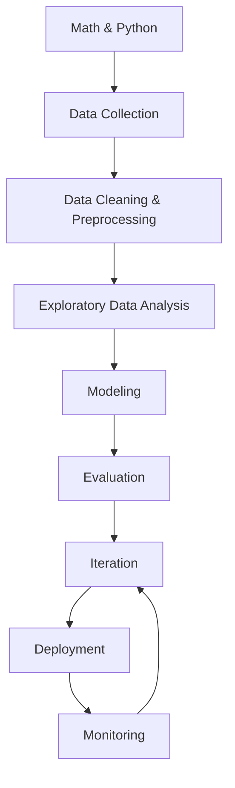

## The big picture

Here’s a realistic “career-grade” roadmap. You’ll cycle through it many times.



## Phase-by-phase (what you’ll build)

1. **Foundations** (vocabulary + intuition)
2. **Preprocessing** (where most real time goes)
3. **Regression** (predict numbers)
4. **Classification** (predict categories)
5. **Ensembles** (combine models)
6. **Unsupervised** (cluster/structure without labels)
7. **Tuning** (pipelines + CV + hyperparams)
8. **Deep learning** (neural nets)
9. **NLP** (text)
10. **Deployment/MLOps** (ship + monitor)

## Two skill tracks to learn in parallel

### Track A — Modeling skills

- pick baseline models
- avoid leakage
- choose metrics
- interpret results

### Track B — Engineering skills

- write clean reproducible notebooks/scripts
- build pipelines
- version data and models
- deploy and monitor

## Reality check: where time actually goes

Beginner expectation: “I’ll spend 80% training models.”

Real projects usually:

- **70% data cleaning and feature engineering**
- **20% evaluation, iteration, and debugging**
- **10% modeling**

## Mini-checkpoint

Write down:

- one ML problem you want to solve (ex: “predict house price”)
- your potential target label (ex: price)
- 5 candidate features (ex: bedrooms, area, age, location, condition)

## What "modeling" actually looks like

The book's classic first example: does money make people happier? You join a
GDP-per-capita table with a life-satisfaction table, plot the two columns, and
notice a rough linear trend. That's **model selection** — you pick a family of
functions (here, a straight line) before you ever touch training data.

```python title="A tiny model-based learning example" showLineNumbers{1}
import numpy as np
from sklearn.linear_model import LinearRegression

# GDP per capita (simplified) vs life satisfaction (0-10 scale)
gdp_per_capita = np.array([[12240], [27195], [37675], [50962], [55805]])
life_satisfaction = np.array([4.9, 5.8, 6.5, 7.3, 7.2])

model = LinearRegression()
model.fit(gdp_per_capita, life_satisfaction)

cyprus_gdp = [[22587]]
print("Predicted satisfaction:", model.predict(cyprus_gdp)[0].round(2))
```

Swap `LinearRegression` for `KNeighborsRegressor(n_neighbors=3)` and you get
**instance-based learning** instead: the prediction comes from averaging the
labels of the *k* most similar training examples rather than fitting a line.
Same data, same `.fit()`/`.predict()` interface, completely different strategy.

:::tip[From the book]
Géron summarizes a typical ML project in four steps: *study the data*,
*select a model*, *train it* (search for parameters that minimize a cost
function), and *apply the model to make predictions* (called **inference**).
Everything in this roadmap is really just a detailed expansion of those four
steps.
:::

import DataCampExercise from "../../../../components/DataCampExercise.astro";

## 🧪 Try It Yourself

### Exercise 1 – Model-Based: Fit a Linear Model

<DataCampExercise
  lang="python"
  hint={`Call \`.fit(X, y)\` then \`.predict(X_new)\` on the LinearRegression instance.`}
  code={`# Task: Exercise 1 – Model-Based Learning
import numpy as np
from sklearn.linear_model import LinearRegression

X = np.array([[12240], [27195], [37675], [50962], [55805]])
y = np.array([4.9, 5.8, 6.5, 7.3, 7.2])

model = LinearRegression()
model.___(X, y)                 # replace ___ with fit
pred = model.___([[22587]])     # replace ___ with predict
print("Predicted:", round(float(pred[0]), 2))

# ── Expected Output ───────────────────────────────────────────
# Predicted: 5.54
# ──────────────────────────────────────────────────────────────`}
  solution={`import numpy as np
from sklearn.linear_model import LinearRegression

X = np.array([[12240], [27195], [37675], [50962], [55805]])
y = np.array([4.9, 5.8, 6.5, 7.3, 7.2])

model = LinearRegression()
model.fit(X, y)
pred = model.predict([[22587]])
print("Predicted:", round(float(pred[0]), 2))`}
  sct={`test_output_contains("Predicted:")
success_msg("You just did model selection + training + inference!")`}
  height={158}
/>

### Exercise 2 – Instance-Based: Swap in KNN

<DataCampExercise
  lang="python"
  hint={`Import \`KNeighborsRegressor\` from \`sklearn.neighbors\` and use \`n_neighbors=3\`.`}
  code={`# Task: Exercise 2 – Instance-Based Learning
import numpy as np
from sklearn.neighbors import ___   # replace ___ with KNeighborsRegressor

X = np.array([[12240], [27195], [37675], [50962], [55805]])
y = np.array([4.9, 5.8, 6.5, 7.3, 7.2])

model = ___(n_neighbors=3)          # replace ___ with KNeighborsRegressor
model.fit(X, y)
pred = model.predict([[22587]])
print("Predicted:", round(float(pred[0]), 2))

# ── Expected Output ───────────────────────────────────────────
# Predicted: 5.73
# ──────────────────────────────────────────────────────────────`}
  solution={`import numpy as np
from sklearn.neighbors import KNeighborsRegressor

X = np.array([[12240], [27195], [37675], [50962], [55805]])
y = np.array([4.9, 5.8, 6.5, 7.3, 7.2])

model = KNeighborsRegressor(n_neighbors=3)
model.fit(X, y)
pred = model.predict([[22587]])
print("Predicted:", round(float(pred[0]), 2))`}
  sct={`test_output_contains("Predicted:")
success_msg("Same interface, totally different generalization strategy!")`}
  height={158}
/>

### Exercise 3 – Reality Check on Time Spent

<DataCampExercise
  lang="python"
  hint={`Build a dict and sum the values, or just fill in the missing percentage so it totals 100.`}
  code={`# Task: Exercise 3 – Where ML Time Actually Goes
time_spent = {
    "data cleaning & feature engineering": 70,
    "evaluation & iteration": 20,
    "modeling": ___,   # replace ___ with 10
}
print("Total:", sum(time_spent.values()))

# ── Expected Output ───────────────────────────────────────────
# Total: 100
# ──────────────────────────────────────────────────────────────`}
  solution={`time_spent = {
    "data cleaning & feature engineering": 70,
    "evaluation & iteration": 20,
    "modeling": 10,
}
print("Total:", sum(time_spent.values()))`}
  sct={`test_output_contains("Total: 100")
success_msg("Modeling is usually the smallest slice of real ML work!")`}
  height={148}
/>
