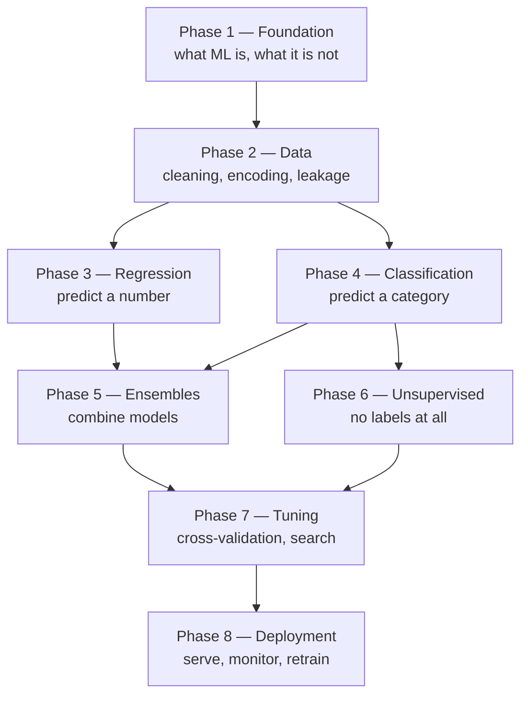

## What you'll learn

- the whole workflow as one runnable 38-line script, not a diagram of boxes
- where the lines actually go — **19 of 38 run before a model is chosen**
- the two skill tracks you have to build in parallel, and why
- a measured case where the **most accurate model is also 634× smaller**
- exactly which phase of this module teaches each piece

## The whole thing, once

Before the roadmap, here is the destination. This is a complete, runnable supervised-learning
pipeline — load, split, clean, encode, fit, tune, evaluate, ship. Every later phase of this module
is a deep dive into one of these blocks.

```python title="reference_pipeline.py" showLineNumbers{1}
import joblib
import pandas as pd
from sklearn.compose import ColumnTransformer
from sklearn.ensemble import HistGradientBoostingRegressor
from sklearn.impute import SimpleImputer
from sklearn.metrics import mean_absolute_error
from sklearn.model_selection import GridSearchCV, train_test_split
from sklearn.pipeline import Pipeline
from sklearn.preprocessing import OneHotEncoder, StandardScaler


def run(csv_path, target, out_path="model.joblib"):
    # --- look at the data ---------------------------------------------
    df = pd.read_csv(csv_path)
    print(df.shape)
    print(df.dtypes)
    print(df.isna().mean().sort_values(ascending=False).head())
    print(df[target].describe())

    # --- split, before touching anything ------------------------------
    y = df.pop(target)
    X_train, X_test, y_train, y_test = train_test_split(
        X := df, y, test_size=0.2, random_state=42)

    # --- decide how each column is cleaned ----------------------------
    num_cols = X.select_dtypes("number").columns.tolist()
    cat_cols = X.select_dtypes("object").columns.tolist()
    num_impute = SimpleImputer(strategy="median")
    cat_impute = SimpleImputer(strategy="most_frequent")

    # --- encode and scale, inside a pipeline --------------------------
    numeric = Pipeline([("impute", num_impute),
                        ("scale", StandardScaler())])
    categorical = Pipeline([
        ("impute", cat_impute),
        ("onehot", OneHotEncoder(handle_unknown="ignore"))])
    prep = ColumnTransformer([("num", numeric, num_cols),
                              ("cat", categorical, cat_cols)])

    # --- choose the model ---------------------------------------------
    model = HistGradientBoostingRegressor(random_state=42)
    pipe = Pipeline([("prep", prep), ("model", model)])

    # --- cross-validate and tune --------------------------------------
    grid = {"model__max_depth": [None, 4, 8],
            "model__learning_rate": [0.05, 0.1, 0.2]}
    search = GridSearchCV(pipe, grid, cv=5,
                          scoring="neg_mean_absolute_error",
                          n_jobs=-1)
    search.fit(X_train, y_train)
    print(search.best_params_, -search.best_score_)

    # --- evaluate against a baseline ----------------------------------
    best = search.best_estimator_
    preds = best.predict(X_test)
    mae = mean_absolute_error(y_test, preds)
    baseline = mean_absolute_error(y_test,
                                   [y_train.median()] * len(y_test))
    print(f"test MAE {mae:.3f} vs baseline {baseline:.3f}")

    # --- persist and reload -------------------------------------------
    joblib.dump(best, out_path)
    reloaded = joblib.load(out_path)
    assert reloaded.predict(X_test[:5]).shape == (5,)
    return best, mae
```

If most of that is unfamiliar, good — that is the syllabus. Come back and reread it after Phase 7
and it will look obvious.

## Where the work actually is

You will hear that data work is 80% of machine learning. That number is folklore; nobody can cite
its source. So instead of repeating it, here is a count of the script above — 38 code lines,
excluding imports, blanks and comments, tallied by what each line does.

| Stage | Lines | Share |
| --- | --- | --- |
| Load + inspect the data | 5 | 13.2% |
| Split before touching anything | 3 | 7.9% |
| Impute missing values | 4 | 10.5% |
| Encode + scale into a pipeline | 7 | 18.4% |
| **Choose the model** | **2** | **5.3%** |
| Cross-validate + tune | 7 | 18.4% |
| Evaluate against a baseline | 6 | 15.8% |
| Persist + reload | 4 | 10.5% |

<Figure
  src="/images/ml/phase-01-foundation/the-machine-learning-roadmap/where-the-code-goes"
  alt="A horizontal bar chart of eight pipeline stages by line count, with the four blue data stages summing to nineteen lines and the choose-the-model stage the shortest at two."
  title="Half the pipeline runs before a model is chosen"
  caption="Real counts from the script above, not a survey. 19 of 38 lines — exactly 50% — are data work that happens before any model exists. Actually choosing the algorithm is 2 lines, 5.3%, the smallest stage in the file."
/>

Not 80%. **Exactly 50%**, on this pipeline. And the part everyone thinks of as "machine learning" —
picking the algorithm — is two lines.

Two caveats, because line counts are a crude proxy. They ignore *time*: the four data lines took
far longer to get right than the two model lines. And they ignore the work upstream of the file
entirely — collecting the data, agreeing on the label definition, and negotiating what the metric
should be. Counting only the script understates data work, which makes 50% a floor, not a ceiling.

## The learning path



| Phase | What you build | The one idea to take away |
| --- | --- | --- |
| [1 — Foundation](/machine-learning/phase-01---the-ml-foundation/phase-1---the-ml-foundation/) | Vocabulary and judgement | The features set the ceiling |
| [2 — Data](/machine-learning/phase-02---data-preprocessing--feature-engineering/phase-2---data-preprocessing--feature-engineering/) | Cleaning, encoding, pipelines | Split before you look; leakage is silent |
| [3 — Regression](/machine-learning/phase-03---supervised-learning---regression/phase-3---supervised-learning---regression/) | Predicting numbers | Fitting is minimising a loss |
| [4 — Classification](/machine-learning/phase-04---supervised-learning---classification/phase-4---supervised-learning---classification/) | Predicting categories | Accuracy is the wrong metric more often than not |
| [5 — Ensembles](/machine-learning/phase-05---ensemble-learning/phase-5---ensemble-learning/) | Combining models | Averaging works only if members disagree |
| [6 — Unsupervised](/machine-learning/phase-06---unsupervised-learning--dimensionality-reduction/phase-6---unsupervised-learning/) | Structure without labels | The distance metric decides the answer |
| [7 — Tuning](/machine-learning/phase-07---model-optimization--tuning/phase-7---model-optimization--tuning/) | Cross-validation and search | One held-out set is not enough |
| [8 — Deployment](/machine-learning/phase-08---model-deployment-mlops/phase-8---model-deployment-mlops/) | Serving and monitoring | A model that stops being retrained starts decaying |

## Two tracks, in parallel

There is a modelling skill set and an engineering skill set, and shipping requires both. It is
tempting to treat the second as somebody else's job; it is not.

Here is the reason, measured. Three models on the breast-cancer dataset, scored two ways: 5-fold
accuracy, and the size of the pickled artefact you would have to deploy.

| Model | 5-fold accuracy | Pickled size |
| --- | --- | --- |
| **Logistic regression** | **0.9807** | **2.0 KB** |
| 15-nearest-neighbours | 0.9614 | 98.1 KB |
| Random forest, 500 trees | 0.9631 | 1,268.3 KB |

<Figure
  src="/images/ml/phase-01-foundation/the-machine-learning-roadmap/two-tracks"
  alt="Two bar charts side by side. The left shows nearly identical accuracies near 0.96 to 0.98; the right shows pickled model sizes on a log scale from 2 KB to 1268 KB."
  title="Nearly identical accuracy; wildly different things to ship"
  caption="Logistic regression is both the most accurate model here (0.9807) and 634 times smaller than the random forest (2.0 KB against 1,268.3 KB). The 15-NN model has to carry the entire training set with it, which is why it lands in between."
/>

The most accurate model is also **634× smaller** than the largest. That is not a general law — often
you do trade accuracy for size — but it is a common enough situation that ignoring Track B costs you
nothing in accuracy and a great deal in operations.

| Track A — modelling | Track B — engineering |
| --- | --- |
| Which algorithm suits this data | How the model is packaged and versioned |
| What the metric should be | Latency and memory at serving time |
| Cross-validation design | Reproducibility: seeds, data versions, environments |
| Feature engineering | Monitoring inputs and outputs in production |
| Diagnosing bias and variance | Retraining triggers and rollback |
| Interpreting errors | Cost — training and inference |

## Instance-based or model-based

One distinction is worth meeting now, because it explains the table above and recurs throughout the
module.

A **model-based** learner compresses the training data into parameters and then discards it.
Logistic regression stores a handful of coefficients: 2.0 KB.

An **instance-based** learner keeps the examples and compares new inputs against them at prediction
time. 15-NN has to ship the entire training set: 98.1 KB, and prediction cost grows with the data.

```python title="two_kinds.py" showLineNumbers{1}
import pickle

from sklearn.datasets import load_breast_cancer
from sklearn.linear_model import LogisticRegression
from sklearn.model_selection import cross_val_score, train_test_split
from sklearn.neighbors import KNeighborsClassifier
from sklearn.pipeline import make_pipeline
from sklearn.preprocessing import StandardScaler

X, y = load_breast_cancer(return_X_y=True)
X_tr, X_te, y_tr, y_te = train_test_split(X, y, test_size=0.3,
                                          random_state=0, stratify=y)

for name, m in [
    ("model-based    (logistic)",
     make_pipeline(StandardScaler(), LogisticRegression(max_iter=5000))),
    ("instance-based (15-NN)   ",
     make_pipeline(StandardScaler(), KNeighborsClassifier(15))),
]:
    acc = cross_val_score(m, X, y, cv=5).mean()
    m.fit(X_tr, y_tr)
    kb = len(pickle.dumps(m)) / 1024
    print(f"{name}  accuracy {acc:.4f}   pickled {kb:6.1f} KB")

# model-based    (logistic)  accuracy 0.9807   pickled    2.0 KB
# instance-based (15-NN)     accuracy 0.9614   pickled   98.1 KB
```

## Where time actually goes

An honest ordering of effort on a typical project, from most to least:

1. **Understanding the problem.** What is the label, exactly? What decision does the prediction
   feed? What is the cost of a false positive against a false negative? Getting this wrong makes
   every later step worthless.
2. **Getting and understanding the data.** Where it lives, what the columns mean, which are
   unreliable, which leak the answer.
3. **Cleaning and feature engineering.** Half the reference script, and much more than half the
   wall-clock time.
4. **Evaluation design.** Which split, which metric, which baseline. Cheap to write, expensive to
   get wrong.
5. **Model selection and tuning.** Two lines to choose, seven to search. Genuinely important, and
   nowhere near the largest slice.
6. **Deployment and monitoring.** Small in code, large in consequence.

Notice that "try a fancier algorithm" is item 5. Beginners start there because it is the fun part.
The measurement on the
[lifecycle page](/machine-learning/phase-01---the-ml-foundation/the-ml-lifecycle-from-data-to-deployment/)
shows why that ordering is wrong: swapping the algorithm moved accuracy 0.1142, and flipping 15% of
the labels cost exactly the same 0.1142.

## See it move

The roadmap above reads as a straight line because lists are straight. Real projects walk it as a
loop, and the loop does not visit each stage equally often. The sketch walks a token through the
stages with the backward jumps a real project takes — "the metric is wrong" sends you back to
framing, "the model is starved" sends you back to data — and tallies the visits as it goes.

```p5 title="The loop you actually walk" desc="A token moves through the seven roadmap stages, sometimes jumping backwards the way real projects do. The bars count how many times each stage has been visited: data work accumulates visits fastest, and model selection is nowhere near the top. Click to restart the count." height="360"
const STAGES = ["frame", "get data", "clean", "evaluate", "model", "tune", "deploy"];
// Row i column j: chance of jumping from stage i to stage j once stage i is done.
// Backward edges are the honest part -- a bad metric sends you back to framing.
const JUMPS = [
  [0, 1.0, 0, 0, 0, 0, 0],
  [0, 0, 1.0, 0, 0, 0, 0],
  [0, 0.3, 0, 0.7, 0, 0, 0],
  [0.2, 0, 0.15, 0, 0.65, 0, 0],
  [0, 0, 0.4, 0.1, 0, 0.5, 0],
  [0, 0, 0.25, 0.15, 0.15, 0, 0.45],
  [0, 0.35, 0.35, 0.1, 0, 0, 0.2],
];
let at = 0;
let visits = [];
let steps = 0;
let progress = 0;
let target = 1;

function reset() {
  at = 0;
  visits = STAGES.map(() => 0);
  visits[0] = 1;
  steps = 0;
  progress = 0;
  target = 1;
}
function pick(row) {
  let r = random();
  for (let j = 0; j < row.length; j++) {
    if (r < row[j]) return j;
    r -= row[j];
  }
  return row.length - 1;
}
function setup() {
  createCanvas(620, 360);
  textFont("monospace");
  reset();
}
function draw() {
  background(13, 17, 23);
  const cx = 60;
  const gap = (width - 120) / (STAGES.length - 1);
  const laneY = 84;

  // the track
  stroke(60, 68, 78);
  strokeWeight(2);
  line(cx, laneY, cx + gap * (STAGES.length - 1), laneY);

  // stage nodes and labels
  for (let i = 0; i < STAGES.length; i++) {
    const x = cx + i * gap;
    noStroke();
    fill(i === at ? color(120, 200, 120) : color(52, 60, 70));
    ellipse(x, laneY, 16, 16);
    fill(i === at ? 235 : 150);
    textSize(10);
    textAlign(CENTER, TOP);
    text(STAGES[i], x, laneY + 14);
  }

  // the travelling token, drawn on an arc so backward jumps are visible
  const from = cx + at * gap;
  const to = cx + target * gap;
  const t = progress;
  const tx = lerp(from, to, t);
  const lift = target < at ? -34 : -14;
  const ty = laneY + sin(t * PI) * lift;
  stroke(target < at ? color(232, 122, 122) : color(120, 200, 120));
  strokeWeight(1.5);
  noFill();
  beginShape();
  for (let s = 0; s <= 24; s++) {
    const u = (s / 24) * t;
    vertex(lerp(from, to, u), laneY + sin(u * PI) * lift);
  }
  endShape();
  noStroke();
  fill(255, 211, 67);
  ellipse(tx, ty, 11, 11);

  // visit tally
  const total = visits.reduce((a, b) => a + b, 0);
  const barTop = 150;
  const barH = 18;
  const maxBar = width - 220;
  const peak = Math.max(...visits, 1);
  for (let i = 0; i < STAGES.length; i++) {
    const y = barTop + i * (barH + 8);
    fill(150);
    textSize(11);
    textAlign(RIGHT, CENTER);
    text(STAGES[i], 96, y + barH / 2);
    const w = (visits[i] / peak) * maxBar;
    fill(i <= 2 ? color(75, 139, 190) : color(150, 120, 200));
    rect(104, y, w, barH);
    fill(225);
    textAlign(LEFT, CENTER);
    text(visits[i] + "  " + ((100 * visits[i]) / total).toFixed(0) + "%", 110 + w, y + barH / 2);
  }
  fill(200);
  textSize(12);
  textAlign(LEFT, TOP);
  text("steps walked: " + steps, 14, 18);
  textAlign(RIGHT, TOP);
  fill(120, 160, 200);
  text("blue = data work", width - 14, 18);
  fill(150, 120, 200);
  text("purple = modelling", width - 14, 36);

  progress += 0.035;
  if (progress >= 1) {
    at = target;
    visits[at]++;
    steps++;
    target = pick(JUMPS[at]);
    progress = 0;
    if (steps > 400) reset();
  }
}
function mousePressed() { reset(); }
```

Let it run for a few hundred steps. That transition table is a Markov chain, so its long-run visit
shares can be computed exactly rather than guessed — power-iterate it and you get:

| Stage | Long-run share of visits |
| --- | --- |
| frame | 4.6% |
| get data | 14.8% |
| clean | 28.4% |
| evaluate | 23.2% |
| model | 16.3% |
| tune | 8.1% |
| deploy | 4.6% |

Framing plus data work is 47.8%; modelling plus tuning is 24.4%. That is not a rigged result — the
only editorial choices in the table are the backward edges, and backward edges land on data and
evaluation because that is where the causes of a bad model live. Note how close 47.8% lands to the
independently measured **50% of the reference script's lines that run before a model is chosen**. Two
different ways of counting, the same answer: half the work happens before the algorithm exists.

## Pitfalls

**Starting at step 5.** Choosing an algorithm before you understand the label is the most common
beginner mistake, and it is expensive because everything downstream inherits the confusion.

**Treating deployment as someone else's problem.** The random forest above is 634× larger than the
logistic model for *lower* accuracy. That decision is made during modelling, not after it.

**Quoting the 80% figure.** It is folklore. The measurement here is 50% of the code, and the honest
statement is "data work dominates, and no, I do not have a citation for a precise number."

**Learning the phases strictly in order.** Phases 3 and 4 are independent of each other; so are 5
and 6. The dependencies that matter are 1 → 2 → everything, and 7 after you have models to tune.

**Skipping the baseline because the model works.** If you never computed it, you do not know whether
the model works.

## Recap

- The whole workflow is one 38-line script; every later phase expands one of its blocks.
- **19 of 38 lines — 50% — run before a model is chosen.** Choosing the algorithm is 2 lines.
- The 80% folklore figure has no source; count your own pipeline instead.
- Two skill tracks run in parallel. On breast cancer the best model (0.9807) was also **634× smaller**
  than the largest (2.0 KB against 1,268.3 KB).
- Model-based learners store parameters; instance-based learners store the data.
- Effort order: understand the problem → get the data → clean it → design the evaluation → choose
  the model → ship it.

<Quiz
  questions={[
    {
      q: "In the 38-line reference pipeline, how many lines are spent choosing the model?",
      options: ["2", "7", "12", "19"],
      answer: 0,
      explain: "Two lines: instantiate the estimator and wrap it in a Pipeline. Cross-validation and tuning take 7 more, and the data stages take 19 — half the file — before any model exists.",
    },
    {
      q: "Logistic regression scored 0.9807 and pickled to 2.0 KB; the 500-tree forest scored 0.9631 and pickled to 1,268.3 KB. What is the lesson?",
      options: [
        "Always use logistic regression",
        "Accuracy and deployment cost are separate axes, and the winner on one is not automatically the loser on the other",
        "Random forests are badly implemented",
        "Model size does not matter",
      ],
      answer: 1,
      explain: "Here the simplest model won on both axes, which is common on small tabular data. The general point is that you have to measure both — a model chosen purely on offline accuracy can be an operational problem.",
    },
    {
      q: "Someone tells you 'data cleaning is 80% of machine learning'. What is the accurate response?",
      options: [
        "Agree; it is a well-established statistic",
        "It is folklore with no traceable source — count your own pipeline; this one measured 50% of the code",
        "It is actually 50% everywhere",
        "It only applies to deep learning",
      ],
      answer: 1,
      explain: "The figure is repeated constantly and cited nowhere. The measurement on this page is 19 of 38 lines, and even that understates it because line counts ignore time and everything upstream of the script.",
    },
    {
      q: "Which pair of phases can be learned in either order?",
      options: [
        "Phase 1 and Phase 2",
        "Phase 3 (regression) and Phase 4 (classification)",
        "Phase 2 and Phase 7",
        "Phase 7 and Phase 8",
      ],
      answer: 1,
      explain: "Regression and classification both depend on Phase 2 but not on each other. Phase 1 → 2 → everything is the real dependency, and Phase 7 needs models in hand before tuning them means anything.",
    },
    {
      q: "Why does a 15-nearest-neighbours model pickle to 98.1 KB while logistic regression pickles to 2.0 KB?",
      options: [
        "KNN uses a less efficient serialisation format",
        "KNN is instance-based: it has to carry the training data to make predictions, while logistic regression stores only coefficients",
        "KNN has more hyperparameters",
        "The scaler is larger in the KNN pipeline",
      ],
      answer: 1,
      explain: "Model-based learners compress the data into parameters and discard it. Instance-based learners defer all the work to prediction time, so the training set is part of the artefact — and prediction cost grows with it too.",
    },
  ]}
/>

## 🧪 Try It Yourself

### Exercise 1 – Count your own pipeline

<DataCampExercise
  lang="python"
  hint={`Strip the comment from each line, skip blanks and imports, then read the @stage marker.`}
  code={`# Task: Exercise 1 - Count your own pipeline
import re
from collections import Counter

# Each line of the reference pipeline, with its stage marker.
LINES = [
    "df = pd.read_csv(path)                # @stage:data",
    "print(df.shape)                       # @stage:data",
    "print(df.dtypes)                      # @stage:data",
    "y = df.pop(target)                    # @stage:data",
    "X_tr, X_te, y_tr, y_te = split(...)   # @stage:data",
    "prep = ColumnTransformer([...])       # @stage:data",
    "model = HistGradientBoosting()        # @stage:model",
    "pipe = Pipeline([...])                # @stage:model",
    "search = GridSearchCV(pipe, grid)     # @stage:model",
    "mae = mean_absolute_error(y_te, p)    # @stage:ship",
    "joblib.dump(best, out_path)           # @stage:ship",
]

counts = Counter(re.search(r"@stage:(\\w+)", ln).group(1) for ln in LINES)
total = sum(counts.___())                     # replace ___ with values

for stage in ("data", "model", "ship"):
    print(f"{stage:6s} {counts[stage]:2d}  {counts[stage] / total:.1%}")

# -- Expected Output -------------------------------------------
# data    6  54.5%
# model   3  27.3%
# ship    2  18.2%
# --------------------------------------------------------------`}
  solution={`import re
from collections import Counter

LINES = [
    "df = pd.read_csv(path)                # @stage:data",
    "print(df.shape)                       # @stage:data",
    "print(df.dtypes)                      # @stage:data",
    "y = df.pop(target)                    # @stage:data",
    "X_tr, X_te, y_tr, y_te = split(...)   # @stage:data",
    "prep = ColumnTransformer([...])       # @stage:data",
    "model = HistGradientBoosting()        # @stage:model",
    "pipe = Pipeline([...])                # @stage:model",
    "search = GridSearchCV(pipe, grid)     # @stage:model",
    "mae = mean_absolute_error(y_te, p)    # @stage:ship",
    "joblib.dump(best, out_path)           # @stage:ship",
]
counts = Counter(re.search(r"@stage:(\\w+)", ln).group(1) for ln in LINES)
total = sum(counts.values())
for stage in ("data", "model", "ship"):
    print(f"{stage:6s} {counts[stage]:2d}  {counts[stage] / total:.1%}")`}
  sct={`test_output_contains("data    6  54.5%")
success_msg("Do this to a pipeline you actually wrote. The number will surprise you less than the ordering will.")`}
  height={300}
/>

### Exercise 2 – Model-based: two numbers

<DataCampExercise
  lang="python"
  hint={`A fitted LinearRegression exposes coef_ and intercept_ — that is the entire model.`}
  code={`# Task: Exercise 2 - Model-based: two numbers
import numpy as np
from sklearn.linear_model import LinearRegression

rng = np.random.default_rng(1)
X = rng.uniform(-2.6, 2.6, (26, 1))
y = 0.75 * X.ravel() + rng.normal(0, 0.45, 26)

model = LinearRegression().___(X, y)          # replace ___ with fit

print("coefficient", round(float(model.coef_[0]), 4))
print("intercept  ", round(float(model.intercept_), 4))
print("numbers stored:", model.coef_.size + 1)
print("rows stored   :", 0)

# -- Expected Output -------------------------------------------
# coefficient 0.7348
# intercept   -0.007
# numbers stored: 2
# rows stored   : 0
# --------------------------------------------------------------`}
  solution={`import numpy as np
from sklearn.linear_model import LinearRegression

rng = np.random.default_rng(1)
X = rng.uniform(-2.6, 2.6, (26, 1))
y = 0.75 * X.ravel() + rng.normal(0, 0.45, 26)
model = LinearRegression().fit(X, y)
print("coefficient", round(float(model.coef_[0]), 4))
print("intercept  ", round(float(model.intercept_), 4))
print("numbers stored:", model.coef_.size + 1)
print("rows stored   :", 0)`}
  sct={`test_output_contains("numbers stored: 2")
success_msg("Twenty-six training rows compressed into two numbers. The data can now be deleted.")`}
  height={250}
/>

### Exercise 3 – Instance-based: all the rows

<DataCampExercise
  lang="python"
  hint={`A fitted KNeighborsRegressor keeps the training data in _fit_X.`}
  code={`# Task: Exercise 3 - Instance-based: all the rows
import numpy as np
from sklearn.neighbors import KNeighborsRegressor

rng = np.random.default_rng(1)
X = rng.uniform(-2.6, 2.6, (26, 1))
y = 0.75 * X.ravel() + rng.normal(0, 0.45, 26)

knn = KNeighborsRegressor(n_neighbors=3).fit(X, y)

print("rows stored:", knn._fit_X.___[0])      # replace ___ with shape
print("parameters learned:", 0)
print("prediction at x=0:", round(float(knn.predict([[0.0]])[0]), 4))

# -- Expected Output -------------------------------------------
# rows stored: 26
# parameters learned: 0
# prediction at x=0: -0.1387
# --------------------------------------------------------------`}
  solution={`import numpy as np
from sklearn.neighbors import KNeighborsRegressor

rng = np.random.default_rng(1)
X = rng.uniform(-2.6, 2.6, (26, 1))
y = 0.75 * X.ravel() + rng.normal(0, 0.45, 26)
knn = KNeighborsRegressor(n_neighbors=3).fit(X, y)
print("rows stored:", knn._fit_X.shape[0])
print("parameters learned:", 0)
print("prediction at x=0:", round(float(knn.predict([[0.0]])[0]), 4))`}
  sct={`test_output_contains("rows stored: 26")
success_msg("Nothing was learned and nothing was compressed. All the work happens at prediction time.")`}
  height={250}
/>

### Exercise 4 – Accuracy against artefact size

<DataCampExercise
  lang="python"
  hint={`pickle.dumps returns bytes; divide its length by 1024 for kilobytes.`}
  code={`# Task: Exercise 4 - Accuracy against artefact size
import pickle

from sklearn.datasets import load_breast_cancer
from sklearn.ensemble import RandomForestClassifier
from sklearn.linear_model import LogisticRegression
from sklearn.model_selection import cross_val_score, train_test_split
from sklearn.neighbors import KNeighborsClassifier
from sklearn.pipeline import make_pipeline
from sklearn.preprocessing import StandardScaler

X, y = load_breast_cancer(return_X_y=True)
X_tr, X_te, y_tr, y_te = train_test_split(X, y, test_size=0.3,
                                          random_state=0, stratify=y)

models = [
    ("logistic ", make_pipeline(StandardScaler(), LogisticRegression(max_iter=5000))),
    ("15-NN    ", make_pipeline(StandardScaler(), KNeighborsClassifier(15))),
    ("forest500", RandomForestClassifier(n_estimators=500, random_state=0)),
]
for name, m in models:
    acc = cross_val_score(m, X, y, cv=5).mean()
    m.fit(X_tr, y_tr)
    kb = len(pickle.___(m)) / 1024            # replace ___ with dumps
    print(f"{name} accuracy {acc:.4f}   {kb:8,.1f} KB")

# -- Expected Output -------------------------------------------
# logistic  accuracy 0.9807        2.0 KB
# 15-NN     accuracy 0.9614       98.1 KB
# forest500 accuracy 0.9631    1,268.3 KB
# --------------------------------------------------------------`}
  solution={`import pickle

from sklearn.datasets import load_breast_cancer
from sklearn.ensemble import RandomForestClassifier
from sklearn.linear_model import LogisticRegression
from sklearn.model_selection import cross_val_score, train_test_split
from sklearn.neighbors import KNeighborsClassifier
from sklearn.pipeline import make_pipeline
from sklearn.preprocessing import StandardScaler

X, y = load_breast_cancer(return_X_y=True)
X_tr, X_te, y_tr, y_te = train_test_split(X, y, test_size=0.3,
                                          random_state=0, stratify=y)
models = [
    ("logistic ", make_pipeline(StandardScaler(), LogisticRegression(max_iter=5000))),
    ("15-NN    ", make_pipeline(StandardScaler(), KNeighborsClassifier(15))),
    ("forest500", RandomForestClassifier(n_estimators=500, random_state=0)),
]
for name, m in models:
    acc = cross_val_score(m, X, y, cv=5).mean()
    m.fit(X_tr, y_tr)
    kb = len(pickle.dumps(m)) / 1024
    print(f"{name} accuracy {acc:.4f}   {kb:8,.1f} KB")`}
  sct={`test_output_contains("logistic  accuracy 0.9807")
success_msg("Best accuracy AND 634x smaller. Track B is not somebody else's job.")`}
  height={300}
/>

### Exercise 5 – Baseline before anything

<DataCampExercise
  lang="python"
  hint={`DummyRegressor with strategy="median" is the do-nothing predictor.`}
  code={`# Task: Exercise 5 - Baseline before anything
from sklearn.datasets import fetch_california_housing
from sklearn.dummy import DummyRegressor
from sklearn.ensemble import HistGradientBoostingRegressor
from sklearn.metrics import mean_absolute_error
from sklearn.model_selection import train_test_split

X, y = fetch_california_housing(return_X_y=True)
X_tr, X_te, y_tr, y_te = train_test_split(X, y, test_size=0.2, random_state=42)

dummy = DummyRegressor(strategy="___").fit(X_tr, y_tr)   # replace ___ with median
model = HistGradientBoostingRegressor(random_state=42).fit(X_tr, y_tr)

base_mae = mean_absolute_error(y_te, dummy.predict(X_te))
model_mae = mean_absolute_error(y_te, model.predict(X_te))

print(f"baseline MAE {base_mae:.4f}")
print(f"model MAE    {model_mae:.4f}")
print(f"improvement  {(1 - model_mae / base_mae):.1%}")

# -- Expected Output -------------------------------------------
# baseline MAE 0.8740
# model MAE    0.3111
# improvement  64.4%
# --------------------------------------------------------------`}
  solution={`from sklearn.datasets import fetch_california_housing
from sklearn.dummy import DummyRegressor
from sklearn.ensemble import HistGradientBoostingRegressor
from sklearn.metrics import mean_absolute_error
from sklearn.model_selection import train_test_split

X, y = fetch_california_housing(return_X_y=True)
X_tr, X_te, y_tr, y_te = train_test_split(X, y, test_size=0.2, random_state=42)
dummy = DummyRegressor(strategy="median").fit(X_tr, y_tr)
model = HistGradientBoostingRegressor(random_state=42).fit(X_tr, y_tr)
base_mae = mean_absolute_error(y_te, dummy.predict(X_te))
model_mae = mean_absolute_error(y_te, model.predict(X_te))
print(f"baseline MAE {base_mae:.4f}")
print(f"model MAE    {model_mae:.4f}")
print(f"improvement  {(1 - model_mae / base_mae):.1%}")`}
  sct={`test_output_contains("improvement")
success_msg("A 64.4% reduction in error over doing nothing. THAT is the number worth reporting.")`}
  height={280}
/>

### Exercise 6 – Compute where the time actually goes

<DataCampExercise
  lang="python"
  hint={`One power-iteration step is share[j] = sum over i of share[i] * jumps[i][j]. Iterate it until the numbers stop moving.`}
  code={`# Task: Exercise 6 - Compute where the time actually goes
# The transition table from the sketch on this page: row i, column j is the
# chance of moving from stage i to stage j once stage i is done.
stages = ["frame", "get data", "clean", "evaluate", "model", "tune", "deploy"]
jumps = [
    [0, 1.00, 0, 0, 0, 0, 0],
    [0, 0, 1.00, 0, 0, 0, 0],
    [0, 0.30, 0, 0.70, 0, 0, 0],
    [0.20, 0, 0.15, 0, 0.65, 0, 0],
    [0, 0, 0.40, 0.10, 0, 0.50, 0],
    [0, 0, 0.25, 0.15, 0.15, 0, 0.45],
    [0, 0.35, 0.35, 0.10, 0, 0, 0.20],
]

share = [1 / 7] * 7
for _ in range(20000):
    share = [sum(share[i] * jumps[i][___] for i in range(7)) for j in range(7)]
    # replace ___ with j

for name, value in zip(stages, share):
    print(f"{name:9s} {100 * value:5.1f}%")
data_work = share[0] + share[1] + share[2]
modelling = share[4] + share[5]
print(f"framing + data work: {100 * data_work:.1f}%")
print(f"modelling + tuning:  {100 * modelling:.1f}%")

# -- Expected Output -------------------------------------------
# frame       4.6%
# get data   14.8%
# clean      28.4%
# evaluate   23.2%
# model      16.3%
# tune        8.1%
# deploy      4.6%
# framing + data work: 47.8%
# modelling + tuning:  24.4%
# --------------------------------------------------------------`}
  solution={`stages = ["frame", "get data", "clean", "evaluate", "model", "tune", "deploy"]
jumps = [
    [0, 1.00, 0, 0, 0, 0, 0],
    [0, 0, 1.00, 0, 0, 0, 0],
    [0, 0.30, 0, 0.70, 0, 0, 0],
    [0.20, 0, 0.15, 0, 0.65, 0, 0],
    [0, 0, 0.40, 0.10, 0, 0.50, 0],
    [0, 0, 0.25, 0.15, 0.15, 0, 0.45],
    [0, 0.35, 0.35, 0.10, 0, 0, 0.20],
]

share = [1 / 7] * 7
for _ in range(20000):
    share = [sum(share[i] * jumps[i][j] for i in range(7)) for j in range(7)]

for name, value in zip(stages, share):
    print(f"{name:9s} {100 * value:5.1f}%")
data_work = share[0] + share[1] + share[2]
modelling = share[4] + share[5]
print(f"framing + data work: {100 * data_work:.1f}%")
print(f"modelling + tuning:  {100 * modelling:.1f}%")`}
  sct={`test_output_contains("47.8%")
success_msg("47.8% against 24.4%, from a table whose only editorial choices were the backward edges — and 47.8 is within noise of the 50% of pipeline lines measured at the top of this page.")`}
  height={340}
/>

## Next

[Artificial Intelligence vs Machine Learning vs Deep Learning](/machine-learning/phase-01---the-ml-foundation/artificial-intelligence-vs-machine-learning-vs-deep-learning/)
— what actually nests inside what, and a measurement showing the neural network losing to gradient
boosting on structured columns.
