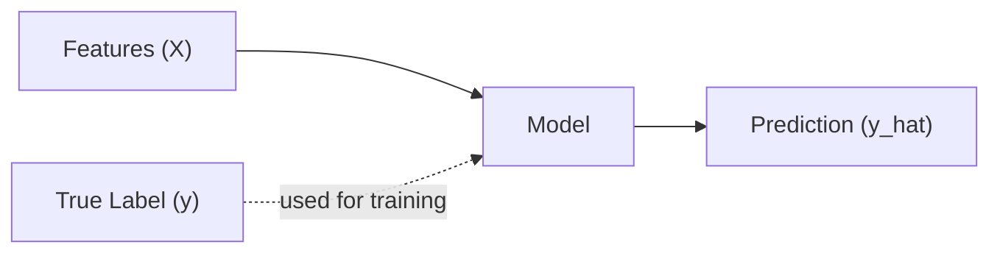
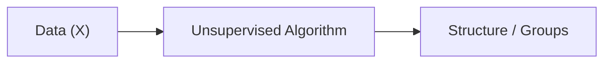
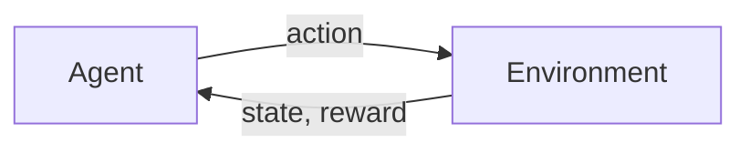
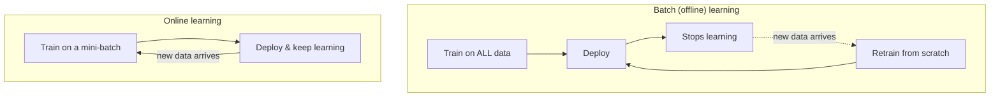

## 1) Supervised learning

You have **inputs X** and the correct **outputs y**.

Goal: learn a function `f(X) ≈ y`.

Examples:

- **Regression**: predict a number (house price)
- **Classification**: predict a category (spam vs not spam)



Common algorithms:

- linear/logistic regression
- KNN
- SVM
- decision trees, random forests
- gradient boosting

## 2) Unsupervised learning

You have **inputs X** but no labels.

Goal: discover structure.

Examples:

- clustering customers into groups
- anomaly detection
- dimensionality reduction (PCA)



Common algorithms:

- **Clustering**: k-means, DBSCAN, hierarchical clustering
- **Anomaly / novelty detection**: One-class SVM, Isolation Forest
- **Visualization & dimensionality reduction**: PCA, t-SNE
- **Association rule learning**: Apriori, Eclat (e.g. "people who buy BBQ sauce and chips also buy steak")

## 3) Reinforcement learning

You have an **agent** acting in an **environment**.

The agent learns by trial and error to maximize reward.

Examples:

- robotics
- game-playing agents
- dynamic resource allocation



Key terms:

- **state**: what the agent observes
- **action**: what the agent does
- **reward**: feedback signal
- **policy**: strategy mapping states → actions

## 4) Semi-supervised learning

Labeling data is slow and costly, so you'll often have a lot of unlabeled
instances and only a few labeled ones. **Semi-supervised learning** algorithms
handle exactly this mix. Google Photos is the classic example: it first
*clusters* faces that appear across your photos (unsupervised), and then you
only need to add **one label per person** for it to name everyone everywhere.
Most semi-supervised algorithms are really combinations of an unsupervised
step followed by a supervised one.

## Quick comparison table

| Type | Labels? | Output | Typical use |
|------|---------|--------|-------------|
| Supervised | Yes | prediction | spam, price, diagnosis |
| Unsupervised | No | clusters/structure | segmentation, anomalies |
| Semi-supervised | Few | prediction | photo tagging, few labeled examples |
| Reinforcement | Reward feedback | policy | control, games |

## Batch vs online learning

A second way to classify ML systems: **can they learn incrementally?**



- **Batch learning** trains on the full dataset at once, offline. To learn
  about new data, you retrain a new model from scratch on old + new data and
  swap it in. Simple, but slow and resource-heavy for huge or fast-changing data.
- **Online learning** feeds the model data instances (or small mini-batches)
  sequentially. Each step is fast and cheap, so it's great for streams like
  stock prices, and for **out-of-core learning** — training on datasets too
  big to fit in memory. The key tuning knob is the **learning rate**: high
  means it adapts fast but forgets old patterns quickly; low means more
  stability but slower adaptation.

## Instance-based vs model-based learning

A third axis: **how does the system generalize to new examples?**

- **Instance-based learning** learns examples "by heart" and generalizes using
  a *similarity measure* — e.g. a spam filter that flags an email because it
  shares many words with known spam. k-Nearest Neighbors is the textbook example.
- **Model-based learning** builds a model (like a line, or a set of weights)
  from the training data, then uses that model — not the raw examples — to
  predict. Linear Regression is the textbook example.

The book's running example: predicting life satisfaction from GDP per capita.
A **model-based** approach fits a straight line and reads off the prediction.
An **instance-based** approach (k-Nearest Neighbors) finds the *k* most
similar countries by GDP and averages their satisfaction scores. Both can give
similar answers — they just generalize differently.

```p5 title="Instance-based vs model-based prediction" desc="The pink marker sweeps back and forth as the query point. The gold line is the model-based prediction, always calm and linear. The highlighted neighbors and dashed lines show the instance-based (k-NN) prediction jumping around as different neighbors come into range. Click to reshuffle the data." height="300"
let pts = [];
const PERIOD = 360;
function genPts() {
  pts = [];
  for (let i = 0; i < 16; i++) {
    const x = random(-2.6, 2.6);
    const y = 0.75 * x + random(-0.9, 0.9);
    pts.push({ x: x, y: y });
  }
}
function setup() {
  createCanvas(600, 300);
  textFont("monospace");
  textAlign(CENTER, CENTER);
  genPts();
}
function px(x) { return 50 + (x + 3) / 6 * (width - 100); }
function py(y) { return (height - 50) - (y + 4) / 8 * (height - 90); }
function draw() {
  background(13, 17, 23);

  // sweep the query point smoothly and endlessly across the axis (loops cleanly)
  const t = (frameCount % PERIOD) / PERIOD;
  const queryX = 2.2 * sin(TWO_PI * t);

  // model-based: simple linear fit (closed form-ish via least squares approx)
  let sx = 0, sy = 0, sxx = 0, sxy = 0;
  for (const p of pts) { sx += p.x; sy += p.y; sxx += p.x * p.x; sxy += p.x * p.y; }
  const n = pts.length;
  const m = (n * sxy - sx * sy) / (n * sxx - sx * sx);
  const b = (sy - m * sx) / n;

  // instance-based: 3 nearest neighbors to the current (sweeping) queryX
  const withDist = pts.map(p => ({ p: p, d: abs(p.x - queryX) }));
  withDist.sort((a, c) => a.d - c.d);
  const neighbors = withDist.slice(0, 3);
  const knnPred = neighbors.reduce((s, o) => s + o.p.y, 0) / neighbors.length;

  noStroke();
  for (const p of pts) {
    fill(75, 139, 190);
    ellipse(px(p.x), py(p.y), 8, 8);
  }
  for (const o of neighbors) {
    fill(255, 211, 67);
    ellipse(px(o.p.x), py(o.p.y), 11, 11);
    stroke(255, 211, 67, 160);
    strokeWeight(1.5);
    line(px(queryX), py(knnPred), px(o.p.x), py(o.p.y));
    noStroke();
  }

  stroke(255, 211, 67);
  strokeWeight(2.5);
  line(px(-3), py(m * -3 + b), px(3), py(m * 3 + b));

  noStroke();
  fill(230, 90, 130);
  ellipse(px(queryX), py(m * queryX + b), 10, 10);
  fill(107, 169, 221);
  textSize(12);
  text("model-based -> " + (m * queryX + b).toFixed(2) + "   |   instance-based (k=3) -> " + knnPred.toFixed(2), width / 2, 20);
}
function mousePressed() { genPts(); }
```

:::tip[From the book]
Géron's example: for Cyprus (GDP $22,587), a Linear Regression model predicts
life satisfaction of about 5.96. A 3-Nearest-Neighbors model instead averages
the satisfaction of the 3 countries with the closest GDP (Slovenia, Portugal,
Spain), landing around 5.77 — different strategy, similar answer.
:::

## Mini-checkpoint

Pick a real problem and decide:

- supervised / unsupervised / semi-supervised / RL
- batch or online
- instance-based or model-based
- what your `X` and `y` would be

import DataCampExercise from "../../../../components/DataCampExercise.astro";

## 🧪 Try It Yourself

### Exercise 1 – Unsupervised: Cluster Without Labels

<DataCampExercise
  lang="python"
  hint={`Fit a \`KMeans\` model with no \`y\` — that's the point of unsupervised learning.`}
  code={`# Task: Exercise 1 – Cluster Customers with No Labels
from sklearn.cluster import ___   # replace ___ with KMeans
import numpy as np

X = np.array([[1, 2], [1, 4], [1, 0], [10, 2], [10, 4], [10, 0]])

model = ___(n_clusters=2, n_init=10, random_state=42)   # replace ___ with KMeans
model.fit(X)
print("Cluster labels:", model.labels_)

# ── Expected Output ───────────────────────────────────────────
# Cluster labels: [0 0 0 1 1 1]
# ──────────────────────────────────────────────────────────────`}
  solution={`from sklearn.cluster import KMeans
import numpy as np

X = np.array([[1, 2], [1, 4], [1, 0], [10, 2], [10, 4], [10, 0]])
model = KMeans(n_clusters=2, n_init=10, random_state=42)
model.fit(X)
print("Cluster labels:", model.labels_)`}
  sct={`test_output_contains("Cluster labels:")
success_msg("No labels needed — the algorithm found the groups itself!")`}
  height={158}
/>

### Exercise 2 – Instance-Based: k-Nearest Neighbors

<DataCampExercise
  lang="python"
  hint={`Import \`KNeighborsRegressor\` and set \`n_neighbors=3\`.`}
  code={`# Task: Exercise 2 – Predict Using the Nearest Neighbors
from sklearn.neighbors import ___   # replace ___ with KNeighborsRegressor
import numpy as np

X = np.array([[12240], [27195], [37675], [50962], [55805]])
y = np.array([4.9, 5.8, 6.5, 7.3, 7.2])

model = ___(n_neighbors=3)   # replace ___ with KNeighborsRegressor
model.fit(X, y)
print("Predicted:", round(float(model.predict([[22587]])[0]), 2))

# ── Expected Output ───────────────────────────────────────────
# Predicted: 5.73
# ──────────────────────────────────────────────────────────────`}
  solution={`from sklearn.neighbors import KNeighborsRegressor
import numpy as np

X = np.array([[12240], [27195], [37675], [50962], [55805]])
y = np.array([4.9, 5.8, 6.5, 7.3, 7.2])
model = KNeighborsRegressor(n_neighbors=3)
model.fit(X, y)
print("Predicted:", round(float(model.predict([[22587]])[0]), 2))`}
  sct={`test_output_contains("Predicted:")
success_msg("It generalized by comparing to the nearest known examples!")`}
  height={158}
/>

### Exercise 3 – Online Learning: Learn Incrementally

<DataCampExercise
  lang="python"
  hint={`Call \`.partial_fit(X, y, classes=[0, 1])\` on the first mini-batch, then again on the second — no need to retrain from scratch.`}
  code={`# Task: Exercise 3 – Feed Data in Mini-Batches
from sklearn.linear_model import SGDClassifier
import numpy as np

model = SGDClassifier(random_state=42)

X_batch1 = np.array([[0], [1], [2]])
y_batch1 = np.array([0, 0, 1])
model.___(X_batch1, y_batch1, classes=[0, 1])   # replace ___ with partial_fit

X_batch2 = np.array([[3], [4]])
y_batch2 = np.array([1, 1])
model.partial_fit(X_batch2, y_batch2)

print("Learned classes:", model.classes_)

# ── Expected Output ───────────────────────────────────────────
# Learned classes: [0 1]
# ──────────────────────────────────────────────────────────────`}
  solution={`from sklearn.linear_model import SGDClassifier
import numpy as np

model = SGDClassifier(random_state=42)

X_batch1 = np.array([[0], [1], [2]])
y_batch1 = np.array([0, 0, 1])
model.partial_fit(X_batch1, y_batch1, classes=[0, 1])

X_batch2 = np.array([[3], [4]])
y_batch2 = np.array([1, 1])
model.partial_fit(X_batch2, y_batch2)

print("Learned classes:", model.classes_)`}
  sct={`test_output_contains("Learned classes:")
success_msg("That's online learning — no need to retrain from scratch!")`}
  height={168}
/>

