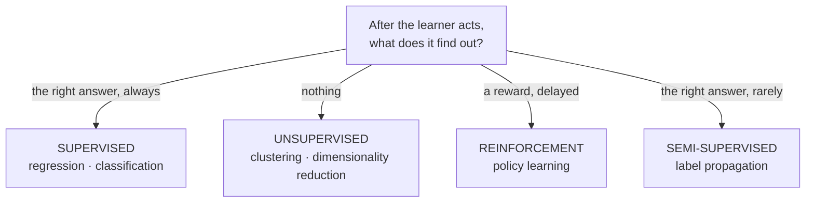
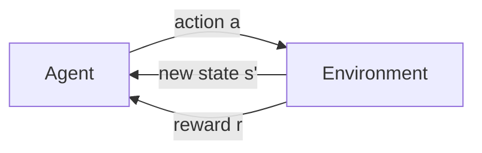
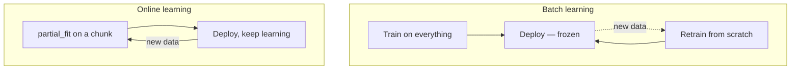

## What you'll learn

- the three paradigms separated by one question: **what feedback does the learner receive?**
- semi-supervised learning, and a case where **20 labels reach 1.0000** on 600 points
- **batch vs online** under drift, measured: mean accuracy 0.7391 against 0.9705
- **instance-based vs model-based**: 2 numbers stored, or all 26 rows
- which of the four axes actually determines your algorithm choice

## The organising question

Textbooks list the paradigms as though they were arbitrary categories. They are not. There is one
question underneath, and everything else follows from the answer.

**What feedback does the learner get after it acts?**

| Feedback | Paradigm | What you supply |
| --- | --- | --- |
| The correct answer, every time | **Supervised** | Inputs and labels |
| Nothing at all | **Unsupervised** | Inputs only |
| A reward, sometimes, possibly much later | **Reinforcement** | An environment and a reward signal |
| The correct answer for a small fraction | **Semi-supervised** | Inputs, and a few labels |



Here are the first three on the same 300 points, so the difference is visible rather than described:

<Figure
  src="/images/ml/phase-01-foundation/types-of-machine-learning/three-paradigms"
  alt="Three panels of the same three blobs. The first is coloured by given labels with a shaded decision boundary; the second is coloured by discovered clusters; the third is grey with a red trajectory wandering toward a star."
  title="Same points, three kinds of feedback"
  caption="Supervised: the colours were given, and the model learns the boundary — accuracy 1.0000. Unsupervised: no colours were given, and the algorithm recovers the same three groups — ARI 1.0000. Reinforcement: no labels anywhere, only a reward for reaching the star, learned by trying."
/>

## 1. Supervised learning

You have inputs $X$ and correct outputs $y$. The model learns the mapping.

$$
f: X \rightarrow y \quad \text{such that} \quad f(x_i) \approx y_i \ \text{ for the examples you have}
$$

Two sub-types, distinguished only by what $y$ looks like:

| | Regression | Classification |
| --- | --- | --- |
| $y$ is | a number | a category |
| Example | house price, temperature | spam / not spam, digit 0–9 |
| Typical metric | RMSE, MAE, $R^2$ | accuracy, precision, recall, AUC |
| Covered in | [Phase 3](/machine-learning/phase-03---supervised-learning---regression/phase-3---supervised-learning---regression/) | [Phase 4](/machine-learning/phase-04---supervised-learning---classification/phase-4---supervised-learning---classification/) |

This is the overwhelming majority of deployed machine learning, and it is where the labelling cost
lives. Somebody has to produce $y$ for every training row.

## 2. Unsupervised learning

You have $X$ and nothing else. The algorithm finds structure — groups, directions, densities — and
there is no answer key to check it against.

That absence is the defining difficulty. On the figure above, unsupervised clustering scored an
adjusted Rand index of 1.0000 against the hidden labels, but **only because we had those labels to
check with.** In a real unsupervised problem you would never know.

| Task | What it produces | Covered in |
| --- | --- | --- |
| Clustering | Group assignments | [Phase 6](/machine-learning/phase-06---unsupervised-learning--dimensionality-reduction/introduction-to-clustering/) |
| Dimensionality reduction | Fewer, denser columns | [Phase 6](/machine-learning/phase-06---unsupervised-learning--dimensionality-reduction/principal-component-analysis-pca/) |
| Anomaly detection | A score per row | [Phase 6](/machine-learning/phase-06---unsupervised-learning--dimensionality-reduction/anomaly-detection-with-isolation-forests/) |
| Association rules | "these things co-occur" | [Phase 6](/machine-learning/phase-06---unsupervised-learning--dimensionality-reduction/association-rule-learning-apriori-algorithm/) |

## 3. Reinforcement learning

An **agent** takes **actions** in an **environment**, which returns a new **state** and a
**reward**. The agent learns a **policy** — a mapping from states to actions — that maximises
cumulative reward.



Two things make this genuinely harder than supervised learning:

**Credit assignment.** You lose a chess game after 60 moves. Which move was the mistake? The reward
arrives once, at the end, for a long sequence of decisions.

**Exploration versus exploitation.** The agent only learns about actions it tries. Always taking the
best-known action means never discovering a better one.

Reinforcement learning is not covered further in this module — it needs an environment to interact
with, not a dataset — but you should recognise it. Game-playing agents, robot control, and some
recommendation and ad-bidding systems are RL.

## 4. Semi-supervised learning

Labels are expensive; unlabelled data is usually free. Semi-supervised methods use both: a few
labels to anchor the classes, and the geometry of the unlabelled mass to fill in the rest.

Measured on 600 two-moons points with only **20 labelled**:

| Method | Data used | Accuracy on all 600 |
| --- | --- | --- |
| Logistic regression | 20 labels | 0.7983 |
| RBF SVM | 20 labels | 0.9933 |
| **Label spreading** | 20 labels + 580 unlabelled | **1.0000** |

<Figure
  src="/images/ml/phase-01-foundation/types-of-machine-learning/semi-supervised"
  alt="Left: two interleaved crescents in grey with twenty highlighted labelled points. Right: a bar chart with logistic regression at 0.7983, RBF SVM at 0.9933 and label spreading at 1.0000."
  title="Twenty labels are plenty — if the model can express the shape"
  caption="Label spreading reaches a perfect 1.0000 using the unlabelled points to trace the crescents. But note the middle bar: an RBF SVM on the same 20 labels gets 0.9933 without any unlabelled data. Logistic regression fails at 0.7983 not from label scarcity but because a straight line cannot separate crescents."
/>

The honest reading of that table matters. Label spreading wins, but by 0.0067 over a supervised
model with the right inductive bias. The dramatic gap is between logistic regression (0.7983) and
everything else — and that gap is about **model shape, not label count**. Semi-supervised learning
is genuinely useful, and it is not the biggest lever in this table.

## Cross-cutting axis 1: batch or online

Independent of the paradigm: does the model learn once, or continuously?

**Batch (offline) learning** trains on all available data, deploys, and stops learning. To
incorporate new data you retrain from scratch.

**Online (incremental) learning** updates from each new batch as it arrives, via `partial_fit`.



The distinction is invisible on static data and decisive when the world moves. Here is a stream
where the true decision boundary rotates 3.2° per chunk — a slow, unremarkable drift — with each
model scored on the *next* chunk before it sees it:

| | First chunk | Last chunk | Mean over 29 chunks |
| --- | --- | --- | --- |
| Batch model, trained once | 0.9800 | **0.5100** | **0.7391** |
| Online model, `partial_fit` | 0.8900 | 0.9700 | **0.9705** |

<Figure
  src="/images/ml/phase-01-foundation/types-of-machine-learning/batch-vs-online"
  alt="A line chart over 29 data chunks. The blue batch-model line starts near 0.98 and decays steadily to 0.51; the amber online line stays flat near 0.97 throughout."
  title="When the world drifts, only one of these keeps up"
  caption="The batch model starts best — it was trained on chunk 0 and chunk 1 still looks like chunk 0. By chunk 29 it is at 0.5100, indistinguishable from guessing. The online model starts worse at 0.8900, having seen only one chunk, and then tracks the rotation for a mean of 0.9705."
/>

The batch model does not break. It stays exactly as correct as it was on the day it was trained,
while the world stops matching it. **Nothing alerts.** This is the single most important reason
[monitoring](/machine-learning/phase-08---model-deployment-mlops/phase-8---model-deployment-mlops/)
exists.

Online learning is not free: it can be corrupted by bad incoming data, it is harder to reproduce,
and rolling it back means restoring a snapshot of the weights. A scheduled batch retrain is often
the right compromise.

## Cross-cutting axis 2: instance-based or model-based

Also independent of the paradigm: does the algorithm **generalise** or **memorise**?

**Model-based** learners compress the training data into parameters and then discard the data.
A linear model on 26 points stored **2 numbers**: coefficient 0.7348, intercept −0.0070.

**Instance-based** learners keep the examples and compare new inputs against them at prediction
time. 3-NN on the same 26 points stored **all 26 rows** and learned no parameters at all.

<Figure
  src="/images/ml/phase-01-foundation/types-of-machine-learning/instance-vs-model"
  alt="A scatter of 26 points with a straight amber regression line and a blue step-function line from 3-nearest-neighbours."
  title="Two numbers stored, or all 26 rows stored"
  caption="The amber line is the whole model-based model — a slope and an intercept. The blue step function is 3-NN, which computes each prediction by averaging the three nearest stored rows. It has no parameters, so it also has nothing to inspect."
/>

```p5 title="Instance-based vs model-based prediction" desc="The pink marker sweeps across the axis as the query point. The gold line is the model-based prediction, always calm and linear. The highlighted neighbours and their tie-lines show the instance-based prediction jumping as different neighbours come into range." height="300"
let pts = [];
const PERIOD = 360;
function genPts() {
  pts = [];
  for (let i = 0; i < 16; i++) {
    const x = random(-2.6, 2.6);
    const y = 0.75 * x + random(-0.9, 0.9);
    pts.push({ x: x, y: y });
  }
}
function setup() {
  createCanvas(600, 300);
  textFont("monospace");
  textAlign(CENTER, CENTER);
  genPts();
}
function px(x) { return 50 + (x + 3) / 6 * (width - 100); }
function py(y) { return (height - 50) - (y + 4) / 8 * (height - 90); }
function draw() {
  background(13, 17, 23);

  const t = (frameCount % PERIOD) / PERIOD;
  const queryX = 2.2 * sin(TWO_PI * t);

  // model-based: least-squares line, fitted once from all the points
  let sx = 0, sy = 0, sxx = 0, sxy = 0;
  for (const p of pts) { sx += p.x; sy += p.y; sxx += p.x * p.x; sxy += p.x * p.y; }
  const n = pts.length;
  const m = (n * sxy - sx * sy) / (n * sxx - sx * sx);
  const b = (sy - m * sx) / n;

  // instance-based: the 3 nearest neighbours to the sweeping query point
  const withDist = pts.map(p => ({ p: p, d: abs(p.x - queryX) }));
  withDist.sort((a, c) => a.d - c.d);
  const neighbors = withDist.slice(0, 3);
  const knnPred = neighbors.reduce((s, o) => s + o.p.y, 0) / neighbors.length;

  noStroke();
  for (const p of pts) {
    fill(75, 139, 190);
    ellipse(px(p.x), py(p.y), 8, 8);
  }
  for (const o of neighbors) {
    fill(255, 211, 67);
    ellipse(px(o.p.x), py(o.p.y), 11, 11);
    stroke(255, 211, 67, 160);
    strokeWeight(1.5);
    line(px(queryX), py(knnPred), px(o.p.x), py(o.p.y));
    noStroke();
  }

  stroke(255, 211, 67);
  strokeWeight(2.5);
  line(px(-3), py(m * -3 + b), px(3), py(m * 3 + b));

  noStroke();
  fill(230, 90, 130);
  ellipse(px(queryX), py(m * queryX + b), 10, 10);
  fill(107, 169, 221);
  textSize(12);
  text("model-based -> " + (m * queryX + b).toFixed(2) +
       "   |   instance-based (k=3) -> " + knnPred.toFixed(2), width / 2, 20);
}
function mousePressed() { genPts(); }
```

Watch the two readouts at the top. The model-based number slides smoothly, because it is a straight
line evaluated at a moving point. The instance-based number jumps whenever the set of three nearest
neighbours changes — it is an average over whichever rows happen to be closest.

| | Model-based | Instance-based |
| --- | --- | --- |
| Training | Fits parameters | Stores the data |
| Prediction cost | $O(p)$ — a dot product | $O(n)$ — search the training set |
| Artefact size | Tiny | The whole dataset |
| Extrapolates | Yes, sometimes wrongly | No — flat beyond the data |
| Inspectable | Coefficients mean something | Nothing to inspect |
| Examples | Linear/logistic regression, neural nets | k-NN, kernel SVM (partly) |

## Putting the axes together

Four independent choices, and only one of them is usually forced by the problem:

| Axis | Determined by | Your freedom |
| --- | --- | --- |
| Supervised / unsupervised / RL | **Whether you have labels** | Almost none — the data decides |
| Regression / classification | **What $y$ looks like** | None |
| Batch / online | Whether the distribution drifts | Real: batch is simpler; retrain on a schedule |
| Instance / model-based | Nothing external | Full: pick on accuracy, size and latency |

The first two are dictated. Spend your judgement on the last two.

## In code

All three paradigms, side by side:

```python title="three_paradigms.py" showLineNumbers{1}
from sklearn.cluster import KMeans
from sklearn.datasets import make_blobs
from sklearn.linear_model import LogisticRegression
from sklearn.metrics import adjusted_rand_score

X, y = make_blobs(n_samples=300, centers=3, cluster_std=1.1, random_state=8)

# Supervised: y is available, so learn the mapping X -> y.
supervised = LogisticRegression(max_iter=1000).fit(X, y)
print("supervised accuracy", round(supervised.score(X, y), 4))       # 1.0

# Unsupervised: pretend y does not exist. Find structure in X alone.
labels = KMeans(n_clusters=3, n_init=10, random_state=0).fit_predict(X)
print("unsupervised ARI   ", round(adjusted_rand_score(y, labels), 4))  # 1.0
# ^ we can only compute that ARI because we secretly kept y.
#   In a real unsupervised problem there is nothing to compare against.
```

Online learning, and what it costs to skip it:

```python title="drift.py" showLineNumbers{1}
import numpy as np
from sklearn.linear_model import LogisticRegression, SGDClassifier

rng = np.random.default_rng(0)

def chunk(i, per=200):
    """The true boundary rotates 3.2 degrees with every chunk."""
    angle = np.radians(3.2 * i)
    X = rng.normal(0, 1, (per, 2))
    w = np.array([np.cos(angle), np.sin(angle)])
    return X, (X @ w > 0).astype(int)

X0, y0 = chunk(0)
batch = LogisticRegression().fit(X0, y0)          # trained once, never again
online = SGDClassifier(loss="log_loss", random_state=0)
online.partial_fit(X0, y0, classes=np.array([0, 1]))

batch_scores, online_scores = [], []
for i in range(1, 30):
    Xi, yi = chunk(i)
    batch_scores.append(batch.score(Xi, yi))
    online_scores.append(online.score(Xi, yi))    # score BEFORE updating
    online.partial_fit(Xi, yi)                    # then learn from it

print(f"batch  mean {np.mean(batch_scores):.4f}  last {batch_scores[-1]:.4f}")
print(f"online mean {np.mean(online_scores):.4f}  last {online_scores[-1]:.4f}")
# batch  mean 0.7391  last 0.5100
# online mean 0.9705  last 0.9700
```

Note `partial_fit` needs `classes=` on its first call — it cannot infer the full label set from one
chunk.

## Pitfalls

**Calling a problem unsupervised because the labels are inconvenient to collect.** If you can get
labels, get them. Supervised learning is enormously easier to evaluate.

**Evaluating unsupervised results against labels you secretly have and pretending that generalises.**
The ARI of 1.0000 above required the hidden `y`. Real unsupervised work has no such check — see the
[clustering page](/machine-learning/phase-06---unsupervised-learning--dimensionality-reduction/introduction-to-clustering/).

**Assuming a batch model stays correct.** Measured: 0.9800 down to 0.5100 with no error and no
alert, from a drift of 3.2° per chunk.

**Reaching for online learning by default.** It is harder to reproduce, harder to roll back, and
vulnerable to poisoned inputs. Scheduled retraining solves most drift.

**Forgetting instance-based models carry the data.** A k-NN model is a data export. That has
storage, latency and sometimes privacy consequences.

**Believing semi-supervised learning is always the answer to few labels.** Measured above: an RBF
SVM on 20 labels alone got 0.9933 against label spreading's 1.0000. Try the supervised model with
the right inductive bias first.

## Recap

- One question separates the paradigms: **what feedback does the learner get?**
- Supervised needs labels; unsupervised has no answer key at all; RL gets a delayed reward.
- Semi-supervised reached **1.0000 from 20 labels**, but a well-chosen supervised model got 0.9933
  from the same 20 — the real gap was model shape, not label count.
- Under 3.2°-per-chunk drift, a batch model fell from 0.9800 to **0.5100** (mean 0.7391) while an
  online model held at **0.9705**.
- Model-based stores parameters (2 numbers); instance-based stores the data (26 rows).
- The first two axes are dictated by your data. The last two are your judgement.

<Quiz
  questions={[
    {
      q: "You have 50,000 customer records and no labels, and you want to find natural segments. Which paradigm?",
      options: [
        "Supervised — create labels first",
        "Unsupervised — that is precisely the no-answer-key case",
        "Reinforcement — the segments give a reward",
        "Semi-supervised",
      ],
      answer: 1,
      explain: "No labels and a structure-finding goal is the definition of unsupervised. Note the consequence: you will have no accuracy score, so validating the segments becomes a judgement call plus internal metrics.",
    },
    {
      q: "A batch model went from 0.9800 to 0.5100 over 29 chunks of drifting data. What happened at the moment it broke?",
      options: [
        "It threw an exception",
        "Nothing — it kept returning confident predictions while the world stopped matching them",
        "Accuracy dropped suddenly at one chunk",
        "It automatically retrained",
      ],
      answer: 1,
      explain: "This is the defining hazard of deployed models. The batch model never changed and never errored; the data distribution moved out from under it, gradually, with no alert. Only monitoring catches this.",
    },
    {
      q: "Label spreading got 1.0000 from 20 labels; an RBF SVM got 0.9933 from the same 20; logistic regression got 0.7983. What is the main lesson?",
      options: [
        "Semi-supervised learning is a huge win",
        "Most of the gap comes from choosing a model that can express the shape, not from using the unlabelled data",
        "Logistic regression is broken",
        "Twenty labels are not enough",
      ],
      answer: 1,
      explain: "The semi-supervised gain over a well-chosen supervised model is 0.0067. The 0.1950 gap is between a linear model and anything non-linear on crescent-shaped data. Fix the inductive bias before reaching for extra machinery.",
    },
    {
      q: "Which pair of properties describes an instance-based learner?",
      options: [
        "Small artefact, fast prediction",
        "Large artefact, prediction cost that grows with the training set",
        "Small artefact, slow prediction",
        "Large artefact, fast prediction",
      ],
      answer: 1,
      explain: "It defers all work to prediction time and must carry the data to do it. The measured example: 2 numbers stored for the linear model against all 26 rows for 3-NN — and on breast cancer that was 2.0 KB against 98.1 KB.",
    },
    {
      q: "Which of the four axes gives you the most genuine freedom of choice?",
      options: [
        "Supervised vs unsupervised",
        "Instance-based vs model-based",
        "Regression vs classification",
        "None of them are choices",
      ],
      answer: 1,
      explain: "Whether you have labels decides the first axis, and what y looks like decides the second. Instance-based versus model-based is constrained by nothing external, so you pick it on accuracy, artefact size and latency.",
    },
  ]}
/>

## 🧪 Try It Yourself

### Exercise 1 – The same data, with and without labels

<DataCampExercise
  lang="python"
  hint={`fit_predict on KMeans never receives y; adjusted_rand_score compares the result against the hidden truth.`}
  code={`# Task: Exercise 1 - The same data, with and without labels
from sklearn.cluster import KMeans
from sklearn.datasets import make_blobs
from sklearn.linear_model import LogisticRegression
from sklearn.metrics import adjusted_rand_score

X, y = make_blobs(n_samples=300, centers=3, cluster_std=1.1, random_state=8)

supervised = LogisticRegression(max_iter=1000).fit(X, y)
labels = KMeans(n_clusters=3, n_init=10, random_state=0).___(X)
# replace ___ with fit_predict

print("supervised accuracy", round(supervised.score(X, y), 4))
print("unsupervised ARI   ", round(adjusted_rand_score(y, labels), 4))
print("labels seen by KMeans:", 0)

# -- Expected Output -------------------------------------------
# supervised accuracy 1.0
# unsupervised ARI    1.0
# labels seen by KMeans: 0
# --------------------------------------------------------------`}
  solution={`from sklearn.cluster import KMeans
from sklearn.datasets import make_blobs
from sklearn.linear_model import LogisticRegression
from sklearn.metrics import adjusted_rand_score

X, y = make_blobs(n_samples=300, centers=3, cluster_std=1.1, random_state=8)
supervised = LogisticRegression(max_iter=1000).fit(X, y)
labels = KMeans(n_clusters=3, n_init=10, random_state=0).fit_predict(X)
print("supervised accuracy", round(supervised.score(X, y), 4))
print("unsupervised ARI   ", round(adjusted_rand_score(y, labels), 4))
print("labels seen by KMeans:", 0)`}
  sct={`test_output_contains("unsupervised ARI    1.0")
success_msg("KMeans recovered the groups perfectly without labels — and you could only verify that BECAUSE you had them.")`}
  height={250}
/>

### Exercise 2 – Watch a batch model rot

<DataCampExercise
  lang="python"
  hint={`Train the batch model on chunk 0 only, then score it on every later chunk without refitting.`}
  code={`# Task: Exercise 2 - Watch a batch model rot
import numpy as np
from sklearn.linear_model import LogisticRegression

rng = np.random.default_rng(0)

def chunk(i, per=200):
    angle = np.radians(3.2 * i)
    X = rng.normal(0, 1, (per, 2))
    w = np.array([np.cos(angle), np.sin(angle)])
    return X, (X @ w > 0).astype(int)

X0, y0 = chunk(0)
batch = LogisticRegression().fit(X0, ___)      # replace ___ with y0

for i in (1, 10, 20, 29):
    Xi, yi = chunk(i)
    print(f"chunk {i:2d}: batch accuracy {batch.score(Xi, yi):.4f}")

# -- Expected Output -------------------------------------------
# chunk  1: batch accuracy 0.9800
# chunk 10: batch accuracy 0.8500
# chunk 20: batch accuracy 0.6400
# chunk 29: batch accuracy 0.4950
# --------------------------------------------------------------`}
  solution={`import numpy as np
from sklearn.linear_model import LogisticRegression

rng = np.random.default_rng(0)

def chunk(i, per=200):
    angle = np.radians(3.2 * i)
    X = rng.normal(0, 1, (per, 2))
    w = np.array([np.cos(angle), np.sin(angle)])
    return X, (X @ w > 0).astype(int)

X0, y0 = chunk(0)
batch = LogisticRegression().fit(X0, y0)
for i in (1, 10, 20, 29):
    Xi, yi = chunk(i)
    print(f"chunk {i:2d}: batch accuracy {batch.score(Xi, yi):.4f}")`}
  sct={`test_output_contains("chunk  1: batch accuracy 0.9800")
success_msg("No exception, no warning, no alert. Just a steady slide toward guessing.")`}
  height={260}
/>

### Exercise 3 – Online learning keeps up

<DataCampExercise
  lang="python"
  hint={`partial_fit needs classes= on the very first call, and you must score BEFORE updating.`}
  code={`# Task: Exercise 3 - Online learning keeps up
import numpy as np
from sklearn.linear_model import LogisticRegression, SGDClassifier

rng = np.random.default_rng(0)

def chunk(i, per=200):
    angle = np.radians(3.2 * i)
    X = rng.normal(0, 1, (per, 2))
    w = np.array([np.cos(angle), np.sin(angle)])
    return X, (X @ w > 0).astype(int)

X0, y0 = chunk(0)
batch = LogisticRegression().fit(X0, y0)
online = SGDClassifier(loss="log_loss", random_state=0)
online.partial_fit(X0, y0, ___=np.array([0, 1]))    # replace ___ with classes

b, o = [], []
for i in range(1, 30):
    Xi, yi = chunk(i)
    b.append(batch.score(Xi, yi))
    o.append(online.score(Xi, yi))
    online.partial_fit(Xi, yi)

print(f"batch  mean {np.mean(b):.4f}  last {b[-1]:.4f}")
print(f"online mean {np.mean(o):.4f}  last {o[-1]:.4f}")

# -- Expected Output -------------------------------------------
# batch  mean 0.7391  last 0.5100
# online mean 0.9705  last 0.9700
# --------------------------------------------------------------`}
  solution={`import numpy as np
from sklearn.linear_model import LogisticRegression, SGDClassifier

rng = np.random.default_rng(0)

def chunk(i, per=200):
    angle = np.radians(3.2 * i)
    X = rng.normal(0, 1, (per, 2))
    w = np.array([np.cos(angle), np.sin(angle)])
    return X, (X @ w > 0).astype(int)

X0, y0 = chunk(0)
batch = LogisticRegression().fit(X0, y0)
online = SGDClassifier(loss="log_loss", random_state=0)
online.partial_fit(X0, y0, classes=np.array([0, 1]))
b, o = [], []
for i in range(1, 30):
    Xi, yi = chunk(i)
    b.append(batch.score(Xi, yi))
    o.append(online.score(Xi, yi))
    online.partial_fit(Xi, yi)
print(f"batch  mean {np.mean(b):.4f}  last {b[-1]:.4f}")
print(f"online mean {np.mean(o):.4f}  last {o[-1]:.4f}")`}
  sct={`test_output_contains("online mean 0.9705")
success_msg("0.9705 against 0.7391. The online model is always scored BEFORE it sees the chunk, so that is honest.")`}
  height={280}
/>

### Exercise 4 – Two numbers, or all the rows

<DataCampExercise
  lang="python"
  hint={`A fitted LinearRegression exposes coef_ and intercept_; KNeighborsRegressor keeps _fit_X.`}
  code={`# Task: Exercise 4 - Two numbers, or all the rows
import numpy as np
from sklearn.linear_model import LinearRegression
from sklearn.neighbors import KNeighborsRegressor

rng = np.random.default_rng(1)
X = rng.uniform(-2.6, 2.6, (26, 1))
y = 0.75 * X.ravel() + rng.normal(0, 0.45, 26)

model_based = LinearRegression().fit(X, y)
instance_based = KNeighborsRegressor(n_neighbors=3).fit(X, y)

print("model-based    stores", model_based.coef_.size + 1, "numbers")
print("               coef", round(float(model_based.coef_[0]), 4),
      " intercept", round(float(model_based.intercept_), 4))
print("instance-based stores", instance_based._fit_X.shape[___], "rows")
# replace ___ with 0

# -- Expected Output -------------------------------------------
# model-based    stores 2 numbers
#                coef 0.7348  intercept -0.007
# instance-based stores 26 rows
# --------------------------------------------------------------`}
  solution={`import numpy as np
from sklearn.linear_model import LinearRegression
from sklearn.neighbors import KNeighborsRegressor

rng = np.random.default_rng(1)
X = rng.uniform(-2.6, 2.6, (26, 1))
y = 0.75 * X.ravel() + rng.normal(0, 0.45, 26)
model_based = LinearRegression().fit(X, y)
instance_based = KNeighborsRegressor(n_neighbors=3).fit(X, y)
print("model-based    stores", model_based.coef_.size + 1, "numbers")
print("               coef", round(float(model_based.coef_[0]), 4),
      " intercept", round(float(model_based.intercept_), 4))
print("instance-based stores", instance_based._fit_X.shape[0], "rows")`}
  sct={`test_output_contains("instance-based stores 26 rows")
success_msg("Two numbers against twenty-six rows. Scale that to a million rows and the difference stops being academic.")`}
  height={260}
/>

### Exercise 5 – Twenty labels, three approaches

<DataCampExercise
  lang="python"
  hint={`LabelSpreading takes -1 for unlabelled rows and sees the whole feature matrix.`}
  code={`# Task: Exercise 5 - Twenty labels, three approaches
import numpy as np
from sklearn.datasets import make_moons
from sklearn.linear_model import LogisticRegression
from sklearn.semi_supervised import LabelSpreading
from sklearn.svm import SVC

X, y = make_moons(n_samples=600, noise=0.08, random_state=0)
rng = np.random.default_rng(0)
labelled = rng.choice(len(X), size=20, replace=False)

partial = np.full(len(X), ___)                # replace ___ with -1
partial[labelled] = y[labelled]

print("logistic (20 labels)  ",
      round(LogisticRegression().fit(X[labelled], y[labelled]).score(X, y), 4))
print("RBF SVM  (20 labels)  ",
      round(SVC(gamma=2.0).fit(X[labelled], y[labelled]).score(X, y), 4))
print("label spreading       ",
      round(LabelSpreading(kernel="knn", n_neighbors=8).fit(X, partial).score(X, y), 4))

# -- Expected Output -------------------------------------------
# logistic (20 labels)   0.7983
# RBF SVM  (20 labels)   0.9933
# label spreading        1.0
# --------------------------------------------------------------`}
  solution={`import numpy as np
from sklearn.datasets import make_moons
from sklearn.linear_model import LogisticRegression
from sklearn.semi_supervised import LabelSpreading
from sklearn.svm import SVC

X, y = make_moons(n_samples=600, noise=0.08, random_state=0)
rng = np.random.default_rng(0)
labelled = rng.choice(len(X), size=20, replace=False)
partial = np.full(len(X), -1)
partial[labelled] = y[labelled]
print("logistic (20 labels)  ",
      round(LogisticRegression().fit(X[labelled], y[labelled]).score(X, y), 4))
print("RBF SVM  (20 labels)  ",
      round(SVC(gamma=2.0).fit(X[labelled], y[labelled]).score(X, y), 4))
print("label spreading       ",
      round(LabelSpreading(kernel="knn", n_neighbors=8).fit(X, partial).score(X, y), 4))`}
  sct={`test_output_contains("RBF SVM  (20 labels)   0.9933")
success_msg("Label spreading wins by 0.0067. The 0.1950 gap below it is model shape, not label count.")`}
  height={280}
/>

### Exercise 6 – One line separates a batch model from an online one

<DataCampExercise
  lang="python"
  hint={`Both models start from the same fit. The online one additionally calls partial_fit on each chunk after scoring it.`}
  code={`# Task: Exercise 6 - One line separates a batch model from an online one
import numpy as np
from sklearn.linear_model import SGDClassifier

rng = np.random.default_rng(0)


def chunk(angle, n=200):
    """Two classes separated by a boundary that rotates as the stream drifts."""
    X = rng.normal(size=(n, 2))
    direction = np.array([np.cos(angle), np.sin(angle)])
    y = (X @ direction > 0).astype(int)
    return X, y


X0, y0 = chunk(0.0, 600)
batch = SGDClassifier(loss="log_loss", random_state=0).fit(X0, y0)
online = SGDClassifier(loss="log_loss", random_state=0).fit(X0, y0)

batch_scores, online_scores = [], []
for step in range(1, 11):
    angle = np.deg2rad(3.2 * step)
    Xc, yc = chunk(angle)
    batch_scores.append(batch.score(Xc, yc))
    online_scores.append(online.score(Xc, yc))
    online.___(Xc, yc)              # replace ___ with partial_fit

print(f"{'chunk':>5} {'batch':>7} {'online':>7}")
for i, (b, o) in enumerate(zip(batch_scores, online_scores), start=1):
    print(f"{i:5d} {b:7.4f} {o:7.4f}")
print(f"batch  mean {np.mean(batch_scores):.4f}  final {batch_scores[-1]:.4f}")
print(f"online mean {np.mean(online_scores):.4f}  final {online_scores[-1]:.4f}")

# -- Expected Output -------------------------------------------
# chunk   batch  online
#     1  0.9750  0.9750
#     2  0.9850  0.9800
#     3  0.9800  1.0000
#     4  0.9350  0.9650
#     5  0.9000  0.9800
#     6  0.9000  0.9950
#     7  0.9250  0.9800
#     8  0.9000  0.9900
#     9  0.8400  0.9650
#    10  0.8250  0.9550
# batch  mean 0.9165  final 0.8250
# online mean 0.9785  final 0.9550
# --------------------------------------------------------------`}
  solution={`import numpy as np
from sklearn.linear_model import SGDClassifier

rng = np.random.default_rng(0)


def chunk(angle, n=200):
    X = rng.normal(size=(n, 2))
    direction = np.array([np.cos(angle), np.sin(angle)])
    y = (X @ direction > 0).astype(int)
    return X, y


X0, y0 = chunk(0.0, 600)
batch = SGDClassifier(loss="log_loss", random_state=0).fit(X0, y0)
online = SGDClassifier(loss="log_loss", random_state=0).fit(X0, y0)

batch_scores, online_scores = [], []
for step in range(1, 11):
    angle = np.deg2rad(3.2 * step)
    Xc, yc = chunk(angle)
    batch_scores.append(batch.score(Xc, yc))
    online_scores.append(online.score(Xc, yc))
    online.partial_fit(Xc, yc)

print(f"{'chunk':>5} {'batch':>7} {'online':>7}")
for i, (b, o) in enumerate(zip(batch_scores, online_scores), start=1):
    print(f"{i:5d} {b:7.4f} {o:7.4f}")
print(f"batch  mean {np.mean(batch_scores):.4f}  final {batch_scores[-1]:.4f}")
print(f"online mean {np.mean(online_scores):.4f}  final {online_scores[-1]:.4f}")`}
  sct={`test_output_contains("online mean 0.9785")
success_msg("The batch model decays to 0.8250 while the online model holds 0.9550 — same estimator, same data, one extra call.")`}
  height={380}
/>

## Next

[The ML Lifecycle - From Data to Deployment](/machine-learning/phase-01---the-ml-foundation/the-ml-lifecycle-from-data-to-deployment/)
— the eight stages of a real project, and the measurement showing that changing the algorithm and
damaging the labels move accuracy by exactly the same amount.
