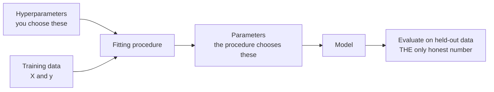

## What you'll learn

- Tom Mitchell's **T / E / P** definition, and it plotted as a real curve: 0.4426 → 0.9722
- what "the model learns" means concretely — a number chosen to minimise an error
- why a **baseline** is the first thing you compute, not the last
- the vocabulary you will use for the rest of this module
- a measured demonstration that **no algorithm can invent a signal that is not there**

## Intuition

Here is the whole idea, and it is genuinely this small.

You want a program that maps inputs to outputs — an image to a digit, an email to spam-or-not, a
house to a price. You cannot write the rules, because you do not know them. What you *do* have is
**examples of the mapping**: thousands of images with their correct digits.

So instead of writing the program, you write a program that *searches for* the program. You give it
a family of candidate mappings, a way to score how badly a candidate does on your examples, and a
procedure for finding a candidate that scores well.

That is machine learning. Three ingredients: **a space of candidates, a measure of badness, and a
search.**

## The definition

Tom Mitchell's 1997 formulation is still the sharpest one available:

> A computer program is said to learn from experience **E** with respect to some class of tasks
> **T** and performance measure **P**, if its performance at tasks in T, as measured by P, improves
> with experience E.

Its virtue is that all three letters are things you can point at:

| Letter | Meaning | Example: reading handwritten digits |
| --- | --- | --- |
| **T** | The task | Assign a label 0–9 to an 8×8 grayscale image |
| **E** | The experience | 1,257 images that already carry correct labels |
| **P** | The performance measure | Accuracy on 540 images the model has never seen |

The definition is also **testable**, which is unusual for a definition. Fix T, fix P, vary E, and
see whether P actually improves. Here it is, run for real:

| E — labelled examples | P — held-out accuracy |
| --- | --- |
| 10 | 0.4426 |
| 25 | 0.6148 |
| 50 | 0.8278 |
| 100 | 0.8889 |
| 200 | 0.9352 |
| 400 | 0.9444 |
| 800 | 0.9611 |
| 1,257 | **0.9722** |

<Figure
  src="/images/ml/phase-01-foundation/what-is-machine-learning/experience-improves-performance"
  alt="A rising curve of held-out accuracy against the number of training examples on a logarithmic axis, climbing from 0.44 at 10 examples to 0.97 at 1257, far above a dashed baseline at 0.10."
  title="Mitchell's definition, measured"
  caption="The task and the performance measure never change. Only the number of examples does. Accuracy climbs from 0.4426 to 0.9722 while the always-guess-the-most-common-digit baseline sits at 0.1019. This curve is what the word 'learn' means operationally."
/>

Two details worth pausing on.

**The baseline is 0.1019.** Ten digits, roughly balanced, so guessing the most common one gets you
about a tenth. Every accuracy number is only meaningful relative to that. A model at 0.85 on a
problem whose baseline is 0.84 has learned essentially nothing.

**The gains shrink.** Going from 10 to 100 examples bought 0.4463. Going from 800 to 1,257 bought
0.0111. Almost every learning curve looks like this, and it is why "just get more data" stops being
good advice at some point.

## What "learning" actually is

Strip away the vocabulary and a model is a set of numbers, chosen to make an error as small as
possible.

Take the simplest case: fit a straight line $y = wx + b$ to 40 points. The candidate space is every
possible $(w, b)$. The measure of badness is the mean squared error:

$$
\mathrm{MSE}(w, b) = \frac{1}{n}\sum_{i=1}^{n} \big(y_i - (w x_i + b)\big)^2
$$

Now the search. Hold $b$ fixed and sweep $w$:

| Candidate slope $w$ | MSE |
| --- | --- |
| 0.0000 | 1.3921 |
| 0.3000 | 0.6452 |
| **0.7173** | **0.2631** |
| 1.2000 | 0.7744 |
| 2.0000 | 3.8734 |

There is exactly one bottom to that curve, and it sits at $w = 0.7173$. That number *is* the
trained model. Everything else in this module — gradient descent, regularisation, boosting — is a
more sophisticated way of finding the bottom of a more complicated curve.

<Figure
  src="/images/ml/phase-01-foundation/what-is-machine-learning/what-fitting-means"
  alt="Left panel: forty scattered points with three candidate straight lines, the best one highlighted. Right panel: a U-shaped curve of mean squared error against candidate slope, with its minimum marked."
  title="Fitting is finding the bottom of a curve"
  caption="Left: three candidate lines through the same points; only one minimises the vertical distances. Right: the error as a function of the slope. The minimum sits at slope 0.7173 with MSE 0.2631 — that pair of numbers is the entire trained model."
/>

### See it move

```p5 title="Searching for the bottom" desc="A candidate line rotates through every slope while a marker traces the resulting error onto the curve below. Where the marker reaches the bottom of the curve is where the fitted line sits on the points." height="360"
let pts = [];
let w = -0.5, dir = 1;
const B = 0.13, TRUE_W = 0.7173;
function genPts() {
  pts = [];
  for (let i = 0; i < 40; i++) {
    const x = random(-2.6, 2.6);
    pts.push({ x: x, y: TRUE_W * x + B + random(-0.9, 0.9) });
  }
  w = -0.5; dir = 1;
}
function setup() { createCanvas(600, 360); textFont("monospace"); genPts(); }
function mse(slope) {
  let s = 0;
  for (const p of pts) s += (p.y - (slope * p.x + B)) ** 2;
  return s / pts.length;
}
function draw() {
  background(13, 17, 23);
  const sx = x => 40 + (x + 3) / 6 * 250;
  const sy = y => 130 - y / 3.2 * 95;

  // top panel: the data and the candidate line
  stroke(45, 52, 63); strokeWeight(1);
  line(sx(-3), sy(0), sx(3), sy(0));
  noStroke();
  for (const p of pts) { fill(75, 139, 190, 170); ellipse(sx(p.x), sy(p.y), 6, 6); }
  stroke(255, 211, 67); strokeWeight(2.4);
  line(sx(-3), sy(w * -3 + B), sx(3), sy(w * 3 + B));
  // residuals
  stroke(232, 110, 110, 110); strokeWeight(1);
  for (const p of pts) line(sx(p.x), sy(p.y), sx(p.x), sy(w * p.x + B));

  // bottom panel: the error curve
  const cx = x => 340 + (x + 0.5) / 3.0 * 230;
  const cy = e => 320 - (e / 5.0) * 250;
  stroke(60, 70, 84); strokeWeight(1);
  line(cx(-0.5), cy(0), cx(2.5), cy(0));
  line(cx(-0.5), cy(0), cx(-0.5), cy(5.0));
  noFill(); stroke(107, 169, 221); strokeWeight(2.2);
  beginShape();
  for (let s = -0.5; s <= 2.5; s += 0.02) vertex(cx(s), cy(Math.min(mse(s), 5.0)));
  endShape();
  noStroke(); fill(255, 211, 67);
  ellipse(cx(w), cy(Math.min(mse(w), 5.0)), 11, 11);
  stroke(120, 200, 120); strokeWeight(1.4);
  drawingContext.setLineDash([4, 4]);
  line(cx(TRUE_W), cy(0), cx(TRUE_W), cy(5.0));
  drawingContext.setLineDash([]);

  noStroke();
  fill(150); textSize(11); textAlign(LEFT, TOP);
  text("candidate line on the data", 40, 12);
  text("mean squared error vs slope", 340, 12);
  fill(120, 200, 120); textAlign(LEFT, TOP); textSize(10);
  text("minimum: 0.7173", cx(TRUE_W) + 6, 40);
  fill(255, 211, 67); textSize(14); textAlign(LEFT, TOP);
  text("slope " + w.toFixed(3) + "   MSE " + mse(w).toFixed(4), 40, 300);
  fill(140); textSize(10); textAlign(LEFT, BOTTOM);
  text("click to resample the points", 40, height - 10);

  w += 0.006 * dir;
  if (w > 2.4) dir = -1;
  if (w < -0.5) dir = 1;
}
function mousePressed() { genPts(); }
```

There is nothing else in the box. A model family gives you the shape of the candidate line, a loss
gives you the curve on the right, and training is the search for its lowest point.

## ML is not magic

The most useful thing a beginner can internalise is what machine learning **cannot** do.

A model can only find relationships that are present in the features you give it. If the columns
carry no information about the target, no algorithm recovers it. Not a bigger model, not more
epochs, not a fashionable architecture.

Here is that claim, measured. Three thousand rows, a coin-flip target, and two feature sets: one
where a column genuinely correlates with the label, one that is pure Gaussian noise. Same three
algorithms on both:

| Model | Features carry signal | Features are pure noise |
| --- | --- | --- |
| Logistic regression | 0.6677 | **0.5067** |
| RBF SVM | 0.6733 | **0.5117** |
| Random forest | 0.6357 | **0.5320** |

<Figure
  src="/images/ml/phase-01-foundation/what-is-machine-learning/ml-is-not-magic"
  alt="A grouped bar chart. Green bars for informative features sit near 0.65 to 0.67; red bars for noise features cluster just above the 0.5 dashed coin-flip line."
  title="Three algorithms, one dataset with nothing in it"
  caption="With an informative column, all three land around 0.64 to 0.67. With pure noise, all three land within 0.032 of a coin flip. The random forest's 0.5320 is the largest deviation — and it is cross-validation noise, not a discovery."
/>

Note also the left-hand column: even *with* signal, the ceiling is 0.6733. The signal was
deliberately weak, and no algorithm exceeded what the data allowed. **The features set the ceiling.
The algorithm decides how close you get to it.** That ordering does not change anywhere in this
module.

## Core vocabulary

Every one of these terms appears in every later phase. Learn them once, here.

| Term | Meaning | In the digits example |
| --- | --- | --- |
| **Feature** (predictor, $X$) | An input column | The 64 pixel intensities |
| **Target** (label, $y$) | The thing being predicted | The digit, 0–9 |
| **Sample** (instance, row) | One example | One 8×8 image |
| **Training set** | Rows the model may learn from | 1,257 images |
| **Test set** | Rows held back for honest scoring | 540 images |
| **Model** | The fitted mapping from $X$ to $y$ | The learned coefficients |
| **Parameters** | Numbers the fitting procedure chooses | Regression weights |
| **Hyperparameters** | Numbers *you* choose before fitting | Regularisation strength |
| **Loss** / cost | The badness being minimised | Mean squared error |
| **Overfitting** | Fits the training set, fails on new data | Train 1.00, test 0.82 |
| **Baseline** | The dumbest defensible predictor | Always guess the commonest digit: 0.1019 |
| **Generalisation** | Performing well on unseen data | The only thing that matters |

Two of these get confused constantly, so state the difference explicitly. **Parameters** are found
by fitting — you never type them. **Hyperparameters** are set before fitting and control *how* the
fitting happens. In `LogisticRegression(C=0.1)`, `C` is a hyperparameter; the coefficients it
produces are parameters.



## What ML is good for

The honest test is a checklist, and a problem should pass all four.

1. **A pattern exists.** There is a genuine relationship between inputs and output. Predicting a
   fair coin flip fails here, permanently.
2. **You cannot write the rules.** If you can specify the mapping precisely, write the code — it
   will be faster, cheaper, exactly correct and debuggable. Nobody should train a model to compute
   VAT.
3. **You have data.** Examples of the mapping, enough of them, representative of what production
   will look like.
4. **Approximately right is useful.** A model that is right 94% of the time has to be worth
   something. If only 100% will do, machine learning is the wrong tool.

| Problem | Verdict | Why |
| --- | --- | --- |
| Flag fraudulent transactions | **Good fit** | Pattern exists, rules are unwritable, labels accumulate, 94% helps |
| Recommend the next article | **Good fit** | Behavioural pattern, huge data, wrong guesses are cheap |
| Compute a tax amount | **Bad fit** | The rule is written down in law. Just implement it. |
| Predict tomorrow's lottery numbers | **Bad fit** | No pattern exists |
| Decide who gets a kidney transplant | **Bad fit** | 94% is not acceptable, and the ethics are not a modelling problem |

## In code

The whole loop, in fifteen lines:

```python title="first_model.py" showLineNumbers{1}
from collections import Counter

from sklearn.datasets import load_digits
from sklearn.linear_model import LogisticRegression
from sklearn.model_selection import train_test_split
from sklearn.pipeline import make_pipeline
from sklearn.preprocessing import StandardScaler

X, y = load_digits(return_X_y=True)                  # E — the experience
X_train, X_test, y_train, y_test = train_test_split(
    X, y, test_size=0.3, random_state=0, stratify=y)

# The baseline FIRST. Always. Everything else is measured against it.
baseline = Counter(y_test).most_common(1)[0][1] / len(y_test)
print("baseline     ", round(baseline, 4))           # 0.1019

model = make_pipeline(StandardScaler(), LogisticRegression(max_iter=5000))
model.fit(X_train, y_train)                          # the search

print("train size   ", len(X_train))                 # 1257
print("test accuracy", round(model.score(X_test, y_test), 4))   # 0.9722
```

Three habits worth forming from the very first model:

**Split before you look.** `train_test_split` comes before any inspection, cleaning or plotting.
Every decision you make after seeing the test set leaks information into your final number.

**Compute the baseline first.** It costs one line and it is the only thing that makes your accuracy
interpretable.

**Use a `Pipeline`.** Scaling belongs inside it. The moment preprocessing happens outside, it gets
fitted on the test data too, and your score becomes fiction. Phase 2 covers
[why](/machine-learning/phase-02---data-preprocessing--feature-engineering/transformation-pipelines--custom-transformers/).

## Pitfalls

**Reporting accuracy with no baseline.** 0.97 on digits is excellent (baseline 0.10). 0.97 on a
problem with 97% negatives is worthless. The number alone tells you nothing.

**Judging on the training set.** Any sufficiently flexible model can memorise. Train accuracy is a
measure of memory, not of learning.

**Believing a bigger model fixes bad features.** Measured above: the noise columns produced
0.5067, 0.5117 and 0.5320 across three very different algorithms. Feature quality is a ceiling.

**Skipping the "can I just write the rule?" question.** A great deal of production machine learning
would have been three `if` statements.

**Treating "the model is 94% accurate" as a property of the model.** It is a property of the model
*on that test set*. Change the population and the number changes.

## Recap

- **T / E / P**: fix the task and the measure, add experience, and watch performance improve —
  measured here from 0.4426 to 0.9722 against a 0.1019 baseline.
- A model is a set of numbers minimising a loss. For a straight line that was slope 0.7173 with
  MSE 0.2631.
- The gains from more data shrink: +0.4463 from the first 90 examples, +0.0111 from the last 457.
- **No algorithm can extract a signal the features do not carry** — three of them landed within
  0.032 of a coin flip on pure noise.
- Parameters are learned; hyperparameters are chosen.
- Split first, baseline first, pipeline always.

<Quiz
  questions={[
    {
      q: "Your classifier gets 97% accuracy. What is the first thing you should check?",
      options: [
        "Whether a bigger model does better",
        "What the baseline is — always guessing the majority class may already give 96%",
        "Whether the training accuracy is higher",
        "How long it took to train",
      ],
      answer: 1,
      explain: "Accuracy is meaningless in isolation. On digits the majority-class baseline is 0.1019, so 0.9722 is a real achievement. On a dataset with 96% negatives, 97% is barely better than doing nothing.",
    },
    {
      q: "You train three different algorithms on the same data and all three score about 0.51. What is the most likely explanation?",
      options: [
        "All three are misconfigured",
        "The features carry no information about the target",
        "You need more training epochs",
        "The learning rate is wrong",
      ],
      answer: 1,
      explain: "When very different algorithms agree on a near-chance score, the limitation is the data, not the model. Measured on the page: logistic 0.5067, RBF SVM 0.5117 and random forest 0.5320 on pure noise. Fix the features, not the algorithm.",
    },
    {
      q: "Which of these is a hyperparameter rather than a parameter?",
      options: [
        "A regression coefficient",
        "The regularisation strength C in LogisticRegression(C=0.1)",
        "The intercept term",
        "A neural network weight",
      ],
      answer: 1,
      explain: "Parameters are chosen by the fitting procedure — coefficients, intercepts, weights. Hyperparameters are chosen by you before fitting and control how the fitting behaves. C is set in the constructor, so it is a hyperparameter.",
    },
    {
      q: "Your company needs software to compute sales tax for each order. Should you train a model?",
      options: [
        "Yes, with enough historical orders it will learn the rule",
        "No — the rule is written down in law, so implement it exactly",
        "Yes, a random forest would handle the edge cases",
        "Only if you have more than 100,000 orders",
      ],
      answer: 1,
      explain: "Criterion 2 of the checklist: if you can write the rule, write it. Code is faster, exactly correct, debuggable and free. A model would be approximately right, which for tax is a defect and not a feature.",
    },
    {
      q: "Going from 10 to 100 training examples raised accuracy by 0.4463. Going from 800 to 1,257 raised it by 0.0111. What does that pattern indicate?",
      options: [
        "The model is broken beyond 800 examples",
        "Diminishing returns — most learning curves flatten, so more data eventually stops being the cheapest improvement",
        "The test set is too small",
        "You should switch algorithms at 800 examples",
      ],
      answer: 1,
      explain: "Learning curves are concave almost universally. Once you are on the flat part, feature work, better labels or a different model class usually buy more than another batch of rows — and diagnosing that is exactly what a learning curve is for.",
    },
  ]}
/>

## 🧪 Try It Yourself

### Exercise 1 – Baseline before model

<DataCampExercise
  lang="python"
  hint={`Counter(y_test).most_common(1) returns a list with one (value, count) pair.`}
  code={`# Task: Exercise 1 - Baseline before model
from collections import Counter

from sklearn.datasets import load_digits
from sklearn.model_selection import train_test_split

X, y = load_digits(return_X_y=True)
X_train, X_test, y_train, y_test = train_test_split(
    X, y, test_size=0.3, random_state=0, stratify=y)

commonest, count = Counter(y_test).___(1)[0]     # replace ___ with most_common
baseline = count / len(y_test)

print("train size", len(X_train))
print("test size ", len(X_test))
print("baseline", round(baseline, 4))

# -- Expected Output -------------------------------------------
# train size 1257
# test size  540
# baseline 0.1019
# --------------------------------------------------------------`}
  solution={`from collections import Counter

from sklearn.datasets import load_digits
from sklearn.model_selection import train_test_split

X, y = load_digits(return_X_y=True)
X_train, X_test, y_train, y_test = train_test_split(
    X, y, test_size=0.3, random_state=0, stratify=y)
commonest, count = Counter(y_test).most_common(1)[0]
baseline = count / len(y_test)
print("train size", len(X_train))
print("test size ", len(X_test))
print("baseline", round(baseline, 4))`}
  sct={`test_output_contains("baseline 0.1019")
success_msg("Any accuracy you report from now on is measured against 0.1019.")`}
  height={250}
/>

### Exercise 2 – Watch P improve with E

<DataCampExercise
  lang="python"
  hint={`Slice the training arrays to the first n rows before calling fit.`}
  code={`# Task: Exercise 2 - Watch P improve with E
from sklearn.datasets import load_digits
from sklearn.linear_model import LogisticRegression
from sklearn.model_selection import train_test_split
from sklearn.pipeline import make_pipeline
from sklearn.preprocessing import StandardScaler

X, y = load_digits(return_X_y=True)
X_train, X_test, y_train, y_test = train_test_split(
    X, y, test_size=0.3, random_state=0, stratify=y)

for n in (10, 50, 200, 800, len(X_train)):
    model = make_pipeline(StandardScaler(), LogisticRegression(max_iter=5000))
    model.fit(X_train[:n], y_train[:___])        # replace ___ with n
    print(f"E={n:5d}  P={model.score(X_test, y_test):.4f}")

# -- Expected Output -------------------------------------------
# E=   10  P=0.4426
# E=   50  P=0.8278
# E=  200  P=0.9352
# E=  800  P=0.9611
# E= 1257  P=0.9722
# --------------------------------------------------------------`}
  solution={`from sklearn.datasets import load_digits
from sklearn.linear_model import LogisticRegression
from sklearn.model_selection import train_test_split
from sklearn.pipeline import make_pipeline
from sklearn.preprocessing import StandardScaler

X, y = load_digits(return_X_y=True)
X_train, X_test, y_train, y_test = train_test_split(
    X, y, test_size=0.3, random_state=0, stratify=y)
for n in (10, 50, 200, 800, len(X_train)):
    model = make_pipeline(StandardScaler(), LogisticRegression(max_iter=5000))
    model.fit(X_train[:n], y_train[:n])
    print(f"E={n:5d}  P={model.score(X_test, y_test):.4f}")`}
  sct={`test_output_contains("E= 1257  P=0.9722")
success_msg("T fixed, P fixed, E rising, performance rising. That is Mitchell's definition, executed.")`}
  height={250}
/>

### Exercise 3 – Find the bottom of the error curve

<DataCampExercise
  lang="python"
  hint={`Sweep candidate slopes and pick the one with the smallest mean squared error.`}
  code={`# Task: Exercise 3 - Find the bottom of the error curve
import numpy as np
from sklearn.linear_model import LinearRegression

rng = np.random.default_rng(1)
x = rng.uniform(-2.6, 2.6, 40)
y = 0.75 * x + rng.uniform(-0.9, 0.9, 40)

fitted = LinearRegression().fit(x.reshape(-1, 1), y)
b = fitted.intercept_

for w in (0.0, 0.3, 0.7173, 1.2, 2.0):
    mse = ((y - (w * x + b)) ___ 2).mean()       # replace ___ with **
    print(f"slope {w:.4f} -> MSE {mse:.4f}")

print("least squares slope:", round(float(fitted.coef_[0]), 4))

# -- Expected Output -------------------------------------------
# slope 0.0000 -> MSE 1.3921
# slope 0.3000 -> MSE 0.6452
# slope 0.7173 -> MSE 0.2631
# slope 1.2000 -> MSE 0.7744
# slope 2.0000 -> MSE 3.8734
# least squares slope: 0.7173
# --------------------------------------------------------------`}
  solution={`import numpy as np
from sklearn.linear_model import LinearRegression

rng = np.random.default_rng(1)
x = rng.uniform(-2.6, 2.6, 40)
y = 0.75 * x + rng.uniform(-0.9, 0.9, 40)
fitted = LinearRegression().fit(x.reshape(-1, 1), y)
b = fitted.intercept_
for w in (0.0, 0.3, 0.7173, 1.2, 2.0):
    mse = ((y - (w * x + b)) ** 2).mean()
    print(f"slope {w:.4f} -> MSE {mse:.4f}")
print("least squares slope:", round(float(fitted.coef_[0]), 4))`}
  sct={`test_output_contains("least squares slope: 0.7173")
success_msg("Brute-force sweep and the closed-form solution agree. That is all 'training' means here.")`}
  height={260}
/>

### Exercise 4 – Prove that noise stays noise

> **Note:** Smaller than the lesson's example (40 trees instead of 300 in the forest) so it runs in your browser; expect different numbers from the ones quoted in the lesson. The logistic and SVM rows match the lesson; the forest row differs slightly.

<DataCampExercise
  lang="python"
  hint={`Build one feature matrix that correlates with y and one that is pure Gaussian noise.`}
  code={`# Task: Exercise 4 - Prove that noise stays noise
# Smaller than the lesson's example (40 trees instead of 300 in the forest) so it runs in your browser; expect different numbers from the ones quoted in the lesson. The logistic and SVM rows match the lesson; the forest row differs slightly.
import numpy as np
from sklearn.ensemble import RandomForestClassifier
from sklearn.linear_model import LogisticRegression
from sklearn.model_selection import cross_val_score
from sklearn.pipeline import make_pipeline
from sklearn.preprocessing import StandardScaler
from sklearn.svm import SVC

rng = np.random.default_rng(0)
n = 3000
y = rng.integers(0, 2, n)

signal = np.column_stack([y + rng.normal(0, 1.1, n),
                          rng.normal(0, 1, n), rng.normal(0, 1, n)])
noise = rng.normal(0, 1, (n, ___))            # replace ___ with 3

models = [("logistic", make_pipeline(StandardScaler(), LogisticRegression(max_iter=2000))),
          ("RBF SVM ", make_pipeline(StandardScaler(), SVC())),
          ("forest  ", RandomForestClassifier(n_estimators=40, random_state=0))]

for name, m in models:
    print(f"{name} signal {cross_val_score(m, signal, y, cv=5).mean():.4f}"
          f"   noise {cross_val_score(m, noise, y, cv=5).mean():.4f}")

# -- Expected Output -------------------------------------------
# logistic signal 0.6677   noise 0.5067
# RBF SVM  signal 0.6733   noise 0.5117
# forest   signal 0.6347   noise 0.5250
# --------------------------------------------------------------`}
  solution={`import numpy as np
from sklearn.ensemble import RandomForestClassifier
from sklearn.linear_model import LogisticRegression
from sklearn.model_selection import cross_val_score
from sklearn.pipeline import make_pipeline
from sklearn.preprocessing import StandardScaler
from sklearn.svm import SVC

rng = np.random.default_rng(0)
n = 3000
y = rng.integers(0, 2, n)
signal = np.column_stack([y + rng.normal(0, 1.1, n),
                          rng.normal(0, 1, n), rng.normal(0, 1, n)])
noise = rng.normal(0, 1, (n, 3))
models = [("logistic", make_pipeline(StandardScaler(), LogisticRegression(max_iter=2000))),
          ("RBF SVM ", make_pipeline(StandardScaler(), SVC())),
          ("forest  ", RandomForestClassifier(n_estimators=40, random_state=0))]
for name, m in models:
    print(f"{name} signal {cross_val_score(m, signal, y, cv=5).mean():.4f}"
          f"   noise {cross_val_score(m, noise, y, cv=5).mean():.4f}")`}
  sct={`test_output_contains("noise 0.5067")
success_msg("Three very different algorithms, all within 0.025 of a coin flip. The features are the ceiling.")`}
  height={280}
/>

### Exercise 5 – Train accuracy is not learning

<DataCampExercise
  lang="python"
  hint={`An unconstrained decision tree can memorise any training set exactly.`}
  code={`# Task: Exercise 5 - Train accuracy is not learning
from sklearn.datasets import make_moons
from sklearn.model_selection import train_test_split
from sklearn.tree import DecisionTreeClassifier

X, y = make_moons(n_samples=600, noise=0.32, random_state=0)
X_tr, X_te, y_tr, y_te = train_test_split(X, y, test_size=0.35,
                                          random_state=0, stratify=y)

for depth in (2, 4, 10, None):
    m = DecisionTreeClassifier(max_depth=depth, random_state=0).fit(X_tr, y_tr)
    train = m.score(X_tr, y_tr)
    test = m.___(X_te, y_te)                  # replace ___ with score
    print(f"depth {str(depth):>4}: train {train:.4f}  test {test:.4f}"
          f"  gap {train - test:.4f}")

# -- Expected Output -------------------------------------------
# depth    2: train 0.9000  test 0.8381  gap 0.0619
# depth    4: train 0.9128  test 0.8667  gap 0.0462
# depth   10: train 0.9897  test 0.8381  gap 0.1516
# depth None: train 1.0000  test 0.8190  gap 0.1810
# --------------------------------------------------------------`}
  solution={`from sklearn.datasets import make_moons
from sklearn.model_selection import train_test_split
from sklearn.tree import DecisionTreeClassifier

X, y = make_moons(n_samples=600, noise=0.32, random_state=0)
X_tr, X_te, y_tr, y_te = train_test_split(X, y, test_size=0.35,
                                          random_state=0, stratify=y)
for depth in (2, 4, 10, None):
    m = DecisionTreeClassifier(max_depth=depth, random_state=0).fit(X_tr, y_tr)
    train = m.score(X_tr, y_tr)
    test = m.score(X_te, y_te)
    print(f"depth {str(depth):>4}: train {train:.4f}  test {test:.4f}"
          f"  gap {train - test:.4f}")`}
  sct={`test_output_contains("depth None: train 1.0000")
success_msg("A perfect 1.0000 on the training set alongside the WORST test score. Never judge on train.")`}
  height={260}
/>

### Exercise 6 – Price the next batch of data

<DataCampExercise
  lang="python"
  hint={`The gain between two points is the difference in accuracy; divide it by the number of examples added to get value per example.`}
  code={`# Task: Exercise 6 - Price the next batch of data
# The learning curve from this page, exactly as measured.
sizes = [10, 25, 50, 100, 200, 400, 800, 1257]
scores = [0.4426, 0.6148, 0.8278, 0.8889, 0.9352, 0.9444, 0.9611, 0.9722]

for i in range(1, len(sizes)):
    added = sizes[i] - sizes[i - 1]
    gain = scores[i] - scores[___]          # replace ___ with i - 1
    print(f"+{added:4d} examples -> {scores[i]:.4f}"
          f"  (gain {gain:+.4f}, {gain / added:+.6f} per example)")

first = scores[3] - scores[0]        # 10 -> 100 examples
last = scores[7] - scores[6]         # 800 -> 1,257 examples
print(f"first 90 examples:  {first:+.4f}")
print(f"last 457 examples:  {last:+.4f}")
print(f"per example, the first 90 were worth "
      f"{(first / 90) / (last / 457):.0f}x the last 457")

# -- Expected Output -------------------------------------------
# +  15 examples -> 0.6148  (gain +0.1722, +0.011480 per example)
# +  25 examples -> 0.8278  (gain +0.2130, +0.008520 per example)
# +  50 examples -> 0.8889  (gain +0.0611, +0.001222 per example)
# + 100 examples -> 0.9352  (gain +0.0463, +0.000463 per example)
# + 200 examples -> 0.9444  (gain +0.0092, +0.000046 per example)
# + 400 examples -> 0.9611  (gain +0.0167, +0.000042 per example)
# + 457 examples -> 0.9722  (gain +0.0111, +0.000024 per example)
# first 90 examples:  +0.4463
# last 457 examples:  +0.0111
# per example, the first 90 were worth 204x the last 457
# --------------------------------------------------------------`}
  solution={`sizes = [10, 25, 50, 100, 200, 400, 800, 1257]
scores = [0.4426, 0.6148, 0.8278, 0.8889, 0.9352, 0.9444, 0.9611, 0.9722]

for i in range(1, len(sizes)):
    added = sizes[i] - sizes[i - 1]
    gain = scores[i] - scores[i - 1]
    print(f"+{added:4d} examples -> {scores[i]:.4f}"
          f"  (gain {gain:+.4f}, {gain / added:+.6f} per example)")

first = scores[3] - scores[0]
last = scores[7] - scores[6]
print(f"first 90 examples:  {first:+.4f}")
print(f"last 457 examples:  {last:+.4f}")
print(f"per example, the first 90 were worth "
      f"{(first / 90) / (last / 457):.0f}x the last 457")`}
  sct={`test_output_contains("204x")
success_msg("Two hundred times. That ratio is the argument for spending the next week on features rather than on labelling.")`}
  height={330}
/>

## Next

[ML vs Traditional Programming](/machine-learning/phase-01---the-ml-foundation/ml-vs-traditional-programming/)
— thirty hand-written rules against one fitted model on the same spam corpus, and the measurement
that shows which of the two responds to more data.
