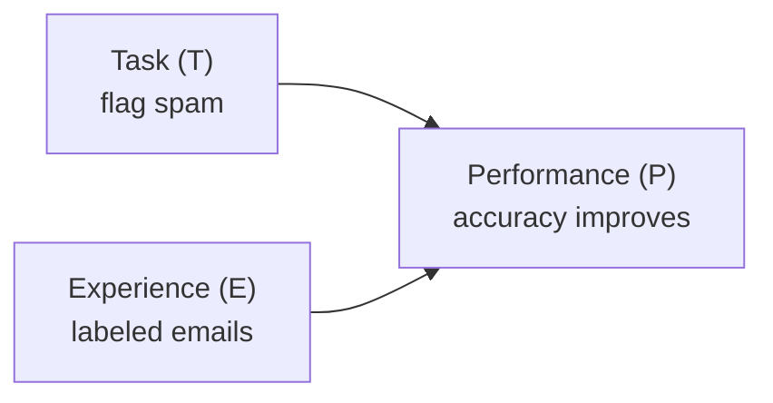

Machine Learning is the science (and art) of programming computers so they
can learn from data. Pioneer Arthur Samuel put it simply in 1959:

> "[Machine Learning is the] field of study that gives computers the ability
> to learn without being explicitly programmed."

Tom Mitchell gave a more engineering-flavored definition in 1997:

> "A computer program is said to learn from experience *E* with respect to
> some task *T* and some performance measure *P*, if its performance on *T*,
> as measured by *P*, improves with experience *E*."

Your spam filter is a good example. Given examples of spam emails (flagged by
users) and regular ("ham") emails, it learns to flag new spam. Here:

- **Task (T)** — flag spam for new emails
- **Experience (E)** — the training data (past emails, labeled spam/ham)
- **Performance (P)** — accuracy: the ratio of emails classified correctly

If you just download a copy of Wikipedia, your computer suddenly has a lot
more data — but it isn't any better at a task. That's why downloading data is
**not** Machine Learning; learning means improving at *T*, measured by *P*, as
you get more *E*.

## The idea in one sentence

**Machine Learning is a way to build programs that learn a mapping from inputs to outputs from examples, instead of hard-coded rules.**

In ML, we usually have:

- **Inputs (features)**: the data we observe (like age, clicks, temperature)
- **Outputs (labels/targets)**: the thing we want to predict (like price, spam/not spam)
- **A model**: a mathematical function with adjustable parameters
- **Training**: the process of adjusting parameters so predictions match reality

## A good mental model

Think of ML like learning a *recipe* from tasting many dishes.

- Traditional programming: you write the recipe.
- ML: you taste many examples (data), and the model approximates the recipe.

## What problems is ML good for?

ML shines when:

- the rules are too complex to write explicitly
- the patterns are statistical and noisy
- you want the system to improve with more data

Examples:

- email spam detection
- product recommendations
- speech-to-text
- fraud detection
- predicting house prices

To summarize, from the book, Machine Learning is great for:

- **Problems needing lots of fine-tuning or long lists of rules** — one ML
  algorithm can often simplify code and perform better than the traditional
  approach (spam filters are the classic example).
- **Complex problems with no known algorithm** — e.g. speech recognition. You
  can't hand-write rules for "high-pitch sound = the word two" that scale to
  millions of voices and languages, but a model can learn it from recordings.
- **Fluctuating environments** — an ML system can retrain and adapt to new
  data, instead of being manually patched forever.
- **Getting insights about complex problems and large amounts of data** —
  inspecting what a trained model learned can reveal patterns a human
  would never spot. This is called **data mining**.

:::tip[From the book]
Géron's spam-filter example: if spammers notice "4U" gets blocked, they switch
to "For U." A rule-based filter needs a human to write a new rule every time.
An ML-based filter automatically notices "For U" becoming frequent in spam
flagged by users, and starts blocking it — no code change needed.
:::

## ML is not magic

ML does **not** automatically mean:

- correct answers
- unbiased answers
- causation (often it learns correlations)

You still must:

- choose good data
- evaluate correctly
- monitor for drift and failures

## Core vocabulary (keep these handy)

- **Feature**: an input variable.
- **Target / label**: output variable.
- **Dataset**: many examples (rows) with features (columns).
- **Training**: fitting a model.
- **Inference**: using the trained model to predict.

## Tiny checkpoint

Can you explain ML like this to a friend?

> “ML is when we show a program many examples so it can learn patterns and make predictions on new data.”

import DataCampExercise from "../../../../components/DataCampExercise.astro";

## 🧪 Try It Yourself

### Exercise 1 – Train-Test Split

<DataCampExercise
  lang="python"
  hint={`Use \`train_test_split(X, y, test_size=0.2)\` from scikit-learn.`}
  code={`# Task: Exercise 1 – Train-Test Split
from sklearn.model_selection import ___   # replace ___ with train_test_split
import numpy as np

X = np.arange(20).reshape(10, 2)
y = np.arange(10)

X_train, X_test, y_train, y_test = ___(X, y, test_size=0.2, random_state=42)
print("Train size:", len(X_train))
print("Test size:", len(X_test))

# ── Expected Output ───────────────────────────────────────────
# Train size: 8
# Test size: 2
# ──────────────────────────────────────────────────────────────`}
  solution={`from sklearn.model_selection import train_test_split
import numpy as np

X = np.arange(20).reshape(10, 2)
y = np.arange(10)
X_train, X_test, y_train, y_test = train_test_split(X, y, test_size=0.2, random_state=42)
print("Train size:", len(X_train))
print("Test size:", len(X_test))`}
  sct={`test_output_contains("Train size: 8")
test_output_contains("Test size: 2")
success_msg("Data split correctly!")`}
  height={148}
/>

### Exercise 2 – Fit a Linear Model

<DataCampExercise
  lang="python"
  hint={`Call \`model.fit(X_train, y_train)\` then \`model.predict(X_test)\`.`}
  code={`# Task: Exercise 2 – Fit a Linear Model
from sklearn.linear_model import LinearRegression
import numpy as np

X = np.array([[1], [2], [3], [4], [5]])
y = np.array([2, 4, 6, 8, 10])

model = LinearRegression()
model.___(X, y)            # replace ___ with fit
preds = model.___(X)       # replace ___ with predict
print("Predictions:", preds.astype(int))

# ── Expected Output ───────────────────────────────────────────
# Predictions: [ 2  4  6  8 10]
# ──────────────────────────────────────────────────────────────`}
  solution={`from sklearn.linear_model import LinearRegression
import numpy as np

X = np.array([[1], [2], [3], [4], [5]])
y = np.array([2, 4, 6, 8, 10])
model = LinearRegression()
model.fit(X, y)
preds = model.predict(X)
print("Predictions:", preds.astype(int))`}
  sct={`test_output_contains("Predictions:")
success_msg("Model fitted and predictions made!")`}
  height={148}
/>

### Exercise 3 – Evaluate with MSE

<DataCampExercise
  lang="python"
  hint={`Use \`mean_squared_error(y_true, y_pred)\` to measure prediction error.`}
  code={`# Task: Exercise 3 – Evaluate with MSE
from sklearn.metrics import ___   # replace ___ with mean_squared_error
import numpy as np

y_true = np.array([3, 5, 7, 9])
y_pred = np.array([2.8, 5.1, 7.2, 8.9])

mse = ___(y_true, y_pred)         # replace ___ with mean_squared_error
print(f"MSE: {mse:.4f}")

# ── Expected Output ───────────────────────────────────────────
# MSE: 0.0275
# ──────────────────────────────────────────────────────────────`}
  solution={`from sklearn.metrics import mean_squared_error
import numpy as np

y_true = np.array([3, 5, 7, 9])
y_pred = np.array([2.8, 5.1, 7.2, 8.9])
mse = mean_squared_error(y_true, y_pred)
print(f"MSE: {mse:.4f}")`}
  sct={`test_output_contains("MSE:")
success_msg("MSE evaluated successfully!")`}
  height={138}
/>

