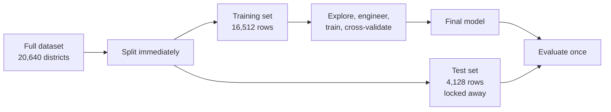

## What you'll learn

- what **data snooping** is, and why your own brain is the leak
- how to split, and why `random_state` alone is not a stable strategy
- **stratified sampling**, and the exact distortion a random split introduces here
- hash-based splitting that survives new rows arriving
- the three situations where a random split is not merely suboptimal but wrong
- how big a test set should be, with the arithmetic

## Intuition

You are about to spend hours exploring this dataset. Every pattern you notice will influence the
model you build — which features you engineer, which model family you try, which threshold looks
reasonable. That is the point of exploration.

But if you explore *all* the data, those choices are informed by rows you will later use to measure
success. The measurement is no longer independent, and the number it produces is optimistic by an
amount you cannot estimate. There is no test to detect this and no correction for it afterwards.

The defence is procedural, not technical: **split first, then explore only the training set.**
Set the test set aside now, before you know anything, and do not look at it again until the model
is finished.



:::danger[Snooping is not only about code]
Leakage through preprocessing is mechanical and a pipeline prevents it. Leakage through *you* is
not: once you have seen that districts near the bay are expensive, you cannot unsee it, and the
feature you build from that observation was informed by test rows. The only defence is to split
before looking.
:::

## The math: how big should the test set be?

The test estimate is itself a sample statistic, with a standard error. For an error rate $p$
measured on $n$ test rows:

$$
\text{SE} = \sqrt{\frac{p(1-p)}{n}}
$$

and the 95% interval is roughly $\pm 1.96\,\text{SE}$. So:

| Test rows | SE at $p = 0.1$ | 95% interval width |
| --- | --- | --- |
| 100 | 0.030 | ±5.9 points |
| 1,000 | 0.009 | ±1.9 points |
| 4,128 | 0.005 | ±0.9 points |
| 10,000 | 0.003 | ±0.6 points |

The usual 20% is a heuristic, not a law. What matters is the absolute count: 20% of 500 rows is
100 test rows and an interval of ±6 points, which cannot distinguish an 88% model from a 92% one.
With 20,640 rows, 20% gives 4,128 and a comfortably tight interval.

**Rule of thumb:** aim for a test set large enough that the interval is narrower than the difference
you care about detecting.

## The straightforward split

```python title="basic_split.py" showLineNumbers{1}
import pandas as pd
from sklearn.model_selection import train_test_split

URL = ("https://raw.githubusercontent.com/ageron/handson-ml2/master/"
       "datasets/housing/housing.csv")
housing = pd.read_csv(URL)

train_set, test_set = train_test_split(housing, test_size=0.2, random_state=42)

print(len(train_set), len(test_set))     # 16512 4128
```

`random_state=42` makes the split reproducible **for this exact dataframe**. Append one row and
every subsequent row can move sides, so a model retrained on refreshed data may be evaluated on
rows it previously trained on.

### A split that survives new data

Hash each row's stable identifier and assign it by hash value. A row's side then depends only on
its own identifier, never on the size or order of the dataset:

```python title="hash_split.py" showLineNumbers{1}
from zlib import crc32

import numpy as np
import pandas as pd


def in_test_set(identifier, test_ratio):
    """Deterministic per-row membership: the same id always lands the same side."""
    return crc32(np.int64(identifier)) < test_ratio * 2**32


def split_by_id(data, test_ratio, id_column):
    ids = data[id_column]
    in_test = ids.apply(lambda i: in_test_set(i, test_ratio))
    return data.loc[~in_test], data.loc[in_test]


housing = pd.read_csv(URL)
# A genuinely stable id. Row position is NOT stable if rows are ever reordered.
housing["id"] = housing["longitude"] * 1000 + housing["latitude"]

train_set, test_set = split_by_id(housing, 0.2, "id")
print(len(train_set), len(test_set))     # 16322 4318
```

The counts are not exactly 80/20 because hashing distributes approximately, and that is fine. New
districts join whichever side their own id dictates; existing districts never move.

:::caution[Pick an identifier that cannot change]
Row index is the obvious choice and the wrong one — it shifts if rows are ever deleted or
reordered. Use something intrinsic and permanent. Here, latitude and longitude combined are stable
because a district does not move.
:::

## Stratified sampling

`median_income` is the strongest predictor of the target, so the test set must represent its
distribution faithfully. A random split does not guarantee that.

Stratifying needs a categorical column, so bucket the continuous one first:

<Figure
  src="/images/ml/phase-02-preprocessing/creating-a-test-set/income-categories"
  alt="Left: histogram of median income with dashed cut lines at 1.5, 3.0, 4.5 and 6.0. Right: a bar chart of the resulting five categories with percentages from 4% to 35%."
  title="Cutting a continuous feature into strata"
  caption="The cut points are chosen so no stratum is tiny — the smallest holds 4% of districts. Too many buckets and each becomes too small to sample reliably."
/>

```python title="stratified_split.py" showLineNumbers{1}
import numpy as np
import pandas as pd
from sklearn.model_selection import StratifiedShuffleSplit, train_test_split

housing["income_cat"] = pd.cut(
    housing["median_income"],
    bins=[0.0, 1.5, 3.0, 4.5, 6.0, np.inf],
    labels=[1, 2, 3, 4, 5],
)

splitter = StratifiedShuffleSplit(n_splits=1, test_size=0.2, random_state=42)
train_idx, test_idx = next(splitter.split(housing, housing["income_cat"]))
strat_train = housing.iloc[train_idx]
strat_test = housing.iloc[test_idx]

overall = housing["income_cat"].value_counts(normalize=True).sort_index()
_, random_test = train_test_split(housing, test_size=0.2, random_state=42)

comparison = pd.DataFrame({
    "overall": overall,
    "stratified": strat_test["income_cat"].value_counts(normalize=True).sort_index(),
    "random": random_test["income_cat"].value_counts(normalize=True).sort_index(),
})
comparison["random % error"] = 100 * (comparison["random"] / comparison["overall"] - 1)
comparison["strat % error"] = 100 * (comparison["stratified"] / comparison["overall"] - 1)
print(comparison.round(4).to_string())

#             overall  stratified  random  random % error  strat % error
# income_cat
# 1            0.0398      0.0400  0.0402          0.9732         0.3650
# 2            0.3188      0.3188  0.3244          1.7323        -0.0152
# 3            0.3506      0.3505  0.3585          2.2664        -0.0138
# 4            0.1763      0.1764  0.1674         -5.0563         0.0275
# 5            0.1144      0.1143  0.1095         -4.3184        -0.0847

# Drop the helper column once the split is done
for subset in (strat_train, strat_test):
    subset.drop("income_cat", axis=1, inplace=True)
```

<Figure
  src="/images/ml/phase-02-preprocessing/creating-a-test-set/sampling-bias"
  alt="Grouped bar chart of test-set proportion error by income category. Random-split bars reach plus 2.3 and minus 5.1 percent; stratified bars are near zero everywhere."
  title="Proportion error by stratum, random against stratified"
  caption="The random split under-represents category 4 by 5.1% and over-represents category 3 by 2.3%. The stratified split is within 0.4% everywhere, and within 0.1% for the four largest strata."
/>

### Reading the plot

1. **The random split's errors are not random noise you can average away** — they are the specific
   composition of this test set, and every score you compute on it inherits them.
2. **The error is worst for the middle-to-high strata.** Category 4 is under-represented by 5%, so
   the test set contains proportionally fewer of exactly the districts the model is likely to find
   hardest.
3. **Stratified is essentially exact.** Errors below 0.1% for the four main strata. It costs one
   extra line.
4. **Category 1 still shows 0.37% error even when stratified** — with 4% of rows, integer rounding
   in the fold sizes leaves a residue. Rare strata are always approximate.

## See it move

Two samplers drawing 20% from the same population, over and over. The bars show how far each
sample's stratum proportions drift from the population's.

```p5 title="Random versus stratified sampling" desc="Both samplers draw 20% of the population repeatedly. The bars show the error in each stratum's proportion; the random sampler wanders, the stratified one stays pinned near zero." height="330"
const PROPS = [0.04, 0.32, 0.35, 0.18, 0.11];
const N = 400;
let pop = [];
let randErr = [0, 0, 0, 0, 0];
let stratErr = [0, 0, 0, 0, 0];
let t = 0;
function buildPop() {
  pop = [];
  for (let i = 0; i < N; i++) {
    let r = random(), acc = 0, s = 0;
    for (let k = 0; k < PROPS.length; k++) { acc += PROPS[k]; if (r <= acc) { s = k; break; } }
    pop.push(s);
  }
}
function setup() {
  createCanvas(600, 330);
  textFont("monospace");
  buildPop();
}
function drawSamples() {
  const size = Math.floor(N * 0.2);
  // purely random
  const idx = [];
  while (idx.length < size) idx.push(Math.floor(random(N)));
  const rc = [0, 0, 0, 0, 0];
  for (const i of idx) rc[pop[i]]++;
  // stratified: take 20% from within each stratum
  const sc = [0, 0, 0, 0, 0];
  for (let k = 0; k < 5; k++) {
    const members = pop.filter((v) => v === k).length;
    sc[k] = Math.round(members * 0.2);
  }
  const rTot = rc.reduce((a, b) => a + b, 0) || 1;
  const sTot = sc.reduce((a, b) => a + b, 0) || 1;
  for (let k = 0; k < 5; k++) {
    const target = pop.filter((v) => v === k).length / N;
    randErr[k] = target ? (rc[k] / rTot) / target - 1 : 0;
    stratErr[k] = target ? (sc[k] / sTot) / target - 1 : 0;
  }
}
function draw() {
  background(13, 17, 23);
  const cols = [[75, 139, 190], [255, 211, 67], [120, 200, 120], [197, 153, 255], [232, 110, 110]];

  // population strip
  noStroke();
  const per = (width - 40) / N;
  for (let i = 0; i < N; i++) {
    const c = cols[pop[i]];
    fill(c[0], c[1], c[2], 190);
    rect(20 + i * per, 30, per + 0.6, 16);
  }
  fill(180);
  textSize(11);
  textAlign(LEFT, BOTTOM);
  text("population of " + N + " districts, coloured by income stratum", 20, 26);

  t++;
  if (t % 45 === 0) drawSamples();

  // error bars
  const baseY = 210, scale = 260, groupW = (width - 80) / 5;
  stroke(90, 96, 110);
  strokeWeight(1);
  line(30, baseY, width - 30, baseY);
  noStroke();
  for (let k = 0; k < 5; k++) {
    const cx = 50 + k * groupW;
    fill(232, 110, 110);
    rect(cx - 14, baseY - randErr[k] * scale, 12, randErr[k] * scale);
    fill(120, 200, 120);
    rect(cx + 4, baseY - stratErr[k] * scale, 12, stratErr[k] * scale);
    fill(150);
    textSize(10);
    textAlign(CENTER, TOP);
    text("cat " + (k + 1), cx, baseY + 8);
    fill(200);
    textSize(9);
    text((randErr[k] * 100).toFixed(1) + "%", cx - 8, baseY - randErr[k] * scale - (randErr[k] >= 0 ? 14 : -4));
  }

  fill(232, 110, 110);
  textAlign(LEFT, CENTER);
  textSize(12);
  text("■ random split", 30, 288);
  fill(120, 200, 120);
  text("■ stratified split", 170, 288);
  fill(140);
  textSize(10);
  text("bar height = proportion error against the population", 30, 308);
}
function mousePressed() { buildPop(); drawSamples(); }
```

## When a random split is wrong

Stratification is a refinement. These three cases are different — a random split produces a
number that is simply invalid:

| Situation | What breaks | Correct split |
| --- | --- | --- |
| **Time series** | Training on the future to predict the past | Split by date: train on older, test on newer |
| **Grouped rows** (several rows per patient, user, device) | The same entity appears on both sides | `GroupShuffleSplit` / `GroupKFold` by entity |
| **Spatial autocorrelation** | Adjacent districts are near-duplicates | Split by region or block |

The housing data has mild spatial autocorrelation — neighbouring districts resemble one another —
so even the stratified split is slightly optimistic. For a production system you would split by
county. This phase uses the random split because it is the version every tutorial uses, and the
limitation is worth knowing rather than hiding.

## Pitfalls

:::danger[Exploring before splitting]
The most common and least visible mistake in applied ML. Every insight from the full dataset leaks
into the model through your decisions. Split on line one of the notebook.
:::

:::caution[Too many strata]
Cutting income into 20 buckets gives strata of a few hundred rows, and stratified sampling on them
becomes unstable. Five to ten strata, each holding at least a few percent of the data, is the
usable range.
:::

:::caution[Leaving the helper column in]
`income_cat` was created only to enable the split. Leave it in the feature matrix and the model
gets a coarse copy of its best feature — harmless here, but the same mistake with a target-derived
column is straightforward leakage.
:::

:::caution[Reusing the test set]
Evaluate, tune, evaluate again, tune again, and the test set has become a validation set with
optimistic scores. Use cross-validation on the training data for every decision, and touch the test
set once.
:::

<Quiz
  questions={[
    {
      q: "Why must the test set be created before exploring the data?",
      options: [
        "It makes the code run faster",
        "Because insights from the full dataset influence your modelling choices, so the test estimate stops being independent — and no correction exists afterwards",
        "Because scikit-learn requires it",
        "It does not matter as long as the model never sees the test set during fit()",
      ],
      answer: 1,
      explain: "The leak runs through the analyst, not the code. A feature you invented after noticing a pattern in test rows was informed by those rows.",
    },
    {
      q: "Why is random_state=42 not a sufficient strategy for a growing dataset?",
      options: [
        "42 is a poor choice of seed",
        "The split depends on the dataframe's contents, so adding rows can move existing rows between sets — and previously-tested rows end up in training",
        "It only works for classification",
        "It is sufficient; nothing else is needed",
      ],
      answer: 1,
      explain: "The permutation is over row positions. Hash-based splitting on a stable identifier fixes each row's side permanently, so new data can arrive safely.",
    },
    {
      q: "In this dataset, how far does the random split misrepresent income category 4?",
      options: ["Not at all", "By about 0.1%", "By about 5%", "By about 25%"],
      answer: 2,
      explain: "The random test set contains 16.74% category-4 districts against 17.63% overall — a 5.06% relative shortfall. The stratified split is off by 0.03%.",
    },
    {
      q: "You have one row per hospital visit and many visits per patient. What split do you need?",
      options: [
        "A random split, stratified by outcome",
        "A group split by patient, so no patient appears in both training and test",
        "A time-based split",
        "Any split; it makes no difference",
      ],
      answer: 1,
      explain: "With a random split the model can memorise a patient from their training visits and be scored on their test visits. GroupShuffleSplit or GroupKFold keeps every patient on one side.",
    },
  ]}
/>

## 🧪 Try It Yourself

### Exercise 1 – Split, and check the sizes

<DataCampExercise
  lang="python"
  hint={`train_test_split(data, test_size=0.2, random_state=42) returns two frames.`}
  code={`# Task: Exercise 1 - Split, and check the sizes
import pandas as pd
from sklearn.model_selection import ___     # replace ___ with train_test_split

URL = ("https://raw.githubusercontent.com/ageron/handson-ml2/master/"
       "datasets/housing/housing.csv")
housing = pd.read_csv(URL)

train_set, test_set = train_test_split(housing, test_size=0.2, random_state=42)

print("train:", len(train_set))
print("test:", len(test_set))
print("test share:", round(len(test_set) / len(housing), 4))

# -- Expected Output -------------------------------------------
# train: 16512
# test: 4128
# test share: 0.2
# --------------------------------------------------------------`}
  solution={`import pandas as pd
from sklearn.model_selection import train_test_split

URL = ("https://raw.githubusercontent.com/ageron/handson-ml2/master/"
       "datasets/housing/housing.csv")
housing = pd.read_csv(URL)
train_set, test_set = train_test_split(housing, test_size=0.2, random_state=42)
print("train:", len(train_set))
print("test:", len(test_set))
print("test share:", round(len(test_set) / len(housing), 4))`}
  sct={`test_output_contains("test: 4128")
success_msg("4,128 test rows gives a comfortably tight confidence interval.")`}
  height={198}
/>

### Exercise 2 – Bucket a continuous column

<DataCampExercise
  lang="python"
  hint={`pd.cut slices a numeric column into labelled bins.`}
  code={`# Task: Exercise 2 - Bucket a continuous column
import numpy as np
import pandas as pd

URL = ("https://raw.githubusercontent.com/ageron/handson-ml2/master/"
       "datasets/housing/housing.csv")
housing = pd.read_csv(URL)

housing["income_cat"] = pd.___(                # replace ___ with cut
    housing["median_income"],
    bins=[0.0, 1.5, 3.0, 4.5, 6.0, np.inf],
    labels=[1, 2, 3, 4, 5],
)

print(housing["income_cat"].value_counts().sort_index().to_string())

# -- Expected Output -------------------------------------------
# income_cat
# 1     822
# 2    6581
# 3    7236
# 4    3639
# 5    2362
# --------------------------------------------------------------`}
  solution={`import numpy as np
import pandas as pd

URL = ("https://raw.githubusercontent.com/ageron/handson-ml2/master/"
       "datasets/housing/housing.csv")
housing = pd.read_csv(URL)
housing["income_cat"] = pd.cut(
    housing["median_income"],
    bins=[0.0, 1.5, 3.0, 4.5, 6.0, np.inf],
    labels=[1, 2, 3, 4, 5],
)
print(housing["income_cat"].value_counts().sort_index().to_string())`}
  sct={`test_output_contains("822")
success_msg("Five strata, the smallest holding 4% of the data.")`}
  height={218}
/>

### Exercise 3 – Measure the sampling bias

<DataCampExercise
  lang="python"
  hint={`Compare each split's category proportions against the overall proportions.`}
  code={`# Task: Exercise 3 - Measure the sampling bias
import numpy as np
import pandas as pd
from sklearn.model_selection import StratifiedShuffleSplit, train_test_split

URL = ("https://raw.githubusercontent.com/ageron/handson-ml2/master/"
       "datasets/housing/housing.csv")
housing = pd.read_csv(URL)
housing["income_cat"] = pd.cut(housing["median_income"],
                               bins=[0.0, 1.5, 3.0, 4.5, 6.0, np.inf],
                               labels=[1, 2, 3, 4, 5])

overall = housing["income_cat"].value_counts(normalize=True).sort_index()
_, rnd = train_test_split(housing, test_size=0.2, random_state=42)
sss = StratifiedShuffleSplit(n_splits=1, test_size=0.2, random_state=42)
_, strat_idx = next(sss.split(housing, housing["income_cat"]))
strat = housing.iloc[strat_idx]

rnd_err = 100 * (rnd["income_cat"].value_counts(normalize=True).sort_index() / ___ - 1)
strat_err = 100 * (strat["income_cat"].value_counts(normalize=True).sort_index() / overall - 1)
# replace ___ with overall

print("worst random error:", round(rnd_err.abs().max(), 2), "%")
print("worst stratified error:", round(strat_err.abs().max(), 2), "%")

# -- Expected Output -------------------------------------------
# worst random error: 5.06 %
# worst stratified error: 0.36 %
# --------------------------------------------------------------`}
  solution={`import numpy as np
import pandas as pd
from sklearn.model_selection import StratifiedShuffleSplit, train_test_split

URL = ("https://raw.githubusercontent.com/ageron/handson-ml2/master/"
       "datasets/housing/housing.csv")
housing = pd.read_csv(URL)
housing["income_cat"] = pd.cut(housing["median_income"],
                               bins=[0.0, 1.5, 3.0, 4.5, 6.0, np.inf],
                               labels=[1, 2, 3, 4, 5])
overall = housing["income_cat"].value_counts(normalize=True).sort_index()
_, rnd = train_test_split(housing, test_size=0.2, random_state=42)
sss = StratifiedShuffleSplit(n_splits=1, test_size=0.2, random_state=42)
_, strat_idx = next(sss.split(housing, housing["income_cat"]))
strat = housing.iloc[strat_idx]
rnd_err = 100 * (rnd["income_cat"].value_counts(normalize=True).sort_index() / overall - 1)
strat_err = 100 * (strat["income_cat"].value_counts(normalize=True).sort_index() / overall - 1)
print("worst random error:", round(rnd_err.abs().max(), 2), "%")
print("worst stratified error:", round(strat_err.abs().max(), 2), "%")`}
  sct={`test_output_contains("worst random error: 5.06 %")
success_msg("Fourteen times more faithful, for one extra line of code.")`}
  height={258}
/>

### Exercise 4 – A split that survives new rows

<DataCampExercise
  lang="python"
  hint={`crc32 of the identifier decides the side, independently of every other row.`}
  code={`# Task: Exercise 4 - A split that survives new rows
from zlib import crc32

import numpy as np
import pandas as pd

URL = ("https://raw.githubusercontent.com/ageron/handson-ml2/master/"
       "datasets/housing/housing.csv")
housing = pd.read_csv(URL)
housing["id"] = housing["longitude"] * 1000 + housing["latitude"]

def in_test_set(identifier, ratio):
    return crc32(np.int64(identifier)) < ratio * 2 ___ 32     # replace ___ with **

in_test = housing["id"].apply(lambda i: in_test_set(i, 0.2))
print("test rows:", int(in_test.sum()))
print("share:", round(float(in_test.mean()), 4))

# -- Expected Output -------------------------------------------
# test rows: 4318
# share: 0.2092
# --------------------------------------------------------------`}
  solution={`from zlib import crc32

import numpy as np
import pandas as pd

URL = ("https://raw.githubusercontent.com/ageron/handson-ml2/master/"
       "datasets/housing/housing.csv")
housing = pd.read_csv(URL)
housing["id"] = housing["longitude"] * 1000 + housing["latitude"]

def in_test_set(identifier, ratio):
    return crc32(np.int64(identifier)) < ratio * 2 ** 32

in_test = housing["id"].apply(lambda i: in_test_set(i, 0.2))
print("test rows:", int(in_test.sum()))
print("share:", round(float(in_test.mean()), 4))`}
  sct={`test_output_contains("test rows: 4318")
success_msg("Approximately 20%, and every row's side is now permanent.")`}
  height={218}
/>

### Exercise 5 – How precise is a test estimate?

<DataCampExercise
  lang="python"
  hint={`The standard error of a proportion is sqrt(p(1-p)/n).`}
  code={`# Task: Exercise 5 - How precise is a test estimate?
import numpy as np

p = 0.10        # true error rate

for n in (100, 1000, 4128, 10000):
    se = np.sqrt(p * (1 - p) / ___)        # replace ___ with n
    print(f"n={n:>6}  SE {se:.4f}  95% interval +/- {1.96 * se * 100:.1f} points")

# -- Expected Output -------------------------------------------
# n=   100  SE 0.0300  95% interval +/- 5.9 points
# n=  1000  SE 0.0095  95% interval +/- 1.9 points
# n=  4128  SE 0.0047  95% interval +/- 0.9 points
# n= 10000  SE 0.0030  95% interval +/- 0.6 points
# --------------------------------------------------------------`}
  solution={`import numpy as np

p = 0.10

for n in (100, 1000, 4128, 10000):
    se = np.sqrt(p * (1 - p) / n)
    print(f"n={n:>6}  SE {se:.4f}  95% interval +/- {1.96 * se * 100:.1f} points")`}
  sct={`test_output_contains("n=  4128")
success_msg("With only 100 test rows you cannot tell an 88% model from a 92% one.")`}
  height={218}
/>

## Recap

- Split before exploring. The leak runs through your decisions, and no statistical correction
  exists for it.
- Test-set precision follows $\sqrt{p(1-p)/n}$; 20% is a heuristic, and the absolute row count is
  what matters.
- `random_state` is reproducible only for a fixed dataframe. Hash a stable identifier when new data
  will arrive.
- On this dataset a random split misrepresents income category 4 by 5.06%; stratified sampling
  brings the worst error to 0.36%.
- Time series, grouped rows and spatial data need date, group and region splits respectively —
  a random split there is invalid, not merely imprecise.
- Drop the stratification helper column once the split is made.

### Exercise 6 – A split that survives new rows

<DataCampExercise
  lang="python"
  hint={`Hash the identifier and compare the hash against test_ratio * 2 ** 32. The decision must depend only on the id.`}
  code={`# Task: Exercise 6 - A split that survives new rows
import numpy as np
from zlib import crc32


def in_test_set(identifier, test_ratio=0.2):
    """Stable membership: the decision depends only on the id, not on the file."""
    return crc32(np.int64(identifier)) < test_ratio * 2 ** ___   # replace ___ with 32


ids_today = np.arange(1000)
ids_tomorrow = np.arange(1200)          # 200 new rows arrive

test_today = {i for i in ids_today if in_test_set(i)}
test_tomorrow = {i for i in ids_tomorrow if in_test_set(i)}

print(f"today:    {len(ids_today)} rows, {len(test_today)} in test "
      f"({len(test_today) / len(ids_today):.4f})")
print(f"tomorrow: {len(ids_tomorrow)} rows, {len(test_tomorrow)} in test "
      f"({len(test_tomorrow) / len(ids_tomorrow):.4f})")
moved = test_today.symmetric_difference(test_tomorrow & set(ids_today))
print(f"original rows that changed side: {len(moved)}")

from sklearn.model_selection import train_test_split

_, rnd_today = train_test_split(ids_today, test_size=0.2, random_state=42)
_, rnd_tomorrow = train_test_split(ids_tomorrow, test_size=0.2, random_state=42)
crossed = len(set(rnd_today) - set(rnd_tomorrow))
print(f"with train_test_split(random_state=42), rows that changed side: {crossed}")

# -- Expected Output -------------------------------------------
# today:    1000 rows, 200 in test (0.2000)
# tomorrow: 1200 rows, 239 in test (0.1992)
# original rows that changed side: 0
# with train_test_split(random_state=42), rows that changed side: 123
# --------------------------------------------------------------`}
  solution={`import numpy as np
from zlib import crc32


def in_test_set(identifier, test_ratio=0.2):
    return crc32(np.int64(identifier)) < test_ratio * 2 ** 32


ids_today = np.arange(1000)
ids_tomorrow = np.arange(1200)

test_today = {i for i in ids_today if in_test_set(i)}
test_tomorrow = {i for i in ids_tomorrow if in_test_set(i)}

print(f"today:    {len(ids_today)} rows, {len(test_today)} in test "
      f"({len(test_today) / len(ids_today):.4f})")
print(f"tomorrow: {len(ids_tomorrow)} rows, {len(test_tomorrow)} in test "
      f"({len(test_tomorrow) / len(ids_tomorrow):.4f})")
moved = test_today.symmetric_difference(test_tomorrow & set(ids_today))
print(f"original rows that changed side: {len(moved)}")

from sklearn.model_selection import train_test_split

_, rnd_today = train_test_split(ids_today, test_size=0.2, random_state=42)
_, rnd_tomorrow = train_test_split(ids_tomorrow, test_size=0.2, random_state=42)
crossed = len(set(rnd_today) - set(rnd_tomorrow))
print(f"with train_test_split(random_state=42), rows that changed side: {crossed}")`}
  sct={`test_output_contains("original rows that changed side: 0")
success_msg("Zero against 123. A fixed random_state is reproducible for a fixed dataframe only — the day new rows arrive, 123 old rows quietly swap sides and your test set is contaminated with rows the model trained on last month.")`}
  height={340}
/>

## Next

Continue to
[Exploratory Data Analysis & Correlations](/machine-learning/phase-02---data-preprocessing--feature-engineering/exploratory-data-analysis--correlations/)
— now that the test set is safely locked away, explore the training set as aggressively as you like.
