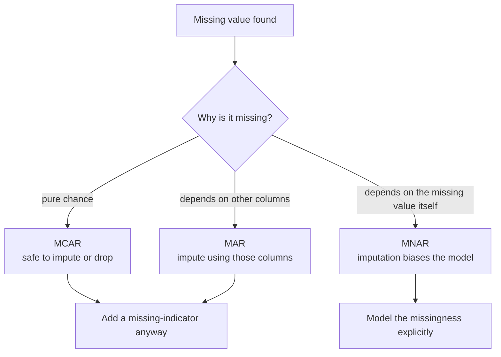

import DataCampExercise from "../../../../components/DataCampExercise.astro";
import Figure from "../../../../components/Figure.astro";
import Quiz from "../../../../components/Quiz.astro";

## What you'll learn

- **MCAR, MAR and MNAR** — the three mechanisms, and why only one is safe to ignore
- the three responses to a hole, and the arithmetic cost of each
- why every imputation **understates variance**, computed by hand
- `SimpleImputer`, and why the imputer must be fitted on the training set only
- the missing-indicator trick, which keeps the information that a value was absent
- a measured comparison of five strategies on real data

## Intuition

A missing value is not nothing. It is a fact about the row that your model cannot read, and
sometimes the most informative fact available — a blank income field on a loan application may
predict default better than any number that could have been entered there.

So the question is never just "what number do I put here?" It is "why is this missing, and does the
absence itself carry information?"



### The three mechanisms

| Mechanism | Definition | Example | Safe to impute? |
| --- | --- | --- | --- |
| **MCAR** | Missing completely at random | A sensor dropped packets at random | Yes |
| **MAR** | Missingness depends on *other observed* columns | Older records lack a field added later | Yes, using those columns |
| **MNAR** | Missingness depends on the *missing value itself* | High earners decline to state income | No — any imputation is biased |

MNAR is the dangerous one and it cannot be detected from the data alone: the evidence you would
need is exactly what is absent. It has to be reasoned about from how the data was collected.

For `total_bedrooms`, 207 rows out of 20,640, the distribution of house values among incomplete
rows looks like the rest of the dataset — consistent with MCAR, and imputation is safe.

<Figure
  src="/images/ml/phase-02-preprocessing/data-cleaning/missing-pattern"
  alt="Left: a horizontal bar chart showing total_bedrooms as the only column with missing values, 207 of them. Right: two overlaid density histograms of median house value for rows with and without missing data, closely matching."
  title="Where the holes are, and whether they are special"
  caption="The two distributions on the right overlap closely, so the incomplete rows are not a distinct population. That is the check that licenses imputation."
/>

## The three responses

```python title="three_options.py" showLineNumbers{1}
# Option 1 — drop the rows with holes
housing.dropna(subset=["total_bedrooms"])       # loses 207 rows (1.0%)

# Option 2 — drop the whole column
housing.drop("total_bedrooms", axis=1)          # loses a feature for all 20,640 rows

# Option 3 — fill the holes
median = housing["total_bedrooms"].median()     # 435.0
housing["total_bedrooms"].fillna(median, inplace=True)
```

| Option | Cost | Choose it when |
| --- | --- | --- |
| Drop rows | Loses whole observations | Very few rows affected, and MCAR |
| Drop column | Loses a feature entirely | Most of the column is missing (>40–50%) |
| Impute | Distorts the distribution | The default for everything else |

Option 3 wins here: losing 1% of rows to save one column is a bad trade, and losing the column
across 100% of rows to save 1% is a worse one.

:::caution[Option 1 has a hidden failure at prediction time]
Dropping rows works during training. In production a row arrives with a hole and still needs a
prediction — you cannot drop it. Whatever you do at training time, you must have a strategy for
serving time, and imputation is one that works in both.
:::

## Worked example by hand: imputation shrinks variance

Eight readings, two of them missing:

$$
[\,100,\; 200,\; 300,\; \text{NaN},\; 400,\; 500,\; \text{NaN},\; 3000\,]
$$

**Step 1 — statistics of what is present.** Six values, summing to 4,500:

$$
\text{mean} = \frac{4500}{6} = 750,
\qquad
\text{median} = \frac{300 + 400}{2} = 350,
\qquad
s = 1111.31
$$

The mean is more than double the median, because one reading of 3,000 drags it. This is the
argument for median imputation in one line.

**Step 2 — fill with the mean and recompute.**

$$
[\,100,\; 200,\; 300,\; \mathbf{750},\; 400,\; 500,\; \mathbf{750},\; 3000\,]
$$

The mean is unchanged at 750 by construction. The standard deviation is not:

$$
s_{\text{before}} = 1111.31 \;\longrightarrow\; s_{\text{after}} = 939.22
$$

**A 15% drop in spread, from adding no new information at all.** Every imputed value sits exactly
at the centre, contributing zero deviation, while still counting toward $n$. Mean imputation always
does this.

**Step 3 — fill with the median instead.** The mean shifts to 650 and $s$ becomes 957.30 — still
contracted, but the centre is no longer distorted by the outlier.

| | mean | std |
| --- | --- | --- |
| observed values only | 750.00 | 1111.31 |
| mean-imputed | 750.00 | **939.22** |
| median-imputed | 650.00 | **957.30** |

Both understate the spread. Any downstream statistic that depends on variance — a confidence
interval, a t-test, a standardisation — is now slightly wrong, and the error grows with the
fraction imputed. At 1% of one column, negligible. At 30%, serious.

<Figure
  src="/images/ml/phase-02-preprocessing/data-cleaning/imputation-strategies"
  alt="Histogram of total_bedrooms with three vertical lines marking the median at 435, the mean at 537.9, and zero."
  title="Three candidate fill values on the real column"
  caption="The distribution is right-skewed, so the mean sits 24% above the median. Filling 207 rows with 537.9 instead of 435 quietly shifts the column."
/>

## See it move

The hand-worked example used two missing values out of eight. The sketch scales that up: a skewed
column of 400 rows where the missing fraction sweeps from 0% to 45%, filled with either the mean or
the median. The histogram shows where the filled rows land, and the panel tracks the spread against
the observed-only baseline.

```p5 title="Imputation grows a spike and shrinks the spread" desc="A right-skewed column is imputed at an increasing missing fraction. A green spike grows at the fill value while the reported standard deviation falls below the observed-only value. Click to switch between mean and median fill." height="380"
const NBINS = 34;
let values = [];
let missing = [];
let frac = 0;
let dir = 1;
let useMedian = false;

function lcg(seed) {
  let s = seed;
  return function () {
    s = (s * 1103515245 + 12345) % 2147483648;
    return s / 2147483648;
  };
}
function setup() {
  createCanvas(620, 380);
  textFont("monospace");
  const rnd = lcg(7);
  // right-skewed: sum of a uniform and an occasional long tail draw
  for (let i = 0; i < 400; i++) {
    let v = 120 + rnd() * 380;
    if (rnd() < 0.14) v += rnd() * rnd() * 1900;
    values.push(v);
  }
  // a fixed random order in which rows go missing, so the sweep is smooth
  const order = values.map((_, i) => i);
  for (let i = order.length - 1; i > 0; i--) {
    const j = Math.floor(rnd() * (i + 1));
    [order[i], order[j]] = [order[j], order[i]];
  }
  missing = order;
}
function stats(arr) {
  const n = arr.length;
  const m = arr.reduce((a, b) => a + b, 0) / n;
  const v = arr.reduce((a, b) => a + (b - m) * (b - m), 0) / (n - 1);
  return { mean: m, sd: Math.sqrt(v) };
}
function median(arr) {
  const s = arr.slice().sort((a, b) => a - b);
  const h = Math.floor(s.length / 2);
  return s.length % 2 ? s[h] : (s[h - 1] + s[h]) / 2;
}
function draw() {
  background(13, 17, 23);

  const k = Math.round(frac * values.length);
  const gone = new Set(missing.slice(0, k));
  const observed = values.filter((_, i) => !gone.has(i));
  const fill_value = useMedian ? median(observed) : stats(observed).mean;
  const imputed = values.map((v, i) => (gone.has(i) ? fill_value : v));

  const obs = stats(observed);
  const imp = stats(imputed);

  // histogram
  const lo = 0, hi = 2400;
  const bins = new Array(NBINS).fill(0);
  const impBins = new Array(NBINS).fill(0);
  for (const v of observed) bins[constrain(Math.floor(((v - lo) / (hi - lo)) * NBINS), 0, NBINS - 1)]++;
  for (let i = 0; i < k; i++) impBins[constrain(Math.floor(((fill_value - lo) / (hi - lo)) * NBINS), 0, NBINS - 1)]++;
  const peak = Math.max(...bins.map((b, i) => b + impBins[i]), 1);
  const bw = (width - 130) / NBINS;
  const base = 250;
  for (let i = 0; i < NBINS; i++) {
    const h1 = (bins[i] / peak) * 175;
    const h2 = (impBins[i] / peak) * 175;
    noStroke();
    fill(75, 139, 190);
    rect(62 + i * bw, base - h1, bw - 1.5, h1);
    fill(120, 200, 120);
    rect(62 + i * bw, base - h1 - h2, bw - 1.5, h2);
  }
  stroke(60, 68, 78);
  strokeWeight(1);
  line(62, base, width - 68, base);
  noStroke();
  fill(105);
  textSize(10);
  textAlign(CENTER, TOP);
  for (let v = 0; v <= 2400; v += 400) text(v, 62 + ((v - lo) / (hi - lo)) * (width - 130), base + 6);

  // labels
  fill(75, 139, 190);
  textSize(11);
  textAlign(LEFT, TOP);
  text("observed rows", 62, 14);
  fill(120, 200, 120);
  text("rows filled with the " + (useMedian ? "median" : "mean") + " = " + fill_value.toFixed(1), 180, 14);

  // panel
  const drop = (100 * (obs.sd - imp.sd)) / obs.sd;
  const shift = imp.mean - obs.mean;
  const rows = [
    ["missing", (100 * frac).toFixed(0) + "%   (" + k + " of 400 rows)", [200, 200, 200]],
    ["sd, observed only", obs.sd.toFixed(2), [75, 139, 190]],
    ["sd, after filling", imp.sd.toFixed(2), [120, 200, 120]],
    ["spread lost", drop.toFixed(1) + "%", drop > 8 ? [232, 122, 122] : [200, 200, 200]],
    ["mean shift", (shift >= 0 ? "+" : "") + shift.toFixed(2), Math.abs(shift) > 20 ? [232, 122, 122] : [200, 200, 200]],
  ];
  for (let i = 0; i < rows.length; i++) {
    const [label, value, col] = rows[i];
    fill(140);
    textSize(11);
    textAlign(LEFT, TOP);
    text(label, 62, 282 + i * 18);
    fill(col[0], col[1], col[2]);
    textAlign(LEFT, TOP);
    text(value, 240, 282 + i * 18);
  }
  fill(105);
  textSize(10);
  textAlign(RIGHT, TOP);
  text("click: mean / median", width - 68, 14);

  frac += 0.0016 * dir;
  if (frac > 0.45 || frac < 0) dir *= -1;
  frac = constrain(frac, 0, 0.45);
}
function mousePressed() { useMedian = !useMedian; }
```

Two behaviours to separate. **Spread loss** happens under both strategies and grows with the missing
fraction — the green spike contributes zero deviation while still counting toward $n$. **Mean shift**
is strategy-specific: median fill keeps the centre where the observed data put it but moves the
reported mean, while mean fill holds the mean fixed by construction. Neither is free, and at 45%
missing neither is defensible — that is the point at which the honest move is to drop the column or
model the missingness itself.

## SimpleImputer

`fillna` works, but it does not remember. `SimpleImputer` learns the fill values during `fit` and
replays them during `transform`, which is exactly what you need for a test set or a live request.

```python title="simple_imputer.py" showLineNumbers{1}
import pandas as pd
from sklearn.impute import SimpleImputer

housing_num = housing.select_dtypes("number")     # imputer needs numeric only

imputer = SimpleImputer(strategy="median")
imputer.fit(housing_num)

print(imputer.statistics_.round(2))
# one learned median per column, in column order

X = imputer.transform(housing_num)                # returns a NumPy array
housing_tr = pd.DataFrame(X, columns=housing_num.columns, index=housing_num.index)

print(housing_tr.isna().sum().sum())              # 0
```

Three details that matter:

1. **It learns a value for every numeric column**, not just the one with holes. A column that has
   no missing values today may have them in production.
2. **`transform` returns a plain NumPy array.** Wrap it back into a DataFrame if you want the column
   names.
3. **`fit` must see the training data only.** Compute the median over train and test together and
   test information has entered your training pipeline.

### The estimator API

`SimpleImputer` is the first place the scikit-learn object model becomes visible, and every
component in this phase follows it:

| Kind | Methods | Examples |
| --- | --- | --- |
| **Estimator** | `fit(X[, y])` — learns parameters | Every object here |
| **Transformer** | `transform(X)`, `fit_transform(X)` | `SimpleImputer`, `StandardScaler`, `OneHotEncoder` |
| **Predictor** | `predict(X)`, `score(X, y)` | `LinearRegression`, `RandomForestClassifier` |

Learned parameters end with an underscore (`imputer.statistics_`, `scaler.mean_`); constructor
arguments do not (`strategy`, `n_estimators`). That naming convention is how you tell what was
learned from what was chosen.

## Keeping the information that a value was missing

If missingness carries signal, imputing destroys it. `add_indicator=True` keeps both:

```python title="missing_indicator.py" showLineNumbers{1}
from sklearn.impute import SimpleImputer

imputer = SimpleImputer(strategy="median", add_indicator=True)
X = imputer.fit_transform(housing_num)

print(housing_num.shape)     # (20640, 9)
print(X.shape)               # (20640, 10)  <- one extra binary column
```

The extra column is 1 wherever `total_bedrooms` was missing. Costs one column, and lets the model
decide for itself whether absence matters. Under MNAR it is not optional.

## Does the strategy actually matter?

<Figure
  src="/images/ml/phase-02-preprocessing/data-cleaning/strategy-comparison"
  alt="Bar chart of 3-fold cross-validated RMSE for mean, median, constant-zero, most-frequent imputation and dropping rows. All five bars are within about 1% of each other."
  title="Five strategies, measured"
  caption="On 1% of one column the choice is nearly irrelevant — all five land within about 1% of each other. Measure before agonising."
/>

### Reading the plot

1. **Every strategy is within noise of the others.** With 1% of one column missing, the debate is
   not worth having on this dataset.
2. **Dropping rows scores comparably too**, which is the MCAR check confirming itself: the removed
   rows were not special.
3. **Even constant-zero fill barely hurts**, because a random forest can split around the artificial
   value.
4. **The scale changes the conclusion.** At 30% missing, or if the mechanism were MNAR, these bars
   would separate sharply. The lesson is to *measure* rather than to assume the choice is free.

:::tip[When the choice does matter, reach for KNNImputer or IterativeImputer]
`KNNImputer` fills from the k most similar rows; `IterativeImputer` models each column as a
function of the others. Both are considerably slower, both risk overfitting, and both are worth
trying only once you have measured that the simple approach is costing you.
:::

## Pitfalls

:::danger[Imputing before splitting]
`housing.fillna(housing.median())` over the full dataset computes a median that includes test rows.
The leak is small but real, and it compounds with every other transformation done the same way.
Put the imputer inside a
[Pipeline](/machine-learning/phase-02---data-preprocessing--feature-engineering/transformation-pipelines--custom-transformers/)
and the problem disappears structurally.
:::

:::caution[Mean imputation on a skewed column]
`total_bedrooms` has a mean 24% above its median. Filling with the mean shifts 207 rows upward and
distorts the column. Median is the safer default for anything right-skewed, which is most
count-like data.
:::

:::caution[Sentinel values hiding as real numbers]
`-999`, `0` and `9999` are missing values wearing a numeric disguise, and `isna()` cannot see them.
Check `min()`, `max()` and `value_counts().head()` on every column before trusting the null count.
:::

:::caution[Imputing the target]
Never. A row without a label is not a training example. Drop it, or treat the problem as
semi-supervised.
:::

<Quiz
  questions={[
    {
      q: "High earners systematically decline to report their income. Which mechanism is that?",
      options: ["MCAR", "MAR", "MNAR", "None; it is just noise"],
      answer: 2,
      explain: "Missingness depends on the unobserved value itself, which is MNAR. Any imputation biases the column downward, and the bias cannot be detected from the data alone.",
    },
    {
      q: "You fill two of eight values with the column mean. What happens to the standard deviation?",
      options: [
        "It stays the same",
        "It falls, because the imputed values sit exactly at the centre and contribute zero deviation while still counting toward n",
        "It rises",
        "It becomes undefined",
      ],
      answer: 1,
      explain: "In the worked example it drops from 1111.31 to 939.22 — a 15% contraction from adding no information. Every imputation understates variance.",
    },
    {
      q: "Why fit SimpleImputer rather than just calling fillna with the median?",
      options: [
        "fillna is deprecated",
        "The imputer stores the learned medians so the identical values can be reapplied to the test set and to live requests",
        "fillna cannot handle NaN",
        "The imputer is faster",
      ],
      answer: 1,
      explain: "Recomputing the median on the test set means the test data influenced its own preprocessing. The fitted imputer replays the training values exactly.",
    },
    {
      q: "Five imputation strategies produce cross-validated RMSE within 1% of each other. What is the right conclusion?",
      options: [
        "Imputation never matters",
        "On this dataset — 1% of one column, apparently MCAR — the choice is not worth agonising over, but the same test on 30% missing data could look completely different",
        "The model is broken",
        "You should always drop rows instead",
      ],
      answer: 1,
      explain: "The finding is specific to this missingness rate and mechanism. The transferable lesson is to measure rather than to assume, in either direction.",
    },
  ]}
/>

## 🧪 Try It Yourself

### Exercise 1 – Watch imputation shrink the variance

<DataCampExercise
  lang="python"
  hint={`Compare the standard deviation of the observed values against the mean-imputed series.`}
  code={`# Task: Exercise 1 - Watch imputation shrink the variance
import numpy as np
import pandas as pd

v = pd.Series([100.0, 200, 300, np.nan, 400, 500, np.nan, 3000])
observed = v.dropna()

filled = v.fillna(observed.___())        # replace ___ with mean

print("observed std:", round(observed.std(), 2))
print("imputed std:", round(filled.std(), 2))
print("shrunk:", filled.std() < observed.std())

# -- Expected Output -------------------------------------------
# observed std: 1111.31
# imputed std: 939.22
# shrunk: True
# --------------------------------------------------------------`}
  solution={`import numpy as np
import pandas as pd

v = pd.Series([100.0, 200, 300, np.nan, 400, 500, np.nan, 3000])
observed = v.dropna()
filled = v.fillna(observed.mean())
print("observed std:", round(observed.std(), 2))
print("imputed std:", round(filled.std(), 2))
print("shrunk:", filled.std() < observed.std())`}
  sct={`test_output_contains("imputed std: 939.22")
success_msg("A 15% contraction from adding no information whatsoever.")`}
  height={188}
/>

### Exercise 2 – Mean against median on skewed data

<DataCampExercise
  lang="python"
  hint={`Compute both statistics on the real column and compare them.`}
  code={`# Task: Exercise 2 - Mean against median on skewed data
import pandas as pd

URL = ("https://raw.githubusercontent.com/ageron/handson-ml2/master/"
       "datasets/housing/housing.csv")
housing = pd.read_csv(URL)
col = housing["total_bedrooms"]

mean = col.mean()
median = col.___()                      # replace ___ with median

print("mean:", round(mean, 2))
print("median:", round(median, 2))
print("mean is higher by:", f"{100 * (mean / median - 1):.1f}%")

# -- Expected Output -------------------------------------------
# mean: 537.87
# median: 435.0
# mean is higher by: 23.6%
# --------------------------------------------------------------`}
  solution={`import pandas as pd

URL = ("https://raw.githubusercontent.com/ageron/handson-ml2/master/"
       "datasets/housing/housing.csv")
housing = pd.read_csv(URL)
col = housing["total_bedrooms"]
mean = col.mean()
median = col.median()
print("mean:", round(mean, 2))
print("median:", round(median, 2))
print("mean is higher by:", f"{100 * (mean / median - 1):.1f}%")`}
  sct={`test_output_contains("median: 435.0")
success_msg("Right-skewed: median is the safer fill value.")`}
  height={198}
/>

### Exercise 3 – Fit and inspect a SimpleImputer

<DataCampExercise
  lang="python"
  hint={`After fitting, statistics_ holds one learned value per column.`}
  code={`# Task: Exercise 3 - Fit and inspect a SimpleImputer
import pandas as pd
from sklearn.impute import ___          # replace ___ with SimpleImputer

URL = ("https://raw.githubusercontent.com/ageron/handson-ml2/master/"
       "datasets/housing/housing.csv")
housing = pd.read_csv(URL)
num = housing.select_dtypes("number")

imputer = SimpleImputer(strategy="median").fit(num)
learned = dict(zip(num.columns, imputer.statistics_.round(2)))

print("learned for total_bedrooms:", learned["total_bedrooms"])
print("values learned:", len(learned))
print("nulls after transform:", int(pd.DataFrame(imputer.transform(num)).isna().sum().sum()))

# -- Expected Output -------------------------------------------
# learned for total_bedrooms: 435.0
# values learned: 9
# nulls after transform: 0
# --------------------------------------------------------------`}
  solution={`import pandas as pd
from sklearn.impute import SimpleImputer

URL = ("https://raw.githubusercontent.com/ageron/handson-ml2/master/"
       "datasets/housing/housing.csv")
housing = pd.read_csv(URL)
num = housing.select_dtypes("number")
imputer = SimpleImputer(strategy="median").fit(num)
learned = dict(zip(num.columns, imputer.statistics_.round(2)))
print("learned for total_bedrooms:", learned["total_bedrooms"])
print("values learned:", len(learned))
print("nulls after transform:", int(pd.DataFrame(imputer.transform(num)).isna().sum().sum()))`}
  sct={`test_output_contains("values learned: 9")
success_msg("A value learned for every column, not only the one with holes today.")`}
  height={208}
/>

### Exercise 4 – Keep the missingness as a feature

<DataCampExercise
  lang="python"
  hint={`add_indicator=True appends a binary column for each feature that had missing values.`}
  code={`# Task: Exercise 4 - Keep the missingness as a feature
import pandas as pd
from sklearn.impute import SimpleImputer

URL = ("https://raw.githubusercontent.com/ageron/handson-ml2/master/"
       "datasets/housing/housing.csv")
housing = pd.read_csv(URL)
num = housing.select_dtypes("number")

plain = SimpleImputer(strategy="median").fit_transform(num)
flagged = SimpleImputer(strategy="median",
                        add_indicator=___).fit_transform(num)   # replace ___ with True

print("original columns:", num.shape[1])
print("plain imputer:", plain.shape[1])
print("with indicator:", flagged.shape[1])
print("flagged rows:", int(flagged[:, -1].sum()))

# -- Expected Output -------------------------------------------
# original columns: 9
# plain imputer: 9
# with indicator: 10
# flagged rows: 207
# --------------------------------------------------------------`}
  solution={`import pandas as pd
from sklearn.impute import SimpleImputer

URL = ("https://raw.githubusercontent.com/ageron/handson-ml2/master/"
       "datasets/housing/housing.csv")
housing = pd.read_csv(URL)
num = housing.select_dtypes("number")
plain = SimpleImputer(strategy="median").fit_transform(num)
flagged = SimpleImputer(strategy="median", add_indicator=True).fit_transform(num)
print("original columns:", num.shape[1])
print("plain imputer:", plain.shape[1])
print("with indicator:", flagged.shape[1])
print("flagged rows:", int(flagged[:, -1].sum()))`}
  sct={`test_output_contains("flagged rows: 207")
success_msg("One extra column, and the model can decide for itself whether absence matters.")`}
  height={218}
/>

### Exercise 5 – Check the MCAR assumption

<DataCampExercise
  lang="python"
  hint={`Compare the target's mean for rows with and without the missing value.`}
  code={`# Task: Exercise 5 - Check the MCAR assumption
import pandas as pd

URL = ("https://raw.githubusercontent.com/ageron/handson-ml2/master/"
       "datasets/housing/housing.csv")
housing = pd.read_csv(URL)

missing = housing["total_bedrooms"].___()          # replace ___ with isna

with_hole = housing.loc[missing, "median_house_value"].mean()
without = housing.loc[~missing, "median_house_value"].mean()

print("rows with a hole:", int(missing.sum()))
print("their mean value:", round(with_hole, 0))
print("everyone else:", round(without, 0))
print("relative gap:", f"{100 * (with_hole / without - 1):.1f}%")

# -- Expected Output -------------------------------------------
# rows with a hole: 207
# their mean value: 206007.0
# everyone else: 206864.0
# relative gap: -0.4%
# --------------------------------------------------------------`}
  solution={`import pandas as pd

URL = ("https://raw.githubusercontent.com/ageron/handson-ml2/master/"
       "datasets/housing/housing.csv")
housing = pd.read_csv(URL)
missing = housing["total_bedrooms"].isna()
with_hole = housing.loc[missing, "median_house_value"].mean()
without = housing.loc[~missing, "median_house_value"].mean()
print("rows with a hole:", int(missing.sum()))
print("their mean value:", round(with_hole, 0))
print("everyone else:", round(without, 0))
print("relative gap:", f"{100 * (with_hole / without - 1):.1f}%")`}
  sct={`test_output_contains("rows with a hole: 207")
success_msg("A 0.4% gap on 207 rows is as close to no difference as real data gets.")`}
  height={228}
/>

## Recap

- MCAR, MAR and MNAR are three different problems. Only MNAR cannot be fixed by imputation, and
  only reasoning about collection can identify it.
- Drop rows, drop the column, or impute — and dropping rows has no equivalent at serving time.
- Every imputation shrinks variance: the worked example falls from $s = 1111.31$ to $939.22$ after
  filling two of eight values.
- `total_bedrooms` has a mean 23.6% above its median, so median imputation is the safer default.
- `SimpleImputer` learns fill values during `fit` and replays them; underscore-suffixed attributes
  are what was learned.
- `add_indicator=True` preserves the fact that a value was missing.
- On this dataset five strategies score within 1% of each other. Measure rather than assume — in
  either direction.

### Exercise 6 – How much spread does imputation remove?

<DataCampExercise
  lang="python"
  hint={`Fill the missing slots with the observed mean, then compare the standard deviation of the filled column against the observed one.`}
  code={`# Task: Exercise 6 - How much spread does imputation remove?
import numpy as np

rng = np.random.default_rng(4)
column = rng.lognormal(mean=6.0, sigma=0.6, size=400)

print(f"{'missing':>8} {'sd observed':>12} {'sd filled':>11} {'spread lost':>12}")
for fraction in (0.0, 0.05, 0.15, 0.30, 0.45):
    k = int(len(column) * fraction)
    observed = column[k:]
    filled = np.concatenate([np.full(k, observed.___()), observed])  # replace ___ with mean
    lost = 0.0 if observed.std(ddof=1) == 0 else (
        100 * (observed.std(ddof=1) - filled.std(ddof=1)) / observed.std(ddof=1))
    print(f"{fraction:8.2f} {observed.std(ddof=1):12.2f} "
          f"{filled.std(ddof=1):11.2f} {lost:11.1f}%")

# -- Expected Output -------------------------------------------
#  missing  sd observed   sd filled  spread lost
#     0.00       315.05      315.05         0.0%
#     0.05       312.55      304.61         2.5%
#     0.15       317.86      292.99         7.8%
#     0.30       320.13      267.70        16.4%
#     0.45       319.55      236.74        25.9%
# --------------------------------------------------------------`}
  solution={`import numpy as np

rng = np.random.default_rng(4)
column = rng.lognormal(mean=6.0, sigma=0.6, size=400)

print(f"{'missing':>8} {'sd observed':>12} {'sd filled':>11} {'spread lost':>12}")
for fraction in (0.0, 0.05, 0.15, 0.30, 0.45):
    k = int(len(column) * fraction)
    observed = column[k:]
    filled = np.concatenate([np.full(k, observed.mean()), observed])
    lost = 0.0 if observed.std(ddof=1) == 0 else (
        100 * (observed.std(ddof=1) - filled.std(ddof=1)) / observed.std(ddof=1))
    print(f"{fraction:8.2f} {observed.std(ddof=1):12.2f} "
          f"{filled.std(ddof=1):11.2f} {lost:11.1f}%")`}
  sct={`test_output_contains("25.9%")
success_msg("At 5% missing the distortion is 2.5% and nobody would notice. At 45% it is 25.9%, and every downstream confidence interval, t-test and standardisation is wrong by that much.")`}
  height={300}
/>

## Next

Continue to
[Handling Text & Categorical Attributes](/machine-learning/phase-02---data-preprocessing--feature-engineering/handling-text--categorical-attributes/)
— the numeric columns are now clean, and `ocean_proximity` is still text.
