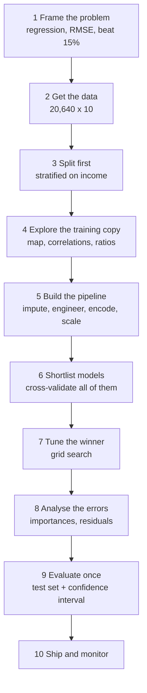

import DataCampExercise from "../../../../components/DataCampExercise.astro";
import Figure from "../../../../components/Figure.astro";
import Quiz from "../../../../components/Quiz.astro";

## What you'll learn

- the complete project as one runnable script, from CSV to a saved model
- how to shortlist models fast, and read the training-versus-CV gap as a diagnosis
- grid search over **preprocessing and model hyperparameters together**
- error analysis: which features mattered, and where the model is still wrong
- how to open the test set once, and report a confidence interval rather than a point
- what to hand over, and what to monitor afterwards

## The whole project



Steps 1 to 5 are the previous six pages. This page runs 6 to 10.

## Recap: getting to a prepared matrix

```python title="preparation.py" showLineNumbers{1}
import numpy as np
import pandas as pd
from sklearn.compose import ColumnTransformer
from sklearn.impute import SimpleImputer
from sklearn.model_selection import StratifiedShuffleSplit
from sklearn.pipeline import Pipeline
from sklearn.preprocessing import OneHotEncoder, StandardScaler

URL = ("https://raw.githubusercontent.com/ageron/handson-ml2/master/"
       "datasets/housing/housing.csv")
housing = pd.read_csv(URL)

# --- 3. Split first, stratified on income -------------------------------
housing["income_cat"] = pd.cut(housing["median_income"],
                               bins=[0.0, 1.5, 3.0, 4.5, 6.0, np.inf],
                               labels=[1, 2, 3, 4, 5])
splitter = StratifiedShuffleSplit(n_splits=1, test_size=0.2, random_state=42)
train_idx, test_idx = next(splitter.split(housing, housing["income_cat"]))
train = housing.iloc[train_idx].drop(columns=["income_cat"])
test = housing.iloc[test_idx].drop(columns=["income_cat"])

X_train = train.drop(columns=["median_house_value"])
y_train = train["median_house_value"]
X_test = test.drop(columns=["median_house_value"])
y_test = test["median_house_value"]

print(len(X_train), len(X_test))        # 16512 4128

# --- 5. One preprocessing object ----------------------------------------
num_attribs = X_train.select_dtypes("number").columns.tolist()
cat_attribs = ["ocean_proximity"]

num_pipeline = Pipeline([
    ("imputer", SimpleImputer(strategy="median")),
    ("scaler", StandardScaler()),
])

preparation = ColumnTransformer([
    ("num", num_pipeline, num_attribs),
    ("cat", OneHotEncoder(handle_unknown="ignore"), cat_attribs),
])
```

The test set now sits untouched until the last section of this page.

### Why `StratifiedShuffleSplit` and not `train_test_split`

The five income categories are not evenly sized — measured over all 20,640 districts they are 3.98%,
31.88%, 35.06%, 17.63% and 11.44%. A plain random 20% test set reproduces those shares only up to
sampling noise, and the smallest category is where the noise bites. Averaged over 200 seeds:

| Split | Mean skew across categories | Mean worst category | Worst seen in 200 seeds |
| --- | --- | --- | --- |
| `train_test_split` | 2.788% | 6.531% | **22.141%** |
| `StratifiedShuffleSplit` | — | 0.365% | 0.365% |

At `random_state=42` specifically, the random split is off by 5.06% on category 4 and 4.32% on
category 5, while the stratified split's largest error is 0.365% — and that residual is only there
because 4,128 rows cannot be divided into exactly 3.9826%.

#### See it move

Each run below draws a fresh 20% test set both ways and compares the resulting category shares
against the population. The bars are signed error: right of centre means the test set
over-represents that income band.

```p5 title="Random versus stratified test sets" desc="Two panels drawing a fresh 20 percent test set from the same 20,640 districts. The random panel's category shares wobble every draw, worst on the smallest category; the stratified panel's bars stay pinned near zero. A running worst-case tally accumulates below." height="400"
const SHARE = [0.039826, 0.318847, 0.350581, 0.176308, 0.114438];
const LABELS = ["cat 1", "cat 2", "cat 3", "cat 4", "cat 5"];
const N = 20640;
const TEST = 4128;
let randErr = [0, 0, 0, 0, 0];
let stratErr = [0, 0, 0, 0, 0];
let worstRand = 0;
let worstStrat = 0;
let draws = 0;
let timer = 0;

function setup() {
  createCanvas(620, 400);
  textFont("monospace");
  drawSample();
}
function drawSample() {
  // random split: multinomial counts in the test set, then the share error
  let remaining = TEST;
  let poolLeft = N;
  const counts = [];
  for (let c = 0; c < 5; c++) {
    // hypergeometric-ish draw, approximated by a binomial on the remaining pool
    const inCat = Math.round(SHARE[c] * N);
    let got = 0;
    for (let t = 0; t < 1; t++) {
      const p = inCat / poolLeft;
      const mean = remaining * p;
      const sd = Math.sqrt(remaining * p * (1 - p));
      got = Math.max(0, Math.round(randomGaussian(mean, sd)));
    }
    got = Math.min(got, remaining);
    counts.push(got);
    remaining -= got;
    poolLeft -= inCat;
  }
  const total = counts.reduce((a, b) => a + b, 0) || 1;
  randErr = counts.map((c, i) => (100 * (c / total - SHARE[i])) / SHARE[i]);

  // stratified split: exact quota per category, so only the rounding remains
  stratErr = SHARE.map((s) => {
    const quota = Math.round(s * TEST);
    return (100 * (quota / TEST - s)) / s;
  });

  worstRand = Math.max(worstRand, Math.max(...randErr.map(Math.abs)));
  worstStrat = Math.max(worstStrat, Math.max(...stratErr.map(Math.abs)));
  draws++;
}
function panel(title, errs, top, col) {
  const mid = 330;
  const scale = 9;
  fill(col[0], col[1], col[2]);
  textSize(12);
  textAlign(LEFT, TOP);
  text(title, 62, top);
  stroke(70, 78, 88);
  strokeWeight(1);
  line(mid, top + 20, mid, top + 20 + 5 * 20);
  for (let c = 0; c < 5; c++) {
    const y = top + 24 + c * 20;
    noStroke();
    fill(140);
    textSize(10);
    textAlign(RIGHT, TOP);
    text(LABELS[c] + "  " + (100 * SHARE[c]).toFixed(2) + "%", mid - 90, y);
    const w = constrain(errs[c] * scale, -100, 130);
    fill(Math.abs(errs[c]) > 3 ? color(232, 122, 122) : col);
    rect(mid, y, w, 11);
    fill(215);
    textAlign(w >= 0 ? LEFT : RIGHT, TOP);
    text((errs[c] >= 0 ? "+" : "") + errs[c].toFixed(2) + "%", mid + w + (w >= 0 ? 6 : -6), y);
    stroke(70, 78, 88);
  }
  noStroke();
}
function draw() {
  background(13, 17, 23);
  fill(215);
  textSize(12);
  textAlign(LEFT, TOP);
  text("share error of a fresh 4,128-row test set   draw #" + draws, 62, 14);

  panel("train_test_split (random)", randErr, 46, [255, 176, 67]);
  panel("StratifiedShuffleSplit", stratErr, 190, [120, 200, 120]);

  fill(255, 176, 67);
  textSize(11);
  textAlign(LEFT, TOP);
  text("worst random error so far:      " + worstRand.toFixed(2) + "%", 62, 330);
  fill(120, 200, 120);
  text("worst stratified error so far:  " + worstStrat.toFixed(2) + "%", 62, 348);
  fill(105);
  textSize(10);
  text("a new draw every second -- click to draw immediately", 62, 374);

  timer += deltaTime;
  if (timer > 1000) { timer = 0; drawSample(); }
}
function mousePressed() { drawSample(); }
```

Leave it running and the amber worst-case keeps climbing while the green one stops at its rounding
floor. Category 1 is the one that moves most, and category 1 is only 822 districts — a test set that
misrepresents it by 20% is a test set that reports a number for a population that does not exist. The
cost of avoiding this is one extra import.

## Shortlisting models

Train several quickly, cross-validate all of them, and compare the training score against the
cross-validated score. That gap is the diagnosis.

```python title="shortlist.py" showLineNumbers{1}
from sklearn.ensemble import RandomForestRegressor
from sklearn.linear_model import LinearRegression
from sklearn.metrics import mean_squared_error
from sklearn.model_selection import cross_val_score
from sklearn.pipeline import make_pipeline
from sklearn.tree import DecisionTreeRegressor

candidates = {
    "linear": LinearRegression(),
    "tree": DecisionTreeRegressor(random_state=42),
    "forest": RandomForestRegressor(n_estimators=80, random_state=42, n_jobs=-1),
}

for name, model in candidates.items():
    pipe = make_pipeline(preparation, model)
    pipe.fit(X_train, y_train)
    train_rmse = mean_squared_error(y_train, pipe.predict(X_train)) ** 0.5
    cv_rmse = -cross_val_score(pipe, X_train, y_train, cv=5,
                               scoring="neg_root_mean_squared_error").mean()
    print(f"{name:<7} train {train_rmse:>10,.0f}   cv {cv_rmse:>10,.0f}")

# linear  train     69,051   cv     69,218
# tree    train          0   cv     70,676
# forest  train     18,476   cv     50,010
```

<Figure
  src="/images/ml/phase-02-preprocessing/end-to-end/model-comparison"
  alt="Grouped bars of training and cross-validated RMSE for linear regression, decision tree and random forest. The tree's training bar is zero while its CV bar is the tallest."
  title="Three models, two numbers each"
  caption="The decision tree's training RMSE is exactly zero and its cross-validated RMSE is the worst of the three. The gap is the whole story."
/>

### Reading the plot

| Model | Train | CV | Gap | Diagnosis |
| --- | --- | --- | --- | --- |
| Linear | 69,051 | 69,218 | 167 | **Underfitting.** No gap at all, and both numbers are high — the model is not flexible enough. |
| Tree | **0** | 70,676 | 70,676 | **Overfitting completely.** Memorised every row, generalises worse than the linear model. |
| Forest | 18,476 | **50,010** | 31,534 | **Overfitting, but useful.** A large gap, and still the best CV score by 28%. |

Three lessons in one table:

1. **A training RMSE of zero is never good news.** The tree has one leaf per district.
2. **No gap is also a warning.** Linear regression cannot overfit here because it cannot fit at all;
   the fix is capacity, not regularisation.
3. **The forest's gap says there is more to gain** from tuning and from more data — which is exactly
   what step 7 tries.

Against the 15% expert baseline (roughly $35,530 RMSE from
[Framing](/machine-learning/phase-02---data-preprocessing--feature-engineering/framing-an-ml-problem--getting-the-data/)),
50,010 is not yet good enough. That is the number tuning has to move.

## Tuning

`GridSearchCV` searches the pipeline, so preprocessing choices and model hyperparameters are tuned
together using the double-underscore path:

```python title="tuning.py" showLineNumbers{1}
from sklearn.model_selection import GridSearchCV
from sklearn.pipeline import Pipeline

pipe = Pipeline([
    ("pre", preparation),
    ("rf", RandomForestRegressor(random_state=42, n_jobs=-1)),
])

param_grid = {
    "rf__n_estimators": [30, 100],
    "rf__max_features": [4, 6, 8],
    # Preprocessing is tunable too:
    # "pre__num__imputer__strategy": ["median", "mean"],
}

search = GridSearchCV(pipe, param_grid, cv=3,
                      scoring="neg_root_mean_squared_error", n_jobs=-1)
search.fit(X_train, y_train)

print("best params:", search.best_params_)
# {'rf__max_features': 8, 'rf__n_estimators': 100}
print(f"best CV RMSE: {-search.best_score_:,.0f}")     # 49,821

for mean, params in sorted(zip(-search.cv_results_["mean_test_score"],
                               search.cv_results_["params"]))[:3]:
    print(f"{mean:,.0f}  {params}")
```

Note that `max_features=8` is the largest value in the grid. **When the best value sits at the edge
of the grid, the grid was too narrow** — extend it and search again. That is a habit worth forming;
it is the most common way a grid search quietly under-delivers.

For large spaces, `RandomizedSearchCV` samples instead of enumerating, and
[RandomizedSearchCV for Large Parameter Spaces](/machine-learning/phase-07---model-optimization--tuning/randomizedsearchcv-for-large-parameter-spaces/)
covers when to prefer it.

## Error analysis

A tuned model is not a finished project. Two questions remain: what did it use, and where is it
still wrong?

<Figure
  src="/images/ml/phase-02-preprocessing/end-to-end/feature-importances"
  alt="Horizontal bar chart of random forest feature importances, with median income at 0.444 far ahead, then INLAND at 0.150, longitude at 0.114 and latitude at 0.103."
  title="What the tuned forest actually used"
  caption="One numeric feature does 44% of the work. The single most useful categorical value is INLAND — and latitude and longitude together contribute more than any other pair."
/>

```python title="importances.py" showLineNumbers{1}
final_model = search.best_estimator_

cat_names = list(final_model.named_steps["pre"]
                 .named_transformers_["cat"].categories_[0])
names = num_attribs + cat_names
importances = final_model.named_steps["rf"].feature_importances_

for name, score in sorted(zip(names, importances), key=lambda p: -p[1]):
    print(f"{name:<22} {score:.4f}")

# median_income          0.4439
# INLAND                 0.1501
# longitude              0.1139
# latitude               0.1025
# housing_median_age     0.0491
# population             0.0385
# total_rooms            0.0298
# total_bedrooms         0.0268
# households             0.0255
# <1H OCEAN              0.0116
# NEAR OCEAN             0.0059
# NEAR BAY               0.0022
# ISLAND                 0.0001
```

Three actions follow directly:

- **Four of the five `ocean_proximity` categories contribute almost nothing.** Collapsing them to a
  single `is_inland` flag would lose about 0.02 of importance and remove four columns.
- **Latitude and longitude together account for 0.216** — more than every count column combined.
  An explicit distance-to-city feature is worth trying.
- **`ISLAND` scores 0.0001**, which is what five rows out of 16,512 buys.

:::caution[Impurity importance is biased toward high-cardinality features]
A continuous column offers thousands of candidate split points; a binary one offers a single split.
The continuous column wins more splits partly for that reason alone. Confirm any ranking you intend
to act on with permutation importance, which measures the actual drop in score when a column is
shuffled.
:::

<Figure
  src="/images/ml/phase-02-preprocessing/end-to-end/residual-analysis"
  alt="Left: predicted against actual house value on the test set, clustering around the diagonal with a dense horizontal band at the top. Right: residuals against predictions, with a clear diagonal edge formed by the capped districts."
  title="Where the final model is still wrong"
  caption="The straight diagonal edge on the right is the $500,001 cap: for those districts the true value is fixed, so the residual is a linear function of the prediction. Real structure, from a data artefact."
/>

### Reading the plot

1. **Predictions compress at both ends.** Cheap districts are over-predicted and expensive ones
   under-predicted — a forest averages leaves, and averages pull toward the middle.
2. **The horizontal band at the top of the left panel** is the capped districts. The model cannot
   predict above roughly $500k because nothing in training ever was.
3. **The diagonal edge in the residuals is that same cap**, seen from another angle: for a fixed
   true value, the residual falls exactly one dollar for every dollar the prediction rises.
4. **Otherwise the residual cloud is shapeless**, which is what you want.

The single most valuable next action on this project is not a better model. It is getting real
labels for the 965 capped districts.

## The test set, once

```python title="final_evaluation.py" showLineNumbers{1}
import numpy as np
from scipy import stats
from sklearn.metrics import mean_squared_error

final_model = search.best_estimator_
final_predictions = final_model.predict(X_test)

final_rmse = mean_squared_error(y_test, final_predictions) ** 0.5
print(f"test RMSE: {final_rmse:,.0f}")            # 46,768

# A point estimate is not enough — report the interval
squared_errors = (final_predictions - y_test) ** 2
interval = np.sqrt(stats.t.interval(
    0.95, len(squared_errors) - 1,
    loc=squared_errors.mean(),
    scale=stats.sem(squared_errors),
))
print(f"95% CI: [{interval[0]:,.0f}, {interval[1]:,.0f}]")
# 95% CI: [44,832, 48,626]
```

**Test RMSE 46,768, with a 95% interval of 44,832 to 48,626.**

Two observations, and both matter:

- **The test score beats the cross-validated score** (46,768 against 49,821). That is fine and not
  unusual — CV trains on four fifths of the data while the final model trained on all of it. Had
  the test score been dramatically *worse*, that would signal overfitting to the CV folds through
  repeated tuning.
- **The interval is roughly ±2,000 wide.** A rival model scoring 46,000 is not meaningfully better,
  and reporting a bare "46,768" invites exactly that false comparison.

:::danger[Do not tune after this point]
The number above is valid because the test set was used exactly once. Adjust a hyperparameter now,
re-evaluate, and it becomes a validation set — with an optimistic score and no honest estimate left.
If you must iterate, hold out a third split from the start.
:::

Against the $35,530 expert baseline the model still loses. The honest report is: *not yet good
enough for the stated objective; the largest single obstacle is the capped target, and the
next-largest is the absence of a distance-to-city feature.*

## Ship it

```python title="ship.py" showLineNumbers{1}
import joblib

# The pipeline saves preprocessing and model together — one artefact, no drift
joblib.dump(final_model, "california_housing_v1.joblib")

loaded = joblib.load("california_housing_v1.joblib")
print(loaded.predict(X_test.iloc[:3]).round(0))     # raw DataFrame in, prices out
```

What to record alongside it:

| Item | Why |
| --- | --- |
| Metric and interval | 46,768 (44,832–48,626) — the number to compare against later |
| Baselines | Mean 115,393; expert 35,530 |
| Known limits | Cannot predict above $500k; California only |
| Feature importances | Tells you which input to monitor most closely |
| Training data snapshot date | So drift can be measured against something |
| Library versions | A pickled model is not portable across versions |

Then monitor: input distributions, prediction distribution, and — as soon as ground truth arrives —
live RMSE against 46,768.
[Monitoring Model Drift](/machine-learning/phase-08---model-deployment-mlops/monitoring-model-drift/)
covers the mechanics.

## Pitfalls

:::danger[Touching the test set more than once]
Every extra look leaks a little information through the decisions it prompts. One evaluation, at
the end, and no tuning afterwards.
:::

:::caution[Reporting a point estimate]
"RMSE 46,768" implies a precision the data does not support. The confidence interval takes three
lines to compute and prevents a great deal of false comparison.
:::

:::caution[Grid search hitting the edge of its grid]
`max_features=8` was the largest value offered, so the true optimum may lie beyond it. Always check
whether the winner sits at a boundary, and widen the grid if it does.
:::

:::caution[Shipping the model without the pipeline]
Save `search.best_estimator_`, not `search.best_estimator_.named_steps["rf"]`. The bare model
expects a 17-column prepared matrix that only the pipeline knows how to build.
:::

<Quiz
  questions={[
    {
      q: "The decision tree scores training RMSE 0 and CV RMSE 70,676, the worst of the three models. What does that mean?",
      options: [
        "The tree is the best model",
        "It memorised the training set completely and generalises worse than plain linear regression",
        "There is a bug in the cross-validation",
        "The tree needs more features",
      ],
      answer: 1,
      explain: "An unpruned tree grows until every leaf is pure, so training error is structurally zero. Only the cross-validated score carries information, and it is the worst of the three.",
    },
    {
      q: "Linear regression scores 69,051 training and 69,218 CV — almost no gap. What is the diagnosis?",
      options: [
        "A perfect model",
        "Underfitting: the model is too rigid to fit the data, so there is nothing to overfit and both errors are high",
        "Overfitting",
        "The data is leaking",
      ],
      answer: 1,
      explain: "A tiny gap with a high error means high bias. Regularisation would make it worse; the fix is more capacity or better features.",
    },
    {
      q: "The grid search picked max_features=8, the largest value in the grid. What should you do?",
      options: [
        "Accept it as the optimum",
        "Widen the grid and search again — a winner at the boundary suggests the true optimum lies outside it",
        "Reduce the number of folds",
        "Switch to a different model",
      ],
      answer: 1,
      explain: "The search only found the best value it was offered. When that is the edge value, the grid was too narrow.",
    },
    {
      q: "Test RMSE is 46,768 with a 95% interval of 44,832 to 48,626. A colleague's model scores 46,100. What can you conclude?",
      options: [
        "Their model is better",
        "The difference sits well inside the interval, so the two are not distinguishable on this test set",
        "Your model is better",
        "You should retune on the test set",
      ],
      answer: 1,
      explain: "46,100 falls comfortably within 44,832 to 48,626. Declaring a winner on a 668-unit difference is reading noise, which is exactly what reporting the interval prevents.",
    },
  ]}
/>

## 🧪 Try It Yourself

### Exercise 1 – Build the preparation pipeline

<DataCampExercise
  lang="python"
  hint={`ColumnTransformer takes (name, transformer, columns) triples.`}
  code={`# Task: Exercise 1 - Build the preparation pipeline
import numpy as np
import pandas as pd
from sklearn.compose import ColumnTransformer
from sklearn.impute import SimpleImputer
from sklearn.pipeline import Pipeline
from sklearn.preprocessing import OneHotEncoder, StandardScaler

URL = ("https://raw.githubusercontent.com/ageron/handson-ml2/master/"
       "datasets/housing/housing.csv")
housing = pd.read_csv(URL)
X = housing.drop(columns=["median_house_value"])

num_attribs = X.select_dtypes("number").columns.tolist()
num_pipeline = Pipeline([
    ("imputer", SimpleImputer(strategy="median")),
    ("scaler", StandardScaler()),
])

prep = ColumnTransformer([
    ("num", num_pipeline, num_attribs),
    ("cat", OneHotEncoder(handle_unknown="ignore"), ["___"]),
])
# replace ___ with ocean_proximity

out = prep.fit_transform(X)
print("numeric columns:", len(num_attribs))
print("prepared shape:", out.shape)

# -- Expected Output -------------------------------------------
# numeric columns: 8
# prepared shape: (20640, 13)
# --------------------------------------------------------------`}
  solution={`import numpy as np
import pandas as pd
from sklearn.compose import ColumnTransformer
from sklearn.impute import SimpleImputer
from sklearn.pipeline import Pipeline
from sklearn.preprocessing import OneHotEncoder, StandardScaler

URL = ("https://raw.githubusercontent.com/ageron/handson-ml2/master/"
       "datasets/housing/housing.csv")
housing = pd.read_csv(URL)
X = housing.drop(columns=["median_house_value"])
num_attribs = X.select_dtypes("number").columns.tolist()
num_pipeline = Pipeline([
    ("imputer", SimpleImputer(strategy="median")),
    ("scaler", StandardScaler()),
])
prep = ColumnTransformer([
    ("num", num_pipeline, num_attribs),
    ("cat", OneHotEncoder(handle_unknown="ignore"), ["ocean_proximity"]),
])
out = prep.fit_transform(X)
print("numeric columns:", len(num_attribs))
print("prepared shape:", out.shape)`}
  sct={`test_output_contains("prepared shape: (20640, 13)")
success_msg("Eight numeric columns plus five one-hot columns.")`}
  height={258}
/>

### Exercise 2 – Read the train-versus-CV gap

<DataCampExercise
  lang="python"
  hint={`Fit for the training score, cross_val_score for the honest one.`}
  code={`# Task: Exercise 2 - Read the train-versus-CV gap
import numpy as np
import pandas as pd
from sklearn.impute import SimpleImputer
from sklearn.metrics import mean_squared_error
from sklearn.model_selection import cross_val_score
from sklearn.pipeline import make_pipeline
from sklearn.tree import DecisionTreeRegressor

URL = ("https://raw.githubusercontent.com/ageron/handson-ml2/master/"
       "datasets/housing/housing.csv")
housing = pd.read_csv(URL)
X = housing.select_dtypes("number").drop(columns=["median_house_value"])
y = housing["median_house_value"]

pipe = make_pipeline(SimpleImputer(strategy="median"),
                     DecisionTreeRegressor(random_state=42))
pipe.fit(X, y)

train_rmse = mean_squared_error(y, pipe.predict(X)) ___ 0.5   # replace ___ with **
cv_rmse = -cross_val_score(pipe, X, y, cv=3,
                           scoring="neg_root_mean_squared_error").mean()

print("train RMSE:", round(train_rmse, 1))
print("CV RMSE:", round(cv_rmse, 0))
print("memorised the training set:", train_rmse < 1)

# -- Expected Output -------------------------------------------
# train RMSE: 0.0
# CV RMSE: 101257.0
# memorised the training set: True
# --------------------------------------------------------------`}
  solution={`import numpy as np
import pandas as pd
from sklearn.impute import SimpleImputer
from sklearn.metrics import mean_squared_error
from sklearn.model_selection import cross_val_score
from sklearn.pipeline import make_pipeline
from sklearn.tree import DecisionTreeRegressor

URL = ("https://raw.githubusercontent.com/ageron/handson-ml2/master/"
       "datasets/housing/housing.csv")
housing = pd.read_csv(URL)
X = housing.select_dtypes("number").drop(columns=["median_house_value"])
y = housing["median_house_value"]
pipe = make_pipeline(SimpleImputer(strategy="median"),
                     DecisionTreeRegressor(random_state=42))
pipe.fit(X, y)
train_rmse = mean_squared_error(y, pipe.predict(X)) ** 0.5
cv_rmse = -cross_val_score(pipe, X, y, cv=3,
                           scoring="neg_root_mean_squared_error").mean()
print("train RMSE:", round(train_rmse, 1))
print("CV RMSE:", round(cv_rmse, 0))
print("memorised the training set:", train_rmse < 1)`}
  sct={`test_output_contains("memorised the training set: True")
success_msg("Zero training error, and the worst held-out score of any model here.")`}
  height={268}
/>

### Exercise 3 – Grid search the pipeline

<DataCampExercise
  lang="python"
  hint={`Parameter names use double underscores to walk into nested steps.`}
  code={`# Task: Exercise 3 - Grid search the pipeline
import pandas as pd
from sklearn.ensemble import RandomForestRegressor
from sklearn.impute import SimpleImputer
from sklearn.model_selection import GridSearchCV
from sklearn.pipeline import Pipeline

URL = ("https://raw.githubusercontent.com/ageron/handson-ml2/master/"
       "datasets/housing/housing.csv")
housing = pd.read_csv(URL).sample(3000, random_state=0)
X = housing.select_dtypes("number").drop(columns=["median_house_value"])
y = housing["median_house_value"]

pipe = Pipeline([
    ("imputer", SimpleImputer(strategy="median")),
    ("rf", RandomForestRegressor(random_state=42, n_jobs=-1)),
])

grid = {"rf__n_estimators": [20, 60], "rf__max_features": [3, 5]}
search = GridSearchCV(pipe, grid, cv=3,
                      scoring="neg_root_mean_squared_error", n_jobs=-1)
search.fit(X, ___)                          # replace ___ with y

print("best params:", search.best_params_)
print("at grid edge:", search.best_params_["rf__max_features"] == 5)

# -- Expected Output -------------------------------------------
# best params: {'rf__max_features': 5, 'rf__n_estimators': 60}
# at grid edge: True
# --------------------------------------------------------------`}
  solution={`import pandas as pd
from sklearn.ensemble import RandomForestRegressor
from sklearn.impute import SimpleImputer
from sklearn.model_selection import GridSearchCV
from sklearn.pipeline import Pipeline

URL = ("https://raw.githubusercontent.com/ageron/handson-ml2/master/"
       "datasets/housing/housing.csv")
housing = pd.read_csv(URL).sample(3000, random_state=0)
X = housing.select_dtypes("number").drop(columns=["median_house_value"])
y = housing["median_house_value"]
pipe = Pipeline([
    ("imputer", SimpleImputer(strategy="median")),
    ("rf", RandomForestRegressor(random_state=42, n_jobs=-1)),
])
grid = {"rf__n_estimators": [20, 60], "rf__max_features": [3, 5]}
search = GridSearchCV(pipe, grid, cv=3,
                      scoring="neg_root_mean_squared_error", n_jobs=-1)
search.fit(X, y)
print("best params:", search.best_params_)
print("at grid edge:", search.best_params_["rf__max_features"] == 5)`}
  sct={`test_output_contains("at grid edge: True")
success_msg("The winner sits on the boundary — widen the grid and search again.")`}
  height={278}
/>

### Exercise 4 – Report a confidence interval

<DataCampExercise
  lang="python"
  hint={`Build the interval on the squared errors, then take the square root of both ends.`}
  code={`# Task: Exercise 4 - Report a confidence interval
import numpy as np
from scipy import stats

rng = np.random.default_rng(0)
actual = rng.normal(200000, 100000, 4128)
predicted = actual + rng.normal(0, 46000, 4128)

squared_errors = (predicted - actual) ** 2
rmse = np.sqrt(squared_errors.mean())

interval = np.sqrt(stats.t.interval(
    0.95, len(squared_errors) - 1,
    loc=squared_errors.mean(),
    scale=stats.___(squared_errors),        # replace ___ with sem
))

print("RMSE:", round(float(rmse), 0))
print("95% CI:", [round(float(v), 0) for v in interval])
print("interval width:", round(float(interval[1] - interval[0]), 0))

# -- Expected Output -------------------------------------------
# RMSE: 46237.0
# 95% CI: [45241.0, 47211.0]
# interval width: 1970.0
# --------------------------------------------------------------`}
  solution={`import numpy as np
from scipy import stats

rng = np.random.default_rng(0)
actual = rng.normal(200000, 100000, 4128)
predicted = actual + rng.normal(0, 46000, 4128)
squared_errors = (predicted - actual) ** 2
rmse = np.sqrt(squared_errors.mean())
interval = np.sqrt(stats.t.interval(
    0.95, len(squared_errors) - 1,
    loc=squared_errors.mean(),
    scale=stats.sem(squared_errors),
))
print("RMSE:", round(float(rmse), 0))
print("95% CI:", [round(float(v), 0) for v in interval])
print("interval width:", round(float(interval[1] - interval[0]), 0))`}
  sct={`test_output_contains("interval width")
success_msg("A two-thousand-wide interval means a 668-unit difference between models is noise.")`}
  height={248}
/>

### Exercise 5 – Save and reload the whole pipeline

<DataCampExercise
  lang="python"
  hint={`joblib.dump saves the fitted object; joblib.load restores it.`}
  code={`# Task: Exercise 5 - Save and reload the whole pipeline
import joblib
import numpy as np
import pandas as pd
from sklearn.ensemble import RandomForestRegressor
from sklearn.impute import SimpleImputer
from sklearn.pipeline import make_pipeline

URL = ("https://raw.githubusercontent.com/ageron/handson-ml2/master/"
       "datasets/housing/housing.csv")
housing = pd.read_csv(URL).sample(2000, random_state=0)
X = housing.select_dtypes("number").drop(columns=["median_house_value"])
y = housing["median_house_value"]

model = make_pipeline(SimpleImputer(strategy="median"),
                      RandomForestRegressor(n_estimators=30, random_state=42))
model.fit(X, y)

joblib.dump(model, "housing_model.joblib")
loaded = joblib.___("housing_model.joblib")     # replace ___ with load

same = np.allclose(model.predict(X[:5]), loaded.predict(X[:5]))
print("predictions identical:", bool(same))
print("preprocessing travelled with it:", len(loaded.steps))

# -- Expected Output -------------------------------------------
# predictions identical: True
# preprocessing travelled with it: 2
# --------------------------------------------------------------`}
  solution={`import joblib
import numpy as np
import pandas as pd
from sklearn.ensemble import RandomForestRegressor
from sklearn.impute import SimpleImputer
from sklearn.pipeline import make_pipeline

URL = ("https://raw.githubusercontent.com/ageron/handson-ml2/master/"
       "datasets/housing/housing.csv")
housing = pd.read_csv(URL).sample(2000, random_state=0)
X = housing.select_dtypes("number").drop(columns=["median_house_value"])
y = housing["median_house_value"]
model = make_pipeline(SimpleImputer(strategy="median"),
                      RandomForestRegressor(n_estimators=30, random_state=42))
model.fit(X, y)
joblib.dump(model, "housing_model.joblib")
loaded = joblib.load("housing_model.joblib")
same = np.allclose(model.predict(X[:5]), loaded.predict(X[:5]))
print("predictions identical:", bool(same))
print("preprocessing travelled with it:", len(loaded.steps))`}
  sct={`test_output_contains("predictions identical: True")
success_msg("One artefact: imputer and model together, with no second script to keep in sync.")`}
  height={268}
/>

## Recap

- Ten steps, and the first five are the rest of this phase. This page ran shortlist, tune, analyse,
  evaluate, ship.
- Shortlist by comparing training against cross-validated error: linear 69,051 / 69,218
  (underfitting), tree 0 / 70,676 (memorising), forest 18,476 / 50,010 (best, still overfitting).
- Grid search reached CV RMSE 49,821 at `max_features=8` — the edge of the grid, so the grid was
  too narrow.
- Importances: `median_income` 0.444, `INLAND` 0.150, longitude and latitude 0.216 together. Four
  of five categories are near-worthless.
- Test RMSE **46,768**, 95% interval **44,832 to 48,626** — one look, no tuning afterwards.
- Still short of the $35,530 expert baseline. The biggest single obstacle is the capped target, not
  the model.
- Save the whole pipeline, record the baselines and limits, and monitor drift.

### Exercise 6 – Simulate the split you did not use

<DataCampExercise
  lang="python"
  hint={`A random test set draws category counts from a multinomial; a stratified one takes a fixed quota per category, so its only error is rounding.`}
  code={`# Task: Exercise 6 - Simulate the split you did not use
import numpy as np

# the five income categories' real shares over all 20,640 districts
shares = np.array([0.039826, 0.318847, 0.350581, 0.176308, 0.114438])
population = 20640
test_size = 4128
rng = np.random.default_rng(0)

random_worst, stratified_worst = [], []
for _ in range(200):
    counts = rng.___(test_size, shares)        # replace ___ with multinomial
    random_worst.append(np.abs(counts / test_size / shares - 1).max())
    quota = np.round(shares * test_size)
    stratified_worst.append(np.abs(quota / test_size / shares - 1).max())

print(f"random split     mean worst-category error {100 * np.mean(random_worst):.2f}%"
      f"   worst seen {100 * np.max(random_worst):.2f}%")
print(f"stratified split mean worst-category error "
      f"{100 * np.mean(stratified_worst):.2f}%"
      f"   worst seen {100 * np.max(stratified_worst):.2f}%")
print(f"category 1 is only {int(round(shares[0] * population))} districts, "
      f"which is why it moves most")

# -- Expected Output -------------------------------------------
# random split     mean worst-category error 7.63%   worst seen 20.32%
# stratified split mean worst-category error 0.24%   worst seen 0.24%
# category 1 is only 822 districts, which is why it moves most
# --------------------------------------------------------------`}
  solution={`import numpy as np

shares = np.array([0.039826, 0.318847, 0.350581, 0.176308, 0.114438])
population = 20640
test_size = 4128
rng = np.random.default_rng(0)

random_worst, stratified_worst = [], []
for _ in range(200):
    counts = rng.multinomial(test_size, shares)
    random_worst.append(np.abs(counts / test_size / shares - 1).max())
    quota = np.round(shares * test_size)
    stratified_worst.append(np.abs(quota / test_size / shares - 1).max())

print(f"random split     mean worst-category error {100 * np.mean(random_worst):.2f}%"
      f"   worst seen {100 * np.max(random_worst):.2f}%")
print(f"stratified split mean worst-category error "
      f"{100 * np.mean(stratified_worst):.2f}%"
      f"   worst seen {100 * np.max(stratified_worst):.2f}%")
print(f"category 1 is only {int(round(shares[0] * population))} districts, "
      f"which is why it moves most")`}
  sct={`test_output_contains("0.24%")
success_msg("7.63% against 0.24%, and a worst case of 20.32% on the smallest category. The stratified error is pure rounding — 4,128 rows cannot be divided into 3.9826% exactly — and it does not grow.")`}
  height={310}
/>

## Next

Phase 2 ends here. Continue to
[Phase 3 - Supervised Learning - Regression](/machine-learning/phase-03---supervised-learning---regression/phase-3---supervised-learning---regression/)
— the models used on this page as black boxes, derived from first principles.
