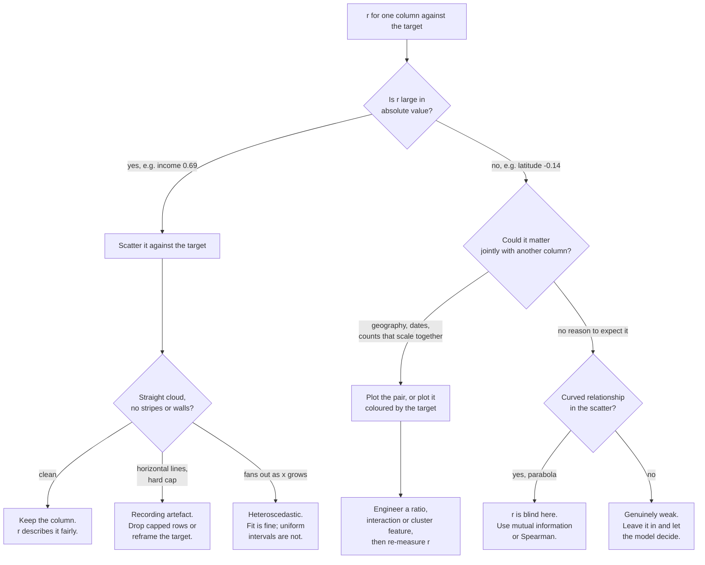

import DataCampExercise from "../../../../components/DataCampExercise.astro";
import Figure from "../../../../components/Figure.astro";
import Quiz from "../../../../components/Quiz.astro";

## What you'll learn

- why you explore a **copy of the training set** and nothing else
- the Pearson correlation formula, computed **by hand** on five points
- the two things correlation is blind to, and the plot that exposes both
- how to spot data-quality artefacts that a summary statistic hides completely
- three engineered ratios, two of which outrank every raw count in the dataset
- the difference between a feature that correlates and a feature that helps

## Intuition

The test set is locked away, so now you can be as aggressive as you like — but on a **copy**, so
that experiments do not damage the training data itself.

Exploration has one goal: find the structure a model can use, and the defects that will mislead it.
Both of those live in plots more often than in statistics. `describe()` cannot tell you that two
columns are latitude and longitude; a scatter plot draws California in three seconds.

```python title="explore_a_copy.py" showLineNumbers{1}
housing = strat_train_set.copy()      # never explore the original, never touch the test set
```

## The math: Pearson correlation

$$
r_{xy} = \frac{\operatorname{Cov}(x, y)}{\sigma_x \sigma_y}
= \frac{\sum_{i}(x_i - \bar{x})(y_i - \bar{y})}
       {\sqrt{\sum_{i}(x_i - \bar{x})^2}\sqrt{\sum_{i}(y_i - \bar{y})^2}}
$$

The numerator is the covariance — how the two vary together. The denominator normalises it by both
spreads, so $r$ is dimensionless and confined to $[-1, +1]$. Because it is scale-free, the
correlation between income and price is unchanged whether price is in dollars or thousands.

$r$ measures exactly one thing: **the strength of a linear relationship.** That precision is what
makes it useful and what makes it dangerous.

:::note[Where this comes from]
Covariance, variance and the correlation coefficient are developed in
[Summary Statistics and Independence](/mathematics-for-machine-learning/chapter-06---probability-and-distributions/summary-statistics-and-independence/).
Note the link to Phase 3: the least-squares slope is $\operatorname{Cov}(x,y)/\operatorname{Var}(x)$,
so $r$ is that slope rescaled by the ratio of the two standard deviations.
:::

## Worked example by hand

Five districts. Income $x$ in tens of thousands, value $y$ in hundreds of thousands.

| $i$ | $x_i$ | $y_i$ | $x_i - \bar{x}$ | $y_i - \bar{y}$ | product | $(x-\bar{x})^2$ | $(y-\bar{y})^2$ |
| --- | --- | --- | --- | --- | --- | --- | --- |
| 1 | 2 | 1 | −2 | −2 | 4 | 4 | 4 |
| 2 | 3 | 2 | −1 | −1 | 1 | 1 | 1 |
| 3 | 4 | 4 | 0 | +1 | 0 | 0 | 1 |
| 4 | 5 | 4 | +1 | +1 | 1 | 1 | 1 |
| 5 | 6 | 4 | +2 | +1 | 2 | 4 | 1 |
| | $\bar{x}=4$ | $\bar{y}=3$ | | | **8** | **10** | **8** |

$$
r = \frac{8}{\sqrt{10}\sqrt{8}} = \frac{8}{8.9443} \approx 0.8944
$$

A strong positive linear relationship. Note what the arithmetic did: it never looked at the *shape*
of the relationship, only at whether $x$ and $y$ deviate from their means in the same direction.

**And $r^2 = 0.80$.** For a simple linear regression of $y$ on $x$, the squared correlation is
exactly the $R^2$ from
[Metrics R-Squared](/machine-learning/phase-03---supervised-learning---regression/metrics-r-squared-and-adjusted-r-squared/).
Two chapters, one number.

## Geography for free

```python title="geographic.py" showLineNumbers{1}
housing.plot(
    kind="scatter", x="longitude", y="latitude", alpha=0.4,
    s=housing["population"] / 100, label="population",
    c="median_house_value", cmap="jet", colorbar=True, figsize=(10, 7),
)
```

<Figure
  src="/images/ml/phase-02-preprocessing/eda-correlations/geographic-scatter"
  alt="Scatter of longitude against latitude for 20,640 districts, forming the recognisable shape of California. Point size follows population and colour follows house value, with expensive districts concentrated along the coast."
  title="Two unlabelled numeric columns, plotted against each other"
  caption="Nothing told the plot this was a map. Price clearly follows the coastline and clusters around the Bay Area and Los Angeles — a feature no single column contains."
/>

### Reading the plot

1. **Price follows the coast.** Density and coastal proximity together explain far more than either
   alone — which is why `ocean_proximity`, the text column, turns out to matter.
2. **Two bright clusters** are the Bay Area and greater Los Angeles. A `distance_to_nearest_city`
   feature is visible here and available nowhere in the raw columns.
3. **The interior is uniformly cheap.** That is the `INLAND` category, and it becomes the second
   most important feature in the final model.
4. **Point size shows population**, and the largest circles sit in the bright clusters. Correlated
   predictors, which matters when interpreting coefficients later.

## What correlation cannot see

```python title="correlations.py" showLineNumbers{1}
corr = housing.select_dtypes("number").corr()
print(corr["median_house_value"].sort_values(ascending=False).round(4).to_string())

# median_house_value    1.0000
# median_income         0.6881
# total_rooms           0.1342
# housing_median_age    0.1056
# households            0.0658
# total_bedrooms        0.0497
# population           -0.0246
# longitude            -0.0460
# latitude             -0.1442
```

<Figure
  src="/images/ml/phase-02-preprocessing/eda-correlations/correlation-heatmap"
  alt="A nine by nine correlation heatmap of the numeric housing columns, ordered by correlation with median house value. One strong positive cell at 0.69 and a block of near-1.0 correlations among total rooms, total bedrooms, population and households."
  title="The full numeric correlation matrix"
  caption="Only median income correlates strongly with price. The bright block in the middle is four count columns that are all essentially 'how big is this district' — correlations above 0.85 among themselves."
/>

Two blind spots matter here:

**It only sees straight lines.** A perfect parabola $y = x^2$ over symmetric $x$ has $r = 0$.
Correlation zero does not mean "no relationship", it means "no *linear* relationship".

**It only sees pairs.** Latitude scores −0.14 and longitude −0.05, both apparently useless. The
map above shows they are jointly among the strongest signals in the dataset. No pairwise statistic
can find that, and in the final model latitude and longitude are the third and fourth most
important features.

<Figure
  src="/images/ml/phase-02-preprocessing/eda-correlations/income-vs-value"
  alt="Dense scatter of median income against median house value showing a clear upward trend, a hard horizontal line of points at 500,001 dollars, and fainter horizontal lines at roughly 450,000, 350,000 and 280,000."
  title="The strongest relationship, at full resolution"
  caption="The trend is real. So are four horizontal lines of points, which are artefacts of how the values were recorded — and which a model will happily learn to reproduce."
/>

### Reading the plot

- **The upward trend is genuine**, and $r = 0.69$ describes it fairly.
- **The line at $500{,}001$** is the cap: 965 districts.
- **Three fainter lines near 450k, 350k and 280k** are also artefacts. Nobody documented these; only
  the scatter reveals them.
- **The cloud fans out** as income rises — heteroscedasticity, which does not bias the fit but does
  make uniform confidence intervals wrong.

A model trained on this data will reproduce those horizontal lines, because they are in the labels.
Removing the capped districts is the honest fix, and it changes what the model is for.

## What to do with a correlation number

A coefficient on its own is never an instruction. The number tells you which plot to draw next, and
the plot tells you what to do:



Every branch that ends in an action starts with a plot. That is the whole argument for EDA: the
coefficient is a routing decision, not a conclusion.

## See it move

The cloud below rotates and tightens while $r$ is recomputed live. Watch what happens when the
relationship becomes a parabola: the points are perfectly determined and $r$ collapses to zero.

```p5 title="What correlation can and cannot see" desc="A point cloud cycles through positive, negative, uncorrelated and parabolic relationships while the Pearson coefficient is recomputed. The parabola is deterministic and still scores about zero." height="330"
let pts = [];
let mode = 0, t = 0;
const LABELS = ["strong positive", "strong negative", "no relationship", "perfect parabola"];
function genPts() {
  pts = [];
  for (let i = 0; i < 120; i++) {
    const x = random(-3, 3);
    let y;
    if (mode === 0) y = 0.9 * x + randomGaussian(0, 0.6);
    else if (mode === 1) y = -0.9 * x + randomGaussian(0, 0.6);
    else if (mode === 2) y = randomGaussian(0, 1.4);
    else y = 0.55 * x * x - 1.6;
    pts.push({ x, y });
  }
}
function setup() {
  createCanvas(600, 330);
  textFont("monospace");
  genPts();
}
function pearson() {
  const n = pts.length;
  const mx = pts.reduce((s, p) => s + p.x, 0) / n;
  const my = pts.reduce((s, p) => s + p.y, 0) / n;
  let num = 0, dx = 0, dy = 0;
  for (const p of pts) {
    num += (p.x - mx) * (p.y - my);
    dx += (p.x - mx) ** 2;
    dy += (p.y - my) ** 2;
  }
  return num / (Math.sqrt(dx) * Math.sqrt(dy) || 1);
}
function draw() {
  background(13, 17, 23);
  t++;
  if (t % 170 === 0) { mode = (mode + 1) % 4; genPts(); }

  const padX = 60, padY = 56, gw = width - padX - 40, gh = height - padY - 56;
  const sx = (x) => padX + (x + 3.4) / 6.8 * gw;
  const sy = (y) => padY + gh - (y + 4) / 8 * gh;

  stroke(60, 70, 84);
  strokeWeight(1);
  line(padX, sy(0), padX + gw, sy(0));
  line(sx(0), padY, sx(0), padY + gh);

  noStroke();
  for (const p of pts) {
    fill(75, 139, 190, 200);
    ellipse(sx(p.x), sy(constrain(p.y, -4, 4)), 7);
  }

  const r = pearson();
  fill(107, 169, 221);
  textSize(14);
  textAlign(LEFT, TOP);
  text("r = " + r.toFixed(3), 20, 16);
  fill(200);
  textSize(12);
  textAlign(RIGHT, TOP);
  text(LABELS[mode], width - 20, 18);

  if (mode === 3) {
    fill(255, 211, 67);
    textSize(11);
    textAlign(CENTER, BOTTOM);
    text("y is exactly determined by x — and r is still about zero", width / 2, height - 14);
  } else {
    fill(140);
    textSize(11);
    textAlign(CENTER, BOTTOM);
    text("click for a fresh sample", width / 2, height - 14);
  }
}
function mousePressed() { genPts(); }
```

## Engineering features

Raw counts in this dataset are nearly meaningless: `total_rooms` mostly measures how large a
district is, not how desirable. Ratios fix that by dividing out district size.

```python title="engineered.py" showLineNumbers{1}
housing["rooms_per_household"] = housing["total_rooms"] / housing["households"]
housing["bedrooms_per_room"] = housing["total_bedrooms"] / housing["total_rooms"]
housing["population_per_household"] = housing["population"] / housing["households"]

corr = housing.select_dtypes("number").corr()
print(corr["median_house_value"].sort_values(ascending=False).round(4).to_string())

# median_house_value          1.0000
# median_income               0.6881
# rooms_per_household         0.1519
# total_rooms                 0.1342
# housing_median_age          0.1056
# households                  0.0658
# total_bedrooms              0.0497
# population_per_household   -0.0237
# population                 -0.0246
# longitude                  -0.0460
# latitude                   -0.1442
# bedrooms_per_room          -0.2559
```

<Figure
  src="/images/ml/phase-02-preprocessing/eda-correlations/engineered-features"
  alt="Horizontal bar chart of every feature's correlation with median house value, with three engineered ratios highlighted in amber. bedrooms_per_room at -0.256 is the second strongest overall."
  title="Three new columns, from division"
  caption="bedrooms_per_room reaches -0.256, stronger than any raw count and second only to median income. rooms_per_household at 0.152 beats total_rooms at 0.134."
/>

**`bedrooms_per_room` is the win.** A low ratio means larger, more expensive homes — the raw
`total_bedrooms` correlation of 0.05 was measuring district size and hiding this entirely. Two
columns that individually say almost nothing produce, on division, the second-strongest signal in
the dataset.

This is what feature engineering is: not more data, but the same data in a form that exposes the
relationship.

:::tip[Correlating is not the same as helping]
`rooms_per_household` correlates only 0.15, which looks unimpressive. It may still improve a
tree-based model, because trees exploit interactions that pairwise correlation cannot see. Judge
features by cross-validated model performance, not by their correlation column.
:::

## Pitfalls

:::danger[Exploring the test set]
Everything on this page runs on `strat_train_set.copy()`. Producing this correlation table from the
full dataset means every feature you engineer from it was informed by test rows.
:::

:::caution[Reading zero correlation as no relationship]
Correlation measures linearity only. Always plot the pair before concluding a feature is useless —
a U-shape, a threshold effect and a perfect parabola all score near zero.
:::

:::caution[Trusting a correlation computed over outliers]
Pearson $r$ is not robust. A handful of extreme points can create or destroy an apparent
relationship. Compare against Spearman rank correlation, which uses only ordering, when outliers
are present.
:::

:::caution[Engineering ratios with zero denominators]
`total_rooms / households` breaks when a district reports zero households. Check for zeros and
infinities after every division — `np.isinf(df).sum()` takes one line and catches it before the
model does.
:::

<Quiz
  questions={[
    {
      q: "A feature has correlation 0.00 with the target. What can you conclude?",
      options: [
        "The feature is useless and should be dropped",
        "There is no linear relationship — a curved or threshold relationship may still be strong",
        "The feature is perfectly independent of the target",
        "The data is corrupted",
      ],
      answer: 1,
      explain: "Pearson r measures linear association only. A perfect parabola over symmetric x scores exactly zero while being fully deterministic.",
    },
    {
      q: "Latitude scores -0.14 and longitude -0.05 against price, yet both are among the most important features in the final model. Why?",
      options: [
        "The correlations were computed incorrectly",
        "Correlation is pairwise; the signal lives in the interaction between the two, which is visible on a map and invisible to any single-column statistic",
        "The model is overfitting to them",
        "Tree models ignore correlation entirely",
      ],
      answer: 1,
      explain: "Neither coordinate alone predicts price. Together they specify a location, and location is what determines price. No pairwise measure can express that.",
    },
    {
      q: "bedrooms_per_room correlates -0.256 while its two source columns manage 0.05 and 0.13. What happened?",
      options: [
        "A calculation error",
        "Dividing out district size turned two size measurements into a measure of home layout, which is what actually relates to price",
        "The ratio introduced leakage",
        "Correlations always increase when you divide columns",
      ],
      answer: 1,
      explain: "Both raw columns mostly measure how big a district is. Their ratio cancels that out and exposes a property of the housing stock itself.",
    },
    {
      q: "Why explore a copy of the training set rather than the training set itself?",
      options: [
        "It runs faster",
        "So that experimental transformations — dropped rows, new columns, imputed values — cannot corrupt the data you will actually train on",
        "It is required by pandas",
        "To save memory",
      ],
      answer: 1,
      explain: "Exploration involves destructive experiments. A copy means you can be reckless without a silent mutation surviving into training.",
    },
  ]}
/>

## 🧪 Try It Yourself

### Exercise 1 – Correlation by hand

<DataCampExercise
  lang="python"
  hint={`Divide the covariance sum by the product of the two square-rooted sums of squares.`}
  code={`# Task: Exercise 1 - Correlation by hand
import numpy as np

x = np.array([2.0, 3, 4, 5, 6])
y = np.array([1.0, 2, 4, 4, 4])

dx = x - x.mean()
dy = y - y.mean()

r = (dx * dy).sum() / (np.sqrt((dx ** 2).sum()) * np.sqrt((dy ___ 2).sum()))
# replace ___ with **

print("r:", round(float(r), 4))
print("r squared:", round(float(r ** 2), 4))
print("numpy agrees:", round(float(np.corrcoef(x, y)[0, 1]), 4))

# -- Expected Output -------------------------------------------
# r: 0.8944
# r squared: 0.8
# numpy agrees: 0.8944
# --------------------------------------------------------------`}
  solution={`import numpy as np

x = np.array([2.0, 3, 4, 5, 6])
y = np.array([1.0, 2, 4, 4, 4])
dx = x - x.mean()
dy = y - y.mean()
r = (dx * dy).sum() / (np.sqrt((dx ** 2).sum()) * np.sqrt((dy ** 2).sum()))
print("r:", round(float(r), 4))
print("r squared:", round(float(r ** 2), 4))
print("numpy agrees:", round(float(np.corrcoef(x, y)[0, 1]), 4))`}
  sct={`test_output_contains("r: 0.8944")
success_msg("And r squared is exactly the R-squared of a simple linear regression of y on x.")`}
  height={198}
/>

### Exercise 2 – Sort correlations against the target

<DataCampExercise
  lang="python"
  hint={`corr() returns the full matrix; take the target column and sort it.`}
  code={`# Task: Exercise 2 - Sort correlations against the target
import pandas as pd

URL = ("https://raw.githubusercontent.com/ageron/handson-ml2/master/"
       "datasets/housing/housing.csv")
housing = pd.read_csv(URL)

corr = housing.select_dtypes("number").___()      # replace ___ with corr
ranked = corr["median_house_value"].sort_values(ascending=False)
print(ranked.round(4).head(4).to_string())

# -- Expected Output -------------------------------------------
# median_house_value    1.0000
# median_income         0.6881
# total_rooms           0.1342
# housing_median_age    0.1056
# --------------------------------------------------------------`}
  solution={`import pandas as pd

URL = ("https://raw.githubusercontent.com/ageron/handson-ml2/master/"
       "datasets/housing/housing.csv")
housing = pd.read_csv(URL)
corr = housing.select_dtypes("number").corr()
ranked = corr["median_house_value"].sort_values(ascending=False)
print(ranked.round(4).head(4).to_string())`}
  sct={`test_output_contains("median_income         0.6881")
success_msg("One strong predictor, and a long tail of weak ones.")`}
  height={198}
/>

### Exercise 3 – Engineer the winning ratio

<DataCampExercise
  lang="python"
  hint={`Divide total_bedrooms by total_rooms, then recompute the correlation.`}
  code={`# Task: Exercise 3 - Engineer the winning ratio
import pandas as pd

URL = ("https://raw.githubusercontent.com/ageron/handson-ml2/master/"
       "datasets/housing/housing.csv")
housing = pd.read_csv(URL)

housing["bedrooms_per_room"] = housing["total_bedrooms"] / housing["___"]
# replace ___ with total_rooms

corr = housing.select_dtypes("number").corr()["median_house_value"]
print("total_bedrooms:", round(corr["total_bedrooms"], 4))
print("total_rooms:", round(corr["total_rooms"], 4))
print("bedrooms_per_room:", round(corr["bedrooms_per_room"], 4))

# -- Expected Output -------------------------------------------
# total_bedrooms: 0.0497
# total_rooms: 0.1342
# bedrooms_per_room: -0.2559
# --------------------------------------------------------------`}
  solution={`import pandas as pd

URL = ("https://raw.githubusercontent.com/ageron/handson-ml2/master/"
       "datasets/housing/housing.csv")
housing = pd.read_csv(URL)
housing["bedrooms_per_room"] = housing["total_bedrooms"] / housing["total_rooms"]
corr = housing.select_dtypes("number").corr()["median_house_value"]
print("total_bedrooms:", round(corr["total_bedrooms"], 4))
print("total_rooms:", round(corr["total_rooms"], 4))
print("bedrooms_per_room:", round(corr["bedrooms_per_room"], 4))`}
  sct={`test_output_contains("bedrooms_per_room: -0.2559")
success_msg("Two weak columns, one division, the second-strongest signal in the dataset.")`}
  height={208}
/>

### Exercise 4 – Correlation is blind to curves

<DataCampExercise
  lang="python"
  hint={`Build a perfect parabola over symmetric x and correlate it with x.`}
  code={`# Task: Exercise 4 - Correlation is blind to curves
import numpy as np

x = np.linspace(-5, 5, 101)
y_linear = 3 * x + 2
y_parabola = x ___ 2               # replace ___ with **

print("linear r:", round(float(np.corrcoef(x, y_linear)[0, 1]), 4))
print("parabola r:", round(float(np.corrcoef(x, y_parabola)[0, 1]), 4))
print("parabola is deterministic:", bool(np.allclose(y_parabola, x ** 2)))

# -- Expected Output -------------------------------------------
# linear r: 1.0
# parabola r: 0.0
# parabola is deterministic: True
# --------------------------------------------------------------`}
  solution={`import numpy as np

x = np.linspace(-5, 5, 101)
y_linear = 3 * x + 2
y_parabola = x ** 2
print("linear r:", round(float(np.corrcoef(x, y_linear)[0, 1]), 4))
print("parabola r:", round(float(np.corrcoef(x, y_parabola)[0, 1]), 4))
print("parabola is deterministic:", bool(np.allclose(y_parabola, x ** 2)))`}
  sct={`test_output_contains("parabola r: 0.0")
success_msg("Zero correlation, perfect relationship. Always plot before dropping a feature.")`}
  height={198}
/>

### Exercise 5 – Find the recording artefacts

<DataCampExercise
  lang="python"
  hint={`Count how often each distinct target value appears, and look at the top few.`}
  code={`# Task: Exercise 5 - Find the recording artefacts
import pandas as pd

URL = ("https://raw.githubusercontent.com/ageron/handson-ml2/master/"
       "datasets/housing/housing.csv")
housing = pd.read_csv(URL)

repeats = housing["median_house_value"].value_counts().___(5)
# replace ___ with head

print(repeats.to_string())

# -- Expected Output -------------------------------------------
# median_house_value
# 500001.0    965
# 137500.0    122
# 162500.0    117
# 112500.0    103
# 187500.0     93
# --------------------------------------------------------------`}
  solution={`import pandas as pd

URL = ("https://raw.githubusercontent.com/ageron/handson-ml2/master/"
       "datasets/housing/housing.csv")
housing = pd.read_csv(URL)
repeats = housing["median_house_value"].value_counts().head(5)
print(repeats.to_string())`}
  sct={`test_output_contains("500001.0    965")
success_msg("965 districts at one exact value, and four more suspiciously round repeats behind it.")`}
  height={198}
/>

## Recap

- Explore a copy of the training set. The test set stays closed.
- $r = \operatorname{Cov}(x,y) / (\sigma_x\sigma_y)$, dimensionless and bounded by $\pm 1$; worked
  by hand it gives 0.8944, and $r^2 = 0.80$ is the simple-regression $R^2$.
- Correlation sees only straight lines and only pairs. Latitude and longitude prove both
  limitations at once.
- Plotting two unlabelled columns drew a map, and the map showed that price follows the coast.
- The income scatter exposes a hard cap at $500,001 and three fainter recording artefacts.
- Three ratios: `bedrooms_per_room` reaches −0.256, second only to income and stronger than every
  raw count.

### Exercise 6 – The coefficient that sees curves, and the one that does not

<DataCampExercise
  lang="python"
  hint={`spearmanr ranks the values before correlating them, so it detects any monotone relationship — but ranking does not help with a parabola.`}
  code={`# Task: Exercise 6 - The coefficient that sees curves, and the one that does not
import numpy as np
from scipy.stats import pearsonr, spearmanr

x = np.linspace(-3, 3, 61)
relationships = {
    "straight line": 2 * x + 1,
    "monotone curve": x ** 3,
    "parabola": x ** 2,
}
for name, y in relationships.items():
    pearson = pearsonr(x, y)[0]
    spearman = ___(x, y)[0]              # replace ___ with spearmanr
    print(f"{name:15s} pearson {pearson:+.4f}   spearman {spearman:+.4f}")
print("a parabola is perfectly determined and scores 0 on both:")
print("  neither coefficient detects a non-monotone relationship")

# -- Expected Output -------------------------------------------
# straight line   pearson +1.0000   spearman +1.0000
# monotone curve  pearson +0.9167   spearman +1.0000
# parabola        pearson +0.0000   spearman +0.0158
# a parabola is perfectly determined and scores 0 on both:
#   neither coefficient detects a non-monotone relationship
# --------------------------------------------------------------`}
  solution={`import numpy as np
from scipy.stats import pearsonr, spearmanr

x = np.linspace(-3, 3, 61)
relationships = {
    "straight line": 2 * x + 1,
    "monotone curve": x ** 3,
    "parabola": x ** 2,
}
for name, y in relationships.items():
    pearson = pearsonr(x, y)[0]
    spearman = spearmanr(x, y)[0]
    print(f"{name:15s} pearson {pearson:+.4f}   spearman {spearman:+.4f}")
print("a parabola is perfectly determined and scores 0 on both:")
print("  neither coefficient detects a non-monotone relationship")`}
  sct={`test_output_contains("spearman +1.0000")
success_msg("Spearman rescues the cube (0.9167 to 1.0000) and does nothing for the parabola. For non-monotone relationships you need mutual information or a plot — which is why the flow chart above routes every branch through a scatter.")`}
  height={270}
/>

## Next

Continue to
[Data Cleaning & Handling Missing Values](/machine-learning/phase-02---data-preprocessing--feature-engineering/data-cleaning--handling-missing-values/)
— deal with the 207 holes in `total_bedrooms`, and measure whether the choice of strategy actually
changes anything.
