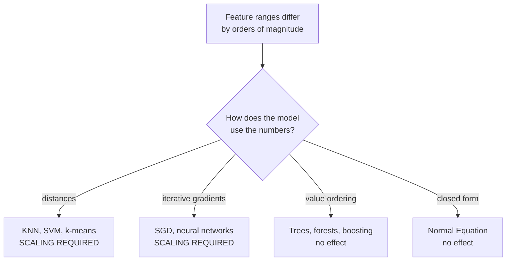

## What you'll learn

- the three scaler formulas, each computed **by hand** on the same five numbers
- which models are destroyed by unscaled features, which are indifferent, and why — measured
- what a single outlier does to each scaler, quantified
- why `fit` belongs to the training set and `transform` to everything
- when to log-transform instead of scale
- that scaling never changes the *shape* of a distribution

## Intuition

The housing data has `median_income` spanning 0.5 to 15 and `population` spanning 3 to 35,682.
Nothing is wrong with either column. The problem is that some algorithms treat "a difference of 1"
as meaning the same thing in both.

Two model families care intensely:

- **Distance-based** — KNN, SVM with RBF, k-means. Euclidean distance sums squared differences, so
  a feature with a range in the thousands drowns one with a range of 10.
- **Gradient-based** — linear and logistic regression via SGD, neural networks. Unequal feature
  scales stretch the cost surface into a ravine, and descent zig-zags instead of descending.

Two families do not:

- **Tree-based** — splits depend on the *ordering* of values, and scaling is monotone.
- **Closed-form solvers** — the Normal Equation solves exactly regardless of conditioning, within
  numerical limits.



## The math

$$
x_{\text{minmax}} = \frac{x - \min(x)}{\max(x) - \min(x)}
\qquad
x_{\text{std}} = \frac{x - \mu}{\sigma}
\qquad
x_{\text{robust}} = \frac{x - \text{median}(x)}{Q_3 - Q_1}
$$

| Scaler | Centre | Spread | Output range | Outlier behaviour |
| --- | --- | --- | --- | --- |
| `MinMaxScaler` | min | range | exactly $[0, 1]$ | Terrible — one point sets the range |
| `StandardScaler` | mean | std | unbounded, mean 0, sd 1 | Poor — both statistics move |
| `RobustScaler` | median | IQR | unbounded | Good — both statistics resist |

`StandardScaler` uses the **population** standard deviation ($\div n$, not $\div (n-1)$), which is
why hand calculations must use $\sigma$ rather than pandas' default $s$.

## Worked example by hand

Five values: $[1, 2, 3, 4, 5]$.

**Step 1 — the statistics.**

$$
\min = 1,\quad \max = 5,\quad \mu = 3,\quad
\sigma = \sqrt{\tfrac{4+1+0+1+4}{5}} = \sqrt{2} \approx 1.4142,\quad
Q_1 = 2,\; \text{median} = 3,\; Q_3 = 4
$$

**Step 2 — apply each formula.**

| $x$ | min-max $\frac{x-1}{4}$ | standard $\frac{x-3}{1.4142}$ | robust $\frac{x-3}{2}$ |
| --- | --- | --- | --- |
| 1 | 0.00 | −1.4142 | −1.0 |
| 2 | 0.25 | −0.7071 | −0.5 |
| 3 | 0.50 | 0.0000 | 0.0 |
| 4 | 0.75 | 0.7071 | 0.5 |
| 5 | 1.00 | 1.4142 | 1.0 |

**Step 3 — check the properties.** Min-max lands exactly on $[0, 1]$. Standardised values have mean
0 and population standard deviation 1. Robust values are centred on the median with the
interquartile range as the unit.

**Step 4 — note what did not change.** All three columns are perfectly evenly spaced, exactly as
the original was. Scaling is an affine map: it slides and stretches the axis and can do nothing
else.

<Figure
  src="/images/ml/phase-02-preprocessing/feature-scaling/three-scalers"
  alt="Four histograms of median income: raw spanning 0.5 to 15, min-max spanning 0 to 1, standardised spanning -1.77 to 5.86, and robust spanning -1.39 to 5.26. All four have identical shape."
  title="The same column, four treatments"
  caption="The right-skew survives every scaler unchanged. If you wanted to fix the skew you needed a log, not a scaler."
/>

## What one outlier does

<Figure
  src="/images/ml/phase-02-preprocessing/feature-scaling/outlier-sensitivity"
  alt="Three rows of points showing the values 1 to 10 after min-max, standard and robust scaling of a dataset that also contains one value of 1000. Under min-max and standard scaling the ten normal points are compressed almost to a single spot."
  title="Values 1 to 10, plus one reading of 1000"
  caption="Min-max crushes the ten real values into a span of 0.009 — they are now numerically indistinguishable. RobustScaler keeps them spread over 1.8 and lets the outlier fly off to 198.8."
/>

### Reading the plot

| Scaler | Span of the ten normal values | Where the outlier lands |
| --- | --- | --- |
| `MinMaxScaler` | **0.0090** | 1.000 |
| `StandardScaler` | 0.0315 | 3.162 |
| `RobustScaler` | **1.8000** | 198.800 |

1. **Min-max is catastrophic.** The single value of 1000 defines the range, so the ten real
   observations occupy 0.9% of the output interval. Any distance computed between them is now
   effectively zero.
2. **Standardisation is bad but less so.** The outlier inflates $\sigma$, compressing everything
   else into a span of 0.03.
3. **RobustScaler keeps the real data readable.** Median and IQR ignore the extreme value entirely,
   so the ten normal points keep a usable spread — and the outlier is left at 198.8, visibly
   flagged rather than silently absorbed.

**RobustScaler is the right default whenever outliers are present and cannot be removed.**

## See it move

Two features, wildly different ranges. Watch the cloud transform as the scalers are applied — and
watch the *shape* stay exactly where it was.

```p5 title="Scaling moves the axes, not the data" desc="A cloud of points with one feature spanning thousands and the other spanning tens, cycling through raw, min-max, standardised and robust scaling. The relative arrangement of the points never changes." height="330"
let pts = [];
let stage = 0, t = 0;
const NAMES = ["raw", "MinMaxScaler", "StandardScaler", "RobustScaler"];
function genPts() {
  pts = [];
  for (let i = 0; i < 90; i++) {
    const a = randomGaussian(4000, 1400);
    const b = 20 + a / 400 + randomGaussian(0, 3);
    pts.push({ a, b });
  }
  pts.push({ a: 14000, b: 32 });   // one outlier
}
function setup() {
  createCanvas(600, 330);
  textFont("monospace");
  genPts();
}
function stats(vals) {
  const n = vals.length;
  const mean = vals.reduce((s, v) => s + v, 0) / n;
  const sd = Math.sqrt(vals.reduce((s, v) => s + (v - mean) ** 2, 0) / n);
  const sorted = [...vals].sort((x, y) => x - y);
  const q = (p) => sorted[Math.floor(p * (n - 1))];
  return { min: sorted[0], max: sorted[n - 1], mean, sd, med: q(0.5), iqr: q(0.75) - q(0.25) };
}
function apply(vals, mode) {
  const s = stats(vals);
  if (mode === 1) return vals.map((v) => (v - s.min) / (s.max - s.min));
  if (mode === 2) return vals.map((v) => (v - s.mean) / s.sd);
  if (mode === 3) return vals.map((v) => (v - s.med) / (s.iqr || 1));
  return vals.slice();
}
function draw() {
  background(13, 17, 23);
  t++;
  if (t % 150 === 0) stage = (stage + 1) % 4;

  const A = apply(pts.map((p) => p.a), stage);
  const B = apply(pts.map((p) => p.b), stage);
  const sa = stats(A), sb = stats(B);
  const padX = 70, padY = 54;
  const gw = width - padX - 30, gh = height - padY - 62;
  const sx = (v) => padX + (v - sa.min) / ((sa.max - sa.min) || 1) * gw;
  const sy = (v) => padY + gh - (v - sb.min) / ((sb.max - sb.min) || 1) * gh;

  stroke(60, 70, 84);
  strokeWeight(1);
  line(padX, padY + gh, padX + gw, padY + gh);
  line(padX, padY, padX, padY + gh);

  noStroke();
  for (let i = 0; i < A.length; i++) {
    fill(i === A.length - 1 ? color(232, 110, 110) : color(75, 139, 190, 190));
    ellipse(sx(A[i]), sy(B[i]), i === A.length - 1 ? 11 : 7);
  }

  fill(107, 169, 221);
  textSize(13);
  textAlign(LEFT, TOP);
  text(NAMES[stage], 20, 16);
  fill(160);
  textSize(11);
  text("feature 1 range: " + sa.min.toFixed(2) + " to " + sa.max.toFixed(2), 20, 36);
  textAlign(RIGHT, TOP);
  text("feature 2 range: " + sb.min.toFixed(2) + " to " + sb.max.toFixed(2), width - 20, 36);
  fill(232, 110, 110);
  textAlign(LEFT, BOTTOM);
  text("red = the outlier", 20, height - 12);
  fill(140);
  textAlign(RIGHT, BOTTOM);
  text("the arrangement of the points never changes", width - 20, height - 12);
}
function mousePressed() { genPts(); }
```

## Which models actually care

<Figure
  src="/images/ml/phase-02-preprocessing/feature-scaling/scaling-changes-models"
  alt="Grouped bar chart on a log scale comparing cross-validated RMSE with raw and standardised features for linear regression, SGD, KNN, SVR and random forest. SGD's raw bar is astronomically tall."
  title="Five models, with and without scaling"
  caption="SGD on raw features diverges to an RMSE of about 3.8 quadrillion. KNN improves by 31%. Linear regression, SVR and the random forest are essentially unchanged."
/>

```python title="who_cares.py" showLineNumbers{1}
import numpy as np
import pandas as pd
from sklearn.ensemble import RandomForestRegressor
from sklearn.linear_model import LinearRegression, SGDRegressor
from sklearn.model_selection import cross_val_score
from sklearn.neighbors import KNeighborsRegressor
from sklearn.pipeline import make_pipeline
from sklearn.preprocessing import StandardScaler
from sklearn.svm import SVR

housing = pd.read_csv(URL).dropna()
X = housing.select_dtypes("number").drop(columns=["median_house_value"]).values
y = housing["median_house_value"].values
sample = np.random.default_rng(0).choice(len(y), 3000, replace=False)
X, y = X[sample], y[sample]

models = {
    "linear": LinearRegression(),
    "sgd": SGDRegressor(max_iter=2000, tol=1e-4, random_state=0),
    "knn": KNeighborsRegressor(10),
    "svr": SVR(),
    "forest": RandomForestRegressor(n_estimators=60, random_state=0, n_jobs=-1),
}

for name, model in models.items():
    raw = -cross_val_score(model, X, y, cv=3,
                           scoring="neg_root_mean_squared_error").mean()
    scaled = -cross_val_score(make_pipeline(StandardScaler(), model), X, y, cv=3,
                              scoring="neg_root_mean_squared_error").mean()
    print(f"{name:<7} raw {raw:>22,.0f}   scaled {scaled:>9,.0f}   "
          f"{100 * (scaled - raw) / raw:+7.1f}%")

# linear  raw                 69,721   scaled    69,721      +0.0%
# sgd     raw  3,795,293,450,055,030   scaled    70,035    -100.0%
# knn     raw                100,607   scaled    69,128     -31.3%
# svr     raw                117,412   scaled   117,374      -0.0%
# forest  raw                 58,226   scaled    58,263      +0.1%
```

### Reading the table

- **SGD is the headline.** Raw features produce an RMSE of $3.8 \times 10^{15}$ — the optimiser
  diverged. Scaling turns a broken model into a working one, matching the closed-form solution to
  within 0.5%. Not an improvement; a repair.
- **KNN gains 31%.** Distance was being dominated by `population`, which spans 35,000, while
  `median_income` spanning 15 contributed almost nothing.
- **Linear regression is byte-identical.** `LinearRegression` uses `lstsq`, and least squares is
  invariant to affine feature transformations.
- **The forest is unchanged** to within noise, exactly as the theory says.
- **SVR barely moves here** only because this sample happens to be dominated by one large-range
  feature either way; on the full dataset with an RBF kernel, scaling matters a great deal.

## Fit on train, transform everything

```python title="fit_on_train.py" showLineNumbers{1}
from sklearn.model_selection import train_test_split
from sklearn.preprocessing import StandardScaler

X_train, X_test = train_test_split(X, test_size=0.2, random_state=42)

scaler = StandardScaler()
scaler.fit(X_train)                    # learn mu and sigma from training data only

X_train_scaled = scaler.transform(X_train)
X_test_scaled = scaler.transform(X_test)     # NOT fit_transform

print(X_train_scaled.mean(axis=0).round(6))  # ~0 by construction
print(X_test_scaled.mean(axis=0).round(4))   # near 0, but not exactly — correct
```

The test set's scaled mean is *not* exactly zero, and that is the point. It was scaled by
parameters learned elsewhere, exactly as a live request will be. If your test data scales to a
perfect mean of zero, you called `fit_transform` on it and leaked.

:::danger[`fit_transform` on the test set]
The most common leak in preprocessing. `scaler.fit_transform(X_test)` computes the test set's own
mean and standard deviation — statistics that will not exist when a single row arrives in
production. The reported score becomes unreproducible in the real world. Put the scaler in a
[Pipeline](/machine-learning/phase-02---data-preprocessing--feature-engineering/transformation-pipelines--custom-transformers/)
and the mistake becomes impossible to make.
:::

## Scaling is not transforming

Scaling cannot fix skew, because it is affine. Six of the nine housing columns are heavily
right-skewed, and no scaler touches that. A logarithm does:

```python title="log_transform.py" showLineNumbers{1}
import numpy as np
from scipy import stats

col = housing["population"]
print("raw skew:", round(float(stats.skew(col)), 3))            # 4.935
print("scaled skew:", round(float(stats.skew(
    (col - col.mean()) / col.std())), 3))                       # 4.935 — unchanged
print("log skew:", round(float(stats.skew(np.log1p(col))), 3))  # -1.044
```

Standardising leaves the skew at 4.94. `log1p` brings it to −1.04 — overshooting into a mild
left skew, which is a reminder that a log is a fixed transform, not a tuned one. Different tools for different
problems: scalers equalise ranges, transforms reshape distributions.

| Situation | Reach for |
| --- | --- |
| Features on different scales, no outliers | `StandardScaler` |
| Outliers present | `RobustScaler` |
| Bounded input required (image pixels, some neural nets) | `MinMaxScaler` |
| Heavy right skew | `np.log1p`, then a scaler |
| Skew of unknown form | `PowerTransformer(method="yeo-johnson")` |
| Only the rank matters | `QuantileTransformer` |

## Pitfalls

:::danger[Scaling before splitting]
`StandardScaler().fit_transform(X)` on the full dataset computes a mean that includes test rows.
Split first, or use a pipeline.
:::

:::caution[Scaling the target without inverting]
Scaling `y` is legitimate — it can help gradient methods converge. But `predict()` then returns
scaled values, and reporting an RMSE of 0.31 in standard-deviation units is meaningless to a
stakeholder. Use `TransformedTargetRegressor`, which inverts automatically.
:::

:::caution[Scaling one-hot columns]
Standardising a 0/1 column produces values like −0.42 and 2.37, which is harmless but destroys the
readability of coefficients and importances. Scale numeric columns only — which is exactly what
`ColumnTransformer` is for.
:::

:::caution[Assuming a scaler fixed your outliers]
`MinMaxScaler` maps everything into $[0, 1]$, and the outlier is still there at 1.0 with everything
else crushed near 0. Detect and handle outliers separately; scaling only relabels the axis.
:::

<Quiz
  questions={[
    {
      q: "Why does scaling not affect a decision tree?",
      options: [
        "Trees rescale internally",
        "A split tests whether a value is above or below a threshold, and any monotone rescaling preserves that ordering",
        "Trees only use categorical features",
        "It does affect them; not scaling is a common mistake",
      ],
      answer: 1,
      explain: "Scaling is monotone, so it maps every threshold to a corresponding threshold. The partition of the data — and therefore the tree — is identical.",
    },
    {
      q: "MinMaxScaler is applied to values 1 to 10 plus one reading of 1000. What happens to the ten normal values?",
      options: [
        "They spread evenly across 0 to 1",
        "They are compressed into a span of about 0.009, because the outlier defines the entire range",
        "They are removed as outliers",
        "They become negative",
      ],
      answer: 1,
      explain: "Min-max divides by max minus min, which the outlier sets to 999. The real data occupies 0.9% of the output interval and becomes numerically indistinguishable.",
    },
    {
      q: "Why must you call transform, not fit_transform, on the test set?",
      options: [
        "fit_transform is slower",
        "Fitting on test data uses statistics that will not exist at prediction time, so the reported score cannot be reproduced in production",
        "It would raise an error",
        "There is no difference between them",
      ],
      answer: 1,
      explain: "A single live request has no mean or standard deviation of its own. The scaler must replay the parameters it learned during training, and the test set has to be treated the same way.",
    },
    {
      q: "Your feature has a skew of 4.94. You standardise it. What is the new skew?",
      options: ["0.00", "About 1.00", "4.94 — unchanged", "Negative"],
      answer: 2,
      explain: "Standardisation is an affine map: subtract a constant, divide by a constant. Skewness is invariant to both. Use a log or a power transform to change the shape.",
    },
  ]}
/>

## 🧪 Try It Yourself

### Exercise 1 – Min-max scale by hand

<DataCampExercise
  lang="python"
  hint={`Subtract the minimum, then divide by the range.`}
  code={`# Task: Exercise 1 - Min-max scale by hand
import numpy as np

x = np.array([1.0, 2, 3, 4, 5])

scaled = (x - x.min()) / (x.max() - x.___())     # replace ___ with min

print(scaled)
print("min:", scaled.min(), "max:", scaled.max())

# -- Expected Output -------------------------------------------
# [0.   0.25 0.5  0.75 1.  ]
# min: 0.0 max: 1.0
# --------------------------------------------------------------`}
  solution={`import numpy as np

x = np.array([1.0, 2, 3, 4, 5])
scaled = (x - x.min()) / (x.max() - x.min())
print(scaled)
print("min:", scaled.min(), "max:", scaled.max())`}
  sct={`test_output_contains("min: 0.0 max: 1.0")
success_msg("Exactly the interval [0, 1], by construction.")`}
  height={168}
/>

### Exercise 2 – Standardise, and match scikit-learn

<DataCampExercise
  lang="python"
  hint={`StandardScaler uses the population standard deviation, so pass ddof=0.`}
  code={`# Task: Exercise 2 - Standardise, and match scikit-learn
import numpy as np
from sklearn.preprocessing import StandardScaler

x = np.array([1.0, 2, 3, 4, 5])

manual = (x - x.mean()) / x.std(ddof=___)          # replace ___ with 0
library = StandardScaler().fit_transform(x.reshape(-1, 1)).ravel()

print("manual:", manual.round(4))
print("sklearn:", library.round(4))
print("identical:", bool(np.allclose(manual, library)))

# -- Expected Output -------------------------------------------
# manual: [-1.4142 -0.7071  0.      0.7071  1.4142]
# sklearn: [-1.4142 -0.7071  0.      0.7071  1.4142]
# identical: True
# --------------------------------------------------------------`}
  solution={`import numpy as np
from sklearn.preprocessing import StandardScaler

x = np.array([1.0, 2, 3, 4, 5])
manual = (x - x.mean()) / x.std(ddof=0)
library = StandardScaler().fit_transform(x.reshape(-1, 1)).ravel()
print("manual:", manual.round(4))
print("sklearn:", library.round(4))
print("identical:", bool(np.allclose(manual, library)))`}
  sct={`test_output_contains("identical: True")
success_msg("ddof=0 is the detail — pandas defaults to ddof=1 and would not match.")`}
  height={198}
/>

### Exercise 3 – Watch one outlier crush the rest

<DataCampExercise
  lang="python"
  hint={`Fit each scaler on the contaminated array and measure the span of the first ten values.`}
  code={`# Task: Exercise 3 - Watch one outlier crush the rest
import numpy as np
from sklearn.preprocessing import MinMaxScaler, RobustScaler, StandardScaler

dirty = np.append(np.arange(1.0, 11), 1000.0).reshape(-1, 1)

for name, scaler in [("minmax", MinMaxScaler()),
                     ("standard", StandardScaler()),
                     ("robust", RobustScaler())]:
    v = scaler.fit_transform(dirty).ravel()
    span = v[:-1].max() - v[:-1].___()          # replace ___ with min
    print(f"{name:<9} normals span {span:8.4f}   outlier at {v[-1]:8.3f}")

# -- Expected Output -------------------------------------------
# minmax    normals span   0.0090   outlier at    1.000
# standard  normals span   0.0315   outlier at    3.162
# robust    normals span   1.8000   outlier at  198.800
# --------------------------------------------------------------`}
  solution={`import numpy as np
from sklearn.preprocessing import MinMaxScaler, RobustScaler, StandardScaler

dirty = np.append(np.arange(1.0, 11), 1000.0).reshape(-1, 1)

for name, scaler in [("minmax", MinMaxScaler()),
                     ("standard", StandardScaler()),
                     ("robust", RobustScaler())]:
    v = scaler.fit_transform(dirty).ravel()
    span = v[:-1].max() - v[:-1].min()
    print(f"{name:<9} normals span {span:8.4f}   outlier at {v[-1]:8.3f}")`}
  sct={`test_output_contains("robust    normals span   1.8000")
success_msg("Two hundred times more spread preserved, from using the median and IQR.")`}
  height={218}
/>

### Exercise 4 – Fit on train, transform both

<DataCampExercise
  lang="python"
  hint={`Call fit on the training data, then transform each set separately.`}
  code={`# Task: Exercise 4 - Fit on train, transform both
import numpy as np
from sklearn.model_selection import train_test_split
from sklearn.preprocessing import StandardScaler

rng = np.random.default_rng(0)
X = rng.normal(50, 12, (1000, 3))
X_train, X_test = train_test_split(X, test_size=0.2, random_state=42)

scaler = StandardScaler().fit(X_train)
train_scaled = scaler.transform(X_train)
test_scaled = scaler.___(X_test)              # replace ___ with transform

print("train mean:", train_scaled.mean().round(10))
print("test mean:", test_scaled.mean().round(4))
print("test mean is not exactly zero:", abs(test_scaled.mean()) > 1e-9)

# -- Expected Output -------------------------------------------
# train mean: -0.0
# test mean: -0.0426
# test mean is not exactly zero: True
# --------------------------------------------------------------`}
  solution={`import numpy as np
from sklearn.model_selection import train_test_split
from sklearn.preprocessing import StandardScaler

rng = np.random.default_rng(0)
X = rng.normal(50, 12, (1000, 3))
X_train, X_test = train_test_split(X, test_size=0.2, random_state=42)
scaler = StandardScaler().fit(X_train)
train_scaled = scaler.transform(X_train)
test_scaled = scaler.transform(X_test)
print("train mean:", train_scaled.mean().round(10))
print("test mean:", test_scaled.mean().round(4))
print("test mean is not exactly zero:", abs(test_scaled.mean()) > 1e-9)`}
  sct={`test_output_contains("test mean is not exactly zero: True")
success_msg("A test mean of exactly zero would mean you leaked.")`}
  height={218}
/>

### Exercise 5 – Scaling cannot fix skew

<DataCampExercise
  lang="python"
  hint={`Compare the skewness of the raw, standardised and log-transformed column.`}
  code={`# Task: Exercise 5 - Scaling cannot fix skew
import numpy as np
import pandas as pd
from scipy import stats

URL = ("https://raw.githubusercontent.com/ageron/handson-ml2/master/"
       "datasets/housing/housing.csv")
col = pd.read_csv(URL)["population"]

raw = stats.skew(col)
scaled = stats.skew((col - col.mean()) / col.std())
logged = stats.skew(np.___(col))              # replace ___ with log1p

print("raw skew:", round(float(raw), 3))
print("standardised skew:", round(float(scaled), 3))
print("log1p skew:", round(float(logged), 3))

# -- Expected Output -------------------------------------------
# raw skew: 4.935
# standardised skew: 4.935
# log1p skew: -1.044
# --------------------------------------------------------------`}
  solution={`import numpy as np
import pandas as pd
from scipy import stats

URL = ("https://raw.githubusercontent.com/ageron/handson-ml2/master/"
       "datasets/housing/housing.csv")
col = pd.read_csv(URL)["population"]
raw = stats.skew(col)
scaled = stats.skew((col - col.mean()) / col.std())
logged = stats.skew(np.log1p(col))
print("raw skew:", round(float(raw), 3))
print("standardised skew:", round(float(scaled), 3))
print("log1p skew:", round(float(logged), 3))`}
  sct={`test_output_contains("standardised skew: 4.935")
success_msg("Identical to three decimals. Scalers move the axis; transforms change the shape.")`}
  height={218}
/>

## Recap

- Min-max maps to $[0,1]$, standardisation to mean 0 and sd 1, robust to median 0 and IQR 1.
- Worked by hand on $[1,2,3,4,5]$: all three produce evenly spaced output, because scaling is
  affine.
- Distance-based and gradient-based models need scaling; trees and closed-form solvers do not. SGD
  on raw housing features reaches an RMSE of $3.8\times10^{15}$; scaled, it matches the exact
  solution.
- One outlier crushes the ten real values into a span of 0.009 under min-max and 0.032 under
  standardisation, against 1.8 under `RobustScaler`.
- Fit on train, transform on everything. A test set that scales to exactly zero mean is evidence of
  a leak.
- Scaling cannot change skewness — 4.935 before and after. Use `log1p` or `PowerTransformer` for
  that.

### Exercise 6 – Which scaler survives one outlier?

<DataCampExercise
  lang="python"
  hint={`RobustScaler centres on the median and divides by the interquartile range, so neither statistic notices the outlier.`}
  code={`# Task: Exercise 6 - Which scaler survives one outlier?
import numpy as np

values = np.array([10.0, 11, 12, 13, 14, 15, 16, 17, 18, 19, 1000.0])

minmax = (values - values.min()) / (values.max() - values.min())
standard = (values - values.mean()) / values.std(ddof=0)
q1, q3 = np.percentile(values, [25, 75])
robust = (values - np.___(values)) / (q3 - q1)     # replace ___ with median

for name, scaled in (("min-max", minmax), ("standard", standard), ("robust", robust)):
    span = scaled[:-1].max() - scaled[:-1].min()
    print(f"{name:9s} the ten real values span {span:.4f}, "
          f"outlier sits at {scaled[-1]:8.4f}")
print("the ten real values differ by 9 units and are crushed into a span "
      "of 0.0091 by min-max")

# -- Expected Output -------------------------------------------
# min-max   the ten real values span 0.0091, outlier sits at   1.0000
# standard  the ten real values span 0.0318, outlier sits at   3.1621
# robust    the ten real values span 1.8000, outlier sits at 197.0000
# the ten real values differ by 9 units and are crushed into a span of 0.0091 by min-max
# --------------------------------------------------------------`}
  solution={`import numpy as np

values = np.array([10.0, 11, 12, 13, 14, 15, 16, 17, 18, 19, 1000.0])

minmax = (values - values.min()) / (values.max() - values.min())
standard = (values - values.mean()) / values.std(ddof=0)
q1, q3 = np.percentile(values, [25, 75])
robust = (values - np.median(values)) / (q3 - q1)

for name, scaled in (("min-max", minmax), ("standard", standard), ("robust", robust)):
    span = scaled[:-1].max() - scaled[:-1].min()
    print(f"{name:9s} the ten real values span {span:.4f}, "
          f"outlier sits at {scaled[-1]:8.4f}")
print("the ten real values differ by 9 units and are crushed into a span "
      "of 0.0091 by min-max")`}
  sct={`test_output_contains("span 1.8000")
success_msg("Robust keeps the real values 1.8 apart and lets the outlier fly off to 197 — which is the honest representation. Min-max and standardisation both destroy the resolution of the data you care about to accommodate one row.")`}
  height={290}
/>

## Next

Continue to
[Transformation Pipelines & Custom Transformers](/machine-learning/phase-02---data-preprocessing--feature-engineering/transformation-pipelines--custom-transformers/)
— assemble imputing, encoding and scaling into one object that cannot leak.
