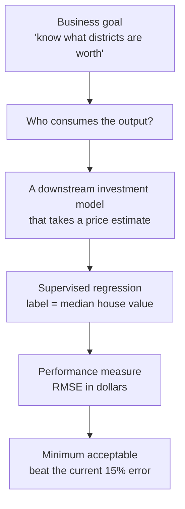

import DataCampExercise from "../../../../components/DataCampExercise.astro";
import Figure from "../../../../components/Figure.astro";
import Quiz from "../../../../components/Quiz.astro";

## What you'll learn

- the six questions that turn "predict house prices" into a specification you can build
- how the **downstream consumer** of a prediction decides the model, not the other way round
- RMSE versus MAE derived from $\ell_2$ and $\ell_1$ norms, and worked by hand on five districts
- how to read a first histogram, and the four data-quality defects visible in this one
- why "what does the current system do?" is the first question, not the last

## Intuition

Most failed ML projects were never specified. Someone said "use machine learning on our housing
data", a model was trained, it scored well, and nobody could say what should happen next because
nobody had asked what the number was *for*.

Framing is the work of turning a goal into a contract: what goes in, what comes out, who consumes
it, and what counts as good enough. It costs an afternoon and saves months.



## The six framing questions

Ask these before writing a line of code. The answers for this phase's running project are in the
right column.

| Question | Why it decides something | California housing |
| --- | --- | --- |
| What is the **business objective**? | Determines what "good" means | Feed a district-level investment model |
| Who or what **consumes the output**? | Decides latency, format and units | Another model, in batch, overnight |
| What does the **current solution** do? | Sets the bar you must beat | Manual expert estimates, ~15% off |
| Is it **supervised**? What is the label? | Decides the whole method | Yes — `median_house_value` |
| Is it **regression or classification**? | Decides the model family and metric | Regression: a dollar amount |
| Is it **batch or online**? | Decides the serving architecture | Batch — data changes slowly |

The third row is the one people skip. A model with 18% error looks respectable in isolation and is
a *regression* against experts who manage 15%. Without that baseline number the project has no way
to fail, which means it also has no way to succeed.

:::caution[Pipelines break silently]
This model's output feeds another model. If it starts emitting stale or broken values, nothing
crashes — the downstream system keeps producing plausible numbers from bad inputs. Any prediction
consumed by software rather than a human needs monitoring, which is what
[Monitoring Model Drift](/machine-learning/phase-08---model-deployment-mlops/monitoring-model-drift/)
is about.
:::

## The math: choosing a performance measure

Both candidate measures are norms of the error vector, and the choice between them is the choice
between two norms.

$$
\text{RMSE}(\mathbf{X}, h) = \sqrt{\frac{1}{m}\sum_{i=1}^{m}\left(h(\mathbf{x}^{(i)}) - y^{(i)}\right)^2}
\qquad
\text{MAE}(\mathbf{X}, h) = \frac{1}{m}\sum_{i=1}^{m}\left\lvert h(\mathbf{x}^{(i)}) - y^{(i)}\right\rvert
$$

RMSE is the $\ell_2$ norm of the error vector divided by $\sqrt{m}$; MAE is the $\ell_1$ norm
divided by $m$. More generally, the $\ell_k$ norm

$$
\lVert\mathbf{v}\rVert_k = \left(\sum_i \lvert v_i\rvert^{k}\right)^{1/k}
$$

weights large elements more heavily as $k$ grows. At $k = \infty$ only the single worst error
counts. So the question "RMSE or MAE?" is really "how much extra should one badly wrong district
cost me?"

:::note[Where this comes from]
The $\ell_k$ norms and their geometry are covered in
[Norms](/mathematics-for-machine-learning/chapter-03---analytic-geometry/norms/).
The same $\ell_1$ / $\ell_2$ distinction reappears as
[Lasso versus Ridge](/machine-learning/phase-03---supervised-learning---regression/regularization-ridge-and-lasso-regression/)
and as
[Manhattan versus Euclidean distance](/machine-learning/phase-04---supervised-learning---classification/k-nearest-neighbors-knn/).
:::

## Worked example by hand

Five districts, values in thousands of dollars:

| district | actual $y$ | predicted $\hat{y}$ | error | $\lvert e\rvert$ | $e^2$ |
| --- | --- | --- | --- | --- | --- |
| 1 | 200 | 210 | +10 | 10 | 100 |
| 2 | 250 | 240 | −10 | 10 | 100 |
| 3 | 300 | 310 | +10 | 10 | 100 |
| 4 | 350 | 330 | −20 | 20 | 400 |
| 5 | 400 | 500 | **+100** | 100 | 10,000 |
| | | | | **150** | **10,700** |

$$
\text{MAE} = \frac{150}{5} = 30
\qquad
\text{RMSE} = \sqrt{\frac{10{,}700}{5}} = \sqrt{2140} \approx 46.26
$$

**The ratio is the signal.** RMSE/MAE here is 1.54. If every error were the same size the ratio
would be exactly 1; the further above 1, the more a few districts dominate. Report both and the
ratio tells your reader something neither number does alone.

Which should you optimise? If the downstream investment model can absorb a few bad districts,
MAE is the honest measure of typical performance. If one district valued at 500 when it is worth
400 triggers a bad investment, RMSE is correctly punishing the thing that hurts.

<Figure
  src="/images/ml/phase-02-preprocessing/framing-the-problem/rmse-vs-mae"
  alt="Two lines showing reported RMSE and MAE as a single district's error grows from 0 to 900 thousand dollars. RMSE climbs steeply and almost linearly; MAE rises only slightly."
  title="One bad district out of 400"
  caption="Drag one error to $900k and RMSE nearly quintuples while MAE barely moves. Neither is wrong — they are answering different questions."
/>

## See it move

The five-district table is small enough to make interactive. Drag district 5's prediction and watch
both metrics — and their ratio — respond. Everything on screen is recomputed from the same five
errors you are editing.

```p5 title="One district, two metrics" desc="Five districts with their predictions; drag the fifth prediction up or down. MAE tracks the error linearly while RMSE bends upward, and the RMSE/MAE ratio climbs away from 1 as the single error grows. Reset the drag and both metrics agree again." height="360"
const ACTUAL = [200, 250, 300, 350, 400];
let pred = [210, 240, 310, 330, 500];
let dragging = -1;

function setup() {
  createCanvas(620, 360);
  textFont("monospace");
}
function yOf(v) {
  return 250 - ((v - 150) / 800) * 190;
}
function xOf(i) {
  return 90 + i * ((width - 200) / 4);
}
function draw() {
  background(13, 17, 23);

  const errs = ACTUAL.map((a, i) => pred[i] - a);
  const mae = errs.reduce((s, e) => s + Math.abs(e), 0) / errs.length;
  const rmse = Math.sqrt(errs.reduce((s, e) => s + e * e, 0) / errs.length);
  const ratio = rmse / mae;

  // axis
  stroke(40, 46, 54);
  strokeWeight(1);
  for (let v = 200; v <= 900; v += 100) {
    line(76, yOf(v), width - 150, yOf(v));
    noStroke();
    fill(105);
    textSize(10);
    textAlign(RIGHT, CENTER);
    text(v, 70, yOf(v));
    stroke(40, 46, 54);
  }

  // actual vs predicted, with the error as a vertical bar
  for (let i = 0; i < 5; i++) {
    const x = xOf(i);
    stroke(90, 98, 110);
    strokeWeight(1.5);
    line(x, yOf(ACTUAL[i]), x, yOf(pred[i]));
    noStroke();
    fill(120, 200, 120);
    ellipse(x, yOf(ACTUAL[i]), 10, 10);
    fill(i === 4 ? color(255, 211, 67) : color(75, 139, 190));
    ellipse(x, yOf(pred[i]), 12, 12);
    fill(140);
    textSize(10);
    textAlign(CENTER, TOP);
    text("d" + (i + 1), x, 258);
    fill(errs[i] === 0 ? 120 : 190);
    textSize(10);
    text((errs[i] > 0 ? "+" : "") + errs[i].toFixed(0), x, 272);
  }

  noStroke();
  fill(120, 200, 120);
  textSize(11);
  textAlign(LEFT, TOP);
  text("actual", 76, 14);
  fill(75, 139, 190);
  text("predicted  (drag district 5)", 140, 14);

  // metric panel
  const panelX = width - 138;
  fill(22, 27, 34);
  rect(panelX - 8, 40, 132, 190, 4);
  const lines = [
    ["MAE", mae.toFixed(2), [75, 139, 190]],
    ["RMSE", rmse.toFixed(2), [255, 176, 67]],
    ["RMSE/MAE", ratio.toFixed(3), [150, 120, 200]],
  ];
  for (let i = 0; i < lines.length; i++) {
    const [label, value, col] = lines[i];
    fill(140);
    textSize(11);
    textAlign(LEFT, TOP);
    text(label, panelX, 54 + i * 46);
    fill(col[0], col[1], col[2]);
    textSize(17);
    text(value, panelX, 70 + i * 46);
  }
  fill(ratio > 1.4 ? color(232, 122, 122) : color(120, 200, 120));
  textSize(10);
  textAlign(LEFT, TOP);
  text(ratio > 1.4 ? "one district\ndominates" : "errors are\ncomparable", panelX, 194);

  fill(105);
  textSize(10);
  textAlign(LEFT, TOP);
  text("ratio 1.000 = every error the same size", 76, 296);
  text("double-click to restore the table's values", 76, 312);
}
function mousePressed() {
  for (let i = 0; i < 5; i++) {
    if (dist(mouseX, mouseY, xOf(i), yOf(pred[i])) < 16) dragging = i;
  }
}
function mouseDragged() {
  if (dragging >= 0) {
    const v = 150 + ((250 - constrain(mouseY, yOf(950), yOf(150))) / 190) * 800;
    pred[dragging] = Math.round(v / 5) * 5;
  }
}
function mouseReleased() { dragging = -1; }
function doubleClicked() { pred = [210, 240, 310, 330, 500]; }
```

Drag district 5 down to 410 and the errors become $+10, -10, +10, -20, +10$: MAE 12.00, RMSE 12.65,
ratio **1.054** — five comparable errors, two metrics that almost agree. Drag it up to 900 instead
and MAE reaches 110.00 while RMSE reaches 223.92, ratio **2.035**. One row moved, and the ratio
doubled. That ratio *is* the answer to "is my error spread out or concentrated", which is why
reporting one metric without the other throws away information you already computed.

## Getting the data

```python title="load_housing.py" showLineNumbers{1}
import pandas as pd

URL = ("https://raw.githubusercontent.com/ageron/handson-ml2/master/"
       "datasets/housing/housing.csv")

housing = pd.read_csv(URL)

print(housing.shape)                    # (20640, 10)
print(housing["ocean_proximity"].value_counts())
# <1H OCEAN     9136
# INLAND        6551
# NEAR OCEAN    2658
# NEAR BAY      2290
# ISLAND           5

print(housing.info())
# total_bedrooms has 20433 non-null of 20640 -> 207 missing
```

Three facts are already visible, and each one becomes a page of this phase:

1. **`total_bedrooms` has 207 missing values** →
   [Data Cleaning](/machine-learning/phase-02---data-preprocessing--feature-engineering/data-cleaning--handling-missing-values/)
2. **`ocean_proximity` is text, not a number** →
   [Handling Text & Categorical Attributes](/machine-learning/phase-02---data-preprocessing--feature-engineering/handling-text--categorical-attributes/)
3. **`ISLAND` has five rows out of 20,640** — a random split can easily put zero of them in the
   training set →
   [Creating a Test Set](/machine-learning/phase-02---data-preprocessing--feature-engineering/creating-a-test-set-avoiding-data-snooping/)

## Reading the first histogram

```python title="first_look.py" showLineNumbers{1}
print(housing.describe().round(2))

housing.hist(bins=50, figsize=(12, 8))
```

<Figure
  src="/images/ml/phase-02-preprocessing/framing-the-problem/feature-histograms"
  alt="A three by three grid of histograms for median income, housing median age, total rooms, total bedrooms, population, households, latitude, longitude and median house value. Several are heavily right-skewed and two show a spike at their right edge."
  title="Nine features, plotted before anything else happens"
  caption="Fifteen seconds of work, and it exposes a scaled unit, two hard caps, six right-skewed distributions and wildly different ranges."
/>

### Reading the plot

1. **`median_income` runs 0.4999 to 15.0001, not dollars.** It has been scaled and capped, in units
   of tens of thousands. Nobody documents this; the histogram tells you.
2. **`housing_median_age` spikes at 52.** 1,273 districts sit at exactly the maximum, because the
   value was clipped there.
3. **`median_house_value` spikes at 500,001.** 965 districts. This is the target, so the cap is a
   serious problem — see below.
4. **Six distributions are strongly right-skewed.** Some models care; a log transform is available
   if so.
5. **Ranges differ by four orders of magnitude** — `median_income` up to 15, `population` up to
   35,682. That is what
   [Feature Scaling](/machine-learning/phase-02---data-preprocessing--feature-engineering/feature-scaling-normalization--standardization/)
   exists for.

<Figure
  src="/images/ml/phase-02-preprocessing/framing-the-problem/target-distribution"
  alt="Histogram of median house value showing a right-skewed distribution with a tall isolated spike at 500,001 dollars."
  title="The target, and its ceiling"
  caption="965 districts share the identical value $500,001. The model will learn that no district is ever worth more, because in this data none ever is."
/>

:::danger[A capped target is a specification decision, not a data problem]
Any model trained on this will never predict above $500,001. If the client needs accurate values
above that ceiling you have exactly two options: collect proper labels for the capped districts, or
remove them from both training and test sets and state the model's valid range. Silently training
on capped data and reporting a good RMSE is the third option, and it is the one that ships broken
systems.
:::

## Pitfalls

:::caution[Choosing a metric after seeing the results]
Pick the performance measure while framing, and write it down. Choosing afterwards means picking
whichever number flatters the model you happened to build.
:::

:::caution[No baseline means no result]
"RMSE 68,000 dollars" is unreadable without "experts are off by about 15%, roughly 30,000 dollars
on a median district". The baseline is part of the specification.
:::

:::caution[`describe()` silently ignores nulls]
`housing.describe()` reports `count` 20,433 for `total_bedrooms` and 20,640 for everything else.
That discrepancy is the only place the missing values appear. Read the count row.
:::

<Quiz
  questions={[
    {
      q: "Why does 'who consumes the output' matter so much during framing?",
      options: [
        "It affects which programming language you use",
        "It determines latency, format, units, and whether errors will be noticed at all — a prediction feeding another model can be wrong for months without anyone knowing",
        "It only matters for classification problems",
        "It does not; accuracy is what matters",
      ],
      answer: 1,
      explain: "A human reader spots an absurd number. A downstream model absorbs it and keeps producing plausible output from bad input, which is why pipeline consumers need monitoring.",
    },
    {
      q: "Your model reports RMSE 46 and MAE 30. What does the ratio tell you?",
      options: [
        "Nothing; the two are unrelated",
        "The errors are not uniform — a few large ones dominate the squared average",
        "The model is underfitting",
        "The target needs rescaling",
      ],
      answer: 1,
      explain: "RMSE equals MAE only when every error is the same size. A ratio of 1.54 says the squared measure is being driven by a small number of large misses.",
    },
    {
      q: "The target has 965 districts at exactly $500,001. What is the consequence?",
      options: [
        "Nothing; it is just a few rows",
        "The model can never predict above that value, so it is invalid for expensive districts unless you get real labels or exclude them",
        "The model will overfit",
        "You should impute those values with the mean",
      ],
      answer: 1,
      explain: "A model cannot learn a relationship the labels do not contain. Either obtain proper labels for capped districts, or drop them and document the model's valid range.",
    },
    {
      q: "What does a histogram of median_income running 0.4999 to 15.0001 tell you?",
      options: [
        "The data is corrupted",
        "The column has been scaled and capped — it is not raw dollars, and the units need to be established before anything is interpreted",
        "Incomes in California are unusually low",
        "The column should be dropped",
      ],
      answer: 1,
      explain: "Real incomes do not stop at 15. The column is in tens of thousands of dollars and clipped at both ends — the sort of thing a histogram reveals and a data dictionary often does not.",
    },
  ]}
/>

## 🧪 Try It Yourself

### Exercise 1 – Compute both measures

<DataCampExercise
  lang="python"
  hint={`RMSE is the square root of the mean squared error; MAE is the mean absolute error.`}
  code={`# Task: Exercise 1 - Compute both measures
import numpy as np

actual = np.array([200.0, 250, 300, 350, 400])
predicted = np.array([210.0, 240, 310, 330, 500])

errors = predicted - actual
mae = np.abs(errors).mean()
rmse = np.sqrt((errors ___ 2).mean())      # replace ___ with **

print("MAE:", round(mae, 2))
print("RMSE:", round(rmse, 2))
print("ratio:", round(rmse / mae, 2))

# -- Expected Output -------------------------------------------
# MAE: 30.0
# RMSE: 46.26
# ratio: 1.54
# --------------------------------------------------------------`}
  solution={`import numpy as np

actual = np.array([200.0, 250, 300, 350, 400])
predicted = np.array([210.0, 240, 310, 330, 500])
errors = predicted - actual
mae = np.abs(errors).mean()
rmse = np.sqrt((errors ** 2).mean())
print("MAE:", round(mae, 2))
print("RMSE:", round(rmse, 2))
print("ratio:", round(rmse / mae, 2))`}
  sct={`test_output_contains("RMSE: 46.26")
success_msg("A ratio well above 1 means a few districts are doing all the damage.")`}
  height={188}
/>

### Exercise 2 – Load the data and count categories

<DataCampExercise
  lang="python"
  hint={`value_counts() tallies the distinct values of a column.`}
  code={`# Task: Exercise 2 - Load the data and count categories
import pandas as pd

URL = ("https://raw.githubusercontent.com/ageron/handson-ml2/master/"
       "datasets/housing/housing.csv")
housing = pd.read_csv(URL)

print("shape:", housing.shape)
counts = housing["ocean_proximity"].___()      # replace ___ with value_counts
print(counts.to_string())

# -- Expected Output -------------------------------------------
# shape: (20640, 10)
# <1H OCEAN     9136
# INLAND        6551
# NEAR OCEAN    2658
# NEAR BAY      2290
# ISLAND           5
# --------------------------------------------------------------`}
  solution={`import pandas as pd

URL = ("https://raw.githubusercontent.com/ageron/handson-ml2/master/"
       "datasets/housing/housing.csv")
housing = pd.read_csv(URL)
print("shape:", housing.shape)
counts = housing["ocean_proximity"].value_counts()
print(counts.to_string())`}
  sct={`test_output_contains("ISLAND")
success_msg("Five ISLAND districts out of 20,640 — remember that when you split the data.")`}
  height={208}
/>

### Exercise 3 – Find the missing values

<DataCampExercise
  lang="python"
  hint={`isna() marks missing cells; summing over rows counts them per column.`}
  code={`# Task: Exercise 3 - Find the missing values
import pandas as pd

URL = ("https://raw.githubusercontent.com/ageron/handson-ml2/master/"
       "datasets/housing/housing.csv")
housing = pd.read_csv(URL)

missing = housing.___().sum()               # replace ___ with isna
print(missing[missing > 0].to_string())
print("share of rows:", round(missing.max() / len(housing), 4))

# -- Expected Output -------------------------------------------
# total_bedrooms    207
# share of rows: 0.01
# --------------------------------------------------------------`}
  solution={`import pandas as pd

URL = ("https://raw.githubusercontent.com/ageron/handson-ml2/master/"
       "datasets/housing/housing.csv")
housing = pd.read_csv(URL)
missing = housing.isna().sum()
print(missing[missing > 0].to_string())
print("share of rows:", round(missing.max() / len(housing), 4))`}
  sct={`test_output_contains("total_bedrooms    207")
success_msg("One column, 1% of rows — small enough to be easy, big enough to need a decision.")`}
  height={188}
/>

### Exercise 4 – Detect the caps

<DataCampExercise
  lang="python"
  hint={`Count how many rows sit at exactly the maximum of each column.`}
  code={`# Task: Exercise 4 - Detect the caps
import pandas as pd

URL = ("https://raw.githubusercontent.com/ageron/handson-ml2/master/"
       "datasets/housing/housing.csv")
housing = pd.read_csv(URL)

for col in ["median_house_value", "housing_median_age", "median_income"]:
    top = housing[col].___()                # replace ___ with max
    n = int((housing[col] == top).sum())
    print(f"{col:<20} max {top:>10}  rows at max {n:>5}")

# -- Expected Output -------------------------------------------
# median_house_value   max   500001.0  rows at max   965
# housing_median_age   max       52.0  rows at max  1273
# median_income        max    15.0001  rows at max    49
# --------------------------------------------------------------`}
  solution={`import pandas as pd

URL = ("https://raw.githubusercontent.com/ageron/handson-ml2/master/"
       "datasets/housing/housing.csv")
housing = pd.read_csv(URL)

for col in ["median_house_value", "housing_median_age", "median_income"]:
    top = housing[col].max()
    n = int((housing[col] == top).sum())
    print(f"{col:<20} max {top:>10}  rows at max {n:>5}")`}
  sct={`test_output_contains("rows at max   965")
success_msg("Hundreds of rows sharing one exact value is a cap, not a coincidence.")`}
  height={208}
/>

### Exercise 5 – Establish the baseline to beat

<DataCampExercise
  lang="python"
  hint={`The expert error is 15% of each district's true value; compare its RMSE against the mean predictor.`}
  code={`# Task: Exercise 5 - Establish the baseline to beat
import numpy as np
import pandas as pd

URL = ("https://raw.githubusercontent.com/ageron/handson-ml2/master/"
       "datasets/housing/housing.csv")
housing = pd.read_csv(URL)
y = housing["median_house_value"].values

expert = y * 1.15                                  # experts are ~15% off
expert_rmse = np.sqrt(((expert - y) ___ 2).mean()) # replace ___ with **

mean_pred = np.full_like(y, y.mean())
mean_rmse = np.sqrt(((mean_pred - y) ** 2).mean())

print("expert RMSE:", round(expert_rmse, 0))
print("mean-baseline RMSE:", round(mean_rmse, 0))
print("target: beat", round(expert_rmse, 0))

# -- Expected Output -------------------------------------------
# expert RMSE: 35530.0
# mean-baseline RMSE: 115393.0
# target: beat 35530.0
# --------------------------------------------------------------`}
  solution={`import numpy as np
import pandas as pd

URL = ("https://raw.githubusercontent.com/ageron/handson-ml2/master/"
       "datasets/housing/housing.csv")
housing = pd.read_csv(URL)
y = housing["median_house_value"].values
expert = y * 1.15
expert_rmse = np.sqrt(((expert - y) ** 2).mean())
mean_pred = np.full_like(y, y.mean())
mean_rmse = np.sqrt(((mean_pred - y) ** 2).mean())
print("expert RMSE:", round(expert_rmse, 0))
print("mean-baseline RMSE:", round(mean_rmse, 0))
print("target: beat", round(expert_rmse, 0))`}
  sct={`test_output_contains("expert RMSE")
success_msg("Now every future RMSE has two numbers to be judged against.")`}
  height={238}
/>

## Recap

- Framing answers six questions: objective, consumer, current solution, supervision, task type,
  batch or online. Skipping the third leaves the project unable to fail or succeed.
- RMSE is the $\ell_2$ norm of the errors, MAE the $\ell_1$; the choice encodes how much one bad
  district should cost.
- Worked by hand: MAE 30, RMSE 46.26, ratio 1.54 — the ratio itself is diagnostic.
- The dataset is 20,640 × 10, with 207 missing `total_bedrooms` and a five-row `ISLAND` category.
- The first histogram exposes a scaled income column, a cap at age 52, and 965 districts pinned to
  the $500,001 target ceiling.
- A capped target is a specification decision. Fix the labels, or state the model's valid range.

### Exercise 6 – Report the ratio, not just the metric

<DataCampExercise
  lang="python"
  hint={`RMSE is the square root of the mean squared error; MAE is the mean absolute error. Divide the first by the second.`}
  code={`# Task: Exercise 6 - Report the ratio, not just the metric
import numpy as np


def rmse_mae(errors):
    errors = np.asarray(errors, dtype=float)
    mae = np.abs(errors).mean()
    rmse = np.sqrt((errors ** 2).___())        # replace ___ with mean
    return rmse, mae, rmse / mae


cases = {
    "five similar errors": [10, -10, 10, -20, 10],
    "one district off by 100": [10, -10, 10, -20, 100],
    "one district off by 500": [10, -10, 10, -20, 500],
}
for name, errors in cases.items():
    rmse, mae, ratio = rmse_mae(errors)
    verdict = "concentrated" if ratio > 1.4 else "comparable"
    print(f"{name:26s} MAE {mae:7.2f}  RMSE {rmse:7.2f}  ratio {ratio:.3f}  {verdict}")

# -- Expected Output -------------------------------------------
# five similar errors        MAE   12.00  RMSE   12.65  ratio 1.054  comparable
# one district off by 100    MAE   30.00  RMSE   46.26  ratio 1.542  concentrated
# one district off by 500    MAE  110.00  RMSE  223.92  ratio 2.036  concentrated
# --------------------------------------------------------------`}
  solution={`import numpy as np


def rmse_mae(errors):
    errors = np.asarray(errors, dtype=float)
    mae = np.abs(errors).mean()
    rmse = np.sqrt((errors ** 2).mean())
    return rmse, mae, rmse / mae


cases = {
    "five similar errors": [10, -10, 10, -20, 10],
    "one district off by 100": [10, -10, 10, -20, 100],
    "one district off by 500": [10, -10, 10, -20, 500],
}
for name, errors in cases.items():
    rmse, mae, ratio = rmse_mae(errors)
    verdict = "concentrated" if ratio > 1.4 else "comparable"
    print(f"{name:26s} MAE {mae:7.2f}  RMSE {rmse:7.2f}  ratio {ratio:.3f}  {verdict}")`}
  sct={`test_output_contains("ratio 2.036")
success_msg("Three error patterns, three ratios. The middle row is the worked example from this page, and the ratio is the part that tells your reader whether the error is spread out or concentrated in one district.")`}
  height={280}
/>

## Next

Continue to
[Creating a Test Set (Avoiding Data Snooping)](/machine-learning/phase-02---data-preprocessing--feature-engineering/creating-a-test-set-avoiding-data-snooping/)
— set data aside *now*, before exploring further, and see how much a purely random split distorts
the strata you have just discovered.
