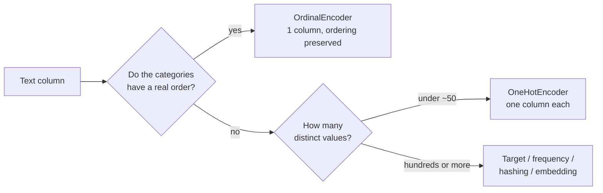

import DataCampExercise from "../../../../components/DataCampExercise.astro";
import Figure from "../../../../components/Figure.astro";
import Quiz from "../../../../components/Quiz.astro";

## What you'll learn

- why `OrdinalEncoder` makes a claim about your data, and when that claim is false
- one-hot encoding, and the geometric reason it is the safe default
- the memory arithmetic behind sparse matrices — 20,640 × 5 stored in 165 KB or 826 KB
- **the dummy variable trap**, and when `drop="first"` matters and when it does not
- what happens when an unseen category arrives in production
- four alternatives for high-cardinality columns, with the cost of each

## Intuition

Almost no model accepts the string `"NEAR BAY"`. Encoding turns text into numbers, and the encoding
you pick is not a formatting decision — **it tells the model what it is allowed to believe about
those categories.**

Map five categories to 0–4 and you have asserted that they lie on a line, evenly spaced, in that
order. Sometimes true (`small < medium < large`). Here, false: `ISLAND` is not "between" `INLAND`
and `NEAR BAY` in any sense, yet a linear model will treat the numbers exactly that way.



## The one text column

```python title="inspect.py" showLineNumbers{1}
print(housing["ocean_proximity"].value_counts())

# <1H OCEAN     9136
# INLAND        6551
# NEAR OCEAN    2658
# NEAR BAY      2290
# ISLAND           5
```

<Figure
  src="/images/ml/phase-02-preprocessing/categorical-encoding/category-counts"
  alt="Bar chart on a log scale of the five ocean_proximity categories, with ISLAND at 5 highlighted in red against thousands for the others."
  title="Five categories spanning three orders of magnitude"
  caption="ISLAND appears in 5 districts out of 20,640. A random split has a real chance of putting zero of them in the training set — and then the encoder has never seen the category it meets at test time."
/>

## Ordinal encoding

```python title="ordinal.py" showLineNumbers{1}
from sklearn.preprocessing import OrdinalEncoder

encoder = OrdinalEncoder()
encoded = encoder.fit_transform(housing[["ocean_proximity"]])

print(encoder.categories_)
# [array(['<1H OCEAN', 'INLAND', 'ISLAND', 'NEAR BAY', 'NEAR OCEAN'], dtype=object)]
print(encoded[:5].ravel())      # [3. 3. 3. 3. 3.]
```

Categories are assigned integers in **alphabetical order**, which is where the trouble starts.
`ISLAND` becomes 2 purely because "I" sorts between "I" and "N" — and a linear model then reads
that as: an island district is numerically between an inland one and a bay one, and twice as far
from `<1H OCEAN` as `INLAND` is.

<Figure
  src="/images/ml/phase-02-preprocessing/categorical-encoding/ordinal-vs-onehot"
  alt="Left: five category labels on a number line at positions 0 to 4, annotated to show the spacing is an unfounded claim. Right: a five by five identity matrix showing one-hot encoding, with every pair of rows equidistant."
  title="What each encoding asserts"
  caption="Ordinal places the categories on a line with distances. One-hot places them on the corners of a simplex, where every pair is exactly the same distance apart — the honest representation when no order exists."
/>

Geometrically: under one-hot every pair of categories is $\sqrt{2}$ apart, so no ordering and no
spacing is implied. Under ordinal the distances are 1, 2, 3 and 4, and the model uses them.

### See it move

Distances are the whole argument, so the sketch computes them. Hover a category to select it; the
bars show how far every other category sits from your selection under each encoding.

```p5 title="Distances the two encodings assert" desc="Five ocean_proximity categories under ordinal and one-hot encoding. Selecting a category shows its distance to every other: the ordinal bars are unequal and imply an ordering, the one-hot bars are all the square root of two. Hover to change the selection." height="380"
const CATS = ["<1H OCEAN", "INLAND", "ISLAND", "NEAR BAY", "NEAR OCEAN"];
let sel = 2;

function setup() {
  createCanvas(620, 380);
  textFont("monospace");
}
function draw() {
  background(13, 17, 23);
  const rowH = 30;
  const top = 96;
  const barX = 210;
  const maxBar = 150;

  fill(215);
  textSize(13);
  textAlign(LEFT, TOP);
  text("distance from  " + CATS[sel], 62, 16);
  fill(255, 176, 67);
  textSize(11);
  text("ordinal: |i - j|", barX, 62);
  fill(120, 200, 120);
  text("one-hot: sqrt(2) or 0", barX + 180, 62);

  for (let j = 0; j < CATS.length; j++) {
    const y = top + j * rowH;
    const ordinal = Math.abs(sel - j);
    const onehot = sel === j ? 0 : Math.SQRT2;

    fill(j === sel ? color(235) : color(150));
    textSize(11);
    textAlign(RIGHT, CENTER);
    text(CATS[j] + "  (" + j + ")", barX - 12, y + 10);

    noStroke();
    fill(255, 176, 67);
    rect(barX, y, (ordinal / 4) * maxBar, 8);
    fill(215);
    textSize(10);
    textAlign(LEFT, CENTER);
    text(ordinal.toFixed(3), barX + (ordinal / 4) * maxBar + 6, y + 4);

    fill(120, 200, 120);
    rect(barX, y + 12, (onehot / 4) * maxBar, 8);
    fill(215);
    text(onehot.toFixed(3), barX + (onehot / 4) * maxBar + 6, y + 16);
  }

  // the two geometries, drawn small
  const gy = 268;
  fill(140);
  textSize(11);
  textAlign(LEFT, TOP);
  text("ordinal puts them on a line:", 62, gy - 22);
  stroke(90, 98, 110);
  strokeWeight(1.5);
  line(62, gy + 8, 62 + 4 * 44, gy + 8);
  for (let j = 0; j < CATS.length; j++) {
    noStroke();
    fill(j === sel ? color(255, 176, 67) : color(70, 78, 88));
    ellipse(62 + j * 44, gy + 8, j === sel ? 13 : 9, j === sel ? 13 : 9);
    fill(110);
    textSize(9);
    textAlign(CENTER, TOP);
    text(j, 62 + j * 44, gy + 16);
    stroke(90, 98, 110);
  }
  noStroke();
  fill(140);
  textSize(11);
  textAlign(LEFT, TOP);
  text("one-hot puts them on separate axes,", 320, gy - 22);
  text("all pairs equidistant:", 320, gy - 8);
  for (let j = 0; j < CATS.length; j++) {
    const a = -HALF_PI + (j / CATS.length) * TWO_PI;
    const cx = 420, cy = gy + 34, r = 30;
    stroke(70, 78, 88);
    strokeWeight(1);
    line(cx, cy, cx + cos(a) * r, cy + sin(a) * r);
    noStroke();
    fill(j === sel ? color(120, 200, 120) : color(70, 78, 88));
    ellipse(cx + cos(a) * r, cy + sin(a) * r, j === sel ? 13 : 9, j === sel ? 13 : 9);
  }

  fill(232, 122, 122);
  textSize(11);
  textAlign(LEFT, TOP);
  const claim =
    sel === 2
      ? "ordinal claims ISLAND is twice as far from <1H OCEAN as INLAND is"
      : "ordinal claims " + CATS[sel] + " is nearer some categories than others";
  text(claim, 62, 352);
}
function mouseMoved() {
  const top = 96, rowH = 30;
  const j = Math.floor((mouseY - top) / rowH);
  if (j >= 0 && j < CATS.length) sel = j;
}
```

The amber bars are the encoder's uninvited claim. Nothing in the data says `ISLAND` sits between
`INLAND` and `NEAR BAY`; alphabetical order put it there, and a linear model reads it as a distance.
The green bars assert only "different", which is all that is true.

:::tip[When ordinal is correct, pass the order explicitly]
For genuinely ordered categories, never rely on alphabetical sorting:

```python
OrdinalEncoder(categories=[["small", "medium", "large", "x-large"]])
```

Alphabetically that would be large, medium, small, x-large — an order that is not merely arbitrary
but actively wrong.
:::

**Tree models are the exception.** A tree splits on thresholds, so `ordinal <= 1.5` can isolate any
group of categories the ordering happens to make contiguous. Ordinal encoding for trees is often
fine and much cheaper than one-hot, which is why gradient boosting libraries offer native
categorical support built on exactly this idea.

## One-hot encoding

```python title="onehot.py" showLineNumbers{1}
from sklearn.preprocessing import OneHotEncoder

encoder = OneHotEncoder()
one_hot = encoder.fit_transform(housing[["ocean_proximity"]])

print(one_hot)
# <Compressed Sparse Row sparse matrix of dtype 'float64'
#   with 20640 stored elements and shape (20640, 5)>

print(one_hot.shape)                       # (20640, 5)
print(encoder.get_feature_names_out())
# ['ocean_proximity_<1H OCEAN' ... 'ocean_proximity_NEAR OCEAN']

dense = one_hot.toarray()                  # only when you actually need it
print(dense[:3])
# [[0. 0. 0. 1. 0.]
#  [0. 0. 0. 1. 0.]
#  [0. 0. 0. 1. 0.]]
```

### Why the output is sparse

A one-hot matrix is one 1 per row and zeros everywhere else. Storing the zeros is waste:

$$
\text{dense bytes} = m \times k \times 8
\qquad
\text{sparse bytes} \approx m \times (8 + 4) + \text{overhead}
$$

| Rows | Categories | Dense | Sparse | Saving |
| --- | --- | --- | --- | --- |
| 20,640 | 5 | 826 KB | 248 KB | 3× |
| 20,640 | 100 | 16.5 MB | 248 KB | 67× |
| 1,000,000 | 50,000 | **400 GB** | 12 MB | 33,000× |

The last row is why sparse matrices exist. A one-hot encoding of a million user IDs is impossible
dense and routine sparse. `.toarray()` on it will exhaust your memory, which is why scikit-learn
makes you ask.

<Figure
  src="/images/ml/phase-02-preprocessing/categorical-encoding/cardinality-explosion"
  alt="Log-scale bar chart of columns produced by one-hot encoding for six category types, from a binary flag at 2 up to user ID at 50,000, with a dashed line at 100 marking where one-hot stops being sensible."
  title="One column per distinct value, with no upper bound"
  caption="Below about 50 distinct values one-hot is the obvious choice. Above a few hundred it starts to dominate the feature matrix, and something else is needed."
/>

## The dummy variable trap

Five one-hot columns always sum to exactly 1, so any one is perfectly predictable from the other
four. The design matrix becomes rank-deficient, and for models solved by matrix inversion the
solution is not unique.

$$
x_{\text{<1H OCEAN}} + x_{\text{INLAND}} + x_{\text{ISLAND}} + x_{\text{NEAR BAY}} + x_{\text{NEAR OCEAN}} = 1
$$

`drop="first"` removes one column, making the dropped category the reference level that the
intercept absorbs.

| Model | Does it matter? |
| --- | --- |
| Linear/logistic regression with an intercept, no regularisation | Yes — drop one |
| Ridge, Lasso, Elastic Net | No — the penalty makes the solution unique anyway |
| Trees, forests, boosting | No — and dropping a column can hurt interpretability |
| Statistical inference (p-values, coefficient CIs) | Yes, always |

scikit-learn's default is to keep all columns, which is right for regularised and tree-based models
— the majority case.

## Unseen categories in production

Your encoder learned five categories. Six months later a row arrives with `"NEAR LAKE"`.

```python title="unseen.py" showLineNumbers{1}
import pandas as pd
from sklearn.preprocessing import OneHotEncoder

train = pd.DataFrame({"city": ["London", "Paris", "Tokyo"]})
live = pd.DataFrame({"city": ["London", "Berlin"]})       # Berlin is new

strict = OneHotEncoder().fit(train)
try:
    strict.transform(live)
except ValueError as exc:
    print("raised:", str(exc)[:60])
# raised: Found unknown categories ['Berlin'] in column 0 during

safe = OneHotEncoder(handle_unknown="ignore").fit(train)
print(safe.transform(live).toarray())
# [[1. 0. 0.]
#  [0. 0. 0.]]      <- Berlin becomes all zeros
```

Both behaviours are defensible. Raising catches a data-quality problem loudly; `handle_unknown="ignore"`
keeps the service running and encodes the unknown as "none of the above". For anything serving live
traffic, use `handle_unknown="ignore"` and **log the occurrence** — an all-zero row is a silent
degradation otherwise.

:::danger[Fitting the encoder on train and test together]
`OneHotEncoder().fit(pd.concat([train, test]))` makes the unseen-category problem disappear, and it
does so by leaking. The encoder now knows about categories that only exist in the test set, and
your evaluation no longer reflects production, where genuinely new categories will appear.
:::

## When one-hot is not an option

| Approach | What it does | Cost |
| --- | --- | --- |
| **Frequency encoding** | Replace each category with its count or share | Collides: two categories of equal frequency become identical |
| **Target encoding** | Replace with the mean target for that category | Leaks badly unless cross-fitted and smoothed |
| **Hashing** | Hash into a fixed number of buckets | Collisions, and no way back to the category |
| **Embeddings** | Learn a dense vector per category | Needs a neural network and plenty of data |
| **Grouping** | Keep the top $k$, bucket the rest as "other" | Simple, effective, loses tail detail |

Grouping is the underrated one. Keeping the 20 most common values and folding the remaining 4,980
into `other` usually captures most of the signal for a fraction of the width.

:::caution[Target encoding leaks unless you are careful]
Encoding a category by its mean target uses the label, so a row's own label contributes to its own
feature. Cross-fit it — compute the encoding on out-of-fold data only — and smooth rare categories
toward the global mean. `category_encoders.TargetEncoder` and scikit-learn's `TargetEncoder` both
do this; a hand-rolled `groupby().mean()` does not.
:::

## Pitfalls

:::caution[`OrdinalEncoder` sorts alphabetically]
`['<1H OCEAN', 'INLAND', 'ISLAND', 'NEAR BAY', 'NEAR OCEAN']` is alphabetical order, not domain
order. If the order matters, state it in the `categories` argument.
:::

:::caution[Calling `.toarray()` reflexively]
On five categories it is harmless. On 50,000 it allocates hundreds of gigabytes. Most scikit-learn
estimators accept sparse input directly — check before densifying.
:::

:::caution[Encoding an identifier]
Order IDs, transaction hashes and row UUIDs are categorical in dtype and meaningless as features.
One-hot encoding them produces one column per row, and a model that memorises the training set
perfectly.
:::

:::caution[Losing the column names]
`OneHotEncoder` returns an array. `get_feature_names_out()` gives the names back, and you will want
them the moment you look at feature importances.
:::

<Quiz
  questions={[
    {
      q: "Why is OrdinalEncoder a poor choice for ocean_proximity with a linear model?",
      options: [
        "It is slower than one-hot encoding",
        "It asserts that the categories are ordered and evenly spaced — so the model treats ISLAND as numerically between INLAND and NEAR BAY",
        "It cannot handle more than four categories",
        "It produces missing values",
      ],
      answer: 1,
      explain: "A linear model multiplies the integer code by a coefficient, so the arbitrary alphabetical spacing becomes a real quantitative claim about the categories.",
    },
    {
      q: "Why does OneHotEncoder return a sparse matrix by default?",
      options: [
        "Sparse matrices are faster for every operation",
        "One-hot output is almost entirely zeros, and storing only the non-zero entries can be thousands of times smaller",
        "It is required by scikit-learn's API",
        "To prevent the dummy variable trap",
      ],
      answer: 1,
      explain: "One million rows by 50,000 categories is 400 GB dense and about 12 MB sparse. The default protects you from an allocation that cannot succeed.",
    },
    {
      q: "For which model does drop='first' genuinely matter?",
      options: [
        "Random forest",
        "Unregularised linear regression with an intercept, where the redundant column makes the design matrix rank-deficient",
        "Ridge regression",
        "It always matters, for every model",
      ],
      answer: 1,
      explain: "The one-hot columns sum to 1, duplicating the intercept. Regularisation makes the solution unique regardless, and trees are unaffected — so scikit-learn keeps every column by default.",
    },
    {
      q: "A category unseen during training arrives in production. What should a serving pipeline do?",
      options: [
        "Refit the encoder on the new data",
        "Use handle_unknown='ignore' so the row encodes as all zeros, and log the event so the silent degradation is visible",
        "Drop the row",
        "Assign it the most common category",
      ],
      answer: 1,
      explain: "Raising takes the service down; ignoring keeps it up but encodes an uninformative row. Logging turns a silent failure into a signal that the encoder needs refitting.",
    },
  ]}
/>

## 🧪 Try It Yourself

### Exercise 1 – Ordinal-encode and inspect the ordering

<DataCampExercise
  lang="python"
  hint={`categories_ holds the learned category list, in the order the integers follow.`}
  code={`# Task: Exercise 1 - Ordinal-encode and inspect the ordering
import pandas as pd
from sklearn.preprocessing import ___       # replace ___ with OrdinalEncoder

URL = ("https://raw.githubusercontent.com/ageron/handson-ml2/master/"
       "datasets/housing/housing.csv")
housing = pd.read_csv(URL)
cat = housing[["ocean_proximity"]]

enc = OrdinalEncoder().fit(cat)
print(list(enc.categories_[0]))
print("ISLAND is coded as:", list(enc.categories_[0]).index("ISLAND"))

# -- Expected Output -------------------------------------------
# ['<1H OCEAN', 'INLAND', 'ISLAND', 'NEAR BAY', 'NEAR OCEAN']
# ISLAND is coded as: 2
# --------------------------------------------------------------`}
  solution={`import pandas as pd
from sklearn.preprocessing import OrdinalEncoder

URL = ("https://raw.githubusercontent.com/ageron/handson-ml2/master/"
       "datasets/housing/housing.csv")
housing = pd.read_csv(URL)
cat = housing[["ocean_proximity"]]
enc = OrdinalEncoder().fit(cat)
print(list(enc.categories_[0]))
print("ISLAND is coded as:", list(enc.categories_[0]).index("ISLAND"))`}
  sct={`test_output_contains("ISLAND is coded as: 2")
success_msg("Alphabetical order — not an ordering anybody chose for a reason.")`}
  height={198}
/>

### Exercise 2 – One-hot encode and read the names

<DataCampExercise
  lang="python"
  hint={`get_feature_names_out() returns one name per generated column.`}
  code={`# Task: Exercise 2 - One-hot encode and read the names
import pandas as pd
from sklearn.preprocessing import OneHotEncoder

URL = ("https://raw.githubusercontent.com/ageron/handson-ml2/master/"
       "datasets/housing/housing.csv")
housing = pd.read_csv(URL)
cat = housing[["ocean_proximity"]]

enc = OneHotEncoder().fit(cat)
matrix = enc.transform(cat)

print("shape:", matrix.shape)
print("names:", len(enc.___()))          # replace ___ with get_feature_names_out
print("stored elements:", matrix.nnz)

# -- Expected Output -------------------------------------------
# shape: (20640, 5)
# names: 5
# stored elements: 20640
# --------------------------------------------------------------`}
  solution={`import pandas as pd
from sklearn.preprocessing import OneHotEncoder

URL = ("https://raw.githubusercontent.com/ageron/handson-ml2/master/"
       "datasets/housing/housing.csv")
housing = pd.read_csv(URL)
cat = housing[["ocean_proximity"]]
enc = OneHotEncoder().fit(cat)
matrix = enc.transform(cat)
print("shape:", matrix.shape)
print("names:", len(enc.get_feature_names_out()))
print("stored elements:", matrix.nnz)`}
  sct={`test_output_contains("stored elements: 20640")
success_msg("103,200 cells, only 20,640 of them non-zero — exactly one per row.")`}
  height={208}
/>

### Exercise 3 – Measure the memory saving

<DataCampExercise
  lang="python"
  hint={`A dense float64 array is rows times columns times 8 bytes.`}
  code={`# Task: Exercise 3 - Measure the memory saving
rows = 20640

for n_categories in (5, 100, 50000):
    dense_bytes = rows * n_categories * ___          # replace ___ with 8
    sparse_bytes = rows * 12
    print(f"{n_categories:>6} categories: dense {dense_bytes/1e6:>10.1f} MB   "
          f"sparse {sparse_bytes/1e6:.1f} MB")

# -- Expected Output -------------------------------------------
#      5 categories: dense        0.8 MB   sparse 0.2 MB
#    100 categories: dense       16.5 MB   sparse 0.2 MB
#  50000 categories: dense     8256.0 MB   sparse 0.2 MB
# --------------------------------------------------------------`}
  solution={`rows = 20640

for n_categories in (5, 100, 50000):
    dense_bytes = rows * n_categories * 8
    sparse_bytes = rows * 12
    print(f"{n_categories:>6} categories: dense {dense_bytes/1e6:>10.1f} MB   "
          f"sparse {sparse_bytes/1e6:.1f} MB")`}
  sct={`test_output_contains("50000 categories")
success_msg("Sparse storage is flat in the category count; dense is linear in it.")`}
  height={198}
/>

### Exercise 4 – Survive an unseen category

<DataCampExercise
  lang="python"
  hint={`handle_unknown="ignore" encodes an unseen value as all zeros instead of raising.`}
  code={`# Task: Exercise 4 - Survive an unseen category
import pandas as pd
from sklearn.preprocessing import OneHotEncoder

train = pd.DataFrame({"city": ["London", "Paris", "Tokyo"]})
live = pd.DataFrame({"city": ["London", "Berlin"]})

safe = OneHotEncoder(handle_unknown="___").fit(train)    # replace ___ with ignore
out = safe.transform(live).toarray()

print(out)
print("unknown row is all zeros:", bool(out[1].sum() == 0))

# -- Expected Output -------------------------------------------
# [[1. 0. 0.]
#  [0. 0. 0.]]
# unknown row is all zeros: True
# --------------------------------------------------------------`}
  solution={`import pandas as pd
from sklearn.preprocessing import OneHotEncoder

train = pd.DataFrame({"city": ["London", "Paris", "Tokyo"]})
live = pd.DataFrame({"city": ["London", "Berlin"]})
safe = OneHotEncoder(handle_unknown="ignore").fit(train)
out = safe.transform(live).toarray()
print(out)
print("unknown row is all zeros:", bool(out[1].sum() == 0))`}
  sct={`test_output_contains("unknown row is all zeros: True")
success_msg("The service keeps running — now log it, so the degradation is not silent.")`}
  height={198}
/>

### Exercise 5 – Confirm the dummy variable trap

<DataCampExercise
  lang="python"
  hint={`Add a column of ones to the one-hot matrix and compare its rank to its column count.`}
  code={`# Task: Exercise 5 - Confirm the dummy variable trap
import numpy as np
import pandas as pd
from sklearn.preprocessing import OneHotEncoder

URL = ("https://raw.githubusercontent.com/ageron/handson-ml2/master/"
       "datasets/housing/housing.csv")
housing = pd.read_csv(URL)
cat = housing[["ocean_proximity"]]

full = OneHotEncoder().fit_transform(cat).toarray()
dropped = OneHotEncoder(drop="first").fit_transform(cat).toarray()

with_intercept_full = np.c_[np.ones(len(full)), full]
with_intercept_drop = np.c_[np.ones(len(dropped)), dropped]

print("full  : cols", with_intercept_full.shape[1],
      "rank", np.linalg.matrix_rank(with_intercept_full))
print("drop  : cols", with_intercept_drop.shape[1],
      "rank", np.linalg.___(with_intercept_drop))   # replace ___ with matrix_rank

# -- Expected Output -------------------------------------------
# full  : cols 6 rank 5
# drop  : cols 5 rank 5
# --------------------------------------------------------------`}
  solution={`import numpy as np
import pandas as pd
from sklearn.preprocessing import OneHotEncoder

URL = ("https://raw.githubusercontent.com/ageron/handson-ml2/master/"
       "datasets/housing/housing.csv")
housing = pd.read_csv(URL)
cat = housing[["ocean_proximity"]]
full = OneHotEncoder().fit_transform(cat).toarray()
dropped = OneHotEncoder(drop="first").fit_transform(cat).toarray()
with_intercept_full = np.c_[np.ones(len(full)), full]
with_intercept_drop = np.c_[np.ones(len(dropped)), dropped]
print("full  : cols", with_intercept_full.shape[1],
      "rank", np.linalg.matrix_rank(with_intercept_full))
print("drop  : cols", with_intercept_drop.shape[1],
      "rank", np.linalg.matrix_rank(with_intercept_drop))`}
  sct={`test_output_contains("full  : cols 6 rank 5")
success_msg("Six columns of rank five: one is redundant, exactly as the trap predicts.")`}
  height={238}
/>

## Recap

- The encoding is a claim about the categories. Ordinal claims an order and a spacing; one-hot
  claims neither.
- `OrdinalEncoder` sorts alphabetically — pass `categories=[[...]]` whenever the order is real.
- Trees can live with ordinal encoding because they split on thresholds; linear models cannot.
- One-hot output is sparse because it must be: a million rows by 50,000 categories is 400 GB dense
  and 12 MB sparse.
- The one-hot columns sum to 1, so with an unregularised intercept model drop one. Regularised and
  tree-based models do not care.
- Use `handle_unknown="ignore"` in production, and log every occurrence.
- Above a few hundred categories, group into a top-$k$ plus "other", or use target encoding done
  properly with cross-fitting.

### Exercise 6 – Measure what each encoding claims

<DataCampExercise
  lang="python"
  hint={`np.linalg.norm with axis=2 on the broadcast difference gives the full pairwise distance matrix.`}
  code={`# Task: Exercise 6 - Measure what each encoding claims
import numpy as np

categories = ["<1H OCEAN", "INLAND", "ISLAND", "NEAR BAY", "NEAR OCEAN"]
ordinal = np.arange(len(categories), dtype=float).reshape(-1, 1)
one_hot = np.___(len(categories))            # replace ___ with eye

for name, matrix in (("ordinal", ordinal), ("one-hot", one_hot)):
    distances = np.linalg.norm(matrix[:, None, :] - matrix[None, :, :], axis=2)
    off_diagonal = distances[~np.eye(len(categories), dtype=bool)]
    distinct = sorted({float(round(d, 4)) for d in off_diagonal})
    print(f"{name:8s} distinct pairwise distances: {distinct}")
print(f"ordinal says ISLAND is {abs(2 - 0):.0f} away from '<1H OCEAN' "
      f"and {abs(2 - 1):.0f} from INLAND")
print("one-hot says every pair is sqrt(2) = 1.4142 apart, which is the only "
      "claim the data supports")

# -- Expected Output -------------------------------------------
# ordinal  distinct pairwise distances: [1.0, 2.0, 3.0, 4.0]
# one-hot  distinct pairwise distances: [1.4142]
# ordinal says ISLAND is 2 away from '<1H OCEAN' and 1 from INLAND
# one-hot says every pair is sqrt(2) = 1.4142 apart, which is the only claim the data supports
# --------------------------------------------------------------`}
  solution={`import numpy as np

categories = ["<1H OCEAN", "INLAND", "ISLAND", "NEAR BAY", "NEAR OCEAN"]
ordinal = np.arange(len(categories), dtype=float).reshape(-1, 1)
one_hot = np.eye(len(categories))

for name, matrix in (("ordinal", ordinal), ("one-hot", one_hot)):
    distances = np.linalg.norm(matrix[:, None, :] - matrix[None, :, :], axis=2)
    off_diagonal = distances[~np.eye(len(categories), dtype=bool)]
    distinct = sorted({float(round(d, 4)) for d in off_diagonal})
    print(f"{name:8s} distinct pairwise distances: {distinct}")
print(f"ordinal says ISLAND is {abs(2 - 0):.0f} away from '<1H OCEAN' "
      f"and {abs(2 - 1):.0f} from INLAND")
print("one-hot says every pair is sqrt(2) = 1.4142 apart, which is the only "
      "claim the data supports")`}
  sct={`test_output_contains("[1.4142]")
success_msg("Four distinct distances against one. The ordinal encoder did not choose those distances deliberately — alphabetical order did, and a linear model reads them as real.")`}
  height={280}
/>

## Next

Continue to
[Feature Scaling (Normalization & Standardization)](/machine-learning/phase-02---data-preprocessing--feature-engineering/feature-scaling-normalization--standardization/)
— every column is numeric now, and they span four orders of magnitude.
