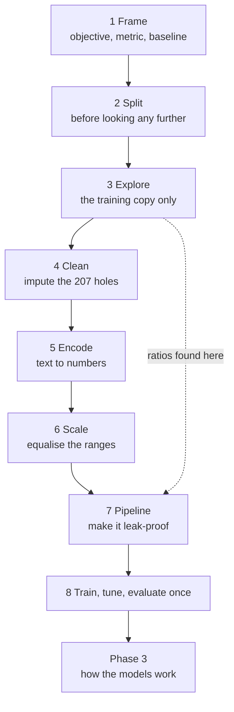

Most of the effort in a machine learning project happens before any model is fitted, and almost all
of the ways a project goes quietly wrong happen there too. This phase is one continuous project on
one dataset, and the last page assembles every earlier page into a single runnable script.

The dataset is California housing: 20,640 districts, ten columns, one text column, 207 missing
values and a target with a hard ceiling somebody imposed. Every defect it contains is one you will
meet again.

## What this phase covers

Eight pages, in strict order — each one operates on the state the previous one left behind.

| # | Page | What it produces | Key number |
| --- | --- | --- | --- |
| 1 | [Framing an ML Problem & Getting the Data](/machine-learning/phase-02---data-preprocessing--feature-engineering/framing-an-ml-problem--getting-the-data/) | A specification and a baseline | expert RMSE ≈ 35,530 |
| 2 | [Creating a Test Set](/machine-learning/phase-02---data-preprocessing--feature-engineering/creating-a-test-set-avoiding-data-snooping/) | 16,512 train / 4,128 test, stratified | random split off by 5.06% |
| 3 | [Exploratory Data Analysis & Correlations](/machine-learning/phase-02---data-preprocessing--feature-engineering/exploratory-data-analysis--correlations/) | Three engineered ratios | `bedrooms_per_room` −0.256 |
| 4 | [Data Cleaning & Handling Missing Values](/machine-learning/phase-02---data-preprocessing--feature-engineering/data-cleaning--handling-missing-values/) | A fitted imputer | 207 holes, median 435 |
| 5 | [Handling Text & Categorical Attributes](/machine-learning/phase-02---data-preprocessing--feature-engineering/handling-text--categorical-attributes/) | Five one-hot columns | ISLAND has 5 rows |
| 6 | [Feature Scaling](/machine-learning/phase-02---data-preprocessing--feature-engineering/feature-scaling-normalization--standardization/) | A fitted scaler | SGD unscaled: RMSE 3.8e15 |
| 7 | [Transformation Pipelines & Custom Transformers](/machine-learning/phase-02---data-preprocessing--feature-engineering/transformation-pipelines--custom-transformers/) | One leak-proof estimator | leakage fakes 0.867 accuracy |
| 8 | [End-to-End Project](/machine-learning/phase-02---data-preprocessing--feature-engineering/end-to-end-machine-learning-project-california-housing/) | A saved, evaluated model | test RMSE 46,768 |

## The path through

The dotted line matters: exploration in step 3 discovers the ratio features that step 7 builds into
the pipeline. Exploration is not a separate activity from engineering; it is where the engineering
comes from.

## The one rule

**Split before you look, and let a pipeline learn every parameter from the training fold only.**

Everything else in this phase is technique. This is the rule, and it has two halves because there
are two leaks:

- **The mechanical leak** — a scaler or imputer fitted on all the data. A `Pipeline` prevents it
  structurally.
- **The human leak** — a feature you invented after noticing something in rows you will later score
  on. Only splitting first prevents that, and no code can check it for you.

Page 7 demonstrates what leakage buys: 3,000 columns of pure noise, a random target, and a
cross-validated accuracy of **0.867** where the honest answer is 0.50. Nothing warns you.

## Before you start

- **pandas** — `read_csv`, `describe`, `value_counts`, boolean indexing, `groupby`
- **NumPy** — arrays, broadcasting, `np.c_`
- **[Phase 1](/machine-learning/phase-01---the-ml-foundation/phase-1---the-ml-foundation/)** — the
  vocabulary of supervised learning
- Nothing from Phase 3 onward. This phase treats models as black boxes on purpose; the
  [next phase](/machine-learning/phase-03---supervised-learning---regression/phase-3---supervised-learning---regression/)
  opens them.

## What you'll be able to do afterwards

1. Turn a vague goal into a specification with a metric and a baseline to beat.
2. Split correctly — stratified, hash-stable, or grouped — and say which the situation needs.
3. Read a first histogram and name the caps, skews and unit problems in it.
4. Choose an imputation strategy from the missingness mechanism, not from habit.
5. Encode categoricals without inventing an ordering, and handle unseen categories in production.
6. Say which models need scaling and which do not, and why.
7. Build a `ColumnTransformer` plus `Pipeline` that cannot leak, and tune it end to end.
8. Report a test score once, with a confidence interval.

## How long it takes

| Activity | Time |
| --- | --- |
| Reading the eight pages | 4–5 hours |
| Working the hand examples | 2 hours |
| Running the code and the 40 exercises | 4–5 hours |
| The practice project below | 5–8 hours |
| **Total** | **15–20 hours** |

## Practice project

**Repeat this phase on a dataset you have never seen.** The Ames housing dataset
(`fetch_openml(name="house_prices", as_frame=True)`) is the natural next step: 79 features, many
categorical, missing values everywhere, and a right-skewed target.

Work it in the same order, and write down the answer at each step:

1. Frame it. What is the objective, what is the baseline, is RMSE right for a skewed target?
2. Split it. Stratify on something defensible and justify the choice.
3. Explore the training copy. Which five features correlate most? What can you engineer?
4. Clean it. Which columns are mostly missing, and which mechanism applies to each?
5. Encode it. Which categoricals are genuinely ordinal? Which are too high-cardinality for one-hot?
6. Scale it — or establish that your chosen model does not need it.
7. Build the pipeline. Cross-validate the whole thing in one call.
8. Tune, analyse the errors, and open the test set exactly once.

The deliverable is a notebook where step 8 could be deleted and rerun from scratch without
anything breaking. If it cannot, something outside the pipeline is holding state — and that
something is a leak.

<Quiz
  questions={[
    {
      q: "Why must the test set be created in step 2, before exploration?",
      options: [
        "To save memory",
        "Because insights from test rows influence the features and models you choose, and no code can undo that leak afterwards",
        "Because scikit-learn requires it",
        "It could equally be done at the end",
      ],
      answer: 1,
      explain: "The mechanical leak is preventable by a pipeline. The human leak — engineering a feature after noticing a pattern that included test rows — is only preventable by splitting first.",
    },
    {
      q: "Exploration found bedrooms_per_room with a correlation of -0.256, stronger than any raw count. Where does that feature belong?",
      options: [
        "Nowhere; correlation is not causation",
        "Inside the pipeline built in step 7, so it is recreated identically for the test set and for live requests",
        "Applied manually to the training data only",
        "In the test set only",
      ],
      answer: 1,
      explain: "A feature computed by hand during exploration has to be reproduced everywhere the model runs. Putting it in the pipeline as a transformer is what guarantees that.",
    },
    {
      q: "What does the leakage demonstration on page 7 show?",
      options: [
        "That feature selection is always harmful",
        "That selecting features before cross-validating reports 0.867 accuracy on data containing no signal at all — silently",
        "That pipelines run faster",
        "That noise features should be removed first",
      ],
      answer: 1,
      explain: "3,000 random columns and a random target. The honest score is 0.50. Selection outside the CV loop manufactures 0.867 with no error, no warning and no way to notice from the output.",
    },
  ]}
/>

## Next

Start with
[Framing an ML Problem & Getting the Data](/machine-learning/phase-02---data-preprocessing--feature-engineering/framing-an-ml-problem--getting-the-data/)
— six questions, a performance measure chosen on purpose, and the first histogram of 20,640
districts.
