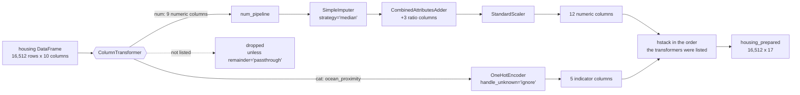

## What you'll learn

- what goes wrong when preprocessing is a sequence of loose steps
- `Pipeline` and `ColumnTransformer`, and the one rule that makes them leak-proof
- how to write a transformer scikit-learn will accept, in about fifteen lines
- leakage demonstrated: **0.867 accuracy from a dataset with no signal in it at all**
- the leaky-scaler arithmetic, computed by hand
- how `fit` and `transform` propagate through a nested pipeline

## Intuition

By now the preprocessing is: impute the medians, add three ratio columns, one-hot the categorical
column, scale the numeric ones. Four steps, each with learned parameters — nine medians, five
category names, nine means and nine standard deviations.

Done by hand, every one of those has to be recreated identically for the test set, for every
cross-validation fold, and for every live request. Miss one and the model receives inputs that do
not match what it was trained on. Recompute one on the wrong data and you have leaked.

A `Pipeline` makes that structural. The whole graph becomes a single estimator with one `fit` and
one `transform`, and the parameters are learned exactly once, from exactly the right rows.

<Figure
  src="/images/ml/phase-02-preprocessing/pipelines-and-leakage/pipeline-diagram"
  alt="Flow diagram: a raw DataFrame splits into a numeric branch (imputer, attribute adder, scaler) and a categorical branch (one-hot encoder), which recombine in a ColumnTransformer and feed an estimator."
  title="The whole preprocessing graph, as one object"
  caption="Two branches, one output. fit() learns every parameter from the training fold only; predict() replays them. Nothing else in this phase prevents leakage as reliably."
/>

## The problem with loose steps

```python title="by_hand.py" showLineNumbers{1}
# Every one of these has to be repeated, identically, for the test set
imputer = SimpleImputer(strategy="median").fit(X_train_num)
X_train_num_imp = imputer.transform(X_train_num)

X_train_num_imp = add_ratio_features(X_train_num_imp)

scaler = StandardScaler().fit(X_train_num_imp)
X_train_num_scaled = scaler.transform(X_train_num_imp)

encoder = OneHotEncoder(handle_unknown="ignore").fit(X_train_cat)
X_train_cat_enc = encoder.transform(X_train_cat)

X_train_prepared = np.hstack([X_train_num_scaled, X_train_cat_enc.toarray()])
# ... and now all of it again for X_test, in the same order, with the same objects
```

Four fitted objects to keep in sync, one hard-coded column order, and no way to cross-validate the
whole thing — because `cross_val_score` would need to redo the preprocessing inside each fold, and
it cannot reach into this code.

## Pipeline

```python title="pipeline.py" showLineNumbers{1}
from sklearn.impute import SimpleImputer
from sklearn.pipeline import Pipeline
from sklearn.preprocessing import StandardScaler

num_pipeline = Pipeline([
    ("imputer", SimpleImputer(strategy="median")),
    ("attribs", AttributeAdder()),
    ("scaler", StandardScaler()),
])

X_train_num_prepared = num_pipeline.fit_transform(X_train_num)
X_test_num_prepared = num_pipeline.transform(X_test_num)     # transform only
```

The contract: every step except the last must be a **transformer** (`fit` and `transform`); the
last may be a transformer or a **predictor**. Calling `fit` runs `fit_transform` down the chain and
`fit` on the final step. Calling `transform` or `predict` runs `transform` down the chain.

Access the fitted pieces by name — `num_pipeline.named_steps["imputer"].statistics_` — or by
position, `num_pipeline[0]`.

## A custom transformer

Any class with `fit` and `transform` works. Inheriting from `BaseEstimator` and `TransformerMixin`
adds `get_params` / `set_params` (so `GridSearchCV` can tune it) and `fit_transform` (so you do not
write it yourself):

```python title="attribute_adder.py" showLineNumbers{1}
import numpy as np
from sklearn.base import BaseEstimator, TransformerMixin

ROOMS, BEDROOMS, POPULATION, HOUSEHOLDS = 3, 4, 5, 6      # column indices


class AttributeAdder(BaseEstimator, TransformerMixin):
    """Add the three ratio features found during exploration."""

    def __init__(self, add_bedrooms_per_room=True):
        # No validation and no *args/**kwargs here — get_params relies on
        # every constructor argument being stored under its own name.
        self.add_bedrooms_per_room = add_bedrooms_per_room

    def fit(self, X, y=None):
        return self          # nothing to learn; still required by the API

    def transform(self, X):
        rooms_per_household = X[:, ROOMS] / X[:, HOUSEHOLDS]
        population_per_household = X[:, POPULATION] / X[:, HOUSEHOLDS]
        if self.add_bedrooms_per_room:
            bedrooms_per_room = X[:, BEDROOMS] / X[:, ROOMS]
            return np.c_[X, rooms_per_household, population_per_household,
                         bedrooms_per_room]
        return np.c_[X, rooms_per_household, population_per_household]


adder = AttributeAdder(add_bedrooms_per_room=False)
print(adder.get_params())     # {'add_bedrooms_per_room': False}
```

Because `add_bedrooms_per_room` is a proper hyperparameter, a grid search can decide whether the
feature helps:

```python
GridSearchCV(full_pipeline, {"preparation__num__attribs__add_bedrooms_per_room": [True, False]})
```

:::caution[Constructor arguments must be stored unchanged]
`self.add_bedrooms_per_room = add_bedrooms_per_room` — do not rename it, do not coerce it, do not
use `*args`. `get_params` reads the constructor signature and expects an attribute of the same
name. Break that and cloning fails inside every cross-validation.
:::

For stateless transformations, `FunctionTransformer` skips the class entirely:

```python
from sklearn.preprocessing import FunctionTransformer
log_transformer = FunctionTransformer(np.log1p, inverse_func=np.expm1, validate=True)
```

## ColumnTransformer

Numeric and categorical columns need different treatment, and `ColumnTransformer` routes them:

```python title="column_transformer.py" showLineNumbers{1}
from sklearn.compose import ColumnTransformer
from sklearn.preprocessing import OneHotEncoder

num_attribs = list(housing_num.columns)          # 9 numeric columns
cat_attribs = ["ocean_proximity"]

full_preparation = ColumnTransformer([
    ("num", num_pipeline, num_attribs),
    ("cat", OneHotEncoder(handle_unknown="ignore"), cat_attribs),
])

housing_prepared = full_preparation.fit_transform(housing)
print(housing_prepared.shape)      # (16512, 17)  = 9 + 3 ratios + 5 categories
```

Each tuple is `(name, transformer, columns)`. Anything not listed is dropped by default;
`remainder="passthrough"` keeps it instead. Output columns appear in the order the transformers are
listed.

The routing is easier to see than to read:



Two properties are worth naming. The numeric branch is itself a `Pipeline`, so nesting is the normal
case rather than a trick. And the final width is not something you choose — it is $9 + 3 + 5 = 17$,
determined by what each branch emits, which is why `get_feature_names_out()` exists.

## Leakage, demonstrated

The argument for pipelines is not tidiness. It is that manual preprocessing leaks, and leakage is
invisible in the metrics.

<Figure
  src="/images/ml/phase-02-preprocessing/pipelines-and-leakage/leakage-demo"
  alt="Two bars showing 5-fold cross-validated accuracy: 0.867 for feature selection performed before splitting, and 0.400 for selection inside a pipeline, with a dashed line at 0.50 marking the true accuracy."
  title="120 rows, 3,000 random columns, a random target"
  caption="There is no relationship in this data whatsoever, so the honest accuracy is 0.50. Selecting features on the full dataset before cross-validating manufactures 0.867 out of nothing."
/>

```python title="leakage.py" showLineNumbers{1}
import numpy as np
from sklearn.feature_selection import SelectKBest, f_classif
from sklearn.linear_model import LogisticRegression
from sklearn.model_selection import cross_val_score
from sklearn.pipeline import make_pipeline

rng = np.random.default_rng(0)
X = rng.normal(size=(120, 3000))       # pure noise
y = rng.integers(0, 2, 120)            # unrelated to X

# WRONG — selection sees every row, including the ones held out later
leaked = SelectKBest(f_classif, k=20).fit_transform(X, y)
print(cross_val_score(LogisticRegression(max_iter=2000), leaked, y, cv=5).mean())
# 0.8667

# RIGHT — selection happens inside each fold
honest = make_pipeline(SelectKBest(f_classif, k=20), LogisticRegression(max_iter=2000))
print(cross_val_score(honest, X, y, cv=5).mean())
# 0.4000
```

### Reading the plot

1. **There is no signal.** Both `X` and `y` are random and independent, so any honest estimate must
   sit near 0.50.
2. **The leaky version reports 0.867.** With 3,000 random columns, 20 of them correlate with `y` by
   chance across the *whole* dataset — including the validation rows. The model then "predicts"
   those rows using columns chosen because they matched them.
3. **The honest version reports 0.400.** Below 0.50, because with 120 rows and 24 per fold the
   estimate is noisy. That noise is the truth; the 0.867 is not.
4. **Nothing warns you.** No error, no exception, no suspicious-looking output. On real data with
   real signal, leakage inflates a plausible 0.85 into a plausible 0.93, and you deploy it.

**The general rule: any operation that learns from data must happen inside the cross-validation
loop.** That includes scaling, imputation, feature selection, target encoding, PCA, and
oversampling. `Pipeline` is what puts them there.

### See it move

The sketch runs that same experiment live: pure-noise columns, a random target, five folds. Watch
where the selector looks. On the left it is allowed to score every row before the split — including
the fold that is about to be held out — and the accuracy it reports drifts upward as you give it
more columns to choose from. On the right the selector is inside the fold, so more columns buy it
nothing.

```p5 title="Where the selector looks decides the score" desc="Feature selection on random noise, run inside and outside the cross-validation loop as the number of candidate columns grows. The leaky score climbs with the number of columns; the honest score stays flat around chance level. Click to redraw the noise." height="380"
const ROWS = 40;
const FOLDS = 5;
const K = 4;
let cols = 40;
let dir = 1;
let X = [];
let y = [];
let leakScore = 0.5;
let honestScore = 0.5;
let smoothLeak = 0.5;
let smoothHonest = 0.5;
let history = [];

function lcg(seed) {
  let s = seed;
  return function () {
    s = (s * 1103515245 + 12345) % 2147483648;
    return s / 2147483648;
  };
}
let rnd = lcg(3);
function gauss() {
  let u = 0, v = 0;
  while (u === 0) u = rnd();
  while (v === 0) v = rnd();
  return Math.sqrt(-2 * Math.log(u)) * Math.cos(TWO_PI * v);
}
function regen() {
  X = [];
  y = [];
  for (let i = 0; i < ROWS; i++) {
    const row = [];
    for (let j = 0; j < 600; j++) row.push(gauss());
    X.push(row);
    y.push(rnd() < 0.5 ? 0 : 1);
  }
  history = [];
}
function setup() {
  createCanvas(620, 380);
  textFont("monospace");
  regen();
}
// score a column by how far apart the two class means are (a stand-in for f_classif)
function colScore(j, rows) {
  let s0 = 0, n0 = 0, s1 = 0, n1 = 0;
  for (const i of rows) {
    if (y[i] === 1) { s1 += X[i][j]; n1++; } else { s0 += X[i][j]; n0++; }
  }
  if (n0 === 0 || n1 === 0) return 0;
  return Math.abs(s1 / n1 - s0 / n0);
}
function topK(rows, ncols) {
  const scored = [];
  for (let j = 0; j < ncols; j++) scored.push([colScore(j, rows), j]);
  scored.sort((a, b) => b[0] - a[0]);
  return scored.slice(0, K).map((p) => p[1]);
}
// nearest-centroid classifier on the chosen columns
function evalFolds(selectOnce, ncols) {
  const all = X.map((_, i) => i);
  const chosenGlobal = selectOnce ? topK(all, ncols) : null;
  let correct = 0;
  for (let f = 0; f < FOLDS; f++) {
    const test = all.filter((i) => i % FOLDS === f);
    const train = all.filter((i) => i % FOLDS !== f);
    const feats = selectOnce ? chosenGlobal : topK(train, ncols);
    const c0 = feats.map(() => 0), c1 = feats.map(() => 0);
    let n0 = 0, n1 = 0;
    for (const i of train) {
      for (let t = 0; t < feats.length; t++) {
        if (y[i] === 1) c1[t] += X[i][feats[t]];
        else c0[t] += X[i][feats[t]];
      }
      if (y[i] === 1) n1++; else n0++;
    }
    for (let t = 0; t < feats.length; t++) { c0[t] /= n0 || 1; c1[t] /= n1 || 1; }
    for (const i of test) {
      let d0 = 0, d1 = 0;
      for (let t = 0; t < feats.length; t++) {
        d0 += (X[i][feats[t]] - c0[t]) ** 2;
        d1 += (X[i][feats[t]] - c1[t]) ** 2;
      }
      if ((d1 < d0 ? 1 : 0) === y[i]) correct++;
    }
  }
  return correct / ROWS;
}
function draw() {
  background(13, 17, 23);
  const ncols = Math.round(cols);
  leakScore = evalFolds(true, ncols);
  honestScore = evalFolds(false, ncols);
  smoothLeak = lerp(smoothLeak, leakScore, 0.2);
  smoothHonest = lerp(smoothHonest, honestScore, 0.2);
  history.push([ncols, smoothLeak, smoothHonest]);
  if (history.length > 900) history.shift();

  fill(215);
  textSize(12);
  textAlign(LEFT, TOP);
  text("random columns offered to the selector: " + ncols, 62, 14);
  fill(105);
  textSize(10);
  text("40 rows of pure noise, a coin-flip target, 5 folds, top " + K + " columns kept", 62, 32);

  // chart
  const x0 = 62, x1 = width - 68, y0 = 70, y1 = 250;
  const px = (c) => x0 + ((c - 20) / 580) * (x1 - x0);
  const py = (a) => y1 - ((a - 0.2) / 0.8) * (y1 - y0);
  stroke(40, 46, 54);
  strokeWeight(1);
  for (let a = 0.2; a <= 1.001; a += 0.2) {
    line(x0, py(a), x1, py(a));
    noStroke();
    fill(105);
    textSize(10);
    textAlign(RIGHT, CENTER);
    text(a.toFixed(1), x0 - 6, py(a));
    stroke(40, 46, 54);
  }
  stroke(232, 122, 122, 90);
  strokeWeight(1);
  line(x0, py(0.5), x1, py(0.5));

  noStroke();
  for (const [c, l, h] of history) {
    fill(232, 122, 122, 120);
    ellipse(px(c), py(l), 3, 3);
    fill(120, 200, 120, 120);
    ellipse(px(c), py(h), 3, 3);
  }
  fill(232, 122, 122);
  ellipse(px(ncols), py(smoothLeak), 11, 11);
  fill(120, 200, 120);
  ellipse(px(ncols), py(smoothHonest), 11, 11);

  fill(232, 122, 122);
  textSize(11);
  textAlign(LEFT, TOP);
  text("select before splitting: " + smoothLeak.toFixed(3), 62, 268);
  fill(120, 200, 120);
  text("select inside each fold:  " + smoothHonest.toFixed(3), 62, 286);
  fill(150);
  text("truth: 0.500 -- there is no signal in this data at all", 62, 310);
  fill(105);
  textSize(10);
  text("click to redraw the noise", 62, 334);
  textAlign(RIGHT, TOP);
  text("columns ->", x1, 258);

  cols += 1.1 * dir;
  if (cols > 600 || cols < 20) dir *= -1;
  cols = constrain(cols, 20, 600);
}
function mousePressed() { rnd = lcg(Math.floor(millis()) % 100000 + 1); regen(); }
```

The red trace is not a bug in the classifier — it is a correct measurement of the wrong quantity.
Give the selector 600 columns to sift and it will find four that happen to separate the held-out
rows, because it was shown them.

The same procedure ported to NumPy and averaged over 40 random datasets, to check that the sketch is
not a visual accident:

| Candidate columns | Selected before splitting | Selected inside each fold |
| --- | --- | --- |
| 20 | 0.654 | 0.500 |
| 60 | 0.715 | 0.496 |
| 150 | 0.770 | 0.510 |
| 300 | 0.783 | 0.493 |
| 600 | **0.796** | 0.521 |

The honest column is flat at chance, as it must be on noise. The leaky column climbs monotonically
with the number of candidates. **The gap between the two is the size of the lie**, and it widens in
exactly the direction modern feature engineering pushes: more columns, more transformations, more
chances for something to match the validation rows by accident.

## Worked example by hand: the leaky scaler

Training values $[1, 2, 3]$ and one test value $[100]$.

**Wrong — fit on everything.** Mean of all four values is 26.5, population standard deviation
42.4411:

$$
\text{train} \to \left[\tfrac{1-26.5}{42.44},\; \tfrac{2-26.5}{42.44},\; \tfrac{3-26.5}{42.44}\right]
= [-0.6008,\; -0.5773,\; -0.5537]
$$

$$
\text{test} \to \tfrac{100-26.5}{42.44} = 1.7318
$$

**Right — fit on training only.** Mean 2, standard deviation 0.8165:

$$
\text{train} \to [-1.2247,\; 0,\; +1.2247]
\qquad
\text{test} \to \tfrac{100-2}{0.8165} = 120.025
$$

The two are not slightly different, they are different in kind. Fitted on everything, the training
data is squeezed into a span of 0.047 and the test point looks unremarkable at 1.73. Fitted
correctly, the training data spans 2.45 and the test point is revealed for what it is: an extreme
value 120 standard deviations out.

The leaky version does not merely produce a nicer number. It **hides the fact that the test point is
an outlier** — which is exactly the information the model most needed.

## The full pipeline

```python title="full_pipeline.py" showLineNumbers{1}
from sklearn.compose import ColumnTransformer
from sklearn.ensemble import RandomForestRegressor
from sklearn.impute import SimpleImputer
from sklearn.model_selection import cross_val_score
from sklearn.pipeline import Pipeline
from sklearn.preprocessing import OneHotEncoder, StandardScaler

num_pipeline = Pipeline([
    ("imputer", SimpleImputer(strategy="median")),
    ("attribs", AttributeAdder()),
    ("scaler", StandardScaler()),
])

preparation = ColumnTransformer([
    ("num", num_pipeline, num_attribs),
    ("cat", OneHotEncoder(handle_unknown="ignore"), cat_attribs),
])

full_pipeline = Pipeline([
    ("preparation", preparation),
    ("model", RandomForestRegressor(n_estimators=80, random_state=42, n_jobs=-1)),
])

# One call. Preprocessing is refitted inside every fold, automatically.
scores = -cross_val_score(full_pipeline, housing, housing_labels, cv=5,
                          scoring="neg_root_mean_squared_error")
print(f"RMSE {scores.mean():,.0f} (+/- {scores.std():,.0f})")

full_pipeline.fit(housing, housing_labels)
predictions = full_pipeline.predict(new_districts)     # raw DataFrame in, prices out
```

Three properties follow, and each one is the point:

- **Cross-validation is honest.** Every fold refits the imputer, the scaler and the encoder on that
  fold's training rows only.
- **Deployment is one object.** `joblib.dump(full_pipeline, "model.pkl")` saves the preprocessing
  with the model. There is no second script to keep in sync.
- **Tuning reaches everything.** `GridSearchCV` can search
  `preparation__num__imputer__strategy` alongside `model__n_estimators`, using the double-underscore
  path through the nesting.

## Pitfalls

:::danger[Any `fit` outside the pipeline]
Selection, scaling, imputation, encoding, resampling — every one leaks if fitted on the full
dataset. The demonstration above turns pure noise into 0.867 accuracy. Assume the same is happening
to you, quieter, on real data.
:::

:::caution[`ColumnTransformer` drops unlisted columns]
Silently, by default. Add a column to the CSV and forget to add it to `num_attribs` and it
disappears with no warning. Use `remainder="passthrough"` or derive the lists with
`make_column_selector`.
:::

:::caution[Column indices break when columns move]
The `AttributeAdder` above indexes columns 3 to 6. Reorder the DataFrame and it silently computes
the wrong ratios. Prefer `make_column_selector`, or write the transformer against column *names*
using a DataFrame-aware implementation.
:::

:::caution[SMOTE and other resamplers do not belong in a scikit-learn `Pipeline`]
They change the number of rows, which `Pipeline` does not support during `fit`. Use
`imblearn.pipeline.Pipeline`, which does — and which keeps the resampling inside the fold, where it
belongs.
:::

<Quiz
  questions={[
    {
      q: "Feature selection on 3,000 random columns before cross-validation reported 0.867 accuracy on random labels. Why?",
      options: [
        "The model found a real pattern",
        "Some columns correlate with the target by chance across the whole dataset, including the validation rows — so the model is scored on rows that helped choose its features",
        "Logistic regression is unsuitable here",
        "The cross-validation had too few folds",
      ],
      answer: 1,
      explain: "With 3,000 columns and 120 rows, chance correlations are guaranteed. Selecting on all the data lets validation rows influence which columns survive, and the score becomes self-fulfilling.",
    },
    {
      q: "What is the rule that makes a pipeline leak-proof?",
      options: [
        "Always scale the features",
        "Any operation that learns parameters from data must run inside the cross-validation loop, which is exactly what Pipeline arranges",
        "Never use more than three steps",
        "Always use ColumnTransformer",
      ],
      answer: 1,
      explain: "Scaling, imputation, selection, encoding and PCA all learn from data. Fitted outside the loop, each one leaks; inside a Pipeline, cross_val_score refits them per fold automatically.",
    },
    {
      q: "Why must a custom transformer store its constructor arguments unchanged, under the same names?",
      options: [
        "For readability",
        "Because get_params reads the constructor signature and looks up matching attributes — renaming or coercing them breaks cloning inside cross-validation and grid search",
        "It is not required",
        "To reduce memory usage",
      ],
      answer: 1,
      explain: "BaseEstimator's get_params introspects __init__ and reads self.<argname>. If that attribute is missing or altered, clone() fails and every CV fold errors out.",
    },
    {
      q: "Scaling [1, 2, 3] and [100] together gives the training data a span of 0.047 and puts the test point at 1.73. Fitted on training only, the test point lands at 120. What is the real cost of the leaky version?",
      options: [
        "Only that the numbers look different",
        "It hides that the test point is an extreme outlier — precisely the information the model needed",
        "It makes training slower",
        "There is no cost; both are valid",
      ],
      answer: 1,
      explain: "The leaky scaler absorbs the outlier into its own statistics, so the outlier stops looking like one. Honest scaling exposes it at 120 standard deviations out.",
    },
  ]}
/>

## 🧪 Try It Yourself

### Exercise 1 – Chain steps with Pipeline

<DataCampExercise
  lang="python"
  hint={`Pipeline takes a list of (name, transformer) tuples, executed in order.`}
  code={`# Task: Exercise 1 - Chain steps with Pipeline
import numpy as np
from sklearn.impute import SimpleImputer
from sklearn.pipeline import ___          # replace ___ with Pipeline
from sklearn.preprocessing import StandardScaler

X = np.array([[1.0, 10], [2, np.nan], [3, 30], [4, 40]])

pipe = Pipeline([
    ("imputer", SimpleImputer(strategy="median")),
    ("scaler", StandardScaler()),
])
out = pipe.fit_transform(X)

print("nulls remaining:", int(np.isnan(out).sum()))
print("column means:", out.mean(axis=0).round(6))
print("learned medians:", pipe.named_steps["imputer"].statistics_)

# -- Expected Output -------------------------------------------
# nulls remaining: 0
# column means: [0. 0.]
# learned medians: [ 2.5 30. ]
# --------------------------------------------------------------`}
  solution={`import numpy as np
from sklearn.impute import SimpleImputer
from sklearn.pipeline import Pipeline
from sklearn.preprocessing import StandardScaler

X = np.array([[1.0, 10], [2, np.nan], [3, 30], [4, 40]])
pipe = Pipeline([
    ("imputer", SimpleImputer(strategy="median")),
    ("scaler", StandardScaler()),
])
out = pipe.fit_transform(X)
print("nulls remaining:", int(np.isnan(out).sum()))
print("column means:", out.mean(axis=0).round(6))
print("learned medians:", pipe.named_steps["imputer"].statistics_)`}
  sct={`test_output_contains("nulls remaining: 0")
success_msg("Two steps, one object, and every learned parameter still reachable by name.")`}
  height={218}
/>

### Exercise 2 – Write a custom transformer

<DataCampExercise
  lang="python"
  hint={`fit returns self; transform does the work.`}
  code={`# Task: Exercise 2 - Write a custom transformer
import numpy as np
from sklearn.base import BaseEstimator, TransformerMixin

class RatioAdder(BaseEstimator, TransformerMixin):
    def __init__(self, numerator=0, denominator=1):
        self.numerator = numerator
        self.denominator = denominator

    def fit(self, X, y=None):
        return ___                      # replace ___ with self

    def transform(self, X):
        ratio = X[:, self.numerator] / X[:, self.denominator]
        return np.c_[X, ratio]

X = np.array([[10.0, 2], [20, 4], [30, 5]])
adder = RatioAdder(numerator=0, denominator=1)

print(adder.fit_transform(X))
print("params:", adder.get_params())

# -- Expected Output -------------------------------------------
# [[10.  2.  5.]
#  [20.  4.  5.]
#  [30.  5.  6.]]
# params: {'denominator': 1, 'numerator': 0}
# --------------------------------------------------------------`}
  solution={`import numpy as np
from sklearn.base import BaseEstimator, TransformerMixin

class RatioAdder(BaseEstimator, TransformerMixin):
    def __init__(self, numerator=0, denominator=1):
        self.numerator = numerator
        self.denominator = denominator

    def fit(self, X, y=None):
        return self

    def transform(self, X):
        ratio = X[:, self.numerator] / X[:, self.denominator]
        return np.c_[X, ratio]

X = np.array([[10.0, 2], [20, 4], [30, 5]])
adder = RatioAdder(numerator=0, denominator=1)
print(adder.fit_transform(X))
print("params:", adder.get_params())`}
  sct={`test_output_contains("params:")
success_msg("TransformerMixin supplied fit_transform; BaseEstimator supplied get_params.")`}
  height={258}
/>

### Exercise 3 – Route columns with ColumnTransformer

<DataCampExercise
  lang="python"
  hint={`Each entry is (name, transformer, columns).`}
  code={`# Task: Exercise 3 - Route columns with ColumnTransformer
import numpy as np
import pandas as pd
from sklearn.compose import ___          # replace ___ with ColumnTransformer
from sklearn.impute import SimpleImputer
from sklearn.preprocessing import OneHotEncoder, StandardScaler

df = pd.DataFrame({
    "age": [25.0, 32, np.nan, 41],
    "income": [50000.0, 64000, 58000, 72000],
    "city": ["London", "Paris", "London", "Tokyo"],
})

pre = ColumnTransformer([
    ("num", SimpleImputer(strategy="median"), ["age", "income"]),
    ("cat", OneHotEncoder(handle_unknown="ignore"), ["city"]),
])
out = pre.fit_transform(df)

print("shape:", out.shape)
print("nulls:", int(np.isnan(out).sum()))

# -- Expected Output -------------------------------------------
# shape: (4, 5)
# nulls: 0
# --------------------------------------------------------------`}
  solution={`import numpy as np
import pandas as pd
from sklearn.compose import ColumnTransformer
from sklearn.impute import SimpleImputer
from sklearn.preprocessing import OneHotEncoder, StandardScaler

df = pd.DataFrame({
    "age": [25.0, 32, np.nan, 41],
    "income": [50000.0, 64000, 58000, 72000],
    "city": ["London", "Paris", "London", "Tokyo"],
})
pre = ColumnTransformer([
    ("num", SimpleImputer(strategy="median"), ["age", "income"]),
    ("cat", OneHotEncoder(handle_unknown="ignore"), ["city"]),
])
out = pre.fit_transform(df)
print("shape:", out.shape)
print("nulls:", int(np.isnan(out).sum()))`}
  sct={`test_output_contains("shape: (4, 5)")
success_msg("Two numeric columns plus three city columns — routed, transformed and stacked.")`}
  height={238}
/>

### Exercise 4 – Manufacture accuracy from noise

<DataCampExercise
  lang="python"
  hint={`Compare selecting features before cross-validation against selecting inside a pipeline.`}
  code={`# Task: Exercise 4 - Manufacture accuracy from noise
import numpy as np
from sklearn.feature_selection import SelectKBest, f_classif
from sklearn.linear_model import LogisticRegression
from sklearn.model_selection import cross_val_score
from sklearn.pipeline import make_pipeline

rng = np.random.default_rng(0)
X = rng.normal(size=(120, 3000))
y = rng.integers(0, 2, 120)

leaked = SelectKBest(f_classif, k=20).fit_transform(X, ___)   # replace ___ with y
leaky_score = cross_val_score(LogisticRegression(max_iter=2000), leaked, y, cv=5).mean()

honest = make_pipeline(SelectKBest(f_classif, k=20), LogisticRegression(max_iter=2000))
honest_score = cross_val_score(honest, X, y, cv=5).mean()

print("leaky:", round(leaky_score, 4))
print("honest:", round(honest_score, 4))
print("true accuracy is 0.50; leaky overstates by:", round(leaky_score - 0.5, 4))

# -- Expected Output -------------------------------------------
# leaky: 0.8667
# honest: 0.4
# true accuracy is 0.50; leaky overstates by: 0.3667
# --------------------------------------------------------------`}
  solution={`import numpy as np
from sklearn.feature_selection import SelectKBest, f_classif
from sklearn.linear_model import LogisticRegression
from sklearn.model_selection import cross_val_score
from sklearn.pipeline import make_pipeline

rng = np.random.default_rng(0)
X = rng.normal(size=(120, 3000))
y = rng.integers(0, 2, 120)
leaked = SelectKBest(f_classif, k=20).fit_transform(X, y)
leaky_score = cross_val_score(LogisticRegression(max_iter=2000), leaked, y, cv=5).mean()
honest = make_pipeline(SelectKBest(f_classif, k=20), LogisticRegression(max_iter=2000))
honest_score = cross_val_score(honest, X, y, cv=5).mean()
print("leaky:", round(leaky_score, 4))
print("honest:", round(honest_score, 4))
print("true accuracy is 0.50; leaky overstates by:", round(leaky_score - 0.5, 4))`}
  sct={`test_output_contains("leaky: 0.8667")
success_msg("Thirty-seven points of accuracy, invented from data containing no signal at all.")`}
  height={248}
/>

### Exercise 5 – The leaky scaler, by hand

<DataCampExercise
  lang="python"
  hint={`Fit one scaler on train plus test, and another on train alone, then compare.`}
  code={`# Task: Exercise 5 - The leaky scaler, by hand
import numpy as np
from sklearn.preprocessing import StandardScaler

train = np.array([[1.0], [2.0], [3.0]])
test = np.array([[100.0]])

leaky = StandardScaler().fit(np.vstack([train, ___]))     # replace ___ with test
honest = StandardScaler().fit(train)

print("leaky  train:", leaky.transform(train).ravel().round(4))
print("leaky  test :", leaky.transform(test).ravel().round(4))
print("honest train:", honest.transform(train).ravel().round(4))
print("honest test :", honest.transform(test).ravel().round(4))

# -- Expected Output -------------------------------------------
# leaky  train: [-0.6008 -0.5773 -0.5537]
# leaky  test : [1.7318]
# honest train: [-1.2247  0.      1.2247]
# honest test : [120.025]
# --------------------------------------------------------------`}
  solution={`import numpy as np
from sklearn.preprocessing import StandardScaler

train = np.array([[1.0], [2.0], [3.0]])
test = np.array([[100.0]])
leaky = StandardScaler().fit(np.vstack([train, test]))
honest = StandardScaler().fit(train)
print("leaky  train:", leaky.transform(train).ravel().round(4))
print("leaky  test :", leaky.transform(test).ravel().round(4))
print("honest train:", honest.transform(train).ravel().round(4))
print("honest test :", honest.transform(test).ravel().round(4))`}
  sct={`test_output_contains("honest test : [120.025]")
success_msg("The leaky version hid the outlier at 1.73; the honest one exposes it at 120.")`}
  height={238}
/>

## Recap

- Manual preprocessing means keeping several fitted objects in sync, and it cannot be
  cross-validated honestly.
- `Pipeline` chains transformers into one estimator; `ColumnTransformer` routes different columns
  to different treatments.
- A custom transformer needs `fit` returning `self` and `transform`; `BaseEstimator` and
  `TransformerMixin` supply the rest — provided constructor arguments are stored unchanged.
- Leakage demonstrated: 3,000 random columns, a random target, and selecting before splitting
  reports 0.867 against a true 0.50.
- The leaky-scaler example does more than distort a number: it hides the test outlier at 1.73
  instead of exposing it at 120.
- Any operation that learns from data belongs inside the cross-validation loop. `Pipeline` is the
  mechanism that puts it there.

### Exercise 6 – Watch the lie grow with the number of columns

<DataCampExercise
  lang="python"
  hint={`make_pipeline puts the selector inside the cross-validation loop, so it refits on each fold's training rows only.`}
  code={`# Task: Exercise 6 - Watch the lie grow with the number of columns
import numpy as np
from sklearn.feature_selection import SelectKBest, f_classif
from sklearn.linear_model import LogisticRegression
from sklearn.model_selection import cross_val_score
from sklearn.pipeline import make_pipeline

n_rows = 60
print(f"{'columns':>8} {'leaky':>8} {'honest':>8}")
for n_cols in (50, 200, 800):
    leaky_runs, honest_runs = [], []
    for seed in range(10):                      # average away one-dataset luck
        rng = np.random.default_rng(seed)
        X = rng.normal(size=(n_rows, n_cols))
        y = rng.integers(0, 2, n_rows)
        leaked = SelectKBest(f_classif, k=5).fit_transform(X, y)
        leaky_runs.append(
            cross_val_score(LogisticRegression(max_iter=2000), leaked, y, cv=5).mean())
        honest_pipe = ___(SelectKBest(f_classif, k=5),
                          LogisticRegression(max_iter=2000))   # replace ___ with make_pipeline
        honest_runs.append(cross_val_score(honest_pipe, X, y, cv=5).mean())
    print(f"{n_cols:8d} {np.mean(leaky_runs):8.4f} {np.mean(honest_runs):8.4f}")
print("there is no signal in any of these datasets: the truth is 0.5000")

# -- Expected Output -------------------------------------------
#  columns    leaky   honest
#       50   0.6917   0.5283
#      200   0.7300   0.5133
#      800   0.7850   0.5083
# there is no signal in any of these datasets: the truth is 0.5000
# --------------------------------------------------------------`}
  solution={`import numpy as np
from sklearn.feature_selection import SelectKBest, f_classif
from sklearn.linear_model import LogisticRegression
from sklearn.model_selection import cross_val_score
from sklearn.pipeline import make_pipeline

n_rows = 60
print(f"{'columns':>8} {'leaky':>8} {'honest':>8}")
for n_cols in (50, 200, 800):
    leaky_runs, honest_runs = [], []
    for seed in range(10):
        rng = np.random.default_rng(seed)
        X = rng.normal(size=(n_rows, n_cols))
        y = rng.integers(0, 2, n_rows)
        leaked = SelectKBest(f_classif, k=5).fit_transform(X, y)
        leaky_runs.append(
            cross_val_score(LogisticRegression(max_iter=2000), leaked, y, cv=5).mean())
        honest_pipe = make_pipeline(SelectKBest(f_classif, k=5),
                                    LogisticRegression(max_iter=2000))
        honest_runs.append(cross_val_score(honest_pipe, X, y, cv=5).mean())
    print(f"{n_cols:8d} {np.mean(leaky_runs):8.4f} {np.mean(honest_runs):8.4f}")
print("there is no signal in any of these datasets: the truth is 0.5000")`}
  sct={`test_output_contains("0.7850")
success_msg("The honest column stays at chance while the leaky one climbs from 0.6917 to 0.7850 as you offer the selector more columns to sift. More feature engineering means more opportunities to leak, not fewer.")`}
  height={340}
/>

## Next

Continue to
[End-to-End Machine Learning Project (California Housing)](/machine-learning/phase-02---data-preprocessing--feature-engineering/end-to-end-machine-learning-project-california-housing/)
— assemble everything in this phase, train three models, tune the winner and open the test set
exactly once.
