import DataCampExercise from "../../../../components/DataCampExercise.astro";
import Figure from "../../../../components/Figure.astro";
import Quiz from "../../../../components/Quiz.astro";

## What you'll learn

- the difference between a **cost function**, a **loss function** and a **metric**
- the definition of MSE, and why we train on it but report RMSE
- how squaring changes what the model considers important
- **MAE** and **Huber** — what they optimise instead, and when each wins
- why the MSE surface is a convex bowl, and what that guarantees
- the statistical reason MSE is the default: it is maximum likelihood under Gaussian noise

## Intuition

A model needs a single number that says how wrong it currently is — one number, because
optimisation can only push one thing downhill. That number is the **cost**.

Choosing the cost is not a technicality. It is a statement of values. Squaring the errors declares
that one miss of 10 is worse than ten misses of 1 (100 against 10), so the model will contort
itself to avoid big misses even at the cost of many small ones. Taking absolute values declares
they are equally bad. Both are defensible; they simply produce different models from identical
data.

```mermaid
flowchart LR
  X["Features X"] --> H["Model h(x)"]
  H --> P["Predictions y&#770;"]
  Y["True targets y"] --> E["Errors y&#770; - y"]
  P --> E
  E --> S["Square each one"]
  S --> M["Average &rarr; MSE"]
  M -->|"gradient"| H
```



### Three words that get confused

| Term | Scope | Example |
| --- | --- | --- |
| **Loss** | One instance | $(\hat{y}_i - y_i)^2$ |
| **Cost** | The whole training set — what the optimiser minimises | $\frac{1}{m}\sum(\hat{y}_i - y_i)^2$ |
| **Metric** | What you report to humans; need not be differentiable | RMSE, MAE, $R^2$, "percentage within ±5%" |

The cost and the metric are allowed to differ, and often should. You train on MSE because it has
clean gradients; you report RMSE because it is in the units of the target.

## The math

### Definition

$$
\text{MSE}(\boldsymbol{\theta}) = \frac{1}{m}\sum_{i=1}^{m}\left(\hat{y}^{(i)} - y^{(i)}\right)^2
= \frac{1}{m}\lVert \mathbf{X}\boldsymbol{\theta} - \mathbf{y}\rVert_2^2
$$

Units are the *square* of the target's units — squared dollars, squared degrees. Nobody has
intuition for squared dollars, which is why we take the root:

$$
\text{RMSE} = \sqrt{\text{MSE}}
$$

### Why train on MSE and report RMSE

The square root is monotonic, so whichever $\boldsymbol{\theta}$ minimises MSE also minimises RMSE.
The minimiser is identical. But the gradient is not:

$$
\frac{\partial}{\partial \theta_j}\text{MSE} = \frac{2}{m}\sum_i (\hat{y}^{(i)} - y^{(i)})x_j^{(i)}
$$

$$
\frac{\partial}{\partial \theta_j}\text{RMSE}
= \frac{1}{2\sqrt{\text{MSE}}}\cdot\frac{\partial \text{MSE}}{\partial \theta_j}
$$

The RMSE gradient carries a $1/\sqrt{\text{MSE}}$ factor that blows up as the cost approaches zero.
MSE's gradient is clean and linear in the residual. Same answer, better-behaved arithmetic — so
train on MSE, report RMSE.

### Why the surface is a bowl

$\text{MSE}(\boldsymbol{\theta})$ is a quadratic form in $\boldsymbol{\theta}$ with Hessian

$$
\mathbf{H} = \frac{2}{m}\mathbf{X}^\top\mathbf{X}
$$

$\mathbf{X}^\top\mathbf{X}$ is positive semi-definite for any $\mathbf{X}$ — for any vector
$\mathbf{v}$, $\mathbf{v}^\top\mathbf{X}^\top\mathbf{X}\mathbf{v} = \lVert\mathbf{X}\mathbf{v}\rVert^2 \geq 0$.
So the cost is **convex**: no local minima, no saddle points, no bad starting position. Whatever
optimiser you point at it will find the global minimum, and if the columns are linearly independent
that minimum is unique.

<Figure
  src="/images/ml/phase-03-regression/cost-functions-mse/cost-surface"
  alt="Contour plot of MSE over slope and intercept for the five-point dataset, showing nested elliptical contours around a single starred minimum at slope 0.6, intercept 2.2."
  title="MSE over the two parameters of a simple linear model"
  caption="Nested ellipses closing on one point. Every direction leads downhill to the same place — this is what convexity looks like, and it is why linear regression never needs a restart."
/>

:::note[Where this comes from]
Convexity, Hessians and the second-derivative test are covered in
[Higher-Order Derivatives](/mathematics-for-machine-learning/chapter-05---vector-calculus/higher-order-derivatives/).
The neural networks in the Deep Learning module have loss surfaces that are emphatically *not*
convex — which is exactly why they need careful initialisation and momentum, and linear regression
does not.
:::

### The statistical justification

MSE is not an arbitrary choice. Assume the target is a linear function plus Gaussian noise:

$$
y^{(i)} = \boldsymbol{\theta}^\top\mathbf{x}^{(i)} + \varepsilon^{(i)},
\qquad \varepsilon^{(i)} \sim \mathcal{N}(0, \sigma^2)
$$

The log-likelihood of the data is then

$$
\log L(\boldsymbol{\theta}) = -\frac{m}{2}\log(2\pi\sigma^2) - \frac{1}{2\sigma^2}\sum_{i=1}^{m}\left(y^{(i)} - \boldsymbol{\theta}^\top\mathbf{x}^{(i)}\right)^2
$$

Only the last term depends on $\boldsymbol{\theta}$, and it is $-\frac{1}{2\sigma^2}$ times the sum
of squared errors. **Maximising the likelihood is exactly minimising MSE.** Choosing squared error
is the same act as assuming your noise is Gaussian — which also explains why MSE handles outliers
badly: Gaussians have thin tails and treat a large deviation as nearly impossible.

## Worked example by hand

The Phase 3 five-point set with the fitted line $\hat{y} = 0.6x + 2.2$:

| $x_i$ | $y_i$ | $\hat{y}_i$ | $e_i$ | $e_i^2$ | $\lvert e_i \rvert$ | Huber ($\delta=1$) |
| --- | --- | --- | --- | --- | --- | --- |
| 1 | 2 | 2.8 | −0.8 | 0.64 | 0.8 | 0.32 |
| 2 | 4 | 3.4 | +0.6 | 0.36 | 0.6 | 0.18 |
| 3 | 5 | 4.0 | +1.0 | 1.00 | 1.0 | 0.50 |
| 4 | 4 | 4.6 | −0.6 | 0.36 | 0.6 | 0.18 |
| 5 | 5 | 5.2 | −0.2 | 0.04 | 0.2 | 0.02 |
| | | | | **2.40** | **3.20** | **1.20** |

$$
\text{MSE} = \frac{2.40}{5} = 0.48,
\qquad
\text{RMSE} = \sqrt{0.48} \approx 0.693,
\qquad
\text{MAE} = \frac{3.20}{5} = 0.64
$$

Note that RMSE (0.693) exceeds MAE (0.64). That is not a coincidence: **RMSE is always at least as
large as MAE**, and the gap widens as the errors become less uniform. A big RMSE-to-MAE ratio is a
quick signal that a few large errors dominate.

### Now break one point

Change the last observation from 5 to 25 and refit. The least-squares line becomes
$\hat{y} = 4.6x - 5.8$:

| $x_i$ | $y_i$ | $\hat{y}_i$ | $e_i$ |
| --- | --- | --- | --- |
| 1 | 2 | −1.2 | +3.2 |
| 2 | 4 | 3.4 | +0.6 |
| 3 | 5 | 8.0 | −3.0 |
| 4 | 4 | 12.6 | −8.6 |
| 5 | 25 | 17.2 | +7.8 |

MSE has jumped from 0.48 to **30.88**, and — far worse — every single point is now badly
predicted. The line abandoned four good observations to chase one bad one. The MAE-optimal line for
the same data is $\hat{y} \approx 1.51x + 0.49$, which stays close to the original four points and
simply accepts a large error on the outlier.

## Comparing the three losses

$$
\text{MSE} = \frac{1}{m}\sum e_i^2
\qquad
\text{MAE} = \frac{1}{m}\sum \lvert e_i \rvert
\qquad
\text{Huber}_\delta =
\begin{cases}
\tfrac{1}{2}e_i^2 & \lvert e_i\rvert \le \delta \\[4pt]
\delta\left(\lvert e_i\rvert - \tfrac{1}{2}\delta\right) & \text{otherwise}
\end{cases}
$$

Huber is quadratic near zero (so it has a smooth gradient where it matters) and linear in the tails
(so one wild point cannot dominate). It is the pragmatic default when you suspect outliers but
still want gradient-friendly behaviour.

<Figure
  src="/images/ml/phase-03-regression/cost-functions-mse/loss-shapes"
  alt="Three loss curves plotted against residual size: a steep parabola for squared error, a V shape for absolute error, and a Huber curve that is parabolic near zero and straight further out."
  title="Penalty as a function of a single residual"
  caption="At a residual of 3 the squared loss charges 9 while absolute error charges 3. Huber tracks the parabola until the residual passes delta, then goes straight."
/>

<Figure
  src="/images/ml/phase-03-regression/cost-functions-mse/outlier-sensitivity"
  alt="Line chart showing the fitted slope as one data point is dragged upward. The MSE slope climbs steadily away from the true value of 2; the MAE slope stays flat."
  title="Dragging one point upward, and watching each loss react"
  caption="The MSE fit follows the outlier almost linearly. The MAE fit does not move at all — the median is immune to how far away the far point is."
/>

### Reading the plots

- **The MAE line is flat.** Not merely flatter — flat. Absolute-error fitting depends on the
  *rank* of the residuals, not their size, so once a point is above the line it does not matter
  whether it is above by 5 or by 500.
- **The MSE line rises without limit.** Each unit of extra distance adds a proportional pull on the
  slope. There is no point at which MSE stops caring.
- **Huber sits between them, by construction.** Below $\delta$ it behaves like MSE, above it like
  MAE, and $\delta$ is the dial.

| | MSE | MAE | Huber |
| --- | --- | --- | --- |
| Optimises toward the | mean | median | mean, robustified |
| Outlier sensitivity | High | Low | Tunable via $\delta$ |
| Differentiable everywhere | Yes | No (corner at 0) | Yes |
| Closed-form solution | Yes | No | No |
| scikit-learn | `LinearRegression`, `Ridge` | `QuantileRegressor` | `HuberRegressor` |
| Reach for it when | Noise is roughly Gaussian | Outliers are real data | You are unsure |

:::tip[MSE predicts the mean, MAE predicts the median]
This is the deepest difference. The constant $c$ minimising $\sum(y_i - c)^2$ is the mean; the
constant minimising $\sum\lvert y_i - c\rvert$ is the median. Everything else about their behaviour
follows from that — including why MAE is the right loss when you care about the typical case and
MSE when large errors are genuinely expensive.
:::

## See it move

Each pink square's *area* is one point's squared error. Watch the total area collapse as the line
improves — that shrinking area is literally the cost.

```p5 title="MSE as shrinking squares" desc="Each square's area equals one point's squared error; as the fitted line improves, the squares shrink and MSE drops. Click for a fresh dataset." height="300"
let pts = [];
let m = 0, b = 0;
let t = 0;
function genPts() {
  pts = [];
  const tm = 0.8 + random(-0.2, 0.2), tb = random(-1, 1);
  for (let i = 0; i < 14; i++) {
    const x = random(-2.5, 2.5);
    const y = tm * x + tb + random(-1.1, 1.1);
    pts.push({ x, y });
  }
  m = random(-1, 1); b = random(-1, 1); t = 0;
}
function setup() {
  createCanvas(600, 300);
  textFont("monospace");
  textAlign(CENTER, CENTER);
  genPts();
}
function px(x) { return 60 + (x + 3) / 6 * (width - 120); }
function py(y) { return (height - 50) - (y + 4) / 8 * (height - 90); }
function draw() {
  background(13, 17, 23);

  let mse = 0;
  noStroke();
  rectMode(CENTER);
  for (const p of pts) {
    const pred = m * p.x + b;
    const err = pred - p.y;
    mse += err * err;
    const side = Math.min(Math.abs(err) * ((width - 120) / 6), 90);
    fill(255, 120, 120, 70);
    rect(px(p.x), (py(p.y) + py(pred)) / 2, side, side);
  }
  rectMode(CORNER);
  mse /= pts.length;

  stroke(75, 139, 190);
  strokeWeight(1);
  for (const p of pts) line(px(p.x), py(p.y), px(p.x), py(m * p.x + b));

  noStroke();
  for (const p of pts) { fill(75, 139, 190); ellipse(px(p.x), py(p.y), 8, 8); }

  stroke(255, 211, 67);
  strokeWeight(2.5);
  line(px(-3), py(m * -3 + b), px(3), py(m * 3 + b));

  noStroke();
  fill(107, 169, 221);
  textSize(13);
  text("MSE = " + mse.toFixed(2), width / 2, 20);
  fill(150);
  textSize(11);
  text("pink squares = squared error at each point (area shrinks as MSE drops)", width / 2, height - 12);

  t++;
  if (t % 2 === 0) {
    let dm = 0, db = 0;
    for (const p of pts) { const e = (m * p.x + b) - p.y; dm += e * p.x; db += e; }
    dm /= pts.length; db /= pts.length;
    m -= 0.04 * dm; b -= 0.04 * db;
  }
  if (t > 260) genPts();
}
function mousePressed() { genPts(); }
```

## From scratch

All three losses, plus the invariant that RMSE never falls below MAE:

```python title="losses.py" showLineNumbers{1}
import numpy as np


def mse(y, pred):
    return float(((pred - y) ** 2).mean())


def rmse(y, pred):
    return mse(y, pred) ** 0.5


def mae(y, pred):
    return float(np.abs(pred - y).mean())


def huber(y, pred, delta=1.0):
    e = np.abs(pred - y)
    quadratic = 0.5 * e**2
    linear = delta * (e - 0.5 * delta)
    return float(np.where(e <= delta, quadratic, linear).mean())


x = np.array([1.0, 2.0, 3.0, 4.0, 5.0])
y = np.array([2.0, 4.0, 5.0, 4.0, 5.0])
pred = 0.6 * x + 2.2

print(f"MSE   = {mse(y, pred):.4f}")     # MSE   = 0.4800
print(f"RMSE  = {rmse(y, pred):.4f}")    # RMSE  = 0.6928
print(f"MAE   = {mae(y, pred):.4f}")     # MAE   = 0.6400
print(f"Huber = {huber(y, pred):.4f}")   # Huber = 0.2400

print(rmse(y, pred) >= mae(y, pred))     # True — always
```

## With scikit-learn

```python title="robust_vs_ols.py" showLineNumbers{1}
import numpy as np
from sklearn.linear_model import LinearRegression, HuberRegressor
from sklearn.metrics import mean_squared_error, mean_absolute_error

X = np.array([1.0, 2.0, 3.0, 4.0, 5.0]).reshape(-1, 1)
clean = np.array([2.0, 4.0, 5.0, 4.0, 5.0])
dirty = np.array([2.0, 4.0, 5.0, 4.0, 25.0])   # last point corrupted

ols_clean = LinearRegression().fit(X, clean)
ols_dirty = LinearRegression().fit(X, dirty)
huber_dirty = HuberRegressor(epsilon=1.35).fit(X, dirty)

print(f"OLS on clean data : slope {ols_clean.coef_[0]:.2f}")    # slope 0.60
print(f"OLS on dirty data : slope {ols_dirty.coef_[0]:.2f}")    # slope 4.60
print(f"Huber on dirty    : slope {huber_dirty.coef_[0]:.2f}")  # slope 1.91

# Same predictions, two different metrics
pred = ols_dirty.predict(X)
print(f"MSE = {mean_squared_error(dirty, pred):.2f}")           # MSE = 30.88
print(f"MAE = {mean_absolute_error(dirty, pred):.2f}")          # MAE = 4.64
```

One corrupted observation multiplies the OLS slope by more than seven, from 0.60 to 4.60. Huber
still drifts — 1.91 — because five points is a brutal test and one of them is now an extreme
value, but it absorbs less than half the damage OLS does.

## Pitfalls

:::caution[Do not compare MSE across datasets]
MSE is in squared target units, so a house-price model and a temperature model produce numbers that
cannot be compared. Even two models on the *same* target are only comparable if evaluated on the
same rows. Use $R^2$ or a percentage error when you need a scale-free comparison.
:::

:::caution[A single terrible prediction can dominate the average]
With 1,000 rows, one residual of 500 contributes 250,000 to the sum — more than 999 residuals of
15 combined. Always look at the error *distribution*, not just its mean. If RMSE is far above MAE,
a handful of rows are doing all the damage.
:::

:::caution[Optimising a loss you do not care about]
If the business cost of over-predicting differs from under-predicting, symmetric MSE is the wrong
objective. Quantile regression (via `QuantileRegressor`, or `loss="quantile"` in gradient boosting)
lets you weight the two directions differently.
:::

:::danger[MSE assumes Gaussian noise — check that]
The maximum-likelihood derivation above is only valid for Gaussian errors. Heavy-tailed or skewed
targets (income, insurance claims, waiting times) violate it badly. Log-transform the target, or
switch to a loss matched to the actual distribution.
:::

<Quiz
  questions={[
    {
      q: "Why is MSE minimised during training while RMSE is reported afterwards?",
      options: [
        "They have different minimisers, and MSE's is better",
        "They share the same minimiser, but MSE has a cleaner gradient while RMSE is in the target's units",
        "RMSE cannot be computed during training",
        "MSE is faster to compute than RMSE",
      ],
      answer: 1,
      explain: "The square root is monotonic, so the optimal parameters are identical. MSE's gradient is linear in the residual; RMSE's carries a 1 over root-MSE factor that explodes near zero.",
    },
    {
      q: "Which constant value minimises the sum of absolute errors?",
      options: ["The mean", "The median", "The mode", "The midpoint of the range"],
      answer: 1,
      explain: "The median minimises absolute error; the mean minimises squared error. That single fact explains most of the behavioural difference between MAE and MSE.",
    },
    {
      q: "Why is the MSE cost surface guaranteed to have no local minima?",
      options: [
        "Because the learning rate is small enough",
        "Because its Hessian, 2/m times X transpose X, is positive semi-definite, making the cost convex",
        "Because the data is standardised",
        "It is not guaranteed; local minima are common",
      ],
      answer: 1,
      explain: "X transpose X is positive semi-definite for any X, so the quadratic cost is convex — a single global minimum with no traps along the way.",
    },
    {
      q: "Your model reports RMSE 40 and MAE 12. What does that gap suggest?",
      options: [
        "A calculation error, since RMSE cannot exceed MAE by that much",
        "A small number of very large errors are dominating the squared average",
        "The model is underfitting everywhere equally",
        "The target needs rescaling",
      ],
      answer: 1,
      explain: "RMSE is always at least MAE, and the gap grows with the spread of the errors. A ratio above three points at a few extreme residuals rather than uniform mediocrity.",
    },
  ]}
/>

## 🧪 Try It Yourself

### Exercise 1 – Compute MSE by hand

<DataCampExercise
  lang="python"
  hint={`Square the differences, then take the mean.`}
  code={`# Task: Exercise 1 - Compute MSE by hand
import numpy as np

y = np.array([2.0, 4.0, 5.0, 4.0, 5.0])
pred = np.array([2.8, 3.4, 4.0, 4.6, 5.2])

mse = ((pred - y) ** 2).___()      # replace ___ with mean
print("MSE:", round(mse, 4))
print("RMSE:", round(mse ** 0.5, 4))

# -- Expected Output -------------------------------------------
# MSE: 0.48
# RMSE: 0.6928
# --------------------------------------------------------------`}
  solution={`import numpy as np

y = np.array([2.0, 4.0, 5.0, 4.0, 5.0])
pred = np.array([2.8, 3.4, 4.0, 4.6, 5.2])
mse = ((pred - y) ** 2).mean()
print("MSE:", round(mse, 4))
print("RMSE:", round(mse ** 0.5, 4))`}
  sct={`test_output_contains("MSE: 0.48")
test_output_contains("RMSE: 0.6928")
success_msg("RMSE puts the error back into the units of the target.")`}
  height={168}
/>

### Exercise 2 – RMSE is never below MAE

<DataCampExercise
  lang="python"
  hint={`np.abs gives the absolute error; compare its mean to the root of the squared mean.`}
  code={`# Task: Exercise 2 - RMSE is never below MAE
import numpy as np

y = np.array([2.0, 4.0, 5.0, 4.0, 5.0])
pred = np.array([2.8, 3.4, 4.0, 4.6, 5.2])

rmse = ((pred - y) ** 2).mean() ** 0.5
mae = np.___(pred - y).mean()      # replace ___ with abs

print("RMSE:", round(rmse, 4))
print("MAE:", round(mae, 4))
print("RMSE >= MAE:", rmse >= mae)

# -- Expected Output -------------------------------------------
# RMSE: 0.6928
# MAE: 0.64
# RMSE >= MAE: True
# --------------------------------------------------------------`}
  solution={`import numpy as np

y = np.array([2.0, 4.0, 5.0, 4.0, 5.0])
pred = np.array([2.8, 3.4, 4.0, 4.6, 5.2])
rmse = ((pred - y) ** 2).mean() ** 0.5
mae = np.abs(pred - y).mean()
print("RMSE:", round(rmse, 4))
print("MAE:", round(mae, 4))
print("RMSE >= MAE:", rmse >= mae)`}
  sct={`test_output_contains("RMSE >= MAE: True")
success_msg("The wider the spread of errors, the bigger that gap gets.")`}
  height={188}
/>

### Exercise 3 – Implement the Huber loss

<DataCampExercise
  lang="python"
  hint={`np.where(condition, value_if_true, value_if_false) picks elementwise.`}
  code={`# Task: Exercise 3 - Implement the Huber loss
import numpy as np

y = np.array([2.0, 4.0, 5.0, 4.0, 5.0])
pred = np.array([2.8, 3.4, 4.0, 4.6, 5.2])
delta = 1.0

e = np.abs(pred - y)
quadratic = 0.5 * e ** 2
linear = delta * (e - 0.5 * delta)
loss = np.___(e <= delta, quadratic, linear)   # replace ___ with where

print("Huber:", round(loss.mean(), 4))

# -- Expected Output -------------------------------------------
# Huber: 0.24
# --------------------------------------------------------------`}
  solution={`import numpy as np

y = np.array([2.0, 4.0, 5.0, 4.0, 5.0])
pred = np.array([2.8, 3.4, 4.0, 4.6, 5.2])
delta = 1.0
e = np.abs(pred - y)
quadratic = 0.5 * e ** 2
linear = delta * (e - 0.5 * delta)
loss = np.where(e <= delta, quadratic, linear)
print("Huber:", round(loss.mean(), 4))`}
  sct={`test_output_contains("Huber: 0.24")
success_msg("Quadratic near zero, linear in the tails.")`}
  height={188}
/>

### Exercise 4 – Mean minimises MSE, median minimises MAE

<DataCampExercise
  lang="python"
  hint={`Score every candidate constant on a grid and see which one each loss prefers.`}
  code={`# Task: Exercise 4 - Mean minimises MSE, median minimises MAE
import numpy as np

y = np.array([1.0, 2.0, 3.0, 4.0, 40.0])   # one big outlier
grid = np.linspace(0, 40, 4001)

mse_best = grid[np.argmin([((y - c) ** 2).mean() for c in grid])]
mae_best = grid[np.argmin([np.abs(y - c).mean() for c in grid])]

print("MSE-optimal constant:", round(mse_best, 2))
print("MAE-optimal constant:", round(mae_best, 2))
print("mean:", round(y.mean(), 2), " median:", round(np.___(y), 2))  # replace ___ with median

# -- Expected Output -------------------------------------------
# MSE-optimal constant: 10.0
# MAE-optimal constant: 3.0
# mean: 10.0  median: 3.0
# --------------------------------------------------------------`}
  solution={`import numpy as np

y = np.array([1.0, 2.0, 3.0, 4.0, 40.0])
grid = np.linspace(0, 40, 4001)
mse_best = grid[np.argmin([((y - c) ** 2).mean() for c in grid])]
mae_best = grid[np.argmin([np.abs(y - c).mean() for c in grid])]
print("MSE-optimal constant:", round(mse_best, 2))
print("MAE-optimal constant:", round(mae_best, 2))
print("mean:", round(y.mean(), 2), " median:", round(np.median(y), 2))`}
  sct={`test_output_contains("MAE-optimal constant: 3.0")
success_msg("One outlier drags the mean to 10 while the median stays at 3.")`}
  height={208}
/>

### Exercise 5 – Huber resists what OLS cannot

<DataCampExercise
  lang="python"
  hint={`Fit both estimators on the corrupted target and compare the slopes.`}
  code={`# Task: Exercise 5 - Huber resists what OLS cannot
import numpy as np
from sklearn.linear_model import LinearRegression, ___   # replace ___ with HuberRegressor

X = np.array([1.0, 2.0, 3.0, 4.0, 5.0]).reshape(-1, 1)
dirty = np.array([2.0, 4.0, 5.0, 4.0, 25.0])

ols = LinearRegression().fit(X, dirty)
hub = HuberRegressor(epsilon=1.35).fit(X, dirty)

print("OLS slope:", round(ols.coef_[0], 2))
print("Huber slope:", round(hub.coef_[0], 2))
print("Huber closer to 0.6:", abs(hub.coef_[0] - 0.6) < abs(ols.coef_[0] - 0.6))

# -- Expected Output -------------------------------------------
# OLS slope: 4.6
# Huber slope: 1.91
# Huber closer to 0.6: True
# --------------------------------------------------------------`}
  solution={`import numpy as np
from sklearn.linear_model import LinearRegression, HuberRegressor

X = np.array([1.0, 2.0, 3.0, 4.0, 5.0]).reshape(-1, 1)
dirty = np.array([2.0, 4.0, 5.0, 4.0, 25.0])
ols = LinearRegression().fit(X, dirty)
hub = HuberRegressor(epsilon=1.35).fit(X, dirty)
print("OLS slope:", round(ols.coef_[0], 2))
print("Huber slope:", round(hub.coef_[0], 2))
print("Huber closer to 0.6:", abs(hub.coef_[0] - 0.6) < abs(ols.coef_[0] - 0.6))`}
  sct={`test_output_contains("Huber closer to 0.6: True")
success_msg("Same data, same features — only the loss changed.")`}
  height={208}
/>

## Recap

- Loss is per instance, cost is over the training set, and the metric is what you report.
- $\text{MSE} = \frac{1}{m}\sum e_i^2$; train on it, report RMSE because it is in target units.
- The cost surface is convex because $\mathbf{X}^\top\mathbf{X}$ is positive semi-definite — one
  global minimum, no traps.
- Minimising MSE is maximum likelihood under Gaussian noise, which is also why it fears outliers.
- MSE targets the mean, MAE the median, Huber the mean with a cap on how much any one point can
  pull.
- On the five-point set: MSE 0.48, RMSE 0.693, MAE 0.64, Huber 0.24. Corrupt one point and MSE
  jumps to 30.88 while the Huber slope barely moves.

### Exercise 6 – Which statistic is each loss estimating?

<DataCampExercise
  lang="python"
  hint={`Minimise each loss over a single constant c. Squared error is minimised by the mean, absolute error by the median.`}
  code={`# Task: Exercise 6 - Which statistic is each loss estimating?
import numpy as np
from scipy.optimize import minimize_scalar

sample = np.array([2.0, 4.0, 5.0, 4.0, 5.0, 40.0])      # one outlier


def total(loss, c):
    residuals = sample - c
    if loss == "squared":
        return (residuals ** 2).mean()
    if loss == "absolute":
        return np.___(residuals).mean()          # replace ___ with abs
    delta = 1.0
    small = np.abs(residuals) <= delta
    return (np.where(small, 0.5 * residuals ** 2,
                     delta * (np.abs(residuals) - 0.5 * delta))).mean()


for loss in ("squared", "absolute", "huber"):
    best = minimize_scalar(lambda c: total(loss, c), bounds=(0, 45), method="bounded")
    print(f"{loss:9s} minimised at c = {best.x:7.4f}")
print(f"the mean is   {sample.mean():.4f}")
print(f"the median is {np.median(sample):.4f}")
print("squared loss chases the outlier; absolute loss ignores it; "
      "huber sits between them")

# -- Expected Output -------------------------------------------
# squared   minimised at c = 10.0000
# absolute  minimised at c =  4.0577
# huber     minimised at c =  4.5000
# the mean is   10.0000
# the median is 4.5000
# squared loss chases the outlier; absolute loss ignores it; huber sits between them
# --------------------------------------------------------------`}
  solution={`import numpy as np
from scipy.optimize import minimize_scalar

sample = np.array([2.0, 4.0, 5.0, 4.0, 5.0, 40.0])


def total(loss, c):
    residuals = sample - c
    if loss == "squared":
        return (residuals ** 2).mean()
    if loss == "absolute":
        return np.abs(residuals).mean()
    delta = 1.0
    small = np.abs(residuals) <= delta
    return (np.where(small, 0.5 * residuals ** 2,
                     delta * (np.abs(residuals) - 0.5 * delta))).mean()


for loss in ("squared", "absolute", "huber"):
    best = minimize_scalar(lambda c: total(loss, c), bounds=(0, 45), method="bounded")
    print(f"{loss:9s} minimised at c = {best.x:7.4f}")
print(f"the mean is   {sample.mean():.4f}")
print(f"the median is {np.median(sample):.4f}")
print("squared loss chases the outlier; absolute loss ignores it; "
      "huber sits between them")`}
  sct={`test_output_contains("minimised at c = 10.0000")
success_msg("Squared error lands exactly on the mean, 10.0000, which no observation is anywhere near. Absolute error lands at 4.06 — next to five of the six points. Choosing a loss is choosing which summary of the data you want the model to predict.")`}
  height={310}
/>

## Next

Continue to
[Gradient Descent Explained](/machine-learning/phase-03---supervised-learning---regression/gradient-descent-explained/)
— how to actually walk down the bowl when the closed-form solution is too expensive to compute.
