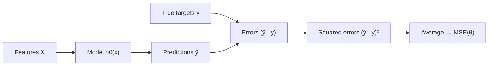

## What a cost function is

A **cost function** measures how bad predictions are.

Training usually means:

> find parameters that minimize cost.

For regression, the most common is **Mean Squared Error (MSE)**.

## MSE definition

For N samples:

`MSE = (1/N) * Σ (yi - ŷi)²`

Why square?

- penalizes large errors more
- differentiable (good for optimization)

## Intuition

If you miss by:

- 1 unit → error contributes 1
- 10 units → error contributes 100

MSE pushes the model to avoid big mistakes.

## MSE vs RMSE

- **MSE**: squared units (harder to interpret)
- **RMSE**: square root of MSE, back to original units

## Why train on MSE instead of RMSE

*Hands-On Machine Learning* points out that the most natural performance
measure for regression is RMSE, but training algorithms actually minimize
**MSE** instead. The reason is purely practical: MSE is simpler to work with
mathematically (no square root to differentiate), and the value of `θ` that
minimizes MSE is *the same* value that minimizes RMSE — square-rooting a
function doesn't move its minimum.



Formally, for a hypothesis `hθ` over a training set of `m` instances:

`MSE(θ) = (1/m) · Σ (hθ(x⁽ⁱ⁾) − y⁽ⁱ⁾)²`

This is the cost function `J(θ)` that the Normal Equation solves in closed
form, and the same function Gradient Descent will minimize iteratively in the
next lesson.

:::tip[From the book]
It's common for a training cost function to differ from the performance
measure you report. MSE is used during training because it has friendlier
derivatives; you might still report RMSE (or MAE) to stakeholders because it's
in the original units and easier to reason about.
:::

## Why the cost surface is a bowl (and why that's great news)

For Linear Regression, `MSE(θ)` is a **convex** function — pick any two points on
its surface and the straight line joining them never dips below the curve itself.
Practically, that guarantees two things:

- There's only **one global minimum** — no smaller local dips for an optimizer to
  get stuck in.
- The surface has no sudden cliffs; its slope changes smoothly everywhere.

Picture the surface as an actual bowl, with the height at each point being the cost
for that combination of parameters. The Normal Equation jumps straight to the
bottom of the bowl in one step; Gradient Descent (the next lesson) walks down the
slope instead, and because the bowl is convex, it's mathematically guaranteed to
reach that same bottom eventually — it just may take a while, especially if the
bowl is stretched into a long oval because the input features have very different
scales.

## MAE: a more robust alternative

MSE squares every error, so a single big outlier can dominate the entire cost —
one badly mispredicted point with error 100 contributes as much as 10,000 points
each off by 1. **Mean Absolute Error (MAE)** swaps the square for an absolute value:

`MAE = (1/N) * Σ |yi - ŷi|`

Because MAE grows *linearly* with the size of a mistake instead of quadratically,
it's far less sensitive to a handful of outliers. The trade-off: MAE has a sharp
corner at zero error (its derivative jumps abruptly there), which makes some
optimization algorithms converge less smoothly than they do with MSE's gentle bowl.

```python title="MSE vs MAE with an outlier" showLineNumbers{1}
import numpy as np

y_true = np.array([10, 12, 14, 16, 50])       # 50 is a big outlier
y_pred = np.array([11, 13, 13, 17, 20])       # model badly misses the outlier

mse = np.mean((y_true - y_pred) ** 2)
mae = np.mean(np.abs(y_true - y_pred))

print("MSE:", round(mse, 2))   # dominated by the outlier's squared error
print("MAE:", round(mae, 2))   # grows much more gently
```

**Rule of thumb:** default to MSE for training (friendlier derivatives, same
minimum as RMSE). Reach for MAE — or a hybrid like Huber loss — when your data has
outliers you don't want to dominate the fit.

## Code example

```python title="Compute MSE and RMSE" showLineNumbers{1}
import numpy as np

y_true = np.array([3, 5, 2, 7])
y_pred = np.array([2.5, 5.2, 1.8, 7.9])

mse = np.mean((y_true - y_pred) ** 2)
rmse = np.sqrt(mse)

print("MSE:", mse)
print("RMSE:", rmse)
```

## Visualize it

Each pink square's **area** is one point's squared error — literally `(error)²` drawn
to scale. Watch the line improve step by step: as it fits the data better, the
squares shrink and the MSE readout ticks down toward its minimum, then a fresh
dataset rolls in and it happens again:

```p5 title="MSE as shrinking squares" desc="Each square's area equals one point's squared error; as the fitted line improves, the squares shrink and MSE drops." height="300"
let pts = [];
let m = 0, b = 0;
let t = 0;
function genPts() {
  pts = [];
  const tm = 0.8 + random(-0.2, 0.2), tb = random(-1, 1);
  for (let i = 0; i < 14; i++) {
    const x = random(-2.5, 2.5);
    const y = tm * x + tb + random(-1.1, 1.1);
    pts.push({ x, y });
  }
  m = random(-1, 1); b = random(-1, 1); t = 0;
}
function setup() {
  createCanvas(600, 300);
  textFont("monospace");
  textAlign(CENTER, CENTER);
  genPts();
}
function px(x) { return 60 + (x + 3) / 6 * (width - 120); }
function py(y) { return (height - 50) - (y + 4) / 8 * (height - 90); }
function draw() {
  background(13, 17, 23);

  let mse = 0;
  noStroke();
  rectMode(CENTER);
  for (const p of pts) {
    const pred = m * p.x + b;
    const err = pred - p.y;
    mse += err * err;
    const side = Math.min(Math.abs(err) * ((width - 120) / 6), 90);
    fill(255, 120, 120, 70);
    rect(px(p.x), (py(p.y) + py(pred)) / 2, side, side);
  }
  rectMode(CORNER);
  mse /= pts.length;

  stroke(75, 139, 190);
  strokeWeight(1);
  for (const p of pts) line(px(p.x), py(p.y), px(p.x), py(m * p.x + b));

  noStroke();
  for (const p of pts) { fill(75, 139, 190); ellipse(px(p.x), py(p.y), 8, 8); }

  stroke(255, 211, 67);
  strokeWeight(2.5);
  line(px(-3), py(m * -3 + b), px(3), py(m * 3 + b));

  noStroke();
  fill(107, 169, 221);
  textSize(13);
  text("MSE = " + mse.toFixed(2), width / 2, 20);
  fill(150);
  textSize(11);
  text("pink squares = squared error at each point (area shrinks as MSE drops)", width / 2, height - 12);

  t++;
  if (t % 2 === 0) {
    let dm = 0, db = 0;
    for (const p of pts) { const e = (m * p.x + b) - p.y; dm += e * p.x; db += e; }
    dm /= pts.length; db /= pts.length;
    m -= 0.04 * dm; b -= 0.04 * db;
  }
  if (t > 260) genPts();
}
function mousePressed() { genPts(); }
```

## Mini-checkpoint

If your target is “price” in dollars:

- which is easier to explain to a business stakeholder: MSE or RMSE?

(Usually RMSE.)

import DataCampExercise from "../../../../components/DataCampExercise.astro";

## 🧪 Try It Yourself

### Exercise 1 – Compute MSE by Hand

<DataCampExercise
  lang="python"
  hint={`MSE = mean of the squared errors: \`np.mean((y_true - y_pred) ** 2)\`.`}
  code={`# Task: Exercise 1 – Compute MSE by Hand
import numpy as np

y_true = np.array([10, 20, 30])
y_pred = np.array([12, 18, 33])

errors = y_true - y_pred
mse = np.mean(errors ** ___)   # replace ___ with 2
print("MSE:", mse)

# ── Expected Output ───────────────────────────────────────────
# MSE: 8.666666666666666
# ──────────────────────────────────────────────────────────────`}
  solution={`import numpy as np

y_true = np.array([10, 20, 30])
y_pred = np.array([12, 18, 33])
errors = y_true - y_pred
mse = np.mean(errors ** 2)
print("MSE:", mse)`}
  sct={`test_output_contains("8.66")
success_msg("Squaring the errors before averaging is the whole trick!")`}
  height={148}
/>

### Exercise 2 – Convert MSE to RMSE

<DataCampExercise
  lang="python"
  hint={`RMSE is just the square root of MSE: \`np.sqrt(mse)\`.`}
  code={`# Task: Exercise 2 – MSE to RMSE
import numpy as np

mse = 25.0
rmse = np.___(mse)   # replace ___ with sqrt
print("RMSE:", rmse)

# ── Expected Output ───────────────────────────────────────────
# RMSE: 5.0
# ──────────────────────────────────────────────────────────────`}
  solution={`import numpy as np

mse = 25.0
rmse = np.sqrt(mse)
print("RMSE:", rmse)`}
  sct={`test_output_contains("RMSE: 5.0")
success_msg("RMSE is back in the original units — easier to explain to stakeholders!")`}
  height={138}
/>

### Exercise 3 – Use Scikit-Learn's mean_squared_error

<DataCampExercise
  lang="python"
  hint={`\`mean_squared_error(y_true, y_pred)\` from \`sklearn.metrics\` computes the same thing scikit-learn models minimize.`}
  code={`# Task: Exercise 3 – Scikit-Learn's MSE
from sklearn.metrics import ___   # replace ___ with mean_squared_error
import numpy as np

y_true = np.array([3, 5, 7, 9])
y_pred = np.array([2.8, 5.1, 7.2, 8.9])

mse = ___(y_true, y_pred)   # replace ___ with mean_squared_error
print(f"MSE: {mse:.4f}")

# ── Expected Output ───────────────────────────────────────────
# MSE: 0.0275
# ──────────────────────────────────────────────────────────────`}
  solution={`from sklearn.metrics import mean_squared_error
import numpy as np

y_true = np.array([3, 5, 7, 9])
y_pred = np.array([2.8, 5.1, 7.2, 8.9])
mse = mean_squared_error(y_true, y_pred)
print(f"MSE: {mse:.4f}")`}
  sct={`test_output_contains("MSE:")
success_msg("This is the same cost function the Normal Equation and Gradient Descent both minimize!")`}
  height={148}
/>

## Next

Continue to **Gradient Descent Explained** — see how models minimize this
same MSE cost function iteratively, one downhill step at a time.
