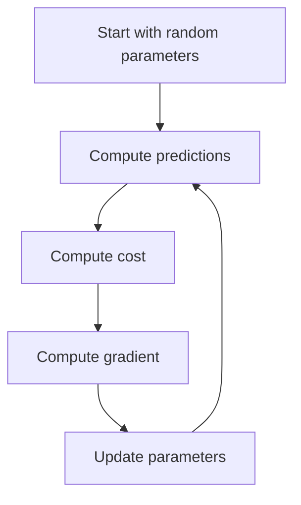
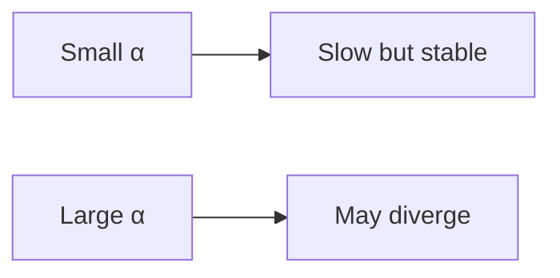
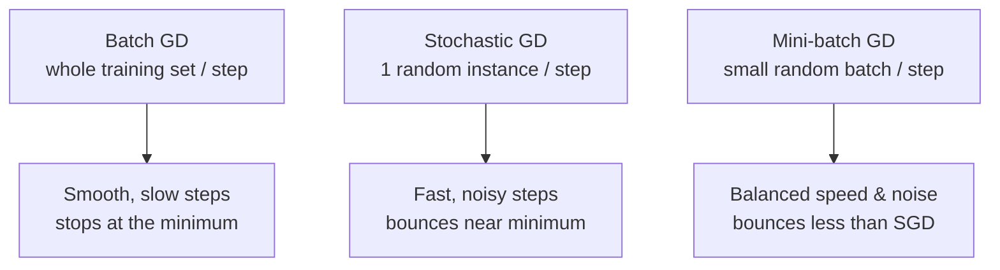

## What gradient descent does

Gradient descent is a method to minimize a cost function.

It works by repeating:

1. compute direction of steepest increase (gradient)
2. step in the opposite direction (downhill)



## The update rule

For parameter `w`:

`w := w - α * (∂Cost/∂w)`

Where:

- `α` is the learning rate

## Learning rate intuition

- too small → slow training
- too large → overshoot / diverge



## Why it matters for regression

Linear regression can be solved analytically, but gradient descent:

- generalizes to many models (logistic regression, neural nets)
- scales to large datasets

:::tip[From the book]
Picture being lost in the mountains in dense fog, feeling only the slope
under your feet. The fastest way down is to always step in the direction of
steepest descent — that's exactly what Gradient Descent does with the cost
function. It's also why **feature scaling matters**: if one feature has a
much larger range than another, the cost surface becomes an elongated bowl,
and descent zig-zags instead of heading straight for the minimum. Always
scale features (e.g. with `StandardScaler`) before running Gradient Descent.
:::

## Batch Gradient Descent

The version above is called **Batch Gradient Descent** because it computes
the gradient using the **entire training set** at every single step. That
gradient vector — one partial derivative per parameter — is:

`∇MSE(θ) = (2/m) · Xᵀ(Xθ − y)`

and the update rule just steps downhill by the learning rate `η`:

`θ(next step) = θ − η · ∇MSE(θ)`

```python title="Batch Gradient Descent from scratch" showLineNumbers{1}
import numpy as np

np.random.seed(42)
X = 2 * np.random.rand(100, 1)
y = 4 + 3 * X + np.random.randn(100, 1)
X_b = np.c_[np.ones((100, 1)), X]

eta = 0.1            # learning rate
n_iterations = 1000
m = 100
theta = np.random.randn(2, 1)   # random initialization

for iteration in range(n_iterations):
    gradients = 2 / m * X_b.T.dot(X_b.dot(theta) - y)
    theta = theta - eta * gradients

print("theta:", theta.ravel())   # should land close to [4, 3]
```

Because it scans the whole dataset every step, Batch GD is slow on very large
training sets — but it scales well with the number of *features*, so it beats
the Normal Equation once you have hundreds of thousands of features.

## Stochastic Gradient Descent (SGD)

Instead of the whole batch, **Stochastic GD** picks **one random instance**
per step and computes the gradient from just that instance. Much faster per
step, and it can even train on datasets too large to fit in memory — but the
cost bounces around instead of smoothly decreasing, so the final parameters
are good, not optimal, unless you gradually shrink the learning rate using a
**learning schedule**:

```python title="Stochastic Gradient Descent (book recipe)" showLineNumbers{1}
import numpy as np

n_epochs = 50
t0, t1 = 5, 50   # learning schedule hyperparameters

def learning_schedule(t):
    return t0 / (t + t1)

theta = np.random.randn(2, 1)

for epoch in range(n_epochs):
    for i in range(m):
        random_index = np.random.randint(m)
        xi = X_b[random_index:random_index + 1]
        yi = y[random_index:random_index + 1]
        gradients = 2 * xi.T.dot(xi.dot(theta) - yi)
        eta = learning_schedule(epoch * m + i)
        theta = theta - eta * gradients

print("theta:", theta.ravel())
```

One pass through the training set (`m` steps) is called an **epoch**. With
scikit-learn, you don't need to write this loop yourself:

```python title="SGDRegressor" showLineNumbers{1}
from sklearn.linear_model import SGDRegressor
import numpy as np

sgd_reg = SGDRegressor(max_iter=1000, tol=1e-3, penalty=None, eta0=0.1)
sgd_reg.fit(X, y.ravel())
print(sgd_reg.intercept_, sgd_reg.coef_)
```

Randomness is a double-edged sword: it helps SGD jump out of local minima on
irregular cost surfaces, but it also means the algorithm never truly settles
at the minimum — it keeps bouncing nearby.

## Mini-batch Gradient Descent

**Mini-batch GD** is the middle ground: at each step it computes the gradient
on a small random **batch** of instances (say, 32 or 64) instead of one
instance or the whole set. This gets a speed boost from vectorized matrix
operations (especially on GPUs), and its path is less erratic than plain SGD
— though, like SGD, it keeps wandering near the minimum rather than stopping
exactly on it.



## Comparing the three variants

| Algorithm | Large `m` | Large `n` | Out-of-core | Scaling required | Scikit-learn |
|---|---|---|---|---|---|
| Normal Equation | Fast | Slow | No | No | — |
| Batch GD | Slow | Fast | No | Yes | `SGDRegressor`-style loop |
| Stochastic GD | Fast | Fast | Yes | Yes | `SGDRegressor` |
| Mini-batch GD | Fast | Fast | Yes | Yes | `SGDRegressor` |

All three Gradient Descent variants end up near the same minimum for Linear
Regression (its MSE cost function is convex — one global minimum, no local
traps) — they just take very different paths and speeds to get there.

## Visualize it: batch vs stochastic vs mini-batch paths

Same starting point, same bowl-shaped cost surface, three very different
walks to the bottom: Batch GD (blue) glides in smoothly and stops right at the
minimum; Stochastic GD (amber) darts around noisily and never quite settles;
Mini-batch GD (green) is in between — faster than Batch, calmer than
Stochastic.

```p5 title="Gradient Descent paths in parameter space" desc="Batch GD takes a smooth path and stops at the minimum; Stochastic GD is noisy and keeps wandering; Mini-batch GD lands in between." height="320"
let t = 0;
const target = { x: 0.4, y: -0.3 };
let batchPath, sgdPath, mbPath;
let batchP, sgdP, mbP;
function resetPaths() {
  batchP = { x: -2.6, y: 2.2 };
  sgdP = { x: -2.6, y: 2.2 };
  mbP = { x: -2.6, y: 2.2 };
  batchPath = [{ ...batchP }];
  sgdPath = [{ ...sgdP }];
  mbPath = [{ ...mbP }];
  t = 0;
}
function setup() {
  createCanvas(600, 320);
  textFont("monospace");
  resetPaths();
}
function gx(x) { return 60 + (x + 3) / 6 * (width - 120); }
function gy(y) { return 30 + (2.6 - y) / 5.2 * (height - 90); }
function step(p, noiseAmt, lr) {
  const dx = (p.x - target.x) * lr + random(-noiseAmt, noiseAmt);
  const dy = (p.y - target.y) * lr + random(-noiseAmt, noiseAmt);
  return { x: p.x - dx, y: p.y - dy };
}
function drawContours() {
  noFill();
  for (let r = 40; r <= 260; r += 30) {
    stroke(60, 70, 84);
    strokeWeight(1);
    ellipse(gx(target.x), gy(target.y), r, r * 0.8);
  }
}
function drawPath(path, col) {
  noFill();
  stroke(col[0], col[1], col[2], 200);
  strokeWeight(2);
  beginShape();
  for (const p of path) vertex(gx(p.x), gy(p.y));
  endShape();
  noStroke();
  fill(col[0], col[1], col[2]);
  const last = path[path.length - 1];
  ellipse(gx(last.x), gy(last.y), 9, 9);
}
function draw() {
  background(13, 17, 23);
  drawContours();
  noStroke();
  fill(120, 200, 120);
  textSize(11);
  textAlign(CENTER, CENTER);
  text("min", gx(target.x), gy(target.y) - 16);

  if (t % 3 === 0 && batchPath.length < 90) {
    batchP = step(batchP, 0.0, 0.12);
    batchPath.push({ ...batchP });
  }
  if (t % 1 === 0 && sgdPath.length < 260) {
    sgdP = step(sgdP, 0.22, 0.10);
    sgdPath.push({ ...sgdP });
  }
  if (t % 2 === 0 && mbPath.length < 140) {
    mbP = step(mbP, 0.08, 0.11);
    mbPath.push({ ...mbP });
  }

  drawPath(batchPath, [75, 139, 190]);
  drawPath(sgdPath, [255, 211, 67]);
  drawPath(mbPath, [120, 200, 120]);

  fill(75, 139, 190); textAlign(LEFT, CENTER); text("● Batch GD", 12, 18);
  fill(255, 211, 67); text("● Stochastic GD", 12, 34);
  fill(120, 200, 120); text("● Mini-batch GD", 12, 50);

  t++;
  if (t > 800) resetPaths();
}
function mousePressed() { resetPaths(); }
```

## Visualize it

Gradient descent treats the loss as a **hill** and walks downhill. At each step it moves
against the slope (the gradient); where the curve is steep it takes big steps, and as it
nears the minimum the slope flattens so the steps shrink and it settles in:

```p5 title="Gradient descent rolls downhill" desc="Each step moves against the slope toward the minimum of the loss curve; the steps shrink as the slope flattens." height="280"
let x = -2.6;
const lr = 0.12;
let t = 0;
function loss(v) { return v * v; }
function grad(v) { return 2 * v; }
function setup() {
  createCanvas(600, 280);
  textFont("monospace");
}
function draw() {
  background(13, 17, 23);
  const padB = 40, padT = 20, gx = 46, gw = width - 92, gy = padT, gh = height - padT - padB;
  const px = (xx) => gx + (xx + 3) / 6 * gw;
  const py = (l) => gy + gh - (l / 9) * gh;
  stroke(60, 70, 84);
  strokeWeight(1);
  line(gx, gy + gh, gx + gw, gy + gh);
  stroke(75, 139, 190);
  strokeWeight(2.5);
  noFill();
  beginShape();
  for (let xx = -3; xx <= 3; xx += 0.1) vertex(px(xx), py(loss(xx)));
  endShape();
  noStroke();
  fill(120, 200, 120);
  textSize(11);
  textAlign(CENTER, TOP);
  text("minimum", px(0), gy + gh - 16);
  fill(255, 211, 67);
  ellipse(px(x), py(loss(x)), 20, 20);
  fill(150);
  textAlign(LEFT, CENTER);
  textSize(12);
  text("loss →", 8, gy + gh / 2);
  fill(107, 169, 221);
  textAlign(CENTER, CENTER);
  textSize(13);
  text("step " + Math.floor(t / 30) + "    loss = " + loss(x).toFixed(2), width / 2, gy + 8);
  t++;
  if (t % 30 === 0) x -= lr * grad(x);
  if (t > 30 * 22) { x = -2.6; t = 0; }
}
```

## Mini-checkpoint

If training is unstable:

- reduce learning rate
- scale features
- check for exploding gradients (in deep learning)

import DataCampExercise from "../../../../components/DataCampExercise.astro";

## 🧪 Try It Yourself

### Exercise 1 – One Batch Gradient Descent Step

<DataCampExercise
  lang="python"
  hint={`gradients = 2/m * X_b.T.dot(X_b.dot(theta) - y), then theta -= eta * gradients.`}
  code={`# Task: Exercise 1 – One Batch GD Step
import numpy as np

X_b = np.array([[1, 1], [1, 2], [1, 3]], dtype=float)
y = np.array([[3], [5], [7]], dtype=float)
theta = np.array([[0.0], [0.0]])
eta = 0.1
m = 3

gradients = 2 / m * X_b.T.dot(X_b.dot(theta) - y)
theta = theta - eta * ___   # replace ___ with gradients
print(theta.ravel())

# ── Expected Output ───────────────────────────────────────────
# [1.  2.6]
# ──────────────────────────────────────────────────────────────`}
  solution={`import numpy as np

X_b = np.array([[1, 1], [1, 2], [1, 3]], dtype=float)
y = np.array([[3], [5], [7]], dtype=float)
theta = np.array([[0.0], [0.0]])
eta = 0.1
m = 3

gradients = 2 / m * X_b.T.dot(X_b.dot(theta) - y)
theta = theta - eta * gradients
print(theta.ravel())`}
  sct={`test_output_contains("1.")
success_msg("That's one downhill step of Batch Gradient Descent!")`}
  height={168}
/>

### Exercise 2 – Learning Schedule for Stochastic GD

<DataCampExercise
  lang="python"
  hint={`The book's schedule is \`t0 / (t + t1)\` — the learning rate shrinks as \`t\` grows.`}
  code={`# Task: Exercise 2 – Learning Schedule
t0, t1 = 5, 50

def learning_schedule(t):
    return t0 / (t + ___)   # replace ___ with t1

print(round(learning_schedule(0), 3))
print(round(learning_schedule(100), 3))

# ── Expected Output ───────────────────────────────────────────
# 0.1
# 0.033
# ──────────────────────────────────────────────────────────────`}
  solution={`t0, t1 = 5, 50

def learning_schedule(t):
    return t0 / (t + t1)

print(round(learning_schedule(0), 3))
print(round(learning_schedule(100), 3))`}
  sct={`test_output_contains("0.1")
success_msg("The learning rate shrinks over time, just like simulated annealing!")`}
  height={158}
/>

### Exercise 3 – Train with SGDRegressor

<DataCampExercise
  lang="python"
  hint={`\`SGDRegressor(...).fit(X, y.ravel())\` — remember SGD needs a 1D target, so \`.ravel()\` the labels.`}
  code={`# Task: Exercise 3 – SGDRegressor
from sklearn.linear_model import SGDRegressor
import numpy as np

np.random.seed(0)
X = 2 * np.random.rand(50, 1)
y = 4 + 3 * X + np.random.randn(50, 1)

sgd_reg = SGDRegressor(max_iter=1000, tol=1e-3, penalty=None, eta0=0.1)
sgd_reg.___(X, y.ravel())   # replace ___ with fit
print("coef close to 3:", abs(sgd_reg.coef_[0] - 3) < 1)

# ── Expected Output ───────────────────────────────────────────
# coef close to 3: True
# ──────────────────────────────────────────────────────────────`}
  solution={`from sklearn.linear_model import SGDRegressor
import numpy as np

np.random.seed(0)
X = 2 * np.random.rand(50, 1)
y = 4 + 3 * X + np.random.randn(50, 1)

sgd_reg = SGDRegressor(max_iter=1000, tol=1e-3, penalty=None, eta0=0.1)
sgd_reg.fit(X, y.ravel())
print("coef close to 3:", abs(sgd_reg.coef_[0] - 3) < 1)`}
  sct={`test_output_contains("True")
success_msg("SGDRegressor converges near the Normal Equation's solution!")`}
  height={168}
/>

## Next

Continue to **Regularization - Ridge and Lasso Regression** — constrain the
weights that Gradient Descent finds so the model doesn't overfit.
