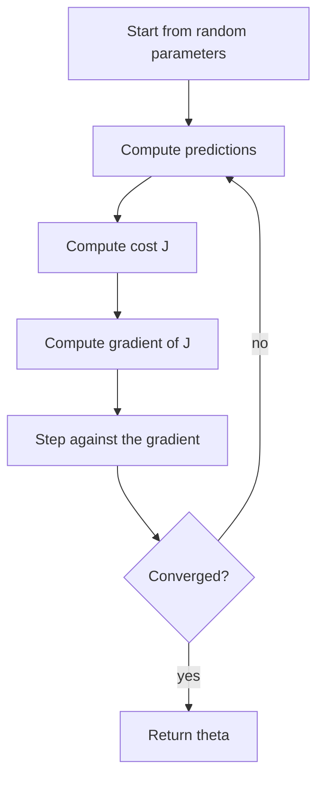
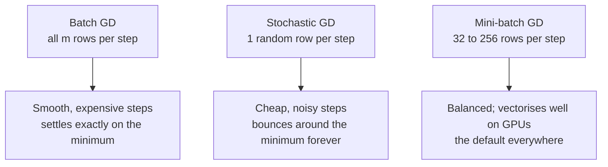

## What you'll learn

- the update rule $\boldsymbol{\theta} \leftarrow \boldsymbol{\theta} - \alpha\nabla J$, derived rather than asserted
- two full iterations computed **by hand**, matching NumPy to four decimals
- the exact threshold at which a learning rate stops converging and starts exploding
- **batch**, **stochastic** and **mini-batch** descent — the real trade-off between them
- why feature scaling turns a slow ravine into a fast bowl
- learning schedules, and when to stop

## Intuition

You are standing on a hillside in fog. You cannot see the valley floor, but you can feel which way
the ground slopes under your feet. Take a step downhill. Feel again. Step again.

That is the entire algorithm. The gradient is the direction of steepest *ascent*, so you move
against it. The learning rate is how long a stride you take. Everything else — momentum, Adam,
schedules — is refinement of those two sentences.



The Normal Equation from
[Multiple Linear Regression](/machine-learning/phase-03---supervised-learning---regression/multiple-linear-regression/)
already solves linear regression exactly, so why iterate at all? Because inverting an
$n \times n$ matrix costs roughly $O(n^3)$. At 100,000 features that is hopeless, and for models
with no closed form at all — logistic regression, neural networks, gradient boosting — iteration is
the only option. Gradient descent is the workhorse of the entire field; linear regression is just
the clearest place to learn it.

## The math

### The update rule

For a cost $J(\boldsymbol{\theta})$, the gradient collects the partial derivatives:

$$
\nabla_{\boldsymbol{\theta}} J =
\begin{bmatrix}
\dfrac{\partial J}{\partial \theta_0} &
\dfrac{\partial J}{\partial \theta_1} &
\cdots &
\dfrac{\partial J}{\partial \theta_n}
\end{bmatrix}^\top
$$

and each iteration steps against it:

$$
\boxed{\;\boldsymbol{\theta} \leftarrow \boldsymbol{\theta} - \alpha\,\nabla_{\boldsymbol{\theta}} J(\boldsymbol{\theta})\;}
$$

$\alpha$ is the **learning rate**. It is the only hyperparameter, and it decides everything.

### The gradient of MSE

With $J(\boldsymbol{\theta}) = \frac{1}{m}\lVert\mathbf{X}\boldsymbol{\theta} - \mathbf{y}\rVert^2$,
differentiating gives a strikingly simple result:

$$
\nabla_{\boldsymbol{\theta}} J = \frac{2}{m}\mathbf{X}^\top\left(\mathbf{X}\boldsymbol{\theta} - \mathbf{y}\right)
$$

Read it as English: *the residual vector, projected back onto the features, scaled by two over the
sample count.* Every feature gets pushed in proportion to how much it contributed to the current
error.

:::note[Where this comes from]
The gradient of a quadratic form is derived in
[Useful Identities for Computing Gradients](/mathematics-for-machine-learning/chapter-05---vector-calculus/useful-identities-for-computing-gradients/),
and the geometric claim that the gradient points uphill is developed in
[Partial Differentiation and Gradients](/mathematics-for-machine-learning/chapter-05---vector-calculus/partial-differentiation-and-gradients/).
:::

### When does it actually converge?

This is the part most tutorials skip. For a quadratic cost with Hessian
$\mathbf{H} = \frac{2}{m}\mathbf{X}^\top\mathbf{X}$, gradient descent converges **if and only if**

$$
0 < \alpha < \frac{2}{\lambda_{\max}(\mathbf{H})}
$$

where $\lambda_{\max}$ is the largest eigenvalue. Above that threshold each step overshoots by more
than it corrects and the parameters diverge geometrically. The **condition number**
$\kappa = \lambda_{\max}/\lambda_{\min}$ then decides how *fast* convergence happens: a
$\kappa$ of 1 is a round bowl and descent goes straight in, while a $\kappa$ of 1,000 is a narrow
ravine that forces a zig-zag.

Both facts have the same practical consequence, and it is the reason for the whole preprocessing
phase: **scale your features**.

## Worked example by hand

The five-point dataset with the feature centred ($x_c = x - 3$), so the Hessian is diagonal and the
arithmetic stays exact. Parameters are $[b, w]$, starting from $[0, 0]$, with $\alpha = 0.2$.

| $i$ | $x_c$ | $y$ |
| --- | --- | --- |
| 1 | −2 | 2 |
| 2 | −1 | 4 |
| 3 | 0 | 5 |
| 4 | 1 | 4 |
| 5 | 2 | 5 |

**The Hessian, and the stability limit.**

$$
\mathbf{H} = \frac{2}{5}\mathbf{X}^\top\mathbf{X}
= \frac{2}{5}\begin{bmatrix} 5 & 0 \\ 0 & 10 \end{bmatrix}
= \begin{bmatrix} 2 & 0 \\ 0 & 4 \end{bmatrix}
$$

Eigenvalues 2 and 4, so descent diverges for any $\alpha \geq 2/4 = 0.5$. Our 0.2 is comfortably
inside. The optimum is $[b, w] = [4, 0.6]$.

**Iteration 0.** With $\boldsymbol{\theta} = [0, 0]$ every prediction is 0, so the residual is
$-\mathbf{y}$:

$$
\mathbf{X}^\top(\mathbf{X}\boldsymbol{\theta} - \mathbf{y}) =
\begin{bmatrix} -(2{+}4{+}5{+}4{+}5) \\ (-2)(-2) + (-1)(-4) + 0 + (1)(-4) + (2)(-5) \end{bmatrix}
= \begin{bmatrix} -20 \\ -6 \end{bmatrix}
$$

$$
\nabla J = \tfrac{2}{5}\begin{bmatrix} -20 \\ -6 \end{bmatrix} = \begin{bmatrix} -8 \\ -2.4 \end{bmatrix},
\qquad
\boldsymbol{\theta} \leftarrow \begin{bmatrix} 0 \\ 0 \end{bmatrix} - 0.2\begin{bmatrix} -8 \\ -2.4 \end{bmatrix}
= \begin{bmatrix} 1.6 \\ 0.48 \end{bmatrix}
$$

**Iteration 1.** Predictions are now $1.6 + 0.48x_c$, giving residuals
$[-1.36, -2.88, -3.4, -1.92, -2.44]$:

$$
\nabla J = \tfrac{2}{5}\begin{bmatrix} -12 \\ -1.2 \end{bmatrix} = \begin{bmatrix} -4.8 \\ -0.48 \end{bmatrix},
\qquad
\boldsymbol{\theta} \leftarrow \begin{bmatrix} 2.56 \\ 0.576 \end{bmatrix}
$$

**The cost falling.**

| step | $b$ | $w$ | MSE |
| --- | --- | --- | --- |
| 0 | 0.000 | 0.0000 | 17.2000 |
| 1 | 1.600 | 0.4800 | 6.2688 |
| 2 | 2.560 | 0.5760 | 2.5548 |
| 3 | 3.136 | 0.5952 | 1.2265 |
| ⋮ | ⋮ | ⋮ | ⋮ |
| ∞ | 4.000 | 0.6000 | 0.4800 |

The slope reaches its final value almost immediately while the intercept takes far longer. That is
the condition number in action: the eigenvalue along $w$ is twice the eigenvalue along $b$, so the
same $\alpha$ makes twice the progress in that direction.

## The learning rate

<Figure
  src="/images/ml/phase-03-regression/gradient-descent-explained/learning-rate-paths"
  alt="Contour plot of the cost over intercept and slope with three descent paths from the same start: a short green path that stops well short, a blue path reaching the minimum, and a red path oscillating across the valley before settling."
  title="Same start, three learning rates, 70 steps each"
  caption="Green (0.03) is still travelling when the budget runs out. Blue (0.20) walks in cleanly. Red (0.46) is near the stability limit of 0.5 and ricochets across the valley on every step."
/>

<Figure
  src="/images/ml/phase-03-regression/gradient-descent-explained/convergence-curves"
  alt="Cost against iteration on a log scale for four learning rates. Three curves descend to the minimum at different speeds; the fourth climbs off the top of the chart."
  title="The learning curve tells you immediately which rate is wrong"
  caption="Plot cost against iteration for every run. Flat and high means the rate is too small; a rising line means it is above the stability threshold."
/>

### Reading the plots

| What you see | What it means | What to do |
| --- | --- | --- |
| Cost falls smoothly to a plateau | Healthy | Nothing |
| Cost falls, very slowly | $\alpha$ too small | Multiply by 3 |
| Cost oscillates but trends down | $\alpha$ just under the limit | Halve it |
| Cost rises or hits `nan` | $\alpha$ above $2/\lambda_{\max}$ | Divide by 10 |
| Cost falls then flattens high | Underfitting, not an $\alpha$ problem | More features or capacity |

A practical recipe: try $\alpha \in \{0.001, 0.01, 0.1, 1\}$, plot all four cost curves on one log
axis, and take the largest rate that still descends smoothly.

```p5 title="Gradient descent rolls downhill" desc="Each step moves against the slope toward the minimum of the loss curve; the steps shrink as the slope flattens." height="280"
let x = -2.6;
const lr = 0.12;
let t = 0;
function loss(v) { return v * v; }
function grad(v) { return 2 * v; }
function setup() {
  createCanvas(600, 280);
  textFont("monospace");
}
function draw() {
  background(13, 17, 23);
  const padB = 40, padT = 20, gx = 46, gw = width - 92, gy = padT, gh = height - padT - padB;
  const px = (xx) => gx + (xx + 3) / 6 * gw;
  const py = (l) => gy + gh - (l / 9) * gh;
  stroke(60, 70, 84);
  strokeWeight(1);
  line(gx, gy + gh, gx + gw, gy + gh);
  stroke(75, 139, 190);
  strokeWeight(2.5);
  noFill();
  beginShape();
  for (let xx = -3; xx <= 3; xx += 0.1) vertex(px(xx), py(loss(xx)));
  endShape();
  noStroke();
  fill(120, 200, 120);
  textSize(11);
  textAlign(CENTER, TOP);
  text("minimum", px(0), gy + gh - 16);
  fill(255, 211, 67);
  ellipse(px(x), py(loss(x)), 20, 20);
  fill(150);
  textAlign(LEFT, CENTER);
  textSize(12);
  text("loss →", 8, gy + gh / 2);
  fill(107, 169, 221);
  textAlign(CENTER, CENTER);
  textSize(13);
  text("step " + Math.floor(t / 30) + "    loss = " + loss(x).toFixed(2), width / 2, gy + 8);
  t++;
  if (t % 30 === 0) x -= lr * grad(x);
  if (t > 30 * 22) { x = -2.6; t = 0; }
}
```

Notice the steps shrinking on their own as the curve flattens. The learning rate never changes —
the *gradient* shrinks near the minimum, so descent automatically slows down as it arrives.

## Why scaling matters

<Figure
  src="/images/ml/phase-03-regression/gradient-descent-explained/scaling-contours"
  alt="Two contour plots. Left, stretched elliptical contours with a descent path zig-zagging violently down a narrow valley. Right, circular contours with a descent path running straight to the centre."
  title="The same optimisation problem, before and after scaling"
  caption="Steepest descent goes perpendicular to the contour it stands on. In a ravine that direction points across the valley rather than along it, so the path bounces off the walls and creeps toward the minimum."
/>

Unscaled features produce an elongated cost surface, and the negative gradient points across the
valley rather than down it. Standardising makes the contours near-circular and lets descent walk
straight in — often an order of magnitude fewer iterations, from the same code.

```python title="scaling_and_sgd.py" showLineNumbers{1}
from sklearn.datasets import load_diabetes
from sklearn.linear_model import SGDRegressor
from sklearn.model_selection import train_test_split
from sklearn.pipeline import make_pipeline
from sklearn.preprocessing import StandardScaler

X, y = load_diabetes(return_X_y=True)
X_train, X_test, y_train, y_test = train_test_split(
    X, y, test_size=0.3, random_state=42
)

scaled = make_pipeline(
    StandardScaler(),
    SGDRegressor(max_iter=2000, tol=1e-4, eta0=0.01, random_state=0),
).fit(X_train, y_train)

raw = SGDRegressor(
    max_iter=2000, tol=1e-4, eta0=0.01, random_state=0
).fit(X_train, y_train)

print(f"scaled   R^2 = {scaled.score(X_test, y_test):.4f}")  # 0.4767
print(f"unscaled R^2 = {raw.score(X_test, y_test):.4f}")     # 0.4554
print(f"epochs used  = {scaled[-1].n_iter_}")                # 27
```

The scaled pipeline converges in 27 epochs and lands on 0.4767 — indistinguishable from the exact
Normal Equation answer of 0.4773. The unscaled version burns all 2,000 epochs, emits a convergence
warning, and still ends up worse.

## The three variants

How much data does one gradient use?



$$
\text{Batch: } \nabla J = \frac{2}{m}\mathbf{X}^\top(\mathbf{X}\boldsymbol{\theta} - \mathbf{y})
\qquad
\text{SGD: } \nabla J^{(i)} = 2\,\mathbf{x}^{(i)}\!\left(\boldsymbol{\theta}^\top\mathbf{x}^{(i)} - y^{(i)}\right)
$$

The stochastic gradient is an *unbiased estimate* of the batch gradient — right on average, wrong
on any individual step. That noise is not purely a cost: it lets SGD escape shallow local minima
that would trap batch descent on non-convex problems, which is exactly why deep learning uses it.

| | Batch | Stochastic | Mini-batch |
| --- | --- | --- | --- |
| Rows per step | $m$ | 1 | 32–256 |
| Cost per step | High | Very low | Low |
| Path | Smooth | Very noisy | Slightly noisy |
| Settles exactly? | Yes | No, needs a schedule | Nearly |
| Out-of-core | No | Yes | Yes |
| Hardware fit | Poor | Poor | Excellent |
| scikit-learn | `LinearRegression` | `SGDRegressor` | `SGDRegressor.partial_fit` |

```p5 title="Gradient descent paths in parameter space" desc="Batch GD takes a smooth path and stops at the minimum; Stochastic GD is noisy and keeps wandering; Mini-batch GD lands in between. Click to restart." height="320"
let t = 0;
const target = { x: 0.4, y: -0.3 };
let batchPath, sgdPath, mbPath;
let batchP, sgdP, mbP;
function resetPaths() {
  batchP = { x: -2.6, y: 2.2 };
  sgdP = { x: -2.6, y: 2.2 };
  mbP = { x: -2.6, y: 2.2 };
  batchPath = [{ ...batchP }];
  sgdPath = [{ ...sgdP }];
  mbPath = [{ ...mbP }];
  t = 0;
}
function setup() {
  createCanvas(600, 320);
  textFont("monospace");
  resetPaths();
}
function gx(x) { return 60 + (x + 3) / 6 * (width - 120); }
function gy(y) { return 30 + (2.6 - y) / 5.2 * (height - 90); }
function step(p, noiseAmt, lr) {
  const dx = (p.x - target.x) * lr + random(-noiseAmt, noiseAmt);
  const dy = (p.y - target.y) * lr + random(-noiseAmt, noiseAmt);
  return { x: p.x - dx, y: p.y - dy };
}
function drawContours() {
  noFill();
  for (let r = 40; r <= 260; r += 30) {
    stroke(60, 70, 84);
    strokeWeight(1);
    ellipse(gx(target.x), gy(target.y), r, r * 0.8);
  }
}
function drawPath(path, col) {
  noFill();
  stroke(col[0], col[1], col[2], 200);
  strokeWeight(2);
  beginShape();
  for (const p of path) vertex(gx(p.x), gy(p.y));
  endShape();
  noStroke();
  fill(col[0], col[1], col[2]);
  const last = path[path.length - 1];
  ellipse(gx(last.x), gy(last.y), 9, 9);
}
function draw() {
  background(13, 17, 23);
  drawContours();
  noStroke();
  fill(120, 200, 120);
  textSize(11);
  textAlign(CENTER, CENTER);
  text("min", gx(target.x), gy(target.y) - 16);

  if (t % 3 === 0 && batchPath.length < 90) {
    batchP = step(batchP, 0.0, 0.12);
    batchPath.push({ ...batchP });
  }
  if (t % 1 === 0 && sgdPath.length < 260) {
    sgdP = step(sgdP, 0.22, 0.10);
    sgdPath.push({ ...sgdP });
  }
  if (t % 2 === 0 && mbPath.length < 140) {
    mbP = step(mbP, 0.08, 0.11);
    mbPath.push({ ...mbP });
  }

  drawPath(batchPath, [75, 139, 190]);
  drawPath(sgdPath, [255, 211, 67]);
  drawPath(mbPath, [120, 200, 120]);

  fill(75, 139, 190); textAlign(LEFT, CENTER); text("● Batch GD", 12, 18);
  fill(255, 211, 67); text("● Stochastic GD", 12, 34);
  fill(120, 200, 120); text("● Mini-batch GD", 12, 50);

  t++;
  if (t > 800) resetPaths();
}
function mousePressed() { resetPaths(); }
```

### Learning schedules

Because SGD never settles, the standard fix is to shrink the learning rate over time:

$$
\alpha_t = \frac{\alpha_0}{1 + \text{decay} \cdot t}
$$

Early on the steps are long enough to cover ground; later they are short enough to sit still. Decay
too fast and it freezes before arriving; too slowly and it keeps bouncing. `SGDRegressor` exposes
this as `learning_rate="invscaling"` with `eta0` and `power_t`.

## From scratch

```python title="gradient_descent.py" showLineNumbers{1}
import numpy as np


def batch_gradient_descent(X, y, lr=0.2, n_iter=50):
    """Plain batch gradient descent. X must already include the bias column."""
    m = len(y)
    theta = np.zeros(X.shape[1])
    history = []

    for _ in range(n_iter):
        residual = X @ theta - y
        history.append(float((residual**2).mean()))
        gradient = (2 / m) * X.T @ residual
        theta = theta - lr * gradient

    return theta, history


x_centred = np.array([1.0, 2.0, 3.0, 4.0, 5.0]) - 3.0
X = np.c_[np.ones(5), x_centred]
y = np.array([2.0, 4.0, 5.0, 4.0, 5.0])

theta, history = batch_gradient_descent(X, y, lr=0.2, n_iter=50)

print(theta.round(4))            # [4.  0.6]
print([round(h, 4) for h in history[:4]])
# [17.2, 6.2688, 2.5548, 1.2265]

# The stability limit, computed rather than guessed
hessian = (2 / len(y)) * X.T @ X
print(f"max stable lr = {2 / np.linalg.eigvalsh(hessian).max():.3f}")   # 0.500
```

The first four cost values reproduce the hand-computed table exactly, and after 50 iterations the
parameters have reached the Normal Equation's answer of $[4, 0.6]$.

<AlgorithmCard
  name="Batch Gradient Descent"
  type="Optimisation · First-order"
  sklearn="sklearn.linear_model.SGDRegressor (stochastic and mini-batch variants)"
  assumptions={[
    "The cost is differentiable with respect to the parameters",
    "The learning rate is below 2 over the largest Hessian eigenvalue",
    "Features are on comparable scales, or convergence will be slow",
  ]}
  complexity={{ train: "O(m·n) per iteration", predict: "O(n)", memory: "O(n)" }}
  notation="m = samples, n = features; total cost is per-iteration cost times the iteration count"
  hyperparams={[
    { name: "learning_rate (alpha, eta0)", default: "0.01", effect: "The one that matters. Too small crawls, too large diverges. Tune on a log grid." },
    { name: "max_iter", default: "1000", effect: "Iteration budget. Pair it with tol so training stops when progress stalls." },
    { name: "tol", default: "1e-3", effect: "Stop when the loss improves by less than this for n_iter_no_change epochs." },
    { name: "batch size", default: "1 for SGDRegressor", effect: "Larger batches mean smoother gradients and better hardware use; 32 to 256 is the usual range." },
  ]}
  useWhen={[
    "You have too many features for a closed-form solution",
    "The data does not fit in memory and must stream",
    "The model has no closed form at all — logistic regression, neural networks",
    "You want to warm-start or update a model online",
  ]}
  avoidWhen={[
    "The problem is small and a closed form exists — just use LinearRegression",
    "You cannot scale the features",
    "You need bit-for-bit reproducibility without pinning every random seed",
  ]}
/>

## Pitfalls

:::danger[Not scaling before gradient descent]
This is the single most common mistake. With features spanning wildly different ranges the cost
surface becomes a ravine, and descent either crawls or diverges. Put `StandardScaler` in the
pipeline. Note this does *not* apply to the Normal Equation, which is scale-invariant — a genuine
difference between the two methods.
:::

:::caution[A cost that is `nan` means the learning rate, not the data]
Divergence overflows to infinity within a handful of steps. Before hunting for bad rows, divide
$\alpha$ by 10 and rerun.
:::

:::caution[Never use the test set as your convergence check]
Watching test loss to decide when to stop leaks the test set into training. Hold out a separate
validation split, or use the training-loss plateau via `tol`.
:::

:::caution[SGD without a schedule never settles]
A constant learning rate leaves stochastic descent bouncing around the minimum indefinitely. It may
be close enough — but if you need the actual optimum, decay the rate.
:::

<Quiz
  questions={[
    {
      q: "Why does the update rule subtract the gradient instead of adding it?",
      options: [
        "To keep the parameters positive",
        "Because the gradient points in the direction of steepest increase, and we want to decrease the cost",
        "Because of the minus sign in the residual",
        "It is a convention with no mathematical basis",
      ],
      answer: 1,
      explain: "The gradient is the direction of steepest ascent. Minimising means walking the other way.",
    },
    {
      q: "Your cost becomes nan after four iterations. What is the most likely cause?",
      options: [
        "The dataset contains missing values",
        "The learning rate exceeds the stability threshold, so each step overshoots more than the last",
        "You need more iterations",
        "The features are correlated",
      ],
      answer: 1,
      explain: "Above 2 divided by the largest Hessian eigenvalue, the iteration diverges geometrically and overflows within a few steps. Reduce the learning rate by a factor of ten.",
    },
    {
      q: "What is the practical effect of feature scaling on gradient descent?",
      options: [
        "It changes the final fitted parameters to better values",
        "It makes the cost contours rounder, so descent needs far fewer iterations to reach the same minimum",
        "It removes the need for a learning rate",
        "It has no effect; scaling only matters for the Normal Equation",
      ],
      answer: 1,
      explain: "Scaling does not change where the minimum is in terms of predictions — it changes the shape of the path to it. Rounder contours mean the negative gradient points at the minimum instead of across the valley.",
    },
    {
      q: "Why does stochastic gradient descent still work despite using one row per step?",
      options: [
        "Because one row is usually representative of the whole dataset",
        "Because the single-row gradient is an unbiased estimate of the full gradient, so the noise averages out over many steps",
        "Because the learning rate compensates for the missing data",
        "It does not work; it only approximates the answer badly",
      ],
      answer: 1,
      explain: "Each step is wrong individually but right on average. Over many cheap steps the errors cancel, and the noise even helps escape shallow minima on non-convex problems.",
    },
  ]}
/>

## 🧪 Try It Yourself

### Exercise 1 – One batch gradient step

<DataCampExercise
  lang="python"
  hint={`The gradient is (2 / m) * X.T @ (X @ theta - y).`}
  code={`# Task: Exercise 1 - One batch gradient step
import numpy as np

X = np.c_[np.ones(5), np.array([1.0, 2, 3, 4, 5]) - 3]
y = np.array([2.0, 4, 5, 4, 5])
theta = np.zeros(2)
lr = 0.2

grad = (2 / len(y)) * X.T @ (X @ theta - ___)   # replace ___ with y
theta = theta - lr * grad

print("gradient:", grad)
print("theta:", theta)

# -- Expected Output -------------------------------------------
# gradient: [-8.  -2.4]
# theta: [1.6  0.48]
# --------------------------------------------------------------`}
  solution={`import numpy as np

X = np.c_[np.ones(5), np.array([1.0, 2, 3, 4, 5]) - 3]
y = np.array([2.0, 4, 5, 4, 5])
theta = np.zeros(2)
lr = 0.2
grad = (2 / len(y)) * X.T @ (X @ theta - y)
theta = theta - lr * grad
print("gradient:", grad)
print("theta:", theta)`}
  sct={`test_output_contains("1.6")
success_msg("Exactly the first row of the hand-computed table.")`}
  height={178}
/>

### Exercise 2 – Watch the cost fall

<DataCampExercise
  lang="python"
  hint={`Loop the same two lines; record the MSE before each update.`}
  code={`# Task: Exercise 2 - Watch the cost fall
import numpy as np

X = np.c_[np.ones(5), np.array([1.0, 2, 3, 4, 5]) - 3]
y = np.array([2.0, 4, 5, 4, 5])
theta = np.zeros(2)

for step in range(4):
    resid = X @ theta - y
    print(f"step {step}  MSE = {(resid ** 2).___():.4f}")   # replace ___ with mean
    theta = theta - 0.2 * (2 / len(y)) * X.T @ resid

# -- Expected Output -------------------------------------------
# step 0  MSE = 17.2000
# step 1  MSE = 6.2688
# step 2  MSE = 2.5548
# step 3  MSE = 1.2265
# --------------------------------------------------------------`}
  solution={`import numpy as np

X = np.c_[np.ones(5), np.array([1.0, 2, 3, 4, 5]) - 3]
y = np.array([2.0, 4, 5, 4, 5])
theta = np.zeros(2)

for step in range(4):
    resid = X @ theta - y
    print(f"step {step}  MSE = {(resid ** 2).mean():.4f}")
    theta = theta - 0.2 * (2 / len(y)) * X.T @ resid`}
  sct={`test_output_contains("step 3  MSE = 1.2265")
success_msg("Monotone decrease — the signature of a well-chosen learning rate.")`}
  height={198}
/>

### Exercise 3 – Compute the stability limit

<DataCampExercise
  lang="python"
  hint={`np.linalg.eigvalsh returns the eigenvalues of a symmetric matrix.`}
  code={`# Task: Exercise 3 - Compute the stability limit
import numpy as np

X = np.c_[np.ones(5), np.array([1.0, 2, 3, 4, 5]) - 3]
y = np.array([2.0, 4, 5, 4, 5])

hessian = (2 / len(y)) * X.T @ X
eigenvalues = np.linalg.___(hessian)      # replace ___ with eigvalsh

print("eigenvalues:", eigenvalues)
print("max stable lr:", round(2 / eigenvalues.max(), 3))

# -- Expected Output -------------------------------------------
# eigenvalues: [2. 4.]
# max stable lr: 0.5
# --------------------------------------------------------------`}
  solution={`import numpy as np

X = np.c_[np.ones(5), np.array([1.0, 2, 3, 4, 5]) - 3]
y = np.array([2.0, 4, 5, 4, 5])
hessian = (2 / len(y)) * X.T @ X
eigenvalues = np.linalg.eigvalsh(hessian)
print("eigenvalues:", eigenvalues)
print("max stable lr:", round(2 / eigenvalues.max(), 3))`}
  sct={`test_output_contains("max stable lr: 0.5")
success_msg("Now you can pick a learning rate instead of guessing one.")`}
  height={178}
/>

### Exercise 4 – Push it past the limit

<DataCampExercise
  lang="python"
  hint={`Run the same loop with a rate above 0.5 and watch the cost climb.`}
  code={`# Task: Exercise 4 - Push it past the limit
import numpy as np

X = np.c_[np.ones(5), np.array([1.0, 2, 3, 4, 5]) - 3]
y = np.array([2.0, 4, 5, 4, 5])

def run(lr, steps=20):
    theta = np.zeros(2)
    for _ in range(steps):
        theta = theta - lr * (2 / len(y)) * X.T @ (X @ theta - y)
    return float(((X @ theta - y) ** 2).mean())

print("lr=0.20 ->", round(run(0.20), 4))
print("lr=0.60 ->", round(run(___), 1))     # replace ___ with 0.60
print("diverged:", run(0.60) > run(0.20))

# -- Expected Output -------------------------------------------
# lr=0.20 -> 0.48
# lr=0.60 -> 504027.6
# diverged: True
# --------------------------------------------------------------`}
  solution={`import numpy as np

X = np.c_[np.ones(5), np.array([1.0, 2, 3, 4, 5]) - 3]
y = np.array([2.0, 4, 5, 4, 5])

def run(lr, steps=20):
    theta = np.zeros(2)
    for _ in range(steps):
        theta = theta - lr * (2 / len(y)) * X.T @ (X @ theta - y)
    return float(((X @ theta - y) ** 2).mean())

print("lr=0.20 ->", round(run(0.20), 4))
print("lr=0.60 ->", round(run(0.60), 1))
print("diverged:", run(0.60) > run(0.20))`}
  sct={`test_output_contains("diverged: True")
success_msg("Above 2 over the largest eigenvalue, every step makes things worse.")`}
  height={218}
/>

### Exercise 5 – Scaling changes everything for SGD

<DataCampExercise
  lang="python"
  hint={`Wrap SGDRegressor in make_pipeline with StandardScaler and compare the scores.`}
  code={`# Task: Exercise 5 - Scaling changes everything for SGD
from sklearn.datasets import load_diabetes
from sklearn.linear_model import SGDRegressor
from sklearn.model_selection import train_test_split
from sklearn.pipeline import make_pipeline
from sklearn.preprocessing import ___         # replace ___ with StandardScaler

X, y = load_diabetes(return_X_y=True)
X_tr, X_te, y_tr, y_te = train_test_split(X, y, test_size=0.3, random_state=42)

scaled = make_pipeline(
    StandardScaler(),
    SGDRegressor(max_iter=2000, tol=1e-4, eta0=0.01, random_state=0),
).fit(X_tr, y_tr)

raw = SGDRegressor(max_iter=2000, tol=1e-4, eta0=0.01,
                   random_state=0).fit(X_tr, y_tr)

print("scaled R2:", round(scaled.score(X_te, y_te), 4))
print("raw    R2:", round(raw.score(X_te, y_te), 4))
print("scaling helped:", scaled.score(X_te, y_te) > raw.score(X_te, y_te))

# -- Expected Output -------------------------------------------
# scaled R2: 0.4767
# raw    R2: 0.4554
# scaling helped: True
# --------------------------------------------------------------`}
  solution={`from sklearn.datasets import load_diabetes
from sklearn.linear_model import SGDRegressor
from sklearn.model_selection import train_test_split
from sklearn.pipeline import make_pipeline
from sklearn.preprocessing import StandardScaler

X, y = load_diabetes(return_X_y=True)
X_tr, X_te, y_tr, y_te = train_test_split(X, y, test_size=0.3, random_state=42)
scaled = make_pipeline(
    StandardScaler(),
    SGDRegressor(max_iter=2000, tol=1e-4, eta0=0.01, random_state=0),
).fit(X_tr, y_tr)
raw = SGDRegressor(max_iter=2000, tol=1e-4, eta0=0.01,
                   random_state=0).fit(X_tr, y_tr)
print("scaled R2:", round(scaled.score(X_te, y_te), 4))
print("raw    R2:", round(raw.score(X_te, y_te), 4))
print("scaling helped:", scaled.score(X_te, y_te) > raw.score(X_te, y_te))`}
  sct={`test_output_contains("scaling helped: True")
success_msg("27 epochs scaled, versus 2000 epochs and a convergence warning unscaled.")`}
  height={238}
/>

## Recap

- The update rule is $\boldsymbol{\theta} \leftarrow \boldsymbol{\theta} - \alpha\nabla J$, and for
  MSE the gradient is $\frac{2}{m}\mathbf{X}^\top(\mathbf{X}\boldsymbol{\theta} - \mathbf{y})$.
- Convergence requires $\alpha < 2/\lambda_{\max}(\mathbf{H})$ — on the worked example, 0.5.
- Two hand iterations at $\alpha = 0.2$ take the cost from 17.20 to 6.27 to 2.55, matching NumPy
  exactly.
- Scaling controls the condition number, which controls how many iterations you pay for.
- Batch is smooth and expensive, stochastic is noisy and cheap, mini-batch is the default.
- Plot cost against iteration on every run; the shape of that curve diagnoses the learning rate
  immediately.

### Exercise 6 – Find the learning rate that breaks it

<DataCampExercise
  lang="python"
  hint={`The bound is 2 divided by the largest eigenvalue of the Hessian. np.linalg.eigvalsh returns them in ascending order.`}
  code={`# Task: Exercise 6 - Find the learning rate that breaks it
import numpy as np

X_gd = np.array([[1.0, 1.0], [1.0, 2.0], [1.0, 3.0], [1.0, 4.0]])
y_gd = np.array([2.0, 4.0, 6.0, 8.0])
m = len(y_gd)
hessian = (2 / m) * X_gd.T @ X_gd
limit = 2 / np.linalg.___(hessian).max()      # replace ___ with eigvalsh
print(f"largest eigenvalue of the Hessian: {np.linalg.eigvalsh(hessian).max():.4f}")
print(f"convergence requires alpha below   {limit:.4f}")

for alpha in (0.05, 0.2, limit * 0.99, limit * 1.01):
    theta = np.zeros(2)
    for _ in range(200):
        gradient = (2 / m) * X_gd.T @ (X_gd @ theta - y_gd)
        theta = theta - alpha * gradient
    cost = ((X_gd @ theta - y_gd) ** 2).mean()
    state = "converged" if np.isfinite(cost) and cost < 1.0 else "DIVERGED"
    printable = f"{cost:.6f}" if np.isfinite(cost) and cost < 1e12 else "overflow"
    print(f"alpha {alpha:7.4f}  final cost {printable:>10s}  {state}")

# -- Expected Output -------------------------------------------
# largest eigenvalue of the Hessian: 16.7006
# convergence requires alpha below   0.1198
# alpha  0.0500  final cost   0.000149  converged
# alpha  0.2000  final cost   overflow  DIVERGED
# alpha  0.1186  final cost   0.009261  converged
# alpha  0.1210  final cost 82468.906499  DIVERGED
# --------------------------------------------------------------`}
  solution={`import numpy as np

X_gd = np.array([[1.0, 1.0], [1.0, 2.0], [1.0, 3.0], [1.0, 4.0]])
y_gd = np.array([2.0, 4.0, 6.0, 8.0])
m = len(y_gd)
hessian = (2 / m) * X_gd.T @ X_gd
limit = 2 / np.linalg.eigvalsh(hessian).max()
print(f"largest eigenvalue of the Hessian: {np.linalg.eigvalsh(hessian).max():.4f}")
print(f"convergence requires alpha below   {limit:.4f}")

for alpha in (0.05, 0.2, limit * 0.99, limit * 1.01):
    theta = np.zeros(2)
    for _ in range(200):
        gradient = (2 / m) * X_gd.T @ (X_gd @ theta - y_gd)
        theta = theta - alpha * gradient
    cost = ((X_gd @ theta - y_gd) ** 2).mean()
    state = "converged" if np.isfinite(cost) and cost < 1.0 else "DIVERGED"
    printable = f"{cost:.6f}" if np.isfinite(cost) and cost < 1e12 else "overflow"
    print(f"alpha {alpha:7.4f}  final cost {printable:>10s}  {state}")`}
  sct={`test_output_contains("convergence requires alpha below   0.1198")
success_msg("The bound is exact: 0.1186 converges, 0.1210 diverges, and nothing in between needs testing. Note that it depends only on the data, which is why scaling the features changes the largest usable learning rate.")`}
  height={310}
/>

## Next

Continue to
[Regularization - Ridge and Lasso Regression](/machine-learning/phase-03---supervised-learning---regression/regularization-ridge-and-lasso-regression/)
— add a penalty term to the same cost and watch overfitting recede.
