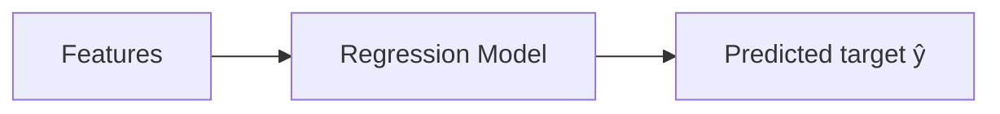
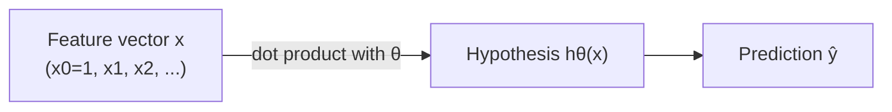
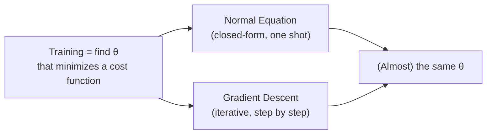

## The goal

Regression learns a function:

- inputs (features) `X`
- output (target) `y` (continuous number)

So the model can predict `ŷ` for new inputs.



## A toy example

Predict house price from size:

- `X = size_sqft`
- `y = price`

Regression tries to find a “best-fit” relationship.

## The general Linear Regression model

Géron's *Hands-On Machine Learning* opens Chapter 4 with the most general form of
a linear model: a **weighted sum of the input features, plus a bias term**:

`ŷ = θ0 + θ1x1 + θ2x2 + ... + θnxn`

- `ŷ` is the predicted value
- `n` is the number of features
- `xi` is the *i*-th feature value
- `θj` is the *j*-th model parameter, including the bias term `θ0` and the
  feature weights `θ1` to `θn`

More concisely, this is written in **vectorized form**:

`ŷ = hθ(x) = θ · x`

where `θ` is the parameter vector and `x` is the feature vector (with `x0 = 1`
so the bias term slots neatly into the dot product). `hθ` is called the
**hypothesis function** — every model in this phase (simple, multiple,
polynomial, Ridge, Lasso) is just a different way of choosing `θ` for this
same shape of equation.



To train the model, we need a way to measure how wrong it is. The book uses
**Mean Squared Error (MSE)** rather than Root Mean Squared Error (RMSE) for
one practical reason: MSE is simpler to minimize mathematically, and whatever
`θ` minimizes MSE also minimizes RMSE (square-rooting doesn't change *where*
the minimum sits). You'll meet MSE properly two lessons from now.

:::tip[From the book]
"Training a model means setting its parameters so that the model best fits
the training set." That's it — regression, at its core, is a search for the
values of `θ` that make `hθ(x)` line up with `y` as closely as possible.
:::

## Two ways to train this model

Once you have a shape for `hθ(x)`, "training" just means searching for the
`θ` that makes predictions land as close as possible to the real `y` values.
*Hands-On Machine Learning* frames the rest of this phase around **two
completely different routes** to that same destination:

- **A closed-form equation** — plug the training data into a formula and get
  `θ` back directly, in one shot. This is the **Normal Equation**, which you'll
  use by hand in the very next lessons.
- **An iterative search** — start with a random guess for `θ` and nudge it a
  little closer to the answer, step after step, until it settles near the
  minimum of the cost function. This is **Gradient Descent**.

For plain Linear Regression, both routes land on (almost) the same `θ` — the
difference is speed, and how well each approach scales as the number of
features or training instances grows.



## Common regression use-cases

- forecasting (demand, sales)
- risk modeling (credit risk)
- resource planning
- personalization (expected spend)

## Assumptions (important)

Different regression models make different assumptions.

Linear regression assumes (roughly):

- a linear relationship between features and target
- errors are random (noise)

These assumptions are often “wrong” but still useful.

## Baselines matter

Before complex models, always try:

- predicting the mean
- simple linear regression

If your fancy model doesn’t beat a baseline, something’s off.

## Visualize it

The hypothesis function `hθ(x) = θ0 + θ1x1 + θ2x2 + ... ` is just a running total:
start from the bias, then add one weighted feature at a time. Watch the bars build
up term by term for a random house, then settle into the final prediction `ŷ` —
then a new instance rolls in and it happens again:

```p5 title="Building a prediction term by term" desc="Each bar is one term of the weighted sum; they build up left-to-right until the total becomes the prediction ŷ." height="300"
let inst;
const theta = [50, 6, 18, -1.5]; // bias, w(size/100 sqft), w(bedrooms), w(age)
function newInstance() {
  inst = { size: random(5, 30), beds: floor(random(1, 6)), age: floor(random(0, 40)) };
}
function setup() {
  createCanvas(600, 300);
  textFont("monospace");
  newInstance();
}
function ease(g) { g = constrain(g, 0, 1); return g * g * (3 - 2 * g); }
function growth(t, start, dur) { return ease((t - start) / dur); }
function draw() {
  background(13, 17, 23);
  const period = 340;
  const t = frameCount % period;
  if (t === 0) newInstance();

  const terms = [theta[0], theta[1] * inst.size, theta[2] * inst.beds, theta[3] * inst.age];
  const labels = ["θ0  (bias)", "θ1 · size", "θ2 · beds", "θ3 · age"];
  const cols = [[255, 211, 67], [75, 139, 190], [120, 200, 120], [220, 120, 160]];
  const windows = [[10, 40], [50, 80], [90, 120], [130, 160]];

  const zeroX = 360, scale = 0.85, rowH = 40, top = 40;

  noStroke();
  fill(230, 230, 230);
  textAlign(LEFT, CENTER);
  textSize(12);
  text("instance: size=" + inst.size.toFixed(1) + "00 sqft   beds=" + inst.beds + "   age=" + inst.age + "y", 20, 14);

  stroke(60, 70, 84);
  strokeWeight(1);
  line(zeroX, top - 14, zeroX, top + rowH * 4 + 6);

  let runningTotal = 0;
  for (let i = 0; i < 4; i++) {
    const g = growth(t, windows[i][0], windows[i][1] - windows[i][0]);
    const val = terms[i] * g;
    const y = top + i * rowH;

    noStroke();
    fill(180);
    textAlign(RIGHT, CENTER);
    textSize(12);
    text(labels[i], 130, y);

    const barLen = constrain(val * scale, -210, 210);
    fill(cols[i][0], cols[i][1], cols[i][2]);
    rect(barLen >= 0 ? zeroX : zeroX + barLen, y - 10, Math.abs(barLen), 20);

    fill(230, 230, 230);
    textAlign(barLen >= 0 ? LEFT : RIGHT, CENTER);
    textSize(11);
    text(val.toFixed(1), barLen >= 0 ? zeroX + Math.abs(barLen) + 6 : zeroX - Math.abs(barLen) - 6, y);

    runningTotal += val;
  }

  const totalY = top + 4 * rowH + 18;
  stroke(90, 96, 110);
  line(20, totalY - 16, width - 20, totalY - 16);
  noStroke();
  fill(230, 230, 230);
  textAlign(LEFT, CENTER);
  textSize(13);
  text("ŷ = θ0 + θ1·size + θ2·beds + θ3·age", 20, totalY);
  fill(107, 169, 221);
  textSize(16);
  textAlign(RIGHT, CENTER);
  text("= " + runningTotal.toFixed(1), width - 20, totalY);
}
```

## Mini-checkpoint

Given a dataset, write down:

- your target column (y)
- 5 features (X)
- what a “good enough” error means for the business

import DataCampExercise from "../../../../components/DataCampExercise.astro";

## 🧪 Try It Yourself

### Exercise 1 – Build the Feature Vector (add x0 = 1)

<DataCampExercise
  lang="python"
  hint={`Use \`np.c_[np.ones((m, 1)), X]\` to prepend a column of 1s — this is the "x0 = 1" trick from the book that lets the bias term join the dot product.`}
  code={`# Task: Exercise 1 – Build the Feature Vector
import numpy as np

X = np.array([[2.0], [3.5], [1.0]])   # size feature, m=3 instances

# add x0 = 1 to every instance so ŷ = θ·x works as a single dot product
X_b = np.c_[np.___((3, 1)), X]   # replace ___ with ones
print(X_b)

# ── Expected Output ───────────────────────────────────────────
# [[1.  2. ]
#  [1.  3.5]
#  [1.  1. ]]
# ──────────────────────────────────────────────────────────────`}
  solution={`import numpy as np

X = np.array([[2.0], [3.5], [1.0]])
X_b = np.c_[np.ones((3, 1)), X]
print(X_b)`}
  sct={`test_output_contains("1.")
success_msg("That's the same x0 = 1 trick used throughout the chapter!")`}
  height={148}
/>

### Exercise 2 – Predict with the Hypothesis Function

<DataCampExercise
  lang="python"
  hint={`hθ(x) = θ · x. Use \`X_b.dot(theta)\` for the vectorized prediction.`}
  code={`# Task: Exercise 2 – Predict with hθ(x) = θ · x
import numpy as np

X_b = np.array([[1, 2], [1, 3.5], [1, 1]])   # [x0=1, x1]
theta = np.array([[4], [2]])                  # [bias, weight]

y_pred = X_b.___(theta)   # replace ___ with dot
print(y_pred.ravel())

# ── Expected Output ───────────────────────────────────────────
# [ 8. 11.  6.]
# ──────────────────────────────────────────────────────────────`}
  solution={`import numpy as np

X_b = np.array([[1, 2], [1, 3.5], [1, 1]])
theta = np.array([[4], [2]])
y_pred = X_b.dot(theta)
print(y_pred.ravel())`}
  sct={`test_output_contains("8")
success_msg("You just computed a hypothesis function by hand!")`}
  height={148}
/>

### Exercise 3 – Baseline: Predict the Mean

<DataCampExercise
  lang="python"
  hint={`A baseline model just predicts \`np.mean(y)\` for every input — any real model should beat this.`}
  code={`# Task: Exercise 3 – Baseline: Predict the Mean
import numpy as np

y = np.array([100, 150, 170, 210, 240])

baseline_pred = np.___(y)   # replace ___ with mean
print("Baseline prediction:", baseline_pred)

# ── Expected Output ───────────────────────────────────────────
# Baseline prediction: 174.0
# ──────────────────────────────────────────────────────────────`}
  solution={`import numpy as np

y = np.array([100, 150, 170, 210, 240])
baseline_pred = np.mean(y)
print("Baseline prediction:", baseline_pred)`}
  sct={`test_output_contains("174.0")
success_msg("Now compare any model's MSE against this baseline!")`}
  height={138}
/>

## Next

Continue to **Simple Linear Regression** — put the hypothesis function to work
with just one feature and see what the weight and bias actually mean.

