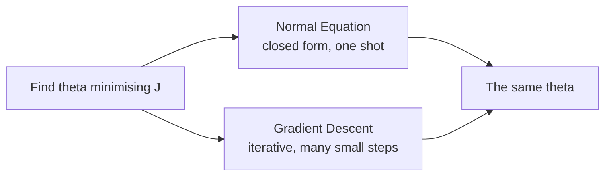

## What you'll learn

- what separates a regression problem from a classification problem
- the general linear model $\hat{y} = \boldsymbol{\theta}^\top \mathbf{x}$, and why the bias term gets folded into the feature vector
- the two ways to fit it — closed form and iterative — and when each wins
- how to compute a **baseline** first, and why a model that cannot beat it is worthless
- the assumptions behind linear regression, in the order you should check them
- the vocabulary the rest of Phase 3 relies on

## Intuition

Regression answers *how much*, not *which one*. How much will this house sell for, how many units
will ship next quarter, how many days until this machine fails. The answer is a number on a
continuous scale, and being close counts — predicting 302 when the truth is 300 is nearly right,
in a way that predicting "cat" when the truth is "dog" never is.

That single difference drives everything: the loss functions, the metrics, even the plots.

<Figure
  src="/images/ml/phase-03-regression/introduction-to-regression-analysis/regression-vs-classification"
  alt="Two panels. Left: a scatter of size against price with a fitted line, labelled regression. Right: the same feature with points at two discrete heights, labelled classification."
  title="Same features, different target type"
  caption="Regression outputs land anywhere on a line. Classification outputs land in one of a fixed set of buckets. The features can be identical; the job is not."
/>



```mermaid
flowchart LR
  D["Raw data"] --> F["Feature vector x"]
  F --> M["Model with parameters theta"]
  M --> P["Prediction y&#770; (a number)"]
  P --> C["Cost: how wrong, on average"]
  T["True target y"] --> C
  C -->|"adjust theta"| M
```

## The math

### The general linear model

With $n$ features, a linear model computes a weighted sum plus a bias:

$$
\hat{y} = \theta_0 + \theta_1 x_1 + \theta_2 x_2 + \cdots + \theta_n x_n
$$

Carrying that leading $\theta_0$ around separately is a nuisance, so by convention we prepend a
constant feature $x_0 = 1$ to every instance. The model collapses into a dot product:

$$
\hat{y} = \boldsymbol{\theta}^\top \mathbf{x}
= \sum_{j=0}^{n} \theta_j x_j,
\qquad
\mathbf{x} = \begin{bmatrix} 1 \\ x_1 \\ \vdots \\ x_n \end{bmatrix},
\quad
\boldsymbol{\theta} = \begin{bmatrix} \theta_0 \\ \theta_1 \\ \vdots \\ \theta_n \end{bmatrix}
$$

For a whole dataset of $m$ instances stacked into a matrix $\mathbf{X} \in \mathbb{R}^{m \times (n+1)}$,
all predictions at once are one matrix-vector product:

$$
\hat{\mathbf{y}} = \mathbf{X}\boldsymbol{\theta}
$$

:::note[Where this comes from]
Dot products, matrix-vector products and the geometry of projection are covered in
[Inner Products](/mathematics-for-machine-learning/chapter-03---analytic-geometry/inner-products/)
and
[Matrices](/mathematics-for-machine-learning/chapter-02---linear-algebra/matrices/)
in the Mathematics module. Least squares is literally an
[orthogonal projection](/mathematics-for-machine-learning/chapter-03---analytic-geometry/orthogonal-projections/)
of $\mathbf{y}$ onto the column space of $\mathbf{X}$.
:::

### Training means choosing $\boldsymbol{\theta}$

Fitting is a search for the parameter vector that makes a cost function smallest. Almost always
that cost is mean squared error:

$$
J(\boldsymbol{\theta}) = \frac{1}{m}\sum_{i=1}^{m}\left(\boldsymbol{\theta}^\top\mathbf{x}^{(i)} - y^{(i)}\right)^2
$$

There are exactly two routes to the minimum, and Phase 3 covers both:



| | Normal Equation | Gradient Descent |
| --- | --- | --- |
| Cost in features $n$ | $O(n^{2.4})$ to $O(n^3)$ — cubic-ish | Linear |
| Cost in samples $m$ | Linear | Linear per epoch |
| Feature scaling needed | No | Yes |
| Works out of core | No | Yes (stochastic / mini-batch) |
| Hyperparameters | None | Learning rate, epochs |
| Comfortable up to | ~10,000 features | Millions |

## Worked example by hand

Three houses, two features. Price in thousands, size in hundreds of square feet:

| $i$ | $x_0$ | size $x_1$ | bedrooms $x_2$ | actual $y$ |
| --- | --- | --- | --- | --- |
| 1 | 1 | 10 | 2 | 145 |
| 2 | 1 | 15 | 3 | 210 |
| 3 | 1 | 20 | 4 | 280 |

Suppose a model arrives with $\boldsymbol{\theta} = [50,\ 6,\ 18]^\top$ — a base price of 50, six
thousand per hundred square feet, eighteen thousand per bedroom.

**Predictions.** Each one is a dot product:

$$
\hat{y}^{(1)} = 50 + 6(10) + 18(2) = 50 + 60 + 36 = 146
$$

$$
\hat{y}^{(2)} = 50 + 6(15) + 18(3) = 50 + 90 + 54 = 194
$$

$$
\hat{y}^{(3)} = 50 + 6(20) + 18(4) = 50 + 120 + 72 = 242
$$

**Errors.**

| $i$ | $\hat{y}^{(i)}$ | $y^{(i)}$ | error | squared |
| --- | --- | --- | --- | --- |
| 1 | 146 | 145 | +1 | 1 |
| 2 | 194 | 210 | −16 | 256 |
| 3 | 242 | 280 | −38 | 1444 |
| | | | | **1701** |

$$
J(\boldsymbol{\theta}) = \frac{1701}{3} = 567,
\qquad \text{RMSE} = \sqrt{567} \approx 23.8
$$

So this $\boldsymbol{\theta}$ is off by about 23,800 on a typical house — and it under-predicts
more as houses get bigger, which is the tell that the size coefficient is too small. Training is
the process of finding the $\boldsymbol{\theta}$ that drives $J$ as low as it will go.

## See it move

Each bar below is one term of the weighted sum. Watch them accumulate left to right into the final
prediction — that is all a linear model does at inference time.

```p5 title="Building a prediction term by term" desc="Each bar is one term of the weighted sum; they build up left-to-right until the total becomes the prediction." height="300"
let inst;
const theta = [50, 6, 18, -1.5]; // bias, w(size/100 sqft), w(bedrooms), w(age)
function newInstance() {
  inst = { size: random(5, 30), beds: floor(random(1, 6)), age: floor(random(0, 40)) };
}
function setup() {
  createCanvas(600, 300);
  textFont("monospace");
  newInstance();
}
function ease(g) { g = constrain(g, 0, 1); return g * g * (3 - 2 * g); }
function growth(t, start, dur) { return ease((t - start) / dur); }
function draw() {
  background(13, 17, 23);
  const period = 340;
  const t = frameCount % period;
  if (t === 0) newInstance();

  const terms = [theta[0], theta[1] * inst.size, theta[2] * inst.beds, theta[3] * inst.age];
  const labels = ["θ0  (bias)", "θ1 · size", "θ2 · beds", "θ3 · age"];
  const cols = [[255, 211, 67], [75, 139, 190], [120, 200, 120], [220, 120, 160]];
  const windows = [[10, 40], [50, 80], [90, 120], [130, 160]];

  const zeroX = 360, scale = 0.85, rowH = 40, top = 40;

  noStroke();
  fill(230, 230, 230);
  textAlign(LEFT, CENTER);
  textSize(12);
  text("instance: size=" + inst.size.toFixed(1) + "00 sqft   beds=" + inst.beds + "   age=" + inst.age + "y", 20, 14);

  stroke(60, 70, 84);
  strokeWeight(1);
  line(zeroX, top - 14, zeroX, top + rowH * 4 + 6);

  let runningTotal = 0;
  for (let i = 0; i < 4; i++) {
    const g = growth(t, windows[i][0], windows[i][1] - windows[i][0]);
    const val = terms[i] * g;
    const y = top + i * rowH;

    noStroke();
    fill(180);
    textAlign(RIGHT, CENTER);
    textSize(12);
    text(labels[i], 130, y);

    const barLen = constrain(val * scale, -210, 210);
    fill(cols[i][0], cols[i][1], cols[i][2]);
    rect(barLen >= 0 ? zeroX : zeroX + barLen, y - 10, Math.abs(barLen), 20);

    fill(230, 230, 230);
    textAlign(barLen >= 0 ? LEFT : RIGHT, CENTER);
    textSize(11);
    text(val.toFixed(1), barLen >= 0 ? zeroX + Math.abs(barLen) + 6 : zeroX - Math.abs(barLen) - 6, y);

    runningTotal += val;
  }

  const totalY = top + 4 * rowH + 18;
  stroke(90, 96, 110);
  line(20, totalY - 16, width - 20, totalY - 16);
  noStroke();
  fill(230, 230, 230);
  textAlign(LEFT, CENTER);
  textSize(13);
  text("ŷ = θ0 + θ1·size + θ2·beds + θ3·age", 20, totalY);
  fill(107, 169, 221);
  textSize(16);
  textAlign(RIGHT, CENTER);
  text("= " + runningTotal.toFixed(1), width - 20, totalY);
}
```

## From scratch

The hypothesis function is four lines of NumPy:

```python title="hypothesis.py" showLineNumbers{1}
import numpy as np


def add_bias(X):
    """Prepend the x0 = 1 column so the bias rides inside the dot product."""
    X = np.asarray(X, dtype=float)
    return np.c_[np.ones(len(X)), X]


def predict(X_with_bias, theta):
    """All m predictions at once: one matrix-vector product."""
    return X_with_bias @ theta


X = [[10, 2], [15, 3], [20, 4]]        # size (100 sqft), bedrooms
y = np.array([145.0, 210.0, 280.0])
theta = np.array([50.0, 6.0, 18.0])    # bias, w_size, w_beds

Xb = add_bias(X)
print(Xb)
# [[ 1. 10.  2.]
#  [ 1. 15.  3.]
#  [ 1. 20.  4.]]

pred = predict(Xb, theta)
print(pred)                                             # [146. 194. 242.]
print(f"MSE  = {((pred - y) ** 2).mean():.1f}")         # MSE  = 567.0
print(f"RMSE = {((pred - y) ** 2).mean() ** 0.5:.1f}")  # RMSE = 23.8
```

Exactly the hand calculation, to the digit.

## Baselines matter

Before any model, compute the score of the laziest possible predictor. For regression that is
"always predict the mean of the training targets". Everything else has to beat it, and it is
startling how often something does not:

```python title="baselines.py" showLineNumbers{1}
from sklearn.datasets import load_diabetes
from sklearn.dummy import DummyRegressor
from sklearn.linear_model import LinearRegression
from sklearn.tree import DecisionTreeRegressor
from sklearn.ensemble import RandomForestRegressor
from sklearn.model_selection import cross_val_score

X, y = load_diabetes(return_X_y=True)

models = {
    "mean baseline": DummyRegressor(strategy="mean"),
    "linear regression": LinearRegression(),
    "decision tree": DecisionTreeRegressor(random_state=0),
    "random forest": RandomForestRegressor(n_estimators=120, random_state=0),
}

for name, model in models.items():
    rmse = -cross_val_score(
        model, X, y, cv=5, scoring="neg_root_mean_squared_error"
    ).mean()
    print(f"{name:<20} RMSE = {rmse:6.2f}")

# mean baseline        RMSE =  77.26
# linear regression    RMSE =  54.69
# decision tree        RMSE =  79.55
# random forest        RMSE =  57.79
```

<Figure
  src="/images/ml/phase-03-regression/introduction-to-regression-analysis/baseline-comparison"
  alt="Bar chart of cross-validated RMSE: mean baseline 77.3, linear regression 54.7, decision tree 79.6, random forest 57.8."
  title="Four models against the same baseline"
  caption="A single unpruned decision tree scores worse than predicting the mean. Plain linear regression beats a 120-tree forest. Complexity is not competence."
/>

### Reading the plot

- **Linear regression wins.** On 442 samples with ten mostly-linear features, the simplest model is
  also the best. That is common, and worth internalising early.
- **The lone decision tree loses to the baseline.** It memorises the training set and generalises
  worse than a constant. Without a baseline you would never notice.
- **The forest recovers most of the gap but still loses.** Extra capacity has to be paid for with
  signal that actually exists in the data.

## Assumptions, in checking order

| # | Assumption | Symptom when violated | First move |
| --- | --- | --- | --- |
| 1 | Relationship is linear in the parameters | Curved residual plot | Polynomial terms, log transform |
| 2 | Observations are independent | Residuals correlated over time | Time-series model |
| 3 | Constant residual variance | Fan shape in the residual plot | Transform $y$, weighted least squares |
| 4 | Residuals roughly normal | Skewed Q-Q plot | Fit is fine; intervals are not |
| 5 | Features not perfectly collinear | Wild, unstable coefficients | Drop a feature, or use Ridge |

Note the wording of the first row: linear **in the parameters**, not in the features.
$\hat{y} = \theta_0 + \theta_1 x + \theta_2 x^2$ is still a linear model — it is linear in
$\boldsymbol{\theta}$, and that is what lets the same math fit a curve.
[Polynomial Regression](/machine-learning/phase-03---supervised-learning---regression/polynomial-regression/)
is built entirely on that loophole.

## Where regression shows up

| Domain | Target | Typical features |
| --- | --- | --- |
| Real estate | Sale price | Size, location, age, rooms |
| Retail | Units sold next week | Price, promotion, season, stock |
| Energy | Load in megawatts | Temperature, hour, day type |
| Healthcare | Disease progression | Labs, BMI, blood pressure, age |
| Finance | Expected return | Fundamentals, momentum, volatility |
| Operations | Delivery time | Distance, traffic, vehicle, weather |

## Pitfalls

:::caution[No baseline means no result]
"Our model got RMSE 54" says nothing on its own. RMSE 54 against a baseline of 77 is a real gain;
against a baseline of 55 it is noise. Always report both numbers together.
:::

:::caution[Linear in parameters, not in features]
People discard linear regression the moment a scatter plot curves. Add $x^2$, or a log, or an
interaction term, and the same estimator fits the curve — no new algorithm required.
:::

:::danger[Do not evaluate on the training set]
Every score on this page is cross-validated. A decision tree scores near-perfectly on data it has
memorised, which is exactly why a training score is not evidence of anything.
[K-Fold Cross-Validation](/machine-learning/phase-07---model-optimization--tuning/k-fold-cross-validation/)
makes this systematic.
:::

<Quiz
  questions={[
    {
      q: "Which of these is a regression problem?",
      options: [
        "Deciding whether an email is spam",
        "Predicting tomorrow's peak electricity demand in megawatts",
        "Grouping customers into segments",
        "Choosing which of five categories an image belongs to",
      ],
      answer: 1,
      explain: "The target is a continuous quantity on a numeric scale. The others are classification and clustering problems.",
    },
    {
      q: "Why do we prepend a constant feature equal to 1 to every instance?",
      options: [
        "To normalise the features",
        "So the bias term is absorbed into the dot product instead of being handled separately",
        "To prevent overfitting",
        "Because scikit-learn requires it",
      ],
      answer: 1,
      explain: "With x0 = 1 the whole model becomes theta transpose x, which keeps the math and the code uniform. scikit-learn actually manages the intercept for you.",
    },
    {
      q: "Your model scores RMSE 76 and the mean baseline scores RMSE 77. What does that tell you?",
      options: [
        "The model is excellent",
        "The model has learned almost nothing useful",
        "The baseline is broken",
        "You should report the model without the baseline",
      ],
      answer: 1,
      explain: "Beating a constant predictor by one unit is essentially no signal. Either the features do not carry information about the target, or the model is the wrong shape for it.",
    },
    {
      q: "Is a model with an x-squared term still a linear model?",
      options: [
        "No, the curve makes it non-linear",
        "Yes, because it is linear in the parameters even though it curves in the features",
        "Only if the coefficient is positive",
        "Only when there is exactly one feature",
      ],
      answer: 1,
      explain: "Linearity refers to the parameters. Treat x-squared as just another column and the ordinary least-squares machinery applies unchanged.",
    },
  ]}
/>

## 🧪 Try It Yourself

### Exercise 1 – Build the feature vector

<DataCampExercise
  lang="python"
  hint={`np.c_ concatenates columns. np.ones(len(X)) gives the column of ones.`}
  code={`# Task: Exercise 1 - Build the feature vector
import numpy as np

X = np.array([[10, 2], [15, 3], [20, 4]], dtype=float)

Xb = np.c_[np.___(len(X)), X]     # replace ___ with ones
print(Xb.shape)
print(Xb[0])

# -- Expected Output -------------------------------------------
# (3, 3)
# [ 1. 10.  2.]
# --------------------------------------------------------------`}
  solution={`import numpy as np

X = np.array([[10, 2], [15, 3], [20, 4]], dtype=float)
Xb = np.c_[np.ones(len(X)), X]
print(Xb.shape)
print(Xb[0])`}
  sct={`test_output_contains("(3, 3)")
success_msg("The bias now rides inside the dot product.")`}
  height={158}
/>

### Exercise 2 – Predict with the hypothesis function

<DataCampExercise
  lang="python"
  hint={`The @ operator is matrix multiplication: Xb @ theta.`}
  code={`# Task: Exercise 2 - Predict with the hypothesis function
import numpy as np

Xb = np.array([[1, 10, 2], [1, 15, 3], [1, 20, 4]], dtype=float)
theta = np.array([50.0, 6.0, 18.0])

pred = Xb ___ theta       # replace ___ with @
print(pred)

# -- Expected Output -------------------------------------------
# [146. 194. 242.]
# --------------------------------------------------------------`}
  solution={`import numpy as np

Xb = np.array([[1, 10, 2], [1, 15, 3], [1, 20, 4]], dtype=float)
theta = np.array([50.0, 6.0, 18.0])
pred = Xb @ theta
print(pred)`}
  sct={`test_output_contains("146.")
success_msg("One matrix-vector product predicts the whole dataset.")`}
  height={158}
/>

### Exercise 3 – Score the parameters

<DataCampExercise
  lang="python"
  hint={`MSE is the mean of the squared differences; RMSE is its square root.`}
  code={`# Task: Exercise 3 - Score the parameters
import numpy as np

pred = np.array([146.0, 194.0, 242.0])
y = np.array([145.0, 210.0, 280.0])

mse = ((pred - y) ** 2).___()      # replace ___ with mean
print("MSE:", round(mse, 1))
print("RMSE:", round(mse ** 0.5, 1))

# -- Expected Output -------------------------------------------
# MSE: 567.0
# RMSE: 23.8
# --------------------------------------------------------------`}
  solution={`import numpy as np

pred = np.array([146.0, 194.0, 242.0])
y = np.array([145.0, 210.0, 280.0])
mse = ((pred - y) ** 2).mean()
print("MSE:", round(mse, 1))
print("RMSE:", round(mse ** 0.5, 1))`}
  sct={`test_output_contains("MSE: 567.0")
test_output_contains("RMSE: 23.8")
success_msg("RMSE is back in the units of the target — thousands of dollars here.")`}
  height={168}
/>

### Exercise 4 – Beat the mean baseline

<DataCampExercise
  lang="python"
  hint={`DummyRegressor(strategy="mean") always predicts the training mean.`}
  code={`# Task: Exercise 4 - Beat the mean baseline
from sklearn.datasets import load_diabetes
from sklearn.dummy import ___              # replace ___ with DummyRegressor
from sklearn.linear_model import LinearRegression
from sklearn.model_selection import cross_val_score

X, y = load_diabetes(return_X_y=True)

base = -cross_val_score(DummyRegressor(strategy="mean"), X, y, cv=5,
                        scoring="neg_root_mean_squared_error").mean()
lin = -cross_val_score(LinearRegression(), X, y, cv=5,
                       scoring="neg_root_mean_squared_error").mean()

print("baseline RMSE:", round(base, 2))
print("linear RMSE:", round(lin, 2))
print("beats baseline:", lin < base)

# -- Expected Output -------------------------------------------
# baseline RMSE: 77.26
# linear RMSE: 54.69
# beats baseline: True
# --------------------------------------------------------------`}
  solution={`from sklearn.datasets import load_diabetes
from sklearn.dummy import DummyRegressor
from sklearn.linear_model import LinearRegression
from sklearn.model_selection import cross_val_score

X, y = load_diabetes(return_X_y=True)
base = -cross_val_score(DummyRegressor(strategy="mean"), X, y, cv=5,
                        scoring="neg_root_mean_squared_error").mean()
lin = -cross_val_score(LinearRegression(), X, y, cv=5,
                       scoring="neg_root_mean_squared_error").mean()
print("baseline RMSE:", round(base, 2))
print("linear RMSE:", round(lin, 2))
print("beats baseline:", lin < base)`}
  sct={`test_output_contains("beats baseline: True")
success_msg("Now every future score has something to be compared against.")`}
  height={198}
/>

### Exercise 5 – A curve, still fitted by a linear model

<DataCampExercise
  lang="python"
  hint={`Stack x and x squared as two columns, then fit LinearRegression on both.`}
  code={`# Task: Exercise 5 - A curve, still fitted by a linear model
import numpy as np
from sklearn.linear_model import LinearRegression

x = np.linspace(-3, 3, 40)
y = 2 * x ** 2 + 3 * x + 1          # a perfect parabola

X_straight = x.reshape(-1, 1)
X_curved = np.c_[x, x ___ 2]        # replace ___ with **

r2_straight = LinearRegression().fit(X_straight, y).score(X_straight, y)
r2_curved = LinearRegression().fit(X_curved, y).score(X_curved, y)

print("x only     R2:", round(r2_straight, 3))
print("x and x^2  R2:", round(r2_curved, 3))

# -- Expected Output -------------------------------------------
# x only     R2: 0.472
# x and x^2  R2: 1.0
# --------------------------------------------------------------`}
  solution={`import numpy as np
from sklearn.linear_model import LinearRegression

x = np.linspace(-3, 3, 40)
y = 2 * x ** 2 + 3 * x + 1
X_straight = x.reshape(-1, 1)
X_curved = np.c_[x, x ** 2]
r2_straight = LinearRegression().fit(X_straight, y).score(X_straight, y)
r2_curved = LinearRegression().fit(X_curved, y).score(X_curved, y)
print("x only     R2:", round(r2_straight, 3))
print("x and x^2  R2:", round(r2_curved, 3))`}
  sct={`test_output_contains("x and x^2  R2: 1.0")
success_msg("Same estimator, one extra column, a perfect fit to a curve.")`}
  height={208}
/>

## Recap

- Regression predicts a continuous number; closeness counts, which shapes every loss and metric.
- Folding $x_0 = 1$ into the feature vector turns the model into a single dot product
  $\hat{y} = \boldsymbol{\theta}^\top\mathbf{x}$.
- Training means minimising a cost — via the Normal Equation for modest feature counts, via
  gradient descent for large ones.
- Always compute the mean baseline. On the diabetes data it is RMSE 77.26; linear regression
  reaches 54.69 while a single decision tree manages only 79.55.
- "Linear" describes the parameters, not the shape of the curve.

### Exercise 6 – Price each model against the baseline

<DataCampExercise
  lang="python"
  hint={`DummyRegressor(strategy="mean") predicts the training mean for every row. Compare each model's RMSE against that one.`}
  code={`# Task: Exercise 6 - Price each model against the baseline
import numpy as np
from sklearn.datasets import load_diabetes
from sklearn.dummy import DummyRegressor
from sklearn.linear_model import LinearRegression
from sklearn.metrics import mean_squared_error
from sklearn.model_selection import train_test_split
from sklearn.tree import DecisionTreeRegressor

X, y = load_diabetes(return_X_y=True)
X_tr, X_te, y_tr, y_te = train_test_split(X, y, test_size=0.2, random_state=42)

models = {
    "mean baseline": DummyRegressor(strategy="___"),      # replace ___ with mean
    "linear regression": LinearRegression(),
    "decision tree": DecisionTreeRegressor(random_state=0),
}
scores = {}
for name, model in models.items():
    scores[name] = np.sqrt(mean_squared_error(y_te, model.fit(X_tr, y_tr).predict(X_te)))

baseline = scores["mean baseline"]
for name, rmse in scores.items():
    change = 100 * (rmse / baseline - 1)
    print(f"{name:19s} RMSE {rmse:6.2f}   {change:+6.1f}% against the baseline")
print(f"linear regression is worth {baseline - scores['linear regression']:.2f} RMSE")
print(f"the tree is worth          {baseline - scores['decision tree']:.2f} RMSE")

# -- Expected Output -------------------------------------------
# mean baseline       RMSE  73.22     +0.0% against the baseline
# linear regression   RMSE  53.85    -26.5% against the baseline
# decision tree       RMSE  72.90     -0.4% against the baseline
# linear regression is worth 19.37 RMSE
# the tree is worth          0.32 RMSE
# --------------------------------------------------------------`}
  solution={`import numpy as np
from sklearn.datasets import load_diabetes
from sklearn.dummy import DummyRegressor
from sklearn.linear_model import LinearRegression
from sklearn.metrics import mean_squared_error
from sklearn.model_selection import train_test_split
from sklearn.tree import DecisionTreeRegressor

X, y = load_diabetes(return_X_y=True)
X_tr, X_te, y_tr, y_te = train_test_split(X, y, test_size=0.2, random_state=42)

models = {
    "mean baseline": DummyRegressor(strategy="mean"),
    "linear regression": LinearRegression(),
    "decision tree": DecisionTreeRegressor(random_state=0),
}
scores = {}
for name, model in models.items():
    scores[name] = np.sqrt(mean_squared_error(y_te, model.fit(X_tr, y_tr).predict(X_te)))

baseline = scores["mean baseline"]
for name, rmse in scores.items():
    change = 100 * (rmse / baseline - 1)
    print(f"{name:19s} RMSE {rmse:6.2f}   {change:+6.1f}% against the baseline")
print(f"linear regression is worth {baseline - scores['linear regression']:.2f} RMSE")
print(f"the tree is worth          {baseline - scores['decision tree']:.2f} RMSE")`}
  sct={`test_output_contains("-26.5%")
success_msg("An unpruned tree on this data is worth 0.32 RMSE — 0.4% better than predicting one constant. Reported alone, 72.90 sounds like a model; reported against the baseline, it is a rounding error.")`}
  height={330}
/>

## Next

Continue to
[Simple Linear Regression](/machine-learning/phase-03---supervised-learning---regression/simple-linear-regression/)
— the one-feature case, derived from scratch and worked through by hand on five points.
