## What you'll learn

- the decomposition $\text{SST} = \text{SSE} + \text{SSR}$, and where $R^2$ comes from
- why $R^2$ is a comparison against the *mean baseline*, not a percentage of correctness
- how $R^2$ can be **negative**, and what that tells you
- **adjusted $R^2$**: the correction for feature count, and its exact formula
- why $R^2$ alone is never enough — Anscombe's quartet, in one figure
- which metric to report in which situation

## Intuition

RMSE tells you the size of a typical error, but it does not tell you whether that error is
impressive. An RMSE of 50 is excellent if the target swings by thousands and useless if it swings
by 60.

$R^2$ answers the second question by comparing your model against the laziest possible predictor:
always guess the mean. If your errors are much smaller than the mean-predictor's errors, $R^2$ is
close to 1. If they are the same size, $R^2$ is 0. And if your model is somehow *worse* than
guessing the mean, $R^2$ goes below zero — which is not a bug, it is the metric working.

```mermaid
flowchart TD
  Y["True values y"] --> M["Mean baseline y&#772;"]
  Y --> F["Fitted model y&#770;"]
  M --> SST["SST = sum of (y - y&#772;)&#178;<br/>total variation"]
  F --> SSE["SSE = sum of (y - y&#770;)&#178;<br/>variation still unexplained"]
  SST --> R2["R&#178; = 1 - SSE / SST"]
  SSE --> R2
```



## The math

### Three sums of squares

$$
\underbrace{\sum_i (y_i - \bar{y})^2}_{\text{SST, total}}
= \underbrace{\sum_i (\hat{y}_i - \bar{y})^2}_{\text{SSR, explained}}
+ \underbrace{\sum_i (y_i - \hat{y}_i)^2}_{\text{SSE, residual}}
$$

The identity holds **only** when the model contains an intercept fitted by least squares — that is
precisely what makes the residual orthogonal to the fitted values, killing the cross term. Drop the
intercept and the decomposition, and every interpretation built on it, quietly stops being true.

$$
R^2 = 1 - \frac{\text{SSE}}{\text{SST}} = \frac{\text{SSR}}{\text{SST}}
$$

### What the value means

| $R^2$ | Reading |
| --- | --- |
| 1.0 | Every residual is zero. Suspect leakage before celebrating. |
| 0.7 | The model removes 70% of the variance the mean baseline leaves. |
| 0.0 | Exactly as good as always predicting the mean. |
| < 0 | **Worse** than predicting the mean. Possible on test data, impossible on training data with an intercept. |

That last row surprises people. On the training set, least squares with an intercept can always
fall back to the mean, so $R^2 \geq 0$ is guaranteed there. On *held-out* data no such guarantee
exists, and a badly overfitted model routinely goes deeply negative.

### Adjusted $R^2$

Adding any feature — including a column of random noise — can only reduce SSE, so $R^2$ can only
rise. That makes it useless for comparing models with different feature counts. Adjusted $R^2$
charges rent for each feature:

$$
R^2_{\text{adj}} = 1 - \left(1 - R^2\right)\frac{m - 1}{m - k - 1}
$$

with $m$ samples and $k$ features. The fraction $\frac{m-1}{m-k-1}$ exceeds 1 and grows with $k$,
so a new feature must improve $R^2$ by more than its cost to raise the adjusted value. It can go
down, it can go negative, and it is always at most $R^2$.

## Worked example by hand

The Phase 3 five-point dataset with $\hat{y} = 0.6x + 2.2$ and $\bar{y} = 4$:

| $x_i$ | $y_i$ | $\hat{y}_i$ | $(y_i - \bar{y})^2$ | $(\hat{y}_i - \bar{y})^2$ | $(y_i - \hat{y}_i)^2$ |
| --- | --- | --- | --- | --- | --- |
| 1 | 2 | 2.8 | 4 | 1.44 | 0.64 |
| 2 | 4 | 3.4 | 0 | 0.36 | 0.36 |
| 3 | 5 | 4.0 | 1 | 0.00 | 1.00 |
| 4 | 4 | 4.6 | 0 | 0.36 | 0.36 |
| 5 | 5 | 5.2 | 1 | 1.44 | 0.04 |
| | | | **SST = 6.0** | **SSR = 3.6** | **SSE = 2.4** |

**Step 1 — check the decomposition.** $3.6 + 2.4 = 6.0$. It balances exactly, as it must.

**Step 2 — compute $R^2$.**

$$
R^2 = 1 - \frac{2.4}{6.0} = 0.60
$$

**Step 3 — adjust for the one feature used.** With $m = 5$ and $k = 1$:

$$
R^2_{\text{adj}} = 1 - (1 - 0.60)\cdot\frac{5-1}{5-1-1} = 1 - 0.4\cdot\frac{4}{3} \approx 0.467
$$

The drop from 0.60 to 0.467 is the price of one feature on only five samples. On 5,000 samples the
same feature would cost almost nothing — which is exactly the behaviour you want.

<Figure
  src="/images/ml/phase-03-regression/metrics-r-squared/variance-decomposition"
  alt="Two panels of the same five points. Left: red stems from each point to the horizontal mean line, labelled SST = 6.0. Right: green stems from each point to the fitted line, labelled SSE = 2.4."
  title="The two sums of squares, side by side"
  caption="R-squared is literally the ratio of the total green length to the total red length, subtracted from one. Shorter green stems mean a higher score."
/>

## See it move

The animation sweeps from a flat mean-only baseline to the least-squares fit. Red stems are the
baseline's errors, green are the model's — and $R^2$ tracks the ratio between them.

```p5 title="R-squared as shrinking residuals" desc="As the fitted line improves, the green residuals shrink relative to the red baseline distances — that ratio is exactly what R-squared measures." height="300"
let pts = [];
function genPts() {
  pts = [];
  for (let i = 0; i < 18; i++) {
    const x = random(-2.6, 2.6);
    const y = 0.9 * x + 0.4 + random(-1.0, 1.0);
    pts.push({ x, y });
  }
}
function setup() {
  createCanvas(600, 300);
  textFont("monospace");
  textAlign(CENTER, CENTER);
  genPts();
}
function px(x) { return 50 + (x + 3) / 6 * (width - 100); }
function py(y) { return (height - 50) - (y + 4) / 8 * (height - 90); }
let t = 0;
function draw() {
  background(13, 17, 23);
  const meanY = pts.reduce((s, p) => s + p.y, 0) / pts.length;
  const frac = constrain((t % 260) / 200, 0, 1);   // 0 = flat mean, 1 = good fit
  const trueM = 0.9, trueB = 0.4;
  const m = trueM * frac;
  const b = meanY * (1 - frac) + trueB * frac;

  let ssTot = 0, ssRes = 0;
  for (const p of pts) {
    ssTot += (p.y - meanY) ** 2;
    const fit = m * p.x + b;
    ssRes += (p.y - fit) ** 2;
  }
  const r2 = 1 - ssRes / ssTot;

  stroke(90, 60, 60);
  strokeWeight(1.5);
  for (const p of pts) line(px(p.x), py(p.y), px(p.x), py(meanY));
  stroke(255, 120, 120, 180);
  strokeWeight(2);
  for (const p of pts) line(px(p.x), py(p.y), px(p.x), py(meanY));

  stroke(120, 200, 120, 220);
  strokeWeight(2.5);
  for (const p of pts) line(px(p.x), py(p.y), px(p.x), py(m * p.x + b));

  stroke(150);
  strokeWeight(1.5);
  drawingContext.setLineDash([4, 4]);
  line(px(-3), py(meanY), px(3), py(meanY));
  drawingContext.setLineDash([]);

  stroke(255, 211, 67);
  strokeWeight(2.5);
  noFill();
  line(px(-3), py(m * -3 + b), px(3), py(m * 3 + b));

  noStroke();
  for (const p of pts) { fill(75, 139, 190); ellipse(px(p.x), py(p.y), 7, 7); }

  fill(107, 169, 221);
  textSize(13);
  text("R² = " + r2.toFixed(3), width / 2, 20);
  fill(150);
  textSize(11);
  text("dashed = mean baseline    yellow = fitted line", width / 2, height - 12);

  t++;
  if (t % 260 === 0) genPts();
}
function mousePressed() { genPts(); t = 0; }
```

## From scratch

```python title="r2_from_scratch.py" showLineNumbers{1}
import numpy as np
from sklearn.metrics import r2_score


def r_squared(y, pred):
    sse = float(((y - pred) ** 2).sum())
    sst = float(((y - y.mean()) ** 2).sum())
    return 1 - sse / sst


def adjusted_r_squared(y, pred, n_features):
    m = len(y)
    r2 = r_squared(y, pred)
    return 1 - (1 - r2) * (m - 1) / (m - n_features - 1)


x = np.array([1.0, 2.0, 3.0, 4.0, 5.0])
y = np.array([2.0, 4.0, 5.0, 4.0, 5.0])
pred = 0.6 * x + 2.2

sst = ((y - y.mean()) ** 2).sum()
ssr = ((pred - y.mean()) ** 2).sum()
sse = ((y - pred) ** 2).sum()

print(f"SST = {sst:.1f}")                 # SST = 6.0
print(f"SSR = {ssr:.1f}")                 # SSR = 3.6
print(f"SSE = {sse:.1f}")                 # SSE = 2.4
print(f"SSR + SSE = {ssr + sse:.1f}")     # SSR + SSE = 6.0

print(f"R^2      = {r_squared(y, pred):.4f}")               # R^2      = 0.6000
print(f"adjusted = {adjusted_r_squared(y, pred, 1):.4f}")   # adjusted = 0.4667
print(f"sklearn  = {r2_score(y, pred):.4f}")                # sklearn  = 0.6000
```

## Why $R^2$ alone is never enough

### It rewards useless features

<Figure
  src="/images/ml/phase-03-regression/metrics-r-squared/r2-inflation"
  alt="Two curves against the number of features. R-squared rises monotonically toward 1 as pure noise columns are added; adjusted R-squared rises briefly then falls away."
  title="Adding columns of pure random noise to a two-feature problem"
  caption="Only the first two features carry any signal. R-squared climbs regardless, all the way to 1 as the feature count approaches the sample count. Adjusted R-squared turns down almost immediately."
/>

The mechanism is not subtle: with $m$ samples and $m-1$ features, a linear model can interpolate
the training data exactly and score $R^2 = 1$ having learned nothing. Any model comparison across
different feature counts must use adjusted $R^2$, cross-validation, or an information criterion.

### It cannot see the shape of the data

<Figure
  src="/images/ml/phase-03-regression/metrics-r-squared/anscombe"
  alt="Four scatter plots with identical fitted lines. The first is a normal cloud, the second a clean parabola, the third a straight line with one outlier, the fourth a vertical stack with one distant point."
  title="Anscombe's quartet: four datasets, one set of statistics"
  caption="Every panel has the same fitted line, y = 3 + 0.5x, and R-squared within 0.0005 of 0.667. Only one of the four is a dataset where linear regression is the right answer."
/>

### Reading the plots

- **I** is the only honest one — a genuine linear relationship with scatter.
- **II** is a perfect parabola. The linear model is systematically wrong everywhere, and $R^2$
  cannot tell.
- **III** is a perfect straight line ruined by a single outlier, which drags the fit off the true
  relationship.
- **IV** has no relationship at all. Ten points share one $x$ value; a single leverage point at
  $x = 19$ determines the entire slope.

Constructed in 1973 to make exactly this argument, and the argument has not aged: **plot your
residuals**. A metric is a summary, and summaries lose things.

### Negative $R^2$ on real data

```python title="negative_r2.py" showLineNumbers{1}
from sklearn.datasets import load_diabetes
from sklearn.linear_model import LinearRegression
from sklearn.model_selection import train_test_split
from sklearn.pipeline import make_pipeline
from sklearn.preprocessing import PolynomialFeatures

X, y = load_diabetes(return_X_y=True)
X_train, X_test, y_train, y_test = train_test_split(
    X, y, test_size=0.3, random_state=42
)

overfit = make_pipeline(
    PolynomialFeatures(4, include_bias=False),   # 10 features -> 1,000+
    LinearRegression(),
).fit(X_train, y_train)

print(f"train R^2 = {overfit.score(X_train, y_train):.4f}")   # train R^2 = 1.0000
print(f"test  R^2 = {overfit.score(X_test, y_test):.4f}")     # test  R^2 = -36.6836
```

A perfect 1.0 on training and −36.68 on test. The model is thirty-seven times worse than a constant
predictor on data it has not seen. Report only the training score and this looks like the best
model ever built.

## Which metric to report

| Metric | Units | Scale-free | Good for | Weakness |
| --- | --- | --- | --- | --- |
| **RMSE** | Target's | No | The headline error figure | Dominated by large errors |
| **MAE** | Target's | No | Typical error, robust | Ignores how bad the worst case is |
| **$R^2$** | None | Yes | Comparing against a baseline | Rises with any added feature |
| **Adjusted $R^2$** | None | Yes | Comparing models of different sizes | Only meaningful for linear models |
| **MAPE** | Percent | Yes | Business reporting | Explodes when the target nears zero |
| **Median AE** | Target's | No | Heavily skewed targets | Insensitive to the tails |

Reasonable default: report **RMSE and $R^2$ together**, both on held-out data. RMSE gives the
magnitude, $R^2$ gives the context, and neither is enough alone.

## Pitfalls

:::danger[A training $R^2$ is not a result]
It is bounded below by zero by construction and rises with every column you add. The only $R^2$
worth reporting is measured on data the model has never seen.
:::

:::caution[$R^2$ is not "percentage of predictions correct"]
It is the fraction of *variance* removed relative to the mean baseline. A model with
$R^2 = 0.9$ is not right 90% of the time — it has 10% of the squared error a constant predictor
would have.
:::

:::caution[Do not compare $R^2$ across different targets or test sets]
$R^2$ depends on SST, which depends on how much the target varies in *that particular sample*. A
model can score 0.8 on a diverse test set and 0.3 on a narrow one while making identical errors.
:::

:::caution[Without an intercept the decomposition breaks]
Set `fit_intercept=False` and SST no longer equals SSR plus SSE. Some libraries then report an
"uncentred $R^2$" that is not comparable with the ordinary one and is usually flatteringly high.
:::

<Quiz
  questions={[
    {
      q: "What does an R-squared of 0 mean?",
      options: [
        "The model makes no errors",
        "The model performs exactly as well as always predicting the mean of the target",
        "The features are uncorrelated with each other",
        "The computation failed",
      ],
      answer: 1,
      explain: "R-squared is measured against the mean baseline. Zero means SSE equals SST — the model has bought you nothing over a constant prediction.",
    },
    {
      q: "You add ten columns of pure random noise. What happens to training R-squared?",
      options: [
        "It falls, because the columns are meaningless",
        "It stays the same",
        "It rises, because extra columns can only reduce the training residuals",
        "It becomes undefined",
      ],
      answer: 2,
      explain: "Least squares can always assign a coefficient of zero to a useless column, so training error can never increase. In practice it fits noise and R-squared rises — which is exactly why adjusted R-squared exists.",
    },
    {
      q: "A test-set R-squared of -36 tells you what?",
      options: [
        "There is a bug — R-squared cannot be negative",
        "The model is far worse on unseen data than simply predicting the training mean",
        "The target has negative values",
        "The features need scaling",
      ],
      answer: 1,
      explain: "Negative values are impossible on the training set of an intercept model but perfectly possible on held-out data. It is the signature of severe overfitting.",
    },
    {
      q: "All four Anscombe datasets score R-squared 0.67. What is the lesson?",
      options: [
        "R-squared is broken and should not be used",
        "A single summary statistic cannot distinguish a good fit from a curve, an outlier, or a leverage point — always plot the residuals",
        "All four datasets are equally suitable for linear regression",
        "You should always report adjusted R-squared instead",
      ],
      answer: 1,
      explain: "R-squared is useful but lossy. The quartet was built to show that identical statistics can hide completely different structures, and only a plot reveals them.",
    },
  ]}
/>

## 🧪 Try It Yourself

### Exercise 1 – Compute R-squared from two sums

<DataCampExercise
  lang="python"
  hint={`SSE is the sum of squared residuals; SST uses the mean as the prediction.`}
  code={`# Task: Exercise 1 - Compute R-squared from two sums
import numpy as np

y = np.array([2.0, 4.0, 5.0, 4.0, 5.0])
pred = np.array([2.8, 3.4, 4.0, 4.6, 5.2])

sse = ((y - pred) ** 2).sum()
sst = ((y - y.___()) ** 2).sum()      # replace ___ with mean
r2 = 1 - sse / sst

print("SSE:", round(sse, 2))
print("SST:", round(sst, 2))
print("R2:", round(r2, 4))

# -- Expected Output -------------------------------------------
# SSE: 2.4
# SST: 6.0
# R2: 0.6
# --------------------------------------------------------------`}
  solution={`import numpy as np

y = np.array([2.0, 4.0, 5.0, 4.0, 5.0])
pred = np.array([2.8, 3.4, 4.0, 4.6, 5.2])
sse = ((y - pred) ** 2).sum()
sst = ((y - y.mean()) ** 2).sum()
r2 = 1 - sse / sst
print("SSE:", round(sse, 2))
print("SST:", round(sst, 2))
print("R2:", round(r2, 4))`}
  sct={`test_output_contains("R2: 0.6")
success_msg("The model removes 60% of the error the mean baseline leaves.")`}
  height={188}
/>

### Exercise 2 – Verify the decomposition

<DataCampExercise
  lang="python"
  hint={`SSR measures how far the predictions sit from the mean of y.`}
  code={`# Task: Exercise 2 - Verify the decomposition
import numpy as np

y = np.array([2.0, 4.0, 5.0, 4.0, 5.0])
pred = np.array([2.8, 3.4, 4.0, 4.6, 5.2])

sst = ((y - y.mean()) ** 2).sum()
ssr = ((pred - ___.mean()) ** 2).sum()    # replace ___ with y
sse = ((y - pred) ** 2).sum()

print("SSR + SSE:", round(ssr + sse, 4))
print("SST:", round(sst, 4))
print("identity holds:", abs(ssr + sse - sst) < 1e-9)

# -- Expected Output -------------------------------------------
# SSR + SSE: 6.0
# SST: 6.0
# identity holds: True
# --------------------------------------------------------------`}
  solution={`import numpy as np

y = np.array([2.0, 4.0, 5.0, 4.0, 5.0])
pred = np.array([2.8, 3.4, 4.0, 4.6, 5.2])
sst = ((y - y.mean()) ** 2).sum()
ssr = ((pred - y.mean()) ** 2).sum()
sse = ((y - pred) ** 2).sum()
print("SSR + SSE:", round(ssr + sse, 4))
print("SST:", round(sst, 4))
print("identity holds:", abs(ssr + sse - sst) < 1e-9)`}
  sct={`test_output_contains("identity holds: True")
success_msg("This only balances because the model was fitted with an intercept.")`}
  height={198}
/>

### Exercise 3 – Adjust for the feature count

<DataCampExercise
  lang="python"
  hint={`Adjusted R2 = 1 - (1 - R2) * (m - 1) / (m - k - 1).`}
  code={`# Task: Exercise 3 - Adjust for the feature count
r2 = 0.60
m = 5      # samples
k = 1      # features

adjusted = 1 - (1 - r2) * (m - 1) / (m - ___ - 1)   # replace ___ with k

print("R2:", r2)
print("adjusted R2:", round(adjusted, 4))
print("adjusted is lower:", adjusted < r2)

# -- Expected Output -------------------------------------------
# R2: 0.6
# adjusted R2: 0.4667
# adjusted is lower: True
# --------------------------------------------------------------`}
  solution={`r2 = 0.60
m = 5
k = 1
adjusted = 1 - (1 - r2) * (m - 1) / (m - k - 1)
print("R2:", r2)
print("adjusted R2:", round(adjusted, 4))
print("adjusted is lower:", adjusted < r2)`}
  sct={`test_output_contains("adjusted R2: 0.4667")
success_msg("One feature is expensive when you only have five rows.")`}
  height={178}
/>

### Exercise 4 – Watch noise inflate R-squared

<DataCampExercise
  lang="python"
  hint={`Append columns of random noise and refit; compare R2 with adjusted R2.`}
  code={`# Task: Exercise 4 - Watch noise inflate R-squared
import numpy as np
from sklearn.linear_model import LinearRegression

rng = np.random.default_rng(3)
m = 40
x_real = rng.normal(size=(m, 2))
y = 3 * x_real[:, 0] - 2 * x_real[:, 1] + rng.normal(0, 1.5, m)

for k in [2, 10, 30]:
    noise = rng.normal(size=(m, k - 2))
    X = np.c_[x_real, noise] if k > 2 else x_real
    r2 = LinearRegression().fit(X, y).score(X, ___)   # replace ___ with y
    adj = 1 - (1 - r2) * (m - 1) / (m - k - 1)
    print(f"k={k:2d}  R2={r2:.3f}  adjusted={adj:.3f}")

# -- Expected Output -------------------------------------------
# k= 2  R2=0.876  adjusted=0.869
# k=10  R2=0.898  adjusted=0.863
# k=30  R2=0.973  adjusted=0.884
# --------------------------------------------------------------`}
  solution={`import numpy as np
from sklearn.linear_model import LinearRegression

rng = np.random.default_rng(3)
m = 40
x_real = rng.normal(size=(m, 2))
y = 3 * x_real[:, 0] - 2 * x_real[:, 1] + rng.normal(0, 1.5, m)

for k in [2, 10, 30]:
    noise = rng.normal(size=(m, k - 2))
    X = np.c_[x_real, noise] if k > 2 else x_real
    r2 = LinearRegression().fit(X, y).score(X, y)
    adj = 1 - (1 - r2) * (m - 1) / (m - k - 1)
    print(f"k={k:2d}  R2={r2:.3f}  adjusted={adj:.3f}")`}
  sct={`test_output_contains("k=30")
success_msg("R-squared climbs on pure noise while the adjusted version refuses to.")`}
  height={218}
/>

### Exercise 5 – Produce a negative R-squared

<DataCampExercise
  lang="python"
  hint={`Expand to a high polynomial degree so the model interpolates the training set.`}
  code={`# Task: Exercise 5 - Produce a negative R-squared
from sklearn.datasets import load_diabetes
from sklearn.linear_model import LinearRegression
from sklearn.model_selection import train_test_split
from sklearn.pipeline import make_pipeline
from sklearn.preprocessing import PolynomialFeatures

X, y = load_diabetes(return_X_y=True)
X_tr, X_te, y_tr, y_te = train_test_split(X, y, test_size=0.3, random_state=42)

model = make_pipeline(
    PolynomialFeatures(___, include_bias=False),   # replace ___ with 4
    LinearRegression(),
).fit(X_tr, y_tr)

print("train R2:", round(model.score(X_tr, y_tr), 4))
print("test  R2:", round(model.score(X_te, y_te), 4))
print("worse than the mean:", model.score(X_te, y_te) < 0)

# -- Expected Output -------------------------------------------
# train R2: 1.0
# test  R2: -36.6836
# worse than the mean: True
# --------------------------------------------------------------`}
  solution={`from sklearn.datasets import load_diabetes
from sklearn.linear_model import LinearRegression
from sklearn.model_selection import train_test_split
from sklearn.pipeline import make_pipeline
from sklearn.preprocessing import PolynomialFeatures

X, y = load_diabetes(return_X_y=True)
X_tr, X_te, y_tr, y_te = train_test_split(X, y, test_size=0.3, random_state=42)
model = make_pipeline(
    PolynomialFeatures(4, include_bias=False),
    LinearRegression(),
).fit(X_tr, y_tr)
print("train R2:", round(model.score(X_tr, y_tr), 4))
print("test  R2:", round(model.score(X_te, y_te), 4))
print("worse than the mean:", model.score(X_te, y_te) < 0)`}
  sct={`test_output_contains("worse than the mean: True")
success_msg("A perfect training score and a catastrophic test score, from the same model.")`}
  height={228}
/>

## Recap

- $\text{SST} = \text{SSR} + \text{SSE}$ holds whenever the model has a least-squares intercept;
  $R^2 = 1 - \text{SSE}/\text{SST}$.
- On the five-point set: SST 6.0, SSR 3.6, SSE 2.4, so $R^2 = 0.60$ and adjusted $R^2 = 0.467$.
- $R^2$ compares against the mean baseline. Zero means no better than a constant; negative means
  worse, which happens routinely on held-out data.
- $R^2$ rises with every added feature, even pure noise. Use adjusted $R^2$ or cross-validation
  when feature counts differ.
- Anscombe's quartet: four datasets, one fitted line, one $R^2$, four different truths.
- Report RMSE and $R^2$ together, always on held-out data, and always look at the residual plot.

### Exercise 6 – Buy $R^2$ with pure noise

<DataCampExercise
  lang="python"
  hint={`Adjusted R-squared is 1 - (1 - R2) * (n - 1) / (n - p - 1), where p counts the columns.`}
  code={`# Task: Exercise 6 - Buy R-squared with pure noise
import numpy as np
from sklearn.linear_model import LinearRegression

rng = np.random.default_rng(1)
n = 40
x_real = rng.normal(size=n)
target = 2 * x_real + rng.normal(0, 1.0, n)

print(f"{'noise cols':>11} {'R2':>8} {'adjusted R2':>13}")
for extra in (0, 5, 15, 25, 35):
    design = np.column_stack([x_real] + [rng.normal(size=n) for _ in range(extra)])
    model = LinearRegression().fit(design, target)
    r2 = model.score(design, target)
    p = design.shape[___]                      # replace ___ with 1
    adjusted = 1 - (1 - r2) * (n - 1) / (n - p - 1)
    print(f"{extra:11d} {r2:8.4f} {adjusted:13.4f}")
print("R2 only ever rises. adjusted R2 charges for each column and falls.")

# -- Expected Output -------------------------------------------
#  noise cols       R2   adjusted R2
#           0   0.8833        0.8802
#           5   0.8949        0.8758
#          15   0.9420        0.9016
#          25   0.9595        0.8785
#          35   0.9879        0.8432
# R2 only ever rises. adjusted R2 charges for each column and falls.
# --------------------------------------------------------------`}
  solution={`import numpy as np
from sklearn.linear_model import LinearRegression

rng = np.random.default_rng(1)
n = 40
x_real = rng.normal(size=n)
target = 2 * x_real + rng.normal(0, 1.0, n)

print(f"{'noise cols':>11} {'R2':>8} {'adjusted R2':>13}")
for extra in (0, 5, 15, 25, 35):
    design = np.column_stack([x_real] + [rng.normal(size=n) for _ in range(extra)])
    model = LinearRegression().fit(design, target)
    r2 = model.score(design, target)
    p = design.shape[1]
    adjusted = 1 - (1 - r2) * (n - 1) / (n - p - 1)
    print(f"{extra:11d} {r2:8.4f} {adjusted:13.4f}")
print("R2 only ever rises. adjusted R2 charges for each column and falls.")`}
  sct={`test_output_contains("0.9879")
success_msg("Thirty-five columns of pure noise raised R-squared from 0.8833 to 0.9879 — and not one of them carries information. Adjusted R-squared falls from 0.8802 to 0.8432 over the same range, which is the whole reason it exists.")`}
  height={300}
/>

## Next

Phase 3 ends here. Continue to
[Phase 4 - Supervised Learning - Classification](/machine-learning/phase-04---supervised-learning---classification/phase-4---supervised-learning---classification/)
— the same machinery pointed at a target that takes labels instead of numbers, where a whole new
family of metrics becomes necessary.
