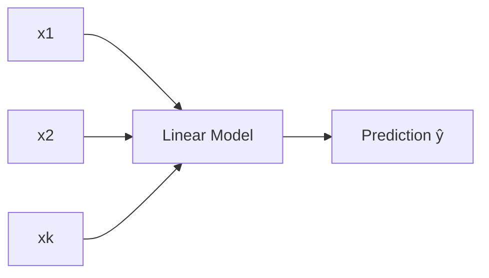

## The model

Multiple linear regression uses multiple features:

`ŷ = w1·x1 + w2·x2 + ... + wk·xk + b`



## Interpreting coefficients

If all else is equal:

- `wk` tells how much the target changes when feature `xk` increases by 1.

But be careful:

- if features are correlated, coefficient interpretation becomes tricky (multicollinearity)

## The Normal Equation (closed-form solution)

Scikit-learn's `LinearRegression` doesn't guess-and-check its way to the best
weights — it can solve for them directly. *Hands-On Machine Learning* calls
this the **Normal Equation**, a closed-form equation that gives you `θ`
straight away:

`θ̂ = (Xᵀ X)⁻¹ Xᵀ y`

- `θ̂` is the value of `θ` that minimizes the MSE cost function
- `X` is the training feature matrix (with a leading column of 1s for the bias)
- `y` is the vector of target values

```python title="Normal Equation from scratch" showLineNumbers{1}
import numpy as np

# Generate linear-looking data: y = 4 + 3x + noise
np.random.seed(42)
X = 2 * np.random.rand(100, 1)
y = 4 + 3 * X + np.random.randn(100, 1)

# add x0 = 1 to every instance
X_b = np.c_[np.ones((100, 1)), X]

# theta = (X^T X)^-1 X^T y
theta_best = np.linalg.inv(X_b.T.dot(X_b)).dot(X_b.T).dot(y)
print("theta:", theta_best.ravel())

# predict for two new instances
X_new = np.array([[0], [2]])
X_new_b = np.c_[np.ones((2, 1)), X_new]
y_predict = X_new_b.dot(theta_best)
print("predictions:", y_predict.ravel())
```

The values should land close to `[4, 3]` — the function used to generate the
data — but not exactly, because of the added noise.

:::tip[From the book]
The Normal Equation computes the inverse of `XᵀX`, an `(n+1) × (n+1)` matrix.
Inverting it costs roughly `O(n²·⁴)` to `O(n³)` — double the number of
features and the computation time multiplies by 5–8×. Scikit-learn's
`LinearRegression` actually uses a faster SVD-based pseudoinverse (`O(n²)`
instead), which also handles the case where `XᵀX` isn't invertible. Both
approaches scale linearly with the number of training instances `m`, so they
handle large datasets fine — it's a **large number of features** that hurts,
which is exactly where Gradient Descent (next lesson) takes over.
:::

## Scikit-learn example

```python title="Multiple linear regression" showLineNumbers{1}
import numpy as np
from sklearn.linear_model import LinearRegression

# Example: [size_sqft, bedrooms, age]
X = np.array([
    [800, 2, 10],
    [1000, 3, 5],
    [1200, 3, 20],
    [1500, 4, 7],
])

y = np.array([180, 240, 220, 320])

model = LinearRegression()
model.fit(X, y)
print("coefficients:", model.coef_)
print("intercept:", model.intercept_)
```

## Common issues

- **multicollinearity**: features carry overlapping signal
- **scaling**: if using regularization, scale inputs

## Visualize it

With two features, `hθ(x)` is no longer a line — it's a **plane** sitting over the
`(x1, x2)` grid. The amber mesh below is that plane; each blue dot is a training
instance floating above or below it, and the red stem is its residual. Watch the
Normal Equation solve for the plane from scratch each cycle: it starts flat (the
"always predict the mean" baseline) and tilts into the least-squares fit as `θ` is
solved, and the residual stems visibly shrink as it locks into place.

```p5 title="Fitting a plane with two features" desc="The Normal Equation tilts a flat baseline plane into the least-squares fit over two features; residual stems shrink as it locks in." height="330"
let pts = [];
const trueW = [3, 2];
const trueB = 10;
let fitTheta = [0, 0, 0];
let flatTheta = [0, 0, 0];
function ease(g) { g = constrain(g, 0, 1); return g * g * (3 - 2 * g); }
function genPts() {
  pts = [];
  for (let i = 0; i < 20; i++) {
    const x1 = random(0, 8);
    const x2 = random(0, 8);
    const y = trueB + trueW[0] * x1 + trueW[1] * x2 + random(-4, 4);
    pts.push({ x1, x2, y });
  }
  fitTheta = fitNormalEq(pts);
  const meanY = pts.reduce((s, p) => s + p.y, 0) / pts.length;
  flatTheta = [meanY, 0, 0];
}
function fitNormalEq(data) {
  const n = data.length;
  const X = data.map((p) => [1, p.x1, p.x2]);
  const y = data.map((p) => p.y);
  const XtX = [[0, 0, 0], [0, 0, 0], [0, 0, 0]];
  const Xty = [0, 0, 0];
  for (let i = 0; i < n; i++) {
    for (let r = 0; r < 3; r++) {
      Xty[r] += X[i][r] * y[i];
      for (let c = 0; c < 3; c++) {
        XtX[r][c] += X[i][r] * X[i][c];
      }
    }
  }
  const A = XtX.map((row) => row.slice());
  const b = Xty.slice();
  for (let i = 0; i < 3; i++) {
    let piv = A[i][i] || 1e-9;
    for (let j = i; j < 3; j++) A[i][j] /= piv;
    b[i] /= piv;
    for (let k = 0; k < 3; k++) {
      if (k === i) continue;
      const f = A[k][i];
      for (let j = i; j < 3; j++) A[k][j] -= f * A[i][j];
      b[k] -= f * b[i];
    }
  }
  return b;
}
function setup() {
  createCanvas(600, 330);
  textFont("monospace");
  textAlign(CENTER, CENTER);
  genPts();
}
function planeY(x1, x2, th) { return th[0] + th[1] * x1 + th[2] * x2; }
function project(x1, x2, y) {
  const originX = 300, originY = 195;
  const sx = originX + (x1 - x2) * 12.18;
  const sy = originY - y * 2.2 + (x1 + x2) * 7;
  return [sx, sy];
}
function drawMesh(th, col) {
  stroke(col[0], col[1], col[2], 130);
  strokeWeight(1);
  const N = 6, step = 8 / (N - 1);
  for (let i = 0; i < N; i++) {
    beginShape();
    noFill();
    for (let j = 0; j < N; j++) {
      const x1 = i * step, x2 = j * step;
      const [sx, sy] = project(x1, x2, planeY(x1, x2, th));
      vertex(sx, sy);
    }
    endShape();
  }
  for (let j = 0; j < N; j++) {
    beginShape();
    noFill();
    for (let i = 0; i < N; i++) {
      const x1 = i * step, x2 = j * step;
      const [sx, sy] = project(x1, x2, planeY(x1, x2, th));
      vertex(sx, sy);
    }
    endShape();
  }
}
function draw() {
  background(13, 17, 23);
  const period = 280;
  const t = frameCount % period;
  if (t === 0) genPts();
  const g = ease(constrain(t / 190, 0, 1));

  const curTheta = [
    lerp(flatTheta[0], fitTheta[0], g),
    lerp(flatTheta[1], fitTheta[1], g),
    lerp(flatTheta[2], fitTheta[2], g),
  ];

  noStroke();
  fill(107, 169, 221);
  textSize(13);
  text("Normal Equation fitting a plane over (x1, x2)", width / 2, 16);

  drawMesh(curTheta, [255, 211, 67]);

  for (const p of pts) {
    const fy = planeY(p.x1, p.x2, curTheta);
    const proj1 = project(p.x1, p.x2, p.y);
    const proj2 = project(p.x1, p.x2, fy);
    stroke(255, 120, 120, 160);
    strokeWeight(1.5);
    line(proj1[0], proj1[1], proj2[0], proj2[1]);
    noStroke();
    fill(75, 139, 190);
    ellipse(proj1[0], proj1[1], 6, 6);
  }

  noStroke();
  fill(150);
  textSize(11);
  textAlign(CENTER, CENTER);
  text(
    "bias=" + curTheta[0].toFixed(1) + "  w(x1)=" + curTheta[1].toFixed(2) + "  w(x2)=" + curTheta[2].toFixed(2),
    width / 2,
    height - 14
  );
}
function mousePressed() {
  genPts();
}
```

## Mini-checkpoint

- Which features are strongly correlated?
- Consider removing or combining them (feature engineering) if needed.

import DataCampExercise from "../../../../components/DataCampExercise.astro";

## 🧪 Try It Yourself

### Exercise 1 – Add the Bias Column

<DataCampExercise
  lang="python"
  hint={`\`np.c_[np.ones((m, 1)), X]\` prepends a column of 1s so the Normal Equation can solve for the bias term along with every weight.`}
  code={`# Task: Exercise 1 – Add the Bias Column
import numpy as np

X = np.array([[800, 2], [1000, 3], [1200, 3]])   # size, bedrooms

X_b = np.c_[np.___((3, 1)), X]   # replace ___ with ones
print(X_b.shape)

# ── Expected Output ───────────────────────────────────────────
# (3, 3)
# ──────────────────────────────────────────────────────────────`}
  solution={`import numpy as np

X = np.array([[800, 2], [1000, 3], [1200, 3]])
X_b = np.c_[np.ones((3, 1)), X]
print(X_b.shape)`}
  sct={`test_output_contains("(3, 3)")
success_msg("The bias column is in place — ready for the Normal Equation!")`}
  height={148}
/>

### Exercise 2 – Solve the Normal Equation

<DataCampExercise
  lang="python"
  hint={`theta = (X_b.T.dot(X_b)) inverted, then dotted with X_b.T.dot(y). Use \`np.linalg.inv(...)\`.`}
  code={`# Task: Exercise 2 – Solve the Normal Equation
import numpy as np

X_b = np.array([[1, 1], [1, 2], [1, 3]], dtype=float)
y = np.array([[3], [5], [7]], dtype=float)

theta = np.linalg.___(X_b.T.dot(X_b)).dot(X_b.T).dot(y)   # replace ___ with inv
print(theta.ravel())

# ── Expected Output ───────────────────────────────────────────
# [1. 2.]
# ──────────────────────────────────────────────────────────────`}
  solution={`import numpy as np

X_b = np.array([[1, 1], [1, 2], [1, 3]], dtype=float)
y = np.array([[3], [5], [7]], dtype=float)
theta = np.linalg.inv(X_b.T.dot(X_b)).dot(X_b.T).dot(y)
print(theta.ravel())`}
  sct={`test_output_contains("1.")
success_msg("You solved the Normal Equation by hand — bias = 1, weight = 2!")`}
  height={148}
/>

### Exercise 3 – Fit Multiple Features with Scikit-Learn

<DataCampExercise
  lang="python"
  hint={`Call \`model.fit(X, y)\` — scikit-learn separates \`intercept_\` (bias) from \`coef_\` (feature weights).`}
  code={`# Task: Exercise 3 – Fit Multiple Features
from sklearn.linear_model import LinearRegression
import numpy as np

X = np.array([[800, 2], [1000, 3], [1200, 3], [1500, 4]])
y = np.array([180, 240, 220, 320])

model = LinearRegression()
model.___(X, y)   # replace ___ with fit
print("coef shape:", model.coef_.shape)

# ── Expected Output ───────────────────────────────────────────
# coef shape: (2,)
# ──────────────────────────────────────────────────────────────`}
  solution={`from sklearn.linear_model import LinearRegression
import numpy as np

X = np.array([[800, 2], [1000, 3], [1200, 3], [1500, 4]])
y = np.array([180, 240, 220, 320])
model = LinearRegression()
model.fit(X, y)
print("coef shape:", model.coef_.shape)`}
  sct={`test_output_contains("(2,)")
success_msg("One weight per feature — exactly as the book describes!")`}
  height={148}
/>

## Next

Continue to **Polynomial Regression** — keep using a linear model, but expand
the features themselves to fit curved, non-linear data.

