## What you'll learn

- the matrix form of the model, and how to derive the **Normal Equation** by setting a gradient to zero
- how to solve a three-parameter fit **by hand** when the design is orthogonal
- the exact meaning of "holding all other features constant", and when that phrase is a lie
- why coefficients are only comparable after standardising
- what **multicollinearity** breaks — and, just as importantly, what it does not
- why scikit-learn uses `lstsq` rather than inverting a matrix

## Intuition

One feature gives you a line. Two features give you a plane. Ten features give you a hyperplane
nobody can picture — but the arithmetic never changes: multiply each feature by its weight, add
them all up, add the bias.

What *does* change is interpretation. With one feature, the slope is simply "how $y$ moves with
$x$". With several correlated features, each coefficient answers a much narrower question: how
$y$ moves with this feature **once the others have already had their say**. Miss that and you will
misread almost every model you fit.

```mermaid
flowchart LR
  X1["x1  size"] --> M["Weighted sum<br/>theta transpose x"]
  X2["x2  bedrooms"] --> M
  X3["x3  age"] --> M
  XN["x_n  ..."] --> M
  M --> Y["Prediction y&#770;"]
```



## The math

### The model in matrix form

Stack $m$ instances as rows of a design matrix $\mathbf{X} \in \mathbb{R}^{m\times(n+1)}$, whose
first column is all ones:

$$
\hat{\mathbf{y}} = \mathbf{X}\boldsymbol{\theta},
\qquad
J(\boldsymbol{\theta}) = \frac{1}{m}\lVert \mathbf{X}\boldsymbol{\theta} - \mathbf{y}\rVert_2^2
$$

### Deriving the Normal Equation

Expand the squared norm as an inner product and drop the constant $1/m$ — it cannot move the
minimiser:

$$
J(\boldsymbol{\theta}) \propto (\mathbf{X}\boldsymbol{\theta} - \mathbf{y})^\top(\mathbf{X}\boldsymbol{\theta} - \mathbf{y})
= \boldsymbol{\theta}^\top\mathbf{X}^\top\mathbf{X}\boldsymbol{\theta}
- 2\boldsymbol{\theta}^\top\mathbf{X}^\top\mathbf{y}
+ \mathbf{y}^\top\mathbf{y}
$$

Differentiate with respect to $\boldsymbol{\theta}$ using two standard identities —
$\nabla_{\boldsymbol{\theta}}(\boldsymbol{\theta}^\top\mathbf{A}\boldsymbol{\theta}) = 2\mathbf{A}\boldsymbol{\theta}$
for symmetric $\mathbf{A}$, and $\nabla_{\boldsymbol{\theta}}(\boldsymbol{\theta}^\top\mathbf{b}) = \mathbf{b}$:

$$
\nabla_{\boldsymbol{\theta}} J = 2\mathbf{X}^\top\mathbf{X}\boldsymbol{\theta} - 2\mathbf{X}^\top\mathbf{y} = \mathbf{0}
$$

$$
\boxed{\;\boldsymbol{\theta} = (\mathbf{X}^\top\mathbf{X})^{-1}\mathbf{X}^\top\mathbf{y}\;}
$$

That is the **Normal Equation**: one formula, no iteration, no learning rate.

:::note[Where this comes from]
Those two gradient identities are derived in
[Useful Identities for Computing Gradients](/mathematics-for-machine-learning/chapter-05---vector-calculus/useful-identities-for-computing-gradients/).
Geometrically, $\mathbf{X}(\mathbf{X}^\top\mathbf{X})^{-1}\mathbf{X}^\top$ projects onto the column
space of $\mathbf{X}$ — least squares is the
[orthogonal projection](/mathematics-for-machine-learning/chapter-03---analytic-geometry/orthogonal-projections/)
of $\mathbf{y}$ onto the space of predictions the model can actually produce.
:::

### The residual is orthogonal to every feature

Rearranged, the Normal Equation says $\mathbf{X}^\top(\mathbf{y} - \mathbf{X}\boldsymbol{\theta}) = \mathbf{0}$:
the residual vector is perpendicular to every column of $\mathbf{X}$. Two consequences you can
check on any fit:

- because the first column is all ones, the residuals sum to zero
- because every other column is a feature, the residuals are uncorrelated with each feature

If either fails, you did not fit least squares.

## Worked example by hand

An orthogonal design — a small experiment where two on/off factors were varied deliberately.
Both are coded $-1$ (off) and $+1$ (on), which keeps the arithmetic exact.

| $i$ | $x_0$ | promotion $x_1$ | weekend $x_2$ | sales $y$ |
| --- | --- | --- | --- | --- |
| 1 | 1 | −1 | −1 | 1 |
| 2 | 1 | −1 | +1 | 3 |
| 3 | 1 | +1 | −1 | 5 |
| 4 | 1 | +1 | +1 | 8 |

**Step 1 — build $\mathbf{X}^\top\mathbf{X}$.** Every column holds four entries of $\pm 1$, and any
two different columns are orthogonal, so all off-diagonal entries vanish:

$$
\mathbf{X}^\top\mathbf{X} =
\begin{bmatrix} 4 & 0 & 0 \\ 0 & 4 & 0 \\ 0 & 0 & 4 \end{bmatrix},
\qquad
(\mathbf{X}^\top\mathbf{X})^{-1} = \tfrac{1}{4}\mathbf{I}
$$

**Step 2 — build $\mathbf{X}^\top\mathbf{y}$.**

$$
\mathbf{X}^\top\mathbf{y} =
\begin{bmatrix}
1+3+5+8 \\
-1-3+5+8 \\
-1+3-5+8
\end{bmatrix}
=
\begin{bmatrix} 17 \\ 9 \\ 5 \end{bmatrix}
$$

**Step 3 — multiply.**

$$
\boldsymbol{\theta} = \tfrac{1}{4}\begin{bmatrix} 17 \\ 9 \\ 5 \end{bmatrix}
= \begin{bmatrix} 4.25 \\ 2.25 \\ 1.25 \end{bmatrix}
$$

So $\hat{y} = 4.25 + 2.25\,x_1 + 1.25\,x_2$.

**Step 4 — check the fit.**

| $i$ | $x_1$ | $x_2$ | $\hat{y}$ | $y$ | residual |
| --- | --- | --- | --- | --- | --- |
| 1 | −1 | −1 | 0.75 | 1 | +0.25 |
| 2 | −1 | +1 | 3.25 | 3 | −0.25 |
| 3 | +1 | −1 | 5.25 | 5 | −0.25 |
| 4 | +1 | +1 | 7.75 | 8 | +0.25 |
| | | | | | **0.00** |

$$
\text{SSE} = 4(0.25)^2 = 0.25,
\qquad
\text{SST} = 26.75,
\qquad
R^2 = 1 - \frac{0.25}{26.75} \approx 0.991
$$

Residuals sum to zero, and they are orthogonal to both feature columns —
$\sum x_1 e = -0.25 + 0.25 - 0.25 + 0.25 = 0$, and the same for $x_2$. Exactly what the Normal
Equation promised.

**Reading the coefficients.** Because the features are coded $\pm 1$, switching the promotion on
moves sales by $2 \times 2.25 = 4.5$ units, and a weekend adds $2 \times 1.25 = 2.5$. The
promotion is the stronger lever, and here that comparison is legitimate — both features share a
scale and are uncorrelated.

## See it move

The Normal Equation solves for the plane in one shot. Below, a flat baseline plane tilts into the
least-squares fit over two features; the red stems are residuals shrinking as it locks in.

```p5 title="Fitting a plane with two features" desc="The Normal Equation tilts a flat baseline plane into the least-squares fit over two features; residual stems shrink as it locks in." height="330"
let pts = [];
const trueW = [3, 2];
const trueB = 10;
let fitTheta = [0, 0, 0];
let flatTheta = [0, 0, 0];
function ease(g) { g = constrain(g, 0, 1); return g * g * (3 - 2 * g); }
function genPts() {
  pts = [];
  for (let i = 0; i < 20; i++) {
    const x1 = random(0, 8);
    const x2 = random(0, 8);
    const y = trueB + trueW[0] * x1 + trueW[1] * x2 + random(-4, 4);
    pts.push({ x1, x2, y });
  }
  fitTheta = fitNormalEq(pts);
  const meanY = pts.reduce((s, p) => s + p.y, 0) / pts.length;
  flatTheta = [meanY, 0, 0];
}
function fitNormalEq(data) {
  const n = data.length;
  const X = data.map((p) => [1, p.x1, p.x2]);
  const y = data.map((p) => p.y);
  const XtX = [[0, 0, 0], [0, 0, 0], [0, 0, 0]];
  const Xty = [0, 0, 0];
  for (let i = 0; i < n; i++) {
    for (let r = 0; r < 3; r++) {
      Xty[r] += X[i][r] * y[i];
      for (let c = 0; c < 3; c++) {
        XtX[r][c] += X[i][r] * X[i][c];
      }
    }
  }
  const A = XtX.map((row) => row.slice());
  const b = Xty.slice();
  for (let i = 0; i < 3; i++) {
    let piv = A[i][i] || 1e-9;
    for (let j = i; j < 3; j++) A[i][j] /= piv;
    b[i] /= piv;
    for (let k = 0; k < 3; k++) {
      if (k === i) continue;
      const f = A[k][i];
      for (let j = i; j < 3; j++) A[k][j] -= f * A[i][j];
      b[k] -= f * b[i];
    }
  }
  return b;
}
function setup() {
  createCanvas(600, 330);
  textFont("monospace");
  textAlign(CENTER, CENTER);
  genPts();
}
function planeY(x1, x2, th) { return th[0] + th[1] * x1 + th[2] * x2; }
function project(x1, x2, y) {
  const originX = 300, originY = 195;
  const sx = originX + (x1 - x2) * 12.18;
  const sy = originY - y * 2.2 + (x1 + x2) * 7;
  return [sx, sy];
}
function drawMesh(th, col) {
  stroke(col[0], col[1], col[2], 130);
  strokeWeight(1);
  const N = 6, step = 8 / (N - 1);
  for (let i = 0; i < N; i++) {
    beginShape();
    noFill();
    for (let j = 0; j < N; j++) {
      const x1 = i * step, x2 = j * step;
      const [sx, sy] = project(x1, x2, planeY(x1, x2, th));
      vertex(sx, sy);
    }
    endShape();
  }
  for (let j = 0; j < N; j++) {
    beginShape();
    noFill();
    for (let i = 0; i < N; i++) {
      const x1 = i * step, x2 = j * step;
      const [sx, sy] = project(x1, x2, planeY(x1, x2, th));
      vertex(sx, sy);
    }
    endShape();
  }
}
function draw() {
  background(13, 17, 23);
  const period = 280;
  const t = frameCount % period;
  if (t === 0) genPts();
  const g = ease(constrain(t / 190, 0, 1));

  const curTheta = [
    lerp(flatTheta[0], fitTheta[0], g),
    lerp(flatTheta[1], fitTheta[1], g),
    lerp(flatTheta[2], fitTheta[2], g),
  ];

  noStroke();
  fill(107, 169, 221);
  textSize(13);
  text("Normal Equation fitting a plane over (x1, x2)", width / 2, 16);

  drawMesh(curTheta, [255, 211, 67]);

  for (const p of pts) {
    const fy = planeY(p.x1, p.x2, curTheta);
    const proj1 = project(p.x1, p.x2, p.y);
    const proj2 = project(p.x1, p.x2, fy);
    stroke(255, 120, 120, 160);
    strokeWeight(1.5);
    line(proj1[0], proj1[1], proj2[0], proj2[1]);
    noStroke();
    fill(75, 139, 190);
    ellipse(proj1[0], proj1[1], 6, 6);
  }

  noStroke();
  fill(150);
  textSize(11);
  textAlign(CENTER, CENTER);
  text(
    "bias=" + curTheta[0].toFixed(1) + "  w(x1)=" + curTheta[1].toFixed(2) + "  w(x2)=" + curTheta[2].toFixed(2),
    width / 2,
    height - 14
  );
}
function mousePressed() {
  genPts();
}
```

## From scratch

Three ways to solve the same system, in increasing order of how much you should trust them:

```python title="normal_equation.py" showLineNumbers{1}
import numpy as np

X = np.array([[1, -1, -1],
              [1, -1,  1],
              [1,  1, -1],
              [1,  1,  1]], dtype=float)
y = np.array([1.0, 3.0, 5.0, 8.0])

# 1. Textbook form — never use this in production
theta_inv = np.linalg.inv(X.T @ X) @ X.T @ y

# 2. Solve the linear system instead of inverting: faster, better conditioned
theta_solve = np.linalg.solve(X.T @ X, X.T @ y)

# 3. What scikit-learn actually does: least squares via SVD.
#    Still returns an answer when X.T @ X is singular.
theta_lstsq, *_ = np.linalg.lstsq(X, y, rcond=None)

print(theta_inv.round(4))     # [4.25 2.25 1.25]
print(theta_solve.round(4))   # [4.25 2.25 1.25]
print(theta_lstsq.round(4))   # [4.25 2.25 1.25]

resid = y - X @ theta_lstsq
print(resid.round(4))                 # [ 0.25 -0.25 -0.25  0.25]
print(round(resid.sum(), 10))         # 0.0
print((X.T @ resid).round(10))        # [0. 0. 0.]  <- orthogonal to every column
```

:::caution[Never call `np.linalg.inv` on `X.T @ X`]
Explicit inversion is slower and numerically worse than solving the system, and it fails outright
when features are perfectly collinear. `lstsq` uses the SVD-based pseudoinverse, which returns the
minimum-norm solution instead of raising. That is precisely why `LinearRegression` never errors on
duplicate columns — it quietly splits the weight between them.
:::

## With scikit-learn

```python title="diabetes_multi.py" showLineNumbers{1}
from sklearn.datasets import load_diabetes
from sklearn.linear_model import LinearRegression
from sklearn.model_selection import train_test_split
from sklearn.metrics import mean_squared_error

data = load_diabetes()
X_train, X_test, y_train, y_test = train_test_split(
    data.data, data.target, test_size=0.3, random_state=42
)

model = LinearRegression().fit(X_train, y_train)

print(f"train R^2 = {model.score(X_train, y_train):.4f}")   # train R^2 = 0.5244
print(f"test  R^2 = {model.score(X_test, y_test):.4f}")     # test  R^2 = 0.4773

rmse = mean_squared_error(y_test, model.predict(X_test)) ** 0.5
print(f"test RMSE = {rmse:.2f}")                            # test RMSE = 53.12
```

Ten features lift test $R^2$ from the 0.34 that BMI alone managed to 0.48. The gap between train
(0.52) and test (0.48) is small, which is what a well-behaved linear model looks like.

<Figure
  src="/images/ml/phase-03-regression/multiple-linear-regression/predicted-vs-actual"
  alt="Scatter of predicted against actual disease progression on held-out patients, with a dashed diagonal marking perfect prediction. Points cluster around the diagonal with wide spread."
  title="Predicted against actual on held-out data"
  caption="The single most useful diagnostic once you pass two features. Points should hug the diagonal with no curvature and no fanning."
/>

### Reading the plot

- **No systematic curve.** Points sit around the diagonal rather than bowing above or below it, so
  a linear model is a reasonable shape here.
- **Compression at the extremes.** Low actual values are over-predicted and high ones
  under-predicted — the classic signature of a model that has captured the trend but not the tails.
- **Vertical spread is the error.** At any actual value the scatter is roughly ±50, which matches
  the RMSE of 53.

## Interpreting coefficients

### Raw coefficients are not comparable

A coefficient is expressed in *target units per one unit of that feature*. A coefficient of 949 on
BMI and 3 on age says nothing about relative importance until both features share a scale.
Standardise first, and each coefficient becomes "target change per one standard deviation":

```python title="standardised_coefficients.py" showLineNumbers{1}
from sklearn.datasets import load_diabetes
from sklearn.linear_model import LinearRegression
from sklearn.preprocessing import StandardScaler

data = load_diabetes()
X = StandardScaler().fit_transform(data.data)
model = LinearRegression().fit(X, data.target)

for name, coef in sorted(zip(data.feature_names, model.coef_),
                         key=lambda pair: -abs(pair[1])):
    print(f"{name:>5} {coef:8.2f}")

#    s1   -37.68
#    s5    35.73
#   bmi    24.73
#    s2    22.68
#    bp    15.43
#   sex   -11.41
#    s4     8.42
#    s3     4.81
#    s6     3.22
#   age    -0.48
```

<Figure
  src="/images/ml/phase-03-regression/multiple-linear-regression/coefficient-bars"
  alt="Horizontal bar chart of standardised coefficients for the ten diabetes features, sorted from most negative to most positive."
  title="Standardised coefficients, sorted"
  caption="Now the bars are comparable. s1 and s5 dominate; age contributes essentially nothing once the other nine features are present."
/>

### "Holding everything else constant"

The textbook reading of $\theta_j$ is: the change in $\hat{y}$ for a one-unit increase in $x_j$,
**with all other features held fixed**. That clause is doing enormous work. If two features always
move together in the real world, no observation ever shows one changing while the other stays put —
so the coefficient describes a scenario your data never contained.

That is why `age` scores −0.48 here despite age plainly mattering to disease progression: its
information is already carried by blood pressure and the serum measurements. The coefficient does
not say "age does not matter", it says "age adds nothing *beyond* the other nine columns".

## Multicollinearity

<Figure
  src="/images/ml/phase-03-regression/multiple-linear-regression/multicollinearity"
  alt="Two scatter plots of fitted coefficient pairs from 120 refits. With independent features the points cluster tightly around the true values; with correlated features they spread along a diagonal ridge."
  title="120 refits on fresh samples from the same process"
  caption="Correlated features do not bias the coefficients — the cloud is still centred on the truth — but they scatter them enormously. Any single fit could report almost anything."
/>

Detect it with the **variance inflation factor**. For feature $j$, regress it on all the others and
take:

$$
\text{VIF}_j = \frac{1}{1 - R^2_j}
$$

A VIF of 1 means no collinearity, above 5 is worth a look, and above 10 means that coefficient is
close to meaningless on its own.

```python title="vif.py" showLineNumbers{1}
import numpy as np
from sklearn.datasets import load_diabetes
from sklearn.linear_model import LinearRegression

data = load_diabetes()
X = data.data

for j, name in enumerate(data.feature_names):
    others = np.delete(X, j, axis=1)
    r2 = LinearRegression().fit(others, X[:, j]).score(others, X[:, j])
    vif = 1 / (1 - r2)
    flag = "  <-- high" if vif > 10 else ""
    print(f"{name:>5}  VIF = {vif:7.2f}{flag}")

#   age  VIF =    1.22
#   sex  VIF =    1.28
#   bmi  VIF =    1.51
#    bp  VIF =    1.46
#    s1  VIF =   59.20  <-- high
#    s2  VIF =   39.19  <-- high
#    s3  VIF =   15.40  <-- high
#    s4  VIF =    8.89
#    s5  VIF =   10.08  <-- high
#    s6  VIF =    1.48
```

The serum measurements are heavily entangled, which is exactly why `s1` and `s5` carry large
coefficients of opposite sign: the model is taking a difference between two nearly identical
columns.

:::tip[What collinearity does not break]
Predictions. The fitted surface, the $R^2$ and the RMSE are all fine — the model simply cannot
decide *which* of the correlated features deserves the credit. If you only need forecasts you can
live with it. If you need to explain the model, you cannot.
[Ridge regression](/machine-learning/phase-03---supervised-learning---regression/regularization-ridge-and-lasso-regression/)
is the standard fix.
:::

<AlgorithmCard
  name="Multiple Linear Regression (OLS)"
  type="Supervised · Regression"
  sklearn="sklearn.linear_model.LinearRegression"
  assumptions={[
    "The target is linear in the parameters",
    "Observations are independent",
    "Residual variance is constant across the feature space",
    "No perfect collinearity among the features",
  ]}
  complexity={{ train: "O(m·n² + n³)", predict: "O(n)", memory: "O(n)" }}
  notation="m = samples, n = features; training cost is dominated by forming and factorising X transpose X"
  hyperparams={[
    { name: "fit_intercept", default: "True", effect: "Leave on unless the data is already centred or theory forces a zero intercept." },
    { name: "positive", default: "False", effect: "Constrain every coefficient to be non-negative — useful for mixing weights and physical quantities." },
    { name: "n_jobs", default: "None", effect: "Parallelism for the multi-target case only; it will not speed up a single target." },
  ]}
  useWhen={[
    "You want a strong, fast, interpretable baseline on tabular data",
    "The number of features is comfortably smaller than the number of samples",
    "You need coefficients you can put in a report",
  ]}
  avoidWhen={[
    "Features outnumber samples — the solution is not unique, so use Ridge or Lasso",
    "Features are heavily collinear and you need to interpret individual effects",
    "The relationship is strongly non-linear and you cannot engineer the terms",
    "Outliers dominate the target",
  ]}
/>

## Pitfalls

:::caution[Adding features always improves training $R^2$]
Every extra column can only reduce training error, even a column of pure noise. Judge on held-out
data, and read
[Metrics R-Squared and Adjusted R-Squared](/machine-learning/phase-03---supervised-learning---regression/metrics-r-squared-and-adjusted-r-squared/)
before comparing two models with different feature counts.
:::

:::caution[More features than samples has no unique answer]
When $n > m$, $\mathbf{X}^\top\mathbf{X}$ is singular and infinitely many parameter vectors fit the
training data perfectly. `lstsq` hands you the minimum-norm one without complaint. Use Ridge,
Lasso, or feature selection rather than pretending the fit means something.
:::

:::caution[Do not chase a coefficient's sign]
A "wrong" sign is usually collinearity, not a discovery. Check the VIF before you rewrite the
domain theory.
:::

:::danger[Coefficients are not causal effects]
$\theta_j$ is a conditional association within your sample. Interventions change the
data-generating process, and a regression fitted on observational data cannot tell you what happens
after one.
:::

## Compare

| Approach | Handles $n > m$ | Stable under collinearity | Selects features | Interpretable |
| --- | --- | --- | --- | --- |
| **OLS** | No | No | No | Very |
| Ridge | Yes | Yes | No | Good |
| Lasso | Yes | Partly | Yes | Good |
| Elastic Net | Yes | Yes | Yes | Good |
| Principal component regression | Yes | Yes | No | Poor |
| Gradient boosting | Yes | Yes | Implicitly | Poor |

<Quiz
  questions={[
    {
      q: "What does the Normal Equation compute?",
      options: [
        "An approximate solution refined over many iterations",
        "The exact parameter vector that minimises squared error, in one step",
        "The learning rate for gradient descent",
        "The correlation between each feature and the target",
      ],
      answer: 1,
      explain: "Setting the gradient of the squared-error cost to zero gives theta = (X transpose X) inverse times X transpose y — a closed-form minimiser, no iteration involved.",
    },
    {
      q: "Two features in your model have a correlation of 0.99. What breaks?",
      options: [
        "The predictions become unreliable",
        "The individual coefficients become unstable, though the predictions stay fine",
        "The model refuses to fit",
        "The residuals stop summing to zero",
      ],
      answer: 1,
      explain: "Collinearity inflates coefficient variance. The fitted surface and its predictions are unaffected; only the attribution between the correlated features is unreliable.",
    },
    {
      q: "Why standardise before comparing coefficient magnitudes?",
      options: [
        "It makes the model fit faster",
        "Because a raw coefficient is in target units per feature unit, and different features use different units",
        "It is required by the Normal Equation",
        "It removes collinearity",
      ],
      answer: 1,
      explain: "A coefficient of 949 on a feature ranging over 0.1 and a coefficient of 3 on a feature ranging over 10,000 are not comparable until both features share a scale.",
    },
    {
      q: "Why does scikit-learn use lstsq instead of inverting X transpose X?",
      options: [
        "It gives a different, better answer",
        "The SVD-based pseudoinverse is more numerically stable and still returns a solution when the matrix is singular",
        "Inversion is not implemented in NumPy",
        "lstsq applies regularisation automatically",
      ],
      answer: 1,
      explain: "Explicit inversion is slower, less accurate, and fails on singular matrices. lstsq returns the minimum-norm solution instead of raising an error.",
    },
  ]}
/>

## 🧪 Try It Yourself

### Exercise 1 – Add the bias column

<DataCampExercise
  lang="python"
  hint={`np.c_ glues columns together; np.ones(len(X)) is the constant column.`}
  code={`# Task: Exercise 1 - Add the bias column
import numpy as np

X = np.array([[-1, -1], [-1, 1], [1, -1], [1, 1]], dtype=float)

Xb = np.c_[np.ones(len(X)), ___]     # replace ___ with X
print(Xb.shape)
print(Xb[3])

# -- Expected Output -------------------------------------------
# (4, 3)
# [1. 1. 1.]
# --------------------------------------------------------------`}
  solution={`import numpy as np

X = np.array([[-1, -1], [-1, 1], [1, -1], [1, 1]], dtype=float)
Xb = np.c_[np.ones(len(X)), X]
print(Xb.shape)
print(Xb[3])`}
  sct={`test_output_contains("(4, 3)")
success_msg("Design matrix ready for the Normal Equation.")`}
  height={158}
/>

### Exercise 2 – Solve the Normal Equation

<DataCampExercise
  lang="python"
  hint={`np.linalg.solve(A, b) solves A theta = b without ever inverting A.`}
  code={`# Task: Exercise 2 - Solve the Normal Equation
import numpy as np

X = np.array([[1, -1, -1], [1, -1, 1], [1, 1, -1], [1, 1, 1]], dtype=float)
y = np.array([1.0, 3.0, 5.0, 8.0])

theta = np.linalg.___(X.T @ X, X.T @ y)   # replace ___ with solve
print(theta.round(2))

# -- Expected Output -------------------------------------------
# [4.25 2.25 1.25]
# --------------------------------------------------------------`}
  solution={`import numpy as np

X = np.array([[1, -1, -1], [1, -1, 1], [1, 1, -1], [1, 1, 1]], dtype=float)
y = np.array([1.0, 3.0, 5.0, 8.0])
theta = np.linalg.solve(X.T @ X, X.T @ y)
print(theta.round(2))`}
  sct={`test_output_contains("4.25")
success_msg("Matches the hand calculation exactly.")`}
  height={158}
/>

### Exercise 3 – Residuals are orthogonal to the features

<DataCampExercise
  lang="python"
  hint={`Compute the residual y - X @ theta, then multiply by X.T.`}
  code={`# Task: Exercise 3 - Residuals are orthogonal to the features
import numpy as np

X = np.array([[1, -1, -1], [1, -1, 1], [1, 1, -1], [1, 1, 1]], dtype=float)
y = np.array([1.0, 3.0, 5.0, 8.0])
theta = np.array([4.25, 2.25, 1.25])

resid = y - X ___ theta          # replace ___ with @
print("residuals:", resid)
print("X.T @ resid:", (X.T @ resid).round(10))

# -- Expected Output -------------------------------------------
# residuals: [ 0.25 -0.25 -0.25  0.25]
# X.T @ resid: [ 0.  0.  0.]
# --------------------------------------------------------------`}
  solution={`import numpy as np

X = np.array([[1, -1, -1], [1, -1, 1], [1, 1, -1], [1, 1, 1]], dtype=float)
y = np.array([1.0, 3.0, 5.0, 8.0])
theta = np.array([4.25, 2.25, 1.25])
resid = y - X @ theta
print("residuals:", resid)
print("X.T @ resid:", (X.T @ resid).round(10))`}
  sct={`test_output_contains("0.25")
success_msg("Orthogonality is the geometric statement of the Normal Equation.")`}
  height={178}
/>

### Exercise 4 – Fit ten features and score on held-out data

<DataCampExercise
  lang="python"
  hint={`model.score(X_test, y_test) returns R squared on the test set.`}
  code={`# Task: Exercise 4 - Fit ten features and score on held-out data
from sklearn.datasets import load_diabetes
from sklearn.linear_model import LinearRegression
from sklearn.model_selection import train_test_split

data = load_diabetes()
X_train, X_test, y_train, y_test = train_test_split(
    data.data, data.target, test_size=0.3, random_state=42
)

model = LinearRegression().fit(X_train, y_train)
print("train R2:", round(model.score(X_train, y_train), 4))
print("test  R2:", round(model.___(X_test, y_test), 4))   # replace ___ with score

# -- Expected Output -------------------------------------------
# train R2: 0.5244
# test  R2: 0.4773
# --------------------------------------------------------------`}
  solution={`from sklearn.datasets import load_diabetes
from sklearn.linear_model import LinearRegression
from sklearn.model_selection import train_test_split

data = load_diabetes()
X_train, X_test, y_train, y_test = train_test_split(
    data.data, data.target, test_size=0.3, random_state=42
)
model = LinearRegression().fit(X_train, y_train)
print("train R2:", round(model.score(X_train, y_train), 4))
print("test  R2:", round(model.score(X_test, y_test), 4))`}
  sct={`test_output_contains("test  R2: 0.4773")
success_msg("Ten features beat one: 0.48 against 0.34 for BMI alone.")`}
  height={188}
/>

### Exercise 5 – Measure a variance inflation factor

<DataCampExercise
  lang="python"
  hint={`Regress the chosen column on all the others, then VIF = 1 / (1 - R squared).`}
  code={`# Task: Exercise 5 - Measure a variance inflation factor
import numpy as np
from sklearn.datasets import load_diabetes
from sklearn.linear_model import LinearRegression

data = load_diabetes()
X = data.data
j = data.feature_names.index("s1")

others = np.delete(X, j, axis=1)
r2 = LinearRegression().fit(others, X[:, j]).score(others, X[:, j])
vif = 1 / (1 - ___)                  # replace ___ with r2

print("R2 of s1 on the others:", round(r2, 4))
print("VIF:", round(vif, 2))
print("collinear:", vif > 10)

# -- Expected Output -------------------------------------------
# R2 of s1 on the others: 0.9831
# VIF: 59.2
# collinear: True
# --------------------------------------------------------------`}
  solution={`import numpy as np
from sklearn.datasets import load_diabetes
from sklearn.linear_model import LinearRegression

data = load_diabetes()
X = data.data
j = data.feature_names.index("s1")
others = np.delete(X, j, axis=1)
r2 = LinearRegression().fit(others, X[:, j]).score(others, X[:, j])
vif = 1 / (1 - r2)
print("R2 of s1 on the others:", round(r2, 4))
print("VIF:", round(vif, 2))
print("collinear:", vif > 10)`}
  sct={`test_output_contains("collinear: True")
success_msg("s1 is 98% predictable from the other nine features — its coefficient means little alone.")`}
  height={198}
/>

## Recap

- In matrix form the model is $\hat{\mathbf{y}} = \mathbf{X}\boldsymbol{\theta}$, and setting
  $\nabla J = 0$ gives
  $\boldsymbol{\theta} = (\mathbf{X}^\top\mathbf{X})^{-1}\mathbf{X}^\top\mathbf{y}$.
- The residual is orthogonal to every column of $\mathbf{X}$ — hence residuals summing to zero.
- On an orthogonal design the whole fit is one division:
  $\boldsymbol{\theta} = \frac{1}{4}[17, 9, 5]^\top$.
- Ten diabetes features reach test $R^2 = 0.48$ against 0.34 for BMI alone.
- Standardise before comparing coefficients; check VIF before interpreting any of them.
- Collinearity destabilises coefficients, not predictions.

### Exercise 6 – When the Normal Equation has no inverse

<DataCampExercise
  lang="python"
  hint={`np.linalg.lstsq solves the least-squares problem without inverting anything, so it survives a singular design matrix.`}
  code={`# Task: Exercise 6 - When the Normal Equation has no inverse
import numpy as np

# column 2 is exactly twice column 1 -- perfectly collinear features
X_design = np.array([
    [1.0, 1.0, 2.0],
    [1.0, 2.0, 4.0],
    [1.0, 3.0, 6.0],
    [1.0, 4.0, 8.0],
])
y_small = np.array([3.0, 5.0, 7.0, 9.0])

gram = X_design.T @ X_design
rank = np.linalg.matrix_rank(gram)
print(f"rank of X^T X:     {rank} of {gram.shape[0]}")
print(f"condition number > 1e15: {np.linalg.cond(gram) > 1e15}")
if rank < gram.shape[0]:
    print("inv() skipped:     Singular matrix -- no inverse exists")
else:
    theta = np.linalg.inv(gram) @ X_design.T @ y_small
    print(f"inv() returned:    {np.round(theta, 4)}")

theta_ls, *_ = np.linalg.___(X_design, y_small, rcond=None)   # replace ___ with lstsq
print(f"lstsq returned:    {np.round(theta_ls, 4)}")
print(f"predictions match: {np.allclose(X_design @ theta_ls, y_small)}")
print("column 2 is exactly 2x column 1, so the inverse does not exist -- "
      "lstsq picks the minimum-norm solution instead of failing")

# -- Expected Output -------------------------------------------
# rank of X^T X:     2 of 3
# condition number > 1e15: True
# inv() skipped:     Singular matrix -- no inverse exists
# lstsq returned:    [1.  0.4 0.8]
# predictions match: True
# column 2 is exactly 2x column 1, so the inverse does not exist -- lstsq picks the minimum-norm solution instead of failing
# --------------------------------------------------------------`}
  solution={`import numpy as np

X_design = np.array([
    [1.0, 1.0, 2.0],
    [1.0, 2.0, 4.0],
    [1.0, 3.0, 6.0],
    [1.0, 4.0, 8.0],
])
y_small = np.array([3.0, 5.0, 7.0, 9.0])

gram = X_design.T @ X_design
rank = np.linalg.matrix_rank(gram)
print(f"rank of X^T X:     {rank} of {gram.shape[0]}")
print(f"condition number > 1e15: {np.linalg.cond(gram) > 1e15}")
if rank < gram.shape[0]:
    print("inv() skipped:     Singular matrix -- no inverse exists")
else:
    theta = np.linalg.inv(gram) @ X_design.T @ y_small
    print(f"inv() returned:    {np.round(theta, 4)}")

theta_ls, *_ = np.linalg.lstsq(X_design, y_small, rcond=None)
print(f"lstsq returned:    {np.round(theta_ls, 4)}")
print(f"predictions match: {np.allclose(X_design @ theta_ls, y_small)}")
print("column 2 is exactly 2x column 1, so the inverse does not exist -- "
      "lstsq picks the minimum-norm solution instead of failing")`}
  sct={`test_output_contains("inv() skipped:     Singular matrix", pattern=False)
test_output_contains("predictions match: True", pattern=False)
success_msg("The predictions are perfect and the coefficients are meaningless — any split of the weight between two identical columns fits equally well. This is why scikit-learn uses lstsq internally and why VIF is worth checking before interpreting a coefficient.")`}
  height={330}
/>

## Next

Continue to
[Polynomial Regression](/machine-learning/phase-03---supervised-learning---regression/polynomial-regression/)
— bend the straight line into a curve without leaving the linear model behind.
