import Quiz from "../../../../components/Quiz.astro";

Regression is where supervised learning becomes concrete. Everything in this phase — the cost
function, the gradient, the penalty term, the held-out score — reappears unchanged in
classification, in ensembles, and in every neural network in the Deep Learning module. Learn it
properly once here and the rest of the curriculum is mostly variations.

## What this phase covers

Eight pages, in dependency order. Each builds on the one before, and each hand-works its arithmetic
on the same five-point dataset so the numbers stay comparable across the whole phase.

| # | Page | Core idea | Hand-worked result |
| --- | --- | --- | --- |
| 1 | [Introduction to Regression Analysis](/machine-learning/phase-03---supervised-learning---regression/introduction-to-regression-analysis/) | The model is a dot product; always beat a baseline | RMSE 23.8 on three houses |
| 2 | [Simple Linear Regression](/machine-learning/phase-03---supervised-learning---regression/simple-linear-regression/) | Derive slope and intercept from two derivatives | $\hat{y} = 0.6x + 2.2$ |
| 3 | [Multiple Linear Regression](/machine-learning/phase-03---supervised-learning---regression/multiple-linear-regression/) | The Normal Equation; interpreting coefficients | $\boldsymbol{\theta} = [4.25, 2.25, 1.25]$ |
| 4 | [Polynomial Regression](/machine-learning/phase-03---supervised-learning---regression/polynomial-regression/) | Curves from a linear model, and how to pick the degree | $\hat{y} = 1 - 0.2x + 2x^2$ |
| 5 | [Cost Functions - MSE](/machine-learning/phase-03---supervised-learning---regression/cost-functions-mean-squared-error-mse/) | What you optimise, and what that choice costs | MSE 0.48, MAE 0.64 |
| 6 | [Gradient Descent Explained](/machine-learning/phase-03---supervised-learning---regression/gradient-descent-explained/) | Iterate to the minimum; learning-rate stability | Two steps: 17.20 → 6.27 → 2.55 |
| 7 | [Regularization - Ridge and Lasso](/machine-learning/phase-03---supervised-learning---regression/regularization-ridge-and-lasso-regression/) | Shrink coefficients; L1 selects, L2 does not | Lasso at $\lambda{=}10$: $[1.0, 0]$ |
| 8 | [Metrics - R² and Adjusted R²](/machine-learning/phase-03---supervised-learning---regression/metrics-r-squared-and-adjusted-r-squared/) | Report honestly; know when a number lies | $R^2 = 0.60$, adjusted 0.467 |

## The path through

```mermaid
flowchart TD
  A["Introduction<br/>model, baseline, assumptions"] --> B["Simple Linear<br/>one feature, closed form"]
  B --> C["Multiple Linear<br/>Normal Equation, collinearity"]
  C --> D["Polynomial<br/>curves, degree selection"]
  C --> E["Cost Functions<br/>MSE, MAE, Huber"]
  E --> F["Gradient Descent<br/>iterate when closed form is too costly"]
  D --> G["Regularization<br/>Ridge, Lasso, Elastic Net"]
  F --> G
  G --> H["Metrics<br/>R&#178;, adjusted R&#178;, what to report"]
  H --> I["Phase 4<br/>Classification"]
```

Two threads run in parallel and meet at regularisation. The **modelling** thread goes
simple → multiple → polynomial, adding capacity. The **optimisation** thread goes cost function →
gradient descent, explaining how any of it is computed. Regularisation needs both: it modifies the
cost, and it exists because extra capacity overfits.

## Before you start

You will get much more from this phase if you already have:

- **NumPy array basics** — indexing, broadcasting, `@` for matrix multiplication
- **[Phase 2](/machine-learning/phase-02---data-preprocessing--feature-engineering/phase-2---data-preprocessing--feature-engineering/)** — train/test splits, scaling, and pipelines
- **Derivatives** — [Differentiation of Univariate Functions](/mathematics-for-machine-learning/chapter-05---vector-calculus/differentiation-of-univariate-functions/) and
  [Partial Differentiation and Gradients](/mathematics-for-machine-learning/chapter-05---vector-calculus/partial-differentiation-and-gradients/)
- **Matrices** — [Matrices](/mathematics-for-machine-learning/chapter-02---linear-algebra/matrices/) and
  [Orthogonal Projections](/mathematics-for-machine-learning/chapter-03---analytic-geometry/orthogonal-projections/),
  which is what least squares geometrically *is*

None of these is a hard prerequisite. Every derivation on these pages is worked out in full, and
every result is checked against NumPy or scikit-learn.

## What you'll be able to do afterwards

By the end of this phase you should be able to:

1. Derive the least-squares solution for one feature from scratch, and explain why the fitted line
   passes through the centroid.
2. Write the Normal Equation, say why `lstsq` is preferred over matrix inversion, and diagnose
   multicollinearity with a variance inflation factor.
3. Choose between MSE, MAE and Huber based on what your errors actually cost.
4. Pick a learning rate deliberately — including computing the value above which descent diverges.
5. Explain, geometrically, why Lasso produces exact zeros and Ridge does not.
6. Report a model with RMSE and $R^2$ on held-out data, and recognise when either is misleading.

## How long it takes

| Activity | Time |
| --- | --- |
| Reading the eight pages | 3–4 hours |
| Working the hand examples with pen and paper | 2 hours |
| Running the code and the 40 exercises | 3–4 hours |
| The practice project below | 3–5 hours |
| **Total** | **11–15 hours** |

The hand examples are the part people skip and the part that makes the difference. All of them use
small integers deliberately — you can do every one on the back of an envelope.

## Practice project

**Predict California housing prices**, using `sklearn.datasets.fetch_california_housing` (20,640
rows, 8 features). A sensible progression:

1. Establish the `DummyRegressor(strategy="mean")` baseline. Write the number down.
2. Fit plain `LinearRegression`. Report RMSE and $R^2$ on a held-out split.
3. Plot residuals against fitted values. The curvature you find is the reason for step 4.
4. Add `PolynomialFeatures(2)` inside a pipeline with `StandardScaler`. Compare cross-validated
   scores against step 2.
5. Add `RidgeCV` and `LassoCV`. Check how many features Lasso keeps.
6. Write three sentences that a non-technical colleague could act on.

Everything you need is covered across the eight pages, and step 6 is not optional — a model nobody
can act on is not finished.

<Quiz
  questions={[
    {
      q: "Which page should you read before Gradient Descent?",
      options: [
        "Regularization, because the penalty changes the gradient",
        "Cost Functions, because gradient descent minimises the cost that page defines",
        "Metrics, because you need R-squared to check convergence",
        "Order does not matter",
      ],
      answer: 1,
      explain: "Gradient descent walks downhill on a surface. Cost Functions defines that surface, proves it is convex, and explains what its gradient looks like.",
    },
    {
      q: "What single dataset is hand-worked across this entire phase?",
      options: [
        "The California housing dataset",
        "A five-point ad-spend and sales set chosen so every intermediate value is exact",
        "The iris dataset",
        "A different random sample on every page",
      ],
      answer: 1,
      explain: "x = 1..5 and y = 2, 4, 5, 4, 5. Slope 0.6, intercept 2.2, SSE 2.4, R-squared 0.6 — all exact, all reused, so results stay comparable from page to page.",
    },
    {
      q: "Why does this phase matter beyond regression itself?",
      options: [
        "It does not; classification uses entirely different machinery",
        "Cost functions, gradients, regularisation and held-out evaluation carry over unchanged to classification, ensembles and neural networks",
        "Only the metrics carry over",
        "It is only relevant to linear models",
      ],
      answer: 1,
      explain: "Swap squared error for log loss and almost everything here applies to logistic regression; add layers and it applies to deep learning. The optimisation and evaluation machinery is universal.",
    },
  ]}
/>

## Next

Start with
[Introduction to Regression Analysis](/machine-learning/phase-03---supervised-learning---regression/introduction-to-regression-analysis/)
— the vocabulary, the general model, and the baseline you will compare everything against.
