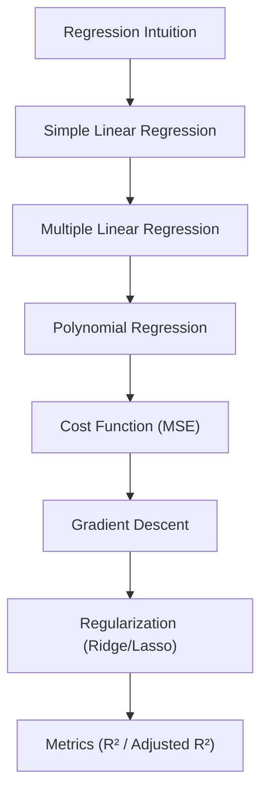

## What regression is

**Regression** predicts a **number**.

Examples:

- house price
- delivery time
- demand forecasting
- temperature

In this phase, you’ll learn:

- simple and multiple linear regression
- polynomial regression (non-linear relationships)
- cost functions like MSE
- gradient descent intuition
- regularization (Ridge and Lasso)
- evaluation metrics like R² and adjusted R²

## Phase 3 flow

## Suggested practice dataset

A great first dataset is:

- house prices (Kaggle style)
- medical cost dataset
- advertising dataset (TV/Radio/News → Sales)

Try each model and compare results.

:::tip[From the book]
*Hands-On Machine Learning* (Géron) frames this whole phase as **two very
different ways to train a Linear Regression model**: a direct "closed-form"
equation (the **Normal Equation**) that computes the best parameters in one
shot, and an iterative approach called **Gradient Descent** that nudges the
parameters downhill, step by step, until it converges to the same answer.
Everything else in this phase — polynomial features, learning curves, Ridge,
Lasso — builds on that one idea: pick parameters that minimize a cost function.
:::
