## What you'll learn

- why adding $x^2$ to the feature matrix lets a **linear** model fit a curve
- how to solve a quadratic fit **by hand** on five points
- how `PolynomialFeatures` explodes combinatorially, and how fast
- how to choose the degree with cross-validation and the **one-standard-error rule**
- how to read a learning curve to tell underfitting from overfitting
- why polynomial pipelines must scale their features

## Intuition

A straight line through curved data is wrong in a specific, visible way: it misses low, then high,
then low again. The residual plot shows a smile or a frown instead of a shapeless band.

The fix is disarmingly cheap. Do not change the algorithm — change the **columns**. Hand the model
$x^2$ alongside $x$, and least squares will find the best parabola exactly the way it found the
best line, because the model is still a weighted sum of whatever columns you supply. Linear
regression is linear in the *parameters*, and never had an opinion about the features.

```mermaid
flowchart LR
  X["Raw feature x"] --> PF["PolynomialFeatures(degree=2)"]
  PF --> C["Columns: x, x&#178;"]
  C --> LR["The same LinearRegression"]
  LR --> Y["Curved prediction y&#770;"]
```



## The math

### The model

A degree-$d$ polynomial in one feature:

$$
\hat{y} = \theta_0 + \theta_1 x + \theta_2 x^2 + \cdots + \theta_d x^d
$$

Rename $z_1 = x,\; z_2 = x^2,\; \ldots,\; z_d = x^d$ and it reads
$\hat{y} = \theta_0 + \theta_1 z_1 + \cdots + \theta_d z_d$ — an ordinary multiple linear
regression. The Normal Equation applies unchanged:

$$
\boldsymbol{\theta} = (\mathbf{X}^\top\mathbf{X})^{-1}\mathbf{X}^\top\mathbf{y},
\qquad
\mathbf{X} = \begin{bmatrix}
1 & x_1 & x_1^2 & \cdots & x_1^d \\
1 & x_2 & x_2^2 & \cdots & x_2^d \\
\vdots & \vdots & \vdots & & \vdots \\
1 & x_m & x_m^2 & \cdots & x_m^d
\end{bmatrix}
$$

That matrix has a name — the **Vandermonde matrix** — and a reputation: it becomes badly
conditioned fast as $d$ grows, which is one reason high-degree fits misbehave numerically as well
as statistically.

### How many terms?

With $n$ input features and degree $d$, `PolynomialFeatures` generates every product of total
degree at most $d$:

$$
\text{number of terms} = \binom{n + d}{d}
$$

| features $n$ | degree 2 | degree 3 | degree 5 |
| --- | --- | --- | --- |
| 1 | 3 | 4 | 6 |
| 3 | 10 | 20 | 56 |
| 10 | 66 | 286 | 3,003 |
| 100 | 5,151 | 176,851 | ≈ 96 million |

Two features at degree 3 already give you interaction terms like $x_0^2 x_1$ — which is genuinely
useful, and also how a tidy 10-column dataset becomes 286 columns without anyone deciding to do
that.

## Worked example by hand

Five points, $x$ chosen symmetric about zero so that $\sum x_i = 0$ and $\sum x_i^3 = 0$. That
kills half the terms in $\mathbf{X}^\top\mathbf{X}$ and makes the algebra tractable.

| $i$ | $x_i$ | $y_i$ | $x_i^2$ | $x_i y_i$ | $x_i^2 y_i$ |
| --- | --- | --- | --- | --- | --- |
| 1 | −2 | 9 | 4 | −18 | 36 |
| 2 | −1 | 4 | 1 | −4 | 4 |
| 3 | 0 | 1 | 0 | 0 | 0 |
| 4 | 1 | 2 | 1 | 2 | 2 |
| 5 | 2 | 9 | 4 | 18 | 36 |
| | **0** | **25** | **10** | **−2** | **78** |

**Step 1 — assemble the normal equations.** With $\sum x = 0$, $\sum x^2 = 10$, $\sum x^3 = 0$ and
$\sum x^4 = 34$:

$$
\mathbf{X}^\top\mathbf{X} =
\begin{bmatrix} 5 & 0 & 10 \\ 0 & 10 & 0 \\ 10 & 0 & 34 \end{bmatrix},
\qquad
\mathbf{X}^\top\mathbf{y} = \begin{bmatrix} 25 \\ -2 \\ 78 \end{bmatrix}
$$

**Step 2 — the middle row is already solved.** $10\theta_1 = -2$, so $\theta_1 = -0.2$.

**Step 3 — solve the remaining 2×2 system.**

$$
5\theta_0 + 10\theta_2 = 25 \;\Longrightarrow\; \theta_0 = 5 - 2\theta_2
$$

Substitute into $10\theta_0 + 34\theta_2 = 78$:

$$
10(5 - 2\theta_2) + 34\theta_2 = 78
\;\Longrightarrow\; 14\theta_2 = 28
\;\Longrightarrow\; \theta_2 = 2,\quad \theta_0 = 1
$$

The fitted curve is $\hat{y} = 1 - 0.2x + 2x^2$.

**Step 4 — check.**

| $x_i$ | $y_i$ | $\hat{y}_i$ | residual | squared |
| --- | --- | --- | --- | --- |
| −2 | 9 | 9.4 | −0.4 | 0.16 |
| −1 | 4 | 3.2 | +0.8 | 0.64 |
| 0 | 1 | 1.0 | 0.0 | 0.00 |
| 1 | 2 | 2.8 | −0.8 | 0.64 |
| 2 | 9 | 8.6 | +0.4 | 0.16 |
| | | | **0.0** | **1.60** |

$$
\text{SST} = 58, \qquad R^2 = 1 - \frac{1.6}{58} \approx 0.972
$$

Nothing here is new machinery. It is the Normal Equation from the previous page, applied to a
design matrix that happens to contain a squared column.

## See it move

Three capacities cycling over the same curved dataset — watch the degree-12 curve chase individual
points instead of the trend.

```p5 title="Under and over-fitting a curved dataset" desc="A degree-1 line underfits, a degree-2 curve fits well, and a high-degree polynomial overfits by wiggling through the noise. Click for a fresh sample." height="300"
let pts = [];
function genPts() {
  pts = [];
  for (let i = 0; i < 30; i++) {
    const x = random(-3, 3);
    const y = 0.5 * x * x + x + 2 + random(-1.2, 1.2);
    pts.push({ x, y });
  }
}
function setup() {
  createCanvas(600, 300);
  textFont("monospace");
  textAlign(CENTER, CENTER);
  genPts();
}
function px(x) { return 46 + (x + 3.5) / 7 * (width - 92); }
function py(y) { return (height - 46) - (y + 2) / 14 * (height - 76); }
function fitDegree(d) {
  // crude polynomial least squares via normal equation
  const n = pts.length;
  const cols = d + 1;
  const XT = [];
  for (let r = 0; r < cols; r++) { XT.push(new Array(n).fill(0)); }
  for (let i = 0; i < n; i++) {
    let p = 1;
    for (let r = 0; r < cols; r++) { XT[r][i] = p; p *= pts[i].x; }
  }
  const XTX = [];
  for (let r = 0; r < cols; r++) {
    XTX.push(new Array(cols).fill(0));
    for (let c = 0; c < cols; c++) {
      let s = 0;
      for (let i = 0; i < n; i++) s += XT[r][i] * XT[c][i];
      XTX[r][c] = s;
    }
  }
  const XTy = new Array(cols).fill(0);
  for (let r = 0; r < cols; r++) {
    let s = 0;
    for (let i = 0; i < n; i++) s += XT[r][i] * pts[i].y;
    XTy[r] = s;
  }
  // Gaussian elimination with a tiny ridge for stability at high degree
  const A = XTX.map((row, r) => row.map((v, c) => v + (r === c ? 1e-6 : 0)));
  const b = XTy.slice();
  for (let i = 0; i < cols; i++) {
    let piv = A[i][i] || 1e-9;
    for (let j = i; j < cols; j++) A[i][j] /= piv;
    b[i] /= piv;
    for (let k = 0; k < cols; k++) {
      if (k === i) continue;
      const f = A[k][i];
      for (let j = i; j < cols; j++) A[k][j] -= f * A[i][j];
      b[k] -= f * b[i];
    }
  }
  return b;
}
let stage = 0, t = 0;
const degrees = [1, 2, 12];
const labels = ["degree 1 (underfits)", "degree 2 (good fit)", "degree 12 (overfits)"];
let coeffs = fitDegree(degrees[0]);
function draw() {
  background(13, 17, 23);
  noStroke();
  for (const p of pts) { fill(75, 139, 190); ellipse(px(p.x), py(p.y), 7, 7); }
  stroke(255, 211, 67);
  strokeWeight(2.5);
  noFill();
  beginShape();
  for (let xx = -3.4; xx <= 3.4; xx += 0.05) {
    let yy = 0, p = 1;
    for (let c = 0; c < coeffs.length; c++) { yy += coeffs[c] * p; p *= xx; }
    vertex(px(xx), py(constrain(yy, -3, 12)));
  }
  endShape();
  noStroke();
  fill(107, 169, 221);
  textSize(13);
  text(labels[stage], width / 2, 20);
  t++;
  if (t > 130) { t = 0; stage = (stage + 1) % degrees.length; coeffs = fitDegree(degrees[stage]); if (stage === 0) genPts(); }
}
function mousePressed() { genPts(); coeffs = fitDegree(degrees[stage]); }
```

<Figure
  src="/images/ml/phase-03-regression/polynomial-regression/degree-comparison"
  alt="Three panels showing the same 40 scattered points fitted with a degree-1 line, a degree-2 curve, and a wildly oscillating degree-15 curve."
  title="The same 40 points, three model capacities"
  caption="Training MSE falls from 2.68 to 0.83 to 0.37 — and the model with the lowest training error is the one you would least want to deploy."
/>

## From scratch

Build the Vandermonde matrix explicitly and reuse the Normal Equation:

```python title="poly_from_scratch.py" showLineNumbers{1}
import numpy as np


def vandermonde(x, degree):
    """Columns [1, x, x^2, ..., x^degree]."""
    x = np.asarray(x, dtype=float)
    return np.vstack([x**k for k in range(degree + 1)]).T


x = np.array([-2.0, -1.0, 0.0, 1.0, 2.0])
y = np.array([9.0, 4.0, 1.0, 2.0, 9.0])

X = vandermonde(x, 2)
print(X)
# [[ 1. -2.  4.]
#  [ 1. -1.  1.]
#  [ 1.  0.  0.]
#  [ 1.  1.  1.]
#  [ 1.  2.  4.]]

theta = np.linalg.solve(X.T @ X, X.T @ y)
print(theta.round(4))              # [ 1.  -0.2  2. ]

resid = y - X @ theta
print(resid.round(4))              # [-0.4  0.8  0.  -0.8  0.4]
print(round((resid ** 2).sum(), 4))  # 1.6
```

Same numbers as the hand calculation, including the residuals.

## With scikit-learn

Never fit `PolynomialFeatures` outside a pipeline — the expansion has to be re-applied identically
at prediction time, and the scaler after it has to be fitted on training data only:

```python title="poly_pipeline.py" showLineNumbers{1}
import numpy as np
from sklearn.pipeline import make_pipeline
from sklearn.preprocessing import PolynomialFeatures, StandardScaler
from sklearn.linear_model import LinearRegression

rng = np.random.default_rng(7)
x = np.sort(rng.uniform(-3, 3, 120)).reshape(-1, 1)
y = 0.5 * x.ravel() ** 2 + x.ravel() + 2 + rng.normal(0, 1.1, 120)

model = make_pipeline(
    PolynomialFeatures(degree=2, include_bias=False),
    StandardScaler(),        # essential: x^5 dwarfs x, and scale wrecks conditioning
    LinearRegression(),
)
model.fit(x, y)

print(model.score(x, y).round(4))                   # 0.8196
print(model[0].get_feature_names_out())             # ['x0' 'x0^2']
print(model[-1].coef_.round(3))                     # [1.78  1.248]
```

`include_bias=False` matters: `LinearRegression` already fits an intercept, so leaving the
constant column in gives you two intercepts and a rank-deficient design.

## Choosing the degree

Training error falls forever as you add degrees. It has to — each extra term is a strictly larger
family of curves. The only honest signal comes from data the model has not seen:

<Figure
  src="/images/ml/phase-03-regression/polynomial-regression/degree-error-curve"
  alt="Training MSE and 5-fold cross-validated MSE plotted against polynomial degree from 1 to 18, on a log scale. Training error falls steadily; CV error drops sharply at degree 2, stays flat, then rises after degree 10."
  title="Training error versus cross-validated error by degree"
  caption="The CV curve is flat from degree 2 to about 10 — those models are statistically indistinguishable. The one-standard-error rule breaks the tie in favour of the simplest, degree 2."
/>

### Reading the plot

1. **The cliff at degree 2 is the real signal.** CV error drops from 2.79 to 1.06 and never
   improves meaningfully again. The data was generated by a quadratic, and the curve says so.
2. **Degrees 2 through 10 are a tie.** The shaded band is one standard error across folds; every
   point in that range sits inside it. Picking the exact minimum here would be reading noise.
3. **The one-standard-error rule.** Find the best CV score, add one standard error, and take the
   *simplest* model still under that threshold. Here it selects degree 2 — the right answer, and
   the one that generalises.
4. **The gap after degree 10 is overfitting made visible.** Training error keeps falling while CV
   error climbs.

### Learning curves

The degree curve varies capacity at fixed data. A **learning curve** does the opposite: fixed
capacity, growing data. The two failure modes look completely different.

<Figure
  src="/images/ml/phase-03-regression/polynomial-regression/learning-curves"
  alt="Two panels of learning curves. Left, degree 1: training and validation error both plateau at a high value and nearly meet. Right, degree 15: training error is very low while validation error stays far above it."
  title="Learning curves for an underfitting and an overfitting model"
  caption="Curves that meet at a high error mean high bias — more data will not help. A wide persistent gap means high variance — more data will."
/>

| Symptom | Diagnosis | What actually helps |
| --- | --- | --- |
| Both curves plateau high, close together | Underfitting (high bias) | More capacity: higher degree, more features |
| Training low, validation high, gap persists | Overfitting (high variance) | More data, lower degree, regularisation |
| Both low and converged | Good fit | Ship it |

<AlgorithmCard
  name="Polynomial Regression"
  type="Supervised · Regression"
  sklearn="sklearn.preprocessing.PolynomialFeatures + sklearn.linear_model.LinearRegression"
  assumptions={[
    "The relationship is smooth and can be approximated by a polynomial on the observed range",
    "Observations are independent",
    "Residual variance is constant",
  ]}
  complexity={{ train: "O(m·p² + p³)", predict: "O(p)", memory: "O(p)" }}
  notation="m = samples, p = expanded term count = binomial(n + d, d)"
  hyperparams={[
    { name: "degree", default: "2", effect: "The one that matters. Choose by cross-validation, then take the simplest degree within one standard error of the best." },
    { name: "include_bias", default: "True", effect: "Set False inside a pipeline whose final estimator already fits an intercept." },
    { name: "interaction_only", default: "False", effect: "Keep cross terms like x0·x1 but drop pure powers — useful when you want interactions without curvature." },
  ]}
  useWhen={[
    "A scatter plot or residual plot shows smooth curvature",
    "You have one to a handful of features and want to keep interpretability",
    "A physical relationship is genuinely quadratic or cubic",
  ]}
  avoidWhen={[
    "You have many features — the term count explodes combinatorially",
    "You need to predict outside the training range; polynomials diverge violently",
    "The curve has sharp kinks or steps — use splines or trees instead",
  ]}
/>

## Pitfalls

:::caution[Always scale after expanding]
With $x$ spanning 1 to 100, $x^5$ spans 1 to 10 billion. The design matrix becomes so badly
conditioned that the solver returns nonsense. `StandardScaler` after `PolynomialFeatures` is not
optional at degree 3 or above.
:::

:::danger[Polynomials extrapolate catastrophically]
A degree-15 fit is close to the data inside its range and shoots to $\pm 10^6$ just outside it.
Look at the third panel of the capacity figure: the curve leaves the plot at both ends. Never let a
polynomial model see a feature value beyond the range it was trained on.
:::

:::caution[The term count is combinatorial, not linear]
Ten features at degree 3 is 286 columns; at degree 5 it is 3,003. You will run out of samples
before you run out of columns, and $n > m$ makes the least-squares solution non-unique.
:::

:::caution[Do not select the degree on the test set]
Sweeping degrees and reporting the best test score is optimising against the test set — the number
you report is no longer an estimate of anything. Select on cross-validation folds inside the
training data, then touch the test set exactly once.
:::

## Compare

| Approach | Shape it fits | Extrapolates | Cost with many features | Interpretability |
| --- | --- | --- | --- | --- |
| **Polynomial regression** | Smooth global curve | Very badly | Explodes | Good at low degree |
| Splines | Smooth, piecewise, local | Poorly | Linear | Moderate |
| Decision tree | Steps | Flat (constant) | Linear | Moderate |
| Random forest | Smooth steps | Flat | Linear | Poor |
| Kernel ridge (RBF) | Smooth, local | Reverts to mean | Quadratic in samples | Poor |
| Log/sqrt transform | One fixed curve shape | Reasonably | Free | Very good |

If the curvature is monotone, try transforming $y$ or $x$ with a log before reaching for a
polynomial. One column, no degree to tune, and it extrapolates sensibly.

<Quiz
  questions={[
    {
      q: "Why is polynomial regression still called a linear model?",
      options: [
        "Because the fitted curve is nearly straight over short ranges",
        "Because it is linear in the parameters — x squared is just another column",
        "Because it uses a straight line in a transformed space that must be recovered later",
        "It is not; the name is a historical accident",
      ],
      answer: 1,
      explain: "Linearity refers to how the parameters enter the model. Treat x squared as a new feature and ordinary least squares applies with no modification.",
    },
    {
      q: "Training MSE keeps falling as you raise the degree while CV MSE starts rising after degree 10. What is happening?",
      options: [
        "The optimiser is failing to converge",
        "Overfitting: the extra capacity is fitting noise that does not generalise",
        "The data needs rescaling",
        "The cross-validation split is invalid",
      ],
      answer: 1,
      explain: "Training error must fall with capacity. When held-out error turns upward, the extra flexibility is being spent memorising noise.",
    },
    {
      q: "You have 10 features and set degree=3. Roughly how many columns does PolynomialFeatures produce?",
      options: ["30", "100", "286", "1000"],
      answer: 2,
      explain: "The count is binomial(n + d, d) = binomial(13, 3) = 286, including the bias term. The growth is combinatorial, not linear.",
    },
    {
      q: "Your CV curve is flat between degrees 2 and 10. Which degree should you ship?",
      options: [
        "Whichever has the exact lowest CV score",
        "Degree 2 — the simplest model within one standard error of the best",
        "Degree 10, for maximum flexibility",
        "Average the predictions of all of them",
      ],
      answer: 1,
      explain: "Differences inside one standard error are noise. The one-standard-error rule takes the simplest model that is statistically indistinguishable from the best, which is more likely to hold up on new data.",
    },
  ]}
/>

## 🧪 Try It Yourself

### Exercise 1 – Expand features by hand

<DataCampExercise
  lang="python"
  hint={`PolynomialFeatures(degree=2) on two features gives 1, x0, x1, x0^2, x0*x1, x1^2.`}
  code={`# Task: Exercise 1 - Expand features by hand
import numpy as np
from sklearn.preprocessing import ___     # replace ___ with PolynomialFeatures

X = np.array([[2.0, 3.0]])

pf = PolynomialFeatures(degree=2)
print(pf.fit_transform(X))
print(pf.get_feature_names_out())

# -- Expected Output -------------------------------------------
# [[1. 2. 3. 4. 6. 9.]]
# ['1' 'x0' 'x1' 'x0^2' 'x0 x1' 'x1^2']
# --------------------------------------------------------------`}
  solution={`import numpy as np
from sklearn.preprocessing import PolynomialFeatures

X = np.array([[2.0, 3.0]])
pf = PolynomialFeatures(degree=2)
print(pf.fit_transform(X))
print(pf.get_feature_names_out())`}
  sct={`test_output_contains("x0 x1")
success_msg("Six columns from two features — and that is only degree 2.")`}
  height={168}
/>

### Exercise 2 – Solve the quadratic fit

<DataCampExercise
  lang="python"
  hint={`Build the columns [1, x, x**2] with np.vstack, then solve the normal equations.`}
  code={`# Task: Exercise 2 - Solve the quadratic fit
import numpy as np

x = np.array([-2.0, -1.0, 0.0, 1.0, 2.0])
y = np.array([9.0, 4.0, 1.0, 2.0, 9.0])

X = np.vstack([x ** 0, x, x ** ___]).T      # replace ___ with 2
theta = np.linalg.solve(X.T @ X, X.T @ y)

print(theta.round(2))

# -- Expected Output -------------------------------------------
# [ 1.  -0.2  2. ]
# --------------------------------------------------------------`}
  solution={`import numpy as np

x = np.array([-2.0, -1.0, 0.0, 1.0, 2.0])
y = np.array([9.0, 4.0, 1.0, 2.0, 9.0])
X = np.vstack([x ** 0, x, x ** 2]).T
theta = np.linalg.solve(X.T @ X, X.T @ y)
print(theta.round(2))`}
  sct={`test_output_contains("-0.2")
success_msg("y-hat = 1 - 0.2x + 2x squared, exactly as computed by hand.")`}
  height={168}
/>

### Exercise 3 – Build a polynomial pipeline

<DataCampExercise
  lang="python"
  hint={`make_pipeline chains the expansion, the scaler and the estimator into one object.`}
  code={`# Task: Exercise 3 - Build a polynomial pipeline
import numpy as np
from sklearn.pipeline import ___          # replace ___ with make_pipeline
from sklearn.preprocessing import PolynomialFeatures, StandardScaler
from sklearn.linear_model import LinearRegression

x = np.linspace(-3, 3, 60).reshape(-1, 1)
y = 2 * x.ravel() ** 2 + 3 * x.ravel() + 1

model = make_pipeline(
    PolynomialFeatures(degree=2, include_bias=False),
    StandardScaler(),
    LinearRegression(),
)
model.fit(x, y)
print("R2:", round(model.score(x, y), 4))

# -- Expected Output -------------------------------------------
# R2: 1.0
# --------------------------------------------------------------`}
  solution={`import numpy as np
from sklearn.pipeline import make_pipeline
from sklearn.preprocessing import PolynomialFeatures, StandardScaler
from sklearn.linear_model import LinearRegression

x = np.linspace(-3, 3, 60).reshape(-1, 1)
y = 2 * x.ravel() ** 2 + 3 * x.ravel() + 1
model = make_pipeline(
    PolynomialFeatures(degree=2, include_bias=False),
    StandardScaler(),
    LinearRegression(),
)
model.fit(x, y)
print("R2:", round(model.score(x, y), 4))`}
  sct={`test_output_contains("R2: 1.0")
success_msg("A noiseless parabola is fitted perfectly by degree 2 — as it should be.")`}
  height={198}
/>

### Exercise 4 – Watch overfitting appear

<DataCampExercise
  lang="python"
  hint={`np.polyfit fits, np.polyval predicts. Compare the error on train and on validation.`}
  code={`# Task: Exercise 4 - Watch overfitting appear
import numpy as np

rng = np.random.default_rng(0)
x = np.sort(rng.uniform(-3, 3, 20))
y = 0.5 * x ** 2 + x + 2 + rng.normal(0, 1.0, 20)
xv = np.sort(rng.uniform(-3, 3, 20))
yv = 0.5 * xv ** 2 + xv + 2 + rng.normal(0, 1.0, 20)

for deg in [1, 2, 15]:
    c = np.polyfit(x, y, deg)
    tr = ((y - np.polyval(c, x)) ** 2).mean()
    va = ((yv - np.polyval(c, ___)) ** 2).mean()    # replace ___ with xv
    print(f"degree {deg:2d}  train {tr:7.3f}  val {va:9.3f}")

# -- Expected Output -------------------------------------------
# degree  1  train   3.382  val     2.649
# degree  2  train   0.354  val     1.479
# degree 15  train   0.036  val    23.289
# --------------------------------------------------------------`}
  solution={`import numpy as np

rng = np.random.default_rng(0)
x = np.sort(rng.uniform(-3, 3, 20))
y = 0.5 * x ** 2 + x + 2 + rng.normal(0, 1.0, 20)
xv = np.sort(rng.uniform(-3, 3, 20))
yv = 0.5 * xv ** 2 + xv + 2 + rng.normal(0, 1.0, 20)

for deg in [1, 2, 15]:
    c = np.polyfit(x, y, deg)
    tr = ((y - np.polyval(c, x)) ** 2).mean()
    va = ((yv - np.polyval(c, xv)) ** 2).mean()
    print(f"degree {deg:2d}  train {tr:7.3f}  val {va:9.3f}")`}
  sct={`test_output_contains("degree 15")
success_msg("Degree 15 has the best training error and by far the worst validation error.")`}
  height={218}
/>

### Exercise 5 – Extrapolate and watch it explode

<DataCampExercise
  lang="python"
  hint={`Fit inside the range -3 to 3, then predict at x = 5, well outside it.`}
  code={`# Task: Exercise 5 - Extrapolate and watch it explode
import numpy as np

rng = np.random.default_rng(0)
x = np.sort(rng.uniform(-3, 3, 20))
y = 0.5 * x ** 2 + x + 2 + rng.normal(0, 1.0, 20)

truth_at_5 = 0.5 * 5 ** 2 + 5 + 2       # 19.5

c2 = np.polyfit(x, y, 2)
c15 = np.polyfit(x, y, ___)             # replace ___ with 15

print("truth      :", truth_at_5)
print("degree  2  :", round(float(np.polyval(c2, 5)), 1))
print("degree 15  :", round(float(np.polyval(c15, 5)), 1))

# -- Expected Output -------------------------------------------
# truth      : 19.5
# degree  2  : 22.8
# degree 15  : 26149862.4
# --------------------------------------------------------------`}
  solution={`import numpy as np

rng = np.random.default_rng(0)
x = np.sort(rng.uniform(-3, 3, 20))
y = 0.5 * x ** 2 + x + 2 + rng.normal(0, 1.0, 20)
truth_at_5 = 0.5 * 5 ** 2 + 5 + 2
c2 = np.polyfit(x, y, 2)
c15 = np.polyfit(x, y, 15)
print("truth      :", truth_at_5)
print("degree  2  :", round(float(np.polyval(c2, 5)), 1))
print("degree 15  :", round(float(np.polyval(c15, 5)), 1))`}
  sct={`test_output_contains("truth      : 19.5")
success_msg("Two units outside the training range, degree 15 is off by more than a million.")`}
  height={218}
/>

## Recap

- Adding $x^2, x^3, \ldots$ as columns lets ordinary least squares fit curves — the model stays
  linear in its parameters.
- The hand-worked quadratic on five points gives $\hat{y} = 1 - 0.2x + 2x^2$ with $R^2 = 0.972$.
- `PolynomialFeatures` produces $\binom{n+d}{d}$ terms; 10 features at degree 3 is 286 columns.
- Choose the degree with cross-validation, then apply the one-standard-error rule to prefer the
  simplest model in the tie.
- Learning curves distinguish the two failure modes: converged-and-high is bias, wide-gap is
  variance.
- Scale after expanding, and never extrapolate.

### Exercise 6 – Apply the one-standard-error rule

<DataCampExercise
  lang="python"
  hint={`The cutoff is the best mean minus its own standard deviation; the answer is the smallest degree whose mean clears that cutoff.`}
  code={`# Task: Exercise 6 - Apply the one-standard-error rule
import numpy as np
from sklearn.linear_model import LinearRegression
from sklearn.model_selection import KFold, cross_val_score
from sklearn.pipeline import make_pipeline
from sklearn.preprocessing import PolynomialFeatures, StandardScaler

rng = np.random.default_rng(0)
xs = np.sort(rng.uniform(-3, 3, 200))
ys = 1 - 0.2 * xs + 2 * xs ** 2 + rng.normal(0, 2.0, 200)
Xp = xs.reshape(-1, 1)

print(f"{'degree':>7} {'cv R2':>8} {'sd':>7} {'terms':>6}")
results = []
for degree in (1, 2, 3, 5, 9):
    model = make_pipeline(StandardScaler(), PolynomialFeatures(degree),
                          LinearRegression())
    folds = KFold(5, shuffle=True, random_state=0)
    scores = cross_val_score(model, Xp, ys, cv=folds, scoring="r2")
    results.append((degree, scores.mean(), scores.std(ddof=1)))
    print(f"{degree:7d} {scores.mean():8.4f} {scores.std(ddof=1):7.4f} {degree + 1:6d}")

best = max(results, key=lambda row: row[1])
cutoff = best[1] - best[___]                  # replace ___ with 2
simplest = min(row for row in results if row[1] >= cutoff)
print(f"best mean: degree {best[0]} at {best[1]:.4f} (sd {best[2]:.4f})")
print(f"one-standard-error cutoff: {cutoff:.4f}")
print(f"simplest degree within one sd of the best: {simplest[0]}")

# -- Expected Output -------------------------------------------
#  degree    cv R2      sd  terms
#       1  -0.0768  0.0996      2
#       2   0.8819  0.0244      3
#       3   0.8816  0.0242      4
#       5   0.8802  0.0241      6
#       9   0.8757  0.0252     10
# best mean: degree 2 at 0.8819 (sd 0.0244)
# one-standard-error cutoff: 0.8575
# simplest degree within one sd of the best: 2
# --------------------------------------------------------------`}
  solution={`import numpy as np
from sklearn.linear_model import LinearRegression
from sklearn.model_selection import KFold, cross_val_score
from sklearn.pipeline import make_pipeline
from sklearn.preprocessing import PolynomialFeatures, StandardScaler

rng = np.random.default_rng(0)
xs = np.sort(rng.uniform(-3, 3, 200))
ys = 1 - 0.2 * xs + 2 * xs ** 2 + rng.normal(0, 2.0, 200)
Xp = xs.reshape(-1, 1)

print(f"{'degree':>7} {'cv R2':>8} {'sd':>7} {'terms':>6}")
results = []
for degree in (1, 2, 3, 5, 9):
    model = make_pipeline(StandardScaler(), PolynomialFeatures(degree),
                          LinearRegression())
    folds = KFold(5, shuffle=True, random_state=0)
    scores = cross_val_score(model, Xp, ys, cv=folds, scoring="r2")
    results.append((degree, scores.mean(), scores.std(ddof=1)))
    print(f"{degree:7d} {scores.mean():8.4f} {scores.std(ddof=1):7.4f} {degree + 1:6d}")

best = max(results, key=lambda row: row[1])
cutoff = best[1] - best[2]
simplest = min(row for row in results if row[1] >= cutoff)
print(f"best mean: degree {best[0]} at {best[1]:.4f} (sd {best[2]:.4f})")
print(f"one-standard-error cutoff: {cutoff:.4f}")
print(f"simplest degree within one sd of the best: {simplest[0]}")`}
  sct={`test_output_contains("simplest degree within one sd of the best: 2")
success_msg("Degrees 2, 3, 5 and 9 all sit inside one standard error of each other — 0.8819 against 0.8757 is not a difference. The rule picks degree 2, which is also the degree that generated the data.")`}
  height={340}
/>

## Next

Continue to
[Cost Functions - Mean Squared Error (MSE)](/machine-learning/phase-03---supervised-learning---regression/cost-functions-mean-squared-error-mse/)
— a closer look at the loss every fit on this page was silently minimising, and what changes when
you pick a different one.
