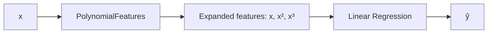

## Why polynomial regression exists

Sometimes the relationship is curved:

- learning curves
- growth/decay
- diminishing returns

A straight line underfits.

Polynomial regression keeps a linear model but **expands features**:

- x → [x, x², x³, ...]

## Picture intuition



## Scikit-learn example

```python title="Polynomial regression" showLineNumbers{1}
import numpy as np
from sklearn.pipeline import Pipeline
from sklearn.preprocessing import PolynomialFeatures
from sklearn.linear_model import LinearRegression

X = np.array([0, 1, 2, 3, 4]).reshape(-1, 1)
y = np.array([1, 2, 5, 10, 17])  # roughly quadratic

poly_model = Pipeline(
    steps=[
        ("poly", PolynomialFeatures(degree=2, include_bias=False)),
        ("lin", LinearRegression()),
    ]
)

poly_model.fit(X, y)
print(poly_model.predict([[5]]))
```

This is exactly the recipe from *Hands-On Machine Learning*: generate some
quadratic-looking data, transform it with `PolynomialFeatures`, then hand the
expanded features to an ordinary `LinearRegression`:

```python title="PolynomialFeatures on quadratic data" showLineNumbers{1}
import numpy as np
from sklearn.preprocessing import PolynomialFeatures
from sklearn.linear_model import LinearRegression

np.random.seed(42)
m = 100
X = 6 * np.random.rand(m, 1) - 3
y = 0.5 * X**2 + X + 2 + np.random.randn(m, 1)

poly_features = PolynomialFeatures(degree=2, include_bias=False)
X_poly = poly_features.fit_transform(X)

print("original feature:", X[0])
print("expanded features:", X_poly[0])   # [x, x^2]

lin_reg = LinearRegression()
lin_reg.fit(X_poly, y)
print("intercept:", lin_reg.intercept_, "coef:", lin_reg.coef_)
# ≈ y = 0.56x^2 + 0.93x + 1.78, close to the true 0.5x^2 + x + 2
```

`PolynomialFeatures(degree=d)` doesn't just add powers of one feature — with
multiple input features it also adds every **combination** of features up to
that degree (e.g. `a²`, `ab`, `a²b`, `b³`, ...). Careful: the feature count
grows combinatorially, following `(n + d)! / (d! n!)` for `n` original
features. Doubling the degree can explode the feature count.

## Overfitting warning

Higher degrees can fit noise. Figure 4-14 in the book compares a 300-degree
polynomial (wiggles to touch almost every point — **overfitting**), a plain
line (**underfitting**), and a quadratic model (fits the true shape of the
data, since it was generated by a quadratic function).

Use:

- validation
- regularization (Ridge/Lasso)

## Learning curves: telling over/underfitting apart

You usually don't know the "true" degree that generated your data. The book's
tool for diagnosing over/underfitting is the **learning curve**: plot the
model's training error and validation error as the training set size grows.

```python title="Plotting learning curves (book recipe)" showLineNumbers{1}
import numpy as np
from sklearn.metrics import mean_squared_error
from sklearn.model_selection import train_test_split

def plot_learning_curves(model, X, y):
    X_train, X_val, y_train, y_val = train_test_split(X, y, test_size=0.2, random_state=42)
    train_errors, val_errors = [], []
    for m in range(1, len(X_train)):
        model.fit(X_train[:m], y_train[:m])
        y_train_predict = model.predict(X_train[:m])
        y_val_predict = model.predict(X_val)
        train_errors.append(mean_squared_error(y_train[:m], y_train_predict))
        val_errors.append(mean_squared_error(y_val, y_val_predict))
    return np.sqrt(train_errors), np.sqrt(val_errors)

# lin_reg = LinearRegression(); plot_learning_curves(lin_reg, X, y)
# → both curves plateau close together and high = underfitting
#
# polynomial_regression = Pipeline([
#     ("poly_features", PolynomialFeatures(degree=10, include_bias=False)),
#     ("lin_reg", LinearRegression()),
# ])
# plot_learning_curves(polynomial_regression, X, y)
# → training error much lower, but a persistent gap to validation error = overfitting
```

- **Underfitting**: both curves plateau at a high error, close together. Adding
  more training data won't help — you need a more complex model or better features.
- **Overfitting**: training error is low, but there's a gap to a higher
  validation error. Feeding the model more training data narrows this gap.

This connects directly to the **bias/variance trade-off**: a high-bias model
(too simple) underfits; a high-variance model (too complex, like a high-degree
polynomial) overfits. Increasing model complexity trades bias for variance.

:::tip[From the book]
Géron splits a model's generalization error into three parts: **bias**
(wrong assumptions, like fitting a line to curved data), **variance**
(excessive sensitivity to the training set, like a wiggly high-degree
polynomial), and **irreducible error** (plain noise you can't model away).
Increasing complexity — a higher polynomial degree — trades bias for
variance: it can always fit the training points more closely, but it starts
memorizing noise instead of learning the underlying shape.
:::

## Visualize it

The chart on the left animates three model complexities fitting the same
noisy quadratic data — watch the line underfit, fit well, and then overfit
(wiggle wildly through every point). The chart on the right shows the
matching learning curves: notice how the training/validation gap opens up
exactly when the model starts overfitting.

```p5 title="Under/over-fitting a curved dataset" desc="A degree-1 line underfits, a degree-2 curve fits well, and a high-degree polynomial overfits by wiggling through the noise." height="300"
let pts = [];
function genPts() {
  pts = [];
  for (let i = 0; i < 30; i++) {
    const x = random(-3, 3);
    const y = 0.5 * x * x + x + 2 + random(-1.2, 1.2);
    pts.push({ x, y });
  }
}
function setup() {
  createCanvas(600, 300);
  textFont("monospace");
  textAlign(CENTER, CENTER);
  genPts();
}
function px(x) { return 46 + (x + 3.5) / 7 * (width - 92); }
function py(y) { return (height - 46) - (y + 2) / 14 * (height - 76); }
function fitDegree(d) {
  // crude polynomial least squares via normal equation
  const n = pts.length;
  const cols = d + 1;
  const XT = [];
  for (let r = 0; r < cols; r++) { XT.push(new Array(n).fill(0)); }
  for (let i = 0; i < n; i++) {
    let p = 1;
    for (let r = 0; r < cols; r++) { XT[r][i] = p; p *= pts[i].x; }
  }
  const XTX = [];
  for (let r = 0; r < cols; r++) {
    XTX.push(new Array(cols).fill(0));
    for (let c = 0; c < cols; c++) {
      let s = 0;
      for (let i = 0; i < n; i++) s += XT[r][i] * XT[c][i];
      XTX[r][c] = s;
    }
  }
  const XTy = new Array(cols).fill(0);
  for (let r = 0; r < cols; r++) {
    let s = 0;
    for (let i = 0; i < n; i++) s += XT[r][i] * pts[i].y;
    XTy[r] = s;
  }
  // Gaussian elimination with tiny ridge for stability at high degree
  const A = XTX.map((row, r) => row.map((v, c) => v + (r === c ? 1e-6 : 0)));
  const b = XTy.slice();
  for (let i = 0; i < cols; i++) {
    let piv = A[i][i] || 1e-9;
    for (let j = i; j < cols; j++) A[i][j] /= piv;
    b[i] /= piv;
    for (let k = 0; k < cols; k++) {
      if (k === i) continue;
      const f = A[k][i];
      for (let j = i; j < cols; j++) A[k][j] -= f * A[i][j];
      b[k] -= f * b[i];
    }
  }
  return b;
}
let stage = 0, t = 0;
const degrees = [1, 2, 12];
const labels = ["degree 1 (underfits)", "degree 2 (good fit)", "degree 12 (overfits)"];
let coeffs = fitDegree(degrees[0]);
function draw() {
  background(13, 17, 23);
  noStroke();
  for (const p of pts) { fill(75, 139, 190); ellipse(px(p.x), py(p.y), 7, 7); }
  stroke(255, 211, 67);
  strokeWeight(2.5);
  noFill();
  beginShape();
  for (let xx = -3.4; xx <= 3.4; xx += 0.05) {
    let yy = 0, p = 1;
    for (let c = 0; c < coeffs.length; c++) { yy += coeffs[c] * p; p *= xx; }
    vertex(px(xx), py(constrain(yy, -3, 12)));
  }
  endShape();
  noStroke();
  fill(107, 169, 221);
  textSize(13);
  text(labels[stage], width / 2, 20);
  t++;
  if (t > 130) { t = 0; stage = (stage + 1) % degrees.length; coeffs = fitDegree(degrees[stage]); if (stage === 0) genPts(); }
}
function mousePressed() { genPts(); coeffs = fitDegree(degrees[stage]); }
```

## Mini-checkpoint

Try degrees 1, 2, 3.

- does validation error improve?
- does it start getting worse at high degree?

import DataCampExercise from "../../../../components/DataCampExercise.astro";

## 🧪 Try It Yourself

### Exercise 1 – Expand Features with PolynomialFeatures

<DataCampExercise
  lang="python"
  hint={`\`PolynomialFeatures(degree=2, include_bias=False).fit_transform(X)\` adds x² alongside x.`}
  code={`# Task: Exercise 1 – Expand Features
import numpy as np
from sklearn.preprocessing import ___   # replace ___ with PolynomialFeatures

X = np.array([[2.0], [3.0]])
poly = PolynomialFeatures(degree=2, include_bias=False)
X_poly = poly.___(X)   # replace ___ with fit_transform
print(X_poly)

# ── Expected Output ───────────────────────────────────────────
# [[2. 4.]
#  [3. 9.]]
# ──────────────────────────────────────────────────────────────`}
  solution={`import numpy as np
from sklearn.preprocessing import PolynomialFeatures

X = np.array([[2.0], [3.0]])
poly = PolynomialFeatures(degree=2, include_bias=False)
X_poly = poly.fit_transform(X)
print(X_poly)`}
  sct={`test_output_contains("4.")
success_msg("x and x² are now both features — a linear model can use both!")`}
  height={148}
/>

### Exercise 2 – Build a Polynomial Pipeline

<DataCampExercise
  lang="python"
  hint={`A \`Pipeline\` chains \`PolynomialFeatures\` into \`LinearRegression\` so \`.fit()\` does both steps.`}
  code={`# Task: Exercise 2 – Polynomial Pipeline
from sklearn.pipeline import ___   # replace ___ with Pipeline
from sklearn.preprocessing import PolynomialFeatures
from sklearn.linear_model import LinearRegression
import numpy as np

X = np.array([0, 1, 2, 3, 4]).reshape(-1, 1)
y = np.array([1, 2, 5, 10, 17])

model = Pipeline([
    ("poly", PolynomialFeatures(degree=2, include_bias=False)),
    ("lin", LinearRegression()),
])
model.fit(X, y)
print(round(model.predict([[5]])[0]))

# ── Expected Output ───────────────────────────────────────────
# 26
# ──────────────────────────────────────────────────────────────`}
  solution={`from sklearn.pipeline import Pipeline
from sklearn.preprocessing import PolynomialFeatures
from sklearn.linear_model import LinearRegression
import numpy as np

X = np.array([0, 1, 2, 3, 4]).reshape(-1, 1)
y = np.array([1, 2, 5, 10, 17])
model = Pipeline([
    ("poly", PolynomialFeatures(degree=2, include_bias=False)),
    ("lin", LinearRegression()),
])
model.fit(X, y)
print(round(model.predict([[5]])[0]))`}
  sct={`test_output_contains("26")
success_msg("The pipeline expanded features and fit the linear model in one call!")`}
  height={158}
/>

### Exercise 3 – Spot Overfitting with Train vs Validation MSE

<DataCampExercise
  lang="python"
  hint={`A large gap between low train MSE and high validation MSE is the hallmark of overfitting.`}
  code={`# Task: Exercise 3 – Spot Overfitting
from sklearn.metrics import mean_squared_error
import numpy as np

y_train, train_pred = np.array([1, 2, 5, 10]), np.array([1.01, 1.99, 5.02, 9.98])
y_val, val_pred = np.array([3, 8, 15]), np.array([6.5, 2.1, 22.0])

train_mse = mean_squared_error(y_train, train_pred)
val_mse = ___(y_val, val_pred)   # replace ___ with mean_squared_error
print("train:", round(train_mse, 2), "val:", round(val_mse, 2))
print("overfitting:", val_mse > train_mse * 5)

# ── Expected Output ───────────────────────────────────────────
# train: 0.0 val: 79.75
# overfitting: True
# ──────────────────────────────────────────────────────────────`}
  solution={`from sklearn.metrics import mean_squared_error
import numpy as np

y_train, train_pred = np.array([1, 2, 5, 10]), np.array([1.01, 1.99, 5.02, 9.98])
y_val, val_pred = np.array([3, 8, 15]), np.array([6.5, 2.1, 22.0])
train_mse = mean_squared_error(y_train, train_pred)
val_mse = mean_squared_error(y_val, val_pred)
print("train:", round(train_mse, 2), "val:", round(val_mse, 2))
print("overfitting:", val_mse > train_mse * 5)`}
  sct={`test_output_contains("overfitting: True")
success_msg("That gap between train and validation error is exactly what learning curves reveal!")`}
  height={168}
/>

## Next

Continue to **Cost Functions - Mean Squared Error (MSE)** — formalize the
error measure that every model in this phase is trying to minimize.
