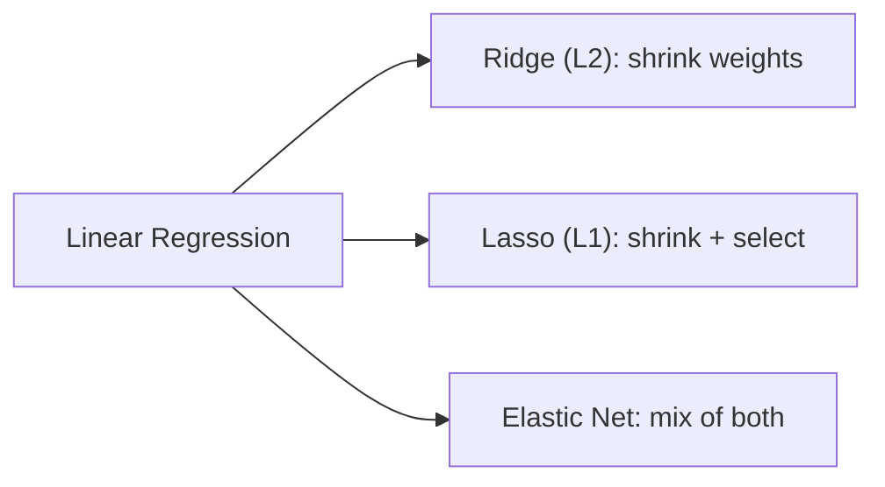

## Why regularization exists

Regression models can overfit when:

- there are many features
- features are noisy
- polynomial degree is high

Overfitting often shows up as:

- great training error
- bad validation/test error

Regularization adds a penalty that discourages overly complex solutions.

## Ridge Regression (L2)

Ridge (also called **Tikhonov regularization**) minimizes:

`J(θ) = MSE(θ) + λ · (1/2) · Σ(θi²)`  for i = 1..n

Note the sum starts at `i = 1`, not `0` — the bias term `θ0` is **never**
regularized. Effect:

- shrinks coefficients toward 0
- usually keeps all features (rarely exactly 0)
- if `λ = 0`, Ridge is just plain Linear Regression; if `λ` is huge, all
  weights shrink close to 0 and the model becomes a flat line at the mean of `y`

Ridge also has a closed-form solution, a small variant of the Normal Equation:

`θ̂ = (XᵀX + λA)⁻¹ Xᵀy`

where `A` is the identity matrix with a `0` in the top-left corner (so the
bias term is excluded).

## Lasso Regression (L1)

**Lasso** (Least Absolute Shrinkage and Selection Operator) minimizes:

`J(θ) = MSE(θ) + λ · Σ|θi|`  for i = 1..n

Effect:

- can push some coefficients **exactly** to 0
- performs automatic **feature selection**, producing a sparse model

Why does Lasso zero out weights while Ridge only shrinks them? The book's
geometric intuition: the L1 penalty's contour lines have sharp corners on the
axes, so Gradient Descent tends to get pushed exactly onto an axis (where one
weight is 0) before rolling down the remaining "gutter." Ridge's L2 penalty
has smooth circular contours, so weights shrink continuously but rarely hit
exactly 0.

## Elastic Net

**Elastic Net** is a mix of both penalties, controlled by a mix ratio `r`
(scikit-learn calls it `l1_ratio`):

`J(θ) = MSE(θ) + r·λ · Σ|θi| + (1 − r)/2 · λ · Σ(θi²)`

- `r = 0` → pure Ridge
- `r = 1` → pure Lasso

The book's rule of thumb: **almost always regularize at least a little**.
Ridge is a good default; if you suspect only a few features actually matter,
prefer Lasso or Elastic Net. Elastic Net is usually safer than pure Lasso when
you have more features than instances, or when features are strongly
correlated.



## Scikit-learn examples

```python title="Ridge, Lasso, and Elastic Net" showLineNumbers{1}
from sklearn.linear_model import Ridge, Lasso, ElasticNet
import numpy as np

np.random.seed(42)
X = 3 * np.random.rand(50, 1)
y = 1 + 0.5 * X + np.random.randn(50, 1)

ridge = Ridge(alpha=1.0, solver="cholesky")   # alpha is λ
ridge.fit(X, y)
print("Ridge:", ridge.predict([[1.5]]))

lasso = Lasso(alpha=0.1)
lasso.fit(X, y)
print("Lasso:", lasso.predict([[1.5]]))

elastic_net = ElasticNet(alpha=0.1, l1_ratio=0.5)   # l1_ratio is r
elastic_net.fit(X, y)
print("Elastic Net:", elastic_net.predict([[1.5]]))
```

You can also regularize with Gradient Descent via `SGDRegressor(penalty="l2")`
or `penalty="l1"` — the `penalty` hyperparameter adds the corresponding term
straight into the cost function being minimized.

## Early stopping

A very different regularization trick for *any* iterative algorithm: stop
training the moment the **validation error** stops improving and starts
climbing back up — that's the point where the model begins to overfit.

```python title="Early stopping (book recipe)" showLineNumbers{1}
from sklearn.base import clone
from sklearn.linear_model import SGDRegressor
from sklearn.metrics import mean_squared_error
from sklearn.model_selection import train_test_split
from sklearn.pipeline import Pipeline
from sklearn.preprocessing import PolynomialFeatures, StandardScaler
import numpy as np

np.random.seed(42)
m = 100
X = 6 * np.random.rand(m, 1) - 3
y = 2 + X + 0.5 * X**2 + np.random.randn(m, 1)
X_train, X_val, y_train, y_val = train_test_split(X, y.ravel(), test_size=0.2, random_state=42)

poly_scaler = Pipeline([
    ("poly_features", PolynomialFeatures(degree=90, include_bias=False)),
    ("std_scaler", StandardScaler()),
])
X_train_poly_scaled = poly_scaler.fit_transform(X_train)
X_val_poly_scaled = poly_scaler.transform(X_val)

sgd_reg = SGDRegressor(max_iter=1, tol=-np.inf, warm_start=True,
                        penalty=None, learning_rate="constant", eta0=0.0005)

minimum_val_error = float("inf")
best_epoch, best_model = None, None

for epoch in range(200):
    sgd_reg.fit(X_train_poly_scaled, y_train)   # continues where it left off
    y_val_predict = sgd_reg.predict(X_val_poly_scaled)
    val_error = mean_squared_error(y_val, y_val_predict)
    if val_error < minimum_val_error:
        minimum_val_error = val_error
        best_epoch = epoch
        best_model = clone(sgd_reg)

print("best epoch:", best_epoch, "min val error:", round(minimum_val_error, 3))
```

`warm_start=True` means each call to `.fit()` picks up training where the
last one left off, instead of restarting from scratch — essential for
checking the validation error one epoch at a time.

## Important: scale features

Regularization is sensitive to feature scale.

Use `StandardScaler` in a pipeline.

## Choosing λ (alpha)

- use validation or cross-validation
- `RidgeCV` / `LassoCV` can help

## Visualize it

Watch what happens to a set of feature weights as you dial up the
regularization strength `λ`: Ridge (blue bars) shrinks every weight smoothly
toward zero, while Lasso (amber bars) drives the smaller, less important
weights all the way to exactly zero — feature selection in action.

```p5 title="Ridge vs Lasso shrinking coefficients" desc="As λ increases, Ridge shrinks all weights smoothly; Lasso pushes the smaller weights to exactly zero." height="300"
const trueWeights = [2.4, -1.6, 0.9, 0.5, -0.3];
let lambda = 0;
let dir = 1;
function setup() {
  createCanvas(600, 300);
  textFont("monospace");
  textAlign(CENTER, CENTER);
}
function ridgeShrink(w, lam) { return w / (1 + lam); }
function lassoShrink(w, lam) {
  const s = Math.sign(w) * Math.max(Math.abs(w) - lam * 0.5, 0);
  return s;
}
function draw() {
  background(13, 17, 23);
  const n = trueWeights.length;
  const groupW = (width - 100) / n;
  const zeroY = height / 2 + 10;
  const scale = 34;

  noStroke();
  fill(150);
  textSize(12);
  textAlign(CENTER, CENTER);
  text("λ = " + lambda.toFixed(2), width / 2, 20);

  for (let i = 0; i < n; i++) {
    const cx = 70 + i * groupW + groupW / 2;
    const rW = ridgeShrink(trueWeights[i], lambda);
    const lW = lassoShrink(trueWeights[i], lambda);

    stroke(60, 70, 84);
    strokeWeight(1);
    line(cx - groupW / 2 + 8, zeroY, cx + groupW / 2 - 8, zeroY);

    noStroke();
    fill(75, 139, 190);
    rect(cx - 16, zeroY - rW * scale, 12, rW * scale);
    fill(255, 211, 67);
    rect(cx + 4, zeroY - lW * scale, 12, lW * scale);

    fill(150);
    textSize(10);
    text("w" + (i + 1), cx, zeroY + 16);
  }

  fill(75, 139, 190);
  textAlign(LEFT, CENTER);
  textSize(12);
  text("■ Ridge", 16, height - 16);
  fill(255, 211, 67);
  text("■ Lasso", 110, height - 16);

  lambda += 0.01 * dir;
  if (lambda > 3.2 || lambda < 0) dir *= -1;
}
```

:::tip[From the book]
Regularization is sensitive to feature scale, so always scale inputs (e.g.
`StandardScaler`) before Ridge, Lasso, or Elastic Net — this is true of most
regularized models. And per Géron: it's "almost always preferable to have at
least a little bit of regularization, so generally you should avoid plain
Linear Regression." Ridge is a solid default; reach for Lasso or Elastic Net
when you suspect many features are irrelevant.
:::

## Mini-checkpoint

If you have 1000 features:

- which regularization might help reduce features automatically?

(Usually Lasso.)

import DataCampExercise from "../../../../components/DataCampExercise.astro";

## 🧪 Try It Yourself

### Exercise 1 – Fit a Ridge Model

<DataCampExercise
  lang="python"
  hint={`\`Ridge(alpha=...)\` — \`alpha\` is the λ regularization strength.`}
  code={`# Task: Exercise 1 – Fit Ridge
from sklearn.linear_model import ___   # replace ___ with Ridge
import numpy as np

X = np.array([[1], [2], [3], [4], [5]])
y = np.array([2, 4, 5, 4, 5])

ridge = Ridge(alpha=1.0)
ridge.fit(X, y)
print("coef:", round(ridge.coef_[0], 3))

# ── Expected Output ───────────────────────────────────────────
# coef: 0.514
# ──────────────────────────────────────────────────────────────`}
  solution={`from sklearn.linear_model import Ridge
import numpy as np

X = np.array([[1], [2], [3], [4], [5]])
y = np.array([2, 4, 5, 4, 5])
ridge = Ridge(alpha=1.0)
ridge.fit(X, y)
print("coef:", round(ridge.coef_[0], 3))`}
  sct={`test_output_contains("0.514")
success_msg("Ridge shrinks the coefficient compared to plain Linear Regression!")`}
  height={158}
/>

### Exercise 2 – Watch Lasso Zero Out a Weight

<DataCampExercise
  lang="python"
  hint={`A large enough \`alpha\` in \`Lasso\` will push some coefficients to exactly 0.0.`}
  code={`# Task: Exercise 2 – Lasso Feature Selection
from sklearn.linear_model import Lasso
import numpy as np

X = np.array([[1, 5], [2, 5], [3, 5], [4, 5], [5, 5]])   # 2nd feature is constant/noisy
y = np.array([2, 4, 6, 8, 10])

lasso = Lasso(alpha=___)   # replace ___ with 1.0
lasso.fit(X, y)
print("coefs:", lasso.coef_)

# ── Expected Output ───────────────────────────────────────────
# coefs: [1.9 0. ]
# ──────────────────────────────────────────────────────────────`}
  solution={`from sklearn.linear_model import Lasso
import numpy as np

X = np.array([[1, 5], [2, 5], [3, 5], [4, 5], [5, 5]])
y = np.array([2, 4, 6, 8, 10])
lasso = Lasso(alpha=1.0)
lasso.fit(X, y)
print("coefs:", lasso.coef_)`}
  sct={`test_output_contains("0.")
success_msg("Lasso zeroed out the useless feature — automatic feature selection!")`}
  height={168}
/>

### Exercise 3 – Mix Ridge and Lasso with Elastic Net

<DataCampExercise
  lang="python"
  hint={`\`l1_ratio\` is the mix ratio r: 0 = pure Ridge, 1 = pure Lasso.`}
  code={`# Task: Exercise 3 – Elastic Net
from sklearn.linear_model import ElasticNet
import numpy as np

X = np.array([[1], [2], [3], [4], [5]])
y = np.array([2, 4, 5, 4, 5])

elastic_net = ElasticNet(alpha=0.1, l1_ratio=___)   # replace ___ with 0.5
elastic_net.fit(X, y)
print("coef:", round(elastic_net.coef_[0], 3))

# ── Expected Output ───────────────────────────────────────────
# coef: 0.6
# ──────────────────────────────────────────────────────────────`}
  solution={`from sklearn.linear_model import ElasticNet
import numpy as np

X = np.array([[1], [2], [3], [4], [5]])
y = np.array([2, 4, 5, 4, 5])
elastic_net = ElasticNet(alpha=0.1, l1_ratio=0.5)
elastic_net.fit(X, y)
print("coef:", round(elastic_net.coef_[0], 3))`}
  sct={`test_output_contains("0.6")
success_msg("l1_ratio=0.5 is halfway between Ridge and Lasso!")`}
  height={158}
/>

## Next

Continue to **Metrics - R-Squared and Adjusted R-Squared** — learn how to
score any of these regularized (or plain) models once they're trained.
