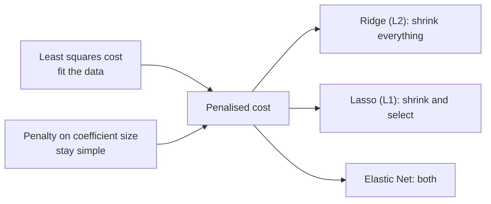

import DataCampExercise from "../../../../components/DataCampExercise.astro";
import AlgorithmCard from "../../../../components/AlgorithmCard.astro";
import Figure from "../../../../components/Figure.astro";
import Quiz from "../../../../components/Quiz.astro";

## What you'll learn

- why shrinking coefficients toward zero can *improve* predictions — the bias-variance trade
- the Ridge closed form, and the exact shrinkage factor it applies
- the Lasso soft-thresholding rule, and why it produces genuine zeros
- both computed **by hand** on the orthogonal design from the Multiple Regression page
- the geometric reason a diamond selects features and a circle does not
- Elastic Net, and how to choose $\alpha$ honestly with cross-validation

## Intuition

Ordinary least squares has exactly one goal: make the training residuals small. Given enough
features it will happily grow enormous coefficients that cancel each other out — a coefficient of
+4,000 on one column and −3,950 on a nearly identical one. The training fit looks superb, and the
first new row destroys it.

Regularisation adds a second goal to the objective: **keep the coefficients small**. The model now
has to justify every unit of coefficient with a real reduction in error. Noise cannot pay that
price, so noise gets squeezed out. You trade a little bias for a large reduction in variance, and
on held-out data the trade usually pays.



## The math

### The three objectives

$$
J_{\text{ridge}}(\boldsymbol{\theta}) = \lVert\mathbf{y} - \mathbf{X}\boldsymbol{\theta}\rVert_2^2 + \lambda\sum_{j=1}^{n}\theta_j^2
$$

$$
J_{\text{lasso}}(\boldsymbol{\theta}) = \lVert\mathbf{y} - \mathbf{X}\boldsymbol{\theta}\rVert_2^2 + \lambda\sum_{j=1}^{n}\lvert\theta_j\rvert
$$

$$
J_{\text{enet}}(\boldsymbol{\theta}) = \lVert\mathbf{y} - \mathbf{X}\boldsymbol{\theta}\rVert_2^2 + \lambda\left(\rho\sum_{j=1}^{n}\lvert\theta_j\rvert + \frac{1-\rho}{2}\sum_{j=1}^{n}\theta_j^2\right)
$$

Note the sums start at $j = 1$: **the intercept is never penalised**. Shrinking $\theta_0$ would
tie the model's predictions to zero rather than to the data's mean, which is meaningless.

### Ridge has a closed form

Differentiating $J_{\text{ridge}}$ and setting the gradient to zero gives a modified Normal
Equation:

$$
\boldsymbol{\theta}_{\text{ridge}} = \left(\mathbf{X}^\top\mathbf{X} + \lambda\mathbf{I}\right)^{-1}\mathbf{X}^\top\mathbf{y}
$$

Adding $\lambda\mathbf{I}$ to the diagonal does something valuable beyond shrinkage: it makes the
matrix **invertible even when $\mathbf{X}^\top\mathbf{X}$ is singular**. Ridge works when features
outnumber samples, and when two columns are perfectly duplicated. Plain OLS does neither.

For an orthogonal design where $\mathbf{X}^\top\mathbf{X} = c\mathbf{I}$, the formula collapses to
pure per-coefficient shrinkage:

$$
\theta_j^{\text{ridge}} = \frac{c}{c + \lambda}\,\theta_j^{\text{OLS}}
$$

Every coefficient is multiplied by the same factor below 1. That factor never reaches zero for
finite $\lambda$ — which is the whole story of why Ridge cannot select features.

### Lasso has no closed form, but it has a rule

The absolute value is not differentiable at zero, so there is no matrix formula. On an orthogonal
design, though, the coordinate-wise solution is exact and beautifully simple —
**soft thresholding**:

$$
\theta_j^{\text{lasso}} = \operatorname{sign}\!\left(\theta_j^{\text{OLS}}\right)\max\!\left(\left\lvert\theta_j^{\text{OLS}}\right\rvert - \frac{\lambda}{2c},\; 0\right)
$$

Subtract a fixed amount from every coefficient's magnitude, and clamp at zero. Any coefficient
smaller than the threshold becomes **exactly** zero, not merely small. That is feature selection
falling out of the algebra.

:::note[Where this comes from]
The $\ell_1$ and $\ell_2$ norms and the shape of their unit balls come from
[Norms](/mathematics-for-machine-learning/chapter-03---analytic-geometry/norms/).
The two penalties are literally these two norms, and the difference in behaviour is the difference
between a diamond and a circle.
:::

## Worked example by hand

The orthogonal design from
[Multiple Linear Regression](/machine-learning/phase-03---supervised-learning---regression/multiple-linear-regression/),
where $\mathbf{X}^\top\mathbf{X} = 4\mathbf{I}$, $\mathbf{X}^\top\mathbf{y} = [17, 9, 5]^\top$ and
the OLS answer was $\boldsymbol{\theta} = [4.25,\ 2.25,\ 1.25]^\top$.

**Ridge at $\lambda = 4$.** With $c = 4$, the shrinkage factor is $4/(4+4) = 0.5$:

$$
\theta_1 = \frac{9}{4+4} = 1.125,
\qquad
\theta_2 = \frac{5}{4+4} = 0.625
$$

**Ridge at $\lambda = 10$.** Factor $4/14 \approx 0.286$:

$$
\theta_1 = \frac{9}{14} \approx 0.643,
\qquad
\theta_2 = \frac{5}{14} \approx 0.357
$$

**Lasso at $\lambda = 4$.** The threshold is $\lambda/(2c) = 4/8 = 0.5$, subtracted from each OLS
coefficient:

$$
\theta_1 = 2.25 - 0.5 = 1.75,
\qquad
\theta_2 = 1.25 - 0.5 = 0.75
$$

**Lasso at $\lambda = 10$.** Threshold $10/8 = 1.25$:

$$
\theta_1 = 2.25 - 1.25 = 1.00,
\qquad
\theta_2 = \max(1.25 - 1.25,\ 0) = \mathbf{0}
$$

There it is. At $\lambda = 10$ Lasso has deleted the weekend feature entirely, while Ridge at the
same $\lambda$ merely shrank it to 0.357. The intercept stays at 4.25 throughout, because it is
never penalised.

| | OLS | Ridge $\lambda{=}4$ | Ridge $\lambda{=}10$ | Lasso $\lambda{=}4$ | Lasso $\lambda{=}10$ |
| --- | --- | --- | --- | --- | --- |
| intercept | 4.25 | 4.25 | 4.25 | 4.25 | 4.25 |
| $\theta_1$ promotion | 2.25 | 1.125 | 0.643 | 1.75 | 1.00 |
| $\theta_2$ weekend | 1.25 | 0.625 | 0.357 | 0.75 | **0** |
| features used | 2 | 2 | 2 | 2 | **1** |

:::tip[scikit-learn scales lambda differently]
`Ridge(alpha=λ)` matches the formulas above directly. `Lasso(alpha=a)` minimises
$\frac{1}{2m}\lVert\mathbf{y}-\mathbf{X}\boldsymbol{\theta}\rVert^2 + a\lVert\boldsymbol{\theta}\rVert_1$,
so its `alpha` equals $\lambda/(2m)$. With $m = 4$ and $\lambda = 10$ that is `alpha=1.25` — and
`Lasso(alpha=1.25).fit(X, y).coef_` returns exactly `[1.0, 0.0]`.
:::

## The geometry

<Figure
  src="/images/ml/phase-03-regression/regularization-ridge-lasso/constraint-geometry"
  alt="Two panels. Left: elliptical cost contours expanding from the OLS solution until they touch the corner of a diamond on the vertical axis. Right: the same contours touching a circle on a smooth part of its edge."
  title="Why the shape of the penalty decides whether coefficients reach zero"
  caption="Both problems are 'find the smallest cost inside the amber region'. The diamond has corners on the axes; the circle has none. Corners are where coefficients equal zero."
/>

Both penalties can be restated as a constrained problem: minimise the squared error subject to the
coefficient vector staying inside a region of fixed size. The solution is where the growing
elliptical cost contours first touch that region.

- The $\ell_1$ ball is a **diamond**, and its corners sit exactly on the axes. A corner is a point
  where one coordinate is zero. Corners stick out, so contours tend to hit them first.
- The $\ell_2$ ball is a **circle** with no corners anywhere. The touch point is generically a
  smooth spot where every coordinate is non-zero.

That is the entire explanation, and it generalises: in $n$ dimensions the $\ell_1$ ball has
low-dimensional faces where many coefficients vanish at once.

## See it move

Watch both penalties act on five coefficients as $\lambda$ sweeps upward. The Ridge bars shrink
smoothly and never disappear; the Lasso bars hit zero one after another.

```p5 title="Ridge versus Lasso shrinking coefficients" desc="As lambda increases, Ridge shrinks all weights smoothly while Lasso pushes the smaller weights to exactly zero." height="300"
const trueWeights = [2.4, -1.6, 0.9, 0.5, -0.3];
let lambda = 0;
let dir = 1;
function setup() {
  createCanvas(600, 300);
  textFont("monospace");
  textAlign(CENTER, CENTER);
}
function ridgeShrink(w, lam) { return w / (1 + lam); }
function lassoShrink(w, lam) {
  const s = Math.sign(w) * Math.max(Math.abs(w) - lam * 0.5, 0);
  return s;
}
function draw() {
  background(13, 17, 23);
  const n = trueWeights.length;
  const groupW = (width - 100) / n;
  const zeroY = height / 2 + 10;
  const scale = 34;

  noStroke();
  fill(150);
  textSize(12);
  textAlign(CENTER, CENTER);
  text("λ = " + lambda.toFixed(2), width / 2, 20);

  for (let i = 0; i < n; i++) {
    const cx = 70 + i * groupW + groupW / 2;
    const rW = ridgeShrink(trueWeights[i], lambda);
    const lW = lassoShrink(trueWeights[i], lambda);

    stroke(60, 70, 84);
    strokeWeight(1);
    line(cx - groupW / 2 + 8, zeroY, cx + groupW / 2 - 8, zeroY);

    noStroke();
    fill(75, 139, 190);
    rect(cx - 16, zeroY - rW * scale, 12, rW * scale);
    fill(255, 211, 67);
    rect(cx + 4, zeroY - lW * scale, 12, lW * scale);

    fill(150);
    textSize(10);
    text("w" + (i + 1), cx, zeroY + 16);
  }

  fill(75, 139, 190);
  textAlign(LEFT, CENTER);
  textSize(12);
  text("■ Ridge", 16, height - 16);
  fill(255, 211, 67);
  text("■ Lasso", 110, height - 16);

  lambda += 0.01 * dir;
  if (lambda > 3.2 || lambda < 0) dir *= -1;
}
```

## From scratch

Both rules, verified against scikit-learn on the four-row design:

```python title="shrinkage.py" showLineNumbers{1}
import numpy as np
from sklearn.linear_model import Ridge, Lasso

X = np.array([[-1.0, -1.0], [-1.0, 1.0], [1.0, -1.0], [1.0, 1.0]])
y = np.array([1.0, 3.0, 5.0, 8.0])
c = 4.0                                  # X.T @ X = 4 * I for this design
ols = np.array([2.25, 1.25])             # from the Multiple Regression page


def ridge_closed_form(theta_ols, lam, c):
    return c / (c + lam) * theta_ols


def lasso_soft_threshold(theta_ols, lam, c):
    shrink = lam / (2 * c)
    return np.sign(theta_ols) * np.maximum(np.abs(theta_ols) - shrink, 0.0)


for lam in (4.0, 10.0):
    mine_r = ridge_closed_form(ols, lam, c)
    mine_l = lasso_soft_threshold(ols, lam, c)

    sk_r = Ridge(alpha=lam).fit(X, y).coef_
    sk_l = Lasso(alpha=lam / (2 * len(y)), max_iter=100000).fit(X, y).coef_

    print(f"lambda = {lam}")
    print(f"  ridge  mine {mine_r.round(4)}  sklearn {sk_r.round(4)}")
    print(f"  lasso  mine {mine_l.round(4)}  sklearn {sk_l.round(4)}")

# lambda = 4.0
#   ridge  mine [1.125 0.625]  sklearn [1.125 0.625]
#   lasso  mine [1.75 0.75  ]  sklearn [1.75 0.75  ]
# lambda = 10.0
#   ridge  mine [0.6429 0.3571]  sklearn [0.6429 0.3571]
#   lasso  mine [1. 0.]         sklearn [1. 0.]
```

## Coefficient paths on real data

<Figure
  src="/images/ml/phase-03-regression/regularization-ridge-lasso/coefficient-paths"
  alt="Two panels of coefficient paths against alpha on a log scale for the ten standardised diabetes features. Left, Ridge: all ten curves decay smoothly toward but never reach zero. Right, Lasso: curves snap to exactly zero at different alphas until none are left."
  title="Ten standardised diabetes features, penalised two ways"
  caption="Read left to right as the penalty tightens. Ridge curves approach the axis asymptotically; Lasso curves meet it and stop, one feature at a time."
/>

### Reading the plots

1. **Both start at the OLS solution.** At the far left the penalty is negligible and both panels
   reproduce ordinary least squares.
2. **Ridge shrinks in proportion.** The largest coefficients fall fastest in absolute terms, but
   the ordering is broadly preserved and nothing ever reaches the axis.
3. **Lasso eliminates in sequence.** Each curve hits zero at its own $\alpha$ and stays there. The
   order in which features drop out is a crude but genuinely useful importance ranking.
4. **Both end at zero.** Push $\alpha$ high enough and every coefficient vanishes; the model
   becomes "always predict the mean".

## With scikit-learn

On the raw ten diabetes features, regularisation changes almost nothing — 442 samples over 10
well-behaved columns is simply not an overfitting situation. Expand to degree 2 (65 features) and
the picture changes completely:

```python title="regularised_pipelines.py" showLineNumbers{1}
from sklearn.datasets import load_diabetes
from sklearn.linear_model import LinearRegression, Ridge, Lasso
from sklearn.model_selection import cross_val_score
from sklearn.pipeline import make_pipeline
from sklearn.preprocessing import PolynomialFeatures, StandardScaler

X, y = load_diabetes(return_X_y=True)


def cv_mse(estimator):
    pipe = make_pipeline(
        PolynomialFeatures(2, include_bias=False),   # 10 features -> 65
        StandardScaler(),                            # penalties need a common scale
        estimator,
    )
    return -cross_val_score(
        pipe, X, y, cv=5, scoring="neg_mean_squared_error"
    ).mean()


print(f"OLS              {cv_mse(LinearRegression()):.1f}")   # OLS              3495.3
print(f"Ridge alpha=10   {cv_mse(Ridge(alpha=10)):.1f}")      # Ridge alpha=10   3165.1
print(f"Ridge alpha=100  {cv_mse(Ridge(alpha=100)):.1f}")     # Ridge alpha=100  3063.0
print(f"Lasso alpha=1    {cv_mse(Lasso(alpha=1, max_iter=200000)):.1f}")
#                                                             # Lasso alpha=1    3016.1
```

Regularisation cuts cross-validated error by roughly 14%, from 3495 to 3016 — and the Lasso model
gets there using 34 of the 65 columns.

<Figure
  src="/images/ml/phase-03-regression/regularization-ridge-lasso/alpha-vs-error"
  alt="Cross-validated MSE plotted against alpha on a log scale for ridge regression on 65 polynomial features. The curve is flat and high at small alpha, dips to a minimum near alpha 66, then rises steeply."
  title="Choosing alpha by cross-validation"
  caption="Flat on the left because a tiny penalty is no penalty; a clear minimum around 66; a steep climb on the right as the penalty overwhelms the signal. Never pick alpha by eye — pick it here."
/>

### Choosing $\alpha$ properly

```python title="tuning_alpha.py" showLineNumbers{1}
import numpy as np
from sklearn.datasets import load_diabetes
from sklearn.linear_model import RidgeCV, LassoCV
from sklearn.pipeline import make_pipeline
from sklearn.preprocessing import StandardScaler

X, y = load_diabetes(return_X_y=True)
alphas = np.geomspace(1e-3, 1e3, 60)

ridge = make_pipeline(StandardScaler(), RidgeCV(alphas=alphas)).fit(X, y)
lasso = make_pipeline(
    StandardScaler(), LassoCV(alphas=alphas, cv=5, max_iter=100000, random_state=0)
).fit(X, y)

print(f"RidgeCV alpha = {ridge[-1].alpha_:.4f}")           # RidgeCV alpha = 1.7957
print(f"LassoCV alpha = {lasso[-1].alpha_:.4f}")           # LassoCV alpha = 0.0732
print(f"Lasso kept {(lasso[-1].coef_ != 0).sum()} of 10")  # Lasso kept 9 of 10
```

`RidgeCV` and `LassoCV` do the sweep internally and are considerably faster than a manual
`GridSearchCV` because they reuse the solution path.

## Which penalty

| | Ridge (L2) | Lasso (L1) | Elastic Net |
| --- | --- | --- | --- |
| Coefficients reach zero | Never | Yes | Yes |
| Closed form | Yes | No | No |
| With correlated features | Splits weight between them | Picks one arbitrarily | Keeps the group together |
| When $n > m$ | Works | Selects at most $m$ features | Works, no cap |
| Interpretability | Good | Best — fewer features | Good |
| Default choice when | All features plausibly matter | You suspect most are noise | Correlated groups, or unsure |
| scikit-learn | `Ridge`, `RidgeCV` | `Lasso`, `LassoCV` | `ElasticNet`, `ElasticNetCV` |

Elastic Net exists because Lasso has a specific failure mode: with two nearly identical features it
picks one at random and zeroes the other, and which one it picks flips with a different random
seed. Adding a little L2 to the L1 makes correlated features enter or leave together.

<AlgorithmCard
  name="Ridge and Lasso Regression"
  type="Supervised · Regression · Regularised"
  sklearn="sklearn.linear_model.Ridge / Lasso / ElasticNet"
  assumptions={[
    "The same linearity assumptions as ordinary least squares",
    "Features are standardised — the penalty is meaningless otherwise",
    "Shrinking coefficients toward zero is a reasonable prior for this problem",
  ]}
  complexity={{ train: "Ridge O(m·n² + n³) closed form; Lasso O(m·n) per coordinate sweep", predict: "O(n)", memory: "O(n)" }}
  notation="m = samples, n = features"
  hyperparams={[
    { name: "alpha", default: "1.0", effect: "Penalty strength. Zero recovers OLS; large values drive every coefficient to zero. Always cross-validate it." },
    { name: "l1_ratio", default: "0.5 (ElasticNet)", effect: "Mix between L1 and L2. 1.0 is pure Lasso, 0.0 is pure Ridge." },
    { name: "max_iter", default: "1000", effect: "Lasso and Elastic Net iterate; raise it when you see a convergence warning." },
    { name: "solver", default: "auto (Ridge)", effect: "'saga' handles sparse data and very large problems; 'cholesky' is fastest for dense wide-but-short data." },
  ]}
  useWhen={[
    "Features outnumber samples, or nearly do",
    "Features are correlated and OLS coefficients look unstable",
    "You expanded features (polynomials, one-hot, interactions) and now overfit",
    "You want automatic feature selection (Lasso)",
  ]}
  avoidWhen={[
    "You have far more samples than features and OLS already generalises well",
    "You cannot standardise the features",
    "You need unbiased coefficient estimates for statistical inference",
  ]}
/>

## Pitfalls

:::danger[Regularisation without scaling is silently wrong]
The penalty charges by coefficient magnitude, and magnitude depends on the feature's units. A
feature measured in metres gets a coefficient 1,000 times smaller than the same feature in
millimetres, so it is penalised 1,000,000 times less by Ridge. Without `StandardScaler` the model
is penalising your choice of units. Every regularised pipeline on this page scales first.
:::

:::caution[Never penalise the intercept]
scikit-learn handles this for you when `fit_intercept=True`. If you write the closed form yourself,
add $\lambda$ only to the diagonal entries corresponding to real features, not to the bias.
:::

:::caution[Lasso picks arbitrarily among correlated features]
Give it two copies of the same column and it keeps one and zeroes the other, essentially by
coin flip. Do not read "the discarded one is unimportant" into that. Use Elastic Net when
correlated groups matter.
:::

:::caution[Regularisation is not free]
On the raw diabetes features every penalty scores within 0.5 MSE of plain OLS — the data was never
overfitting, so there was nothing to fix. Regularisation buys variance reduction at the cost of
bias. When there is no variance problem, you only pay.
:::

<Quiz
  questions={[
    {
      q: "Why can Lasso set a coefficient to exactly zero while Ridge cannot?",
      options: [
        "Lasso uses a different optimiser",
        "The L1 constraint region is a diamond with corners on the axes, and the cost contours tend to touch a corner first",
        "Lasso rounds small coefficients to zero afterwards",
        "Ridge can also reach zero, just more slowly",
      ],
      answer: 1,
      explain: "It is geometry. A corner of the diamond is a point where one coordinate is zero; the circle of the L2 ball has no corners, so its touch point generically has every coordinate non-zero.",
    },
    {
      q: "What does adding lambda times the identity to X transpose X accomplish beyond shrinkage?",
      options: [
        "It speeds up the matrix multiplication",
        "It makes the matrix invertible even when the features are collinear or outnumber the samples",
        "It centres the features",
        "It removes the need for an intercept",
      ],
      answer: 1,
      explain: "A singular X transpose X becomes non-singular once you add a positive constant to its diagonal, which is why Ridge has a solution in cases where OLS has none.",
    },
    {
      q: "Why must features be standardised before regularising?",
      options: [
        "Because the solver requires it numerically",
        "Because the penalty charges by coefficient size, so a feature's units silently decide how much it is penalised",
        "Because it makes the intercept zero",
        "It is not required; scaling only affects gradient descent",
      ],
      answer: 1,
      explain: "Rescaling a feature rescales its coefficient inversely, which changes the penalty that coefficient incurs. Without a common scale you are penalising your choice of units.",
    },
    {
      q: "Your two most predictive features have a correlation of 0.98. Which penalty is the best fit?",
      options: [
        "Lasso, so one of them is dropped",
        "Elastic Net, so the correlated pair enters or leaves together",
        "No penalty at all",
        "Ridge with a very large alpha",
      ],
      answer: 1,
      explain: "Pure Lasso picks one of a correlated pair essentially at random. The L2 component in Elastic Net keeps the group together, which is both more stable and more interpretable.",
    },
  ]}
/>

## 🧪 Try It Yourself

### Exercise 1 – The Ridge shrinkage factor

<DataCampExercise
  lang="python"
  hint={`On an orthogonal design the ridge coefficient is c / (c + lambda) times the OLS one.`}
  code={`# Task: Exercise 1 - The Ridge shrinkage factor
import numpy as np

ols = np.array([2.25, 1.25])
c = 4.0
lam = 4.0

ridge = c / (c + ___) * ols        # replace ___ with lam
print("ridge:", ridge)
print("shrink factor:", c / (c + lam))

# -- Expected Output -------------------------------------------
# ridge: [1.125 0.625]
# shrink factor: 0.5
# --------------------------------------------------------------`}
  solution={`import numpy as np

ols = np.array([2.25, 1.25])
c = 4.0
lam = 4.0
ridge = c / (c + lam) * ols
print("ridge:", ridge)
print("shrink factor:", c / (c + lam))`}
  sct={`test_output_contains("1.125")
success_msg("Every coefficient multiplied by the same factor — and never by zero.")`}
  height={168}
/>

### Exercise 2 – Soft thresholding by hand

<DataCampExercise
  lang="python"
  hint={`Subtract lambda / (2c) from each magnitude, then clamp at zero with np.maximum.`}
  code={`# Task: Exercise 2 - Soft thresholding by hand
import numpy as np

ols = np.array([2.25, 1.25])
c, lam = 4.0, 10.0
threshold = lam / (2 * c)

lasso = np.sign(ols) * np.___(np.abs(ols) - threshold, 0.0)  # replace ___ with maximum

print("threshold:", threshold)
print("lasso:", lasso)
print("features kept:", int((lasso != 0).sum()))

# -- Expected Output -------------------------------------------
# threshold: 1.25
# lasso: [1. 0.]
# features kept: 1
# --------------------------------------------------------------`}
  solution={`import numpy as np

ols = np.array([2.25, 1.25])
c, lam = 4.0, 10.0
threshold = lam / (2 * c)
lasso = np.sign(ols) * np.maximum(np.abs(ols) - threshold, 0.0)
print("threshold:", threshold)
print("lasso:", lasso)
print("features kept:", int((lasso != 0).sum()))`}
  sct={`test_output_contains("features kept: 1")
success_msg("The second feature did not shrink — it disappeared.")`}
  height={188}
/>

### Exercise 3 – Ridge keeps everything, Lasso does not

<DataCampExercise
  lang="python"
  hint={`Count the non-zero coefficients of each fitted model.`}
  code={`# Task: Exercise 3 - Ridge keeps everything, Lasso does not
import numpy as np
from sklearn.linear_model import Ridge, ___     # replace ___ with Lasso

X = np.array([[-1.0, -1.0], [-1.0, 1.0], [1.0, -1.0], [1.0, 1.0]])
y = np.array([1.0, 3.0, 5.0, 8.0])

ridge = Ridge(alpha=10.0).fit(X, y)
lasso = Lasso(alpha=1.25, max_iter=100000).fit(X, y)

print("ridge coef:", ridge.coef_.round(4))
print("lasso coef:", lasso.coef_.round(4))
print("ridge zeros:", int((ridge.coef_ == 0).sum()))
print("lasso zeros:", int((lasso.coef_ == 0).sum()))

# -- Expected Output -------------------------------------------
# ridge coef: [0.6429 0.3571]
# lasso coef: [1. 0.]
# ridge zeros: 0
# lasso zeros: 1
# --------------------------------------------------------------`}
  solution={`import numpy as np
from sklearn.linear_model import Ridge, Lasso

X = np.array([[-1.0, -1.0], [-1.0, 1.0], [1.0, -1.0], [1.0, 1.0]])
y = np.array([1.0, 3.0, 5.0, 8.0])
ridge = Ridge(alpha=10.0).fit(X, y)
lasso = Lasso(alpha=1.25, max_iter=100000).fit(X, y)
print("ridge coef:", ridge.coef_.round(4))
print("lasso coef:", lasso.coef_.round(4))
print("ridge zeros:", int((ridge.coef_ == 0).sum()))
print("lasso zeros:", int((lasso.coef_ == 0).sum()))`}
  sct={`test_output_contains("lasso zeros: 1")
success_msg("The library agrees with the hand calculation to four decimals.")`}
  height={208}
/>

### Exercise 4 – Regularisation earns its keep on wide data

<DataCampExercise
  lang="python"
  hint={`Wrap each estimator in the same PolynomialFeatures plus StandardScaler pipeline.`}
  code={`# Task: Exercise 4 - Regularisation earns its keep on wide data
from sklearn.datasets import load_diabetes
from sklearn.linear_model import LinearRegression, Ridge
from sklearn.model_selection import cross_val_score
from sklearn.pipeline import make_pipeline
from sklearn.preprocessing import PolynomialFeatures, ___  # replace ___ with StandardScaler

X, y = load_diabetes(return_X_y=True)

def cv_mse(est):
    pipe = make_pipeline(PolynomialFeatures(2, include_bias=False),
                         StandardScaler(), est)
    return -cross_val_score(pipe, X, y, cv=5,
                            scoring="neg_mean_squared_error").mean()

ols = cv_mse(LinearRegression())
ridge = cv_mse(Ridge(alpha=100))

print("OLS   MSE:", round(ols, 1))
print("Ridge MSE:", round(ridge, 1))
print("ridge better:", ridge < ols)

# -- Expected Output -------------------------------------------
# OLS   MSE: 3495.3
# Ridge MSE: 3063.0
# ridge better: True
# --------------------------------------------------------------`}
  solution={`from sklearn.datasets import load_diabetes
from sklearn.linear_model import LinearRegression, Ridge
from sklearn.model_selection import cross_val_score
from sklearn.pipeline import make_pipeline
from sklearn.preprocessing import PolynomialFeatures, StandardScaler

X, y = load_diabetes(return_X_y=True)

def cv_mse(est):
    pipe = make_pipeline(PolynomialFeatures(2, include_bias=False),
                         StandardScaler(), est)
    return -cross_val_score(pipe, X, y, cv=5,
                            scoring="neg_mean_squared_error").mean()

print("OLS   MSE:", round(cv_mse(LinearRegression()), 1))
print("Ridge MSE:", round(cv_mse(Ridge(alpha=100)), 1))
print("ridge better:", cv_mse(Ridge(alpha=100)) < cv_mse(LinearRegression()))`}
  sct={`test_output_contains("ridge better: True")
success_msg("65 features from 10 — exactly the situation a penalty is for.")`}
  height={228}
/>

### Exercise 5 – Let cross-validation pick alpha

<DataCampExercise
  lang="python"
  hint={`RidgeCV takes an array of candidate alphas and selects one internally.`}
  code={`# Task: Exercise 5 - Let cross-validation pick alpha
import numpy as np
from sklearn.datasets import load_diabetes
from sklearn.linear_model import ___          # replace ___ with RidgeCV
from sklearn.pipeline import make_pipeline
from sklearn.preprocessing import StandardScaler

X, y = load_diabetes(return_X_y=True)
alphas = np.geomspace(1e-3, 1e3, 60)

model = make_pipeline(StandardScaler(), RidgeCV(alphas=alphas)).fit(X, y)

print("chosen alpha:", round(model[-1].alpha_, 4))
print("in range:", alphas.min() < model[-1].alpha_ < alphas.max())

# -- Expected Output -------------------------------------------
# chosen alpha: 1.7957
# in range: True
# --------------------------------------------------------------`}
  solution={`import numpy as np
from sklearn.datasets import load_diabetes
from sklearn.linear_model import RidgeCV
from sklearn.pipeline import make_pipeline
from sklearn.preprocessing import StandardScaler

X, y = load_diabetes(return_X_y=True)
alphas = np.geomspace(1e-3, 1e3, 60)
model = make_pipeline(StandardScaler(), RidgeCV(alphas=alphas)).fit(X, y)
print("chosen alpha:", round(model[-1].alpha_, 4))
print("in range:", alphas.min() < model[-1].alpha_ < alphas.max())`}
  sct={`test_output_contains("chosen alpha: 1.7957")
success_msg("If the chosen alpha sits at the edge of your grid, widen the grid.")`}
  height={198}
/>

## Recap

- Regularisation adds a penalty on coefficient size, trading a little bias for a lot less variance.
- Ridge has the closed form
  $(\mathbf{X}^\top\mathbf{X} + \lambda\mathbf{I})^{-1}\mathbf{X}^\top\mathbf{y}$, which also fixes
  singular designs.
- On an orthogonal design Ridge multiplies each coefficient by $c/(c+\lambda)$; Lasso subtracts
  $\lambda/2c$ from each magnitude and clamps at zero.
- Worked by hand at $\lambda = 10$: Ridge gives $[0.643, 0.357]$, Lasso gives $[1.0, 0]$ — one
  feature deleted.
- The diamond has corners on the axes and the circle does not. That is the whole geometric story.
- On 65 polynomial features, cross-validated MSE drops from 3495 (OLS) to 3063 (Ridge) to 3016
  (Lasso, using 34 columns). On the raw 10 features it changes nothing.
- Always standardise, never penalise the intercept, and always cross-validate $\alpha$.

### Exercise 6 – Watch each penalty act on the same coefficients

<DataCampExercise
  lang="python"
  hint={`On an orthogonal design ridge multiplies by c/(c+lambda) and lasso subtracts lambda/(2c) from each magnitude, clamped at zero.`}
  code={`# Task: Exercise 6 - Watch each penalty act on the same coefficients
import numpy as np

c = 5.0                         # X^T X = c I on an orthogonal design
ols = np.array([1.0, 0.5])      # ordinary least squares coefficients

print(f"{'lambda':>7} {'ridge':>18} {'lasso':>18}")
for lam in (0.0, 1.0, 5.0, 10.0, 20.0):
    ridge = ols * c / (c + lam)
    lasso = np.sign(ols) * np.___(np.abs(ols) - lam / (2 * c), 0.0)
    # replace ___ with maximum
    print(f"{lam:7.1f}  {np.round(ridge, 4)}  {np.round(lasso, 4)}")
print("ridge shrinks both coefficients and never reaches zero")
print("lasso subtracts a constant and clamps: the smaller coefficient "
      "hits zero first")

# -- Expected Output -------------------------------------------
#  lambda              ridge              lasso
#     0.0  [1.  0.5]  [1.  0.5]
#     1.0  [0.8333 0.4167]  [0.9 0.4]
#     5.0  [0.5  0.25]  [0.5 0. ]
#    10.0  [0.3333 0.1667]  [0. 0.]
#    20.0  [0.2 0.1]  [0. 0.]
# ridge shrinks both coefficients and never reaches zero
# lasso subtracts a constant and clamps: the smaller coefficient hits zero first
# --------------------------------------------------------------`}
  solution={`import numpy as np

c = 5.0
ols = np.array([1.0, 0.5])

print(f"{'lambda':>7} {'ridge':>18} {'lasso':>18}")
for lam in (0.0, 1.0, 5.0, 10.0, 20.0):
    ridge = ols * c / (c + lam)
    lasso = np.sign(ols) * np.maximum(np.abs(ols) - lam / (2 * c), 0.0)
    print(f"{lam:7.1f}  {np.round(ridge, 4)}  {np.round(lasso, 4)}")
print("ridge shrinks both coefficients and never reaches zero")
print("lasso subtracts a constant and clamps: the smaller coefficient "
      "hits zero first")`}
  sct={`test_output_contains("[0.5 0. ]")
success_msg("At lambda = 5 lasso has already deleted the second feature while ridge still reports 0.25 for it. Ridge is proportional shrinkage; lasso is a fixed subtraction, and that difference is the whole reason one selects features and the other does not.")`}
  height={300}
/>

## Next

Continue to
[Metrics - R-Squared and Adjusted R-Squared](/machine-learning/phase-03---supervised-learning---regression/metrics-r-squared-and-adjusted-r-squared/)
— how to report all of this to someone who was not in the room.
