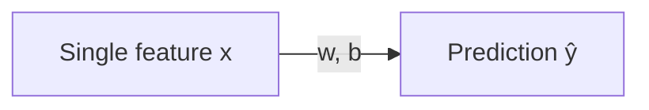

## The model

Simple linear regression predicts a number from **one feature**:

`ŷ = w·x + b`

- `w` is the slope (how much y changes per unit x)
- `b` is the intercept (y when x = 0)



## Intuition

If `w = 200` and `x` is house size in sqft:

- increasing size by 1 sqft increases predicted price by 200 (units of currency)

## Scikit-learn example

```python title="Simple linear regression" showLineNumbers{1}
import numpy as np
from sklearn.linear_model import LinearRegression
from sklearn.model_selection import train_test_split
from sklearn.metrics import mean_squared_error

# X must be 2D in scikit-learn
X = np.array([500, 700, 800, 1000, 1200]).reshape(-1, 1)
y = np.array([100, 150, 170, 210, 240])

X_train, X_test, y_train, y_test = train_test_split(X, y, test_size=0.2, random_state=42)

model = LinearRegression()
model.fit(X_train, y_train)

pred = model.predict(X_test)
print("w (slope):", model.coef_[0])
print("b (intercept):", model.intercept_)
print("MSE:", mean_squared_error(y_test, pred))
```

:::tip[From the book]
Simple linear regression is just the one-feature case of Géron's general
Linear Regression model `ŷ = θ0 + θ1x1`. Scikit-Learn's `LinearRegression`
finds `θ` under the hood using the **Normal Equation** — a closed-form
solution `θ = (XᵀX)⁻¹Xᵀy` — rather than iterating with Gradient Descent. Both
land on (almost) the same answer; the Normal Equation just gets there in one
shot instead of many small steps.
:::

## Pitfalls

- outliers can strongly affect the line
- if the relationship is non-linear, the line underfits

## Mini-checkpoint

Plot x vs y. Does it look roughly linear?

- If yes, start here.
- If no, consider polynomial regression or other models.

## Visualize it

Fitting a simple linear regression means finding the slope and intercept of the line that
sits as close as possible to all the points. Here the line starts flat and adjusts itself
step by step to minimize the total distance to the data — click to generate a new dataset:

```p5 title="Fitting the line of best fit" desc="The line adjusts its slope and intercept to minimize the distance to the data points." height="280"
let pts = [];
let m = 0, b = 0;
let t = 0;
function genPts() {
  pts = [];
  const tm = 0.8 + random(-0.25, 0.25), tb = random(-1, 1);
  for (let i = 0; i < 24; i++) {
    const x = random(-2.5, 2.5);
    const y = tm * x + tb + random(-0.7, 0.7);
    pts.push({ x: x, y: y });
  }
  m = 0; b = 0; t = 0;
}
function setup() {
  createCanvas(600, 280);
  textFont("monospace");
  textAlign(CENTER, CENTER);
  genPts();
}
function px(x) { return 46 + (x + 3) / 6 * (width - 92); }
function py(y) { return (height - 36) - (y + 4) / 8 * (height - 66); }
function draw() {
  background(13, 17, 23);
  noStroke();
  for (const p of pts) {
    fill(75, 139, 190);
    ellipse(px(p.x), py(p.y), 9, 9);
  }
  stroke(255, 211, 67);
  strokeWeight(2.5);
  line(px(-3), py(m * -3 + b), px(3), py(m * 3 + b));
  noStroke();
  t++;
  if (t % 2 === 0) {
    let dm = 0, db = 0;
    for (const p of pts) { const e = (m * p.x + b) - p.y; dm += e * p.x; db += e; }
    dm /= pts.length; db /= pts.length;
    m -= 0.03 * dm; b -= 0.03 * db;
  }
  fill(107, 169, 221);
  textSize(13);
  text("y = " + m.toFixed(2) + "x + " + b.toFixed(2), width / 2, 22);
  if (t > 620) genPts();
}
function mousePressed() { genPts(); }
```

import DataCampExercise from "../../../../components/DataCampExercise.astro";

## 🧪 Try It Yourself

### Exercise 1 – Train-Test Split

<DataCampExercise
  lang="python"
  hint={`Use \`train_test_split(X, y, test_size=0.2)\` from scikit-learn.`}
  code={`# Task: Exercise 1 – Train-Test Split
from sklearn.model_selection import ___   # replace ___ with train_test_split
import numpy as np

X = np.arange(20).reshape(10, 2)
y = np.arange(10)

X_train, X_test, y_train, y_test = ___(X, y, test_size=0.2, random_state=42)
print("Train size:", len(X_train))
print("Test size:", len(X_test))

# ── Expected Output ───────────────────────────────────────────
# Train size: 8
# Test size: 2
# ──────────────────────────────────────────────────────────────`}
  solution={`from sklearn.model_selection import train_test_split
import numpy as np

X = np.arange(20).reshape(10, 2)
y = np.arange(10)
X_train, X_test, y_train, y_test = train_test_split(X, y, test_size=0.2, random_state=42)
print("Train size:", len(X_train))
print("Test size:", len(X_test))`}
  sct={`test_output_contains("Train size: 8")
test_output_contains("Test size: 2")
success_msg("Data split correctly!")`}
  height={148}
/>

### Exercise 2 – Fit a Linear Model

<DataCampExercise
  lang="python"
  hint={`Call \`model.fit(X_train, y_train)\` then \`model.predict(X_test)\`.`}
  code={`# Task: Exercise 2 – Fit a Linear Model
from sklearn.linear_model import LinearRegression
import numpy as np

X = np.array([[1], [2], [3], [4], [5]])
y = np.array([2, 4, 6, 8, 10])

model = LinearRegression()
model.___(X, y)            # replace ___ with fit
preds = model.___(X)       # replace ___ with predict
print("Predictions:", preds.astype(int))

# ── Expected Output ───────────────────────────────────────────
# Predictions: [ 2  4  6  8 10]
# ──────────────────────────────────────────────────────────────`}
  solution={`from sklearn.linear_model import LinearRegression
import numpy as np

X = np.array([[1], [2], [3], [4], [5]])
y = np.array([2, 4, 6, 8, 10])
model = LinearRegression()
model.fit(X, y)
preds = model.predict(X)
print("Predictions:", preds.astype(int))`}
  sct={`test_output_contains("Predictions:")
success_msg("Model fitted and predictions made!")`}
  height={148}
/>

### Exercise 3 – Evaluate with MSE

<DataCampExercise
  lang="python"
  hint={`Use \`mean_squared_error(y_true, y_pred)\` to measure prediction error.`}
  code={`# Task: Exercise 3 – Evaluate with MSE
from sklearn.metrics import ___   # replace ___ with mean_squared_error
import numpy as np

y_true = np.array([3, 5, 7, 9])
y_pred = np.array([2.8, 5.1, 7.2, 8.9])

mse = ___(y_true, y_pred)         # replace ___ with mean_squared_error
print(f"MSE: {mse:.4f}")

# ── Expected Output ───────────────────────────────────────────
# MSE: 0.0275
# ──────────────────────────────────────────────────────────────`}
  solution={`from sklearn.metrics import mean_squared_error
import numpy as np

y_true = np.array([3, 5, 7, 9])
y_pred = np.array([2.8, 5.1, 7.2, 8.9])
mse = mean_squared_error(y_true, y_pred)
print(f"MSE: {mse:.4f}")`}
  sct={`test_output_contains("MSE:")
success_msg("MSE evaluated successfully!")`}
  height={138}
/>

## Next

Continue to **Multiple Linear Regression** — extend the same idea to more
than one feature, and see how the Normal Equation scales.

