import DataCampExercise from "../../../../components/DataCampExercise.astro";
import AlgorithmCard from "../../../../components/AlgorithmCard.astro";
import Figure from "../../../../components/Figure.astro";
import Quiz from "../../../../components/Quiz.astro";

## What you'll learn

- the model $\hat{y} = wx + b$, and what each parameter means in the units of your data
- why we square the errors instead of taking absolute values or plain sums
- how to **derive** the least-squares slope and intercept by setting two derivatives to zero
- how to compute the whole fit **by hand** on five points, then check it against scikit-learn
- how to read a residual plot, and what a bad one looks like
- the four assumptions the model makes, and which pitfalls follow when they break

## Intuition

You spend money on advertising and you record sales. Plot the pairs and they trend upward,
but not perfectly — a straight line through the cloud would miss every point by a little.

Simple linear regression asks one question: **of all the straight lines you could draw, which
one misses by the least?** Once you have that line, two numbers summarise the whole
relationship — how steeply sales rise per dollar spent, and where the line starts.

```mermaid
flowchart LR
  X["Feature x<br/>(ad spend)"] --> M["Model<br/>y&#770; = wx + b"]
  M --> P["Prediction y&#770;"]
  P --> E["Residual<br/>e = y - y&#770;"]
  Y["Observed y<br/>(sales)"] --> E
  E --> L["Loss<br/>sum of e squared"]
  L -->|"adjust w, b"| M
```



The loop at the bottom is the whole of supervised learning in miniature: predict, measure the
miss, adjust. Simple linear regression is special only because the adjustment has a formula —
you can jump straight to the answer instead of iterating.

## The math

### The model

One feature, two parameters:

$$
\hat{y} = wx + b
$$

- $w$ is the **slope** — the change in $\hat{y}$ for a one-unit increase in $x$. Its units are
  *units of y per unit of x*.
- $b$ is the **intercept** — the prediction when $x = 0$. Sometimes meaningful, often not.

### The loss

For a dataset of $n$ pairs $(x_i, y_i)$, the **residual** of point $i$ is $e_i = y_i - \hat{y}_i$.
We minimise the **sum of squared errors**:

$$
J(w, b) = \sum_{i=1}^{n} \left(y_i - (w x_i + b)\right)^2
$$

Why squared? Three reasons, in order of importance:

1. **Signs would cancel.** Plain $\sum e_i$ is zero for infinitely many terrible lines.
2. **It is differentiable everywhere.** $\sum |e_i|$ has a corner at zero, so there is no clean
   closed-form solution.
3. **Big misses hurt more.** Squaring penalises a residual of 4 sixteen times as hard as a
   residual of 1, which is usually what you want — and occasionally exactly what you don't
   (see [Pitfalls](#pitfalls)).

### Deriving the solution

$J$ is a convex paraboloid in $(w, b)$, so its single minimum is where both partial derivatives
vanish. Start with the intercept:

$$
\frac{\partial J}{\partial b} = -2\sum_{i=1}^{n}\left(y_i - w x_i - b\right) = 0
\quad\Longrightarrow\quad
\sum_{i=1}^{n} y_i - w \sum_{i=1}^{n} x_i - nb = 0
$$

Divide by $n$ and rearrange:

$$
b = \bar{y} - w\bar{x}
$$

That is a useful fact on its own: **the least-squares line always passes through the centroid
$(\bar{x}, \bar{y})$ of the data.** Now the slope:

$$
\frac{\partial J}{\partial w} = -2\sum_{i=1}^{n} x_i\left(y_i - w x_i - b\right) = 0
$$

Substitute $b = \bar{y} - w\bar{x}$ and solve for $w$:

$$
w = \frac{\sum_{i=1}^{n}(x_i - \bar{x})(y_i - \bar{y})}{\sum_{i=1}^{n}(x_i - \bar{x})^2}
= \frac{\operatorname{Cov}(x, y)}{\operatorname{Var}(x)}
$$

The slope is the covariance of the two variables divided by the variance of the input. Everything
below is arithmetic on that one formula.

:::note[Where this comes from]
Setting a gradient to zero to find a minimum is the core move of
[Partial Differentiation and Gradients](/mathematics-for-machine-learning/chapter-05---vector-calculus/partial-differentiation-and-gradients/)
in the Mathematics module. Simple linear regression is the smallest problem where that machinery
pays off — and one of the few where the resulting equations can be solved exactly.
:::

## Worked example by hand

Five months of ad spend against sales, in thousands:

| $i$ | $x_i$ (spend) | $y_i$ (sales) | $x_i - \bar{x}$ | $y_i - \bar{y}$ | $(x_i-\bar{x})(y_i-\bar{y})$ | $(x_i-\bar{x})^2$ |
| --- | --- | --- | --- | --- | --- | --- |
| 1 | 1 | 2 | −2 | −2 | 4 | 4 |
| 2 | 2 | 4 | −1 | 0 | 0 | 1 |
| 3 | 3 | 5 | 0 | 1 | 0 | 0 |
| 4 | 4 | 4 | 1 | 0 | 0 | 1 |
| 5 | 5 | 5 | 2 | 1 | 2 | 4 |
| | $\bar{x}=3$ | $\bar{y}=4$ | | | **6** | **10** |

**Step 1 — the means.** $\bar{x} = 15/5 = 3$, $\bar{y} = 20/5 = 4$.

**Step 2 — the slope.** Divide the two column totals:

$$
w = \frac{6}{10} = 0.6
$$

**Step 3 — the intercept.** Push the line through the centroid:

$$
b = \bar{y} - w\bar{x} = 4 - 0.6 \times 3 = 2.2
$$

So the fitted line is $\hat{y} = 0.6x + 2.2$. Every extra thousand dollars of spend buys 600 more
units of sales.

**Step 4 — predictions and residuals.**

| $x_i$ | $y_i$ | $\hat{y}_i = 0.6x_i + 2.2$ | $e_i = y_i - \hat{y}_i$ | $e_i^2$ |
| --- | --- | --- | --- | --- |
| 1 | 2 | 2.8 | −0.8 | 0.64 |
| 2 | 4 | 3.4 | +0.6 | 0.36 |
| 3 | 5 | 4.0 | +1.0 | 1.00 |
| 4 | 4 | 4.6 | −0.6 | 0.36 |
| 5 | 5 | 5.2 | −0.2 | 0.04 |
| | | | **0.0** | **2.40** |

The residuals sum to exactly zero. That is not luck — it is the first normal equation,
$\sum e_i = 0$, which is what fixing $b = \bar{y} - w\bar{x}$ guarantees.

**Step 5 — the error numbers.**

$$
\text{SSE} = 2.40, \qquad
\text{MSE} = \frac{2.40}{5} = 0.48, \qquad
\text{RMSE} = \sqrt{0.48} \approx 0.69
$$

**Step 6 — how much did we explain?** Compare against the dumbest possible model, which always
predicts $\bar{y} = 4$:

$$
\text{SST} = \sum (y_i - \bar{y})^2 = 4 + 0 + 1 + 0 + 1 = 6
$$

$$
R^2 = 1 - \frac{\text{SSE}}{\text{SST}} = 1 - \frac{2.40}{6} = 0.60
$$

The line removes 60% of the variance that predicting the mean would have left.
[Metrics R-Squared and Adjusted R-Squared](/machine-learning/phase-03---supervised-learning---regression/metrics-r-squared-and-adjusted-r-squared/)
takes that number apart properly.

<Figure
  src="/images/ml/phase-03-regression/simple-linear-regression/fit-and-residuals"
  alt="Scatter plot of five points with the fitted line y = 0.6x + 2.2, and a red vertical stem from each point to the line marking its residual."
  title="The fitted line and its five residuals"
  caption="Squares are predictions, circles are observations, red stems are residuals. Least squares makes the total squared stem length as small as it can be — 2.40 here."
/>

### Why no other line beats it

Two plausible alternatives, scored on the same five points:

<Figure
  src="/images/ml/phase-03-regression/simple-linear-regression/candidate-lines"
  alt="The same five points with three candidate lines: the least-squares fit with SSE 2.4, a steeper line with SSE 4.0, and a flatter line with SSE 4.0."
  title="Three candidate lines, three SSE scores"
  caption="Both alternatives pass through the centroid, so both have zero-sum residuals — and both still lose. Only one slope minimises the squared total."
/>

## See it move

Below, the line starts flat and walks toward the least-squares solution by repeatedly nudging
$w$ and $b$ downhill. The closed-form answer and the iterative one land in the same place; the
iterative route is the one that keeps working when there are a million features.

```p5 title="Fitting the line of best fit" desc="Points are sampled around a hidden true line. The amber line starts flat and adjusts its slope and intercept step by step to reduce the total squared distance. Click to draw a fresh dataset." height="280"
let pts = [];
let m = 0, b = 0;
let t = 0;
function genPts() {
  pts = [];
  const tm = 0.8 + random(-0.25, 0.25), tb = random(-1, 1);
  for (let i = 0; i < 24; i++) {
    const x = random(-2.5, 2.5);
    const y = tm * x + tb + random(-0.7, 0.7);
    pts.push({ x: x, y: y });
  }
  m = 0; b = 0; t = 0;
}
function setup() {
  createCanvas(600, 280);
  textFont("monospace");
  textAlign(CENTER, CENTER);
  genPts();
}
function px(x) { return 46 + (x + 3) / 6 * (width - 92); }
function py(y) { return (height - 36) - (y + 4) / 8 * (height - 66); }
function sse() {
  let s = 0;
  for (const p of pts) { const e = (m * p.x + b) - p.y; s += e * e; }
  return s / pts.length;
}
function draw() {
  background(13, 17, 23);
  noStroke();
  // residual stems, so the quantity being minimised is visible
  stroke(232, 110, 110, 150);
  strokeWeight(1);
  for (const p of pts) line(px(p.x), py(p.y), px(p.x), py(m * p.x + b));
  noStroke();
  for (const p of pts) {
    fill(75, 139, 190);
    ellipse(px(p.x), py(p.y), 9, 9);
  }
  stroke(255, 211, 67);
  strokeWeight(2.5);
  line(px(-3), py(m * -3 + b), px(3), py(m * 3 + b));
  noStroke();
  t++;
  if (t % 2 === 0) {
    let dm = 0, db = 0;
    for (const p of pts) { const e = (m * p.x + b) - p.y; dm += e * p.x; db += e; }
    dm /= pts.length; db /= pts.length;
    m -= 0.03 * dm; b -= 0.03 * db;
  }
  fill(107, 169, 221);
  textSize(13);
  text("y = " + m.toFixed(2) + "x + " + b.toFixed(2) + "    MSE = " + sse().toFixed(3), width / 2, 22);
  if (t > 620) genPts();
}
function mousePressed() { genPts(); }
```

## From scratch

The two formulas, transcribed directly. No optimiser, no library model:

```python title="ols_from_scratch.py" showLineNumbers{1}
import numpy as np


def fit_simple_linear(x, y):
    """Return (w, b) for the least-squares line through 1-D data."""
    x, y = np.asarray(x, dtype=float), np.asarray(y, dtype=float)
    x_mean, y_mean = x.mean(), y.mean()

    # w = Cov(x, y) / Var(x), written out as the two sums from the derivation
    numerator = ((x - x_mean) * (y - y_mean)).sum()
    denominator = ((x - x_mean) ** 2).sum()
    if denominator == 0:
        raise ValueError("x has zero variance — no line is determined")

    w = numerator / denominator
    b = y_mean - w * x_mean
    return w, b


x = [1, 2, 3, 4, 5]
y = [2, 4, 5, 4, 5]

w, b = fit_simple_linear(x, y)
pred = w * np.array(x) + b
resid = np.array(y) - pred

print(f"w = {w}")                    # w = 0.6
print(f"b = {b}")                    # b = 2.2
print(f"residuals = {resid}")        # residuals = [-0.8  0.6  1.  -0.6 -0.2]
print(f"SSE = {(resid ** 2).sum()}") # SSE = 2.4
```

Every number matches the hand calculation, which is the point of doing both.

## With scikit-learn

The same fit through the estimator API. Note the `reshape(-1, 1)` — scikit-learn always wants
`X` two-dimensional, one row per sample and one column per feature, even when there is only one
feature:

```python title="ols_sklearn.py" showLineNumbers{1}
import numpy as np
from sklearn.linear_model import LinearRegression
from sklearn.metrics import mean_squared_error, r2_score

X = np.array([1, 2, 3, 4, 5]).reshape(-1, 1)   # (5, 1) — 5 samples, 1 feature
y = np.array([2, 4, 5, 4, 5])

model = LinearRegression()
model.fit(X, y)

print(f"w = {model.coef_[0]:.4f}")        # w = 0.6000
print(f"b = {model.intercept_:.4f}")      # b = 2.2000

pred = model.predict(X)
print(f"MSE = {mean_squared_error(y, pred):.4f}")  # MSE = 0.4800
print(f"R^2 = {r2_score(y, pred):.4f}")            # R^2 = 0.6000

# Predicting for a new spend level
print(f"x=6 -> {model.predict([[6]])[0]:.2f}")     # x=6 -> 5.80
```

:::tip[Under the hood]
`LinearRegression` does not use the two scalar formulas above. It solves the general
**Normal Equation** $\boldsymbol{\theta} = (\mathbf{X}^\top\mathbf{X})^{-1}\mathbf{X}^\top\mathbf{y}$
by least-squares decomposition, which handles any number of features at once. With one feature it
reduces exactly to $w = \operatorname{Cov}(x,y)/\operatorname{Var}(x)$.
[Multiple Linear Regression](/machine-learning/phase-03---supervised-learning---regression/multiple-linear-regression/)
covers the matrix form.
:::

## On real data

Five tidy points are a teaching device. Here is the same estimator on 442 real patients from the
`load_diabetes` dataset, predicting one-year disease progression from body mass index alone:

```python title="diabetes_bmi.py" showLineNumbers{1}
from sklearn.datasets import load_diabetes
from sklearn.linear_model import LinearRegression

data = load_diabetes()
bmi = data.data[:, 2].reshape(-1, 1)   # column 2 is the standardised BMI
y = data.target

model = LinearRegression().fit(bmi, y)

print(f"w   = {model.coef_[0]:.2f}")        # w   = 949.44
print(f"b   = {model.intercept_:.2f}")      # b   = 152.13
print(f"R^2 = {model.score(bmi, y):.4f}")   # R^2 = 0.3439
```

<Figure
  src="/images/ml/phase-03-regression/simple-linear-regression/real-data-diabetes"
  alt="Scatter of 442 patients, standardised BMI on the x-axis against disease progression on the y-axis, with an upward-sloping fitted line. Points scatter widely around the line."
  title="One feature on 442 real patients"
  caption="The trend is unmistakable and the slope is meaningful — but R-squared of 0.34 says two thirds of the variation lives somewhere other than BMI."
/>

### Reading the plot

Three things to take from that figure, in the order you should check them:

1. **The direction is real.** The cloud tilts upward consistently, not just at the edges. A
   positive slope here is a genuine signal, not an artefact of two outliers.
2. **The spread grows with $x$.** Points on the right scatter further from the line than points
   on the left. That is **heteroscedasticity** — it does not bias the slope, but it does make the
   usual confidence intervals too optimistic.
3. **$R^2 = 0.34$ is not a failure.** For a single biological predictor it is a strong result. It
   *is* a signal that more features would help, which is exactly what the next page does.

The residual plot is where you confirm all three at a glance. For the five-point example it looks
like this — no curve, no fan, no runaway point:

<Figure
  src="/images/ml/phase-03-regression/simple-linear-regression/residual-plot"
  alt="Residuals plotted against fitted values for the five-point example. Values are -0.8, +0.6, +1.0, -0.6, -0.2 scattered around a dashed zero line with no visible pattern."
  title="Residuals versus fitted values"
  caption="What you want: a shapeless band around zero. A U-shape means the relationship is curved; a widening fan means non-constant variance; a lone spike means an outlier."
/>

## The four assumptions

Least squares is always computable. It is only *trustworthy* when these hold:

| Assumption | What it means | How to check | If it breaks |
| --- | --- | --- | --- |
| **L**inearity | The true relationship is a straight line | Residual plot shows no curve | Add polynomial terms, or transform $x$ |
| **I**ndependence | Observations do not influence each other | Know your sampling; check time ordering | Use time-series or mixed models |
| **N**ormality | Residuals are roughly normal | Q-Q plot of residuals | Slope is still fine; intervals are not |
| **E**qual variance | Residual spread is constant across $x$ | Residual plot shows no fan | Transform $y$, or use weighted least squares |

Only linearity affects the point predictions. The other three affect how much you should believe
the confidence intervals around them.

<AlgorithmCard
  name="Simple Linear Regression (OLS)"
  type="Supervised · Regression"
  sklearn="sklearn.linear_model.LinearRegression"
  assumptions={[
    "The relationship between x and y is linear",
    "Observations are independent of one another",
    "Residual variance is constant across the range of x",
    "Residuals are approximately normal (needed for intervals, not for the fit)",
  ]}
  complexity={{ train: "O(n)", predict: "O(1)", memory: "O(1)" }}
  notation="n = samples; the one-feature case needs only running sums"
  hyperparams={[
    { name: "fit_intercept", default: "True", effect: "Set False only when the data is already centred, or theory forces the line through the origin." },
    { name: "positive", default: "False", effect: "Constrains the slope to be non-negative — useful when a negative coefficient would be physically impossible." },
  ]}
  useWhen={[
    "You need a baseline before trying anything complicated",
    "Interpretability matters more than the last point of accuracy",
    "You must explain the effect of one variable in its own units",
    "The scatter plot genuinely looks like a line",
  ]}
  avoidWhen={[
    "The scatter plot curves — polynomial or tree models will beat it easily",
    "Outliers dominate and cannot be removed on principle",
    "You have many correlated features (use Ridge or Lasso instead)",
    "You need a prediction outside the observed range of x",
  ]}
/>

## Pitfalls

:::caution[One outlier can swing the whole line]
Because errors are squared, a single point far from the trend contributes disproportionately.
Move the last $y$ value from 5 to 25 in the worked example and the slope jumps from 0.6 to 4.6 — the
line chases the outlier and fits nothing else. Plot before you fit. If outliers are legitimate
data rather than errors, use `HuberRegressor`, which squares small residuals but only takes the
absolute value of large ones.
:::

:::caution[The intercept is often meaningless]
In the diabetes fit, $b = 152.13$ is the predicted progression at standardised BMI zero — which is
the dataset mean, so it happens to be interpretable. In the ad-spend example, $b = 2.2$ claims you
sell 2,200 units on zero advertising. Maybe true, maybe pure extrapolation. The intercept is only
meaningful when $x = 0$ is inside, or at least near, your observed range.
:::

:::caution[Never predict outside the observed range]
The model has seen spend from 1 to 5. Asking it for $x = 50$ returns 32.2 with total confidence
and no basis whatsoever. Straight lines extrapolate happily and wrongly; real relationships
saturate.
:::

:::danger[A slope is not a cause]
$w = 0.6$ says sales and spend move together. It does not say spend *causes* sales. Both could be
driven by the season, and a regression cannot tell the difference. Establishing causation needs an
experiment or a causal design, never a fit.
:::

## Compare

| Model | Handles curves | Interpretable | Robust to outliers | Needs scaling | First reach for |
| --- | --- | --- | --- | --- | --- |
| **Simple linear (OLS)** | No | Very | No | No | A baseline, and one-variable stories |
| Polynomial regression | Yes | Moderate | No | Yes (high degree) | Visible curvature |
| Ridge / Lasso | No | Good | No | Yes | Many correlated features |
| Huber regression | No | Very | Yes | No | Data with genuine outliers |
| KNN regressor | Yes | Poor | Moderate | Yes | Local structure, no global shape |
| Decision tree | Yes | Moderate | Yes | No | Interactions and thresholds |

<Quiz
  questions={[
    {
      q: "The least-squares line is guaranteed to pass through which point?",
      options: [
        "The origin (0, 0)",
        "The centroid (mean of x, mean of y)",
        "The median of the data",
        "The first observation",
      ],
      answer: 1,
      explain: "Setting the derivative with respect to b to zero gives b = y-bar minus w times x-bar, which is exactly the statement that the line passes through the centroid.",
    },
    {
      q: "Your residual plot shows a clear U-shape. What has gone wrong?",
      options: [
        "The variance is not constant",
        "There is an outlier",
        "The true relationship is curved, so a straight line underfits",
        "Nothing — U-shapes are expected",
      ],
      answer: 2,
      explain: "A systematic curve in the residuals means the model missed structure in the data. Add polynomial terms or transform the feature.",
    },
    {
      q: "Why square the residuals rather than sum them directly?",
      options: [
        "Squaring makes the numbers larger and easier to read",
        "Positive and negative residuals would cancel, so the plain sum is zero for many bad lines",
        "It is required by scikit-learn",
        "Squaring makes the model robust to outliers",
      ],
      answer: 1,
      explain: "Signs cancel. Squaring also keeps the loss differentiable everywhere, which is what makes a closed-form solution possible — but it makes the fit less robust to outliers, not more.",
    },
    {
      q: "A model fit on ad spend from 1 to 5 thousand is asked to predict for 50 thousand. What should you do?",
      options: [
        "Trust it — linear models extrapolate reliably",
        "Refuse: the prediction is extrapolation far outside the observed range",
        "Multiply the prediction by ten to be safe",
        "Refit with a larger intercept",
      ],
      answer: 1,
      explain: "The model has no evidence about that region. Real relationships usually saturate, while a straight line keeps climbing forever.",
    },
  ]}
/>

## 🧪 Try It Yourself

### Exercise 1 – Compute the slope by hand

<DataCampExercise
  lang="python"
  hint={`The slope is the sum of (x - x_mean) * (y - y_mean) divided by the sum of (x - x_mean) squared.`}
  code={`# Task: Exercise 1 - Compute the slope by hand
import numpy as np

x = np.array([1, 2, 3, 4, 5], dtype=float)
y = np.array([2, 4, 5, 4, 5], dtype=float)

num = ((x - x.mean()) * (y - y.___())).sum()   # replace ___ with mean
den = ((x - x.mean()) ** 2).sum()
w = num / den

print("slope:", round(w, 2))

# -- Expected Output -------------------------------------------
# slope: 0.6
# --------------------------------------------------------------`}
  solution={`import numpy as np

x = np.array([1, 2, 3, 4, 5], dtype=float)
y = np.array([2, 4, 5, 4, 5], dtype=float)
num = ((x - x.mean()) * (y - y.mean())).sum()
den = ((x - x.mean()) ** 2).sum()
w = num / den
print("slope:", round(w, 2))`}
  sct={`test_output_contains("slope: 0.6")
success_msg("That is Cov(x, y) / Var(x), straight from the derivation.")`}
  height={158}
/>

### Exercise 2 – Push the line through the centroid

<DataCampExercise
  lang="python"
  hint={`The intercept is y_mean minus w times x_mean.`}
  code={`# Task: Exercise 2 - Push the line through the centroid
import numpy as np

x = np.array([1, 2, 3, 4, 5], dtype=float)
y = np.array([2, 4, 5, 4, 5], dtype=float)
w = 0.6

b = y.mean() - w * x.___()      # replace ___ with mean
print("intercept:", round(b, 2))
print("centroid check:", round(w * x.mean() + b, 2) == round(y.mean(), 2))

# -- Expected Output -------------------------------------------
# intercept: 2.2
# centroid check: True
# --------------------------------------------------------------`}
  solution={`import numpy as np

x = np.array([1, 2, 3, 4, 5], dtype=float)
y = np.array([2, 4, 5, 4, 5], dtype=float)
w = 0.6
b = y.mean() - w * x.mean()
print("intercept:", round(b, 2))
print("centroid check:", round(w * x.mean() + b, 2) == round(y.mean(), 2))`}
  sct={`test_output_contains("intercept: 2.2")
test_output_contains("centroid check: True")
success_msg("The fitted line always passes through the centre of mass of the data.")`}
  height={168}
/>

### Exercise 3 – Residuals must sum to zero

<DataCampExercise
  lang="python"
  hint={`A residual is the observed value minus the predicted value: y - y_hat.`}
  code={`# Task: Exercise 3 - Residuals must sum to zero
import numpy as np

x = np.array([1, 2, 3, 4, 5], dtype=float)
y = np.array([2, 4, 5, 4, 5], dtype=float)

y_hat = 0.6 * x + 2.2
resid = y - ___          # replace ___ with y_hat

print("residuals:", resid)
print("sum:", round(resid.sum(), 10))
print("SSE:", round((resid ** 2).sum(), 2))

# -- Expected Output -------------------------------------------
# residuals: [-0.8  0.6  1.  -0.6 -0.2]
# sum: 0.0
# SSE: 2.4
# --------------------------------------------------------------`}
  solution={`import numpy as np

x = np.array([1, 2, 3, 4, 5], dtype=float)
y = np.array([2, 4, 5, 4, 5], dtype=float)
y_hat = 0.6 * x + 2.2
resid = y - y_hat
print("residuals:", resid)
print("sum:", round(resid.sum(), 10))
print("SSE:", round((resid ** 2).sum(), 2))`}
  sct={`test_output_contains("sum: 0.0")
test_output_contains("SSE: 2.4")
success_msg("Zero-sum residuals are a mathematical consequence of fitting the intercept.")`}
  height={188}
/>

### Exercise 4 – Reproduce it with scikit-learn

<DataCampExercise
  lang="python"
  hint={`Reshape X to two dimensions with .reshape(-1, 1), then call model.fit(X, y).`}
  code={`# Task: Exercise 4 - Reproduce it with scikit-learn
import numpy as np
from sklearn.linear_model import LinearRegression

X = np.array([1, 2, 3, 4, 5]).reshape(-1, ___)   # replace ___ with 1
y = np.array([2, 4, 5, 4, 5])

model = LinearRegression().fit(X, y)

print("w:", round(model.coef_[0], 2))
print("b:", round(model.intercept_, 2))

# -- Expected Output -------------------------------------------
# w: 0.6
# b: 2.2
# --------------------------------------------------------------`}
  solution={`import numpy as np
from sklearn.linear_model import LinearRegression

X = np.array([1, 2, 3, 4, 5]).reshape(-1, 1)
y = np.array([2, 4, 5, 4, 5])
model = LinearRegression().fit(X, y)
print("w:", round(model.coef_[0], 2))
print("b:", round(model.intercept_, 2))`}
  sct={`test_output_contains("w: 0.6")
test_output_contains("b: 2.2")
success_msg("Library and hand calculation agree to the digit.")`}
  height={168}
/>

### Exercise 5 – Watch one outlier wreck the fit

<DataCampExercise
  lang="python"
  hint={`Fit twice: once on the clean y, once on the version with the last value replaced by 25.`}
  code={`# Task: Exercise 5 - Watch one outlier wreck the fit
import numpy as np
from sklearn.linear_model import LinearRegression

X = np.array([1, 2, 3, 4, 5]).reshape(-1, 1)
clean = np.array([2, 4, 5, 4, 5])
dirty = np.array([2, 4, 5, 4, 25])       # one point moved far up

w_clean = LinearRegression().fit(X, clean).coef_[0]
w_dirty = LinearRegression().fit(X, ___).coef_[0]   # replace ___ with dirty

print("clean slope:", round(w_clean, 2))
print("dirty slope:", round(w_dirty, 2))

# -- Expected Output -------------------------------------------
# clean slope: 0.6
# dirty slope: 4.6
# --------------------------------------------------------------`}
  solution={`import numpy as np
from sklearn.linear_model import LinearRegression

X = np.array([1, 2, 3, 4, 5]).reshape(-1, 1)
clean = np.array([2, 4, 5, 4, 5])
dirty = np.array([2, 4, 5, 4, 25])
w_clean = LinearRegression().fit(X, clean).coef_[0]
w_dirty = LinearRegression().fit(X, dirty).coef_[0]
print("clean slope:", round(w_clean, 2))
print("dirty slope:", round(w_dirty, 2))`}
  sct={`test_output_contains("clean slope: 0.6")
test_output_contains("dirty slope: 4.6")
success_msg("One point multiplied the slope by more than seven. Always plot first.")`}
  height={188}
/>

## Recap

- The model is $\hat{y} = wx + b$; the loss is $\sum (y_i - \hat{y}_i)^2$.
- Setting both partial derivatives to zero gives $w = \operatorname{Cov}(x,y)/\operatorname{Var}(x)$
  and $b = \bar{y} - w\bar{x}$ — no iteration required.
- The fitted line always passes through $(\bar{x}, \bar{y})$, and residuals always sum to zero.
- $R^2$ compares your SSE against the SSE of predicting the mean; 0.60 on the worked example,
  0.34 on real diabetes data.
- Squaring the errors buys differentiability and a closed form, and costs robustness to outliers.
- Check linearity and equal variance in the residual plot before believing anything else.

### Exercise 6 – Check the three identities a least-squares fit must satisfy

<DataCampExercise
  lang="python"
  hint={`The slope is the covariance of x and y divided by the variance of x, both computed with the same denominator so it cancels.`}
  code={`# Task: Exercise 6 - Check the three identities a least-squares fit must satisfy
import numpy as np

x = np.array([1.0, 2, 3, 4, 5])
y = np.array([2.0, 4, 5, 4, 5])

w = ((x - x.mean()) * (y - y.mean())).sum() / ((x - ___.mean()) ** 2).sum()
# replace ___ with x
b = y.mean() - w * x.mean()
residuals = y - (w * x + b)

print(f"w = {w:.4f}   b = {b:.4f}")
print(f"residuals sum to        {residuals.sum():.10f}")
print(f"prediction at x-bar     {w * x.mean() + b:.4f}  (y-bar is {y.mean():.4f})")
print(f"residuals dot x         {(residuals * x).sum():.10f}")
sse = (residuals ** 2).sum()
sst = ((y - y.mean()) ** 2).sum()
print(f"SSE {sse:.4f}   SST {sst:.4f}   R2 {1 - sse / sst:.4f}")

# -- Expected Output -------------------------------------------
# w = 0.6000   b = 2.2000
# residuals sum to        -0.0000000000
# prediction at x-bar     4.0000  (y-bar is 4.0000)
# residuals dot x         -0.0000000000
# SSE 2.4000   SST 6.0000   R2 0.6000
# --------------------------------------------------------------`}
  solution={`import numpy as np

x = np.array([1.0, 2, 3, 4, 5])
y = np.array([2.0, 4, 5, 4, 5])

w = ((x - x.mean()) * (y - y.mean())).sum() / ((x - x.mean()) ** 2).sum()
b = y.mean() - w * x.mean()
residuals = y - (w * x + b)

print(f"w = {w:.4f}   b = {b:.4f}")
print(f"residuals sum to        {residuals.sum():.10f}")
print(f"prediction at x-bar     {w * x.mean() + b:.4f}  (y-bar is {y.mean():.4f})")
print(f"residuals dot x         {(residuals * x).sum():.10f}")
sse = (residuals ** 2).sum()
sst = ((y - y.mean()) ** 2).sum()
print(f"SSE {sse:.4f}   SST {sst:.4f}   R2 {1 - sse / sst:.4f}")`}
  sct={`test_output_contains("R2 0.6000")
success_msg("Residuals sum to zero, the line passes through the means, and the residuals are orthogonal to x. All three are consequences of setting the derivatives to zero — and all three are cheap assertions for a test suite.")`}
  height={280}
/>

## Next

Continue to
[Multiple Linear Regression](/machine-learning/phase-03---supervised-learning---regression/multiple-linear-regression/)
— the same idea with many features at once, where the two scalar formulas become one matrix
equation and interpreting a coefficient gets considerably subtler.
