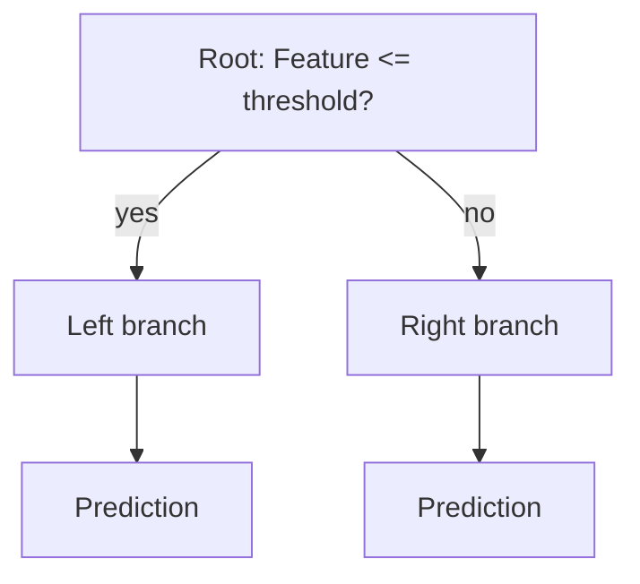

## What you'll learn

- how a Decision Tree makes a prediction by walking root-to-leaf
- what "impurity" means, and how Gini and entropy each measure it
- the CART algorithm — how scikit-learn actually chooses each split
- why trees are called "white box" models, and where their instability comes from

## What a decision tree is

A decision tree predicts by repeatedly asking "if/else" style questions,
starting at the root and walking down until it reaches a leaf with a
prediction.



Géron's book grows one on the iris dataset, using only petal length and petal
width:

```python title="Training a Decision Tree on iris" showLineNumbers{1}
from sklearn.datasets import load_iris
from sklearn.tree import DecisionTreeClassifier

iris = load_iris()
X = iris.data[:, 2:]   # petal length, petal width
y = iris.target

tree_clf = DecisionTreeClassifier(max_depth=2, random_state=42)
tree_clf.fit(X, y)
```

To classify a new flower, you start at the root (depth 0): *is petal length
below 2.45 cm?* If yes, you land straight on a **leaf** node predicting *Iris
setosa* — no further questions needed, because that region is perfectly pure.
If no, you move to the depth-1 node, which asks a second question: *is petal
width below 1.75 cm?* That decides between *Iris versicolor* and *Iris
virginica*.

A Decision Tree needs almost no data preparation — no scaling, no centering.
That's one of its most convenient qualities.

## How trees choose splits: impurity

At every node, the tree looks at every possible split (feature + threshold)
and asks: *which split makes the two resulting child nodes as "pure" as
possible?* A node is **pure** when every instance in it belongs to the same
class.

### Gini impurity

Gini impurity for node *i* is:

`Gini_i = 1 - Σ (p_i,k)²`

where `p_i,k` is the fraction of instances in node *i* that belong to class
*k*. A pure node (all one class) has `Gini = 0`.

For example, in the iris tree above, the depth-1 left node (used only by *Iris
setosa*, `p = [1, 0, 0]`) is already pure: `Gini = 0`. The depth-2 left node
(0 setosa, 49 versicolor, 5 virginica, out of 54 instances) has:

`Gini = 1 - (0/54)² - (49/54)² - (5/54)² ≈ 0.168`

### Entropy (information gain)

Entropy comes from information theory, where it measures the average
"surprise" or disorder in a message. In a Decision Tree, a node's entropy is 0
when it contains only one class:

`H_i = -Σ p_i,k * log2(p_i,k)` (only over classes where `p_i,k > 0`)

That same depth-2 left node has:

`H = -(49/54)*log2(49/54) - (5/54)*log2(5/54) ≈ 0.445`

Both formulas measure the same underlying idea — how "mixed" a node is — but
on slightly different scales. Most of the time they lead to very similar
trees. Gini is marginally faster to compute (no logarithms), so it's the
scikit-learn default. When they do disagree, **Gini** tends to isolate the
single most frequent class into its own branch, while **entropy** tends to
produce slightly more balanced trees.

```p5 title="CART sweeps every threshold looking for the split that lowers impurity most" desc="The red line automatically sweeps left to right, testing every possible split; a green marker tracks the best (lowest-impurity) split found so far. Drag to test your own." height="300"
let pts = [];
let splitX = 40;
let sweepDir = 1;
let bestX = 40, bestScore = 1;
let auto = true;
function reset() {
  pts = [];
  for (let i = 0; i < 40; i++) {
    const isA = i < 22;
    const x = isA ? random(40, 340) : random(260, 560);
    pts.push({ x: x, isA: isA });
  }
  bestX = 40;
  bestScore = 1;
}
function setup() {
  createCanvas(600, 300);
  textFont("monospace");
  reset();
}
function gini(counts) {
  const total = counts[0] + counts[1];
  if (total === 0) return 0;
  const p0 = counts[0] / total, p1 = counts[1] / total;
  return 1 - p0 * p0 - p1 * p1;
}
function scoreAt(x) {
  let leftA = 0, leftB = 0, rightA = 0, rightB = 0;
  for (const p of pts) {
    if (p.x < x) { if (p.isA) leftA++; else leftB++; }
    else { if (p.isA) rightA++; else rightB++; }
  }
  const gLeft = gini([leftA, leftB]);
  const gRight = gini([rightA, rightB]);
  const mLeft = leftA + leftB, mRight = rightA + rightB, mTotal = mLeft + mRight;
  const weighted = mTotal > 0 ? (mLeft / mTotal) * gLeft + (mRight / mTotal) * gRight : 0;
  return { gLeft: gLeft, gRight: gRight, weighted: weighted, mLeft: mLeft, mRight: mRight };
}
function draw() {
  background(13, 17, 23);
  const y = 140;

  if (auto) {
    splitX += sweepDir * 3;
    if (splitX > 560) { sweepDir = -1; splitX = 560; }
    if (splitX < 40) { sweepDir = 1; splitX = 40; reset(); }
  }

  const s = scoreAt(splitX);
  if (s.weighted < bestScore) { bestScore = s.weighted; bestX = splitX; }

  stroke(60, 70, 84);
  strokeWeight(1);
  line(30, y, 570, y);
  noStroke();
  for (const p of pts) {
    const col = p.isA ? [255, 211, 67] : [75, 139, 190];
    fill(col[0], col[1], col[2]);
    ellipse(p.x, y, 12, 12);
  }
  stroke(90, 200, 120, 170);
  strokeWeight(1.5);
  drawingContext.setLineDash([3, 4]);
  line(bestX, 60, bestX, 220);
  drawingContext.setLineDash([]);
  stroke(235, 90, 90);
  strokeWeight(2.5);
  line(splitX, 60, splitX, 220);
  noStroke();
  fill(210);
  textSize(13);
  textAlign(LEFT, TOP);
  text("left Gini = " + s.gLeft.toFixed(3) + "  (n=" + s.mLeft + ")", 30, 40);
  text("right Gini = " + s.gRight.toFixed(3) + "  (n=" + s.mRight + ")", 320, 40);
  fill(255, 211, 67);
  textSize(14);
  text("current split impurity = " + s.weighted.toFixed(3), 30, 240);
  fill(90, 200, 120);
  text("best so far = " + bestScore.toFixed(3) + "  (dashed green line)", 30, 260);
  fill(150);
  textSize(11);
  text("drag the red line to override; release to resume the automatic sweep", 30, 280);
}
function mouseDragged() {
  auto = false;
  splitX = constrain(mouseX, 40, 560);
}
function mouseReleased() {
  auto = true;
}
```

## The CART training algorithm

Scikit-learn trains trees with the **CART** (Classification and Regression
Tree) algorithm. For classification, at each node it searches over every
feature and threshold `(k, t_k)` and picks the one that minimizes:

`J(k, t_k) = (m_left / m) * Gini_left + (m_right / m) * Gini_right`

— a weighted average of the two children's impurities, weighted by how many
instances land in each side. Once it finds the best split, CART repeats the
same search on each child, recursively, until it hits `max_depth`, or can't
find a split that reduces impurity any further, or another stopping condition
kicks in.

:::caution[From the book]
CART is a **greedy** algorithm: it looks for the best split at the current
level without ever checking whether a different split now might lead to a
lower impurity several levels down. Finding the *globally* optimal tree is
NP-Complete, so "reasonably good" greedy splits are what every practical
Decision Tree library actually does.
:::

### Overfitting risk

Left unconstrained, a tree will grow until it fits — and likely overfits — the
training data almost perfectly, since nothing stops it from creating one leaf
per training instance. Trees are described as **nonparametric**: not because
they lack parameters, but because the number of parameters isn't fixed ahead
of time, so the tree is free to hug the training data as closely as it wants.

Common controls (increasing `min_*` or decreasing `max_*` all regularize the
tree):

- `max_depth` — maximum depth of the tree
- `min_samples_split` — minimum samples a node must have before it can split
- `min_samples_leaf` — minimum samples required in a leaf
- `max_leaf_nodes` — caps the total number of leaves

### Instability

Decision Trees only ever split perpendicular to an axis, so they're sensitive
to how the data happens to be rotated — the same linearly separable dataset
can look effortless to split one way and awkwardly convoluted after a 45°
rotation. They're also sensitive to small changes in the training data: remove
just one instance and retrain, and you may get a noticeably different tree,
especially since scikit-learn's implementation is stochastic (it randomly
samples which features to evaluate at each node, unless you fix
`random_state`). Random Forests (the next phase) fix this instability by
averaging over many trees.

## Scikit-learn example

```python title="Decision tree classifier" showLineNumbers{1}
from sklearn.tree import DecisionTreeClassifier

tree = DecisionTreeClassifier(
    criterion="gini",  # or "entropy" / "log_loss" depending on sklearn version
    max_depth=5,
    random_state=42,
)
```

### Reading a node's probabilities

Once trained, a leaf node doesn't just output a class — it stores the ratio of
each class among the training instances that land there, so `predict_proba()`
comes for free:

```python title="Class probabilities from a leaf node" showLineNumbers{1}
from sklearn.datasets import load_iris
from sklearn.tree import DecisionTreeClassifier

iris = load_iris()
X = iris.data[:, 2:]
y = iris.target

tree_clf = DecisionTreeClassifier(max_depth=2, random_state=42)
tree_clf.fit(X, y)

print(tree_clf.predict_proba([[5, 1.5]]).round(3))
# [[0.    0.907 0.093]]  -> 90.7% Iris versicolor

print(tree_clf.predict([[5, 1.5]]))
# [1]
```

## Visualize it

A decision tree asks a series of yes/no questions, splitting the data at each
node.

```mermaid title="A small decision tree" desc="Root asks Sunny? then branches to Humidity or Windy checks before landing on Stay in or Play"
flowchart TD
  A["Sunny?"] -->|yes| B["Humidity high?"]
  A -->|no| C["Windy?"]
  B -->|yes| D["Stay in"]
  B -->|no| E["Play"]
  C -->|yes| F["Stay in"]
  C -->|no| G["Play"]
```

:::tip[From the book]
Decision Trees are called **white box** models: their decisions are easy to
trace and explain in plain rules, unlike Random Forests or neural networks
("black box" models), which make great predictions but are hard to explain in
simple terms. If a Decision Tree predicts *Iris versicolor*, you can point to
the exact two conditions (`petal length > 2.45`, `petal width <= 1.75`) that
led there.
:::

## Mini-checkpoint

Train two trees:

- deep tree (no `max_depth`)
- shallow tree (`max_depth=3`)

Compare train vs validation scores — the deep tree should score much higher on
training data and probably worse on data it hasn't seen.

import DataCampExercise from "../../../../components/DataCampExercise.astro";

## 🧪 Try It Yourself

### Exercise 1 – Compute Gini Impurity by Hand

<DataCampExercise
  lang="python"
  hint={`Gini = 1 - sum(p_k ** 2), where p_k is each class's share of the node's instances.`}
  code={`# Task: Exercise 1 - Compute Gini Impurity by Hand
import numpy as np

counts = np.array([0, 49, 5])          # setosa, versicolor, virginica
p = counts / counts.sum()
gini = 1 - np.sum(p ___ 2)             # replace ___ with **
print(round(gini, 3))

# ── Expected Output ───────────────────────────────────────────
# 0.168
# ──────────────────────────────────────────────────────────────`}
  solution={`import numpy as np

counts = np.array([0, 49, 5])
p = counts / counts.sum()
gini = 1 - np.sum(p ** 2)
print(round(gini, 3))`}
  sct={`test_output_contains("0.168")
success_msg("That matches the depth-2 node's Gini score in the book!")`}
  height={158}
/>

### Exercise 2 – Fit a Tree and Read Its Probabilities

<DataCampExercise
  lang="python"
  hint={`Call \`tree_clf.fit(X, y)\`, then \`tree_clf.predict_proba(X_new)\`.`}
  code={`# Task: Exercise 2 - Fit a Tree and Read Its Probabilities
from sklearn.datasets import load_iris
from sklearn.tree import DecisionTreeClassifier

iris = load_iris()
X = iris.data[:, 2:]
y = iris.target

tree_clf = DecisionTreeClassifier(max_depth=2, random_state=42)
tree_clf.___(X, y)                       # replace ___ with fit
print(tree_clf.predict([[5, 1.5]]))

# ── Expected Output ───────────────────────────────────────────
# [1]
# ──────────────────────────────────────────────────────────────`}
  solution={`from sklearn.datasets import load_iris
from sklearn.tree import DecisionTreeClassifier

iris = load_iris()
X = iris.data[:, 2:]
y = iris.target

tree_clf = DecisionTreeClassifier(max_depth=2, random_state=42)
tree_clf.fit(X, y)
print(tree_clf.predict([[5, 1.5]]))`}
  sct={`test_output_contains("[1]")
success_msg("Predicted Iris versicolor, just like the book!")`}
  height={168}
/>

### Exercise 3 – Compare Depth 2 vs Depth 3

<DataCampExercise
  lang="python"
  hint={`\`get_n_leaves()\` returns the number of leaf nodes in the fitted tree.`}
  code={`# Task: Exercise 3 - Compare Depth 2 vs Depth 3
from sklearn.datasets import load_iris
from sklearn.tree import DecisionTreeClassifier

iris = load_iris()
X = iris.data[:, 2:]
y = iris.target

shallow = DecisionTreeClassifier(max_depth=2, random_state=42).fit(X, y)
deeper = DecisionTreeClassifier(max_depth=___, random_state=42).fit(X, y)  # replace ___ with 3

print("depth 2 leaves:", shallow.get_n_leaves())
print("depth 3 leaves:", deeper.get_n_leaves())

# ── Expected Output ───────────────────────────────────────────
# depth 2 leaves: 3
# depth 3 leaves: 5
# ──────────────────────────────────────────────────────────────`}
  solution={`from sklearn.datasets import load_iris
from sklearn.tree import DecisionTreeClassifier

iris = load_iris()
X = iris.data[:, 2:]
y = iris.target

shallow = DecisionTreeClassifier(max_depth=2, random_state=42).fit(X, y)
deeper = DecisionTreeClassifier(max_depth=3, random_state=42).fit(X, y)

print("depth 2 leaves:", shallow.get_n_leaves())
print("depth 3 leaves:", deeper.get_n_leaves())`}
  sct={`test_output_contains("depth 2 leaves: 3")
test_output_contains("depth 3 leaves: 5")
success_msg("A deeper tree grows more leaves - and can overfit more easily!")`}
  height={178}
/>

## Next

Continue to **Naïve Bayes Classifier** for a fast, probabilistic alternative
that needs no splitting at all.
