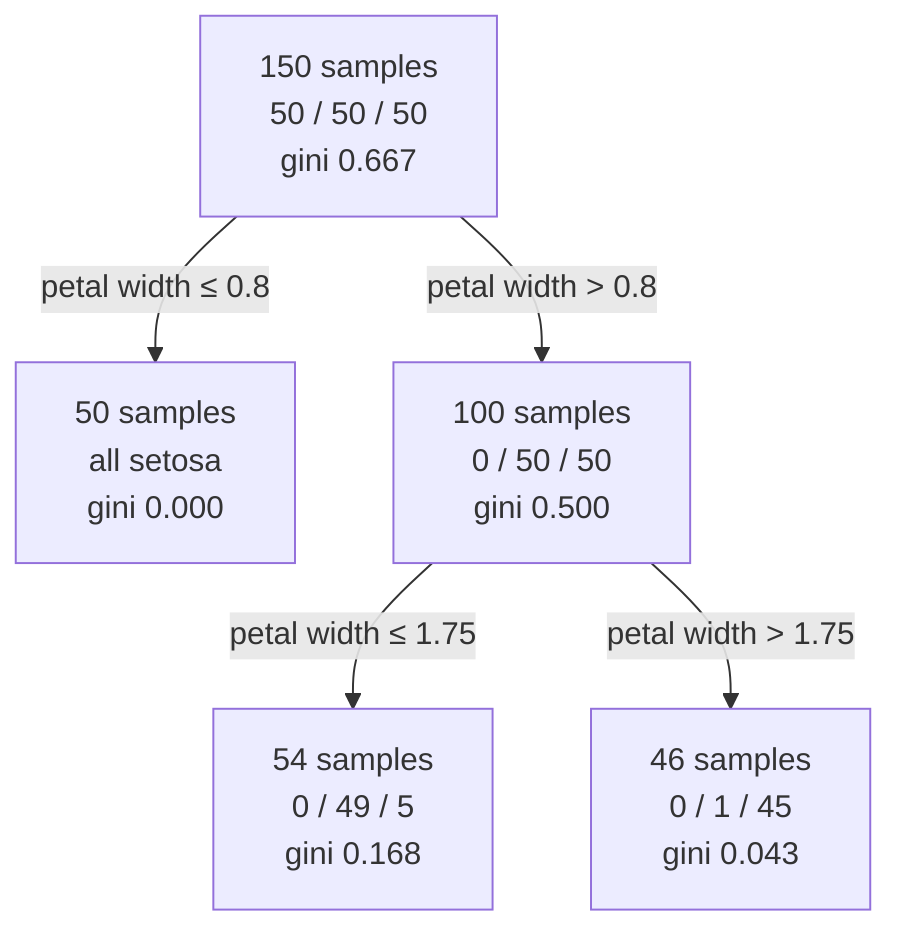

## What you'll learn

- how a tree turns a dataset into a list of if-statements you can read aloud
- **Gini impurity** and **entropy** — the formulas, and the real difference between them
- both computed **by hand** on the actual iris tree, matching scikit-learn to six decimals
- how CART searches for a split, and why the result is only locally optimal
- why an unpruned tree always reaches 100% training accuracy, and every control that prevents it
- why trees are unstable, and what that instability sets up for Phase 5

## Intuition

A decision tree asks a sequence of yes/no questions about one feature at a time, and each answer
narrows the possibilities until only one class remains plausible. It is the only model in this
phase whose reasoning you can print and hand to a domain expert:

```text
if petal width <= 0.80:
    setosa
else:
    if petal width <= 1.75:
        versicolor
    else:
        virginica
```

Two questions, three answers, 96% accurate on the full iris dataset. No scaling, no distance
metric, no kernel, no probability calibration — just thresholds.

The whole design problem is: **which question, in which order?** That is what impurity measures
answer.



## The math

### Measuring impurity

A node is **pure** if every sample in it shares a label. Impurity measures how far from that a node
is. With $p_c$ the proportion of class $c$ in the node:

$$
G = 1 - \sum_{c=1}^{K} p_c^2
\qquad\qquad
H = -\sum_{c=1}^{K} p_c \log_2 p_c
$$

Both are zero for a pure node and maximal for a uniform one. Their maxima differ: for $K$ classes,
Gini tops out at $1 - 1/K$ while entropy tops out at $\log_2 K$. With three classes that is 0.667
against 1.585.

<Figure
  src="/images/ml/phase-04-classification/decision-trees/impurity-curves"
  alt="Four curves plotted against the proportion of class 1 in a binary node: entropy peaking at 1.0, entropy halved, Gini peaking at 0.5, and misclassification error forming a sharp triangle."
  title="Three impurity measures over a binary node"
  caption="Rescale entropy by half and it nearly overlays Gini — which is why the choice rarely changes the tree. Misclassification error has a corner at 0.5 and a flat gradient, so it is a poor splitting criterion."
/>

### Reading the plot

- **Gini and entropy agree almost everywhere.** After rescaling, the two curves are close enough
  that they select the same split the overwhelming majority of the time. Gini is marginally faster
  because it avoids a logarithm; that is the entire practical difference.
- **Entropy is slightly more aggressive at the extremes**, so it can prefer a split that isolates a
  small pure group where Gini would not.
- **Misclassification error is flat over wide ranges.** Two candidate splits often score identically,
  so it gives the search nothing to descend. It is used for pruning, not for growing.

### Choosing a split

CART evaluates every (feature, threshold) pair and picks the one minimising the weighted impurity
of the two children:

$$
J(k, t_k) = \frac{m_{\text{left}}}{m}\,G_{\text{left}} + \frac{m_{\text{right}}}{m}\,G_{\text{right}}
$$

The **information gain** is the parent's impurity minus that weighted average. Split, then recurse
on each child, stopping when a node is pure or a limit is reached.

Two properties follow directly:

- **It is greedy.** Each split is chosen to be locally best; nothing looks two moves ahead. Finding
  the globally optimal tree is NP-complete, so every practical tree is a good local solution.
- **It is invariant to monotone transformations.** Only the *ordering* of a feature's values matters,
  never the spacing. Log-transform a feature, or standardise it, and the tree is unchanged. This is
  why trees never need scaling.

## Worked example by hand

The iris tree above, computed from scratch.

**Step 1 — root impurity.** 150 samples, 50 of each class:

$$
G_{\text{root}} = 1 - \left(\tfrac{50}{150}\right)^2 - \left(\tfrac{50}{150}\right)^2 - \left(\tfrac{50}{150}\right)^2
= 1 - 3\left(\tfrac{1}{9}\right) = \tfrac{2}{3} \approx 0.6667
$$

**Step 2 — evaluate the split at petal width ≤ 0.80.** The left child gets 50 setosa and nothing
else; the right child gets 50 versicolor and 50 virginica:

$$
G_{\text{left}} = 1 - 1^2 = 0,
\qquad
G_{\text{right}} = 1 - 0.5^2 - 0.5^2 = 0.5
$$

$$
J = \frac{50}{150}(0) + \frac{100}{150}(0.5) = 0.3333
$$

$$
\text{gain} = 0.6667 - 0.3333 = 0.3333
$$

No other threshold on either feature beats that, so CART takes it.

**Step 3 — split the right child at petal width ≤ 1.75.** The 100 remaining samples divide into 54
(49 versicolor, 5 virginica) and 46 (1 versicolor, 45 virginica):

$$
G_{\text{left}} = 1 - \left(\tfrac{49}{54}\right)^2 - \left(\tfrac{5}{54}\right)^2
= 1 - 0.8234 - 0.0086 = 0.1680
$$

$$
G_{\text{right}} = 1 - \left(\tfrac{1}{46}\right)^2 - \left(\tfrac{45}{46}\right)^2
= 1 - 0.0005 - 0.9570 = 0.0425
$$

$$
J = \frac{54}{100}(0.1680) + \frac{46}{100}(0.0425) = 0.0907 + 0.0196 = 0.1103
$$

$$
\text{gain} = 0.5 - 0.1103 = 0.3897
$$

Every one of these numbers is available from the fitted estimator as `tree_.impurity`, and they
agree to six decimal places.

**The same tree by entropy.** $H_{\text{root}} = \log_2 3 = 1.5850$, the right child is
$H = 1.0000$, and the two leaves are 0.4451 and 0.1511. Different scale, identical thresholds:
0.80 and 1.75.

<Figure
  src="/images/ml/phase-04-classification/decision-trees/iris-tree-boundary"
  alt="Scatter of iris petal length against petal width with three regions separated by two horizontal lines at petal width 0.8 and 1.75."
  title="The same tree, drawn in feature space"
  caption="Two splits, three rectangles. Both cuts are horizontal because both use petal width — the tree found petal length unnecessary."
/>

## See it move

```p5 title="Splitting a node to reduce impurity" desc="A node of mixed points is split by a threshold; the bars show the impurity of each child and the weighted average the split achieves. The best threshold is the one that minimises the bar on the right." height="320"
let pts = [];
let thr = 0.28;
let dir = 1;
function genPts() {
  pts = [];
  for (let i = 0; i < 40; i++) {
    const x = random(0.05, 0.95);
    const cls = random() < 1 / (1 + Math.exp(-(x - 0.5) * 12)) ? 1 : 0;
    pts.push({ x, cls });
  }
}
function setup() {
  createCanvas(600, 320);
  textFont("monospace");
  genPts();
}
function gini(group) {
  if (group.length === 0) return 0;
  const p = group.filter((q) => q.cls === 1).length / group.length;
  return 1 - p * p - (1 - p) * (1 - p);
}
function draw() {
  background(13, 17, 23);
  const gx = 50, gw = width - 100, top = 60;
  const px = (x) => gx + x * gw;

  const left = pts.filter((q) => q.x <= thr);
  const right = pts.filter((q) => q.x > thr);
  const gl = gini(left), gr = gini(right);
  const weighted = (left.length * gl + right.length * gr) / pts.length;
  const parent = gini(pts);

  // points
  noStroke();
  for (const q of pts) {
    fill(q.cls === 1 ? color(255, 211, 67) : color(75, 139, 190));
    ellipse(px(q.x), top + 40 + (q.cls === 1 ? -14 : 14), 9, 9);
  }
  // threshold
  stroke(120, 200, 120);
  strokeWeight(2.5);
  line(px(thr), top, px(thr), top + 90);

  noStroke();
  fill(200);
  textSize(12);
  textAlign(LEFT, CENTER);
  text("threshold = " + thr.toFixed(2), 14, 20);
  text("parent gini = " + parent.toFixed(3), 14, 38);

  // impurity bars
  const barY = top + 130, barH = 22, scale = gw;
  const bars = [
    ["left  " + left.length, gl, [75, 139, 190]],
    ["right " + right.length, gr, [255, 211, 67]],
    ["weighted", weighted, [120, 200, 120]],
  ];
  for (let i = 0; i < bars.length; i++) {
    const [label, value, col] = bars[i];
    fill(160);
    textAlign(RIGHT, CENTER);
    textSize(11);
    text(label, gx - 8, barY + i * (barH + 12) + barH / 2);
    fill(col[0], col[1], col[2]);
    rect(gx, barY + i * (barH + 12), value * scale, barH);
    fill(225);
    textAlign(LEFT, CENTER);
    text(value.toFixed(3), gx + value * scale + 8, barY + i * (barH + 12) + barH / 2);
  }

  thr += 0.0035 * dir;
  if (thr > 0.95 || thr < 0.05) dir *= -1;
}
function mousePressed() { genPts(); }
```

## From scratch

```python title="tree_splits.py" showLineNumbers{1}
import numpy as np


def gini(labels):
    if len(labels) == 0:
        return 0.0
    _, counts = np.unique(labels, return_counts=True)
    p = counts / counts.sum()
    return float(1 - (p**2).sum())


def entropy(labels):
    if len(labels) == 0:
        return 0.0
    _, counts = np.unique(labels, return_counts=True)
    p = counts / counts.sum()
    return float(-(p * np.log2(p)).sum())


def best_split(X, y, impurity=gini):
    """Exhaustive search over every feature and every midpoint threshold."""
    best = (None, None, impurity(y))
    m = len(y)
    for feature in range(X.shape[1]):
        values = np.unique(X[:, feature])
        thresholds = (values[:-1] + values[1:]) / 2      # midpoints
        for t in thresholds:
            mask = X[:, feature] <= t
            if mask.sum() == 0 or (~mask).sum() == 0:
                continue
            weighted = (mask.sum() * impurity(y[mask])
                        + (~mask).sum() * impurity(y[~mask])) / m
            if weighted < best[2]:
                best = (feature, float(t), weighted)
    return best


from sklearn.datasets import load_iris

iris = load_iris()
X = iris.data[:, (2, 3)]          # petal length, petal width
y = iris.target

print(f"root gini = {gini(y):.6f}")                  # root gini = 0.666667
feature, threshold, weighted = best_split(X, y)
print(f"split on feature {feature} at {threshold:.2f}")   # feature 1 at 0.80
print(f"weighted impurity = {weighted:.6f}")              # 0.333333
print(f"information gain  = {gini(y) - weighted:.6f}")    # 0.333333
```

Forty lines reproduce scikit-learn's first split exactly, threshold included.

## Trees overfit, aggressively

<Figure
  src="/images/ml/phase-04-classification/decision-trees/depth-effect"
  alt="Three panels of the same noisy two-moons data with tree boundaries at max_depth 1, 4 and unlimited. The unlimited tree carves dozens of thin rectangles around individual points."
  title="max_depth = 1, 4 and unlimited"
  caption="An unlimited tree keeps splitting until every leaf is pure, which on noisy data means one leaf per noisy point. Training accuracy 1.00, and a boundary nobody would trust."
/>

<Figure
  src="/images/ml/phase-04-classification/decision-trees/depth-vs-accuracy"
  alt="Training and cross-validated accuracy plotted against max_depth. Training accuracy rises to 1.0 and stays; CV accuracy peaks early then declines."
  title="Where learning stops and memorising starts"
  caption="Training accuracy reaches 1.0 and never moves again. Cross-validated accuracy peaks at a shallow depth and then falls — every split past that point is fitting noise."
/>

An unpruned tree will always reach 100% training accuracy on data with no duplicated rows, because
it can keep splitting until each leaf holds one sample. That is not a bug in the implementation; it
is what "grow until pure" means. The controls that prevent it:

| Parameter | Effect | Typical value |
| --- | --- | --- |
| `max_depth` | Hard cap on tree height | 3–10 |
| `min_samples_split` | Refuse to split a node below this size | 10–50 |
| `min_samples_leaf` | Every leaf must hold at least this many | 5–20 |
| `max_leaf_nodes` | Cap total leaves; grows best-first instead of depth-first | 10–50 |
| `min_impurity_decrease` | Refuse a split that gains less than this | 0.0–0.01 |
| `ccp_alpha` | Cost-complexity pruning after growing | Tune via `cost_complexity_pruning_path` |

`min_samples_leaf` is the most reliable single knob: it directly forbids the "one leaf per noisy
point" failure, whatever the depth.

```python title="pruning.py" showLineNumbers{1}
from sklearn.datasets import load_iris
from sklearn.model_selection import cross_val_score
from sklearn.tree import DecisionTreeClassifier

iris = load_iris()
X, y = iris.data[:, (2, 3)], iris.target

for depth in (1, 2, 3, 5, None):
    model = DecisionTreeClassifier(max_depth=depth, random_state=0)
    train = model.fit(X, y).score(X, y)
    cv = cross_val_score(model, X, y, cv=5).mean()
    print(f"depth={str(depth):<5} leaves {model.get_n_leaves():2d}"
          f"  train {train:.4f}  cv {cv:.4f}")

# depth=1     leaves  2  train 0.6667  cv 0.6667
# depth=2     leaves  3  train 0.9600  cv 0.9600
# depth=3     leaves  5  train 0.9733  cv 0.9600
# depth=5     leaves  8  train 0.9933  cv 0.9533
# depth=None  leaves  8  train 0.9933  cv 0.9467
```

Depth 2 already achieves the best cross-validated score. Everything past it buys training accuracy
and loses generalisation — three extra splits to gain 0.033 on training data and lose 0.013 on
held-out data.

## Instability

Trees are **high variance**: resample the training data slightly and you can get a completely
different tree. The cause is the greedy search — if two candidate splits score almost equally at
the root, a handful of different rows flips which one wins, and every subsequent split changes.

This is a genuine weakness, and it is also the opening for
[Phase 5](/machine-learning/phase-05---ensemble-learning/phase-5---ensemble-learning/).
If a model's errors change substantially with the training sample, averaging many of them cancels
the variance out. That single observation is what a random forest is.

<AlgorithmCard
  name="Decision Tree (CART)"
  type="Supervised · Classification and Regression"
  sklearn="sklearn.tree.DecisionTreeClassifier"
  assumptions={[
    "The target can be approximated by axis-aligned rectangular regions",
    "Feature ordering is meaningful; spacing need not be",
    "Enough samples per leaf for the leaf proportions to mean something",
  ]}
  complexity={{ train: "O(n · m log m)", predict: "O(depth)", memory: "O(nodes)" }}
  notation="m = samples, n = features; prediction is logarithmic in a balanced tree"
  hyperparams={[
    { name: "max_depth", default: "None", effect: "None means grow until pure, which guarantees overfitting. Set it." },
    { name: "min_samples_leaf", default: "1", effect: "The most effective single guard against memorising individual points. Try 5 to 20." },
    { name: "criterion", default: "gini", effect: "'entropy' is marginally more aggressive at the extremes and slightly slower. Rarely changes the result." },
    { name: "ccp_alpha", default: "0.0", effect: "Cost-complexity pruning after growing. Use cost_complexity_pruning_path to get candidate values." },
    { name: "class_weight", default: "None", effect: "'balanced' reweights impurity by inverse class frequency on imbalanced data." },
  ]}
  useWhen={[
    "You need a model a non-technical stakeholder can read",
    "Features are a mix of scales and types and you do not want to preprocess",
    "You want a base learner for a forest or a boosted ensemble",
    "Non-linear interactions matter and you want them found automatically",
  ]}
  avoidWhen={[
    "You need a smooth or diagonal boundary — a tree approximates one with a staircase",
    "The dataset is small and stability matters",
    "You need to extrapolate beyond the training range; a tree predicts a constant outside it",
    "A single model's accuracy is the priority — use an ensemble",
  ]}
/>

## Pitfalls

:::danger[Leaving `max_depth=None`]
The default grows until every leaf is pure. On any real dataset that is guaranteed overfitting, and
the training score will look wonderful. Always set `max_depth` or `min_samples_leaf`.
:::

:::caution[`feature_importances_` is biased]
Impurity-based importance favours high-cardinality features — a continuous feature offers hundreds
of candidate thresholds while a binary one offers exactly one, so the continuous feature wins
splits by having more chances. Prefer
[permutation importance](/machine-learning/phase-07---model-optimization--tuning/hyperparameter-tuning-with-gridsearchcv/)
when the ranking actually matters.
:::

:::caution[Trees cannot extrapolate]
A leaf predicts a constant. Beyond the training range that constant never changes, so a regression
tree fitted on prices from 100k to 500k will predict 500k for a mansion worth ten million. Linear
models extrapolate wrongly; trees do not extrapolate at all.
:::

:::caution[A different random seed can give a different tree]
When several splits tie, `random_state` breaks the tie. Two "identical" trees can have different
structures. Set the seed, and do not read deep meaning into which of two near-equal features was
chosen.
:::

## Compare

| Model | Needs scaling | Handles categoricals | Interpretable | Boundary | Stability |
| --- | --- | --- | --- | --- | --- |
| **Decision Tree** | No | Natively, once encoded | Very, when shallow | Axis-aligned steps | Low |
| Random Forest | No | Yes | Poor | Many steps averaged | High |
| Logistic Regression | Yes | Needs one-hot | High | Linear | High |
| SVM (RBF) | Critically | Needs one-hot | Low | Smooth | Moderate |
| KNN | Critically | Needs encoding | Low | Local | Moderate |

<Quiz
  questions={[
    {
      q: "Why do decision trees not require feature scaling?",
      options: [
        "Because scikit-learn scales internally",
        "Because a split depends only on the ordering of a feature's values, not on their spacing",
        "Because impurity measures normalise the features",
        "They do require scaling; omitting it is a common mistake",
      ],
      answer: 1,
      explain: "A threshold test asks whether x is above or below a value. Any monotone transformation — log, standardisation, squaring positives — preserves the ordering and therefore the tree.",
    },
    {
      q: "A node contains 54 samples: 49 of class 1 and 5 of class 2. What is its Gini impurity?",
      options: ["0.000", "0.168", "0.500", "0.907"],
      answer: 1,
      explain: "1 - (49/54)² - (5/54)² = 1 - 0.8234 - 0.0086 = 0.1680. Mostly pure, so the impurity is low but not zero.",
    },
    {
      q: "Why does an unpruned decision tree reach 100% training accuracy?",
      options: [
        "Because CART finds the globally optimal tree",
        "Because it keeps splitting until every leaf is pure, which it can always do if no two rows are identical with different labels",
        "Because Gini impurity is minimised globally",
        "Because of a bug in the default parameters",
      ],
      answer: 1,
      explain: "'Grow until pure' means exactly that. With enough splits every leaf can hold a single training point, so the training score is guaranteed and meaningless.",
    },
    {
      q: "Two decision trees fitted on slightly different samples of the same data look completely different. What does that tell you, and what does it set up?",
      options: [
        "The data is corrupted",
        "Trees are high variance because the greedy search amplifies small differences — which is exactly why averaging many of them works",
        "The random seed was not set correctly",
        "Trees should never be used",
      ],
      answer: 1,
      explain: "A near-tie at the root flips under resampling and changes every subsequent split. High variance plus low bias is the ideal profile for bagging, which is what a random forest exploits.",
    },
  ]}
/>

## 🧪 Try It Yourself

### Exercise 1 – Compute Gini impurity

<DataCampExercise
  lang="python"
  hint={`Gini is 1 minus the sum of squared class proportions.`}
  code={`# Task: Exercise 1 - Compute Gini impurity
import numpy as np

def gini(counts):
    counts = np.asarray(counts, dtype=float)
    p = counts / counts.___()          # replace ___ with sum
    return float(1 - (p ** 2).sum())

print("root  50/50/50 :", round(gini([50, 50, 50]), 4))
print("node  0/50/50  :", round(gini([0, 50, 50]), 4))
print("node  0/49/5   :", round(gini([0, 49, 5]), 4))
print("pure  50/0/0   :", round(gini([50, 0, 0]), 4))

# -- Expected Output -------------------------------------------
# root  50/50/50 : 0.6667
# node  0/50/50  : 0.5
# node  0/49/5   : 0.168
# pure  50/0/0   : 0.0
# --------------------------------------------------------------`}
  solution={`import numpy as np

def gini(counts):
    counts = np.asarray(counts, dtype=float)
    p = counts / counts.sum()
    return float(1 - (p ** 2).sum())

print("root  50/50/50 :", round(gini([50, 50, 50]), 4))
print("node  0/50/50  :", round(gini([0, 50, 50]), 4))
print("node  0/49/5   :", round(gini([0, 49, 5]), 4))
print("pure  50/0/0   :", round(gini([50, 0, 0]), 4))`}
  sct={`test_output_contains("0.6667")
success_msg("These are the exact impurities scikit-learn stores in tree_.impurity.")`}
  height={198}
/>

### Exercise 2 – Compute the information gain

<DataCampExercise
  lang="python"
  hint={`Weight each child's impurity by its share of the samples, then subtract from the parent's.`}
  code={`# Task: Exercise 2 - Compute the information gain
parent = 0.6667
left_n, left_gini = 50, 0.0
right_n, right_gini = 100, 0.5
total = left_n + right_n

weighted = (left_n * left_gini + right_n * right_gini) / ___   # replace ___ with total
gain = parent - weighted

print("weighted impurity:", round(weighted, 4))
print("information gain:", round(gain, 4))

# -- Expected Output -------------------------------------------
# weighted impurity: 0.3333
# information gain: 0.3334
# --------------------------------------------------------------`}
  solution={`parent = 0.6667
left_n, left_gini = 50, 0.0
right_n, right_gini = 100, 0.5
total = left_n + right_n
weighted = (left_n * left_gini + right_n * right_gini) / total
gain = parent - weighted
print("weighted impurity:", round(weighted, 4))
print("information gain:", round(gain, 4))`}
  sct={`test_output_contains("weighted impurity: 0.3333")
success_msg("CART picks whichever split makes this gain largest.")`}
  height={178}
/>

### Exercise 3 – Read the tree's own numbers

<DataCampExercise
  lang="python"
  hint={`tree_.impurity and tree_.n_node_samples expose every node's statistics.`}
  code={`# Task: Exercise 3 - Read the tree's own numbers
from sklearn.datasets import load_iris
from sklearn.tree import DecisionTreeClassifier

iris = load_iris()
X, y = iris.data[:, (2, 3)], iris.target

model = DecisionTreeClassifier(max_depth=2, random_state=0).fit(X, y)
t = model.___                        # replace ___ with tree_

for i in range(t.node_count):
    print(f"node {i}: n={int(t.n_node_samples[i]):3d}  gini={t.impurity[i]:.4f}")

# -- Expected Output -------------------------------------------
# node 0: n=150  gini=0.6667
# node 1: n= 50  gini=0.0000
# node 2: n=100  gini=0.5000
# node 3: n= 54  gini=0.1680
# node 4: n= 46  gini=0.0425
# --------------------------------------------------------------`}
  solution={`from sklearn.datasets import load_iris
from sklearn.tree import DecisionTreeClassifier

iris = load_iris()
X, y = iris.data[:, (2, 3)], iris.target
model = DecisionTreeClassifier(max_depth=2, random_state=0).fit(X, y)
t = model.tree_
for i in range(t.node_count):
    print(f"node {i}: n={int(t.n_node_samples[i]):3d}  gini={t.impurity[i]:.4f}")`}
  sct={`test_output_contains("gini=0.1680")
success_msg("Every number matches the hand calculation to four decimals.")`}
  height={208}
/>

### Exercise 4 – Print the rules

<DataCampExercise
  lang="python"
  hint={`export_text turns a fitted tree into readable pseudocode.`}
  code={`# Task: Exercise 4 - Print the rules
from sklearn.datasets import load_iris
from sklearn.tree import DecisionTreeClassifier, ___   # replace ___ with export_text

iris = load_iris()
X, y = iris.data[:, (2, 3)], iris.target

model = DecisionTreeClassifier(max_depth=2, random_state=0).fit(X, y)
print(export_text(model, feature_names=["petal_length", "petal_width"]))

# -- Expected Output -------------------------------------------
# |--- petal_width <= 0.80
# |   |--- class: 0
# |--- petal_width >  0.80
# |   |--- petal_width <= 1.75
# |   |   |--- class: 1
# |   |--- petal_width >  1.75
# |   |   |--- class: 2
# --------------------------------------------------------------`}
  solution={`from sklearn.datasets import load_iris
from sklearn.tree import DecisionTreeClassifier, export_text

iris = load_iris()
X, y = iris.data[:, (2, 3)], iris.target
model = DecisionTreeClassifier(max_depth=2, random_state=0).fit(X, y)
print(export_text(model, feature_names=["petal_length", "petal_width"]))`}
  sct={`test_output_contains("petal_width <= 0.80")
success_msg("The entire model, in six readable lines.")`}
  height={218}
/>

### Exercise 5 – Find where depth stops helping

<DataCampExercise
  lang="python"
  hint={`Compare the training score against the cross-validated score at each depth.`}
  code={`# Task: Exercise 5 - Find where depth stops helping
from sklearn.datasets import load_iris
from sklearn.model_selection import cross_val_score
from sklearn.tree import DecisionTreeClassifier

iris = load_iris()
X, y = iris.data[:, (2, 3)], iris.target

for depth in (1, 2, 3, 5, None):
    model = DecisionTreeClassifier(max_depth=depth, random_state=0)
    train = model.fit(X, y).score(X, y)
    cv = cross_val_score(model, X, y, cv=5).___()      # replace ___ with mean
    print(f"depth={str(depth):<5} leaves {model.get_n_leaves():2d}"
          f"  train {train:.4f}  cv {cv:.4f}")

# -- Expected Output -------------------------------------------
# depth=1     leaves  2  train 0.6667  cv 0.6667
# depth=2     leaves  3  train 0.9600  cv 0.9600
# depth=3     leaves  5  train 0.9733  cv 0.9600
# depth=5     leaves  8  train 0.9933  cv 0.9533
# depth=None  leaves  8  train 0.9933  cv 0.9467
# --------------------------------------------------------------`}
  solution={`from sklearn.datasets import load_iris
from sklearn.model_selection import cross_val_score
from sklearn.tree import DecisionTreeClassifier

iris = load_iris()
X, y = iris.data[:, (2, 3)], iris.target

for depth in (1, 2, 3, 5, None):
    model = DecisionTreeClassifier(max_depth=depth, random_state=0)
    train = model.fit(X, y).score(X, y)
    cv = cross_val_score(model, X, y, cv=5).mean()
    print(f"depth={str(depth):<5} leaves {model.get_n_leaves():2d}"
          f"  train {train:.4f}  cv {cv:.4f}")`}
  sct={`test_output_contains("depth=None")
success_msg("Depth 2 wins on cross-validation; everything deeper trades generalisation for training accuracy.")`}
  height={238}
/>

## Recap

- A tree is a sequence of single-feature threshold tests, readable as plain if-statements.
- Gini is $1 - \sum p_c^2$, entropy is $-\sum p_c \log_2 p_c$; after rescaling they nearly coincide,
  and they almost always choose the same split.
- Hand-worked on iris: root Gini 0.6667, first split gains 0.3333, second gains 0.3897 — matching
  `tree_.impurity` exactly.
- CART is greedy and only locally optimal; the globally best tree is NP-complete to find.
- Splits depend only on value ordering, so trees never need scaling.
- Unpruned trees always reach 100% training accuracy. On iris, depth 2 is the best cross-validated
  choice and depth 5 is already worse.
- Trees are unstable, and that instability is precisely what ensembles exploit.

### Exercise 6 – Which hyperparameter actually matters?

<DataCampExercise
  lang="python"
  hint={`cross_val_score returns one score per fold; take the mean. Compare the spread across criteria against the spread across depths.`}
  code={`# Task: Exercise 6 - Which hyperparameter actually matters?
from sklearn.datasets import load_iris
from sklearn.model_selection import cross_val_score
from sklearn.tree import DecisionTreeClassifier

iris = load_iris()
Xi, yi = iris.data, iris.target
print(f"{'criterion':>10} {'depth':>6} {'leaves':>7} {'train':>7} {'cv':>7}")
for criterion in ("gini", "entropy", "log_loss"):
    tree = DecisionTreeClassifier(criterion=criterion, random_state=0).fit(Xi, yi)
    cv = cross_val_score(DecisionTreeClassifier(criterion=criterion, random_state=0),
                         Xi, yi, cv=5).___()          # replace ___ with mean
    print(f"{criterion:>10} {tree.get_depth():6d} {tree.get_n_leaves():7d} "
          f"{tree.score(Xi, yi):7.4f} {cv:7.4f}")
print("the criterion is not the interesting hyperparameter: depth is")
for depth in (1, 2, 3, None):
    cv = cross_val_score(DecisionTreeClassifier(max_depth=depth, random_state=0),
                         Xi, yi, cv=5).mean()
    print(f"max_depth={str(depth):>4}  cv {cv:.4f}")

# -- Expected Output -------------------------------------------
#  criterion  depth  leaves   train      cv
#       gini      5       9  1.0000  0.9600
#    entropy      5       9  1.0000  0.9533
#   log_loss      5       9  1.0000  0.9533
# the criterion is not the interesting hyperparameter: depth is
# max_depth=   1  cv 0.6667
# max_depth=   2  cv 0.9333
# max_depth=   3  cv 0.9600
# max_depth=None  cv 0.9600
# --------------------------------------------------------------`}
  solution={`from sklearn.datasets import load_iris
from sklearn.model_selection import cross_val_score
from sklearn.tree import DecisionTreeClassifier

iris = load_iris()
Xi, yi = iris.data, iris.target
print(f"{'criterion':>10} {'depth':>6} {'leaves':>7} {'train':>7} {'cv':>7}")
for criterion in ("gini", "entropy", "log_loss"):
    tree = DecisionTreeClassifier(criterion=criterion, random_state=0).fit(Xi, yi)
    cv = cross_val_score(DecisionTreeClassifier(criterion=criterion, random_state=0),
                         Xi, yi, cv=5).mean()
    print(f"{criterion:>10} {tree.get_depth():6d} {tree.get_n_leaves():7d} "
          f"{tree.score(Xi, yi):7.4f} {cv:7.4f}")
print("the criterion is not the interesting hyperparameter: depth is")
for depth in (1, 2, 3, None):
    cv = cross_val_score(DecisionTreeClassifier(max_depth=depth, random_state=0),
                         Xi, yi, cv=5).mean()
    print(f"max_depth={str(depth):>4}  cv {cv:.4f}")`}
  sct={`test_output_contains("max_depth=   3  cv 0.9600")
success_msg("The three criteria differ by 0.0067 — noise. Depth moves the score by 0.2933 between 1 and 3. Spend your tuning budget where the spread is, and note that all three criteria produced identical trees of depth 5 with 9 leaves.")`}
  height={330}
/>

## Next

Continue to
[Naive Bayes Classifier](/machine-learning/phase-04---supervised-learning---classification/naïve-bayes-classifier/)
— a probabilistic classifier that trains in one pass over the data and, despite an assumption that
is essentially always false, remains hard to beat on text.
