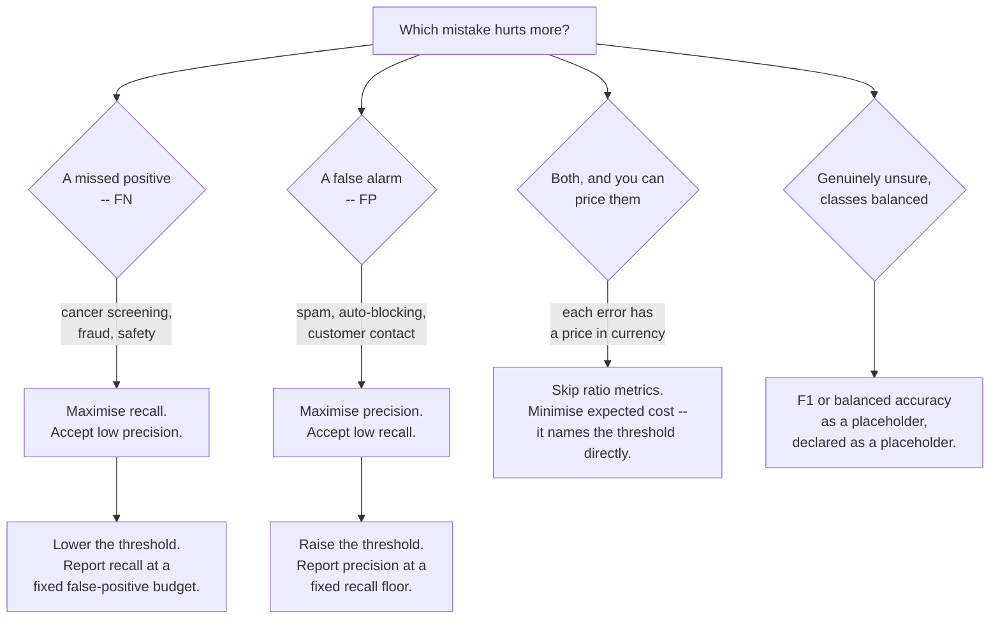

## What you'll learn

- the four cells — TP, FP, FN, TN — and how to stop confusing the middle two
- every common metric written as a ratio of those cells
- the ten-row example computed **by hand**, cell by cell
- scikit-learn's row/column convention, and why people read the matrix backwards
- how to read a multiclass matrix, where the off-diagonal is the interesting part
- why the matrix is the *only* summary that loses nothing

## Intuition

A single accuracy number compresses every prediction into one figure and throws away *which kind*
of mistake was made. For most real problems the kinds are not interchangeable: telling a healthy
patient they may be ill costs an anxious week, and telling an ill patient they are healthy can cost
much more.

The confusion matrix keeps them separate. For a binary problem it is four numbers, and every metric
in this phase is a ratio of some of them. It is the last point in the evaluation pipeline where no
information has been discarded.

|  | predicted **negative** | predicted **positive** |
| --- | --- | --- |
| **actual negative** | TN — true negative | FP — false positive (Type I) |
| **actual positive** | FN — false negative (Type II) | TP — true positive |

:::tip[How to never mix up FP and FN]
Read the second word first: it is what the **model said**. The first word says whether the model was
**right**. A *false positive* is a positive prediction that was false — a false alarm. A *false
negative* is a negative prediction that was false — a miss.
:::

## The math

Every metric, as a ratio of cells:

$$
\text{accuracy} = \frac{TP + TN}{TP + TN + FP + FN}
\qquad
\text{precision} = \frac{TP}{TP + FP}
$$

$$
\text{recall (sensitivity, TPR)} = \frac{TP}{TP + FN}
\qquad
\text{specificity (TNR)} = \frac{TN}{TN + FP}
$$

$$
\text{FPR} = \frac{FP}{FP + TN} = 1 - \text{specificity}
\qquad
F_1 = \frac{2 \cdot TP}{2 \cdot TP + FP + FN}
$$

Note which cell each denominator uses:

- **Precision** divides by everything the model *called positive* — a column of the matrix.
- **Recall** divides by everything that *actually is positive* — a row.

That single distinction is the source of most confusion between them, and it is worth memorising
as "precision is a column, recall is a row".

### Balanced accuracy

$$
\text{balanced accuracy} = \frac{\text{recall} + \text{specificity}}{2}
$$

The average of per-class recall. On the 2%-positive problem from
[Introduction to Classification](/machine-learning/phase-04---supervised-learning---classification/introduction-to-classification/),
a constant "always negative" model scores 0.98 accuracy and exactly **0.50** balanced accuracy —
which is the number you actually wanted.

## Worked example by hand

The ten-row example from the introduction, at threshold 0.5:

| # | true | score | predicted | cell |
| --- | --- | --- | --- | --- |
| 1 | spam | 0.95 | spam | TP |
| 2 | spam | 0.88 | spam | TP |
| 3 | spam | 0.76 | spam | TP |
| 4 | not spam | 0.70 | spam | **FP** |
| 5 | not spam | 0.62 | spam | **FP** |
| 6 | spam | 0.58 | spam | TP |
| 7 | spam | 0.31 | not spam | **FN** |
| 8 | not spam | 0.24 | not spam | TN |
| 9 | not spam | 0.13 | not spam | TN |
| 10 | not spam | 0.05 | not spam | TN |

**Step 1 — tally.** TP = 4, FP = 2, FN = 1, TN = 3. They sum to 10, as they must.

**Step 2 — assemble the matrix.**

|  | predicted not spam | predicted spam |
| --- | --- | --- |
| **actually not spam** | TN = 3 | FP = 2 |
| **actually spam** | FN = 1 | TP = 4 |

**Step 3 — every metric, from those four numbers.**

$$
\text{accuracy} = \frac{4 + 3}{10} = 0.700
\qquad
\text{precision} = \frac{4}{4 + 2} = 0.667
$$

$$
\text{recall} = \frac{4}{4 + 1} = 0.800
\qquad
\text{specificity} = \frac{3}{3 + 2} = 0.600
$$

$$
F_1 = \frac{2(4)}{2(4) + 2 + 1} = \frac{8}{11} = 0.727
\qquad
\text{balanced accuracy} = \frac{0.800 + 0.600}{2} = 0.700
$$

Six numbers describing one set of ten predictions, ranging from 0.60 to 0.80. Choosing which to
report is a decision about what the model is *for*, not a technicality.

**Step 4 — move the threshold to 0.65 and recount.** Now rows 1–4 are predicted spam:

$$
TP = 3,\; FP = 1,\; FN = 2,\; TN = 4
\;\Longrightarrow\;
\text{precision} = 0.750,\;\; \text{recall} = 0.600
$$

The model has not changed. One number in a comparison changed, and precision went up while recall
went down. That trade-off is the subject of the
[next page](/machine-learning/phase-04---supervised-learning---classification/precision-recall-and-f1-score/).

### See it move

Steps 1 to 4 by hand, for every threshold at once. Drag the threshold line through the ten scores and
watch rows cross it: each crossing moves exactly one row from one cell of the matrix to another, and
the six metrics recompute from the four counts.

```p5 title="One threshold, four cells, six metrics" desc="The ten ranked scores as a column with a draggable threshold line. Rows above the line are predicted spam; the two-by-two matrix and the six metrics below it update as rows cross. At threshold 0.5 the matrix reads TP 4, FP 2, FN 1, TN 3." height="440"
const ROWS = [
  { id: 1, score: 0.95, spam: true },
  { id: 2, score: 0.88, spam: true },
  { id: 3, score: 0.76, spam: true },
  { id: 4, score: 0.70, spam: false },
  { id: 5, score: 0.62, spam: false },
  { id: 6, score: 0.58, spam: true },
  { id: 7, score: 0.31, spam: true },
  { id: 8, score: 0.24, spam: false },
  { id: 9, score: 0.13, spam: false },
  { id: 10, score: 0.05, spam: false },
];
let thr = 0.5;
let dragging = false;

function setup() {
  createCanvas(620, 440);
  textFont("monospace");
}
function yOf(s) { return 300 - s * 250; }

function draw() {
  background(13, 17, 23);
  let tp = 0, fp = 0, fn = 0, tn = 0;
  for (const r of ROWS) {
    const pred = r.score >= thr;
    if (pred && r.spam) tp++;
    else if (pred && !r.spam) fp++;
    else if (!pred && r.spam) fn++;
    else tn++;
  }

  // score column
  const cx = 120;
  stroke(40, 46, 54);
  strokeWeight(1);
  line(cx, yOf(0), cx, yOf(1));
  for (const r of ROWS) {
    const y = yOf(r.score);
    const pred = r.score >= thr;
    let cell, col;
    if (pred && r.spam) { cell = "TP"; col = [120, 200, 120]; }
    else if (pred && !r.spam) { cell = "FP"; col = [232, 122, 122]; }
    else if (!pred && r.spam) { cell = "FN"; col = [255, 176, 67]; }
    else { cell = "TN"; col = [110, 150, 190]; }
    noStroke();
    fill(col[0], col[1], col[2]);
    ellipse(cx, y, 12, 12);
    fill(150);
    textSize(10);
    textAlign(RIGHT, CENTER);
    text("#" + r.id + " " + (r.spam ? "spam    " : "not spam") + " " + r.score.toFixed(2), cx - 12, y);
    fill(col[0], col[1], col[2]);
    textAlign(LEFT, CENTER);
    text(cell, cx + 12, y);
    stroke(40, 46, 54);
  }
  // threshold line
  stroke(235);
  strokeWeight(2);
  line(40, yOf(thr), 250, yOf(thr));
  noStroke();
  fill(235);
  textSize(11);
  textAlign(LEFT, CENTER);
  text("threshold " + thr.toFixed(2), 256, yOf(thr));
  fill(105);
  textSize(10);
  textAlign(LEFT, TOP);
  text("drag the white line", 40, 320);

  // matrix
  const mx = 350, my = 60, cw = 108, ch = 46;
  fill(150);
  textSize(10);
  textAlign(CENTER, BOTTOM);
  text("pred not spam", mx + cw / 2, my - 6);
  text("pred spam", mx + cw * 1.5, my - 6);
  const cells = [
    [tn, "TN", [110, 150, 190], 0, 0],
    [fp, "FP", [232, 122, 122], 1, 0],
    [fn, "FN", [255, 176, 67], 0, 1],
    [tp, "TP", [120, 200, 120], 1, 1],
  ];
  for (const [n, label, col, c, r] of cells) {
    const x = mx + c * cw, y = my + r * ch;
    fill(col[0], col[1], col[2], 40 + n * 26);
    rect(x, y, cw - 4, ch - 4, 3);
    fill(col[0], col[1], col[2]);
    textSize(15);
    textAlign(CENTER, CENTER);
    text(label + " = " + n, x + cw / 2 - 2, y + ch / 2 - 2);
  }
  fill(150);
  textSize(10);
  textAlign(RIGHT, CENTER);
  text("actual not spam", mx - 8, my + ch / 2);
  text("actual spam", mx - 8, my + ch * 1.5);

  // metrics
  const acc = (tp + tn) / 10;
  const prec = tp + fp ? tp / (tp + fp) : NaN;
  const rec = tp + fn ? tp / (tp + fn) : NaN;
  const spec = tn + fp ? tn / (tn + fp) : NaN;
  const f1 = 2 * tp + fp + fn ? (2 * tp) / (2 * tp + fp + fn) : NaN;
  const bal = (rec + spec) / 2;
  const list = [
    ["accuracy", acc],
    ["precision", prec],
    ["recall", rec],
    ["specificity", spec],
    ["F1", f1],
    ["balanced acc", bal],
  ];
  for (let i = 0; i < list.length; i++) {
    const [label, v] = list[i];
    const y = 178 + i * 22;
    fill(150);
    textSize(11);
    textAlign(LEFT, TOP);
    text(label, mx, y);
    fill(isNaN(v) ? color(232, 122, 122) : color(235));
    textAlign(LEFT, TOP);
    text(isNaN(v) ? "undefined" : v.toFixed(3), mx + 112, y);
    noStroke();
    fill(90, 110, 140);
    if (!isNaN(v)) rect(mx + 172, y + 3, v * 60, 8);
  }
  fill(105);
  textSize(10);
  textAlign(LEFT, TOP);
  text("push the threshold above 0.95 and precision", mx, 330);
  text("becomes 0/0 -- undefined, not zero", mx, 344);
}
function mousePressed() { if (mouseX < 270 && mouseY < 320) dragging = true; }
function mouseDragged() {
  if (dragging) thr = constrain((300 - mouseY) / 250, 0.0, 1.0);
}
function mouseReleased() { dragging = false; }
```

Two things the static table cannot show. **Only one row moves at a time.** Sliding from 0.5 to 0.65
crosses row 6 alone, which is why exactly one cell pair changed in step 4 — the matrix moves in
integer steps, and with ten rows every metric is quantised to tenths and sixths. **Above 0.95 nothing
is predicted spam**, so precision is $0/0$: undefined, and scikit-learn will emit
`UndefinedMetricWarning` and substitute 0.0 unless you pass `zero_division`. A metric that can be
undefined is a metric you should not average over folds without checking.

## Reading a real matrix

<Figure
  src="/images/ml/phase-04-classification/metrics/confusion-matrices"
  alt="Left: a two-by-two confusion matrix with cells labelled TN 103, FP 4, FN 4, TP 60. Right: a ten-by-ten confusion matrix for handwritten digits with a strong diagonal and a scattering of small off-diagonal counts."
  title="Binary and ten-class matrices from real models"
  caption="Left: logistic regression on breast cancer, 171 held-out patients. Right: the same estimator on handwritten digits, 97.2% accurate — with the remaining 2.8% concentrated in a few specific confusions."
/>

### Reading the plot

**The binary matrix** (TN 103, FP 4, FN 4, TP 60):

- Accuracy is $(103+60)/171 = 0.953$.
- Precision is $60/64 = 0.938$ and recall is $60/64 = 0.938$ — equal only because FP happens to
  equal FN here. That is a coincidence, not a property.
- The four false negatives are the cells that matter clinically: four malignant tumours the model
  called benign.

**The ten-class matrix**:

- The diagonal is the correct predictions and dominates, as it should at 97% accuracy.
- The **off-diagonal is the interesting part**. Row 8 shows three eights predicted as ones — a
  specific, repeatable confusion, not random error.
- Reading a row tells you what a class gets mistaken *for*; reading a column tells you what gets
  mistaken *for* that class. Both are actionable in ways an accuracy score is not.

```python title="confusion_matrix.py" showLineNumbers{1}
from sklearn.datasets import load_breast_cancer
from sklearn.linear_model import LogisticRegression
from sklearn.metrics import classification_report, confusion_matrix
from sklearn.model_selection import train_test_split
from sklearn.pipeline import make_pipeline
from sklearn.preprocessing import StandardScaler

X, y = load_breast_cancer(return_X_y=True)
y = 1 - y                       # 1 = malignant
X_tr, X_te, y_tr, y_te = train_test_split(
    X, y, test_size=0.3, random_state=0, stratify=y
)

model = make_pipeline(StandardScaler(), LogisticRegression(max_iter=5000))
model.fit(X_tr, y_tr)
pred = model.predict(X_te)

cm = confusion_matrix(y_te, pred)
print(cm)
# [[103   4]
#  [  4  60]]

tn, fp, fn, tp = cm.ravel()      # the standard unpacking idiom
print(f"TN={tn} FP={fp} FN={fn} TP={tp}")   # TN=103 FP=4 FN=4 TP=60

print(classification_report(y_te, pred, target_names=["benign", "malignant"]))
```

:::caution[scikit-learn's layout catches people out]
`confusion_matrix` puts **actual on rows, predicted on columns**, with labels in sorted order. Many
textbooks and most statistics courses use the transpose. When you see a matrix without axis labels,
check `cm.ravel()` order — it is always TN, FP, FN, TP for a binary problem with labels 0 and 1.
:::

## Multiclass

For $K$ classes the matrix is $K \times K$: entry $(i, j)$ counts samples of true class $i$
predicted as class $j$. There is no single TP or FP any more — each class gets its own, computed
one-versus-rest:

- $TP_c$ is the diagonal entry for class $c$
- $FN_c$ is the rest of row $c$ (true $c$, predicted something else)
- $FP_c$ is the rest of column $c$ (predicted $c$, actually something else)
- $TN_c$ is everything else

Per-class metrics are then averaged, and **the averaging choice matters**:

| Average | Method | Use when |
| --- | --- | --- |
| `macro` | Unweighted mean of per-class scores | Every class matters equally, including rare ones |
| `weighted` | Mean weighted by class support | You want a figure that tracks overall accuracy |
| `micro` | Pool all TP, FP, FN, then compute once | Equivalent to accuracy for single-label multiclass |

On an imbalanced problem `macro` and `weighted` can differ enormously. A model that is excellent on
the common classes and useless on the rare ones scores well on `weighted` and badly on `macro` —
and `macro` is usually the honest one.

```python title="multiclass_matrix.py" showLineNumbers{1}
import numpy as np
from sklearn.datasets import load_digits
from sklearn.linear_model import LogisticRegression
from sklearn.metrics import confusion_matrix, f1_score
from sklearn.model_selection import train_test_split
from sklearn.pipeline import make_pipeline
from sklearn.preprocessing import StandardScaler

digits = load_digits()
X_tr, X_te, y_tr, y_te = train_test_split(
    digits.data, digits.target, test_size=0.3, random_state=0, stratify=digits.target
)

model = make_pipeline(StandardScaler(), LogisticRegression(max_iter=5000))
model.fit(X_tr, y_tr)
pred = model.predict(X_te)

cm = confusion_matrix(y_te, pred)
print(f"accuracy      {model.score(X_te, y_te):.4f}")        # 0.9722
print(f"macro F1      {f1_score(y_te, pred, average='macro'):.4f}")
print(f"weighted F1   {f1_score(y_te, pred, average='weighted'):.4f}")

# Where does the model actually go wrong?
errors = cm.copy()
np.fill_diagonal(errors, 0)
for true_c, pred_c in zip(*np.where(errors >= 2)):
    print(f"{errors[true_c, pred_c]} samples: true {true_c} -> predicted {pred_c}")

# 3 samples: true 8 -> predicted 1
```

Two lines of NumPy turn a wall of numbers into one actionable sentence: this model confuses eights
with ones, and nothing else systematically.

## Which cell should you be optimising?

No metric knows your costs, so this is a routing question you answer before choosing one:



The branch most teams skip is the third. If a false positive costs €4 of wasted review and a false
negative costs €300 of loss, no ratio of counts is the right objective — expected cost is, and it
implies a threshold of $t^* = C_{FP} / (C_{FP} + C_{FN})$ without any tuning. That derivation is on
[Cost-Sensitive Learning and Decision Thresholds](/machine-learning/phase-10---applied-ml-problems/cost-sensitive-learning-and-decision-thresholds/).

| Domain | Positive class | FP costs | FN costs | Optimise |
| --- | --- | --- | --- | --- |
| Cancer screening | Malignant | A follow-up scan | A missed cancer | Recall |
| Spam filtering | Spam | A lost real email | An annoying email | Precision |
| Fraud detection | Fraudulent | An angry customer | Money gone | Depends on amounts |
| Criminal justice risk | High risk | Wrongful detention | Reoffence | Recall, with a fairness audit |
| Ad targeting | Will click | A wasted impression | A missed sale | Whichever is worth more |
| Predictive maintenance | Will fail | An unnecessary service | An unplanned outage | Recall |

Fill this row in for your own problem before you choose a metric. If you cannot say which error is
worse, you do not yet know what the model is for.

## Pitfalls

:::danger[Reporting accuracy alone]
Accuracy sums the diagonal and throws away everything else. On imbalanced data it is dominated by
the majority class and can be excellent for a model that never predicts the minority at all. Always
print the confusion matrix beside it.
:::

:::caution[Confusing the two error types]
Type I is a false positive — you claimed an effect that is not there. Type II is a false negative —
you missed one that is. If you find yourself pausing, use "false alarm" and "miss" instead; nobody
misreads those.
:::

:::caution[Comparing matrices with different test sets]
Raw counts depend on how many rows were in the test set. Two models are only comparable on
identical test data, or via rates rather than counts.
:::

:::caution[Multiclass averaging chosen by accident]
`f1_score(y, pred)` fails on multiclass unless you pass `average=`. Whichever you choose becomes
part of the claim you are making, so state it: "macro F1 0.91", never a bare "F1 0.91".
:::

<Quiz
  questions={[
    {
      q: "A model predicts 'positive' for a sample that is actually negative. What is that called?",
      options: ["True positive", "False positive (Type I error)", "False negative (Type II error)", "True negative"],
      answer: 1,
      explain: "Read the second word first: the model said positive. The first word says it was wrong. A false alarm.",
    },
    {
      q: "Precision and recall divide by different things. Which is which?",
      options: [
        "Precision divides by all actual positives; recall divides by all predicted positives",
        "Precision divides by all predicted positives (a column); recall divides by all actual positives (a row)",
        "Both divide by the total number of samples",
        "Precision divides by true positives; recall divides by false negatives",
      ],
      answer: 1,
      explain: "Precision is TP/(TP+FP) — a column of the matrix. Recall is TP/(TP+FN) — a row. 'Precision is a column, recall is a row' is worth memorising.",
    },
    {
      q: "cm.ravel() on a binary confusion matrix returns four numbers. In what order?",
      options: ["TP, FP, FN, TN", "TN, FP, FN, TP", "TP, TN, FP, FN", "It depends on the class labels"],
      answer: 1,
      explain: "scikit-learn puts actual on rows and predicted on columns with labels sorted, so row 0 is [TN, FP] and row 1 is [FN, TP]. Flattened, that is TN, FP, FN, TP.",
    },
    {
      q: "Your ten-class model is 97% accurate. What does the off-diagonal of its confusion matrix add?",
      options: [
        "Nothing — accuracy already summarises it",
        "It shows which specific classes get confused with which, turning a score into an actionable diagnosis",
        "It shows the training loss",
        "It is only useful for binary problems",
      ],
      answer: 1,
      explain: "'97% accurate' and 'it confuses eights with ones three times' lead to completely different next steps. The off-diagonal is where the debugging information lives.",
    },
  ]}
/>

## 🧪 Try It Yourself

### Exercise 1 – Count the four cells

<DataCampExercise
  lang="python"
  hint={`A false positive is a row where the truth is 0 and the prediction is 1.`}
  code={`# Task: Exercise 1 - Count the four cells
import numpy as np

y = np.array([1, 1, 1, 0, 0, 1, 1, 0, 0, 0])
pred = np.array([1, 1, 1, 1, 1, 1, 0, 0, 0, 0])

tp = int(((y == 1) & (pred == 1)).sum())
fp = int(((y == 0) & (pred == ___)).sum())    # replace ___ with 1
fn = int(((y == 1) & (pred == 0)).sum())
tn = int(((y == 0) & (pred == 0)).sum())

print(f"TN={tn} FP={fp} FN={fn} TP={tp}")
print("total:", tn + fp + fn + tp)

# -- Expected Output -------------------------------------------
# TN=3 FP=2 FN=1 TP=4
# total: 10
# --------------------------------------------------------------`}
  solution={`import numpy as np

y = np.array([1, 1, 1, 0, 0, 1, 1, 0, 0, 0])
pred = np.array([1, 1, 1, 1, 1, 1, 0, 0, 0, 0])
tp = int(((y == 1) & (pred == 1)).sum())
fp = int(((y == 0) & (pred == 1)).sum())
fn = int(((y == 1) & (pred == 0)).sum())
tn = int(((y == 0) & (pred == 0)).sum())
print(f"TN={tn} FP={fp} FN={fn} TP={tp}")
print("total:", tn + fp + fn + tp)`}
  sct={`test_output_contains("TN=3 FP=2 FN=1 TP=4")
success_msg("Four numbers, and every metric on the next two pages comes from them.")`}
  height={198}
/>

### Exercise 2 – Derive six metrics from four numbers

<DataCampExercise
  lang="python"
  hint={`Precision divides by TP + FP; recall divides by TP + FN.`}
  code={`# Task: Exercise 2 - Derive six metrics from four numbers
tn, fp, fn, tp = 3, 2, 1, 4

accuracy = (tp + tn) / (tp + tn + fp + fn)
precision = tp / (tp + fp)
recall = tp / (tp + ___)                  # replace ___ with fn
specificity = tn / (tn + fp)
f1 = 2 * tp / (2 * tp + fp + fn)
balanced = (recall + specificity) / 2

print("accuracy:", round(accuracy, 3))
print("precision:", round(precision, 3))
print("recall:", round(recall, 3))
print("specificity:", round(specificity, 3))
print("f1:", round(f1, 3))
print("balanced accuracy:", round(balanced, 3))

# -- Expected Output -------------------------------------------
# accuracy: 0.7
# precision: 0.667
# recall: 0.8
# specificity: 0.6
# f1: 0.727
# balanced accuracy: 0.7
# --------------------------------------------------------------`}
  solution={`tn, fp, fn, tp = 3, 2, 1, 4
accuracy = (tp + tn) / (tp + tn + fp + fn)
precision = tp / (tp + fp)
recall = tp / (tp + fn)
specificity = tn / (tn + fp)
f1 = 2 * tp / (2 * tp + fp + fn)
balanced = (recall + specificity) / 2
print("accuracy:", round(accuracy, 3))
print("precision:", round(precision, 3))
print("recall:", round(recall, 3))
print("specificity:", round(specificity, 3))
print("f1:", round(f1, 3))
print("balanced accuracy:", round(balanced, 3))`}
  sct={`test_output_contains("f1: 0.727")
success_msg("Six different summaries of the same ten predictions, from 0.60 to 0.80.")`}
  height={238}
/>

### Exercise 3 – Unpack a scikit-learn matrix

<DataCampExercise
  lang="python"
  hint={`ravel() flattens the 2x2 matrix in the order TN, FP, FN, TP.`}
  code={`# Task: Exercise 3 - Unpack a scikit-learn matrix
import numpy as np
from sklearn.metrics import ___          # replace ___ with confusion_matrix

y = np.array([1, 1, 1, 0, 0, 1, 1, 0, 0, 0])
pred = np.array([1, 1, 1, 1, 1, 1, 0, 0, 0, 0])

cm = confusion_matrix(y, pred)
print(cm)

tn, fp, fn, tp = cm.ravel()
print(f"TN={tn} FP={fp} FN={fn} TP={tp}")

# -- Expected Output -------------------------------------------
# [[3 2]
#  [1 4]]
# TN=3 FP=2 FN=1 TP=4
# --------------------------------------------------------------`}
  solution={`import numpy as np
from sklearn.metrics import confusion_matrix

y = np.array([1, 1, 1, 0, 0, 1, 1, 0, 0, 0])
pred = np.array([1, 1, 1, 1, 1, 1, 0, 0, 0, 0])
cm = confusion_matrix(y, pred)
print(cm)
tn, fp, fn, tp = cm.ravel()
print(f"TN={tn} FP={fp} FN={fn} TP={tp}")`}
  sct={`test_output_contains("TN=3 FP=2 FN=1 TP=4")
success_msg("Actual on rows, predicted on columns — the layout worth memorising.")`}
  height={198}
/>

### Exercise 4 – Watch the cells move with the threshold

<DataCampExercise
  lang="python"
  hint={`Recompute the predictions at each threshold, then recount.`}
  code={`# Task: Exercise 4 - Watch the cells move with the threshold
import numpy as np
from sklearn.metrics import confusion_matrix

y = np.array([1, 1, 1, 0, 0, 1, 1, 0, 0, 0])
scores = np.array([0.95, 0.88, 0.76, 0.70, 0.62, 0.58, 0.31, 0.24, 0.13, 0.05])

for t in (0.5, 0.65, 0.8):
    pred = (scores >= ___).astype(int)      # replace ___ with t
    tn, fp, fn, tp = confusion_matrix(y, pred).ravel()
    print(f"t={t}: TN={tn} FP={fp} FN={fn} TP={tp}")

# -- Expected Output -------------------------------------------
# t=0.5: TN=3 FP=2 FN=1 TP=4
# t=0.65: TN=4 FP=1 FN=2 TP=3
# t=0.8: TN=5 FP=0 FN=3 TP=2
# --------------------------------------------------------------`}
  solution={`import numpy as np
from sklearn.metrics import confusion_matrix

y = np.array([1, 1, 1, 0, 0, 1, 1, 0, 0, 0])
scores = np.array([0.95, 0.88, 0.76, 0.70, 0.62, 0.58, 0.31, 0.24, 0.13, 0.05])

for t in (0.5, 0.65, 0.8):
    pred = (scores >= t).astype(int)
    tn, fp, fn, tp = confusion_matrix(y, pred).ravel()
    print(f"t={t}: TN={tn} FP={fp} FN={fn} TP={tp}")`}
  sct={`test_output_contains("t=0.8: TN=5 FP=0 FN=3 TP=2")
success_msg("Same model, same data — the threshold traded two true positives for two true negatives.")`}
  height={208}
/>

### Exercise 5 – Find the systematic multiclass confusion

<DataCampExercise
  lang="python"
  hint={`Zero the diagonal, then look for the largest remaining entries.`}
  code={`# Task: Exercise 5 - Find the systematic multiclass confusion
import numpy as np
from sklearn.datasets import load_digits
from sklearn.linear_model import LogisticRegression
from sklearn.metrics import confusion_matrix
from sklearn.model_selection import train_test_split
from sklearn.pipeline import make_pipeline
from sklearn.preprocessing import StandardScaler

digits = load_digits()
X_tr, X_te, y_tr, y_te = train_test_split(
    digits.data, digits.target, test_size=0.3,
    random_state=0, stratify=digits.target)

model = make_pipeline(StandardScaler(),
                      LogisticRegression(max_iter=5000)).fit(X_tr, y_tr)
cm = confusion_matrix(y_te, model.predict(X_te))

errors = cm.copy()
np.fill___(errors, 0)                # replace ___ with _diagonal
worst = np.unravel_index(errors.argmax(), errors.shape)

print("accuracy:", round(model.score(X_te, y_te), 4))
print("worst confusion:", f"true {worst[0]} -> predicted {worst[1]}",
      f"({errors[worst]} times)")

# -- Expected Output -------------------------------------------
# accuracy: 0.9722
# worst confusion: true 8 -> predicted 1 (3 times)
# --------------------------------------------------------------`}
  solution={`import numpy as np
from sklearn.datasets import load_digits
from sklearn.linear_model import LogisticRegression
from sklearn.metrics import confusion_matrix
from sklearn.model_selection import train_test_split
from sklearn.pipeline import make_pipeline
from sklearn.preprocessing import StandardScaler

digits = load_digits()
X_tr, X_te, y_tr, y_te = train_test_split(
    digits.data, digits.target, test_size=0.3,
    random_state=0, stratify=digits.target)
model = make_pipeline(StandardScaler(),
                      LogisticRegression(max_iter=5000)).fit(X_tr, y_tr)
cm = confusion_matrix(y_te, model.predict(X_te))
errors = cm.copy()
np.fill_diagonal(errors, 0)
worst = np.unravel_index(errors.argmax(), errors.shape)
print("accuracy:", round(model.score(X_te, y_te), 4))
print("worst confusion:", f"true {worst[0]} -> predicted {worst[1]}",
      f"({errors[worst]} times)")`}
  sct={`test_output_contains("accuracy: 0.9722")
success_msg("From '97% accurate' to 'it mistakes eights for ones' — one is actionable.")`}
  height={258}
/>

## Recap

- Four cells: TP, FP, FN, TN. Read the second word first — a false positive is a false alarm, a
  false negative is a miss.
- Precision divides by a column (everything predicted positive); recall divides by a row
  (everything actually positive).
- The ten-row example: TN 3, FP 2, FN 1, TP 4 → accuracy 0.700, precision 0.667, recall 0.800,
  specificity 0.600, $F_1$ 0.727.
- Moving the threshold to 0.65 gives precision 0.750 and recall 0.600, with no retraining.
- scikit-learn puts actual on rows and predicted on columns; `cm.ravel()` is TN, FP, FN, TP.
- In multiclass the off-diagonal is the diagnosis, and the averaging mode is part of the claim.

### Exercise 6 – Tabulate every threshold at once

<DataCampExercise
  lang="python"
  hint={`A row is predicted positive when its score is greater than or equal to the threshold. Guard the precision denominator before dividing.`}
  code={`# Task: Exercise 6 - Tabulate every threshold at once
TEN_ROWS = [
    (0.95, 1), (0.88, 1), (0.76, 1), (0.70, 0), (0.62, 0),
    (0.58, 1), (0.31, 1), (0.24, 0), (0.13, 0), (0.05, 0),
]

print(f"{'thr':>5} {'TP':>3} {'FP':>3} {'FN':>3} {'TN':>3} "
      f"{'acc':>6} {'prec':>7} {'rec':>6}")
for thr in [round(s, 2) for s, _ in TEN_ROWS] + [1.01]:
    tp = sum(1 for s, y in TEN_ROWS if s >= thr and y == 1)
    fp = sum(1 for s, y in TEN_ROWS if s >= thr and y == 0)
    fn = sum(1 for s, y in TEN_ROWS if s < thr and y == 1)
    tn = sum(1 for s, y in TEN_ROWS if s < thr and y == 0)
    precision = "undef " if tp + fp == ___ else f"{tp / (tp + fp):6.3f}"
    # replace ___ with 0
    print(f"{thr:5.2f} {tp:3d} {fp:3d} {fn:3d} {tn:3d} "
          f"{(tp + tn) / 10:6.3f} {precision:>7} {tp / (tp + fn):6.3f}")
print("only one row moves per threshold step, and precision is undefined "
      "once nothing is flagged")

# -- Expected Output -------------------------------------------
#   thr  TP  FP  FN  TN    acc    prec    rec
#  0.95   1   0   4   5  0.600   1.000  0.200
#  0.88   2   0   3   5  0.700   1.000  0.400
#  0.76   3   0   2   5  0.800   1.000  0.600
#  0.70   3   1   2   4  0.700   0.750  0.600
#  0.62   3   2   2   3  0.600   0.600  0.600
#  0.58   4   2   1   3  0.700   0.667  0.800
#  0.31   5   2   0   3  0.800   0.714  1.000
#  0.24   5   3   0   2  0.700   0.625  1.000
#  0.13   5   4   0   1  0.600   0.556  1.000
#  0.05   5   5   0   0  0.500   0.500  1.000
#  1.01   0   0   5   5  0.500  undef   0.000
# --------------------------------------------------------------`}
  solution={`TEN_ROWS = [
    (0.95, 1), (0.88, 1), (0.76, 1), (0.70, 0), (0.62, 0),
    (0.58, 1), (0.31, 1), (0.24, 0), (0.13, 0), (0.05, 0),
]

print(f"{'thr':>5} {'TP':>3} {'FP':>3} {'FN':>3} {'TN':>3} "
      f"{'acc':>6} {'prec':>7} {'rec':>6}")
for thr in [round(s, 2) for s, _ in TEN_ROWS] + [1.01]:
    tp = sum(1 for s, y in TEN_ROWS if s >= thr and y == 1)
    fp = sum(1 for s, y in TEN_ROWS if s >= thr and y == 0)
    fn = sum(1 for s, y in TEN_ROWS if s < thr and y == 1)
    tn = sum(1 for s, y in TEN_ROWS if s < thr and y == 0)
    precision = "undef " if tp + fp == 0 else f"{tp / (tp + fp):6.3f}"
    print(f"{thr:5.2f} {tp:3d} {fp:3d} {fn:3d} {tn:3d} "
          f"{(tp + tn) / 10:6.3f} {precision:>7} {tp / (tp + fn):6.3f}")
print("only one row moves per threshold step, and precision is undefined "
      "once nothing is flagged")`}
  sct={`test_output_contains("undef")
success_msg("Accuracy peaks twice — 0.800 at both 0.76 and 0.31 — with completely different matrices behind it: three true positives and no false alarms, or five true positives and two false alarms. One number, two very different systems.")`}
  height={380}
/>

## Next

Continue to
[Precision, Recall, and F1-Score](/machine-learning/phase-04---supervised-learning---classification/precision-recall-and-f1-score/)
— which of these four cells you are willing to trade, and how to pick a threshold that reflects the
answer.
