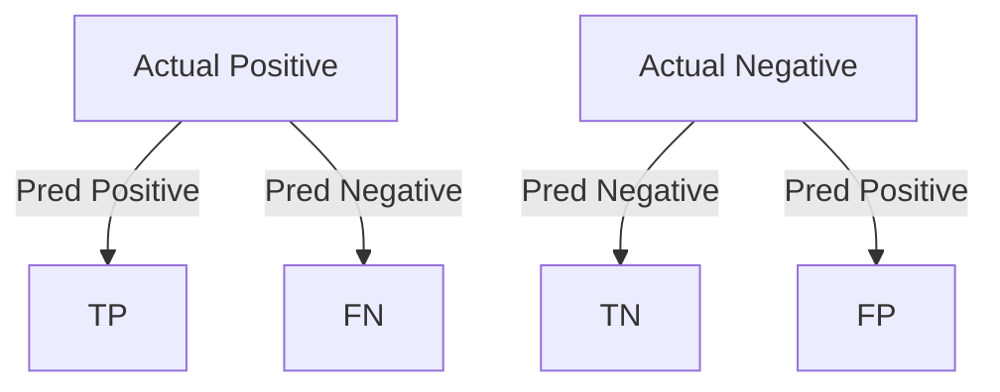

## What you'll learn

- how TP, TN, FP, and FN are defined, and how to read them off a 2x2 grid
- how to compute a confusion matrix by hand from a small worked example
- how to read a real, book-scale confusion matrix (rows vs columns)
- how confusion matrices extend to more than two classes, and how to spot
  which classes get confused with each other
- common gotchas: row/column orientation, class order, and normalizing counts

## What the confusion matrix shows

A confusion matrix compares:

- actual labels
- predicted labels

For binary classification:

- **TP** (true positive): predicted positive, actually positive
- **TN** (true negative): predicted negative, actually negative
- **FP** (false positive): predicted positive, actually negative — a "false alarm"
- **FN** (false negative): predicted negative, actually positive — a "miss"



## Why it matters

All important classification metrics — precision, recall, F1, specificity,
even ROC/AUC — are computed from nothing but these four counts. The confusion
matrix is the raw material; every other metric on this phase's remaining
pages is just a different way of summarizing it.

## A worked example, cell by cell

Say a spam filter checks 20 emails. 8 are actually spam, 12 are actually not
spam ("ham"). The filter flags 9 emails as spam:

- of the 8 real spam emails, it correctly flags 6 (**TP = 6**) and misses 2
  (**FN = 2**)
- of the 12 real ham emails, it wrongly flags 3 as spam (**FP = 3**) and
  correctly leaves 9 alone (**TN = 9**)

```python title="Building the confusion matrix by hand" showLineNumbers{1}
import numpy as np

TP, FN, FP, TN = 6, 2, 3, 9

cm = np.array([
    [TN, FP],   # actual ham:  correctly ham,  wrongly flagged spam
    [FN, TP],   # actual spam: wrongly missed,  correctly flagged
])
print(cm)
# [[9 3]
#  [2 6]]

total = cm.sum()
accuracy = (TP + TN) / total
print("Accuracy:", round(accuracy, 3))
# Accuracy: 0.75
```

Notice the matrix layout: **rows are the actual class, columns are the
predicted class** — this is scikit-learn's convention (and the one this page
uses throughout). Reading along the diagonal gives every *correct* prediction;
everything off the diagonal is a mistake the model made.

## Reading a real confusion matrix

Géron's book computes the confusion matrix for the MNIST "5-detector" from the
Introduction to Classification page, using `cross_val_predict()` so every
prediction comes from a model that never saw that instance during training:

```python title="A real confusion matrix (from the book)" showLineNumbers{1}
from sklearn.metrics import confusion_matrix

# y_train_5: True for real 5s, y_train_pred: model's cross-validated predictions
cm = confusion_matrix(y_train_5, y_train_pred)
print(cm)
# [[53057  1522]
#  [ 1325  4096]]
```

Rows are the **actual** class, columns are the **predicted** class:

- row 0 (actual "not 5"): 53,057 correctly called not-5 (TN), 1,522 wrongly
  called 5 (FP)
- row 1 (actual "5"): 1,325 wrongly called not-5 (FN), 4,096 correctly caught
  (TP)

A perfect classifier would only ever have nonzero values on the main diagonal
— every off-diagonal cell is a mistake.

## Visualize it

Each prediction lands in exactly one of the four cells. Watch the stream of
incoming predictions on the left fly into the matching cell on the right, and
the counts build up live — this is exactly what `confusion_matrix()` does
internally, just one instance at a time instead of all at once:

```p5 title="Watching a confusion matrix fill in, prediction by prediction" desc="Each incoming prediction flies into the correct cell of the 2x2 grid; the four counts build live, then the stream loops with a fresh batch." height="300"
let stream = [];
const N = 24;
const FRAMES_PER = 14;
const PAUSE = 70;
function setup() {
  createCanvas(600, 300);
  textFont("monospace");
  const dist = [];
  for (let i = 0; i < 10; i++) dist.push({ a: 0, p: 0 }); // TN
  for (let i = 0; i < 2; i++) dist.push({ a: 0, p: 1 });  // FP
  for (let i = 0; i < 3; i++) dist.push({ a: 1, p: 0 });  // FN
  for (let i = 0; i < 9; i++) dist.push({ a: 1, p: 1 });  // TP
  stream = shuffle(dist);
}
function cellCenter(a, p) {
  const gx = 330, gy = 46, cw = 110, ch = 88;
  return { x: gx + p * cw + cw / 2, y: gy + a * ch + ch / 2 };
}
function draw() {
  background(13, 17, 23);
  const cycle = N * FRAMES_PER + PAUSE;
  const f = frameCount % cycle;
  const shown = Math.min(N, Math.floor(f / FRAMES_PER));

  let counts = { tn: 0, fp: 0, fn: 0, tp: 0 };
  for (let i = 0; i < shown; i++) {
    const s = stream[i];
    if (s.a === 0 && s.p === 0) counts.tn++;
    if (s.a === 0 && s.p === 1) counts.fp++;
    if (s.a === 1 && s.p === 0) counts.fn++;
    if (s.a === 1 && s.p === 1) counts.tp++;
  }

  noStroke();
  fill(150);
  textSize(11);
  textAlign(LEFT, TOP);
  text("incoming predictions", 20, 10);
  for (let i = 0; i < N; i++) {
    const done = i < shown;
    if (stream[i].a === 0) fill(75, 139, 190, done ? 90 : 255);
    else fill(255, 211, 67, done ? 90 : 255);
    ellipse(24 + (i % 8) * 26, 36 + Math.floor(i / 8) * 26, 14, 14);
  }
  fill(140);
  textSize(10);
  text("blue = actual 0   amber = actual 1", 20, 128);

  if (shown < N) {
    const s = stream[shown];
    const startX = 24 + (shown % 8) * 26, startY = 36 + Math.floor(shown / 8) * 26;
    const target = cellCenter(s.a, s.p);
    const local = (f % FRAMES_PER) / FRAMES_PER;
    const ease = local * local * (3 - 2 * local);
    const fx = lerp(startX, target.x, ease);
    const fy = lerp(startY, target.y, ease);
    if (s.a === 0) fill(75, 139, 190); else fill(255, 211, 67);
    ellipse(fx, fy, 12, 12);
  }

  const gx = 330, gy = 46, cw = 110, ch = 88;
  stroke(60, 70, 84);
  strokeWeight(1);
  noFill();
  rect(gx, gy, cw * 2, ch * 2);
  line(gx + cw, gy, gx + cw, gy + ch * 2);
  line(gx, gy + ch, gx + cw * 2, gy + ch);

  noStroke();
  fill(210);
  textSize(11);
  textAlign(CENTER, TOP);
  text("Predicted 0", gx + cw / 2, gy - 16);
  text("Predicted 1", gx + cw + cw / 2, gy - 16);
  textAlign(RIGHT, CENTER);
  text("Actual 0", gx - 10, gy + ch / 2);
  text("Actual 1", gx - 10, gy + ch + ch / 2);

  textAlign(CENTER, CENTER);
  textSize(22);
  fill(90, 200, 120); text(counts.tn, gx + cw / 2, gy + ch / 2);
  fill(220, 90, 90);  text(counts.fp, gx + cw + cw / 2, gy + ch / 2);
  fill(220, 90, 90);  text(counts.fn, gx + cw / 2, gy + ch + ch / 2);
  fill(90, 200, 120); text(counts.tp, gx + cw + cw / 2, gy + ch + ch / 2);

  textSize(10);
  fill(140);
  text("TN", gx + cw / 2, gy + ch / 2 + 24);
  text("FP", gx + cw + cw / 2, gy + ch / 2 + 24);
  text("FN", gx + cw / 2, gy + ch + ch / 2 + 24);
  text("TP", gx + cw + cw / 2, gy + ch + ch / 2 + 24);

  fill(200);
  textSize(11);
  textAlign(LEFT, BOTTOM);
  text(shown + " / " + N + " predictions scored", 20, height - 8);
}
```

## Multiclass confusion matrices

With more than two classes, the confusion matrix simply grows to `N x N` —
row `i`, column `j` counts how many instances of actual class `i` got
predicted as class `j`. The book builds one for all 10 MNIST digits:

```python title="A 10x10 confusion matrix (all MNIST digits)" showLineNumbers{1}
from sklearn.metrics import confusion_matrix

# y_train_pred here comes from cross_val_predict() on the full 10-class problem
conf_mx = confusion_matrix(y_train, y_train_pred)
print(conf_mx.shape)
# (10, 10)
```

With 100 numbers to scan, raw counts are hard to read at a glance — Géron
plots it as an image instead (`plt.matshow(conf_mx, cmap=plt.cm.gray)`),
where brighter cells mean bigger counts. Most images land on the main
diagonal (correct predictions), so a well-behaved classifier's matshow plot
looks like a bright diagonal line on a dark background.

To spot *errors* specifically, normalize each row by its class size (so
common classes don't automatically look "worse" just for having more
examples), then zero out the diagonal to hide the correct predictions
entirely:

```python title="Normalizing to compare error rates fairly" showLineNumbers{1}
import numpy as np

row_sums = conf_mx.sum(axis=1, keepdims=True)
norm_conf_mx = conf_mx / row_sums
np.fill_diagonal(norm_conf_mx, 0)
# now the brightest remaining cells reveal exactly which classes
# get confused with which -- e.g. Géron finds 3s and 5s often swap
```

This is also exactly what scikit-learn's `normalize` argument does for you
directly: `confusion_matrix(y_true, y_pred, normalize="true")` divides each
row by its total in one call.

## Common pitfalls

- **Orientation**: scikit-learn always puts actual classes on rows,
  predicted classes on columns — but some textbooks and plotting libraries
  transpose this. Always check which axis is which before reading a matrix
  you didn't build yourself.
- **Class order**: `confusion_matrix()` sorts labels automatically unless you
  pass `labels=[...]` explicitly — don't assume row/column 0 means "class 0"
  on datasets with non-numeric or non-sorted labels.
- **Raw counts vs. rates**: on imbalanced data, raw counts make the majority
  class dominate the picture. Normalizing by row (as above) is usually the
  more honest comparison.
- A confusion matrix by itself isn't a single score you can rank models by —
  that's exactly what precision, recall, F1, and AUC (the next pages) are for.

## Scikit-learn example

```python title="Confusion matrix" showLineNumbers{1}
from sklearn.metrics import confusion_matrix

cm = confusion_matrix(y_true, y_pred)
print(cm)
```

:::tip[From the book]
Géron builds the confusion matrix with `cross_val_predict()`, not
`cross_val_score()` — because you need the actual *predictions* to compare
against the true labels, not just a summary score. `cross_val_predict()` still
performs proper K-fold cross-validation under the hood, so every prediction
comes from a model that never trained on that instance ("clean" predictions).
:::

## Mini-checkpoint

If FN is very high, what does that mean?

- You’re missing many real positives.

import DataCampExercise from "../../../../components/DataCampExercise.astro";

## 🧪 Try It Yourself

### Exercise 1 – Extract TP, TN, FP, FN from a Matrix

<DataCampExercise
  lang="python"
  hint={`For a 2x2 \`confusion_matrix\` output, row 0 is \`[TN, FP]\` and row 1 is \`[FN, TP]\`.`}
  code={`# Task: Exercise 1 - Extract TP, TN, FP, FN from a Matrix
import numpy as np

cm = np.array([[50, 5],
               [8, 37]])

tn, fp = cm[0]
fn, tp = cm[___]   # replace ___ with 1
print("TP:", tp, "FP:", fp, "FN:", fn, "TN:", tn)

# ── Expected Output ───────────────────────────────────────────
# TP: 37 FP: 5 FN: 8 TN: 50
# ──────────────────────────────────────────────────────────────`}
  solution={`import numpy as np

cm = np.array([[50, 5],
               [8, 37]])

tn, fp = cm[0]
fn, tp = cm[1]
print("TP:", tp, "FP:", fp, "FN:", fn, "TN:", tn)`}
  sct={`test_output_contains("TP: 37 FP: 5 FN: 8 TN: 50")
success_msg("You read all four counts straight off the matrix!")`}
  height={158}
/>

### Exercise 2 – Compute Accuracy From the Matrix

<DataCampExercise
  lang="python"
  hint={`Accuracy is (TP + TN) divided by the total of every cell in the matrix -- \`cm.sum()\` adds them all up.`}
  code={`# Task: Exercise 2 - Compute Accuracy From the Matrix
import numpy as np

cm = np.array([[50, 5],
               [8, 37]])
tn, fp = cm[0]
fn, tp = cm[1]

accuracy = (tp + tn) / cm.___()   # replace ___ with sum
print(round(accuracy, 3))

# ── Expected Output ───────────────────────────────────────────
# 0.87
# ──────────────────────────────────────────────────────────────`}
  solution={`import numpy as np

cm = np.array([[50, 5],
               [8, 37]])
tn, fp = cm[0]
fn, tp = cm[1]

accuracy = (tp + tn) / cm.sum()
print(round(accuracy, 3))`}
  sct={`test_output_contains("0.87")
success_msg("Accuracy is just the diagonal divided by everything!")`}
  height={168}
/>

### Exercise 3 – Build and Read a Confusion Matrix

<DataCampExercise
  lang="python"
  hint={`\`confusion_matrix(y_true, y_pred)\` returns a 2x2 array: [[TN, FP], [FN, TP]] for binary labels.`}
  code={`# Task: Exercise 3 - Build and Read a Confusion Matrix
from sklearn.metrics import ___   # replace ___ with confusion_matrix
import numpy as np

y_true = np.array([1, 0, 1, 1, 0, 1, 0, 0])
y_pred = np.array([1, 0, 0, 1, 0, 1, 1, 0])

cm = confusion_matrix(y_true, y_pred)
print(cm)

# ── Expected Output ───────────────────────────────────────────
# [[3 1]
#  [1 3]]
# ──────────────────────────────────────────────────────────────`}
  solution={`from sklearn.metrics import confusion_matrix
import numpy as np

y_true = np.array([1, 0, 1, 1, 0, 1, 0, 0])
y_pred = np.array([1, 0, 0, 1, 0, 1, 1, 0])

cm = confusion_matrix(y_true, y_pred)
print(cm)`}
  sct={`test_output_contains("[3 1]")
success_msg("You built and read a confusion matrix from scratch!")`}
  height={168}
/>

## Next

Continue to **Precision, Recall, and F1-Score** to turn these four numbers
into the metrics you'll actually report and compare.

