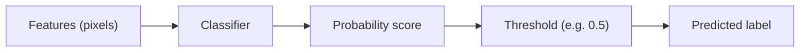

## What you'll learn

- how classification differs from regression
- why a classifier's probability output needs a threshold to become a label
- what a decision boundary is, visually
- why **accuracy** can be a misleading metric on skewed data
- binary vs multiclass classification, and a preview of OvR/OvO

## Regression vs classification

- Regression: predict a **number** (a house price, a temperature)
- Classification: predict a **label** (spam/not spam, digit 0-9)

Many classifiers don't jump straight to a label — they first estimate a probability:

- `P(class = 1 | X)`

...then apply a **threshold** (0.5 by default) to decide the final label.

*Hands-On Machine Learning* opens its classification chapter with the **MNIST**
dataset — 70,000 images of handwritten digits, each labeled 0-9. It's called the
"hello world" of classification because almost every new algorithm gets tried on it
first. We'll use a smaller, offline stand-in — scikit-learn's built-in `load_digits()`
(1,797 images) — so every example below runs without downloading anything.



## A binary classifier: "is this digit a 5?"

The book's first model is a "5-detector" — a binary classifier that only asks *is this
a 5, or not?* Here's the same idea using `load_digits()` and an `SGDClassifier`:

```python title="A binary 5-detector" showLineNumbers{1}
from sklearn.datasets import load_digits
from sklearn.model_selection import train_test_split
from sklearn.linear_model import SGDClassifier
from sklearn.metrics import accuracy_score

digits = load_digits()
X, y = digits.data, digits.target

# Binary target: True for every 5, False for everything else
y_is_five = (y == 5)

X_train, X_test, y_train, y_test = train_test_split(
    X, y_is_five, test_size=0.2, random_state=42
)

sgd_clf = SGDClassifier(random_state=42)
sgd_clf.fit(X_train, y_train)

preds = sgd_clf.predict(X_test)
print("Accuracy:", round(accuracy_score(y_test, preds), 4))
# Accuracy: 0.9861
```

## Why accuracy alone can lie to you

Only about 10% of the digits are actually 5s. Compare the classifier above to a "dumb"
model that always predicts "not a 5":

```python title="A baseline that never guesses 5" showLineNumbers{1}
from sklearn.dummy import DummyClassifier

dummy = DummyClassifier(strategy="most_frequent")
dummy.fit(X_train, y_train)
dummy_preds = dummy.predict(X_test)
print("Dummy accuracy:", round(accuracy_score(y_test, dummy_preds), 4))
# Dummy accuracy: 0.8694
```

The dummy classifier — which never detects a single real 5 — still scores **86.9%
accuracy**, just because 5s are rare. This is why accuracy is generally not the
preferred metric for classifiers, especially on skewed (imbalanced) datasets. Later
pages in this phase cover the confusion matrix, precision, recall, and ROC/AUC — the
metrics built to catch exactly this trap.

## Decision boundary intuition

A classifier learns a **boundary** through feature space that separates one class from
another. Points on one side get one label; points on the other side get the other
label. Where that boundary sits — and how it curves — is what differs between logistic
regression (a straight line), KNN (a jagged neighborhood-based boundary), SVM (a
max-margin boundary), and decision trees (axis-aligned rectangles).

```p5 title="A decision boundary separates two classes" desc="A linear boundary sweeps and rotates to separate two clusters; points are shaded by which side of the boundary they fall on." height="300"
let pts = [];
let angle = 0.15;
let offset = 0;
let t = 0;
function reset() {
  pts = [];
  for (let i = 0; i < 40; i++) {
    const c = i % 2;
    const cx = c === 0 ? 190 : 410;
    const cy = c === 0 ? 200 : 100;
    pts.push({ x: cx + random(-70, 70), y: cy + random(-60, 60), c: c });
  }
  t = 0;
}
function setup() {
  createCanvas(600, 300);
  textFont("monospace");
  reset();
}
function side(p) {
  // line direction vector from angle, passing through canvas center + offset
  const nx = Math.cos(angle), ny = Math.sin(angle);
  const cx = width / 2, cy = height / 2 + offset;
  return nx * (p.x - cx) + ny * (p.y - cy);
}
function draw() {
  background(13, 17, 23);
  const nx = Math.cos(angle), ny = Math.sin(angle);
  const cx = width / 2, cy = height / 2 + offset;
  const dx = -ny, dy = nx;
  stroke(255, 211, 67);
  strokeWeight(2.5);
  line(cx - dx * 500, cy - dy * 500, cx + dx * 500, cy + dy * 500);
  noStroke();
  let correct = 0;
  for (const p of pts) {
    const s = side(p);
    const predicted = s > 0 ? 1 : 0;
    if (predicted === p.c) correct++;
    const col = p.c === 0 ? [75, 139, 190] : [235, 140, 90];
    fill(col[0], col[1], col[2]);
    ellipse(p.x, p.y, 10, 10);
  }
  fill(200);
  textSize(12);
  textAlign(LEFT, TOP);
  text("correctly separated: " + correct + " / " + pts.length, 12, 12);
  t += 0.01;
  angle = 0.15 + Math.sin(t) * 0.35;
  offset = Math.sin(t * 0.7) * 30;
  if (t > 12) reset();
}
function mousePressed() { reset(); }
```

## Binary vs multiclass

- **binary**: 2 classes (0/1) — e.g. "is this a 5?"
- **multiclass**: 3+ classes — e.g. "which digit, 0-9?"

Some algorithms (SGD, Random Forest, Naïve Bayes) handle multiple classes natively.
Others (Logistic Regression, SVM) are strictly binary, but scikit-learn can
automatically combine several binary classifiers using:

- **One-vs-Rest (OvR)**: train one classifier per class, pick the highest score
- **One-vs-One (OvO)**: train a classifier for every pair of classes, most wins decide

You'll see both strategies again in the Logistic Regression and SVM pages.

## Common pitfalls

- class imbalance (see the dummy-classifier trap above)
- picking the wrong metric for the business problem
- data leakage via preprocessing (e.g. scaling before splitting)

:::tip[From the book]
Géron's "Never5Classifier" makes the point sharply: a model that outputs `False` for
every single image still scores over 90% accuracy on MNIST, simply because only about
10% of the digits are 5s. "Beats Nostradamus" — but it's useless. Always check a metric
that accounts for class imbalance before trusting an accuracy number.
:::

## Mini-checkpoint

Pick a real classification problem you know (spam, fraud, churn) and write down:

- the classes (labels)
- the cost of a false negative vs a false positive
- the best metric for that situation, and why

import DataCampExercise from "../../../../components/DataCampExercise.astro";

## 🧪 Try It Yourself

### Exercise 1 – Build a Binary Target

<DataCampExercise
  lang="python"
  hint={`A boolean mask like \`(y == 5)\` turns a multiclass label array into a True/False binary target.`}
  code={`# Task: Exercise 1 - Build a Binary Target
import numpy as np

y = np.array([3, 5, 5, 2, 5, 9, 1])
y_is_five = (y ___ 5)   # replace ___ with ==
print(y_is_five)

# ── Expected Output ───────────────────────────────────────────
# [False  True  True False  True False False]
# ──────────────────────────────────────────────────────────────`}
  solution={`import numpy as np

y = np.array([3, 5, 5, 2, 5, 9, 1])
y_is_five = (y == 5)
print(y_is_five)`}
  sct={`test_output_contains("False  True  True False  True False False")
success_msg("You built a binary target from a multiclass label array!")`}
  height={140}
/>

### Exercise 2 – Fit an SGDClassifier

<DataCampExercise
  lang="python"
  hint={`Call \`clf.fit(X, y)\` to train, then \`clf.predict(X_new)\` to classify new points.`}
  code={`# Task: Exercise 2 - Fit an SGDClassifier
from sklearn.linear_model import SGDClassifier
import numpy as np

X = np.array([[0, 0], [1, 1], [2, 2], [8, 8], [9, 9], [10, 10]])
y = np.array([0, 0, 0, 1, 1, 1])

clf = SGDClassifier(random_state=42)
clf.___(X, y)                 # replace ___ with fit
print(clf.predict([[9, 9]]))

# ── Expected Output ───────────────────────────────────────────
# [1]
# ──────────────────────────────────────────────────────────────`}
  solution={`from sklearn.linear_model import SGDClassifier
import numpy as np

X = np.array([[0, 0], [1, 1], [2, 2], [8, 8], [9, 9], [10, 10]])
y = np.array([0, 0, 0, 1, 1, 1])
clf = SGDClassifier(random_state=42)
clf.fit(X, y)
print(clf.predict([[9, 9]]))`}
  sct={`test_output_contains("[1]")
success_msg("The classifier correctly predicted class 1!")`}
  height={148}
/>

### Exercise 3 – Compare Against a Dummy Baseline

<DataCampExercise
  lang="python"
  hint={`\`DummyClassifier(strategy="most_frequent")\` always predicts the most common class — a useful sanity-check baseline.`}
  code={`# Task: Exercise 3 - Compare Against a Dummy Baseline
from sklearn.dummy import ___   # replace ___ with DummyClassifier
from sklearn.metrics import accuracy_score
import numpy as np

y_train = np.array([0, 0, 0, 0, 0, 0, 0, 0, 1, 1])
y_test = np.array([0, 0, 0, 1])

dummy = DummyClassifier(strategy="most_frequent")
dummy.fit(np.zeros((10, 1)), y_train)
preds = dummy.predict(np.zeros((4, 1)))
print("Dummy accuracy:", accuracy_score(y_test, preds))

# ── Expected Output ───────────────────────────────────────────
# Dummy accuracy: 0.75
# ──────────────────────────────────────────────────────────────`}
  solution={`from sklearn.dummy import DummyClassifier
from sklearn.metrics import accuracy_score
import numpy as np

y_train = np.array([0, 0, 0, 0, 0, 0, 0, 0, 1, 1])
y_test = np.array([0, 0, 0, 1])
dummy = DummyClassifier(strategy="most_frequent")
dummy.fit(np.zeros((10, 1)), y_train)
preds = dummy.predict(np.zeros((4, 1)))
print("Dummy accuracy:", accuracy_score(y_test, preds))`}
  sct={`test_output_contains("Dummy accuracy: 0.75")
success_msg("You just proved why accuracy alone can be misleading!")`}
  height={158}
/>

## Next

Continue to **Logistic Regression (Binary vs Multiclass)** to see the first real
classification algorithm — including the sigmoid function, log loss, and Softmax for
more than two classes.
