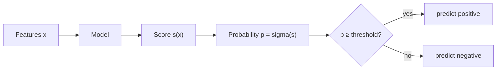

## What you'll learn

- what changes when the target becomes a label instead of a number
- the **decision boundary**, and why each algorithm can only draw certain shapes
- why every good classifier outputs a **probability**, and the threshold turns it into a label
- the **accuracy paradox**: 98% accuracy from a model that never predicts the positive class
- binary, multiclass, multilabel and multioutput — four problems that get confused
- the ten-row example this whole phase reuses

## Intuition

Regression asks *how much*. Classification asks *which one*. That sounds like a small change and
is not, because closeness stops counting. Predicting 302 when the truth is 300 is nearly right;
predicting "benign" when the truth is "malignant" is simply wrong, and how confident the model was
does not change the outcome for the patient.

Two consequences follow immediately, and they shape everything in this phase:

1. **Squared error is the wrong loss.** The distance between "cat" and "dog" is not a number.
   Classification uses log loss, hinge loss, or impurity instead.
2. **Accuracy is the wrong metric more often than you would guess.** It weighs every error the
   same, and almost no real problem does.



Note where the threshold sits: **outside the model**. Training produces the probability; the
threshold is a business decision you make afterwards, and changing it changes every metric without
retraining anything.

## Decision boundaries

A classifier partitions the feature space into regions, one per class. The surface between regions
is the **decision boundary**, and the shapes a model can draw are exactly its capacity.

<Figure
  src="/images/ml/phase-04-classification/introduction-to-classification/boundaries-three-models"
  alt="Three panels showing the same two-moons dataset classified by logistic regression with a straight boundary, KNN with a wobbly local boundary, and a decision tree with rectangular step boundaries."
  title="Three classifiers, one dataset"
  caption="Logistic regression can only draw a straight line, so it cannot separate two interleaved crescents. KNN follows the data. The tree can only cut parallel to the axes, giving staircase edges."
/>

### Reading the plot

- **Logistic regression** manages 0.85 on this data and cannot do better, because no single
  straight line separates two interleaved crescents. That is a *bias* limitation, not a tuning
  problem.
- **KNN** traces the actual shape and reaches 0.96 — but look at the small islands near the
  boundary, each one caused by a handful of points.
- **The tree** scores 0.99 with a completely different geometry: every edge is parallel to an axis,
  because every split is a threshold on one feature. That near-perfect training score should also
  make you suspicious, and
  [Decision Trees](/machine-learning/phase-04---supervised-learning---classification/decision-trees-entropy-and-gini-impurity/)
  explains why.

None of these is "the best classifier". They are three different assumptions about what a boundary
is allowed to look like.

## The accuracy paradox

<Figure
  src="/images/ml/phase-04-classification/introduction-to-classification/accuracy-paradox"
  alt="Left panel: a scatter with 980 blue negative points and 20 amber positive points. Right panel: a bar chart showing 0.98 accuracy and 0.00 recall for an always-negative model, against 0.98 accuracy and 0.20 recall for logistic regression."
  title="98% accurate, and completely useless"
  caption="With a 2% positive rate, a model that always predicts 'negative' scores 0.98. Logistic regression scores 0.984 — barely different — while finding only one positive in five."
/>

This is not a contrived example; it is fraud detection, disease screening, defect inspection, and
churn prediction. Whenever the interesting class is rare, accuracy is dominated by the boring class
and stops carrying information.

```python title="accuracy_paradox.py" showLineNumbers{1}
import numpy as np
from sklearn.dummy import DummyClassifier
from sklearn.linear_model import LogisticRegression
from sklearn.metrics import accuracy_score, recall_score

rng = np.random.default_rng(7)
n, positive_rate = 1000, 0.02
n_pos = int(n * positive_rate)

X = np.vstack([rng.normal(0, 1, (n - n_pos, 2)), rng.normal(1.6, 1.1, (n_pos, 2))])
y = np.r_[np.zeros(n - n_pos, dtype=int), np.ones(n_pos, dtype=int)]

for name, model in [
    ("always negative", DummyClassifier(strategy="most_frequent")),
    ("logistic regression", LogisticRegression()),
]:
    model.fit(X, y)
    pred = model.predict(X)
    print(f"{name:<20} accuracy {accuracy_score(y, pred):.4f}"
          f"   recall {recall_score(y, pred, zero_division=0):.4f}")

# always negative      accuracy 0.9800   recall 0.0000
# logistic regression  accuracy 0.9840   recall 0.2000
```

**Always compute the `DummyClassifier` score first.** If your model's accuracy is close to it, the
accuracy number is telling you about the class balance, not about your model.

### See it move

The sketch sweeps the positive rate from 50% down to 0.5% and reports two models on 1,000 rows: a
`DummyClassifier` that always says negative, and a detector that catches 20% of positives with a 1%
false-positive rate. Watch which metrics notice the difference between them.

```p5 title="Accuracy stops carrying information as the class gets rare" desc="Positive rate sweeps from balanced to rare. The always-negative model's accuracy climbs toward 0.995 while its recall stays flat at zero, and the accuracy gap between it and a real detector shrinks to nothing. Balanced accuracy and recall keep separating the two. Click to pause." height="400"
const N = 1000;
const TPR = 0.2;   // the detector catches one positive in five
const FPR = 0.01;  // and misfires on one negative in a hundred
let rate = 0.5;
let dir = -1;
let paused = false;

function setup() {
  createCanvas(620, 400);
  textFont("monospace");
}
function metrics(tp, fp, fn, tn) {
  const acc = (tp + tn) / N;
  const rec = tp + fn > 0 ? tp / (tp + fn) : 0;
  const spec = tn + fp > 0 ? tn / (tn + fp) : 0;
  const prec = tp + fp > 0 ? tp / (tp + fp) : 0;
  return { acc: acc, rec: rec, bal: (rec + spec) / 2, prec: prec };
}
function draw() {
  background(13, 17, 23);
  const pos = Math.max(1, Math.round(N * rate));
  const neg = N - pos;

  // always-negative
  const d = metrics(0, 0, pos, neg);
  // detector
  const tp = Math.round(pos * TPR);
  const fp = Math.round(neg * FPR);
  const m = metrics(tp, fp, pos - tp, neg - fp);

  fill(215);
  textSize(13);
  textAlign(LEFT, TOP);
  text("positive rate " + (100 * rate).toFixed(1) + "%   ->   " + pos + " positives, " + neg + " negatives", 62, 14);

  const rows = [
    ["accuracy", d.acc, m.acc],
    ["recall", d.rec, m.rec],
    ["precision", d.prec, m.prec],
    ["balanced accuracy", d.bal, m.bal],
  ];
  const barX = 250, maxBar = 260;
  for (let i = 0; i < rows.length; i++) {
    const [label, dv, mv] = rows[i];
    const y = 60 + i * 66;
    fill(150);
    textSize(11);
    textAlign(RIGHT, TOP);
    text(label, barX - 12, y + 6);

    fill(120, 130, 145);
    rect(barX, y, dv * maxBar, 14);
    fill(200);
    textSize(10);
    textAlign(LEFT, CENTER);
    text(dv.toFixed(4) + "  always negative", barX + dv * maxBar + 6, y + 7);

    fill(255, 176, 67);
    rect(barX, y + 20, mv * maxBar, 14);
    fill(200);
    text(mv.toFixed(4) + "  detector", barX + mv * maxBar + 6, y + 27);

    const gap = mv - dv;
    fill(Math.abs(gap) < 0.02 ? color(232, 122, 122) : color(120, 200, 120));
    textSize(10);
    textAlign(RIGHT, TOP);
    text("gap " + (gap >= 0 ? "+" : "") + gap.toFixed(4), width - 20, y + 6);
  }

  fill(105);
  textSize(10);
  textAlign(LEFT, TOP);
  text("red gap = this metric cannot tell the two models apart", 62, 336);
  text("the detector is unchanged throughout: TPR 0.20, FPR 0.01", 62, 352);
  text(paused ? "click to resume" : "click to pause", 62, 372);

  if (!paused) {
    // sweep on a log scale so the rare end gets the attention
    const u = Math.log(rate);
    const next = u + 0.006 * dir;
    rate = Math.exp(next);
    if (rate < 0.005 || rate > 0.5) dir *= -1;
    rate = constrain(rate, 0.005, 0.5);
  }
}
function mousePressed() { paused = !paused; }
```

The accuracy row is the one to watch, and it does something worse than going flat:

| Positive rate | Always-negative accuracy | Detector accuracy | Accuracy prefers |
| --- | --- | --- | --- |
| 50% | 0.5000 | 0.5950 | the detector, by 0.095 |
| 2% | 0.9800 | 0.9740 | **the useless model**, by 0.006 |
| 0.5% | 0.9950 | 0.9860 | **the useless model**, by 0.009 |

Once positives are rare, the detector's ten false positives cost more accuracy than its one true
positive earns, so accuracy ranks the model that finds nothing *above* the model that finds
something. Recall reads 0.0000 against 0.2000 at every row of that table — exactly as
distinguishable at 0.5% as at 50%. Rarity does not make the models more similar; it makes accuracy
stop measuring them, and then quietly reverses the ranking.

## The ten-row example

Phase 4 reuses one small prediction set across all four evaluation pages, so the arithmetic stays
comparable. Ten emails, ranked by the model's estimated probability of being spam:

| # | true label | score | at threshold 0.5 | outcome |
| --- | --- | --- | --- | --- |
| 1 | spam | 0.95 | spam | true positive |
| 2 | spam | 0.88 | spam | true positive |
| 3 | spam | 0.76 | spam | true positive |
| 4 | not spam | 0.70 | spam | **false positive** |
| 5 | not spam | 0.62 | spam | **false positive** |
| 6 | spam | 0.58 | spam | true positive |
| 7 | spam | 0.31 | not spam | **false negative** |
| 8 | not spam | 0.24 | not spam | true negative |
| 9 | not spam | 0.13 | not spam | true negative |
| 10 | not spam | 0.05 | not spam | true negative |

Counting the outcomes gives TP = 4, FP = 2, FN = 1, TN = 3, and from those five numbers every
metric in this phase follows:

$$
\text{accuracy} = \frac{4+3}{10} = 0.70,
\qquad
\text{precision} = \frac{4}{4+2} \approx 0.667,
\qquad
\text{recall} = \frac{4}{4+1} = 0.80
$$

Three different numbers describing one set of predictions. Reporting only the first would be
technically true and practically misleading.

## Four kinds of classification problem

| Problem | Labels per instance | Example | scikit-learn |
| --- | --- | --- | --- |
| **Binary** | 1, from 2 classes | spam / not spam | Any classifier |
| **Multiclass** | 1, from $k$ classes | which digit, 0–9 | Most support it natively |
| **Multilabel** | any number, from $k$ | tags on a photo | `MultiOutputClassifier`, or a native model |
| **Multioutput** | several, each multiclass | denoise every pixel | `MultiOutputClassifier` |

The distinction that trips people up is multiclass versus multilabel. Multiclass classes are
**mutually exclusive** — a digit cannot be both a 3 and a 7. Multilabel classes are not — a photo
can contain a dog *and* a beach. Softmax is for the first; independent sigmoids are for the second,
and using softmax on a multilabel problem quietly forces the labels to compete.

## A first classifier, end to end

```python title="first_classifier.py" showLineNumbers{1}
from sklearn.datasets import load_breast_cancer
from sklearn.dummy import DummyClassifier
from sklearn.linear_model import LogisticRegression
from sklearn.model_selection import train_test_split
from sklearn.pipeline import make_pipeline
from sklearn.preprocessing import StandardScaler

X, y = load_breast_cancer(return_X_y=True)
y = 1 - y                      # flip so 1 = malignant, the class we want to catch

X_train, X_test, y_train, y_test = train_test_split(
    X, y, test_size=0.3, random_state=0, stratify=y      # stratify keeps the ratio
)

baseline = DummyClassifier(strategy="most_frequent").fit(X_train, y_train)
model = make_pipeline(
    StandardScaler(), LogisticRegression(max_iter=5000)
).fit(X_train, y_train)

print(f"baseline accuracy = {baseline.score(X_test, y_test):.4f}")  # 0.6257
print(f"model accuracy    = {model.score(X_test, y_test):.4f}")     # 0.9532

proba = model.predict_proba(X_test)[:, 1]
print(f"first five probabilities: {proba[:5].round(3)}")
```

Two details that matter more than they look:

- **`stratify=y`** keeps the class ratio identical in both splits. Without it, a random split of an
  imbalanced dataset can put almost every positive case on one side.
- **`predict_proba`** is the real output. `predict` is just `predict_proba() >= 0.5`, and that 0.5
  is a default nobody chose for your problem.

## Pitfalls

:::danger[Reporting accuracy on an imbalanced problem]
If 98% of rows are negative, 98% accuracy is the floor, not an achievement. Report precision,
recall, and the confusion matrix, and always alongside a `DummyClassifier`.
:::

:::caution[Forgetting to stratify the split]
On a dataset with 20 positives out of 1,000, an unstratified 70/30 split can leave 3 positives in
the test set. Every metric computed on them is noise. Pass `stratify=y`.
:::

:::caution[Treating 0.5 as sacred]
The default threshold is an arbitrary convention. In screening you lower it to catch more cases; in
automated blocking you raise it to avoid false accusations.
[Precision, Recall, and F1-Score](/machine-learning/phase-04---supervised-learning---classification/precision-recall-and-f1-score/)
shows how to choose it deliberately.
:::

:::caution[Softmax on a multilabel problem]
Softmax forces the outputs to sum to 1, so labels compete. If an instance can genuinely carry two
labels at once, use one independent sigmoid per label instead.
:::

<Quiz
  questions={[
    {
      q: "Why is squared error a poor loss function for classification?",
      options: [
        "It is too slow to compute",
        "The distance between two class labels is not a meaningful number, and squared error assumes it is",
        "It only works for positive targets",
        "It cannot be differentiated",
      ],
      answer: 1,
      explain: "Squared error measures how far off you were on a numeric scale. Class labels have no such scale — being 'two classes off' means nothing.",
    },
    {
      q: "A model scores 98% accuracy on a dataset where 98% of rows are negative. What should you check first?",
      options: [
        "Whether the learning rate is too high",
        "Its recall on the positive class, and the score of a DummyClassifier",
        "Whether the features are scaled",
        "Nothing — 98% is a strong result",
      ],
      answer: 1,
      explain: "A constant 'always negative' predictor also scores 98%. Recall on the positive class reveals whether the model found anything at all.",
    },
    {
      q: "Where does the decision threshold live?",
      options: [
        "Inside the model, fixed during training",
        "Outside the model — training produces a probability, and the threshold converts it to a label afterwards",
        "In the loss function",
        "It is determined by the class balance automatically",
      ],
      answer: 1,
      explain: "predict() is just predict_proba() compared against 0.5. You can move that number at any time, with no retraining, and every metric changes.",
    },
    {
      q: "Tagging a photo with both 'dog' and 'beach' is which kind of problem?",
      options: ["Binary", "Multiclass", "Multilabel", "Multioutput"],
      answer: 2,
      explain: "Multiple non-exclusive labels per instance is multilabel. Multiclass would force you to choose either dog or beach; softmax makes the labels compete, so use independent sigmoids.",
    },
  ]}
/>

## 🧪 Try It Yourself

### Exercise 1 – Build a binary target

<DataCampExercise
  lang="python"
  hint={`Comparing an array to a value gives booleans; .astype(int) turns them into 0 and 1.`}
  code={`# Task: Exercise 1 - Build a binary target
import numpy as np
from sklearn.datasets import load_iris

iris = load_iris()
y_virginica = (iris.target == 2).___(int)   # replace ___ with astype

print("positives:", int(y_virginica.sum()))
print("negatives:", int((y_virginica == 0).sum()))
print("positive rate:", round(y_virginica.mean(), 3))

# -- Expected Output -------------------------------------------
# positives: 50
# negatives: 100
# positive rate: 0.333
# --------------------------------------------------------------`}
  solution={`import numpy as np
from sklearn.datasets import load_iris

iris = load_iris()
y_virginica = (iris.target == 2).astype(int)
print("positives:", int(y_virginica.sum()))
print("negatives:", int((y_virginica == 0).sum()))
print("positive rate:", round(y_virginica.mean(), 3))`}
  sct={`test_output_contains("positive rate: 0.333")
success_msg("One-versus-rest: a multiclass problem turned into a binary one.")`}
  height={168}
/>

### Exercise 2 – Count the four outcomes by hand

<DataCampExercise
  lang="python"
  hint={`A true positive is a row where both the truth and the prediction are 1.`}
  code={`# Task: Exercise 2 - Count the four outcomes by hand
import numpy as np

y = np.array([1, 1, 1, 0, 0, 1, 1, 0, 0, 0])
scores = np.array([0.95, 0.88, 0.76, 0.70, 0.62, 0.58, 0.31, 0.24, 0.13, 0.05])
pred = (scores >= 0.5).astype(int)

tp = int(((y == 1) & (pred == 1)).sum())
fp = int(((y == 0) & (pred == 1)).sum())
fn = int(((y == 1) & (pred == ___)).sum())   # replace ___ with 0
tn = int(((y == 0) & (pred == 0)).sum())

print(f"TP={tp} FP={fp} FN={fn} TN={tn}")
print("accuracy:", (tp + tn) / len(y))

# -- Expected Output -------------------------------------------
# TP=4 FP=2 FN=1 TN=3
# accuracy: 0.7
# --------------------------------------------------------------`}
  solution={`import numpy as np

y = np.array([1, 1, 1, 0, 0, 1, 1, 0, 0, 0])
scores = np.array([0.95, 0.88, 0.76, 0.70, 0.62, 0.58, 0.31, 0.24, 0.13, 0.05])
pred = (scores >= 0.5).astype(int)
tp = int(((y == 1) & (pred == 1)).sum())
fp = int(((y == 0) & (pred == 1)).sum())
fn = int(((y == 1) & (pred == 0)).sum())
tn = int(((y == 0) & (pred == 0)).sum())
print(f"TP={tp} FP={fp} FN={fn} TN={tn}")
print("accuracy:", (tp + tn) / len(y))`}
  sct={`test_output_contains("TP=4 FP=2 FN=1 TN=3")
success_msg("Those four counts generate every metric in this phase.")`}
  height={198}
/>

### Exercise 3 – Beat the dummy baseline

<DataCampExercise
  lang="python"
  hint={`DummyClassifier(strategy="most_frequent") always predicts the majority class.`}
  code={`# Task: Exercise 3 - Beat the dummy baseline
from sklearn.datasets import load_breast_cancer
from sklearn.dummy import ___              # replace ___ with DummyClassifier
from sklearn.linear_model import LogisticRegression
from sklearn.model_selection import train_test_split
from sklearn.pipeline import make_pipeline
from sklearn.preprocessing import StandardScaler

X, y = load_breast_cancer(return_X_y=True)
y = 1 - y
X_tr, X_te, y_tr, y_te = train_test_split(X, y, test_size=0.3,
                                          random_state=0, stratify=y)

base = DummyClassifier(strategy="most_frequent").fit(X_tr, y_tr)
model = make_pipeline(StandardScaler(),
                      LogisticRegression(max_iter=5000)).fit(X_tr, y_tr)

print("baseline:", round(base.score(X_te, y_te), 4))
print("model:", round(model.score(X_te, y_te), 4))

# -- Expected Output -------------------------------------------
# baseline: 0.6257
# model: 0.9532
# --------------------------------------------------------------`}
  solution={`from sklearn.datasets import load_breast_cancer
from sklearn.dummy import DummyClassifier
from sklearn.linear_model import LogisticRegression
from sklearn.model_selection import train_test_split
from sklearn.pipeline import make_pipeline
from sklearn.preprocessing import StandardScaler

X, y = load_breast_cancer(return_X_y=True)
y = 1 - y
X_tr, X_te, y_tr, y_te = train_test_split(X, y, test_size=0.3,
                                          random_state=0, stratify=y)
base = DummyClassifier(strategy="most_frequent").fit(X_tr, y_tr)
model = make_pipeline(StandardScaler(),
                      LogisticRegression(max_iter=5000)).fit(X_tr, y_tr)
print("baseline:", round(base.score(X_te, y_te), 4))
print("model:", round(model.score(X_te, y_te), 4))`}
  sct={`test_output_contains("model: 0.9532")
success_msg("A 33-point gain over the baseline is a real result.")`}
  height={208}
/>

### Exercise 4 – Probabilities, not labels

<DataCampExercise
  lang="python"
  hint={`predict_proba returns one column per class; column 1 is the positive class.`}
  code={`# Task: Exercise 4 - Probabilities, not labels
import numpy as np
from sklearn.datasets import load_breast_cancer
from sklearn.linear_model import LogisticRegression
from sklearn.model_selection import train_test_split
from sklearn.pipeline import make_pipeline
from sklearn.preprocessing import StandardScaler

X, y = load_breast_cancer(return_X_y=True)
y = 1 - y
X_tr, X_te, y_tr, y_te = train_test_split(X, y, test_size=0.3,
                                          random_state=0, stratify=y)
model = make_pipeline(StandardScaler(),
                      LogisticRegression(max_iter=5000)).fit(X_tr, y_tr)

proba = model.___(X_te)[:, 1]              # replace ___ with predict_proba
manual = (proba >= 0.5).astype(int)

print("same as predict():", bool(np.array_equal(manual, model.predict(X_te))))
print("uncertain rows (0.3 to 0.7):", int(((proba > 0.3) & (proba < 0.7)).sum()))

# -- Expected Output -------------------------------------------
# same as predict(): True
# uncertain rows (0.3 to 0.7): 12
# --------------------------------------------------------------`}
  solution={`import numpy as np
from sklearn.datasets import load_breast_cancer
from sklearn.linear_model import LogisticRegression
from sklearn.model_selection import train_test_split
from sklearn.pipeline import make_pipeline
from sklearn.preprocessing import StandardScaler

X, y = load_breast_cancer(return_X_y=True)
y = 1 - y
X_tr, X_te, y_tr, y_te = train_test_split(X, y, test_size=0.3,
                                          random_state=0, stratify=y)
model = make_pipeline(StandardScaler(),
                      LogisticRegression(max_iter=5000)).fit(X_tr, y_tr)
proba = model.predict_proba(X_te)[:, 1]
manual = (proba >= 0.5).astype(int)
print("same as predict():", bool(np.array_equal(manual, model.predict(X_te))))
print("uncertain rows (0.3 to 0.7):", int(((proba > 0.3) & (proba < 0.7)).sum()))`}
  sct={`test_output_contains("same as predict(): True")
success_msg("predict() is nothing more than a threshold applied to predict_proba().")`}
  height={228}
/>

### Exercise 5 – Watch the accuracy paradox appear

<DataCampExercise
  lang="python"
  hint={`Sweep the positive rate and record accuracy of a constant negative predictor.`}
  code={`# Task: Exercise 5 - Watch the accuracy paradox appear
import numpy as np

y_sizes = [0.50, 0.20, 0.05, 0.01]

for rate in y_sizes:
    n = 1000
    n_pos = int(n * rate)
    y = np.r_[np.zeros(n - n_pos, dtype=int), np.ones(n_pos, dtype=int)]
    always_negative = np.zeros(n, dtype=int)
    acc = (always_negative == y).___()         # replace ___ with mean
    print(f"positive rate {rate:.2f} -> constant-model accuracy {acc:.3f}")

# -- Expected Output -------------------------------------------
# positive rate 0.50 -> constant-model accuracy 0.500
# positive rate 0.20 -> constant-model accuracy 0.800
# positive rate 0.05 -> constant-model accuracy 0.950
# positive rate 0.01 -> constant-model accuracy 0.990
# --------------------------------------------------------------`}
  solution={`import numpy as np

y_sizes = [0.50, 0.20, 0.05, 0.01]

for rate in y_sizes:
    n = 1000
    n_pos = int(n * rate)
    y = np.r_[np.zeros(n - n_pos, dtype=int), np.ones(n_pos, dtype=int)]
    always_negative = np.zeros(n, dtype=int)
    acc = (always_negative == y).mean()
    print(f"positive rate {rate:.2f} -> constant-model accuracy {acc:.3f}")`}
  sct={`test_output_contains("0.990")
success_msg("The rarer the positive class, the more meaningless accuracy becomes.")`}
  height={228}
/>

## Recap

- Classification predicts a label; closeness stops counting, so squared error is replaced by
  log loss, hinge loss or impurity.
- The decision boundary is the model's signature — straight for logistic regression, local for KNN,
  axis-aligned steps for a tree.
- Models produce probabilities. `predict()` applies a threshold of 0.5, and that threshold is
  yours to change.
- With a 2% positive rate, "always negative" scores 0.98 accuracy and 0.00 recall. Always compare
  against `DummyClassifier`.
- The ten-row example gives TP = 4, FP = 2, FN = 1, TN = 3 — accuracy 0.70, precision 0.667,
  recall 0.80.
- Multiclass labels are mutually exclusive; multilabel ones are not.

### Exercise 6 – Find the prevalence where accuracy inverts

<DataCampExercise
  lang="python"
  hint={`The always-negative model's accuracy is just the share of negatives. The detector's is (TP + TN) / n.`}
  code={`# Task: Exercise 6 - Find the prevalence where accuracy inverts
n = 1000
tpr, fpr = 0.20, 0.01          # the detector: catches 1 in 5, misfires on 1 in 100

print(f"{'positives':>10} {'dummy acc':>10} {'model acc':>10} {'accuracy prefers':>18}")
for rate in (0.50, 0.20, 0.05, 0.02, 0.005):
    pos = max(1, round(n * rate))
    neg = n - pos
    dummy = ___ / n                       # replace ___ with neg
    tp = round(pos * tpr)
    fp = round(neg * fpr)
    model = (tp + (neg - fp)) / n
    if model > dummy:
        prefers = "the detector"
    elif model == dummy:
        prefers = "a tie"
    else:
        prefers = "the useless model"
    print(f"{pos:10d} {dummy:10.4f} {model:10.4f} {prefers:>18}")
print("recall is 0.0000 against 0.2000 in every row, whatever accuracy says")

# -- Expected Output -------------------------------------------
#  positives  dummy acc  model acc   accuracy prefers
#        500     0.5000     0.5950       the detector
#        200     0.8000     0.8320       the detector
#         50     0.9500     0.9500              a tie
#         20     0.9800     0.9740  the useless model
#          5     0.9950     0.9860  the useless model
# recall is 0.0000 against 0.2000 in every row, whatever accuracy says
# --------------------------------------------------------------`}
  solution={`n = 1000
tpr, fpr = 0.20, 0.01

print(f"{'positives':>10} {'dummy acc':>10} {'model acc':>10} {'accuracy prefers':>18}")
for rate in (0.50, 0.20, 0.05, 0.02, 0.005):
    pos = max(1, round(n * rate))
    neg = n - pos
    dummy = neg / n
    tp = round(pos * tpr)
    fp = round(neg * fpr)
    model = (tp + (neg - fp)) / n
    if model > dummy:
        prefers = "the detector"
    elif model == dummy:
        prefers = "a tie"
    else:
        prefers = "the useless model"
    print(f"{pos:10d} {dummy:10.4f} {model:10.4f} {prefers:>18}")
print("recall is 0.0000 against 0.2000 in every row, whatever accuracy says")`}
  sct={`test_output_contains("a tie")
success_msg("The inversion happens at a 5% positive rate on these numbers. Below it, accuracy ranks a model that finds nothing above one that finds something — and it does so correctly, which is why accuracy is the wrong objective rather than a broken one.")`}
  height={330}
/>

## Next

Continue to
[Logistic Regression (Binary vs Multiclass)](/machine-learning/phase-04---supervised-learning---classification/logistic-regression-binary-vs-multiclass/)
— the classifier that produces those probabilities, derived from the linear model of Phase 3.
