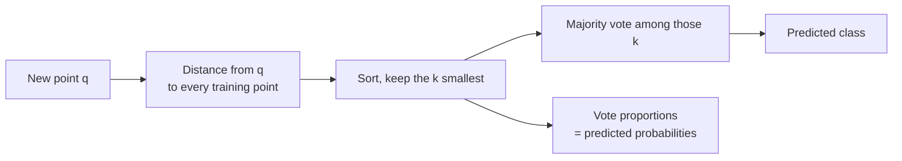

import DataCampExercise from "../../../../components/DataCampExercise.astro";
import AlgorithmCard from "../../../../components/AlgorithmCard.astro";
import Figure from "../../../../components/Figure.astro";
import Quiz from "../../../../components/Quiz.astro";

## What you'll learn

- how a model with **no training step** still makes predictions
- Euclidean, Manhattan and Minkowski distance, and when the choice matters
- a full $k = 1, 3, 5$ prediction worked **by hand** on six points — where each $k$ gives a different answer
- why $k$ is a bias-variance dial, and how to pick it
- why unscaled features destroy KNN more completely than any other model
- the **curse of dimensionality**, measured rather than asserted

## Intuition

Every other model in this phase compresses the training data into parameters and then discards the
data. KNN does the opposite: it stores everything and does all its work at prediction time. Asked
to classify a new point, it finds the $k$ closest training points and takes a vote.

That makes it a **lazy learner** — `fit()` is essentially a memory copy — and it inverts the usual
cost profile. Training is instant; prediction is expensive, and gets more expensive as the dataset
grows.



## The math

### Distance

The default is **Euclidean** distance, the straight line between two points:

$$
d(\mathbf{a}, \mathbf{b}) = \sqrt{\sum_{j=1}^{n}\left(a_j - b_j\right)^2}
$$

It is one case of the **Minkowski** family, parameterised by $p$:

$$
d_p(\mathbf{a}, \mathbf{b}) = \left(\sum_{j=1}^{n}\left\lvert a_j - b_j\right\rvert^{p}\right)^{1/p}
$$

| $p$ | Name | Behaviour |
| --- | --- | --- |
| 1 | Manhattan | Sum of axis-wise distances; robust to one wild coordinate |
| 2 | Euclidean | Straight line; the default |
| $\infty$ | Chebyshev | The single largest coordinate difference |

scikit-learn exposes this as `metric="minkowski", p=2`. On high-dimensional data $p = 1$ often
works better, because Euclidean distances concentrate — see the measurement below.

:::note[Where this comes from]
These are the $\ell_p$ norms of the difference vector, developed in
[Norms](/mathematics-for-machine-learning/chapter-03---analytic-geometry/norms/)
and
[Lengths and Distances](/mathematics-for-machine-learning/chapter-03---analytic-geometry/lengths-and-distances/).
The same $\ell_1$ versus $\ell_2$ distinction that made
[Lasso select features](/machine-learning/phase-03---supervised-learning---regression/regularization-ridge-and-lasso-regression/)
appears here as a choice of distance.
:::

### The prediction rule

$$
\hat{y}(\mathbf{q}) = \operatorname*{arg\,max}_{c}\;\sum_{i \in N_k(\mathbf{q})} \mathbb{1}\!\left[y^{(i)} = c\right]
$$

where $N_k(\mathbf{q})$ is the set of indices of the $k$ closest training points. The class
proportions inside that set are the predicted probabilities — which is why KNN probabilities come
in steps of $1/k$ and are coarse for small $k$.

With `weights="distance"` each neighbour instead votes with weight $1/d$, so closer points count
for more and exact ties become rare.

## Worked example by hand

Six training points, two features, two classes. Classify the query $\mathbf{q} = (4, 4)$.

| point | $x_1$ | $x_2$ | class | $\Delta x_1$ | $\Delta x_2$ | $d = \sqrt{\Delta x_1^2 + \Delta x_2^2}$ |
| --- | --- | --- | --- | --- | --- | --- |
| A | 1 | 1 | 0 | −3 | −3 | $\sqrt{18} = 4.243$ |
| B | 2 | 2 | 0 | −2 | −2 | $\sqrt{8} = 2.828$ |
| C | 3 | 3 | 0 | −1 | −1 | $\sqrt{2} = 1.414$ |
| D | 4 | 5 | 1 | 0 | +1 | $\sqrt{1} = 1.000$ |
| E | 6 | 5 | 1 | +2 | +1 | $\sqrt{5} = 2.236$ |
| F | 7 | 7 | 1 | +3 | +3 | $\sqrt{18} = 4.243$ |

**Step 1 — rank by distance.**

$$
\text{D}\,(1.000) \prec \text{C}\,(1.414) \prec \text{E}\,(2.236) \prec \text{B}\,(2.828) \prec \text{A} = \text{F}\,(4.243)
$$

**Step 2 — vote, for three values of $k$.**

| $k$ | Neighbours | Votes | Prediction | $P(\text{class } 1)$ |
| --- | --- | --- | --- | --- |
| 1 | D | 1 → class 1 | **1** | 1.00 |
| 3 | D, C, E | 2 → class 1, 1 → class 0 | **1** | 0.67 |
| 5 | D, C, E, B, A | 2 → class 1, 3 → class 0 | **0** | 0.40 |

**The same query, the same data, and $k$ flips the answer.** With $k = 1$ the nearest point decides
everything; by $k = 5$ the vote has reached back into the cluster of class-0 points and reversed the
verdict. This is not a pathological example — it is ordinary behaviour near a boundary, and it is
exactly why $k$ must be cross-validated rather than guessed.

## Choosing k

<Figure
  src="/images/ml/phase-04-classification/knn/k-effect"
  alt="Three panels of the same two-moons dataset with KNN decision boundaries at k equals 1, 15 and 101. The k=1 boundary is jagged with isolated islands, k=15 is smooth and follows the crescents, and k=101 is nearly a straight line."
  title="k = 1, 15 and 101 on identical data"
  caption="k = 1 carves an island around every noisy point. k = 101 averages over so many neighbours that the crescent structure disappears entirely."
/>

<Figure
  src="/images/ml/phase-04-classification/knn/error-vs-k"
  alt="Training accuracy and cross-validated accuracy plotted against k. Training accuracy starts at 1.0 for k=1 and declines; CV accuracy rises to a peak then slowly falls."
  title="Training accuracy lies about k = 1"
  caption="At k = 1 every training point is its own nearest neighbour, so training accuracy is a guaranteed 1.00. Cross-validation tells the truth: 0.89 at k = 1, peaking at 0.93 around k = 11."
/>

### Reading the plot

1. **Training accuracy at $k = 1$ is always exactly 1.0.** Each point retrieves itself, at distance
   zero. This is the cleanest demonstration in the curriculum that a training score can be
   structurally meaningless.
2. **The CV curve peaks and then declines.** Small $k$ is high variance, large $k$ is high bias, and
   the peak is the trade.
3. **The peak is broad.** Anything from roughly 7 to 21 performs within noise of the best here.
   Choose from the middle of the plateau rather than the exact argmax.

Two rules of thumb, neither of which replaces cross-validation:

- Use an **odd $k$** for binary problems so a majority always exists.
- $k \approx \sqrt{m}$ is a reasonable starting point ($\sqrt{300} \approx 17$ here).

### See it move

Move the mouse to place a query point. The sketch draws a circle out to its $k$-th nearest neighbour,
connects the voting neighbours, and tallies the vote — so you can see the prediction change as the
circle swallows one more point. The background is the full decision boundary at the current $k$,
recomputed on a grid.

```p5 title="The k-th neighbour circle and the vote it produces" desc="A query point follows the mouse across a two-class scatter. Lines connect it to its k nearest neighbours and a circle marks the k-th distance; the tally shows the vote. Scroll the k value with a click and watch small k produce islands in the background boundary while large k erases the structure." height="420"
const KS = [1, 3, 5, 11, 25, 61];
let kIndex = 2;
let pts = [];
let grid = [];
let qx = 300, qy = 200;

function lcg(seed) {
  let s = seed;
  return function () {
    s = (s * 1103515245 + 12345) % 2147483648;
    return s / 2147483648;
  };
}
function setup() {
  createCanvas(620, 420);
  textFont("monospace");
  const rnd = lcg(11);
  // two interleaved crescents plus label noise
  for (let i = 0; i < 90; i++) {
    const t = (i / 90) * PI;
    let cls = i % 2;
    let x, y;
    if (cls === 0) { x = 210 + cos(t) * 140; y = 230 - sin(t) * 110; }
    else { x = 350 - cos(t) * 140; y = 150 + sin(t) * 110; }
    x += (rnd() - 0.5) * 46;
    y += (rnd() - 0.5) * 46;
    if (rnd() < 0.08) cls = 1 - cls;           // 8% label noise
    pts.push({ x: x, y: y, cls: cls });
  }
  rebuild();
}
function classify(x, y, k) {
  const d = pts.map((p) => [(p.x - x) ** 2 + (p.y - y) ** 2, p.cls]);
  d.sort((a, b) => a[0] - b[0]);
  let ones = 0;
  for (let i = 0; i < k; i++) ones += d[i][1];
  return { cls: ones * 2 > k ? 1 : 0, ones: ones, zeros: k - ones, radius: Math.sqrt(d[k - 1][0]), near: d.slice(0, k) };
}
function rebuild() {
  const k = KS[kIndex];
  grid = [];
  for (let gx = 20; gx < 600; gx += 14) {
    for (let gy = 20; gy < 330; gy += 14) {
      grid.push([gx, gy, classify(gx, gy, k).cls]);
    }
  }
}
function draw() {
  background(13, 17, 23);
  const k = KS[kIndex];

  // decision surface
  noStroke();
  for (const [gx, gy, c] of grid) {
    fill(c === 1 ? color(255, 176, 67, 34) : color(75, 139, 190, 34));
    rect(gx - 7, gy - 7, 14, 14);
  }

  // data
  for (const p of pts) {
    fill(p.cls === 1 ? color(255, 176, 67) : color(75, 139, 190));
    ellipse(p.x, p.y, 8, 8);
  }

  // query point and its neighbourhood
  const q = classify(qx, qy, k);
  noFill();
  stroke(200, 200, 200, 120);
  strokeWeight(1);
  ellipse(qx, qy, q.radius * 2, q.radius * 2);
  // redraw neighbour links by finding them again in coordinate space
  const d = pts.map((p, i) => [(p.x - qx) ** 2 + (p.y - qy) ** 2, i]);
  d.sort((a, b) => a[0] - b[0]);
  for (let i = 0; i < k; i++) {
    const p = pts[d[i][1]];
    stroke(p.cls === 1 ? color(255, 176, 67, 150) : color(75, 139, 190, 150));
    line(qx, qy, p.x, p.y);
  }
  noStroke();
  fill(q.cls === 1 ? color(255, 176, 67) : color(75, 139, 190));
  ellipse(qx, qy, 15, 15);
  stroke(235);
  strokeWeight(2);
  noFill();
  ellipse(qx, qy, 19, 19);
  noStroke();

  // readout
  fill(215);
  textSize(13);
  textAlign(LEFT, TOP);
  text("k = " + k, 20, 348);
  fill(75, 139, 190);
  textSize(12);
  text("class 0 votes: " + q.zeros, 20, 368);
  fill(255, 176, 67);
  text("class 1 votes: " + q.ones, 20, 386);
  fill(215);
  textAlign(LEFT, TOP);
  text("prediction: class " + q.cls + "   (margin " + Math.abs(q.ones - q.zeros) + " votes)", 200, 368);
  fill(105);
  textSize(10);
  text("k-th neighbour distance: " + q.radius.toFixed(1) + " px", 200, 388);
  textAlign(RIGHT, TOP);
  text("click to step k through 1, 3, 5, 11, 25, 61", width - 20, 348);
  fill(Math.abs(q.ones - q.zeros) <= 1 ? color(232, 122, 122) : color(120, 200, 120));
  textSize(10);
  textAlign(RIGHT, TOP);
  text(Math.abs(q.ones - q.zeros) <= 1 ? "one vote from flipping" : "comfortable majority", width - 20, 368);
}
function mouseMoved() {
  if (mouseY < 335) { qx = mouseX; qy = mouseY; }
}
function mousePressed() {
  kIndex = (kIndex + 1) % KS.length;
  rebuild();
}
```

Three things become obvious by moving rather than reading. At $k = 1$ the background is full of
single-point islands — each one is a noisy label that owns its own territory. At $k = 61$ the
boundary is nearly straight and the crescents are gone, because a 61-neighbour vote over 90 points
is averaging two thirds of the dataset into every prediction. And near the boundary at any $k$, the vote margin drops to one or two, which is the
honest signal that the model has no opinion there — a probability KNN can report as
`predict_proba` and that a threshold decision should respect.

## Scaling is not optional

<Figure
  src="/images/ml/phase-04-classification/knn/scaling-matters"
  alt="Two panels. Left, raw features: the informative x1 axis is compressed to nothing beside a noise feature with standard deviation 300. Right, standardised: the classes separate cleanly along x1."
  title="One noise feature with a large range destroys the model"
  caption="x1 carries the entire signal but has standard deviation 1. x2 is pure noise with standard deviation 300. Euclidean distance therefore measures almost nothing but x2."
/>

The reason is arithmetic. In $\sqrt{(\Delta x_1)^2 + (\Delta x_2)^2}$, a feature with a range of 300
contributes terms 90,000 times larger than one with a range of 1. The small feature is not
down-weighted — it is *erased*.

Every other model can compensate by learning a larger coefficient. KNN has no coefficients, which
makes it the model most sensitive to scaling in the entire curriculum.

```python title="knn_scaling.py" showLineNumbers{1}
from sklearn.datasets import load_breast_cancer
from sklearn.model_selection import train_test_split
from sklearn.neighbors import KNeighborsClassifier
from sklearn.pipeline import make_pipeline
from sklearn.preprocessing import StandardScaler

X, y = load_breast_cancer(return_X_y=True)
y = 1 - y
X_tr, X_te, y_tr, y_te = train_test_split(
    X, y, test_size=0.3, random_state=0, stratify=y
)

for k in (1, 5, 15):
    raw = KNeighborsClassifier(k).fit(X_tr, y_tr).score(X_te, y_te)
    scaled = make_pipeline(
        StandardScaler(), KNeighborsClassifier(k)
    ).fit(X_tr, y_tr).score(X_te, y_te)
    print(f"k={k:<3} raw {raw:.4f}   scaled {scaled:.4f}")

# k=1   raw 0.9123   scaled 0.9298
# k=5   raw 0.9357   scaled 0.9415
# k=15  raw 0.9357   scaled 0.9474
```

Scaling gains one to two points at every $k$ here, because the breast-cancer features already sit
within a couple of orders of magnitude of each other. With genuinely mismatched units — age in
years beside income in currency — the gap is far larger.

## From scratch

```python title="knn_from_scratch.py" showLineNumbers{1}
import numpy as np
from collections import Counter


def knn_predict(X_train, y_train, query, k=3):
    """Distances, sort, vote. That is the entire algorithm."""
    distances = np.linalg.norm(X_train - query, axis=1)
    nearest = np.argsort(distances)[:k]
    votes = Counter(y_train[nearest])
    winner, count = votes.most_common(1)[0]
    return winner, count / k, distances[nearest]


X = np.array([[1.0, 1], [2, 2], [3, 3], [4, 5], [6, 5], [7, 7]])
y = np.array([0, 0, 0, 1, 1, 1])
q = np.array([4.0, 4])

for k in (1, 3, 5):
    label, confidence, dists = knn_predict(X, y, q, k)
    print(f"k={k}: class {label}  confidence {confidence:.2f}  "
          f"distances {dists.round(3)}")

# k=1: class 1  confidence 1.00  distances [1.]
# k=3: class 1  confidence 0.67  distances [1.    1.414 2.236]
# k=5: class 0  confidence 0.60  distances [1.    1.414 2.236 2.828 4.243]
```

At $k = 5$ the confidence 0.60 refers to the *winning* class 0, so the probability of class 1 is
0.40 — matching the hand-worked table.

## The curse of dimensionality

KNN rests on one assumption: that "nearby" means "similar". In high dimensions that assumption
quietly fails.

Take 1,000 points spread uniformly through a unit hypercube and measure how far the nearest and the
farthest are from a query point. As dimensions grow, those two numbers converge:

```python title="curse_of_dimensionality.py" showLineNumbers{1}
import numpy as np

rng = np.random.default_rng(0)

print(f"{'dims':>5} {'nearest':>9} {'farthest':>9} {'ratio':>7}")
for n_dims in (2, 10, 100, 1000):
    X = rng.random((1000, n_dims))
    q = rng.random(n_dims)
    d = np.linalg.norm(X - q, axis=1)
    print(f"{n_dims:>5} {d.min():>9.3f} {d.max():>9.3f} {d.max() / d.min():>7.2f}")

#  dims   nearest  farthest   ratio
#     2     0.010     1.334  135.62
#    10     0.471     2.111    4.48
#   100     3.349     4.653    1.39
#  1000    12.166    13.553    1.11
```

In two dimensions the farthest point is 136 times further away than the nearest. In a thousand
dimensions it is 11% further — "nearest" has stopped carrying information, and a vote among the
five closest points is a vote among five essentially arbitrary points. Reduce dimensionality with
[PCA](/machine-learning/phase-06---unsupervised-learning--dimensionality-reduction/principal-component-analysis-pca/)
before applying KNN to wide data, or use a model that learns which features matter.

<AlgorithmCard
  name="K-Nearest Neighbors"
  type="Supervised · Classification and Regression · Instance-based"
  sklearn="sklearn.neighbors.KNeighborsClassifier"
  assumptions={[
    "Points close together in feature space tend to share a label",
    "All features are on comparable scales",
    "The feature count is low enough that distances still discriminate",
    "The training set is dense enough to have genuine neighbours",
  ]}
  complexity={{ train: "O(1) — it stores the data", predict: "O(m·n) brute force, O(n log m) with a KD-tree", memory: "O(m·n) — the whole training set" }}
  notation="m = training samples, n = features"
  hyperparams={[
    { name: "n_neighbors", default: "5", effect: "The bias-variance dial. Small k gives jagged boundaries; large k smooths toward the majority class." },
    { name: "weights", default: "uniform", effect: "'distance' weights each neighbour by 1/d, so closer points count more and ties become rare." },
    { name: "metric / p", default: "minkowski, p=2", effect: "p=2 is Euclidean, p=1 is Manhattan. Manhattan often holds up better in higher dimensions." },
    { name: "algorithm", default: "auto", effect: "'kd_tree' and 'ball_tree' speed up low-dimensional prediction; above roughly 20 features they degrade to brute force." },
  ]}
  useWhen={[
    "You want a strong non-linear baseline with almost no assumptions",
    "The decision boundary is irregular and local",
    "The dataset is small to medium and prediction latency is not critical",
    "You need a quick check on whether the features carry signal at all",
  ]}
  avoidWhen={[
    "There are many features — distances stop discriminating",
    "The training set is large and predictions must be fast",
    "Features cannot be scaled sensibly",
    "You need an interpretable model; KNN offers no coefficients and no rules",
  ]}
/>

## Pitfalls

:::danger[Not scaling]
The single most damaging mistake with KNN, and the easiest to make. Always
`make_pipeline(StandardScaler(), KNeighborsClassifier(...))`. Putting the scaler inside the pipeline
also guarantees it is fitted on the training fold only, which matters during cross-validation.
:::

:::caution[Even k on a binary problem]
`k=4` can produce a 2–2 tie. scikit-learn breaks ties by choosing the lowest class label, which is
arbitrary and silent. Use odd $k$, or `weights="distance"`.
:::

:::caution[Prediction cost grows with the training set]
A model "trained" on a million rows compares every query against a million rows. If prediction
latency matters, KNN is the wrong choice regardless of its accuracy.
:::

:::caution[Imbalanced classes bias the vote]
If 95% of the data is class 0, most neighbourhoods are majority class 0 by construction. Use
`weights="distance"`, resample, or pick a model that can weight classes directly.
:::

## Compare

| Model | Training cost | Prediction cost | Needs scaling | Boundary shape |
| --- | --- | --- | --- | --- |
| **KNN** | None | High — $O(m \cdot n)$ | Critically | Arbitrarily local |
| Logistic Regression | Moderate | $O(n)$ | Yes, for the solver | Linear |
| SVM (RBF) | High | $O(\text{support vectors})$ | Critically | Smooth, non-linear |
| Decision Tree | Moderate | $O(\text{depth})$ | No | Axis-aligned steps |
| Naive Bayes | Very low | $O(n)$ | No | Smooth, from densities |

KNN and decision trees make a useful first pair: both handle non-linear boundaries, and their
failure modes are opposite. If both do badly, the features are probably the problem.

<Quiz
  questions={[
    {
      q: "Why does KNN have a training accuracy of exactly 1.0 when k = 1?",
      options: [
        "Because it is a very accurate algorithm",
        "Because each training point is its own nearest neighbour, so it always retrieves its own label",
        "Because the data was overfitted during training",
        "It does not; that would require perfectly separable data",
      ],
      answer: 1,
      explain: "With k = 1 the closest point to any training row is that row itself, at distance zero. The training score is structurally guaranteed and carries no information.",
    },
    {
      q: "Why does KNN suffer more from unscaled features than logistic regression does?",
      options: [
        "Because it uses more memory",
        "Because it has no coefficients that could compensate — the distance metric is fixed, so a wide-ranging feature dominates it outright",
        "Because it cannot handle negative numbers",
        "It does not; both are affected equally",
      ],
      answer: 1,
      explain: "Logistic regression can learn a small coefficient for a wide-ranging feature. KNN has nothing to learn: the squared difference of a feature spanning 300 units swamps one spanning 1.",
    },
    {
      q: "In the worked example, k = 1 and k = 3 predict class 1 but k = 5 predicts class 0. What does that tell you?",
      options: [
        "The data is corrupted",
        "The query sits near a decision boundary, where the answer depends on how far the vote reaches",
        "k = 5 is always wrong",
        "The distances were computed incorrectly",
      ],
      answer: 1,
      explain: "Near a boundary the composition of the neighbourhood changes rapidly with k. This is precisely why k must be cross-validated rather than assumed.",
    },
    {
      q: "In 1,000 dimensions the farthest of 1,000 random points is only 11% further away than the nearest. Why does that break KNN?",
      options: [
        "Because the computation overflows",
        "Because 'nearest' stops being meaningfully different from 'farthest', so the vote becomes effectively random",
        "Because the memory requirement becomes too large",
        "It does not break KNN; more dimensions means more information",
      ],
      answer: 1,
      explain: "KNN assumes proximity implies similarity. Once all pairwise distances converge, the k nearest neighbours are no longer meaningfully closer than any other k points.",
    },
  ]}
/>

## 🧪 Try It Yourself

### Exercise 1 – Compute the distances

<DataCampExercise
  lang="python"
  hint={`np.linalg.norm(X - q, axis=1) gives the Euclidean distance from q to every row of X.`}
  code={`# Task: Exercise 1 - Compute the distances
import numpy as np

X = np.array([[1.0, 1], [2, 2], [3, 3], [4, 5], [6, 5], [7, 7]])
q = np.array([4.0, 4])

d = np.linalg.___(X - q, axis=1)      # replace ___ with norm
print(d.round(3))
print("closest index:", int(d.argmin()))

# -- Expected Output -------------------------------------------
# [4.243 2.828 1.414 1.    2.236 4.243]
# closest index: 3
# --------------------------------------------------------------`}
  solution={`import numpy as np

X = np.array([[1.0, 1], [2, 2], [3, 3], [4, 5], [6, 5], [7, 7]])
q = np.array([4.0, 4])
d = np.linalg.norm(X - q, axis=1)
print(d.round(3))
print("closest index:", int(d.argmin()))`}
  sct={`test_output_contains("closest index: 3")
success_msg("Point D, at distance exactly 1.0.")`}
  height={168}
/>

### Exercise 2 – Vote by majority

<DataCampExercise
  lang="python"
  hint={`np.argsort returns the indices that would sort the array; take the first k.`}
  code={`# Task: Exercise 2 - Vote by majority
import numpy as np
from collections import Counter

y = np.array([0, 0, 0, 1, 1, 1])
d = np.array([4.243, 2.828, 1.414, 1.0, 2.236, 4.243])

for k in (1, 3, 5):
    nearest = np.___(d)[:k]             # replace ___ with argsort
    winner = Counter(y[nearest]).most_common(1)[0][0]
    print(f"k={k} -> class {winner}")

# -- Expected Output -------------------------------------------
# k=1 -> class 1
# k=3 -> class 1
# k=5 -> class 0
# --------------------------------------------------------------`}
  solution={`import numpy as np
from collections import Counter

y = np.array([0, 0, 0, 1, 1, 1])
d = np.array([4.243, 2.828, 1.414, 1.0, 2.236, 4.243])

for k in (1, 3, 5):
    nearest = np.argsort(d)[:k]
    winner = Counter(y[nearest]).most_common(1)[0][0]
    print(f"k={k} -> class {winner}")`}
  sct={`test_output_contains("k=5 -> class 0")
success_msg("Same query, same data — k decided the answer.")`}
  height={188}
/>

### Exercise 3 – Scaling changes the score

<DataCampExercise
  lang="python"
  hint={`Put StandardScaler in front of the classifier with make_pipeline.`}
  code={`# Task: Exercise 3 - Scaling changes the score
from sklearn.datasets import load_breast_cancer
from sklearn.model_selection import train_test_split
from sklearn.neighbors import KNeighborsClassifier
from sklearn.pipeline import make_pipeline
from sklearn.preprocessing import ___        # replace ___ with StandardScaler

X, y = load_breast_cancer(return_X_y=True)
y = 1 - y
X_tr, X_te, y_tr, y_te = train_test_split(X, y, test_size=0.3,
                                          random_state=0, stratify=y)

raw = KNeighborsClassifier(15).fit(X_tr, y_tr).score(X_te, y_te)
scaled = make_pipeline(StandardScaler(),
                       KNeighborsClassifier(15)).fit(X_tr, y_tr).score(X_te, y_te)

print("raw:", round(raw, 4))
print("scaled:", round(scaled, 4))
print("scaling helped:", scaled > raw)

# -- Expected Output -------------------------------------------
# raw: 0.9357
# scaled: 0.9474
# scaling helped: True
# --------------------------------------------------------------`}
  solution={`from sklearn.datasets import load_breast_cancer
from sklearn.model_selection import train_test_split
from sklearn.neighbors import KNeighborsClassifier
from sklearn.pipeline import make_pipeline
from sklearn.preprocessing import StandardScaler

X, y = load_breast_cancer(return_X_y=True)
y = 1 - y
X_tr, X_te, y_tr, y_te = train_test_split(X, y, test_size=0.3,
                                          random_state=0, stratify=y)
raw = KNeighborsClassifier(15).fit(X_tr, y_tr).score(X_te, y_te)
scaled = make_pipeline(StandardScaler(),
                       KNeighborsClassifier(15)).fit(X_tr, y_tr).score(X_te, y_te)
print("raw:", round(raw, 4))
print("scaled:", round(scaled, 4))
print("scaling helped:", scaled > raw)`}
  sct={`test_output_contains("scaling helped: True")
success_msg("And these features were already comparable — with real units the gap is far bigger.")`}
  height={218}
/>

### Exercise 4 – Cross-validate k

<DataCampExercise
  lang="python"
  hint={`cross_val_score returns one score per fold; take the mean.`}
  code={`# Task: Exercise 4 - Cross-validate k
import numpy as np
from sklearn.datasets import make_moons
from sklearn.model_selection import cross_val_score
from sklearn.neighbors import KNeighborsClassifier

X, y = make_moons(n_samples=300, noise=0.22, random_state=3)

scores = []
for k in range(1, 30, 2):
    cv = cross_val_score(KNeighborsClassifier(k), X, y, cv=5).___()  # replace ___ with mean
    scores.append((k, cv))

best_k, best_score = max(scores, key=lambda pair: pair[1])
print("k=1 CV:", round(scores[0][1], 4))
print("best k:", best_k)
print("best CV:", round(best_score, 4))

# -- Expected Output -------------------------------------------
# k=1 CV: 0.89
# best k: 11
# best CV: 0.93
# --------------------------------------------------------------`}
  solution={`import numpy as np
from sklearn.datasets import make_moons
from sklearn.model_selection import cross_val_score
from sklearn.neighbors import KNeighborsClassifier

X, y = make_moons(n_samples=300, noise=0.22, random_state=3)
scores = []
for k in range(1, 30, 2):
    cv = cross_val_score(KNeighborsClassifier(k), X, y, cv=5).mean()
    scores.append((k, cv))
best_k, best_score = max(scores, key=lambda pair: pair[1])
print("k=1 CV:", round(scores[0][1], 4))
print("best k:", best_k)
print("best CV:", round(best_score, 4))`}
  sct={`test_output_contains("best k: 11")
success_msg("k = 1 scores 1.00 on training data and 0.89 in cross-validation.")`}
  height={218}
/>

### Exercise 5 – Watch distances converge

<DataCampExercise
  lang="python"
  hint={`Generate uniform random points in n dimensions and compare the min and max distance.`}
  code={`# Task: Exercise 5 - Watch distances converge
import numpy as np

rng = np.random.default_rng(0)

for n_dims in (2, 10, 100, 1000):
    X = rng.random((1000, n_dims))
    q = rng.random(n_dims)
    d = np.linalg.norm(X - q, axis=1)
    ratio = d.max() / d.___()          # replace ___ with min
    print(f"dims {n_dims:>5}: ratio {ratio:6.2f}")

# -- Expected Output -------------------------------------------
# dims     2: ratio 135.62
# dims    10: ratio   4.48
# dims   100: ratio   1.39
# dims  1000: ratio   1.11
# --------------------------------------------------------------`}
  solution={`import numpy as np

rng = np.random.default_rng(0)

for n_dims in (2, 10, 100, 1000):
    X = rng.random((1000, n_dims))
    q = rng.random(n_dims)
    d = np.linalg.norm(X - q, axis=1)
    ratio = d.max() / d.min()
    print(f"dims {n_dims:>5}: ratio {ratio:6.2f}")`}
  sct={`test_output_contains("dims  1000")
success_msg("When the farthest point is only 11% further than the nearest, 'nearest' has stopped meaning much.")`}
  height={208}
/>

## Recap

- KNN stores the training set and votes at prediction time — no parameters, no training step.
- Distance *is* the model. Euclidean by default, Manhattan often better in higher dimensions.
- Worked by hand: the query $(4,4)$ is class 1 at $k = 1$ and $k = 3$, and class 0 at $k = 5$.
- Small $k$ is high variance, large $k$ is high bias; training accuracy at $k = 1$ is always 1.0
  and always meaningless.
- Scaling is mandatory — a feature with a 300-unit range erases one with a 1-unit range.
- In 1,000 dimensions the nearest and farthest points differ by 11%, and the whole premise
  collapses.

### Exercise 6 – One query point, four values of $k$

<DataCampExercise
  lang="python"
  hint={`np.argsort on the distances gives the neighbour order; take the first k labels and count them.`}
  code={`# Task: Exercise 6 - One query point, four values of k
import numpy as np

points = np.array([
    [1.0, 1.0], [1.5, 2.0], [2.0, 1.2], [3.5, 3.0],
    [3.0, 3.6], [4.0, 2.8], [2.6, 2.4], [2.2, 3.1],
])
labels = np.array([0, 0, 0, 1, 1, 1, 0, 1])
query = np.array([2.5, 2.6])

distances = np.linalg.norm(points - query, axis=1)
order = np.___(distances)                    # replace ___ with argsort
print(f"{'k':>3} {'class 0':>8} {'class 1':>8} {'predicted':>10} {'margin':>7}")
for k in (1, 3, 5, 7):
    votes = labels[order[:k]]
    ones = int(votes.sum())
    zeros = k - ones
    print(f"{k:3d} {zeros:8d} {ones:8d} {int(ones > zeros):10d} {abs(ones - zeros):7d}")
print("neighbours in order: " + ", ".join(
    f"{distances[i]:.3f}(class {labels[i]})" for i in order[:7]))
print("the prediction changes with k on the same query point")

# -- Expected Output -------------------------------------------
#   k  class 0  class 1  predicted  margin
#   1        1        0          0       1
#   3        1        2          1       1
#   5        2        3          1       1
#   7        3        4          1       1
# neighbours in order: 0.224(class 0), 0.583(class 1), 1.077(class 1), 1.118(class 1), 1.166(class 0), 1.487(class 0), 1.513(class 1)
# the prediction changes with k on the same query point
# --------------------------------------------------------------`}
  solution={`import numpy as np

points = np.array([
    [1.0, 1.0], [1.5, 2.0], [2.0, 1.2], [3.5, 3.0],
    [3.0, 3.6], [4.0, 2.8], [2.6, 2.4], [2.2, 3.1],
])
labels = np.array([0, 0, 0, 1, 1, 1, 0, 1])
query = np.array([2.5, 2.6])

distances = np.linalg.norm(points - query, axis=1)
order = np.argsort(distances)
print(f"{'k':>3} {'class 0':>8} {'class 1':>8} {'predicted':>10} {'margin':>7}")
for k in (1, 3, 5, 7):
    votes = labels[order[:k]]
    ones = int(votes.sum())
    zeros = k - ones
    print(f"{k:3d} {zeros:8d} {ones:8d} {int(ones > zeros):10d} {abs(ones - zeros):7d}")
print("neighbours in order: " + ", ".join(
    f"{distances[i]:.3f}(class {labels[i]})" for i in order[:7]))
print("the prediction changes with k on the same query point")`}
  sct={`test_output_contains("0.224(class 0)")
success_msg("k=1 says class 0 because the single nearest point is 0.224 away and labelled 0. Every larger k says class 1 — and the margin never exceeds one vote, which is the model telling you it has no real opinion about this point.")`}
  height={320}
/>

## Next

Continue to
[Support Vector Machines (SVM)](/machine-learning/phase-04---supervised-learning---classification/support-vector-machines-svm/)
— a model that keeps only the handful of points that actually define the boundary and ignores the
rest.
