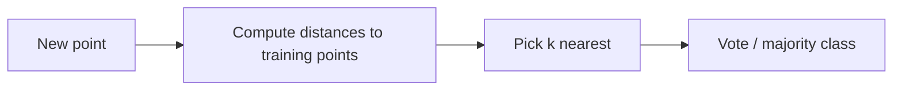

## What you'll learn

- how KNN predicts without ever "training" a model in the usual sense
- the distance formula it actually computes, worked by hand on a tiny example
- why small vs large `k` trades variance for bias
- why feature scaling isn't optional for any distance-based model
- KNN's real costs: slow predictions and the curse of dimensionality

## What KNN does

KNN predicts a label by looking at the **k closest training points** and
taking a majority vote among their labels. There's no cost function to
minimize and no weights to learn — `fit()` on a `KNeighborsClassifier`
just stores the training data. All the actual work happens at
**prediction time**, when it measures distances against every stored point.
This makes KNN a **lazy learner** (also called *instance-based learning*),
in contrast to Logistic Regression or an SVM, which are **eager learners**
that build an explicit model during `fit()` and then predict cheaply.



## The distance calculation, by hand

By default, KNN measures **Euclidean distance** between two points. For two
features, that's just the Pythagorean theorem:

`distance(a, b) = sqrt( (a_1 - b_1)^2 + (a_2 - b_2)^2 + ... )`

Say you have three labeled points and one new point to classify:

- `A = (1, 2)`, label 0
- `B = (2, 3)`, label 0
- `C = (8, 8)`, label 1
- new point `Q = (2, 2)`

```python title="Computing KNN distances by hand" showLineNumbers{1}
import numpy as np

points = {"A": (1, 2), "B": (2, 3), "C": (8, 8)}
labels = {"A": 0, "B": 0, "C": 1}
q = np.array([2, 2])

for name, p in points.items():
    dist = np.linalg.norm(np.array(p) - q)
    print(f"{name}: distance = {dist:.2f}, label = {labels[name]}")

# A: distance = 1.00, label = 0
# B: distance = 1.00, label = 0
# C: distance = 8.49, label = 1
```

With `k=1` or `k=2`, the two closest points (`A` and `B`) both vote label
0, so `Q` is classified as 0. `C` is far away and barely matters — that's
the entire algorithm: measure, sort, vote.

## How to choose k

`k` is the single most important hyperparameter, and it directly controls
the **bias/variance trade-off**:

- **small `k`** (e.g. `k=1`) → the prediction depends on a single nearby
  point, so the decision boundary can be jagged and easily thrown off by one
  mislabeled or noisy point. This is **high variance, low bias** — the model
  fits the training data very closely and can overfit.
- **large `k`** (e.g. `k=50` on a small dataset) → each prediction averages
  over many neighbors, smoothing the boundary out. This is **high bias, low
  variance** — the model can underfit, especially if `k` grows so large it
  starts pulling in points from a completely different region.

In practice you rarely guess `k` — you sweep a range of odd values (odd
avoids tie votes in binary problems) with cross-validation and pick whichever
scores best on held-out data:

```python title="Sweeping k with cross-validation" showLineNumbers{1}
from sklearn.model_selection import cross_val_score
from sklearn.neighbors import KNeighborsClassifier
from sklearn.datasets import load_iris

X, y = load_iris(return_X_y=True)

for k in [1, 3, 5, 11, 21]:
    knn = KNeighborsClassifier(n_neighbors=k)
    scores = cross_val_score(knn, X, y, cv=5)
    print(f"k={k}: {scores.mean():.3f}")

# k=1: 0.960
# k=3: 0.967
# k=5: 0.973
# k=11: 0.980
# k=21: 0.967
```

Notice accuracy rises, peaks, then falls again as `k` grows too large — the
classic bias/variance curve.

## Scaling is critical

KNN uses distances (Euclidean by default), and distance formulas treat every
feature's raw numbers as equally meaningful — they have no idea one column is
"age in years" (0-100) and another is "income in dollars" (0-200,000).

```python title="Unscaled features silently dominate the distance" showLineNumbers{1}
import numpy as np

# feature 1: age (small range), feature 2: income (huge range)
a = np.array([30, 50_000])
b = np.array([32, 51_000])

print(round(np.linalg.norm(a - b), 2))
# 1000.0  -> almost entirely driven by the $1,000 income gap;
# the 2-year age difference barely registers at all
```

A 2-year age gap should matter, but it's completely swamped by the income
gap's raw scale. `StandardScaler` (subtract mean, divide by standard
deviation) puts every feature on the same footing before distances are
computed:

```python title="Always scale before KNN" showLineNumbers{1}
from sklearn.pipeline import Pipeline
from sklearn.preprocessing import StandardScaler
from sklearn.neighbors import KNeighborsClassifier

knn_pipeline = Pipeline([
    ("scaler", StandardScaler()),
    ("model", KNeighborsClassifier(n_neighbors=5)),
])
```

Wrapping the scaler and the model in one `Pipeline` also protects you from a
subtle form of data leakage: fitting `StandardScaler` on the whole dataset
before splitting would let information about the test set's mean/variance
leak into training. Fitting inside a pipeline (or inside each cross-validation
fold) keeps the scaler blind to whatever it hasn't seen yet.

## Pros and cons

Pros:

- simple to understand and explain — "vote with your nearest neighbors"
- no training step at all, so adding new labeled data is instant
- naturally handles multiclass problems, and even multilabel ones (below)
- makes no assumption about the shape of the decision boundary — it can
  follow arbitrarily curvy class regions given enough data

Cons:

- **prediction is slow** on large datasets: a naive KNN has to compare a new
  point against every stored training point (scikit-learn speeds this up with
  tree-based indexes like `KDTree`/`BallTree`, but it's still far from free)
- stores the entire training set in memory
- suffers from the **curse of dimensionality**: as the number of features
  grows, all points start looking roughly equidistant from each other, and
  "nearest" stops being a meaningful concept — KNN tends to need dimensionality
  reduction (PCA) or feature selection first on high-dimensional data
- sensitive to irrelevant features and to class imbalance (a locally dominant
  majority class can out-vote a real nearby minority-class point)

## Common pitfalls

- forgetting to scale features (see above) — this alone can wreck accuracy
- picking an even `k` for a binary problem, which allows tied votes
  (scikit-learn breaks ties by picking whichever class appears first in
  sorted order — not necessarily what you'd want)
- using KNN on very high-dimensional data (hundreds of raw features) without
  reducing dimensionality first
- forgetting that "training" a KNN pipeline is nearly instantaneous, but
  **predicting** is where all the real computational cost lives — the
  opposite of most other classifiers in this phase

## Scikit-learn example

```python title="KNN classifier" showLineNumbers{1}
from sklearn.pipeline import Pipeline
from sklearn.preprocessing import StandardScaler
from sklearn.neighbors import KNeighborsClassifier

knn = Pipeline(
    steps=[
        ("scaler", StandardScaler()),
        ("model", KNeighborsClassifier(n_neighbors=5)),
    ]
)
```

## When KNN is a good baseline

- small to medium datasets
- when decision boundary is not too complex

## Beyond a single label: multilabel classification

Géron's book uses `KNeighborsClassifier` for a nice trick most other
classifiers can't do out of the box: **multilabel classification**, where each
instance gets more than one label at once. His example builds two binary
targets for MNIST digits — "is this digit large (7, 8, or 9)?" and "is this
digit odd?" — stacks them into one array, and fits a single KNN on both:

```python title="One model, two labels at once" showLineNumbers{1}
from sklearn.neighbors import KNeighborsClassifier
import numpy as np

y_train_large = (y_train >= 7)
y_train_odd = (y_train % 2 == 1)
y_multilabel = np.c_[y_train_large, y_train_odd]

knn_clf = KNeighborsClassifier()
knn_clf.fit(X_train, y_multilabel)

knn_clf.predict([some_digit])
# array([[False, True]])  -> not large, and odd: correct for the digit 5
```

:::tip[From the book]
Géron highlights `KNeighborsClassifier` twice for good reason: it's one of the
few classifiers that natively supports **multilabel** outputs (not every
classifier can), and in the book's own exercises, a well-tuned KNN (grid
searching `n_neighbors` and `weights`) is the suggested route to over 97%
accuracy on MNIST — a strong result for such a simple "no training step"
algorithm.
:::

## Mini-checkpoint

Try k = 3, 5, 11 and compare validation performance.

## Visualize it

k-NN doesn't really "learn" — to classify a new point it just finds the `k` closest known
points and takes their **majority vote**. Here the new point (square) is connected to its 5
nearest neighbors and coloured by whichever class wins:

```p5 title="k-NN classifies by neighborhood vote" desc="A query point drifts continuously through the space; it always takes the majority class of its k nearest neighbors, and the vote flips live the moment it crosses into a different neighborhood." height="300"
let pts = [];
let t = 0;
const K = 5;
const cols = [[75, 139, 190], [255, 211, 67]];
function reset() {
  pts = [];
  for (let i = 0; i < 30; i++) {
    const c = i % 2;
    const cx = c === 0 ? 170 : 430;
    pts.push({ x: cx + random(-90, 90), y: random(50, 250), c: c });
  }
}
function setup() {
  createCanvas(600, 300);
  textFont("monospace");
  reset();
}
function draw() {
  background(13, 17, 23);
  const query = {
    x: width / 2 + Math.sin(t * 0.6) * 150,
    y: 150 + Math.cos(t * 0.9) * 95,
  };
  const withD = pts.map((p) => ({ p: p, d: (p.x - query.x) ** 2 + (p.y - query.y) ** 2 }))
    .sort((a, b) => a.d - b.d);
  const near = withD.slice(0, K).map((o) => o.p);
  const v = [0, 0];
  for (const p of near) v[p.c]++;
  const winner = v[0] >= v[1] ? 0 : 1;
  stroke(255, 211, 67, 110);
  strokeWeight(1);
  for (const p of near) line(query.x, query.y, p.x, p.y);
  noStroke();
  for (const p of pts) {
    const isNear = near.indexOf(p) >= 0;
    const col = cols[p.c];
    fill(col[0], col[1], col[2], isNear ? 255 : 110);
    const s = isNear ? 14 : 10;
    ellipse(p.x, p.y, s, s);
  }
  const wc = cols[winner];
  stroke(255);
  strokeWeight(2);
  fill(wc[0], wc[1], wc[2]);
  rect(query.x - 9, query.y - 9, 18, 18, 3);
  noStroke();
  fill(210);
  textSize(12);
  textAlign(CENTER, TOP);
  text("? → class " + (winner === 0 ? "A" : "B") + "  (" + v[0] + " vs " + v[1] + ")", query.x, query.y + 16);
  fill(150);
  textAlign(LEFT, CENTER);
  text("k = " + K, 12, 20);
  t += 0.012;
}
function mousePressed() { reset(); }
```

import DataCampExercise from "../../../../components/DataCampExercise.astro";

## 🧪 Try It Yourself

### Exercise 1 – Train-Test Split

<DataCampExercise
  lang="python"
  hint={`Use \`train_test_split(X, y, test_size=0.2)\` from scikit-learn.`}
  code={`# Task: Exercise 1 – Train-Test Split
from sklearn.model_selection import ___   # replace ___ with train_test_split
import numpy as np

X = np.arange(20).reshape(10, 2)
y = np.arange(10)

X_train, X_test, y_train, y_test = ___(X, y, test_size=0.2, random_state=42)
print("Train size:", len(X_train))
print("Test size:", len(X_test))

# ── Expected Output ───────────────────────────────────────────
# Train size: 8
# Test size: 2
# ──────────────────────────────────────────────────────────────`}
  solution={`from sklearn.model_selection import train_test_split
import numpy as np

X = np.arange(20).reshape(10, 2)
y = np.arange(10)
X_train, X_test, y_train, y_test = train_test_split(X, y, test_size=0.2, random_state=42)
print("Train size:", len(X_train))
print("Test size:", len(X_test))`}
  sct={`test_output_contains("Train size: 8")
test_output_contains("Test size: 2")
success_msg("Data split correctly!")`}
  height={148}
/>

### Exercise 2 – Fit a Linear Model

<DataCampExercise
  lang="python"
  hint={`Call \`model.fit(X_train, y_train)\` then \`model.predict(X_test)\`.`}
  code={`# Task: Exercise 2 – Fit a Linear Model
from sklearn.linear_model import LinearRegression
import numpy as np

X = np.array([[1], [2], [3], [4], [5]])
y = np.array([2, 4, 6, 8, 10])

model = LinearRegression()
model.___(X, y)            # replace ___ with fit
preds = model.___(X)       # replace ___ with predict
print("Predictions:", preds.astype(int))

# ── Expected Output ───────────────────────────────────────────
# Predictions: [ 2  4  6  8 10]
# ──────────────────────────────────────────────────────────────`}
  solution={`from sklearn.linear_model import LinearRegression
import numpy as np

X = np.array([[1], [2], [3], [4], [5]])
y = np.array([2, 4, 6, 8, 10])
model = LinearRegression()
model.fit(X, y)
preds = model.predict(X)
print("Predictions:", preds.astype(int))`}
  sct={`test_output_contains("Predictions:")
success_msg("Model fitted and predictions made!")`}
  height={148}
/>

### Exercise 3 – Evaluate with MSE

<DataCampExercise
  lang="python"
  hint={`Use \`mean_squared_error(y_true, y_pred)\` to measure prediction error.`}
  code={`# Task: Exercise 3 – Evaluate with MSE
from sklearn.metrics import ___   # replace ___ with mean_squared_error
import numpy as np

y_true = np.array([3, 5, 7, 9])
y_pred = np.array([2.8, 5.1, 7.2, 8.9])

mse = ___(y_true, y_pred)         # replace ___ with mean_squared_error
print(f"MSE: {mse:.4f}")

# ── Expected Output ───────────────────────────────────────────
# MSE: 0.0275
# ──────────────────────────────────────────────────────────────`}
  solution={`from sklearn.metrics import mean_squared_error
import numpy as np

y_true = np.array([3, 5, 7, 9])
y_pred = np.array([2.8, 5.1, 7.2, 8.9])
mse = mean_squared_error(y_true, y_pred)
print(f"MSE: {mse:.4f}")`}
  sct={`test_output_contains("MSE:")
success_msg("MSE evaluated successfully!")`}
  height={138}
/>

### Exercise 4 – Classify by Majority Vote

<DataCampExercise
  lang="python"
  hint={`\`KNeighborsClassifier(n_neighbors=3)\` looks at the 3 closest labeled points and predicts their majority class.`}
  code={`# Task: Exercise 4 - Classify by Majority Vote
from sklearn.neighbors import KNeighborsClassifier
import numpy as np

X = np.array([[0, 0], [0, 1], [1, 0], [8, 8], [8, 9], [9, 8]])
y = np.array([0, 0, 0, 1, 1, 1])

knn = KNeighborsClassifier(n_neighbors=___)   # replace ___ with 3
knn.fit(X, y)
print(knn.predict([[7, 7]]))

# ── Expected Output ───────────────────────────────────────────
# [1]
# ──────────────────────────────────────────────────────────────`}
  solution={`from sklearn.neighbors import KNeighborsClassifier
import numpy as np

X = np.array([[0, 0], [0, 1], [1, 0], [8, 8], [8, 9], [9, 8]])
y = np.array([0, 0, 0, 1, 1, 1])

knn = KNeighborsClassifier(n_neighbors=3)
knn.fit(X, y)
print(knn.predict([[7, 7]]))`}
  sct={`test_output_contains("[1]")
success_msg("The new point took on its neighbors' majority class!")`}
  height={168}
/>

## Next

Continue to **Support Vector Machines (SVM)** to see a classifier that instead
of voting, finds the widest possible margin between classes.

