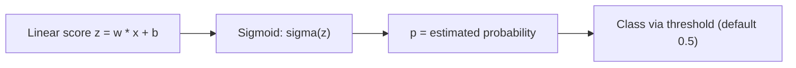

## What you'll learn

- why Logistic Regression is a **classifier**, despite the name
- the sigmoid (logistic) function, and why its output can be read as a probability
- the log loss cost function, and why it's convex (Gradient Descent always finds the minimum)
- decision boundaries in feature space
- **Softmax Regression** for more than two classes at once
- why the threshold matters, and how to tune it

## Why it's called "regression"

Logistic Regression is a **classification** algorithm. Like Linear Regression, it
computes a weighted sum of the input features plus a bias term — but instead of
outputting that sum directly, it squashes it through a **sigmoid** function so the
result always lands between 0 and 1, which can be read as a probability.

## The sigmoid function



The logistic function is:

`σ(t) = 1 / (1 + exp(-t))`

- large positive `t` → `σ(t)` close to 1
- large negative `t` → `σ(t)` close to 0
- `t = 0` → `σ(t) = 0.5`, exactly on the boundary

Once the model estimates a probability `p = σ(x·w + b)`, it predicts:

- `ŷ = 1` if `p ≥ 0.5`
- `ŷ = 0` if `p < 0.5`

Since `σ(t) ≥ 0.5` exactly when `t ≥ 0`, a Logistic Regression model predicts class 1
whenever the raw weighted score is positive, and class 0 when it's negative. That raw
score `t` is called the **logit**, or **log-odds**.

```p5 title="The sigmoid curve" desc="As the linear score z moves left to right, the sigmoid squashes it into a probability between 0 and 1; the dot traces the current point and its probability." height="280"
let z = -6;
let dir = 1;
function setup() {
  createCanvas(600, 280);
  textFont("monospace");
}
function sigmoid(t) { return 1 / (1 + Math.exp(-t)); }
function draw() {
  background(13, 17, 23);
  const gx = 50, gw = width - 100, gy = 24, gh = height - 64;
  const px = (t) => gx + (t + 6) / 12 * gw;
  const py = (p) => gy + gh - p * gh;
  stroke(60, 70, 84);
  strokeWeight(1);
  line(gx, py(0.5), gx + gw, py(0.5));
  line(px(0), gy, px(0), gy + gh);
  noFill();
  stroke(75, 139, 190);
  strokeWeight(2.5);
  beginShape();
  for (let t = -6; t <= 6; t += 0.15) vertex(px(t), py(sigmoid(t)));
  endShape();
  noStroke();
  const p = sigmoid(z);
  fill(255, 211, 67);
  ellipse(px(z), py(p), 12, 12);
  fill(210);
  textSize(12);
  textAlign(LEFT, TOP);
  text("z = " + z.toFixed(2) + "   sigma(z) = " + p.toFixed(3) + (p >= 0.5 ? "  -> class 1" : "  -> class 0"), 12, 8);
  z += dir * 0.05;
  if (z > 6 || z < -6) dir *= -1;
}
```

## Training: log loss

There's no closed-form solution for the parameters that minimize the cost — but the
cost function (called **log loss**) is convex, so Gradient Descent is guaranteed to
find the global minimum:

`cost = -log(p)` if `y = 1`, or `-log(1 - p)` if `y = 0`

This makes sense: `-log(p)` explodes as `p → 0`, so the model is heavily penalized for
being confidently wrong on a positive instance (and symmetrically for negatives).

## Decision boundaries: the iris example

Géron's book illustrates this with the iris dataset — detecting *Iris virginica* from
petal width alone:

```python title="Logistic Regression on the iris dataset" showLineNumbers{1}
import numpy as np
from sklearn import datasets
from sklearn.linear_model import LogisticRegression

iris = datasets.load_iris()
X = iris["data"][:, 3:]              # petal width only
y = (iris["target"] == 2).astype(int)  # 1 if Iris virginica, else 0

log_reg = LogisticRegression()
log_reg.fit(X, y)

print(log_reg.predict([[1.7], [1.5]]))
# [1 0]  -> the decision boundary sits around 1.6 cm

print(log_reg.predict_proba([[2.0]]))
# [[0.187 0.813]]  -> 81.3% confident it's Iris virginica
```

Above about 2 cm the model is highly confident it's *Iris virginica*; below 1 cm it's
highly confident it's not. In between, it's genuinely unsure — the decision boundary
sits wherever the estimated probability crosses 0.5.

Just like other linear models, Logistic Regression can be regularized. Scikit-Learn
adds an ℓ2 penalty by default, controlled by `C` — the *inverse* of regularization
strength (a **higher** `C` means **less** regularization, unlike `alpha` elsewhere).

## Multiclass: Softmax Regression

Logistic Regression generalizes directly to multiple classes without needing to
combine several binary classifiers. This is called **Softmax Regression** (or
Multinomial Logistic Regression).

For an instance `x`, the model computes one score per class, then normalizes all the
scores with the softmax function so they sum to 1:

`p_k = exp(s_k(x)) / Σ_j exp(s_j(x))`

The predicted class is simply the one with the highest probability (equivalently, the
highest raw score) — `argmax_k p_k`.

```python title="Softmax Regression on all three iris classes" showLineNumbers{1}
from sklearn import datasets
from sklearn.linear_model import LogisticRegression

iris = datasets.load_iris()
X = iris["data"][:, (2, 3)]  # petal length, petal width
y = iris["target"]           # all 3 classes: 0, 1, 2

softmax_reg = LogisticRegression(C=10, max_iter=1000)
softmax_reg.fit(X, y)

print(softmax_reg.predict([[5, 2]]))
# [2]  -> predicted class: Iris virginica

print(softmax_reg.predict_proba([[5, 2]]).round(3))
# [[0.    0.057 0.943]]  -> 94.3% confident
```

Softmax Regression predicts only **one** class per instance (it's multiclass, not
multioutput) — use it only for mutually exclusive classes. Its cost function is called
**cross entropy**, which reduces to ordinary log loss when there are exactly 2 classes.

## Threshold tuning matters

The default threshold is 0.5, but for imbalanced problems (fraud, disease screening)
you'll often move it deliberately:

- **lower** the threshold to catch more positives (increase recall)
- **raise** the threshold to reduce false alarms (increase precision)

The **The ROC Curve and AUC** and **Precision, Recall, and F1-Score** pages later in
this phase cover exactly how to choose that threshold.

:::tip[From the book]
Géron notes the score `t = w·x + b` fed into the sigmoid is called the **logit**, the
inverse of the logistic function: `logit(p) = log(p / (1 - p))`. It's also called the
**log-odds** — the log of the ratio between the probability of the positive class and
the probability of the negative class. Understanding the logit is the key to
understanding why Logistic Regression's decision boundary is always linear.
:::

## Mini-checkpoint

If missing fraud is expensive, do you optimize for precision or recall?

(Usually recall — you'd rather flag a few extra false alarms than miss real fraud.)

import DataCampExercise from "../../../../components/DataCampExercise.astro";

## 🧪 Try It Yourself

### Exercise 1 – Compute the Sigmoid

<DataCampExercise
  lang="python"
  hint={`The sigmoid is \`1 / (1 + np.exp(-z))\`.`}
  code={`# Task: Exercise 1 - Compute the Sigmoid
import numpy as np

def sigmoid(z):
    return 1 / (1 + np.___(-z))   # replace ___ with exp

print(round(sigmoid(0), 3))
print(round(sigmoid(4), 3))

# ── Expected Output ───────────────────────────────────────────
# 0.5
# 0.982
# ──────────────────────────────────────────────────────────────`}
  solution={`import numpy as np

def sigmoid(z):
    return 1 / (1 + np.exp(-z))

print(round(sigmoid(0), 3))
print(round(sigmoid(4), 3))`}
  sct={`test_output_contains("0.5")
test_output_contains("0.982")
success_msg("You implemented the logistic function from scratch!")`}
  height={148}
/>

### Exercise 2 – Fit a LogisticRegression Classifier

<DataCampExercise
  lang="python"
  hint={`Call \`log_reg.fit(X, y)\`, then \`log_reg.predict(X_new)\` for labels.`}
  code={`# Task: Exercise 2 - Fit a LogisticRegression Classifier
from sklearn.linear_model import LogisticRegression
import numpy as np

X = np.array([[0.1], [0.4], [1.2], [1.6], [2.5], [3.0]])
y = np.array([0, 0, 0, 1, 1, 1])

log_reg = LogisticRegression()
log_reg.___(X, y)          # replace ___ with fit
print(log_reg.predict([[0.2], [2.8]]))

# ── Expected Output ───────────────────────────────────────────
# [0 1]
# ──────────────────────────────────────────────────────────────`}
  solution={`from sklearn.linear_model import LogisticRegression
import numpy as np

X = np.array([[0.1], [0.4], [1.2], [1.6], [2.5], [3.0]])
y = np.array([0, 0, 0, 1, 1, 1])
log_reg = LogisticRegression()
log_reg.fit(X, y)
print(log_reg.predict([[0.2], [2.8]]))`}
  sct={`test_output_contains("[0 1]")
success_msg("The classifier learned the decision boundary!")`}
  height={158}
/>

### Exercise 3 – Read Class Probabilities

<DataCampExercise
  lang="python"
  hint={`\`predict_proba(X)\` returns one probability column per class — use \`[:, 1]\` for the positive class.`}
  code={`# Task: Exercise 3 - Read Class Probabilities
from sklearn.linear_model import LogisticRegression
import numpy as np

X = np.array([[0.1], [0.4], [1.2], [1.6], [2.5], [3.0]])
y = np.array([0, 0, 0, 1, 1, 1])
log_reg = LogisticRegression()
log_reg.fit(X, y)

proba = log_reg.___(X)[:, 1]   # replace ___ with predict_proba
print((proba > 0.5).sum(), "instances predicted positive")

# ── Expected Output ───────────────────────────────────────────
# 3 instances predicted positive
# ──────────────────────────────────────────────────────────────`}
  solution={`from sklearn.linear_model import LogisticRegression
import numpy as np

X = np.array([[0.1], [0.4], [1.2], [1.6], [2.5], [3.0]])
y = np.array([0, 0, 0, 1, 1, 1])
log_reg = LogisticRegression()
log_reg.fit(X, y)
proba = log_reg.predict_proba(X)[:, 1]
print((proba > 0.5).sum(), "instances predicted positive")`}
  sct={`test_output_contains("3 instances predicted positive")
success_msg("You read probabilities straight from the model!")`}
  height={158}
/>

## Next

Continue to **K-Nearest Neighbors (KNN)** — a classifier with no training step at all,
that decides purely by looking at the closest labeled points.
